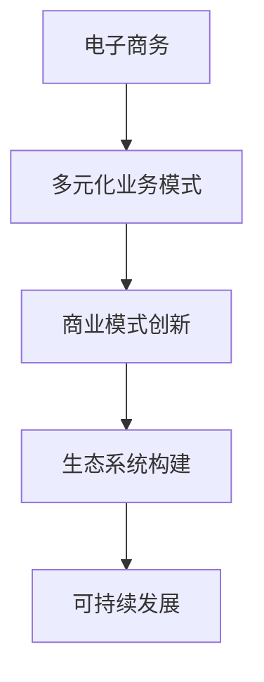

# 电商业务和多元化业务模式

## 1. 背景介绍

### 1.1 问题的由来

在当今瞬息万变的商业环境中,电子商务(电商)已经成为一种不可或缺的商业模式。随着互联网和移动技术的不断发展,消费者的购买习惯和期望也在不断演变。为了满足消费者日益增长的需求,电商企业不得不寻求新的业务模式和收入来源,以保持竞争力。

传统的电商模式过于单一,主要依赖商品销售获取收益。然而,这种单一模式存在着诸多弊端,例如利润率较低、用户粘性不足等。因此,电商企业开始探索多元化业务模式,以期获得更多收益来源,提高用户粘性,并实现可持续发展。

### 1.2 研究现状

目前,许多电商巨头已经开始尝试多元化业务模式。例如,亚马逊不仅提供电商服务,还拥有云计算、流媒体视频、人工智能助手等多元化业务;阿里巴巴集团除了电商业务外,还涉足金融、物流、云计算等领域。这些多元化业务模式不仅为企业带来了新的收入来源,也为用户提供了更加丰富的服务体验。

然而,多元化业务模式的实施并非一蹴而就,它需要企业具备强大的资源整合能力、创新能力和风险管控能力。同时,如何在多元化业务中实现协同效应,提高整体运营效率,也是一个亟待解决的问题。

### 1.3 研究意义

探索电商业务和多元化业务模式,对于电商企业的可持续发展具有重要意义。通过多元化业务模式,企业可以降低单一业务风险,实现收益多元化,提高抗风险能力。同时,多元化业务模式也有助于提高用户粘性,增强用户体验,从而巩固企业的市场地位。

此外,研究多元化业务模式的实施路径和关键技术,可以为电商企业提供宝贵的经验和指导,帮助企业顺利实现业务转型和创新。

### 1.4 本文结构

本文将从以下几个方面深入探讨电商业务和多元化业务模式:

1. 核心概念与联系
2. 核心算法原理与具体操作步骤
3. 数学模型和公式详细讲解与举例说明
4. 项目实践:代码实例和详细解释说明
5. 实际应用场景
6. 工具和资源推荐
7. 总结:未来发展趋势与挑战
8. 附录:常见问题与解答

## 2. 核心概念与联系

在探讨电商业务和多元化业务模式之前,我们需要先了解一些核心概念及其之间的联系。

### 2.1 电子商务(E-Commerce)

电子商务是指通过互联网或其他电子手段进行商品和服务的交易活动。它包括多种业务模式,如B2C(企业对个人)、B2B(企业对企业)、C2C(个人对个人)等。电商的核心是利用信息技术实现商品和服务的在线交易。

### 2.2 多元化业务模式

多元化业务模式是指企业在原有主营业务的基础上,拓展其他不同类型的业务,以实现收益多元化和风险分散。多元化业务模式可以分为以下几种类型:

1. **相关多元化**: 新业务与原有业务存在一定关联,可以实现协同效应。例如,电商企业拓展物流业务。

2. **非相关多元化**: 新业务与原有业务没有直接关联。例如,电商企业拓展金融业务。

3. **垂直一体化**: 企业向上游或下游延伸业务,控制整个产业链。例如,电商企业自建物流系统。

4. **水平一体化**: 企业在同一产业链的同一层级拓展业务。例如,电商企业并购同行业公司。

### 2.3 商业模式创新

商业模式创新是指企业通过重新设计商业模式的关键要素(如价值主张、收益模式、资源配置等),从而创造新的价值并获得竞争优势。多元化业务模式的实施往往需要进行商业模式创新,以适应新业务的特点和需求。

### 2.4 生态系统构建

生态系统构建是指企业通过整合上下游合作伙伴、提供者和用户,建立一个互利共赢的开放式商业生态系统。在多元化业务模式中,构建生态系统可以实现资源共享、协同效应,提高整体运营效率。

### 2.5 核心概念关系

以上核心概念之间存在密切的联系,如下图所示:

电子商务是多元化业务模式的基础,多元化业务模式需要进行商业模式创新,而商业模式创新又需要构建生态系统,最终实现企业的可持续发展。

## 3. 核心算法原理与具体操作步骤

在实施多元化业务模式时,我们需要借助一些核心算法和方法论,以指导整个过程。本节将介绍其中的核心算法原理和具体操作步骤。

### 3.1 算法原理概述

#### 3.1.1 商业模式画布(Business Model Canvas)

商业模式画布是一种用于描述、设计和创新商业模式的工具。它将商业模式分为九个基本构建模块,包括价值主张、客户群、渠道、客户关系、收入来源、关键资源、关键活动、关键合作伙伴和成本结构。通过填写这九个模块,企业可以清晰地描述和设计自己的商业模式。

商业模式画布在多元化业务模式的实施中起着重要作用。它可以帮助企业分析新业务的商业模式,识别关键要素,并进行优化和创新。

#### 3.1.2 蓝海战略(Blue Ocean Strategy)

蓝海战略是一种创新的商业战略理论,旨在帮助企业开拓全新的市场空间(蓝海),而不是在已有的红海市场中激烈竞争。它包括四个核心步骤:

1. 消除行业中无关紧要的因素
2. 减少行业中过度供给的因素
3. 提升行业中被忽视的因素
4. 创造全新的需求因素

蓝海战略可以为企业实施多元化业务模式提供指导,帮助企业发现新的市场空间,创造新的价值主张,避免同质化竞争。

#### 3.1.3 精益创业(Lean Startup)

精益创业是一种创业方法论,强调通过快速迭代和验证来降低风险,提高成功率。它包括三个核心步骤:

1. 构建最小可行产品(MVP)
2. 测试和验证假设
3. 根据反馈进行迭代

在多元化业务模式的实施过程中,企业可以借鉴精益创业的思路,快速构建MVP,验证新业务的假设和商业模式,并根据反馈进行调整和优化。这有助于降低风险,提高新业务的成功率。

### 3.2 算法步骤详解

基于上述核心算法原理,我们可以总结出实施多元化业务模式的具体操作步骤:

1. **确定战略方向**: 企业需要明确自身的战略目标和发展方向,评估是否需要实施多元化业务模式。

2. **市场和机会分析**: 对潜在的新业务领域进行深入分析,识别市场机会和潜在风险。可以借助商业模式画布和蓝海战略等工具。

3. **设计商业模式**: 针对新业务,设计合适的商业模式,包括价值主张、收益模式、资源配置等要素。可以使用商业模式画布进行设计和创新。

4. **构建最小可行产品(MVP)**: 根据设计的商业模式,快速构建MVP,以验证关键假设和商业模式的可行性。

5. **测试和迭代**: 通过小规模试点或A/B测试等方式,测试MVP的市场反馈,并根据反馈进行迭代和优化。

6. **资源整合和生态系统构建**: 整合内外部资源,与合作伙伴建立生态系统,实现资源共享和协同效应。

7. **运营优化和风险管控**: 持续优化新业务的运营流程,并建立风险管控机制,确保业务的健康发展。

8. **评估和调整**: 定期评估新业务的表现,根据市场变化和内外部环境进行战略调整。

### 3.3 算法优缺点

上述算法在指导多元化业务模式实施过程中具有以下优点:

- 系统性: 从战略制定、商业模式设计到实施和优化,提供了一个完整的系统性流程。

- 灵活性: 借鉴了多种先进方法论,具有较强的灵活性和适应性。

- 风险控制: 强调快速迭代和验证,有助于降低风险,提高成功率。

- 创新性: 注重商业模式创新和蓝海战略,有利于企业开拓新的市场空间。

然而,该算法也存在一些缺点和局限性:

- 复杂性: 涉及多种方法论和步骤,对企业的管理能力要求较高。

- 资源需求: 实施过程需要大量的资源投入,对中小企业可能存在一定障碍。

- 文化障碍: 创新和变革往往会遇到企业内部的文化障碍和阻力。

- 外部环境: 算法无法完全预测和应对外部环境的变化和不确定性。

### 3.4 算法应用领域

上述算法可以广泛应用于各种行业和领域的企业,指导它们实施多元化业务模式。以下是一些典型的应用场景:

- 电商企业: 电商巨头可以借助该算法拓展云计算、物流、金融等多元化业务。

- 制造业: 传统制造企业可以通过该算法探索服务型制造、数字化转型等新业务模式。

- 金融业: 银行和金融机构可以利用该算法开拓fintech、大数据等新兴金融业务。

- 零售业: 零售商可以借鉴该算法,实现线上线下一体化、会员制等新业务模式。

- 文化娱乐业: 该算法可以指导传统娱乐企业拓展新媒体、IP衍生品等新业务。

总的来说,任何希望实现业务多元化和创新的企业,都可以借鉴该算法的思路和方法。

## 4. 数学模型和公式详细讲解与举例说明

在探讨多元化业务模式时,我们需要借助一些数学模型和公式来量化和优化相关决策。本节将详细介绍其中的几个核心模型和公式。

### 4.1 数学模型构建

#### 4.1.1 多元化程度模型

多元化程度模型用于衡量企业多元化业务的程度。常用的指标包括熵指数和赫芬达尔指数。

熵指数(Entropy Index)定义如下:

$$E = \sum_{i=1}^{n}P_i\ln(1/P_i)$$

其中,n为企业的业务数量,$P_i$为第i项业务的销售收入占总销售收入的比重。熵指数越大,表明企业的多元化程度越高。

赫芬达尔指数(Herfindahl Index)定义如下:

$$H = \sum_{i=1}^{n}P_i^2$$

$P_i$的含义与熵指数相同。赫芬达尔指数越小,表明企业的多元化程度越高。

#### 4.1.2 业务相关性模型

业务相关性模型用于衡量企业不同业务之间的相关程度,从而评估多元化策略的合理性。常用的指标包括资源共享指数和技术相似性指数。

资源共享指数(Resource Sharing Index)定义如下:

$$RSI_{ij} = \frac{\sum_{k=1}^{m}w_k\min(R_{ik},R_{jk})}{\sum_{k=1}^{m}w_kR_{ik}}$$

其中,$RSI_{ij}$表示业务i和业务j之间的资源共享指数,m为资源种类数量,$w_k$为第k种资源