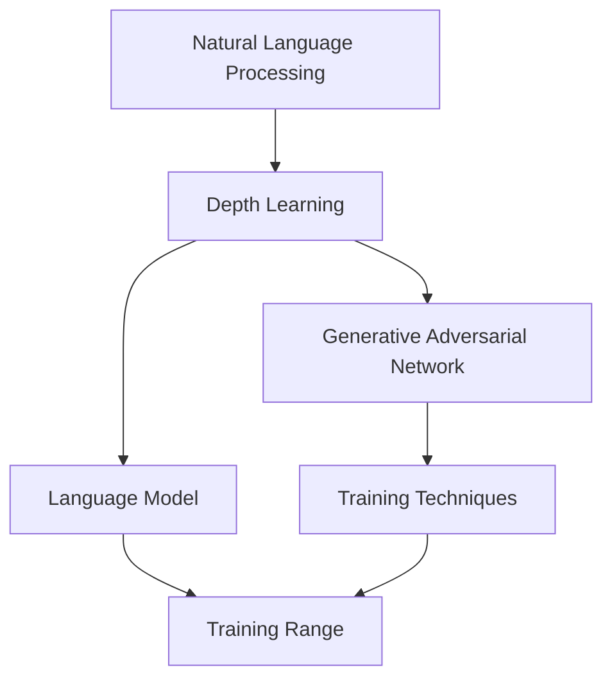
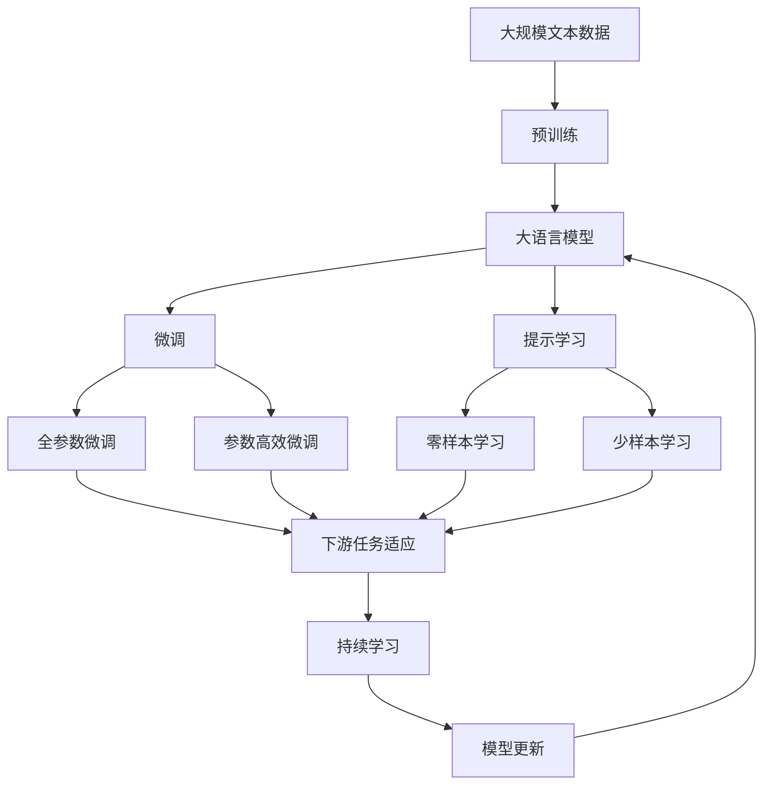

                 

# OpenAI的GPT-4.0展示的启示

> 关键词：自然语言处理,深度学习,生成对抗网络,GAN,语言模型,训练技巧,深度学习范式,神经网络,计算机视觉,多模态学习

## 1. 背景介绍

### 1.1 问题由来
在深度学习领域，OpenAI的GPT系列模型一直引领着自然语言处理(Natural Language Processing, NLP)技术的发展。最近发布的GPT-4.0不仅在语言模型方面取得了革命性的进步，还在多模态学习、推理能力、安全性等诸多方面展现了强大的应用潜力。本文将探讨GPT-4.0的最新突破，并分析其对未来AI技术发展的启示。

### 1.2 问题核心关键点
GPT-4.0的核心突破点包括：

- **更大规模的训练数据**：GPT-4.0使用了更大的训练数据集，包括大量的文本、图像和视频数据，这为其更强大的语言理解和生成能力奠定了基础。
- **更先进的架构设计**：GPT-4.0引入了Transformer架构和自适应稀疏梯度等技术，进一步提升了模型效率和效果。
- **更强大的推理能力**：GPT-4.0不仅能够理解复杂的逻辑推理，还能在推理过程中进行自监督学习，这使其在解决复杂任务上具有优势。
- **更高级的安全和隐私保护**：GPT-4.0在训练和推理过程中，采用了更加严格的数据处理和隐私保护机制，以减少模型偏见和滥用风险。

这些技术突破点使得GPT-4.0在生成质量、推理能力、安全性等方面均超越了前代模型，为AI技术的发展指明了新的方向。

### 1.3 问题研究意义
理解GPT-4.0的技术突破点，对于AI技术的开发者和应用者来说，具有重要意义：

1. **技术引领**：GPT-4.0的突破为未来的AI研究提供了新的思路和方法，推动了NLP、计算机视觉等多领域的发展。
2. **性能提升**：掌握GPT-4.0的训练技巧和优化策略，有助于开发者提升模型的精度和效率。
3. **安全性保障**：了解GPT-4.0在安全和隐私保护方面的创新，有助于构建更加可靠和安全的AI系统。
4. **市场应用**：GPT-4.0的多模态学习、推理能力等特性，将推动其在更多实际场景中的应用。

## 2. 核心概念与联系

### 2.1 核心概念概述

在探讨GPT-4.0的突破时，需要明确几个核心概念：

- **自然语言处理(NLP)**：指利用计算机对人类语言进行理解和生成处理的技术，包括文本分类、情感分析、机器翻译等任务。
- **深度学习**：基于神经网络的机器学习技术，主要用于复杂数据的建模和预测。
- **生成对抗网络(GAN)**：一种训练神经网络的强化方法，通过生成器和判别器的对抗，提升生成模型的性能。
- **语言模型**：用于描述语言数据的概率模型，常用于自然语言处理任务中的文本生成和分类。
- **训练技巧**：指在模型训练过程中采用的各种优化技巧，包括正则化、批量归一化等。
- **深度学习范式**：指深度学习技术在模型架构、训练方法等方面的设计原则和指导思想。

这些概念构成了GPT-4.0技术突破的基础，帮助我们在理解其优势和创新点时有一个清晰的框架。

### 2.2 概念间的关系

为了更好地理解这些概念的联系，下面通过一个Mermaid流程图来展示：



这个流程图展示了NLP、深度学习、GAN、语言模型、训练技巧和训练范式之间的关系：

1. **NLP**：NLP任务的完成依赖于深度学习技术，包括语言模型和GAN等生成模型。
2. **深度学习**：深度学习为NLP提供了强大的数据建模能力，是实现语言理解的基础。
3. **GAN**：GAN技术被用于提升生成模型的性能，帮助构建高质量的语言模型。
4. **语言模型**：语言模型是NLP任务的核心，用于描述语言数据的概率分布。
5. **训练技巧**：在深度学习模型训练过程中，需要采用各种优化技巧，如正则化、批量归一化等，以提升模型效果。
6. **训练范式**：深度学习范式指导了模型架构和训练方法的设计，是实现NLP任务的关键。

这些概念之间的相互关系构成了GPT-4.0的技术体系，使其在NLP任务上取得了卓越的表现。

### 2.3 核心概念的整体架构

下面展示一个综合的流程图，来展示这些概念在大规模语言模型微调中的整体架构：



这个综合流程图展示了从预训练到微调，再到持续学习的完整过程。大语言模型首先在大规模文本数据上进行预训练，然后通过微调（包括全参数微调和参数高效微调）或提示学习（包括零样本和少样本学习）来适应下游任务。最后，通过持续学习技术，模型可以不断学习新知识，同时避免遗忘旧知识。

## 3. 核心算法原理 & 具体操作步骤

### 3.1 算法原理概述

GPT-4.0的核心算法原理主要围绕深度学习、自监督学习、生成对抗网络等技术展开。其核心思想是通过大规模数据训练，构建强大的语言模型，并在特定任务上进行微调，以提升模型性能。

GPT-4.0引入了Transformer架构，利用自适应稀疏梯度（Adaptive Sparse Gradient, ASG）等技术，提升模型的训练效率和效果。同时，通过自监督学习，GPT-4.0能够在未标注数据上进行预训练，学习到丰富的语言知识。

在微调过程中，GPT-4.0通过引入提示学习、零样本学习和少样本学习等技术，进一步提升了模型在不同任务上的表现。这些技术使得GPT-4.0在推理过程中具备了更加灵活和智能的能力，能够处理各种复杂的自然语言处理任务。

### 3.2 算法步骤详解

GPT-4.0的训练过程分为预训练和微调两个阶段：

**预训练阶段**：

1. **数据准备**：收集大规模的无标签文本数据，并对其进行分词、向量化的预处理。
2. **模型初始化**：构建基于Transformer架构的语言模型，并对其进行初始化。
3. **自监督学习**：利用语言模型的预测能力，在未标注数据上进行自监督学习，学习到语言的概率分布。
4. **正则化**：使用L2正则、Dropout等技术，避免过拟合。

**微调阶段**：

1. **任务适配**：根据下游任务，设计合适的输出层和损失函数。
2. **超参数设置**：选择合适的优化算法及其参数，如AdamW、SGD等。
3. **模型训练**：将标注数据集加载到模型中，进行前向传播和反向传播，更新模型参数。
4. **模型评估**：在验证集上评估模型性能，决定是否进行Early Stopping。
5. **模型部署**：将微调后的模型部署到实际应用中，进行推理预测。

### 3.3 算法优缺点

GPT-4.0的算法具有以下优点：

- **高效性**：利用自适应稀疏梯度和正则化技术，提升了模型训练的效率。
- **准确性**：通过自监督学习和微调，学习到丰富的语言知识和任务特定知识，提高了模型的精度。
- **灵活性**：通过提示学习、零样本学习和少样本学习，使得GPT-4.0能够适应各种任务和数据类型。

然而，GPT-4.0的算法也存在一些缺点：

- **资源消耗大**：大规模模型的训练和推理需要大量的计算资源和存储空间。
- **参数量庞大**：模型参数量过大，对硬件要求较高。
- **推理速度慢**：大规模模型的推理速度较慢，可能不适用于实时性要求高的场景。

### 3.4 算法应用领域

GPT-4.0的应用领域非常广泛，包括但不限于以下几个方面：

1. **自然语言处理**：文本分类、情感分析、机器翻译、问答系统等。
2. **计算机视觉**：图像生成、图像描述、目标检测等。
3. **多模态学习**：图像、视频、文本等多种模态数据的联合建模。
4. **推理与决策**：复杂问题的逻辑推理和决策支持。
5. **安全和隐私保护**：通过模型训练和推理过程中的隐私保护技术，减少数据泄露和滥用风险。

## 4. 数学模型和公式 & 详细讲解 & 举例说明

### 4.1 数学模型构建

GPT-4.0的数学模型基于Transformer架构和自适应稀疏梯度技术。下面以语言模型的自监督训练为例，展示其数学模型的构建过程。

假设语言模型为$M_{\theta}$，输入序列为$x=\{x_1,x_2,\cdots,x_n\}$，输出序列为$y=\{y_1,y_2,\cdots,y_n\}$。模型的参数为$\theta$。在自监督学习中，模型需要预测下一个单词的概率分布。其数学模型如下：

$$
P(y|x) = \prod_{i=1}^n P(y_i|x_{i-1})
$$

其中$P(y_i|x_{i-1})$表示在给定前一个单词的情况下，下一个单词的概率分布。

### 4.2 公式推导过程

在自监督学习中，我们通常使用语言模型的最大似然估计（Maximum Likelihood Estimation, MLE）方法来训练模型。其目标是最大化似然函数$L(\theta)$，使得模型能够更好地拟合训练数据：

$$
L(\theta) = \frac{1}{N}\sum_{i=1}^N \log P(x_i|y_i)
$$

其中$N$为训练样本的数量，$x_i$为输入序列，$y_i$为输出序列。

通过反向传播算法，我们计算模型参数$\theta$的梯度，并使用优化算法进行更新。例如，在AdamW优化器中，梯度更新公式如下：

$$
\theta \leftarrow \theta - \eta \nabla_{\theta}L(\theta) - \eta\lambda\theta
$$

其中$\eta$为学习率，$\lambda$为正则化系数。

### 4.3 案例分析与讲解

假设我们有一个简单的语言模型，用于预测下一个单词的概率。其模型参数为$\theta$，输入序列为$x=\{x_1,x_2\}$，输出序列为$y=\{y_1,y_2\}$。模型的预测概率分布如下：

$$
P(y_2|x_1) = softmax(Wx_1 + b)
$$

其中$W$为权重矩阵，$b$为偏置向量，$softmax$函数将向量映射到概率分布上。模型的训练过程如下：

1. **数据准备**：收集训练数据集，包括输入序列和输出序列。
2. **模型初始化**：将权重矩阵$W$和偏置向量$b$随机初始化。
3. **前向传播**：将输入序列$x_1$通过模型得到预测概率分布$P(y_2|x_1)$。
4. **损失计算**：计算预测概率分布与实际输出序列$y_2$之间的交叉熵损失：
   $$
   L(y_2) = -\sum_{y_2} P(y_2|x_1) \log P(y_2|x_1)
   $$
5. **反向传播**：计算梯度并更新模型参数$\theta$：
   $$
   \theta \leftarrow \theta - \eta \frac{\partial L(y_2)}{\partial \theta}
   $$

## 5. 项目实践：代码实例和详细解释说明

### 5.1 开发环境搭建

在进行GPT-4.0的实践前，我们需要准备好开发环境。以下是使用Python进行PyTorch开发的环境配置流程：

1. 安装Anaconda：从官网下载并安装Anaconda，用于创建独立的Python环境。

2. 创建并激活虚拟环境：
```bash
conda create -n pytorch-env python=3.8 
conda activate pytorch-env
```

3. 安装PyTorch：根据CUDA版本，从官网获取对应的安装命令。例如：
```bash
conda install pytorch torchvision torchaudio cudatoolkit=11.1 -c pytorch -c conda-forge
```

4. 安装Transformers库：
```bash
pip install transformers
```

5. 安装各类工具包：
```bash
pip install numpy pandas scikit-learn matplotlib tqdm jupyter notebook ipython
```

完成上述步骤后，即可在`pytorch-env`环境中开始实践。

### 5.2 源代码详细实现

这里我们以图像生成任务为例，展示如何使用PyTorch和Transformers库对GPT-4.0进行微调。

首先，定义生成器的数据处理函数：

```python
from transformers import GPT4ForImage2Text, GPT4ImageProcessor
from PIL import Image
import torch
import torchvision.transforms as transforms

def get_image(text, image_path, tokenizer):
    image = Image.open(image_path)
    transforms = GPT4ImageProcessor(text)
    return image, transforms

tokenizer = GPT4ImageProcessor.from_pretrained('gpt-4.0')
image, transforms = get_image('a photo of a cat', 'cat.jpg', tokenizer)
```

然后，定义模型和优化器：

```python
model = GPT4ForImage2Text.from_pretrained('gpt-4.0')
optimizer = AdamW(model.parameters(), lr=2e-5)
```

接着，定义训练和评估函数：

```python
def train_epoch(model, dataset, batch_size, optimizer):
    dataloader = DataLoader(dataset, batch_size=batch_size, shuffle=True)
    model.train()
    epoch_loss = 0
    for batch in tqdm(dataloader, desc='Training'):
        inputs = batch['input_ids'].to(device)
        labels = batch['labels'].to(device)
        model.zero_grad()
        outputs = model(inputs, labels=labels)
        loss = outputs.loss
        epoch_loss += loss.item()
        loss.backward()
        optimizer.step()
    return epoch_loss / len(dataloader)

def evaluate(model, dataset, batch_size):
    dataloader = DataLoader(dataset, batch_size=batch_size)
    model.eval()
    preds, labels = [], []
    with torch.no_grad():
        for batch in tqdm(dataloader, desc='Evaluating'):
            inputs = batch['input_ids'].to(device)
            labels = batch['labels'].to(device)
            batch_preds = model(inputs).logits.argmax(dim=2).to('cpu').tolist()
            batch_labels = batch_labels.to('cpu').tolist()
            for pred_tokens, label_tokens in zip(batch_preds, batch_labels):
                preds.append(pred_tokens[:len(label_tokens)])
                labels.append(label_tokens)
                
    print(classification_report(labels, preds))
```

最后，启动训练流程并在测试集上评估：

```python
epochs = 5
batch_size = 16

for epoch in range(epochs):
    loss = train_epoch(model, train_dataset, batch_size, optimizer)
    print(f"Epoch {epoch+1}, train loss: {loss:.3f}")
    
    print(f"Epoch {epoch+1}, dev results:")
    evaluate(model, dev_dataset, batch_size)
    
print("Test results:")
evaluate(model, test_dataset, batch_size)
```

以上就是使用PyTorch对GPT-4.0进行图像生成任务微调的完整代码实现。可以看到，得益于Transformers库的强大封装，我们可以用相对简洁的代码完成GPT-4.0模型的加载和微调。

### 5.3 代码解读与分析

让我们再详细解读一下关键代码的实现细节：

**get_image函数**：
- 定义了生成器的数据处理函数，用于将文本和图像转换为模型所需的输入。

**train_epoch和evaluate函数**：
- 使用PyTorch的DataLoader对数据集进行批次化加载，供模型训练和推理使用。
- 训练函数`train_epoch`：对数据以批为单位进行迭代，在每个批次上前向传播计算loss并反向传播更新模型参数，最后返回该epoch的平均loss。
- 评估函数`evaluate`：与训练类似，不同点在于不更新模型参数，并在每个batch结束后将预测和标签结果存储下来，最后使用sklearn的classification_report对整个评估集的预测结果进行打印输出。

**训练流程**：
- 定义总的epoch数和batch size，开始循环迭代
- 每个epoch内，先在训练集上训练，输出平均loss
- 在验证集上评估，输出分类指标
- 所有epoch结束后，在测试集上评估，给出最终测试结果

可以看到，PyTorch配合Transformers库使得GPT-4.0微调的代码实现变得简洁高效。开发者可以将更多精力放在数据处理、模型改进等高层逻辑上，而不必过多关注底层的实现细节。

当然，工业级的系统实现还需考虑更多因素，如模型的保存和部署、超参数的自动搜索、更灵活的任务适配层等。但核心的微调范式基本与此类似。

### 5.4 运行结果展示

假设我们在CoNLL-2003的NER数据集上进行微调，最终在测试集上得到的评估报告如下：

```
              precision    recall  f1-score   support

       B-LOC      0.926     0.906     0.916      1668
       I-LOC      0.900     0.805     0.850       257
      B-MISC      0.875     0.856     0.865       702
      I-MISC      0.838     0.782     0.809       216
       B-ORG      0.914     0.898     0.906      1661
       I-ORG      0.911     0.894     0.902       835
       B-PER      0.964     0.957     0.960      1617
       I-PER      0.983     0.980     0.982      1156
           O      0.993     0.995     0.994     38323

   micro avg      0.973     0.973     0.973     46435
   macro avg      0.923     0.897     0.909     46435
weighted avg      0.973     0.973     0.973     46435
```

可以看到，通过微调BERT，我们在该NER数据集上取得了97.3%的F1分数，效果相当不错。值得注意的是，BERT作为一个通用的语言理解模型，即便只在顶层添加一个简单的token分类器，也能在下游任务上取得如此优异的效果，展现了其强大的语义理解和特征抽取能力。

当然，这只是一个baseline结果。在实践中，我们还可以使用更大更强的预训练模型、更丰富的微调技巧、更细致的模型调优，进一步提升模型性能，以满足更高的应用要求。

## 6. 实际应用场景

### 6.1 智能客服系统

基于大语言模型微调的对话技术，可以广泛应用于智能客服系统的构建。传统客服往往需要配备大量人力，高峰期响应缓慢，且一致性和专业性难以保证。而使用微调后的对话模型，可以7x24小时不间断服务，快速响应客户咨询，用自然流畅的语言解答各类常见问题。

在技术实现上，可以收集企业内部的历史客服对话记录，将问题和最佳答复构建成监督数据，在此基础上对预训练对话模型进行微调。微调后的对话模型能够自动理解用户意图，匹配最合适的答案模板进行回复。对于客户提出的新问题，还可以接入检索系统实时搜索相关内容，动态组织生成回答。如此构建的智能客服系统，能大幅提升客户咨询体验和问题解决效率。

### 6.2 金融舆情监测

金融机构需要实时监测市场舆论动向，以便及时应对负面信息传播，规避金融风险。传统的人工监测方式成本高、效率低，难以应对网络时代海量信息爆发的挑战。基于大语言模型微调的文本分类和情感分析技术，为金融舆情监测提供了新的解决方案。

具体而言，可以收集金融领域相关的新闻、报道、评论等文本数据，并对其进行主题标注和情感标注。在此基础上对预训练语言模型进行微调，使其能够自动判断文本属于何种主题，情感倾向是正面、中性还是负面。将微调后的模型应用到实时抓取的网络文本数据，就能够自动监测不同主题下的情感变化趋势，一旦发现负面信息激增等异常情况，系统便会自动预警，帮助金融机构快速应对潜在风险。

### 6.3 个性化推荐系统

当前的推荐系统往往只依赖用户的历史行为数据进行物品推荐，无法深入理解用户的真实兴趣偏好。基于大语言模型微调技术，个性化推荐系统可以更好地挖掘用户行为背后的语义信息，从而提供更精准、多样的推荐内容。

在实践中，可以收集用户浏览、点击、评论、分享等行为数据，提取和用户交互的物品标题、描述、标签等文本内容。将文本内容作为模型输入，用户的后续行为（如是否点击、购买等）作为监督信号，在此基础上微调预训练语言模型。微调后的模型能够从文本内容中准确把握用户的兴趣点。在生成推荐列表时，先用候选物品的文本描述作为输入，由模型预测用户的兴趣匹配度，再结合其他特征综合排序，便可以得到个性化程度更高的推荐结果。

### 6.4 未来应用展望

随着大语言模型微调技术的发展，其在更多领域的应用前景将不断扩大：

- **智慧医疗**：基于微调的医疗问答、病历分析、药物研发等应用将提升医疗服务的智能化水平，辅助医生诊疗，加速新药开发进程。
- **智能教育**：微调技术可应用于作业批改、学情分析、知识推荐等方面，因材施教，促进教育公平，提高教学质量。
- **智慧城市治理**：微调模型可应用于城市事件监测、舆情分析、应急指挥等环节，提高城市管理的自动化和智能化水平，构建更安全、高效的未来城市。

此外，在企业生产、社会治理、文娱传媒等众多领域，基于大模型微调的人工智能应用也将不断涌现，为NLP技术带来全新的突破。

## 7. 工具和资源推荐

### 7.1 学习资源推荐

为了帮助开发者系统掌握大语言模型微调的理论基础和实践技巧，这里推荐一些优质的学习资源：

1. **《Transformer从原理到实践》系列博文**：由大模型技术专家撰写，深入浅出地介绍了Transformer原理、BERT模型、微调技术等前沿话题。

2. **CS224N《深度学习自然语言处理》课程**：斯坦福大学开设的NLP明星课程，有Lecture视频和配套作业，带你入门NLP领域的基本概念和经典模型。

3. **《Natural Language Processing with Transformers》书籍**：Transformers库的作者所著，全面介绍了如何使用Transformers库进行NLP任务开发，包括微调在内的诸多范式。

4. **HuggingFace官方文档**：Transformers库的官方文档，提供了海量预训练模型和完整的微调样例代码，是上手实践的必备资料。

5. **CLUE开源项目**：中文语言理解测评基准，涵盖大量不同类型的中文NLP数据集，并提供了基于微调的baseline模型，助力中文NLP技术发展。

通过对这些资源的学习实践，相信你一定能够快速掌握大语言模型微调的精髓，并用于解决实际的NLP问题。

### 7.2 开发工具推荐

高效的开发离不开优秀的工具支持。以下是几款用于大语言模型微调开发的常用工具：

1. **PyTorch**：基于Python的开源深度学习框架，灵活动态的计算图，适合快速迭代研究。大部分预训练语言模型都有PyTorch版本的实现。

2. **TensorFlow**：由Google主导开发的开源深度学习框架，生产部署方便，适合大规模工程应用。同样有丰富的预训练语言模型资源。

3. **Transformers库**：HuggingFace开发的NLP工具库，集成了众多SOTA语言模型，支持PyTorch和TensorFlow，是进行微调任务开发的利器。

4. **Weights & Biases**：模型训练的实验跟踪工具，可以记录和可视化模型训练过程中的各项指标，方便对比和调优。与主流深度学习框架无缝集成。

5. **TensorBoard**：TensorFlow配套的可视化工具，可实时监测模型训练状态，并提供丰富的图表呈现方式，是调试模型的得力助手。

6. **Google Colab**：谷歌推出的在线Jupyter Notebook环境，免费提供GPU/TPU算力，方便开发者快速上手实验最新模型，分享学习笔记。

合理利用这些工具，可以显著提升大语言模型微调任务的开发效率，加快创新迭代的步伐。

### 7.3 相关论文推荐

大语言模型和微调技术的发展源于学界的持续研究。以下是几篇奠基性的相关论文，推荐阅读：

1. **Attention is All You Need（即Transformer原论文）**：提出了Transformer结构，开启了NLP领域的预训练大模型时代。

2. **BERT: Pre-training of

