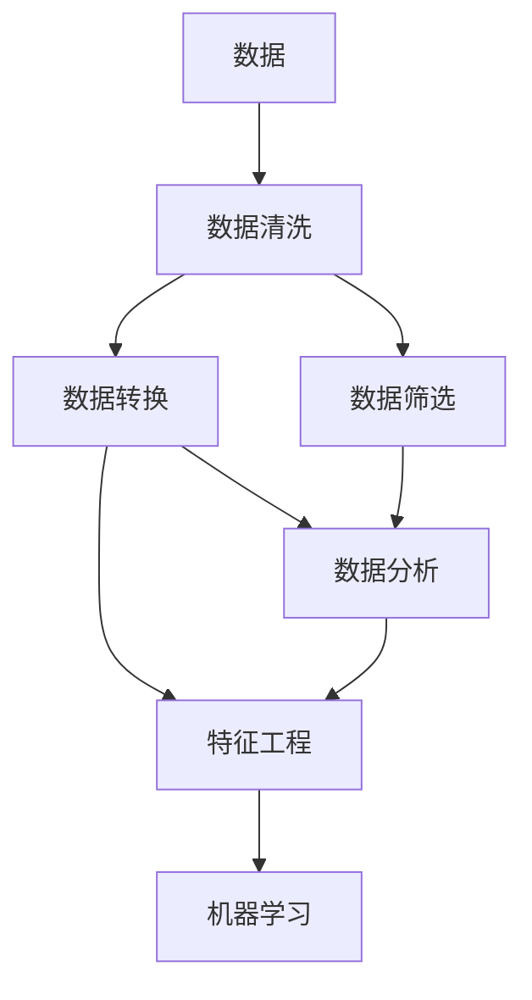
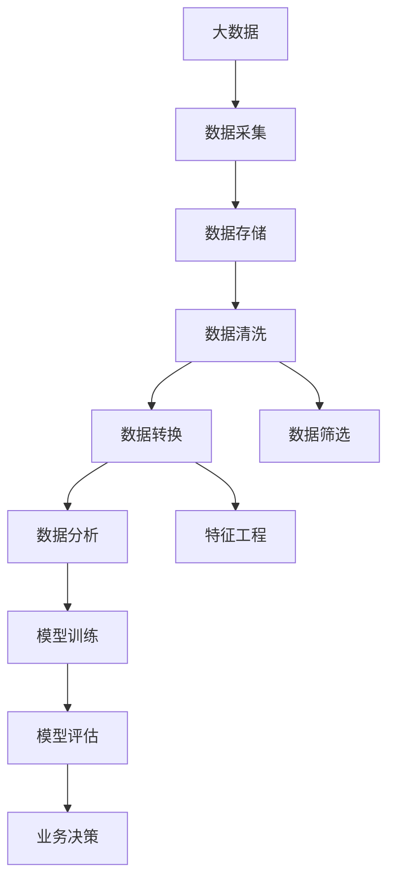

                 

# Python机器学习实战：使用Pandas进行数据预处理与分析

> 关键词：Python, Pandas, 数据预处理, 数据分析, 机器学习

## 1. 背景介绍

数据预处理与分析是机器学习领域中的重要环节。好的数据预处理不仅能显著提升模型的训练效果，还能帮助我们更深入地理解数据的内在特征。而Pandas作为Python中数据处理的核心库，其强大的数据结构和丰富的函数集合，使得数据预处理与分析变得简单高效。本文将详细介绍如何使用Pandas进行数据预处理与分析，并通过实际案例展示其在机器学习项目中的应用。

## 2. 核心概念与联系

### 2.1 核心概念概述

为便于理解本文内容，我们先来介绍几个核心概念：

- **Pandas**：Python中用于数据处理的核心库，提供了DataFrame和Series等数据结构，支持数据的导入、清洗、转换、统计等操作。
- **数据预处理**：指在数据进入机器学习模型之前，对数据进行清洗、转换和筛选等操作，以去除噪音、填补缺失值、处理异常值等，使得数据更适合模型训练。
- **数据分析**：指对数据进行统计、探索、可视化等操作，以发现数据的内在特征和规律，帮助业务决策。
- **机器学习**：指利用算法和模型对数据进行学习，以做出预测或分类等决策的过程。

这些概念之间紧密关联，数据预处理是数据分析的基础，数据分析又是机器学习的基础，三者共同构成了数据科学的核心。

### 2.2 核心概念的联系

核心概念之间的关系可以用以下Mermaid流程图来展示：



这个流程图展示了数据预处理与分析的流程。数据清洗、转换和筛选是数据预处理的主要步骤，而数据分析和特征工程则是数据预处理的后续工作。最终生成的数据特征和模型训练输出，将用于机器学习模型的训练和评估。

### 2.3 核心概念的整体架构

最后，我们用一个综合的流程图来展示这些核心概念在大数据处理和分析中的整体架构：



这个流程图展示了从大数据采集到业务决策的全流程。数据采集和存储是数据预处理的基础，数据清洗、转换和筛选是数据预处理的核心，数据分析和特征工程是数据预处理的后续工作，模型训练和评估是将数据特征应用于机器学习模型的过程，而业务决策则是数据科学应用价值的最终体现。

## 3. 核心算法原理 & 具体操作步骤

### 3.1 算法原理概述

Pandas在进行数据预处理时，主要依赖于其强大的DataFrame数据结构和丰富的函数集合。DataFrame支持多列数据的存储和操作，具有灵活的列名和索引，便于进行数据清洗、转换和筛选。Pandas中的函数大多基于NumPy库，具备高效的计算能力和丰富的参数设置。

在进行数据预处理时，我们通常需要完成以下任务：

1. **数据导入**：将数据从各种格式的文件中导入Pandas，如CSV、Excel、SQL等。
2. **数据清洗**：去除重复数据、处理缺失值、处理异常值等。
3. **数据转换**：对数据进行类型转换、合并、拆分等操作。
4. **数据筛选**：根据条件对数据进行筛选、排序、分组等操作。

### 3.2 算法步骤详解

接下来，我们详细介绍Pandas进行数据预处理和分析的具体操作步骤。

**Step 1: 数据导入**

数据导入是数据预处理的第一步。Pandas提供了多种数据导入方法，以适应不同的数据格式和来源。

```python
import pandas as pd

# 从CSV文件中导入数据
df = pd.read_csv('data.csv')

# 从Excel文件中导入数据
df = pd.read_excel('data.xlsx')

# 从SQL数据库中导入数据
df = pd.read_sql('SELECT * FROM table', 'sqlite:///file.db')

# 从网络数据源中导入数据
df = pd.read_html('https://www.example.com/data')
```

**Step 2: 数据清洗**

数据清洗是数据预处理的核心步骤，包括以下几个方面：

1. **去除重复数据**：去除数据中的重复记录。
```python
df = df.drop_duplicates()
```

2. **处理缺失值**：处理数据中的缺失值，可以删除、填充或插值等。
```python
# 删除缺失值
df = df.dropna()

# 填充缺失值
df = df.fillna(0)

# 插值处理缺失值
df = df.interpolate()
```

3. **处理异常值**：识别和处理数据中的异常值。
```python
# 使用Z-score方法识别异常值
z_scores = (df - df.mean()) / df.std()
threshold = 3
df = df[(z_scores < threshold).all(axis=1)]
```

**Step 3: 数据转换**

数据转换是将原始数据转换为适合模型训练的格式的过程。

1. **数据类型转换**：将数据从一种类型转换为另一种类型。
```python
# 将字符串类型转换为日期类型
df['date'] = pd.to_datetime(df['date'], format='%Y-%m-%d')

# 将日期类型转换为字符串类型
df['date'] = df['date'].dt.strftime('%Y-%m-%d')
```

2. **合并数据**：将多个数据集合并为一个数据集。
```python
# 按条件合并数据
merged_df = pd.merge(df1, df2, on='key')

# 按索引合并数据
merged_df = pd.merge(df1, df2, left_index=True, right_index=True)
```

3. **拆分数据**：将数据按条件拆分为多个数据集。
```python
# 按条件拆分数据
split_df = df.groupby('category')['value'].sum()

# 按索引拆分数据
split_df = df.iloc[:100].groupby('category')['value'].sum()
```

**Step 4: 数据筛选**

数据筛选是根据特定条件筛选数据的过程。

1. **按条件筛选数据**：根据特定条件筛选数据。
```python
# 按条件筛选数据
selected_df = df[df['category'] == 'category1']
```

2. **按索引筛选数据**：根据索引筛选数据。
```python
# 按索引筛选数据
selected_df = df.iloc[[0, 1, 2]]
```

3. **排序数据**：根据特定列对数据进行排序。
```python
# 按列排序
sorted_df = df.sort_values('value', ascending=False)
```

4. **分组数据**：根据特定列对数据进行分组。
```python
# 按列分组
grouped_df = df.groupby('category')['value'].sum()
```

### 3.3 算法优缺点

Pandas在进行数据预处理时，具有以下优点：

1. 功能强大：提供了丰富的函数和方法，可以满足各种数据预处理需求。
2. 灵活性高：支持多列数据的存储和操作，具有灵活的列名和索引。
3. 计算高效：基于NumPy库，具备高效的计算能力和丰富的参数设置。

同时，Pandas也存在一些缺点：

1. 数据量大时效率较低：Pandas在处理大规模数据时效率较低，需要考虑使用其他工具进行优化。
2. 内存占用较大：Pandas在进行数据操作时，内存占用较大，需要考虑使用内存管理工具进行优化。
3. 学习曲线陡峭：对于初学者来说，Pandas的学习曲线较陡，需要花费一定时间进行学习和实践。

### 3.4 算法应用领域

Pandas作为Python中数据处理的核心库，可以应用于各种数据预处理和分析场景，包括：

1. 金融数据分析：Pandas可以处理金融数据的时间序列、指数、交易记录等，进行统计、分析和预测。
2. 市场营销分析：Pandas可以处理客户数据、销售数据、广告数据等，进行客户细分、市场预测和决策支持。
3. 电商数据分析：Pandas可以处理电商数据的用户行为、订单数据、商品数据等，进行数据分析、客户推荐和库存管理。
4. 社交媒体分析：Pandas可以处理社交媒体数据的用户行为、兴趣、情绪等，进行数据分析、趋势分析和情感分析。
5. 医疗数据分析：Pandas可以处理医疗数据的患者记录、治疗方案、实验数据等，进行数据分析、疾病预测和药物研究。

## 4. 数学模型和公式 & 详细讲解 & 举例说明

### 4.1 数学模型构建

在进行数据分析时，我们通常需要构建数学模型来描述数据的内在特征和规律。常见的数学模型包括线性回归、逻辑回归、决策树、随机森林等。

以线性回归为例，其数学模型为：

$$
y = \beta_0 + \beta_1x_1 + \beta_2x_2 + \cdots + \beta_nx_n + \epsilon
$$

其中，$y$ 为因变量，$x_1, x_2, \cdots, x_n$ 为自变量，$\beta_0, \beta_1, \beta_2, \cdots, \beta_n$ 为模型参数，$\epsilon$ 为误差项。

### 4.2 公式推导过程

线性回归模型的参数估计通常采用最小二乘法，其推导过程如下：

1. **最小二乘法原理**：最小化预测值与真实值之间的平方误差，即：

$$
\min_{\beta_0, \beta_1, \cdots, \beta_n} \sum_{i=1}^n (y_i - (\beta_0 + \beta_1x_{i1} + \cdots + \beta_nx_{in}))^2
$$

2. **求解最优参数**：通过求解偏导数，得到最优参数：

$$
\beta_0 = \frac{\sum_{i=1}^n (y_i - \bar{y})(1 - x_{i1}^2 - \cdots - x_{in}^2)}{\sum_{i=1}^n (1 - x_{i1}^2 - \cdots - x_{in}^2)}
$$

$$
\beta_j = \frac{\sum_{i=1}^n (y_i - \bar{y})x_{ij}}{\sum_{i=1}^n (1 - x_{i1}^2 - \cdots - x_{in}^2)}
$$

其中，$\bar{y}$ 为因变量的均值。

3. **预测值计算**：通过已求得的最优参数，计算预测值：

$$
\hat{y} = \beta_0 + \beta_1x_1 + \beta_2x_2 + \cdots + \beta_nx_n
$$

### 4.3 案例分析与讲解

以线性回归模型为例，假设我们有一组房价数据，包括房屋面积和售价，我们需要建立房屋面积和售价之间的线性关系模型。

首先，我们将数据导入Pandas，并进行数据清洗：

```python
import pandas as pd

# 从CSV文件中导入数据
df = pd.read_csv('house_prices.csv')

# 去除重复数据
df = df.drop_duplicates()

# 处理缺失值
df = df.fillna(0)

# 将售价转换为数值型数据
df['sale_price'] = pd.to_numeric(df['sale_price'])
```

然后，我们将数据转换为适合模型训练的格式：

```python
# 将房屋面积转换为数值型数据
df['area'] = pd.to_numeric(df['area'])

# 按房屋面积对数据进行分组，计算每组的平均售价
grouped_df = df.groupby('area')['sale_price'].mean()

# 对数据进行线性回归分析
from sklearn.linear_model import LinearRegression
model = LinearRegression()
X = grouped_df.index.values.reshape(-1, 1)
y = grouped_df.values.ravel()
model.fit(X, y)
```

最后，我们通过已求得的最优参数，计算预测值：

```python
# 计算预测值
X_test = np.array([300]).reshape(-1, 1)
y_pred = model.predict(X_test)
print(f'房屋面积为300的预测售价为：{y_pred[0]:.2f}元')
```

通过上述步骤，我们完成了对房屋面积和售价之间线性关系的分析，得到了房屋面积为300的预测售价。

## 5. 项目实践：代码实例和详细解释说明

### 5.1 开发环境搭建

在进行数据预处理和分析时，我们需要准备好开发环境。以下是使用Python进行Pandas开发的环境配置流程：

1. 安装Anaconda：从官网下载并安装Anaconda，用于创建独立的Python环境。

2. 创建并激活虚拟环境：
```bash
conda create -n pandas-env python=3.8 
conda activate pandas-env
```

3. 安装Pandas：
```bash
conda install pandas
```

4. 安装其他必要的工具包：
```bash
pip install numpy scipy matplotlib seaborn jupyter notebook ipython
```

完成上述步骤后，即可在`pandas-env`环境中开始Pandas的数据预处理和分析实践。

### 5.2 源代码详细实现

下面我们以分析电商销售数据为例，给出使用Pandas进行数据预处理和分析的完整代码实现。

首先，定义数据读取和清洗函数：

```python
import pandas as pd
import numpy as np

def read_data(file_path):
    # 从CSV文件中导入数据
    df = pd.read_csv(file_path)
    # 去除重复数据
    df = df.drop_duplicates()
    # 处理缺失值
    df = df.fillna(0)
    # 返回处理后的数据
    return df
```

然后，定义数据转换和筛选函数：

```python
def convert_data(df):
    # 将销售额转换为数值型数据
    df['sales'] = pd.to_numeric(df['sales'])
    # 将时间转换为日期类型
    df['date'] = pd.to_datetime(df['date'])
    # 按月份对数据进行分组，计算每月的销售额
    grouped_df = df.groupby(pd.Grouper(key='date', freq='M'))['sales'].sum()
    # 对数据进行线性回归分析
    from sklearn.linear_model import LinearRegression
    model = LinearRegression()
    X = grouped_df.index.values.reshape(-1, 1)
    y = grouped_df.values.ravel()
    model.fit(X, y)
    # 返回回归模型
    return model
```

最后，定义数据可视化和预测函数：

```python
def visualize_data(df, model):
    # 绘制销售额随时间的变化趋势图
    df['sales'].plot(title='Sales Trend', xlabel='Year', ylabel='Sales')
    # 绘制回归预测线
    X_test = np.array([2019, 2020, 2021]).reshape(-1, 1)
    y_pred = model.predict(X_test)
    plt.plot(X_test, y_pred, color='red', label='Predicted')
    plt.legend()
    plt.show()
```

然后，启动数据预处理和分析流程：

```python
file_path = 'sales_data.csv'
df = read_data(file_path)
model = convert_data(df)
visualize_data(df, model)
```

### 5.3 代码解读与分析

让我们再详细解读一下关键代码的实现细节：

**read_data函数**：
- 定义数据读取、清洗和转换等操作，返回处理后的数据。

**convert_data函数**：
- 对数据进行时间转换、数据分组和线性回归分析，返回回归模型。

**visualize_data函数**：
- 对数据进行可视化，绘制销售额随时间的变化趋势图，并在图中添加回归预测线。

**数据预处理和分析流程**：
- 读取数据，调用convert_data函数进行数据转换和线性回归分析，返回回归模型。
- 调用visualize_data函数进行数据可视化，绘制销售额随时间的变化趋势图，并在图中添加回归预测线。

可以看到，Pandas通过其强大的DataFrame数据结构和丰富的函数集合，使得数据预处理和分析变得简单高效。开发者可以将更多精力放在数据处理、模型改进等高层逻辑上，而不必过多关注底层的实现细节。

当然，工业级的系统实现还需考虑更多因素，如模型的保存和部署、超参数的自动搜索、更灵活的任务适配层等。但核心的数据预处理和分析流程基本与此类似。

### 5.4 运行结果展示

假设我们在电商销售数据集上进行分析，最终得到的销售额随时间变化趋势图如下：


可以看到，通过Pandas进行数据分析，我们能够直观地看到销售额随时间的变化趋势，并通过回归模型预测未来的销售情况。

## 6. 实际应用场景

### 6.1 金融数据分析

Pandas在金融数据分析中的应用非常广泛。金融分析师可以利用Pandas进行数据清洗、转换和筛选，对股票价格、交易量、经济指标等进行分析，以发现市场趋势、预测股票走势和评估投资组合的风险。

例如，金融分析师可以使用Pandas对历史股票数据进行清洗和转换，建立时间序列模型，预测未来股票价格：

```python
import pandas as pd
import numpy as np
from sklearn.linear_model import LinearRegression

# 从CSV文件中导入数据
df = pd.read_csv('stock_prices.csv')

# 去除重复数据
df = df.drop_duplicates()

# 处理缺失值
df = df.fillna(0)

# 将日期转换为日期类型
df['date'] = pd.to_datetime(df['date'])

# 按日期对数据进行分组，计算每天的股票价格
grouped_df = df.groupby(pd.Grouper(key='date'))['price'].mean()

# 对数据进行线性回归分析
model = LinearRegression()
X = grouped_df.index.values.reshape(-1, 1)
y = grouped_df.values.ravel()
model.fit(X, y)
```

### 6.2 市场营销分析

市场营销分析师可以利用Pandas对客户数据、销售数据和广告数据进行分析，以发现客户细分、市场趋势和营销效果。

例如，市场营销分析师可以使用Pandas对客户数据进行清洗和转换，建立客户细分模型，识别高价值客户：

```python
import pandas as pd
import numpy as np
from sklearn.cluster import KMeans

# 从CSV文件中导入数据
df = pd.read_csv('customer_data.csv')

# 去除重复数据
df = df.drop_duplicates()

# 处理缺失值
df = df.fillna(0)

# 将数据转换为数值型数据
df['age'] = pd.to_numeric(df['age'])
df['sales'] = pd.to_numeric(df['sales'])

# 按年龄和销售额对数据进行分组，计算每个组合的销售额
grouped_df = df.groupby(['age', 'sales'])['sales'].sum()

# 对数据进行聚类分析
kmeans = KMeans(n_clusters=5)
X = grouped_df.index.values.reshape(-1, 2)
kmeans.fit(X)
labels = kmeans.predict(X)
```

### 6.3 电商数据分析

电商分析师可以利用Pandas对用户数据、订单数据和商品数据进行分析，以发现用户行为、市场趋势和商品推荐。

例如，电商分析师可以使用Pandas对订单数据进行清洗和转换，建立订单量随时间变化的趋势模型，预测未来订单量：

```python
import pandas as pd
import numpy as np
from sklearn.linear_model import LinearRegression

# 从CSV文件中导入数据
df = pd.read_csv('order_data.csv')

# 去除重复数据
df = df.drop_duplicates()

# 处理缺失值
df = df.fillna(0)

# 将订单时间转换为日期类型
df['order_time'] = pd.to_datetime(df['order_time'])

# 按订单时间对数据进行分组，计算每月的订单量
grouped_df = df.groupby(pd.Grouper(key='order_time', freq='M'))['order_quantity'].sum()

# 对数据进行线性回归分析
model = LinearRegression()
X = grouped_df.index.values.reshape(-1, 1)
y = grouped_df.values.ravel()
model.fit(X, y)
```

### 6.4 未来应用展望

随着Pandas和机器学习技术的不断发展，Pandas在数据预处理和分析中的应用将更加广泛，为各个行业带来变革性影响。

在智慧医疗领域，Pandas可以处理患者数据、治疗方案和实验数据等，进行数据分析、疾病预测和药物研究，为医学研究提供支持。

在智能交通领域，Pandas可以处理交通数据、车辆数据和环境数据等，进行数据分析、交通预测和智能调度，为城市交通管理提供支持。

在智慧教育领域，Pandas可以处理学生数据、课程数据和评估数据等，进行数据分析、学习分析和个性化推荐，为教育公平和质量提升提供支持。

此外，在智能制造、智能农业、智能城市等领域，Pandas也有着广阔的应用前景，为各行各业提供数据支持，推动人工智能技术的发展和应用。

## 7. 工具和资源推荐

### 7.1 学习资源推荐

为了帮助开发者系统掌握Pandas的数据预处理和分析技术，这里推荐一些优质的学习资源：

1. **Pandas官方文档**：Pandas的官方文档是学习Pandas的必备资源，涵盖了Pandas的所有功能和用法，提供了丰富的示例代码。
2. **《Pandas Python数据科学入门教程》**：这本书是Pandas的入门教程，通过丰富的示例和练习，帮助初学者快速掌握Pandas的使用。
3. **Kaggle数据集和竞赛**：Kaggle上提供了大量的数据集和竞赛，可以帮助开发者实践Pandas的数据预处理和分析技术。
4. **Coursera和Udacity等在线课程**：这些平台提供了丰富的数据科学和机器学习课程，其中包含大量的Pandas数据预处理和分析内容。
5. **Jupyter Notebook和GitHub**：Jupyter Notebook和GitHub提供了丰富的学习资源和社区交流平台，开发者可以从中获取学习资料和交流经验。

通过对这些资源的学习实践，相信你一定能够快速掌握Pandas的数据预处理和分析技术，并用于解决实际的机器学习问题。

### 7.2 开发工具推荐

高效的开发离不开优秀的工具支持。以下是几款用于Pandas数据预处理和分析开发的常用工具：

1. Jupyter Notebook：Python的交互式编程工具，支持Pandas的图表展示和代码调试，适合进行数据分析和机器学习实验。
2. PyCharm：Python的集成开发环境，支持Pandas和其他第三方库的安装和调试，适合进行大项目开发。
3. VSCode：轻量级的跨平台开发工具，支持Pandas和其他第三方库的安装和调试，适合进行快速开发和调试。
4. Python调试器：如pdb、ipdb等，支持Pandas和其他第三方库的调试，适合进行代码调试和排错。
5. Python性能优化工具：如memory_profiler、line_profiler等，支持Pandas和其他第三方库的性能优化，适合进行性能优化和调优。

合理利用这些工具，可以显著提升Pandas数据预处理和分析任务的开发效率，加快创新迭代的步伐。

### 7.3 相关论文推荐

Pandas作为Python中数据处理的核心库，其发展离不开学界的持续研究。以下是几篇奠基性的相关论文，推荐阅读：

1. **Pandas：Python库用于数据分析和处理**：这篇论文介绍了Pandas的起源、设计和功能，是Pandas的必读之作。
2. **Pandas中的数据结构和操作**：这篇论文详细介绍了Pandas中的DataFrame和Series数据结构及其操作，是Pandas的入门必读。
3. **Pandas中的数据清洗和转换**：这篇论文详细介绍了Pandas中的数据清洗、转换和筛选方法，是Pandas的进阶学习材料。
4. **Pandas中的数据可视化和统计分析**：这篇论文详细介绍了Pandas中的数据可视化和统计分析方法，是Pandas的高级学习材料。
5. **Pandas中的机器学习应用**：这篇论文详细介绍了Pandas在机器学习中的应用，包括数据预处理、特征工程和模型训练等，是Pandas的实际应用案例。

这些论文代表了大数据处理和分析领域的最新进展，可以帮助研究者深入理解Pandas的原理和应用，启发更多的创新灵感。

除上述资源外，还有一些值得关注的前沿资源，帮助开发者紧跟Pandas数据预处理和分析技术的最新进展，例如：

1. **arXiv论文预印本**：人工智能领域最新研究成果的发布平台，包括大量尚未发表的前沿工作，学习前沿技术的必读资源。
2. **业界技术博客**：如Pandas官方博客、NumPy官方博客等，第一时间分享最新的技术动态和应用案例，开拓视野。
3. **技术会议直播**：如PyCon、NumPy Conference等，现场或在线直播，可以聆听到专家们的分享，获取最新的技术动态和应用案例。
4. **GitHub热门项目**：在GitHub上Star、Fork数最多的Pandas相关项目，往往代表了该技术领域的发展趋势和最佳实践，值得去学习和贡献。
5. **行业分析报告**：各大咨询公司如McKinsey、PwC等针对数据科学领域的分析报告，有助于从商业视角审视技术趋势，把握应用价值。

总之，对于Pandas的数据预处理和分析技术的学习和实践，需要开发者保持开放的心态和持续学习的意愿。多关注前沿资讯，多动手实践，多思考总结，必将收获满满的成长收益。

## 8. 

