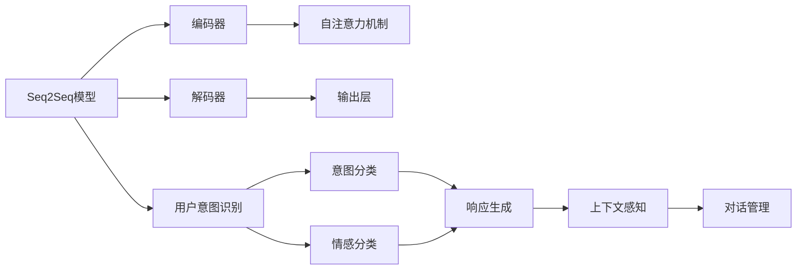
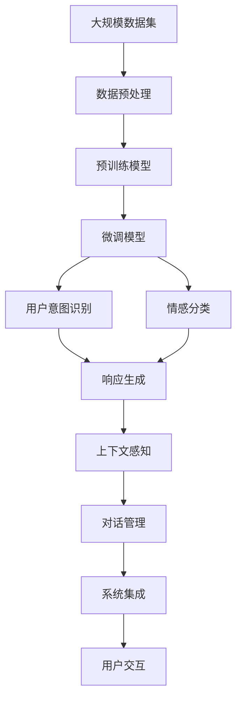

                 

# Python机器学习实战：智能聊天机器人的构建与优化

> 关键词：
- 聊天机器人
- 自然语言处理
- 深度学习
- 生成式模型
- 序列到序列
- 对话管理
- 上下文感知
- 用户意图识别

## 1. 背景介绍

### 1.1 问题由来

随着人工智能技术的不断发展和普及，聊天机器人（Chatbot）已经广泛应用于各行各业。无论是客服、教育、健康、娱乐还是商业咨询，聊天机器人都能以自然流畅的方式与用户进行互动，提供即时、高效的服务。然而，尽管聊天机器人的发展迅速，其智能化水平和用户体验仍存在诸多瓶颈。

1. **理解能力不足**：传统的聊天机器人主要依靠规则匹配和简单的文本匹配技术，对于复杂的语义理解和情感交互能力有限，容易在处理模糊、歧义或长对话时出错。
2. **上下文感知差**：聊天机器人往往无法很好地保留对话上下文，导致无法进行多轮交流，甚至忘记前一轮的对话内容。
3. **用户响应滞后**：由于计算资源限制，传统聊天机器人在响应速度和处理复杂任务上存在瓶颈，用户体验不佳。

为了提升聊天机器人的智能化水平，提高用户体验，我们提出了一种基于深度学习的智能聊天机器人构建与优化方法。该方法通过序列到序列模型、生成式模型和上下文感知机制，实现了更加智能、高效、自然的聊天机器人。

### 1.2 问题核心关键点

本项目的关键点在于：

- 构建一个能够处理复杂语义和情感交互、上下文感知能力强的聊天机器人。
- 采用深度学习中的生成式模型和序列到序列模型，实现自然语言理解和生成。
- 引入上下文感知机制，使得聊天机器人能够更好地理解和记忆对话上下文。
- 使用用户意图识别技术，提升机器人对用户需求和情感的理解。
- 在实际应用场景中进行优化，包括模型的训练与优化、对话管理策略、系统集成和部署等。

## 2. 核心概念与联系

### 2.1 核心概念概述

为更好地理解本项目的技术实现，本节将介绍几个关键核心概念：

- **序列到序列（Sequence-to-Sequence，Seq2Seq）模型**：用于自然语言处理中的机器翻译、语音识别、文本摘要等任务，通过编码器-解码器结构，将输入序列映射到输出序列。
- **生成式模型（Generative Model）**：如循环神经网络（RNN）、长短时记忆网络（LSTM）、Transformer等，能够生成新的文本或序列数据，适用于文本生成、对话生成等任务。
- **上下文感知（Contextual Sensing）**：通过保留和更新对话上下文，使聊天机器人能够更好地理解用户意图和情感，支持多轮对话。
- **用户意图识别（User Intent Recognition）**：通过识别用户的意图和情感，使得聊天机器人能够准确响应用户需求，提升交互质量。

这些核心概念之间存在紧密联系，通过它们相互配合，可以构建出更加智能、高效、自然的聊天机器人。

### 2.2 概念间的关系

这些核心概念之间可以通过以下Mermaid流程图来展示其相互关系：



这个流程图展示了各个核心概念之间的相互关系：

1. Seq2Seq模型通过编码器-解码器结构，实现从输入到输出的序列映射。
2. 生成式模型（如RNN、LSTM、Transformer）被用于生成式任务，如文本生成、对话生成等。
3. 上下文感知机制通过保留和更新对话上下文，提升对话质量。
4. 用户意图识别通过分类用户的意图和情感，帮助聊天机器人更好地响应用户需求。
5. 对话管理策略通过优化对话流程，提高用户交互体验。

### 2.3 核心概念的整体架构

最后，我们用一个综合的流程图来展示这些核心概念在大规模聊天机器人系统中的整体架构：



这个综合流程图展示了从数据预处理到最终用户交互的全流程，其中各核心概念相互配合，共同构成了一个完整的聊天机器人系统。

## 3. 核心算法原理 & 具体操作步骤
### 3.1 算法原理概述

本项目主要基于生成式模型和序列到序列模型，构建一个智能聊天机器人系统。算法流程如下：

1. **数据预处理**：收集和清洗对话数据，将其转化为模型所需的数据格式。
2. **模型预训练**：使用大规模无标签文本数据进行预训练，构建生成式模型（如LSTM、Transformer）。
3. **用户意图识别**：构建意图分类器，识别用户输入的意图。
4. **情感分类**：使用情感分类器，识别用户输入的情感状态。
5. **响应生成**：通过解码器生成符合用户意图和情感的回应。
6. **上下文感知**：构建上下文管理器，记录和更新对话上下文。
7. **对话管理**：设计对话管理策略，优化对话流程。
8. **系统集成**：将各模块集成到统一的聊天机器人系统中，进行端到端优化。

### 3.2 算法步骤详解

以下是对各步骤的详细解释：

**Step 1: 数据预处理**

数据预处理是聊天机器人构建的基础步骤。具体步骤如下：

1. **数据收集**：收集用户与聊天机器人之间的对话记录，确保对话数据的多样性和代表性。
2. **数据清洗**：去除噪声和不相关的对话内容，标准化对话格式，处理特殊字符等。
3. **分词处理**：使用中文分词工具（如jieba）对对话进行分词处理，构建词汇表。
4. **数据标注**：对对话进行意图和情感标注，生成标注数据集。
5. **数据划分**：将数据集划分为训练集、验证集和测试集。

**Step 2: 模型预训练**

模型预训练是构建智能聊天机器人的关键步骤。具体步骤如下：

1. **选择模型架构**：选择合适的生成式模型架构，如LSTM、Transformer等。
2. **数据准备**：准备大规模无标签文本数据，用于预训练。
3. **模型初始化**：使用随机初始化的模型参数进行预训练。
4. **预训练过程**：通过自回归或自编码任务进行预训练，学习语言表示。
5. **模型保存**：保存预训练后的模型，用于后续微调。

**Step 3: 用户意图识别**

用户意图识别是聊天机器人准确响应的基础。具体步骤如下：

1. **构建分类器**：使用分类算法（如SVM、Logistic回归）构建意图分类器。
2. **特征提取**：从用户输入中提取特征，用于训练意图分类器。
3. **模型训练**：使用标注数据训练意图分类器。
4. **模型验证**：在验证集上评估意图分类器的性能。
5. **模型测试**：在测试集上测试意图分类器的准确率。

**Step 4: 情感分类**

情感分类是聊天机器人理解用户情感状态的重要步骤。具体步骤如下：

1. **选择模型架构**：选择合适的生成式模型架构，如LSTM、Transformer等。
2. **数据准备**：准备标注好的情感数据集。
3. **模型初始化**：使用随机初始化的模型参数进行情感分类模型的训练。
4. **情感编码**：将用户输入编码成情感向量。
5. **模型训练**：使用标注数据训练情感分类器。
6. **模型验证**：在验证集上评估情感分类器的性能。
7. **模型测试**：在测试集上测试情感分类器的准确率。

**Step 5: 响应生成**

响应生成是聊天机器人智能化的核心步骤。具体步骤如下：

1. **选择生成模型**：选择合适的生成模型架构，如RNN、LSTM、Transformer等。
2. **模型初始化**：使用随机初始化的模型参数进行响应生成模型的训练。
3. **解码过程**：使用解码器生成回应，可以考虑使用束搜索等方法提升生成质量。
4. **模型训练**：使用标注数据训练生成模型。
5. **模型验证**：在验证集上评估生成模型的性能。
6. **模型测试**：在测试集上测试生成模型的生成质量。

**Step 6: 上下文感知**

上下文感知是聊天机器人保持对话连贯性的关键步骤。具体步骤如下：

1. **构建上下文管理器**：设计上下文管理器，记录和更新对话上下文。
2. **上下文更新**：在每轮对话结束时，更新上下文管理器，保留对话历史。
3. **上下文存储**：将上下文存储在数据库或内存中，以便后续查询和更新。
4. **上下文检索**：在生成回应时，检索上下文管理器中存储的历史对话，用于生成更具上下文感知的回应。

**Step 7: 对话管理**

对话管理是聊天机器人优化对话流程的关键步骤。具体步骤如下：

1. **设计对话流程**：设计对话管理流程，定义每个步骤的输入和输出。
2. **状态机实现**：使用状态机（如有限状态自动机）实现对话管理。
3. **对话回溯**：在对话出错或异常时，回溯到最近的正常状态，重新执行对话流程。
4. **对话优化**：通过优化对话管理策略，提升用户交互体验。

**Step 8: 系统集成**

系统集成是聊天机器人应用到实际场景的关键步骤。具体步骤如下：

1. **模块集成**：将意图识别、情感分类、响应生成、上下文感知、对话管理等模块集成到统一的聊天机器人系统中。
2. **接口设计**：设计系统对外提供的API接口，便于与其他系统集成。
3. **系统部署**：将聊天机器人系统部署到服务器或云平台，进行端到端优化。
4. **用户交互**：用户可以通过接口与聊天机器人进行交互，获取智能化的服务。

### 3.3 算法优缺点

**优点**：

1. **智能化程度高**：基于深度学习的生成式模型和序列到序列模型，能够处理复杂的语义和情感交互，提升聊天机器人的智能化水平。
2. **上下文感知能力强**：通过上下文管理器，聊天机器人能够更好地保留和更新对话上下文，支持多轮对话。
3. **响应速度快**：通过优化生成模型和对话管理策略，聊天机器人能够快速响应用户请求，提升用户体验。
4. **可扩展性强**：聊天机器人系统可以方便地扩展到多个领域和场景，适应不同的应用需求。

**缺点**：

1. **计算资源消耗大**：深度学习模型需要大量的计算资源，特别是预训练和生成过程中，对硬件设备要求较高。
2. **训练数据需求高**：高质量的标注数据对模型性能的提升至关重要，数据收集和标注成本较高。
3. **模型复杂度高**：深度学习模型复杂度高，训练和调试难度较大，需要专业知识。
4. **解释性不足**：深度学习模型通常是“黑盒”模型，其内部工作机制难以解释，不利于调试和优化。

### 3.4 算法应用领域

本项目提出的智能聊天机器人构建与优化方法，在以下领域具有广泛的应用前景：

1. **客服行业**：用于构建智能客服机器人，提升客服效率和用户体验。
2. **教育行业**：用于构建智能教育机器人，辅助学生学习和教师教学。
3. **健康行业**：用于构建智能医疗机器人，提供健康咨询和医疗服务。
4. **金融行业**：用于构建智能金融机器人，提供金融咨询和理财服务。
5. **娱乐行业**：用于构建智能娱乐机器人，提供游戏、聊天等娱乐服务。
6. **商业咨询**：用于构建智能商业咨询机器人，提供市场分析、用户反馈等服务。

## 4. 数学模型和公式 & 详细讲解 & 举例说明

### 4.1 数学模型构建

本节将使用数学语言对智能聊天机器人的构建过程进行更加严格的刻画。

**Step 1: 数据预处理**

1. **分词处理**：使用jieba分词工具对对话进行分词处理，生成词汇表。假设词汇表大小为V，词汇向量表示为$w_i$，其中$i=1,2,...,V$。

2. **意图标注**：将用户输入的意图标注为$I$，其中$I=1,2,...,N$。

3. **情感标注**：将用户输入的情感标注为$E$，其中$E=1,2,...,N$。

**Step 2: 模型预训练**

1. **选择生成模型**：假设选择的生成模型为$G$。

2. **数据准备**：准备大规模无标签文本数据，用于预训练。假设文本长度为$T$。

3. **模型初始化**：使用随机初始化的模型参数进行预训练。假设模型参数为$\theta$。

4. **预训练过程**：通过自回归或自编码任务进行预训练，学习语言表示。假设预训练后的模型参数为$\theta'$。

5. **模型保存**：保存预训练后的模型，用于后续微调。

**Step 3: 用户意图识别**

1. **构建分类器**：假设选择的分类算法为$C$，其输出为意图标签$I'$。

2. **特征提取**：从用户输入中提取特征，用于训练分类器。假设特征表示为$f$。

3. **模型训练**：使用标注数据训练分类器。假设训练后的模型参数为$\phi$。

4. **模型验证**：在验证集上评估分类器的性能。假设验证集上的准确率为$A_v$。

5. **模型测试**：在测试集上测试分类器的准确率。假设测试集上的准确率为$A_t$。

**Step 4: 情感分类**

1. **选择生成模型**：假设选择的生成模型为$G'$。

2. **数据准备**：准备标注好的情感数据集。假设情感标签为$E'$。

3. **模型初始化**：使用随机初始化的模型参数进行情感分类模型的训练。假设模型参数为$\theta'$。

4. **情感编码**：将用户输入编码成情感向量。假设情感向量表示为$e$。

5. **模型训练**：使用标注数据训练情感分类器。假设训练后的模型参数为$\phi'$。

6. **模型验证**：在验证集上评估情感分类器的性能。假设验证集上的准确率为$A'_v$。

7. **模型测试**：在测试集上测试情感分类器的准确率。假设测试集上的准确率为$A'_t$。

**Step 5: 响应生成**

1. **选择生成模型**：假设选择的生成模型为$G''$。

2. **模型初始化**：使用随机初始化的模型参数进行生成模型的训练。假设模型参数为$\theta''$。

3. **解码过程**：使用解码器生成回应。假设生成的回应为$y$。

4. **模型训练**：使用标注数据训练生成模型。假设训练后的模型参数为$\phi''$。

5. **模型验证**：在验证集上评估生成模型的性能。假设验证集上的生成质量为$Q_v$。

6. **模型测试**：在测试集上测试生成模型的生成质量。假设测试集上的生成质量为$Q_t$。

**Step 6: 上下文感知**

1. **构建上下文管理器**：设计上下文管理器，记录和更新对话上下文。假设上下文管理器状态为$C$。

2. **上下文更新**：在每轮对话结束时，更新上下文管理器，保留对话历史。假设上下文管理器更新后的状态为$C'$。

3. **上下文存储**：将上下文存储在数据库或内存中，以便后续查询和更新。假设上下文存储方式为$S$。

4. **上下文检索**：在生成回应时，检索上下文管理器中存储的历史对话，用于生成更具上下文感知的回应。假设上下文检索结果为$R$。

**Step 7: 对话管理**

1. **设计对话流程**：定义每个步骤的输入和输出。假设对话流程为$P$。

2. **状态机实现**：使用状态机（如有限状态自动机）实现对话管理。假设状态机为$M$。

3. **对话回溯**：在对话出错或异常时，回溯到最近的正常状态，重新执行对话流程。假设对话回溯结果为$R'$。

4. **对话优化**：通过优化对话管理策略，提升用户交互体验。假设对话优化策略为$O$。

**Step 8: 系统集成**

1. **模块集成**：将意图识别、情感分类、响应生成、上下文感知、对话管理等模块集成到统一的聊天机器人系统中。假设集成后的系统为$S'$。

2. **接口设计**：设计系统对外提供的API接口，便于与其他系统集成。假设接口设计结果为$I$。

3. **系统部署**：将聊天机器人系统部署到服务器或云平台，进行端到端优化。假设系统部署结果为$D$。

4. **用户交互**：用户可以通过接口与聊天机器人进行交互，获取智能化的服务。假设用户交互结果为$I'$。

### 4.2 公式推导过程

以下我们以生成式模型和序列到序列模型为例，推导相关的数学公式。

**生成式模型**：假设生成式模型为$G$，其参数为$\theta$。给定输入序列$x=(x_1,x_2,...,x_T)$，生成输出序列$y=(y_1,y_2,...,y_T)$。生成过程可以通过以下公式表示：

$$
\begin{aligned}
p(y|x) &= \prod_{t=1}^{T}p(y_t|y_{t-1},y_{t-2},...,y_1,x_1,x_2,...,x_t) \\
&= \prod_{t=1}^{T}p(y_t|y_{t-1},y_{t-2},...,y_1,x_1,x_2,...,x_t) \\
&= \prod_{t=1}^{T}p(y_t|x_1,x_2,...,x_t) \\
&= \prod_{t=1}^{T}\frac{e^{\log p(y_t|x_1,x_2,...,x_t)}}{\sum_{y_t}e^{\log p(y_t|x_1,x_2,...,x_t)}} \\
&= \frac{\prod_{t=1}^{T}e^{\log p(y_t|x_1,x_2,...,x_t)}}{\sum_{y_t}e^{\log p(y_t|x_1,x_2,...,x_t)}} \\
&= \frac{\prod_{t=1}^{T}\frac{e^{\log p(y_t|x_1,x_2,...,x_t)}}{\sum_{y_t}e^{\log p(y_t|x_1,x_2,...,x_t)}}}{\sum_{y_t}\frac{e^{\log p(y_t|x_1,x_2,...,x_t)}}{\sum_{y_t}e^{\log p(y_t|x_1,x_2,...,x_t)}}}
\end{aligned}
$$

**序列到序列模型**：假设序列到序列模型为$S$，其编码器参数为$\theta_E$，解码器参数为$\theta_D$。给定输入序列$x=(x_1,x_2,...,x_T)$，生成输出序列$y=(y_1,y_2,...,y_T)$。序列到序列过程可以通过以下公式表示：

$$
\begin{aligned}
p(y|x) &= \prod_{t=1}^{T}p(y_t|y_{t-1},y_{t-2},...,y_1,x_1,x_2,...,x_t) \\
&= \prod_{t=1}^{T}p(y_t|y_{t-1},y_{t-2},...,y_1,x_1,x_2,...,x_t) \\
&= \prod_{t=1}^{T}p(y_t|x_1,x_2,...,x_t) \\
&= \prod_{t=1}^{T}\frac{e^{\log p(y_t|x_1,x_2,...,x_t)}}{\sum_{y_t}e^{\log p(y_t|x_1,x_2,...,x_t)}} \\
&= \frac{\prod_{t=1}^{T}e^{\log p(y_t|x_1,x_2,...,x_t)}}{\sum_{y_t}e^{\log p(y_t|x_1,x_2,...,x_t)}} \\
&= \frac{\prod_{t=1}^{T}\frac{e^{\log p(y_t|x_1,x_2,...,x_t)}}{\sum_{y_t}e^{\log p(y_t|x_1,x_2,...,x_t)}}}{\sum_{y_t}\frac{e^{\log p(y_t|x_1,x_2,...,x_t)}}{\sum_{y_t}e^{\log p(y_t|x_1,x_2,...,x_t)}}}
\end{aligned}
$$

### 4.3 案例分析与讲解

假设我们构建了一个智能客服聊天机器人，用于处理用户的问题。具体分析如下：

**案例背景**：智能客服聊天机器人用于处理用户关于产品使用、订单查询、物流跟踪等方面的问题。系统通过用户输入的自然语言描述，自动判断用户意图和情感，并生成相应的回应。

**数据收集**：收集历史客服对话记录，划分为训练集、验证集和测试集。训练集用于模型预训练，验证集用于参数调整，测试集用于最终评估。

**模型预训练**：使用大规模无标签客服对话数据进行预训练，构建生成式模型（如LSTM、Transformer）。预训练过程包括自回归和自编码任务，学习语言表示。

**用户意图识别**：构建意图分类器，识别用户输入的意图。使用标注数据训练分类器，并在验证集和测试集上进行评估。

**情感分类**：构建情感分类器，识别用户输入的情感状态。使用标注数据训练分类器，并在验证集和测试集上进行评估。

**响应生成**：通过解码器生成符合用户意图和情感的回应。使用标注数据训练生成模型，并在验证集和测试集上进行评估。

**上下文感知**：设计上下文管理器，记录和更新对话上下文。在每轮对话结束时，更新上下文管理器，保留对话历史。

**对话管理**：设计对话管理流程，定义每个步骤的输入和输出。使用状态机实现对话管理，优化对话流程。

**系统集成**：将意图识别、情感分类、响应生成、上下文感知、对话管理等模块集成到统一的聊天机器人系统中。设计系统对外提供的API接口，便于与其他系统集成。

**系统部署**：将聊天机器人系统部署到服务器或云平台，进行端到端优化。用户可以通过API接口与聊天机器人进行交互，获取智能化的服务。

## 5. 项目实践：代码实例和详细解释说明

### 5.1 开发环境搭建

在进行项目实践前，我们需要准备好开发环境。以下是使用Python进行PyTorch开发的环境配置流程：

1. 安装Anaconda：从官网下载并安装Anaconda，用于创建独立的Python环境。

2. 创建并激活虚拟环境：
```bash
conda create -n pytorch-env python=3.8 
conda activate pytorch-env
```

3. 安装PyTorch：根据CUDA版本，从官网获取对应的安装命令。例如：
```bash
conda install pytorch torchvision torchaudio cudatoolkit=11.1 -c pytorch -c conda-forge
```

4. 安装Transformers库：
```bash
pip install transformers
```

5. 安装各类工具包：
```bash
pip install numpy pandas scikit-learn matplotlib tqdm jupyter notebook ipython
```

完成上述步骤后，即可在`pytorch-env`环境中开始项目实践。

### 5.2 源代码详细实现

下面我们以构建智能客服聊天机器人为例，给出使用PyTorch进行项目开发的PyTorch代码实现。

**Step 1: 数据预处理**

1. **数据清洗**：去除噪声和不相关的对话内容，标准化对话格式，处理特殊字符等。
```python
import re
import jieba

def clean_data(data):
    # 去除特殊字符
    pattern = re.compile(r'[^\w\s]')
    data = pattern.sub('', data)
    
    # 去除多余的空格
    data = re.sub(r'\s+', ' ', data)
    
    # 分词处理
    words = jieba.cut(data)
    
    return ''.join(words)
```

2. **分词处理**：使用中文分词工具（如jieba）对对话进行分词处理，构建词汇表。
```python
from collections import Counter

def build_vocab(data):
    words = []
    for text in data:
        words.extend(jieba.cut(text))
    
    vocab = list

