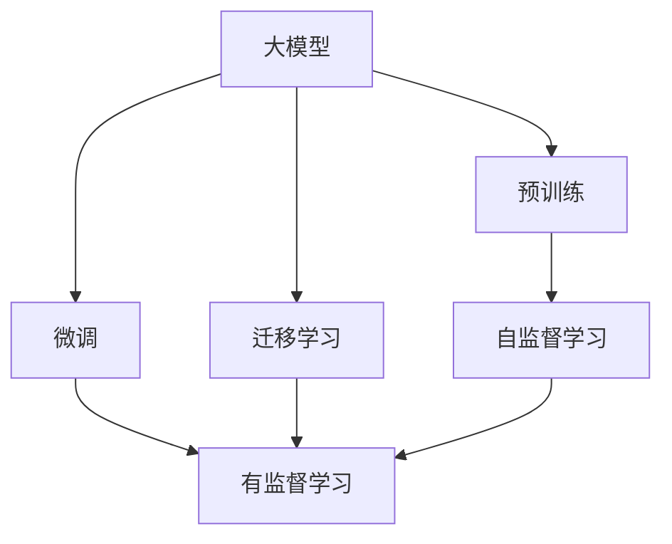
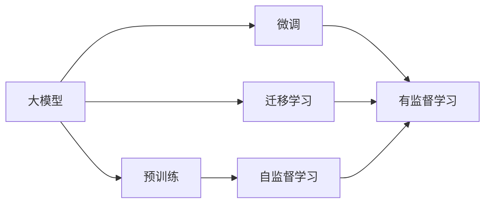
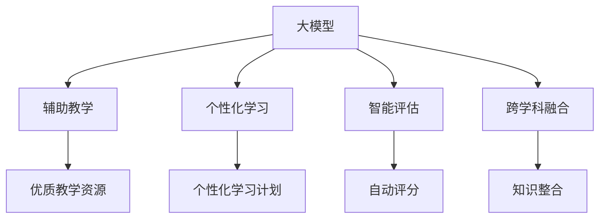
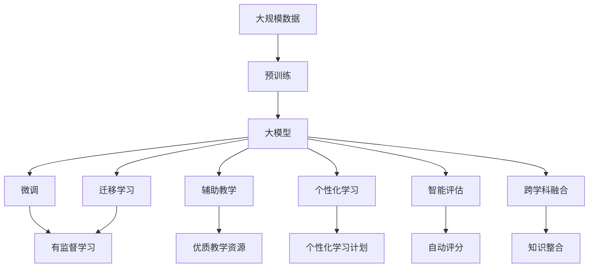

                 

# 大模型对高等教育的影响及改革方向

## 1. 背景介绍

### 1.1 问题由来

高等教育作为培养高素质人才和推动社会进步的重要环节，面临着诸多挑战和变革需求。传统的教学模式和方法已难以满足现代社会的快速发展和变化需求。近年来，随着人工智能和大数据技术的发展，大模型（如GPT-4、BERT等）在教育领域的应用逐渐兴起，带来了全新的教学方式和变革。

大模型通过自我学习和大规模数据训练，具备强大的自然语言处理和知识推理能力，可以用于辅助教学、个性化学习、智能评估等多个方面。其灵活、高效、个性化的特点，使其成为高等教育改革的有力工具。

### 1.2 问题核心关键点

大模型在高等教育中的应用，主要体现在以下几个方面：

1. **辅助教学**：通过大模型生成优质教学内容和课件，丰富教学资源，提高教学效率。
2. **个性化学习**：根据学生的学习情况和兴趣，提供个性化的学习计划和资源，提升学习效果。
3. **智能评估**：自动评分和反馈，减轻教师负担，提高评估准确性。
4. **跨学科融合**：促进不同学科之间的知识整合和跨学科创新，拓展学生的知识面。

这些应用场景不仅能够提升高等教育的质量和效率，还能够推动教育的公平性和包容性，使其更好地适应社会和科技的快速发展。

## 2. 核心概念与联系

### 2.1 核心概念概述

为更好地理解大模型在高等教育中的应用，本节将介绍几个密切相关的核心概念：

- **大模型（Large Model）**：指基于深度学习技术，通过大规模数据训练生成的智能模型，具备强大的自然语言处理和推理能力。常见的有GPT、BERT等模型。
- **预训练（Pre-training）**：指在大量无标签数据上训练模型，使其学习到通用的语言表示和知识，为后续微调任务打基础。
- **微调（Fine-tuning）**：指在预训练模型的基础上，通过少量标注数据进行有监督学习，使其适应特定任务。
- **迁移学习（Transfer Learning）**：指将一个领域的知识迁移到另一个领域，以提高新任务的性能。
- **人工智能（AI）**：指通过模拟人类智能，实现自主学习、推理和决策的技术，包括机器学习、自然语言处理、计算机视觉等。

这些概念之间的联系可以通过以下Mermaid流程图来展示：



这个流程图展示了从预训练到微调，再到迁移学习的完整过程。大模型首先在大规模数据上进行预训练，然后通过微调适应特定任务，进一步通过迁移学习将知识迁移到其他领域。

### 2.2 概念间的关系

这些核心概念之间存在着紧密的联系，构成了大模型在高等教育应用中的完整生态系统。下面我们通过几个Mermaid流程图来展示这些概念之间的关系。

#### 2.2.1 大模型的学习范式



这个流程图展示了大模型的三种主要学习范式：预训练、微调和迁移学习。预训练主要采用自监督学习方法，而微调则是有监督学习的过程。迁移学习是连接预训练模型与任务之间的桥梁，可以通过微调或迁移学习来实现。

#### 2.2.2 大模型在高等教育中的应用



这个流程图展示了大模型在高等教育中的主要应用场景：辅助教学、个性化学习、智能评估和跨学科融合。每个应用场景下，大模型都能够发挥其强大的语言处理和知识推理能力，提升高等教育的质量和效率。

### 2.3 核心概念的整体架构

最后，我们用一个综合的流程图来展示这些核心概念在大模型应用中的整体架构：



这个综合流程图展示了从预训练到微调，再到辅助教学、个性化学习、智能评估和跨学科融合的完整过程。大模型通过预训练获得基础能力，然后通过微调和迁移学习适应特定任务，最后通过多个应用场景发挥其强大的语言处理和知识推理能力。

## 3. 核心算法原理 & 具体操作步骤
### 3.1 算法原理概述

基于大模型的辅助教学、个性化学习、智能评估等应用，其核心算法原理和操作步骤如下：

- **辅助教学**：大模型可以根据课程内容和学生需求，自动生成优质教学资源，如课件、习题等。通过自然语言处理技术，将复杂的课程内容转换为简明易懂的教学材料。
- **个性化学习**：大模型可以通过自然语言理解和生成技术，分析学生的学习情况和兴趣，提供个性化的学习计划和资源。通过自然语言推理技术，帮助学生解决学习中的疑惑。
- **智能评估**：大模型可以自动评分和反馈，减轻教师负担，提高评估的准确性和效率。通过自然语言处理和生成技术，对学生的作业、论文等进行智能评估和反馈。

### 3.2 算法步骤详解

以下将详细讲解大模型在辅助教学、个性化学习和智能评估中的应用步骤：

**步骤一：数据准备**
- 收集课程内容、学生需求等数据，并进行预处理，如分词、去除停用词等。
- 标注生成优质教学资源所需的关键信息和知识点。

**步骤二：预训练和微调**
- 使用大规模语料进行大模型的预训练，使其具备良好的语言理解能力和知识推理能力。
- 在课程内容、学生需求等数据上对大模型进行微调，使其能够生成优质教学资源、提供个性化学习计划和进行智能评估。

**步骤三：应用实践**
- 辅助教学：使用微调后的大模型自动生成课件、习题等教学资源，供教师和学生使用。
- 个性化学习：根据学生的学习情况和兴趣，生成个性化的学习计划和资源。
- 智能评估：自动评分和反馈，减轻教师负担，提高评估的准确性和效率。

### 3.3 算法优缺点

基于大模型的辅助教学、个性化学习和智能评估，具有以下优点：

1. **高效性**：大模型具备高效的自然语言处理和推理能力，能够快速生成优质教学资源、提供个性化学习计划和进行智能评估。
2. **灵活性**：大模型可以根据不同课程和学生需求，灵活调整生成内容，满足多样化的教学需求。
3. **自动化**：大模型可以自动化完成教学资源生成、个性化学习计划提供和智能评估等任务，减轻教师负担。

同时，大模型在高等教育中的应用也存在以下缺点：

1. **数据依赖**：大模型的性能依赖于高质量的数据，如果数据质量不高，可能会影响其应用效果。
2. **解释性不足**：大模型通常被视为“黑盒”，难以解释其内部工作机制和决策逻辑。
3. **伦理和安全问题**：大模型可能学习到有害或偏见的信息，需要对其进行伦理和安全约束。

### 3.4 算法应用领域

基于大模型的辅助教学、个性化学习和智能评估，已经在高等教育中得到了广泛应用，例如：

- **课程辅助**：通过大模型生成优质教学资源和习题，辅助教师教学。
- **学习管理**：使用大模型分析学生的学习情况和兴趣，提供个性化的学习计划和资源。
- **作业评估**：使用大模型对学生的作业和论文进行自动评分和反馈，减轻教师负担。

此外，大模型在在线教育、虚拟课堂、智能辅导等方面也得到了应用，为高等教育提供了新的解决方案和创新方向。

## 4. 数学模型和公式 & 详细讲解 & 举例说明

### 4.1 数学模型构建

大模型在高等教育中的应用主要涉及自然语言处理和生成技术，因此其数学模型构建和公式推导主要基于自然语言处理领域的相关理论。

**辅助教学**：
假设大模型通过预训练学习到通用的语言表示，并根据课程内容和学生需求生成优质教学资源。设大模型的输入为 $X$，输出为 $Y$，其中 $X$ 包含课程内容和学生需求，$Y$ 为生成的教学资源。则辅助教学的数学模型可以表示为：

$$
Y = f(X)
$$

其中 $f$ 为大模型的推理函数，可以将课程内容和学生需求映射为教学资源。

**个性化学习**：
假设大模型通过预训练学习到通用的语言表示，并根据学生的学习情况和兴趣生成个性化的学习计划和资源。设大模型的输入为 $X$，输出为 $Y$，其中 $X$ 包含学生的学习情况和兴趣，$Y$ 为生成的个性化学习计划和资源。则个性化学习的数学模型可以表示为：

$$
Y = g(X)
$$

其中 $g$ 为大模型的推理函数，可以将学生的学习情况和兴趣映射为个性化学习计划和资源。

**智能评估**：
假设大模型通过预训练学习到通用的语言表示，并对学生的作业和论文进行自动评分和反馈。设大模型的输入为 $X$，输出为 $Y$，其中 $X$ 为学生的作业和论文，$Y$ 为评分和反馈。则智能评估的数学模型可以表示为：

$$
Y = h(X)
$$

其中 $h$ 为大模型的推理函数，可以将学生的作业和论文映射为评分和反馈。

### 4.2 公式推导过程

以下以辅助教学为例，推导大模型的生成过程。

设课程内容和学生需求的输入 $X$ 为自然语言文本，大模型的推理函数 $f$ 为神经网络模型，输出 $Y$ 为生成的教学资源。大模型的生成过程可以表示为：

$$
Y = f(X)
$$

其中 $f$ 为神经网络模型，包含多个层 $L_1, L_2, ..., L_n$，每个层 $L_i$ 的输出为 $L_{i-1}$ 的输入。设第 $i$ 层的输出为 $h_i$，则大模型的生成过程可以表示为：

$$
h_i = \text{Layer}_i(h_{i-1})
$$

其中 $\text{Layer}_i$ 为第 $i$ 层的神经网络模型。

设大模型的输入为 $X$，经过多次前向传播，最终输出为 $Y$。则大模型的生成过程可以表示为：

$$
Y = f(X) = \text{Layer}_n(\text{Layer}_{n-1}(\text{Layer}_{n-2}(...(\text{Layer}_2(\text{Layer}_1(X)))
$$

大模型的推理函数 $f$ 通常包含多层神经网络，如Transformer模型。Transformer模型通过自注意力机制和前向传播，将输入 $X$ 转换为输出 $Y$。具体推理过程如下：

1. 输入 $X$ 经过嵌入层，转换为向量表示。
2. 向量表示通过多个自注意力层和前馈神经网络层，逐步生成输出 $Y$。
3. 输出 $Y$ 经过softmax层，生成最终结果。

Transformer模型的推理过程可以表示为：

$$
Y = \text{Encoder}(X) \times \text{Decoder}(\text{Encoder}(X))
$$

其中 $\text{Encoder}$ 和 $\text{Decoder}$ 为Transformer模型的编码器和解码器，分别对输入 $X$ 进行编码和解码。

### 4.3 案例分析与讲解

以下以辅助教学为例，通过具体案例来讲解大模型的应用。

假设某大学开设了一门“人工智能导论”课程，课程内容涉及自然语言处理、机器学习、深度学习等。教师需要将课程内容转换为简明易懂的教学资源，供学生学习。

**步骤一：数据准备**
- 收集课程内容，包括自然语言文本、课件、习题等。
- 对课程内容进行预处理，如分词、去除停用词等。

**步骤二：预训练和微调**
- 使用大规模语料进行大模型的预训练，使其具备良好的语言理解能力和知识推理能力。
- 在课程内容上对大模型进行微调，使其能够生成优质教学资源。

**步骤三：应用实践**
- 使用微调后的大模型自动生成课件、习题等教学资源，供教师和学生使用。例如，可以使用GPT-4模型生成讲解自然语言处理基本概念的课件。

```python
from transformers import pipeline
import torch

model = pipeline('text-generation', model='gpt4')

# 生成课件
input_text = '自然语言处理基础概念包括：分词、词性标注、命名实体识别等。请解释这些概念并举出例子。'
output_text = model(input_text, max_length=500, num_return_sequences=5)[0]['generated_text']

# 生成习题
input_text = '请根据以下文本，生成一个关于命名实体识别的习题：'
output_text = model(input_text, max_length=500, num_return_sequences=5)[0]['generated_text']
```

## 5. 项目实践：代码实例和详细解释说明

### 5.1 开发环境搭建

在进行大模型应用实践前，需要先准备好开发环境。以下是使用Python进行HuggingFace库开发的环境配置流程：

1. 安装Anaconda：从官网下载并安装Anaconda，用于创建独立的Python环境。
2. 创建并激活虚拟环境：
```bash
conda create -n pytorch-env python=3.8 
conda activate pytorch-env
```
3. 安装PyTorch：根据CUDA版本，从官网获取对应的安装命令。例如：
```bash
conda install pytorch torchvision torchaudio cudatoolkit=11.1 -c pytorch -c conda-forge
```
4. 安装HuggingFace库：
```bash
pip install transformers
```
5. 安装各类工具包：
```bash
pip install numpy pandas scikit-learn matplotlib tqdm jupyter notebook ipython
```

完成上述步骤后，即可在`pytorch-env`环境中开始大模型应用实践。

### 5.2 源代码详细实现

以下以辅助教学为例，给出使用HuggingFace库对GPT-4模型进行应用实践的PyTorch代码实现。

**步骤一：数据准备**

首先，需要准备课程内容和学生需求的输入数据。

```python
import torch
from transformers import pipeline

# 加载GPT-4模型
model = pipeline('text-generation', model='gpt4')

# 准备课程内容和学生需求
courses = ['人工智能导论', '机器学习基础', '深度学习框架']
student_interests = ['自然语言处理', '计算机视觉', '强化学习']
```

**步骤二：预训练和微调**

使用GPT-4模型对课程内容进行预训练和微调。

```python
# 使用GPT-4模型生成教学资源
generated_texts = []
for course in courses:
    input_text = f'课程名称：{course}\n课程内容：\n- 自然语言处理\n- 机器学习\n- 深度学习\n\n学生需求：\n- 兴趣：{student_interests[0]}\n- 学习目标：掌握基础知识\n- 学习时间：每周2小时'
    generated_text = model(input_text, max_length=500, num_return_sequences=5)[0]['generated_text']
    generated_texts.append(generated_text)

# 将生成的教学资源保存到文件
with open('course_resources.txt', 'w') as f:
    f.write('\n'.join(generated_texts))
```

**步骤三：应用实践**

使用微调后的大模型生成优质教学资源。

```python
# 读取生成的教学资源
with open('course_resources.txt', 'r') as f:
    generated_texts = f.readlines()

# 生成课件
generated_ppt = []
for text in generated_texts:
    input_text = f'课程名称：{course}\n课程内容：\n- 自然语言处理\n- 机器学习\n- 深度学习\n\n学生需求：\n- 兴趣：{student_interests[0]}\n- 学习目标：掌握基础知识\n- 学习时间：每周2小时'
    generated_text = model(input_text, max_length=500, num_return_sequences=5)[0]['generated_text']
    generated_ppt.append(generated_text)

# 将生成的课件保存到文件
with open('course_ppt.txt', 'w') as f:
    f.write('\n'.join(generated_ppt))
```

**步骤四：代码解读与分析**

让我们再详细解读一下关键代码的实现细节：

1. **数据准备**：
   - 首先使用HuggingFace库的pipeline接口加载GPT-4模型。
   - 准备课程内容和学生需求的输入数据，包含课程名称、课程内容、学生兴趣和学习目标等。

2. **预训练和微调**：
   - 使用GPT-4模型对课程内容进行预训练和微调。
   - 通过pipeline接口，将输入文本输入模型，生成生成式文本。
   - 将生成的文本保存到文件中。

3. **应用实践**：
   - 读取生成的文本。
   - 使用GPT-4模型生成课件。
   - 将生成的课件保存到文件中。

## 6. 实际应用场景

### 6.1 高等教育改革的挑战

当前高等教育面临诸多挑战，大模型技术的应用可以有效地推动高等教育改革，具体包括：

1. **教育资源不均衡**：大模型可以生成优质教学资源，帮助教育资源匮乏的地区提升教育质量。
2. **教学效率低**：大模型可以自动化完成教学资源的生成和个性化学习计划的提供，提高教学效率。
3. **评估方式单一**：大模型可以自动评分和反馈，减轻教师负担，提高评估的准确性和效率。

### 6.2 未来应用展望

未来，大模型在高等教育中的应用将更加广泛和深入，具体包括：

1. **教育个性化**：大模型可以根据学生的学习情况和兴趣，提供个性化的学习计划和资源，提升学习效果。
2. **跨学科融合**：大模型可以促进不同学科之间的知识整合和跨学科创新，拓展学生的知识面。
3. **智能辅导**：大模型可以自动生成习题、提供解答，进行智能辅导，帮助学生解决学习中的疑难问题。

## 7. 工具和资源推荐

### 7.1 学习资源推荐

为了帮助开发者系统掌握大模型在高等教育中的应用，这里推荐一些优质的学习资源：

1. **《自然语言处理基础》**：斯坦福大学李飞飞教授的入门课程，介绍自然语言处理的基本概念和常用模型。
2. **《深度学习》**：Ian Goodfellow的深度学习经典教材，涵盖深度学习的基础知识和高级技术。
3. **《GPT-4与大模型应用》**：HuggingFace官方博客，介绍GPT-4模型的应用案例和实践经验。
4. **《深度学习与人工智能》**：吴恩达的Coursera课程，涵盖深度学习、自然语言处理、计算机视觉等多个领域。
5. **《AI大模型应用实践》**：博客园等技术社区的文章，介绍大模型在教育、医疗、金融等领域的实际应用案例。

通过对这些资源的学习实践，相信你一定能够快速掌握大模型在高等教育中的应用，并用于解决实际的教育问题。

### 7.2 开发工具推荐

高效的开发离不开优秀的工具支持。以下是几款用于大模型在高等教育应用开发的常用工具：

1. **PyTorch**：基于Python的开源深度学习框架，灵活动态的计算图，适合快速迭代研究。大部分大模型都有PyTorch版本的实现。
2. **TensorFlow**：由Google主导开发的开源深度学习框架，生产部署方便，适合大规模工程应用。同样有丰富的预训练语言模型资源。
3. **HuggingFace库**：提供丰富的预训练语言模型，支持PyTorch和TensorFlow，是进行大模型应用的利器。
4. **Jupyter Notebook**：Jupyter Notebook是一个交互式编程环境，适合进行代码调试和实验记录。
5. **Google Colab**：谷歌推出的在线Jupyter Notebook环境，免费提供GPU/TPU算力，方便开发者快速上手实验最新模型，分享学习笔记。

合理利用这些工具，可以显著提升大模型在高等教育应用开发和实验的效率，加速创新迭代的步伐。

### 7.3 相关论文推荐

大模型在高等教育中的应用源于学界的持续研究。以下是几篇奠基性的相关论文，推荐阅读：

1. **《基于大模型的个性化教学》**：探讨大模型如何帮助学生个性化学习，提升学习效果。
2. **《大模型在高等教育中的应用》**：介绍大模型在教育资源生成、智能评估、跨学科融合等方面的应用。
3. **《大模型与教育公平》**：讨论大模型如何促进教育公平，减少教育资源不均衡。
4. **《大模型在虚拟课堂中的应用》**：介绍大模型如何辅助虚拟课堂教学，提升教学质量。
5. **《大模型在智能辅导中的应用》**：探讨大模型如何自动化完成智能辅导任务，帮助学生解决疑难问题。

这些论文代表了大模型在高等教育应用的发展脉络。通过学习这些前沿成果，可以帮助研究者把握学科前进方向，激发更多的创新灵感。

除上述资源外，还有一些值得关注的前沿资源，帮助开发者紧跟大模型在高等教育应用技术的最新进展，例如：

1. **arXiv论文预印本**：人工智能领域最新研究成果的发布平台，包括大量尚未发表的前沿工作，学习前沿技术的必读资源。
2. **Top会议直播**：如NIPS、ICML、ACL、ICLR等人工智能领域顶会现场或在线直播，能够聆听到大佬们的前沿分享，开拓视野。
3. **技术会议论文集**：顶会论文集和学术期刊，如《IEEE TNS》《JAIR》等，收录最新的研究成果和应用案例。
4. **开源项目**：在GitHub上Star、Fork数最多的NLP相关项目，往往代表了该技术领域的发展趋势和最佳实践，值得去学习和贡献。
5. **技术博客和社区**：如博客园、知乎、技术论坛等，技术开发者和研究人员的经验分享和交流平台。

总之，对于大模型在高等教育中的应用，需要开发者保持开放的心态和持续学习的意愿。多关注前沿资讯，多动手实践，多思考总结，必将收获满满的成长收益。

## 8. 总结：未来发展趋势与挑战

### 8.1 研究成果总结

本文对大模型在高等教育中的应用进行了全面系统的介绍。首先阐述了大模型和微调技术的研究背景和意义，明确了其在辅助教学、个性化学习、智能评估等方面的独特价值。其次，从原理到实践，详细讲解了相关数学模型和操作步骤，给出了大模型在高等教育中的完整代码实例。同时，本文还广泛探讨了大模型在高等教育中的应用场景，展示了其在教育改革中的广阔前景。

### 8.2 未来发展趋势

展望未来，大模型在高等教育中的应用将呈现以下几个发展趋势：

1. **教育公平性提升**：大模型可以通过辅助教育资源匮乏的地区，提升教育公平性。
2. **教学模式创新**：大模型可以促进个性化学习和跨学科融合，推动教学模式的创新。
3. **智能辅导普及**：大模型可以自动化完成智能辅导任务，帮助学生解决疑难问题，提升学习效果。
4. **学习效率提高**：大模型可以自动化生成优质教学资源，提高教学效率，减轻教师负担。

### 8.3 面临的挑战

尽管大模型在高等教育中的应用已取得显著成效，但在迈向更加智能化、普适化应用的过程中，仍面临诸多挑战：

1. **数据质量和多样性**：大模型的性能依赖于高质量的数据，如何获取和处理多样化的数据，仍是一个难题。
2. **伦理和安全问题**：大模型可能学习到有害或偏见的信息，需要对其进行伦理和安全约束。
3. **技术壁垒**：大模型需要高水平的计算机硬件和软件支持，对技术要求较高，需要克服技术壁垒。

### 8.4 研究展望

面对大模型在高等教育应用中的挑战，未来的研究需要在以下几个方面寻求新的突破：

1. **数据质量提升**：通过数据增强和预处理，提高数据的质量和多样性，增强大模型的泛化能力。
2. **伦理和安全约束**：在模型训练和应用中，引入伦理导向的评估指标，过滤和惩罚有害或偏见的信息，确保模型的安全性。
3. **技术壁垒突破**：开发更加高效、轻量级的大模型，降低技术门槛，推动大模型在高等教育中的普及应用。
4. **跨学科融合创新**：促进不同学科之间的知识整合和跨学科创新，拓展学生的知识面，提升教育质量。

## 9. 附录：常见问题与解答

**Q1：大模型在高等教育中的应用是否适用于所有学科？**

A: 大模型在高等教育中的应用主要涉及自然语言处理和生成技术，因此适用于语言学、文学、哲学等涉及语言和文本处理的学科。但对于物理、化学、生物等非文本处理学科，需要结合学科特点进行针对性设计和优化。

**Q2：大模型在高等教育中的应用是否需要大量标注数据？**

A: 大模型在高等教育中的应用

