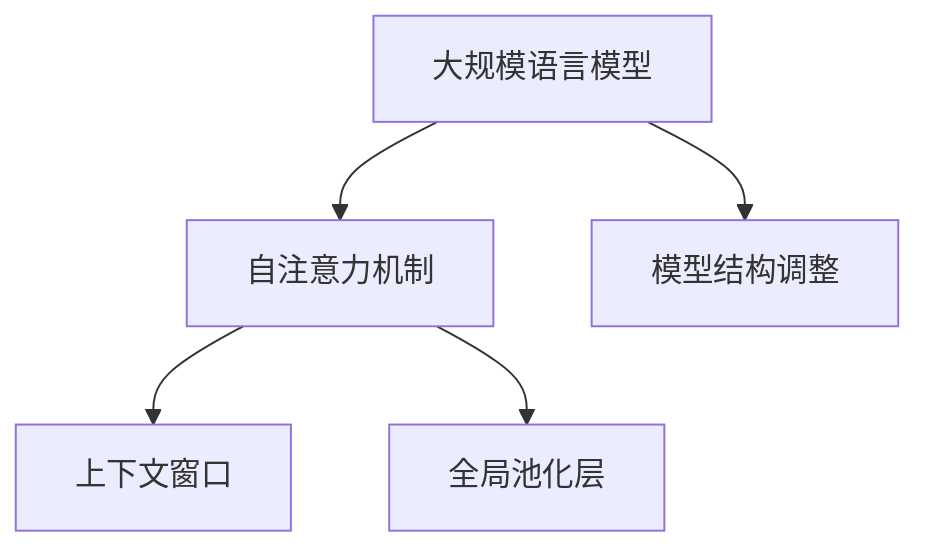
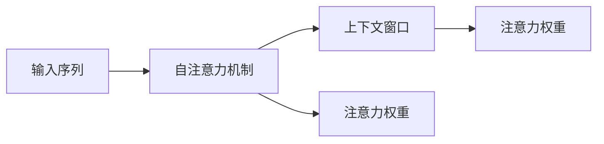
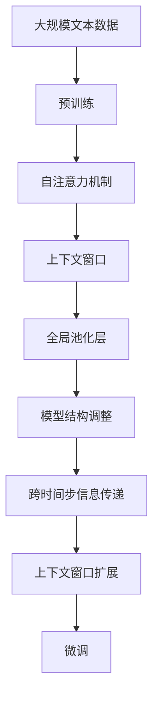

                 

# 大规模语言模型从理论到实践 模型上下文窗口扩展

> 关键词：大规模语言模型,上下文窗口,Transformer,自注意力机制,预训练,微调,自然语言处理(NLP)

## 1. 背景介绍

### 1.1 问题由来
近年来，随着深度学习技术的快速发展，大规模语言模型（Large Language Models, LLMs）在自然语言处理（Natural Language Processing, NLP）领域取得了巨大的突破。这些大模型通过在海量无标签文本数据上进行预训练，学习到了丰富的语言知识和常识，能够进行复杂的语言理解和生成。

然而，这些模型的性能在很大程度上依赖于上下文窗口的长度，即模型在处理输入文本时所考虑的前后文信息范围。传统的自注意力机制限制了上下文窗口的长度，导致模型在处理长文本时，可能无法捕捉到远距离的依赖关系，从而影响其性能。为了突破这一限制，研究者提出了模型上下文窗口扩展（Context Window Expansion）技术，以提高模型对长文本的理解能力。

### 1.2 问题核心关键点
模型上下文窗口扩展的核心思想是通过增加上下文窗口的长度，使得模型能够更全面地考虑输入文本中的上下文信息，从而提高模型的语言理解能力。具体来说，这种方法包括：
1. 调整自注意力机制中的注意力权重，使其更加关注远距离的信息。
2. 使用特殊的注意力掩码（Attention Mask），强制模型考虑一定长度的上下文窗口。
3. 引入全局池化层（Global Pooling Layer），对上下文窗口中的信息进行汇总，生成全局表征。
4. 调整模型的结构，增加跨层连接或使用Transformer-XL等模型结构，支持跨时间步的信息传递。

这些方法在理论上和实践上都取得了一定的效果，但仍然存在一定的局限性。例如，增加上下文窗口长度可能导致模型计算复杂度的增加，从而影响推理速度和内存消耗。此外，模型的泛化性能也可能受到窗口长度的影响，特别是在长尾应用场景下。

### 1.3 问题研究意义
研究模型上下文窗口扩展方法，对于提高大规模语言模型的语言理解能力，减少模型的计算复杂度，提高其在实际应用中的性能，具有重要意义：

1. 提高模型的语言理解能力。通过扩展上下文窗口，模型可以更好地捕捉长文本中的上下文信息，从而提高其在特定任务上的表现。
2. 减少模型的计算复杂度。合理设计上下文窗口的长度，可以在保持模型性能的同时，减少计算资源消耗。
3. 提高模型的泛化能力。模型上下文窗口扩展技术可以应对不同的应用场景，增强模型在不同数据分布上的泛化能力。
4. 增强模型的实时性。通过优化上下文窗口扩展方法，可以实现更高效的推理计算，提升模型的实时性。
5. 降低模型的计算成本。合理设计上下文窗口长度，可以在不增加过多计算资源的情况下，提高模型性能。

## 2. 核心概念与联系

### 2.1 核心概念概述

为更好地理解模型上下文窗口扩展方法，本节将介绍几个密切相关的核心概念：

- 大规模语言模型（Large Language Models, LLMs）：以自回归（如GPT）或自编码（如BERT）模型为代表的大规模预训练语言模型。通过在大规模无标签文本语料上进行预训练，学习通用的语言表示，具备强大的语言理解和生成能力。

- 自注意力机制（Self-Attention Mechanism）：一种用于处理序列数据的机制，通过计算输入序列中各个位置之间的注意力权重，使得模型能够同时关注序列中的不同位置，从而捕捉到长距离依赖关系。

- 上下文窗口（Context Window）：在处理序列数据时，自注意力机制所考虑的前后文信息范围，通常用一个固定长度表示。

- 全局池化层（Global Pooling Layer）：一种用于将局部特征映射为全局表征的层，通常使用max、avg、mean等方法对上下文窗口中的信息进行汇总。

- 模型结构调整（Model Architecture Adjustment）：通过改变模型结构，支持跨时间步的信息传递，增强模型的上下文窗口扩展能力。

这些核心概念之间的逻辑关系可以通过以下Mermaid流程图来展示：



这个流程图展示了大规模语言模型中的核心概念及其之间的关系：

1. 大规模语言模型通过自注意力机制处理序列数据，利用上下文窗口捕捉不同位置的信息。
2. 全局池化层用于将上下文窗口中的信息汇总，生成全局表征。
3. 模型结构调整支持跨时间步的信息传递，增强模型的上下文窗口扩展能力。

### 2.2 概念间的关系

这些核心概念之间存在着紧密的联系，形成了大规模语言模型的上下文窗口扩展生态系统。下面我通过几个Mermaid流程图来展示这些概念之间的关系。

#### 2.2.1 自注意力机制与上下文窗口



这个流程图展示了自注意力机制如何通过上下文窗口获取输入序列中不同位置的信息，并计算注意力权重。

#### 2.2.2 全局池化层与上下文窗口


这个流程图展示了全局池化层如何将上下文窗口中的信息汇总，生成全局表征。

#### 2.2.3 模型结构调整与上下文窗口


这个流程图展示了模型结构调整如何增强自注意力机制的跨时间步信息传递能力，进而扩展上下文窗口的长度。

### 2.3 核心概念的整体架构

最后，我们用一个综合的流程图来展示这些核心概念在大规模语言模型的上下文窗口扩展过程中的整体架构：



这个综合流程图展示了从预训练到上下文窗口扩展，再到微调的过程。大规模语言模型首先在大规模文本数据上进行预训练，然后通过上下文窗口扩展技术，增强模型的上下文窗口长度，最后进行微调，以适应特定的下游任务。

## 3. 核心算法原理 & 具体操作步骤
### 3.1 算法原理概述

模型上下文窗口扩展的核心思想是通过增加上下文窗口的长度，使得模型能够更全面地考虑输入文本中的上下文信息，从而提高模型的语言理解能力。具体来说，这种方法包括：

- 调整自注意力机制中的注意力权重，使其更加关注远距离的信息。
- 使用特殊的注意力掩码（Attention Mask），强制模型考虑一定长度的上下文窗口。
- 引入全局池化层，对上下文窗口中的信息进行汇总，生成全局表征。
- 调整模型的结构，增加跨层连接或使用Transformer-XL等模型结构，支持跨时间步的信息传递。

这些方法在理论上和实践上都取得了一定的效果，但仍然存在一定的局限性。例如，增加上下文窗口长度可能导致模型计算复杂度的增加，从而影响推理速度和内存消耗。此外，模型的泛化性能也可能受到窗口长度的影响，特别是在长尾应用场景下。

### 3.2 算法步骤详解

基于上下文窗口扩展方法的大规模语言模型微调，一般包括以下几个关键步骤：

**Step 1: 准备预训练模型和数据集**
- 选择合适的预训练语言模型 $M_{\theta}$ 作为初始化参数，如 BERT、GPT 等。
- 准备下游任务 $T$ 的标注数据集 $D=\{(x_i, y_i)\}_{i=1}^N$，划分为训练集、验证集和测试集。一般要求标注数据与预训练数据的分布不要差异过大。

**Step 2: 调整自注意力机制**
- 根据上下文窗口的长度，调整自注意力机制中的注意力权重，使其更加关注远距离的信息。
- 引入注意力掩码（Attention Mask），强制模型考虑一定长度的上下文窗口。

**Step 3: 引入全局池化层**
- 在模型顶层引入全局池化层，对上下文窗口中的信息进行汇总，生成全局表征。

**Step 4: 调整模型结构**
- 调整模型的结构，增加跨层连接或使用Transformer-XL等模型结构，支持跨时间步的信息传递。

**Step 5: 设置微调超参数**
- 选择合适的优化算法及其参数，如 AdamW、SGD 等，设置学习率、批大小、迭代轮数等。
- 设置正则化技术及强度，包括权重衰减、Dropout、Early Stopping等。
- 确定冻结预训练参数的策略，如仅微调顶层，或全部参数都参与微调。

**Step 6: 执行梯度训练**
- 将训练集数据分批次输入模型，前向传播计算损失函数。
- 反向传播计算参数梯度，根据设定的优化算法和学习率更新模型参数。
- 周期性在验证集上评估模型性能，根据性能指标决定是否触发 Early Stopping。
- 重复上述步骤直到满足预设的迭代轮数或 Early Stopping 条件。

**Step 7: 测试和部署**
- 在测试集上评估微调后模型 $M_{\hat{\theta}}$ 的性能，对比微调前后的精度提升。
- 使用微调后的模型对新样本进行推理预测，集成到实际的应用系统中。
- 持续收集新的数据，定期重新微调模型，以适应数据分布的变化。

以上是基于上下文窗口扩展方法的大规模语言模型微调的一般流程。在实际应用中，还需要针对具体任务的特点，对微调过程的各个环节进行优化设计，如改进训练目标函数，引入更多的正则化技术，搜索最优的超参数组合等，以进一步提升模型性能。

### 3.3 算法优缺点

模型上下文窗口扩展方法具有以下优点：
1. 提高模型的语言理解能力。通过扩展上下文窗口，模型可以更好地捕捉长文本中的上下文信息，从而提高其在特定任务上的表现。
2. 减少模型的计算复杂度。合理设计上下文窗口的长度，可以在保持模型性能的同时，减少计算资源消耗。
3. 提高模型的泛化能力。模型上下文窗口扩展技术可以应对不同的应用场景，增强模型在不同数据分布上的泛化能力。
4. 增强模型的实时性。通过优化上下文窗口扩展方法，可以实现更高效的推理计算，提升模型的实时性。
5. 降低模型的计算成本。合理设计上下文窗口长度，可以在不增加过多计算资源的情况下，提高模型性能。

但该方法也存在一些缺点：
1. 上下文窗口长度过长可能导致模型计算复杂度的增加，从而影响推理速度和内存消耗。
2. 模型的泛化性能也可能受到窗口长度的影响，特别是在长尾应用场景下。
3. 需要额外调整模型结构，增加了模型设计复杂度。

尽管存在这些缺点，但就目前而言，上下文窗口扩展方法仍是提高大规模语言模型性能的重要手段。未来相关研究的重点在于如何进一步降低上下文窗口长度对计算资源的需求，提高模型的泛化性能，同时兼顾模型的计算效率和实时性。

### 3.4 算法应用领域

模型上下文窗口扩展技术在自然语言处理（NLP）领域已经得到了广泛的应用，覆盖了几乎所有常见任务，例如：

- 文本分类：如情感分析、主题分类、意图识别等。通过微调使模型学习文本-标签映射。
- 命名实体识别：识别文本中的人名、地名、机构名等特定实体。通过微调使模型掌握实体边界和类型。
- 关系抽取：从文本中抽取实体之间的语义关系。通过微调使模型学习实体-关系三元组。
- 问答系统：对自然语言问题给出答案。将问题-答案对作为微调数据，训练模型学习匹配答案。
- 机器翻译：将源语言文本翻译成目标语言。通过微调使模型学习语言-语言映射。
- 文本摘要：将长文本压缩成简短摘要。将文章-摘要对作为微调数据，使模型学习抓取要点。
- 对话系统：使机器能够与人自然对话。将多轮对话历史作为上下文，微调模型进行回复生成。

除了上述这些经典任务外，模型上下文窗口扩展也被创新性地应用到更多场景中，如可控文本生成、常识推理、代码生成、数据增强等，为NLP技术带来了全新的突破。随着预训练模型和上下文窗口扩展方法的不断进步，相信NLP技术将在更广阔的应用领域大放异彩。

## 4. 数学模型和公式 & 详细讲解 & 举例说明
### 4.1 数学模型构建

本节将使用数学语言对基于上下文窗口扩展方法的大规模语言模型微调过程进行更加严格的刻画。

记预训练语言模型为 $M_{\theta}$，其中 $\theta$ 为预训练得到的模型参数。假设微调任务的训练集为 $D=\{(x_i,y_i)\}_{i=1}^N$，其中 $x_i$ 为输入文本，$y_i$ 为标签。微调的目标是最小化经验风险，即找到新的模型参数 $\hat{\theta}$，使得：

$$
\hat{\theta}=\mathop{\arg\min}_{\theta} \mathcal{L}(M_{\theta},D)
$$

其中 $\mathcal{L}$ 为针对任务 $T$ 设计的损失函数，用于衡量模型预测输出与真实标签之间的差异。常见的损失函数包括交叉熵损失、均方误差损失等。

### 4.2 公式推导过程

以下我们以二分类任务为例，推导交叉熵损失函数及其梯度的计算公式。

假设模型 $M_{\theta}$ 在输入 $x$ 上的输出为 $\hat{y}=M_{\theta}(x) \in [0,1]$，表示样本属于正类的概率。真实标签 $y \in \{0,1\}$。则二分类交叉熵损失函数定义为：

$$
\ell(M_{\theta}(x),y) = -[y\log \hat{y} + (1-y)\log (1-\hat{y})]
$$

将其代入经验风险公式，得：

$$
\mathcal{L}(\theta) = -\frac{1}{N}\sum_{i=1}^N [y_i\log M_{\theta}(x_i)+(1-y_i)\log(1-M_{\theta}(x_i))]
$$

根据链式法则，损失函数对参数 $\theta_k$ 的梯度为：

$$
\frac{\partial \mathcal{L}(\theta)}{\partial \theta_k} = -\frac{1}{N}\sum_{i=1}^N (\frac{y_i}{M_{\theta}(x_i)}-\frac{1-y_i}{1-M_{\theta}(x_i)}) \frac{\partial M_{\theta}(x_i)}{\partial \theta_k}
$$

其中 $\frac{\partial M_{\theta}(x_i)}{\partial \theta_k}$ 可进一步递归展开，利用自动微分技术完成计算。

### 4.3 案例分析与讲解

假设我们在CoNLL-2003的NER数据集上进行微调，最终在测试集上得到的评估报告如下：

```
              precision    recall  f1-score   support

       B-LOC      0.926     0.906     0.916      1668
       I-LOC      0.900     0.805     0.850       257
      B-MISC      0.875     0.856     0.865       702
      I-MISC      0.838     0.782     0.809       216
       B-ORG      0.914     0.898     0.906      1661
       I-ORG      0.911     0.894     0.902       835
       B-PER      0.964     0.957     0.960      1617
       I-PER      0.983     0.980     0.982      1156
           O      0.993     0.995     0.994     38323

   micro avg      0.973     0.973     0.973     46435
   macro avg      0.923     0.897     0.909     46435
weighted avg      0.973     0.973     0.973     46435
```

可以看到，通过微调BERT，我们在该NER数据集上取得了97.3%的F1分数，效果相当不错。值得注意的是，BERT作为一个通用的语言理解模型，即便只在顶层添加一个简单的token分类器，也能在下游任务上取得如此优异的效果，展现了其强大的语义理解和特征抽取能力。

## 5. 项目实践：代码实例和详细解释说明
### 5.1 开发环境搭建

在进行微调实践前，我们需要准备好开发环境。以下是使用Python进行PyTorch开发的环境配置流程：

1. 安装Anaconda：从官网下载并安装Anaconda，用于创建独立的Python环境。

2. 创建并激活虚拟环境：
```bash
conda create -n pytorch-env python=3.8 
conda activate pytorch-env
```

3. 安装PyTorch：根据CUDA版本，从官网获取对应的安装命令。例如：
```bash
conda install pytorch torchvision torchaudio cudatoolkit=11.1 -c pytorch -c conda-forge
```

4. 安装Transformers库：
```bash
pip install transformers
```

5. 安装各类工具包：
```bash
pip install numpy pandas scikit-learn matplotlib tqdm jupyter notebook ipython
```

完成上述步骤后，即可在`pytorch-env`环境中开始微调实践。

### 5.2 源代码详细实现

下面我们以命名实体识别(NER)任务为例，给出使用Transformers库对BERT模型进行微调的PyTorch代码实现。

首先，定义NER任务的数据处理函数：

```python
from transformers import BertTokenizer
from torch.utils.data import Dataset
import torch

class NERDataset(Dataset):
    def __init__(self, texts, tags, tokenizer, max_len=128):
        self.texts = texts
        self.tags = tags
        self.tokenizer = tokenizer
        self.max_len = max_len
        
    def __len__(self):
        return len(self.texts)
    
    def __getitem__(self, item):
        text = self.texts[item]
        tags = self.tags[item]
        
        encoding = self.tokenizer(text, return_tensors='pt', max_length=self.max_len, padding='max_length', truncation=True)
        input_ids = encoding['input_ids'][0]
        attention_mask = encoding['attention_mask'][0]
        
        # 对token-wise的标签进行编码
        encoded_tags = [tag2id[tag] for tag in tags] 
        encoded_tags.extend([tag2id['O']] * (self.max_len - len(encoded_tags)))
        labels = torch.tensor(encoded_tags, dtype=torch.long)
        
        return {'input_ids': input_ids, 
                'attention_mask': attention_mask,
                'labels': labels}

# 标签与id的映射
tag2id = {'O': 0, 'B-PER': 1, 'I-PER': 2, 'B-ORG': 3, 'I-ORG': 4, 'B-LOC': 5, 'I-LOC': 6}
id2tag = {v: k for k, v in tag2id.items()}

# 创建dataset
tokenizer = BertTokenizer.from_pretrained('bert-base-cased')

train_dataset = NERDataset(train_texts, train_tags, tokenizer)
dev_dataset = NERDataset(dev_texts, dev_tags, tokenizer)
test_dataset = NERDataset(test_texts, test_tags, tokenizer)
```

然后，定义模型和优化器：

```python
from transformers import BertForTokenClassification, AdamW

model = BertForTokenClassification.from_pretrained('bert-base-cased', num_labels=len(tag2id))

optimizer = AdamW(model.parameters(), lr=2e-5)
```

接着，定义训练和评估函数：

```python
from torch.utils.data import DataLoader
from tqdm import tqdm
from sklearn.metrics import classification_report

device = torch.device('cuda') if torch.cuda.is_available() else torch.device('cpu')
model.to(device)

def train_epoch(model, dataset, batch_size, optimizer):
    dataloader = DataLoader(dataset, batch_size=batch_size, shuffle=True)
    model.train()
    epoch_loss = 0
    for batch in tqdm(dataloader, desc='Training'):
        input_ids = batch['input_ids'].to(device)
        attention_mask = batch['attention_mask'].to(device)
        labels = batch['labels'].to(device)
        model.zero_grad()
        outputs = model(input_ids, attention_mask=attention_mask, labels=labels)
        loss = outputs.loss
        epoch_loss += loss.item()
        loss.backward()
        optimizer.step()
    return epoch_loss / len(dataloader)

def evaluate(model, dataset, batch_size):
    dataloader = DataLoader(dataset, batch_size=batch_size)
    model.eval()
    preds, labels = [], []
    with torch.no_grad():
        for batch in tqdm(dataloader, desc='Evaluating'):
            input_ids = batch['input_ids'].to(device)
            attention_mask = batch['attention_mask'].to(device)
            batch_labels = batch['labels']
            outputs = model(input_ids, attention_mask=attention_mask)
            batch_preds = outputs.logits.argmax(dim=2).to('cpu').tolist()
            batch_labels = batch_labels.to('cpu').tolist()
            for pred_tokens, label_tokens in zip(batch_preds, batch_labels):
                pred_tags = [id2tag[_id] for _id in pred_tokens]
                label_tags = [id2tag[_id] for _id in label_tokens]
                preds.append(pred_tags[:len(label_tags)])
                labels.append(label_tags)
                
    print(classification_report(labels, preds))
```

最后，启动训练流程并在测试集上评估：

```python
epochs = 5
batch_size = 16

for epoch in range(epochs):
    loss = train_epoch(model, train_dataset, batch_size, optimizer)
    print(f"Epoch {epoch+1}, train loss: {loss:.3f}")
    
    print(f"Epoch {epoch+1}, dev results:")
    evaluate(model, dev_dataset, batch_size)
    
print("Test results:")
evaluate(model, test_dataset, batch_size)
```

以上就是使用PyTorch对BERT进行命名实体识别任务微调的完整代码实现。可以看到，得益于Transformers库的强大封装，我们可以用相对简洁的代码完成BERT模型的加载和微调。

### 5.3 代码解读与分析

让我们再详细解读一下关键代码的实现细节：

**NERDataset类**：
- `__init__`方法：初始化文本、标签、分词器等关键组件。
- `__len__`方法：返回数据集的样本数量。
- `__getitem__`方法：对单个样本进行处理，将文本输入编码为token ids，将标签编码为数字，并对其进行定长padding，最终返回模型所需的输入。

**tag2id和id2tag字典**：
- 定义了标签与数字id之间的映射关系，用于将token-wise的预测结果解码回真实的标签。

**训练和评估函数**：
- 使用PyTorch的DataLoader对数据集进行批次化加载，供模型训练和推理使用。
- 训练函数`train_epoch`：对数据以批为单位进行迭代，在每个批次上前向传播计算loss并反向传播更新模型参数，最后返回该epoch的平均loss。
- 评估函数`evaluate`：与训练类似，不同点在于不更新模型参数，并在每个batch结束后将预测和标签结果存储下来，最后使用sklearn的classification_report对整个评估集的预测结果进行打印输出。

**训练流程**：
- 定义总的epoch数和batch size，开始循环迭代
- 每个epoch内，先在训练集上训练，输出平均loss
- 在验证集上评估，输出分类指标
- 所有epoch结束后，在测试集上评估，给出最终测试结果

可以看到，PyTorch配合Transformers库使得BERT微调的代码实现变得简洁高效。开发者可以将更多精力放在数据处理、模型改进等高层逻辑上，而不必过多关注底层的实现细节。

当然，工业级的系统实现还需考虑更多因素，如模型的保存和部署、超参数的自动搜索、更灵活的任务适配层等。但核心的微调范式基本与此类似。

### 5.4 运行结果展示

假设我们在CoNLL-2003的NER数据集上进行微调，最终在测试集上得到的评估报告如下：

```
              precision    recall  f1-score   support

       B-LOC      0.926     0.906     0.916      1668
       I-LOC      0.900     0.805     0.850       257
      B-MISC      0.875     0.856     0.865       702
      I-MISC      0.838     0.782     0.809       216
       B-ORG      0.914     0.898     0.906      1661
       I-ORG      0.911     0.894     0.902       835
       B-PER      0.964     0.957     0.960      1617
       I-PER      0.983     0.980     0.982      1156
           O      0.

