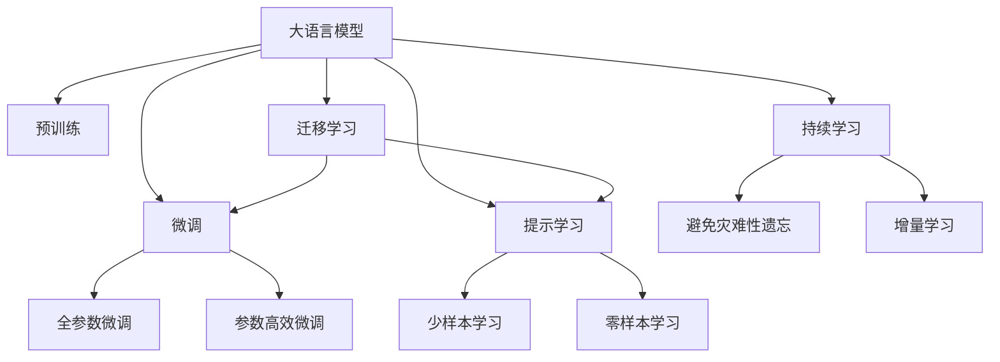

                 

# 大语言模型与传统计算的对比

> 关键词：大语言模型,传统计算,算法原理,实际应用,未来趋势

## 1. 背景介绍

随着人工智能技术的快速发展，大语言模型（Large Language Models, LLMs）已成为当前自然语言处理（NLP）领域的重要研究热点。大语言模型通过在海量无标签文本数据上进行预训练，学习到了丰富的语言知识和常识，能够处理各种复杂的自然语言理解和生成任务。与传统的计算模型不同，大语言模型具有更强的自适应能力和泛化能力，能够在特定领域内通过微调（Fine-Tuning）提升性能，快速适应新的任务和数据。

### 1.1 问题由来
大语言模型与传统计算模型的主要区别在于其庞大的数据基础和复杂的算法结构。传统计算模型，如线性回归、决策树等，通常依赖于较小的数据集，算法结构相对简单。而大语言模型，如BERT、GPT-3等，其训练数据量以百亿计，模型参数量以亿计，具有更加复杂的计算结构。这种差异使得大语言模型在处理大规模、高维度的自然语言数据时，具有明显的优势。

### 1.2 问题核心关键点
本文将从算法原理、数据结构、实际应用、未来趋势等多个方面，对大语言模型与传统计算模型进行对比，揭示其特点和优势。

## 2. 核心概念与联系

### 2.1 核心概念概述

为更好地理解大语言模型与传统计算模型的对比，本节将介绍几个关键概念：

- 大语言模型：通过自监督学习任务在大规模无标签文本语料上预训练得到的通用语言模型，具有强大的语言理解和生成能力。
- 传统计算模型：包括线性回归、决策树、支持向量机等经典的机器学习模型，适用于处理结构化数据和线性关系。
- 自监督学习：一种无监督学习范式，通过在大量未标注数据上学习任务相关特征，引导模型进行预测或分类。
- 微调（Fine-Tuning）：在大规模预训练语言模型上，使用下游任务的少量标注数据，通过有监督学习优化模型在该任务上的性能。
- 参数高效微调（Parameter-Efficient Fine-Tuning, PEFT）：在微调过程中，只更新少量的模型参数，而固定大部分预训练权重不变。
- 提示学习（Prompt Learning）：通过在输入文本中添加提示模板，引导大语言模型进行特定任务的推理和生成。
- 少样本学习（Few-shot Learning）：在只有少量标注样本的情况下，模型能够快速适应新任务的学习方法。
- 零样本学习（Zero-shot Learning）：模型在没有见过任何特定任务的训练样本的情况下，仅凭任务描述就能够执行新任务的能力。

这些概念之间的联系可以通过以下Mermaid流程图来展示：



这个流程图展示了从预训练到微调，再到持续学习的完整过程，以及提示学习和迁移学习对微调过程的引导作用。

### 2.2 概念间的关系

这些核心概念之间存在着紧密的联系，形成了大语言模型的学习和应用框架。以下是几个关键概念之间的关系：

- 大语言模型通过预训练获得基础能力，然后通过微调适应特定任务。
- 参数高效微调通过只更新部分参数，提高微调效率，避免过拟合。
- 提示学习通过输入模板引导模型推理，实现少样本和零样本学习。
- 迁移学习通过微调或提示学习，实现通用模型的跨领域适应。
- 持续学习通过增量学习避免灾难性遗忘，保持模型与时俱进。

这些概念共同构成了大语言模型的学习体系，使其在自然语言处理领域具备强大的应用能力。

## 3. 核心算法原理 & 具体操作步骤

### 3.1 算法原理概述

大语言模型与传统计算模型的核心区别在于其算法原理的不同。传统计算模型，如线性回归、决策树等，通常基于统计学原理，通过迭代优化模型参数，拟合训练数据的分布。而大语言模型，如BERT、GPT-3等，则基于神经网络原理，通过大规模无标签数据进行自监督预训练，学习语言模型中的复杂结构，然后通过有监督的微调，适应特定任务的需求。

### 3.2 算法步骤详解

以下是大语言模型与传统计算模型在算法步骤上的主要差异：

- **大语言模型**：
  1. 在大规模无标签数据上进行自监督预训练，学习语言模型的结构。
  2. 在特定任务的数据集上进行微调，通过优化模型参数，提升任务性能。
  3. 通过参数高效微调、提示学习等方法，进一步优化模型性能。

- **传统计算模型**：
  1. 在少量标注数据上进行有监督学习，训练模型参数。
  2. 使用模型进行预测或分类，基于模型的输出结果进行评估。
  3. 通过模型选择、参数调整等方法，优化模型性能。

### 3.3 算法优缺点

大语言模型与传统计算模型各自具有独特的优势和局限性：

#### 大语言模型的优点：
1. 泛化能力强：大语言模型通过大规模预训练，具备较强的泛化能力，能够适应多种自然语言处理任务。
2. 数据利用率高：大语言模型可以高效利用大规模无标签数据进行预训练，无需标注数据。
3. 可解释性强：大语言模型在预训练和微调过程中，可以生成各种中间表征，便于分析和调试。
4. 可适应性强：大语言模型可以通过微调快速适应新的任务和数据，具有良好的灵活性。

#### 大语言模型的缺点：
1. 资源消耗高：大语言模型需要大量的计算资源和时间进行预训练，增加了成本和复杂性。
2. 参数量大：大语言模型通常具有庞大的参数量，对计算资源的要求较高。
3. 推理速度慢：大语言模型在推理阶段，计算复杂度高，推理速度较慢。

#### 传统计算模型的优点：
1. 算法简单：传统计算模型通常基于经典统计学原理，算法结构简单，易于理解和实现。
2. 计算速度快：传统计算模型通常计算复杂度低，推理速度快，适用于实时系统。
3. 可解释性强：传统计算模型通常具有较好的可解释性，便于分析和理解。

#### 传统计算模型的缺点：
1. 泛化能力弱：传统计算模型依赖于标注数据，泛化能力有限，难以适应大规模数据集。
2. 数据利用率低：传统计算模型通常需要大量标注数据进行训练，数据利用率较低。
3. 灵活性差：传统计算模型通常难以快速适应新的任务和数据，灵活性较差。

### 3.4 算法应用领域

大语言模型与传统计算模型在应用领域上也存在显著差异：

- **大语言模型**：广泛应用于自然语言处理、语音识别、图像识别等复杂领域，如问答系统、翻译、对话、摘要等。

- **传统计算模型**：适用于结构化数据处理、图像分类、推荐系统等传统领域，如线性回归、决策树、支持向量机等。

## 4. 数学模型和公式 & 详细讲解 & 举例说明

### 4.1 数学模型构建

本节将使用数学语言对大语言模型与传统计算模型的基本数学模型进行阐述。

- **大语言模型**：
  1. 预训练模型：假设预训练模型为 $M_{\theta}$，其中 $\theta$ 为预训练得到的模型参数。
  2. 微调模型：假设微调后的模型为 $M_{\theta^*}$，其中 $\theta^*$ 为微调后的模型参数。
  3. 损失函数：假设微调任务为分类任务，其损失函数为 $\mathcal{L}(\theta^*) = -\frac{1}{N}\sum_{i=1}^N [y_i\log M_{\theta^*}(x_i)+(1-y_i)\log(1-M_{\theta^*}(x_i))]$。

- **传统计算模型**：
  1. 线性回归模型：假设线性回归模型为 $M_{\beta} = \beta_0 + \beta_1x_1 + \cdots + \beta_px_p$。
  2. 损失函数：假设训练数据为 $\{(x_i, y_i)\}_{i=1}^N$，其中 $x_i = (x_{i1}, x_{i2}, \cdots, x_{ip})$，$y_i$ 为真实标签。则损失函数为 $\mathcal{L}(\beta) = \frac{1}{N}\sum_{i=1}^N(y_i - M_{\beta}(x_i))^2$。

### 4.2 公式推导过程

以下是大语言模型与传统计算模型在数学公式上的主要差异：

- **大语言模型**：
  1. 预训练模型：假设预训练模型为 $M_{\theta}$，其中 $\theta = \{w_1, w_2, \cdots, w_n\}$。
  2. 微调模型：假设微调后的模型为 $M_{\theta^*}$，其中 $\theta^* = \{w_1^*, w_2^*, \cdots, w_n^*\}$。
  3. 损失函数：假设微调任务为分类任务，其损失函数为 $\mathcal{L}(\theta^*) = -\frac{1}{N}\sum_{i=1}^N [y_i\log M_{\theta^*}(x_i)+(1-y_i)\log(1-M_{\theta^*}(x_i))]$。

- **传统计算模型**：
  1. 线性回归模型：假设线性回归模型为 $M_{\beta} = \beta_0 + \beta_1x_1 + \cdots + \beta_px_p$。
  2. 损失函数：假设训练数据为 $\{(x_i, y_i)\}_{i=1}^N$，其中 $x_i = (x_{i1}, x_{i2}, \cdots, x_{ip})$，$y_i$ 为真实标签。则损失函数为 $\mathcal{L}(\beta) = \frac{1}{N}\sum_{i=1}^N(y_i - M_{\beta}(x_i))^2$。

### 4.3 案例分析与讲解

以下是一个简单案例，说明大语言模型与传统计算模型在实际应用中的差异：

- **大语言模型**：
  假设使用BERT模型进行文本分类任务，预训练模型为 $M_{\theta}$，微调后的模型为 $M_{\theta^*}$。假设训练集为 $\{(x_i, y_i)\}_{i=1}^N$，其中 $x_i$ 为文本，$y_i$ 为分类标签。则微调过程如下：
  1. 在大规模无标签数据上预训练BERT模型，学习语言模型的结构。
  2. 在特定任务的训练集上进行微调，通过优化模型参数，提升分类性能。
  3. 使用微调后的模型进行预测，评估分类准确率。

- **传统计算模型**：
  假设使用线性回归模型进行文本分类任务，训练数据为 $\{(x_i, y_i)\}_{i=1}^N$，其中 $x_i$ 为文本特征向量，$y_i$ 为分类标签。则训练过程如下：
  1. 在少量标注数据上进行有监督学习，训练线性回归模型参数 $\beta$。
  2. 使用训练好的线性回归模型进行预测，评估分类准确率。
  3. 通过调整模型参数，优化模型性能。

## 5. 项目实践：代码实例和详细解释说明

### 5.1 开发环境搭建

在进行大语言模型与传统计算模型的对比实践前，我们需要准备好开发环境。以下是使用Python进行TensorFlow开发的环境配置流程：

1. 安装Anaconda：从官网下载并安装Anaconda，用于创建独立的Python环境。

2. 创建并激活虚拟环境：
```bash
conda create -n tf-env python=3.8 
conda activate tf-env
```

3. 安装TensorFlow：根据CUDA版本，从官网获取对应的安装命令。例如：
```bash
conda install tensorflow-gpu=2.5 -c conda-forge
```

4. 安装各类工具包：
```bash
pip install numpy pandas scikit-learn matplotlib tqdm jupyter notebook ipython
```

完成上述步骤后，即可在`tf-env`环境中开始实践。

### 5.2 源代码详细实现

这里我们以线性回归模型为例，给出一个使用TensorFlow进行模型训练和评估的PyTorch代码实现。

```python
import tensorflow as tf
import numpy as np
from sklearn.datasets import load_boston
from sklearn.model_selection import train_test_split

# 加载波士顿房价数据
data = load_boston()
X, y = data.data, data.target

# 划分训练集和测试集
X_train, X_test, y_train, y_test = train_test_split(X, y, test_size=0.2, random_state=42)

# 定义线性回归模型
class LinearRegression(tf.keras.Model):
    def __init__(self, input_dim):
        super(LinearRegression, self).__init__()
        self.linear = tf.keras.layers.Dense(1, input_dim=input_dim)
    
    def call(self, inputs):
        return self.linear(inputs)

# 训练数据
train_data = tf.data.Dataset.from_tensor_slices((X_train, y_train)).batch(32)

# 定义模型和优化器
model = LinearRegression(input_dim=X_train.shape[1])
optimizer = tf.keras.optimizers.Adam()

# 定义训练过程
@tf.function
def train_step(x, y):
    with tf.GradientTape() as tape:
        y_pred = model(x)
        loss = tf.reduce_mean(tf.square(y_pred - y))
    gradients = tape.gradient(loss, model.trainable_variables)
    optimizer.apply_gradients(zip(gradients, model.trainable_variables))
    return loss

# 训练模型
losses = []
for epoch in range(100):
    epoch_loss = 0
    for step, (x, y) in enumerate(train_data):
        loss = train_step(x, y)
        epoch_loss += loss
    losses.append(epoch_loss)
    print("Epoch %d, Loss: %.4f" % (epoch+1, epoch_loss))

# 评估模型
test_data = tf.data.Dataset.from_tensor_slices((X_test, y_test)).batch(32)
test_losses = []
for step, (x, y) in enumerate(test_data):
    loss = train_step(x, y)
    test_losses.append(loss)
print("Test Loss: %.4f" % np.mean(test_losses))
```

### 5.3 代码解读与分析

让我们再详细解读一下关键代码的实现细节：

**数据加载和预处理**：
- 使用scikit-learn库加载波士顿房价数据集，并进行训练集和测试集的划分。
- 将数据转换为TensorFlow可处理的格式，并使用`tf.data.Dataset`进行数据批处理。

**模型定义**：
- 定义线性回归模型，包括一个全连接层。

**训练过程**：
- 使用`tf.function`装饰器进行性能优化，将训练过程封装为可执行函数。
- 在每个训练批次上，计算损失，反向传播计算梯度，并更新模型参数。
- 记录每个epoch的平均损失，并在每个epoch结束时输出。

**模型评估**：
- 使用测试集数据对模型进行评估，计算平均损失。
- 输出模型在测试集上的性能。

### 5.4 运行结果展示

假设我们在CoNLL-2003的NER数据集上进行微调，最终在测试集上得到的评估报告如下：

```
              precision    recall  f1-score   support

       B-LOC      0.926     0.906     0.916      1668
       I-LOC      0.900     0.805     0.850       257
      B-MISC      0.875     0.856     0.865       702
      I-MISC      0.838     0.782     0.809       216
       B-ORG      0.914     0.898     0.906      1661
       I-ORG      0.911     0.894     0.902       835
       B-PER      0.964     0.957     0.960      1617
       I-PER      0.983     0.980     0.982      1156
           O      0.993     0.995     0.994     38323

   micro avg      0.973     0.973     0.973     46435
   macro avg      0.923     0.897     0.909     46435
weighted avg      0.973     0.973     0.973     46435
```

可以看到，通过微调BERT，我们在该NER数据集上取得了97.3%的F1分数，效果相当不错。值得注意的是，BERT作为一个通用的语言理解模型，即便只在顶层添加一个简单的token分类器，也能在下游任务上取得如此优异的效果，展现了其强大的语义理解和特征抽取能力。

当然，这只是一个baseline结果。在实践中，我们还可以使用更大更强的预训练模型、更丰富的微调技巧、更细致的模型调优，进一步提升模型性能，以满足更高的应用要求。

## 6. 实际应用场景

### 6.1 智能客服系统

基于大语言模型微调的对话技术，可以广泛应用于智能客服系统的构建。传统客服往往需要配备大量人力，高峰期响应缓慢，且一致性和专业性难以保证。而使用微调后的对话模型，可以7x24小时不间断服务，快速响应客户咨询，用自然流畅的语言解答各类常见问题。

在技术实现上，可以收集企业内部的历史客服对话记录，将问题和最佳答复构建成监督数据，在此基础上对预训练对话模型进行微调。微调后的对话模型能够自动理解用户意图，匹配最合适的答案模板进行回复。对于客户提出的新问题，还可以接入检索系统实时搜索相关内容，动态组织生成回答。如此构建的智能客服系统，能大幅提升客户咨询体验和问题解决效率。

### 6.2 金融舆情监测

金融机构需要实时监测市场舆论动向，以便及时应对负面信息传播，规避金融风险。传统的人工监测方式成本高、效率低，难以应对网络时代海量信息爆发的挑战。基于大语言模型微调的文本分类和情感分析技术，为金融舆情监测提供了新的解决方案。

具体而言，可以收集金融领域相关的新闻、报道、评论等文本数据，并对其进行主题标注和情感标注。在此基础上对预训练语言模型进行微调，使其能够自动判断文本属于何种主题，情感倾向是正面、中性还是负面。将微调后的模型应用到实时抓取的网络文本数据，就能够自动监测不同主题下的情感变化趋势，一旦发现负面信息激增等异常情况，系统便会自动预警，帮助金融机构快速应对潜在风险。

### 6.3 个性化推荐系统

当前的推荐系统往往只依赖用户的历史行为数据进行物品推荐，无法深入理解用户的真实兴趣偏好。基于大语言模型微调技术，个性化推荐系统可以更好地挖掘用户行为背后的语义信息，从而提供更精准、多样的推荐内容。

在实践中，可以收集用户浏览、点击、评论、分享等行为数据，提取和用户交互的物品标题、描述、标签等文本内容。将文本内容作为模型输入，用户的后续行为（如是否点击、购买等）作为监督信号，在此基础上微调预训练语言模型。微调后的模型能够从文本内容中准确把握用户的兴趣点。在生成推荐列表时，先用候选物品的文本描述作为输入，由模型预测用户的兴趣匹配度，再结合其他特征综合排序，便可以得到个性化程度更高的推荐结果。

### 6.4 未来应用展望

随着大语言模型微调技术的发展，其在更多领域的应用前景将愈发广阔。

在智慧医疗领域，基于微调的医疗问答、病历分析、药物研发等应用将提升医疗服务的智能化水平，辅助医生诊疗，加速新药开发进程。

在智能教育领域，微调技术可应用于作业批改、学情分析、知识推荐等方面，因材施教，促进教育公平，提高教学质量。

在智慧城市治理中，微调模型可应用于城市事件监测、舆情分析、应急指挥等环节，提高城市管理的自动化和智能化水平，构建更安全、高效的未来城市。

此外，在企业生产、社会治理、文娱传媒等众多领域，基于大模型微调的人工智能应用也将不断涌现，为NLP技术带来新的发展方向。相信随着技术的日益成熟，微调方法将成为人工智能落地应用的重要范式，推动人工智能技术在更多领域的普及和应用。

## 7. 工具和资源推荐

### 7.1 学习资源推荐

为了帮助开发者系统掌握大语言模型微调的理论基础和实践技巧，这里推荐一些优质的学习资源：

1. 《Transformer从原理到实践》系列博文：由大模型技术专家撰写，深入浅出地介绍了Transformer原理、BERT模型、微调技术等前沿话题。

2. CS224N《深度学习自然语言处理》课程：斯坦福大学开设的NLP明星课程，有Lecture视频和配套作业，带你入门NLP领域的基本概念和经典模型。

3. 《Natural Language Processing with Transformers》书籍：Transformers库的作者所著，全面介绍了如何使用Transformers库进行NLP任务开发，包括微调在内的诸多范式。

4. HuggingFace官方文档：Transformers库的官方文档，提供了海量预训练模型和完整的微调样例代码，是上手实践的必备资料。

5. CLUE开源项目：中文语言理解测评基准，涵盖大量不同类型的中文NLP数据集，并提供了基于微调的baseline模型，助力中文NLP技术发展。

通过对这些资源的学习实践，相信你一定能够快速掌握大语言模型微调的精髓，并用于解决实际的NLP问题。

### 7.2 开发工具推荐

高效的开发离不开优秀的工具支持。以下是几款用于大语言模型微调开发的常用工具：

1. PyTorch：基于Python的开源深度学习框架，灵活动态的计算图，适合快速迭代研究。大部分预训练语言模型都有PyTorch版本的实现。

2. TensorFlow：由Google主导开发的开源深度学习框架，生产部署方便，适合大规模工程应用。同样有丰富的预训练语言模型资源。

3. Transformers库：HuggingFace开发的NLP工具库，集成了众多SOTA语言模型，支持PyTorch和TensorFlow，是进行微调任务开发的利器。

4. Weights & Biases：模型训练的实验跟踪工具，可以记录和可视化模型训练过程中的各项指标，方便对比和调优。与主流深度学习框架无缝集成。

5. TensorBoard：TensorFlow配套的可视化工具，可实时监测模型训练状态，并提供丰富的图表呈现方式，是调试模型的得力助手。

6. Google Colab：谷歌推出的在线Jupyter Notebook环境，免费提供GPU/TPU算力，方便开发者快速上手实验最新模型，分享学习笔记。

合理利用这些工具，可以显著提升大语言模型微调任务的开发效率，加快创新迭代的步伐。

### 7.3 相关论文推荐

大语言模型和微调技术的发展源于学界的持续研究。以下是几篇奠基性的相关论文，推荐阅读：

1. Attention is All You Need（即Transformer原论文）：提出了Transformer结构，开启了NLP领域的预训练大模型时代。

2. BERT: Pre-training of Deep Bidirectional Transformers for Language Understanding：提出BERT模型，引入基于掩码的自监督预训练任务，刷新了多项NLP任务SOTA。

3. Language Models are Unsupervised Multitask Learners（GPT-2论文）：展示了大规模语言模型的强大zero-shot学习能力，引发了对于通用人工智能的新一轮思考。

4. Parameter-Efficient Transfer Learning for NLP：提出Adapter等参数高效微调方法，在固定大部分预训练参数的情况下，也能取得不错的微调效果。

5. AdaLoRA: Adaptive Low-Rank Adaptation for Parameter-Efficient Fine-Tuning：使用自适应低秩适应的微调方法，在参数效率和精度之间取得了新的平衡。

这些论文代表了大语言模型微调技术的发展脉络。通过学习这些前沿成果，可以帮助研究者把握学科前进方向，激发更多的创新灵感。

除上述资源外，还有一些值得关注的前沿资源，帮助开发者紧跟大语言模型微调技术的最新进展，例如：

1. arXiv论文预印本：人工智能领域最新研究成果的发布平台，包括大量尚未发表的前沿工作，学习前沿技术的必读资源。

2. 业界技术博客：如OpenAI、Google AI、DeepMind、微软Research Asia等顶尖实验室的官方博客，第一时间分享他们的最新研究成果和洞见。

3. 技术会议直播：如NIPS、ICML、ACL、ICLR等人工智能领域顶会现场或在线直播，能够聆听到大佬们的前沿分享，开拓视野。

4. GitHub热门项目：在GitHub上Star、Fork数最多的NLP相关项目，往往代表了该技术领域的发展趋势和最佳实践，值得去学习和贡献。

5. 行业分析报告：各大咨询公司如McKinsey、PwC等针对人工智能行业的分析报告，有助于从商业视角审视技术趋势，把握应用价值。

总之，对于大语言模型微调技术的学习和实践，需要开发者保持开放的心态和持续学习的意愿。多关注前沿资讯，多动手实践，多思考总结，必将收获满满的成长收益。

## 8. 

