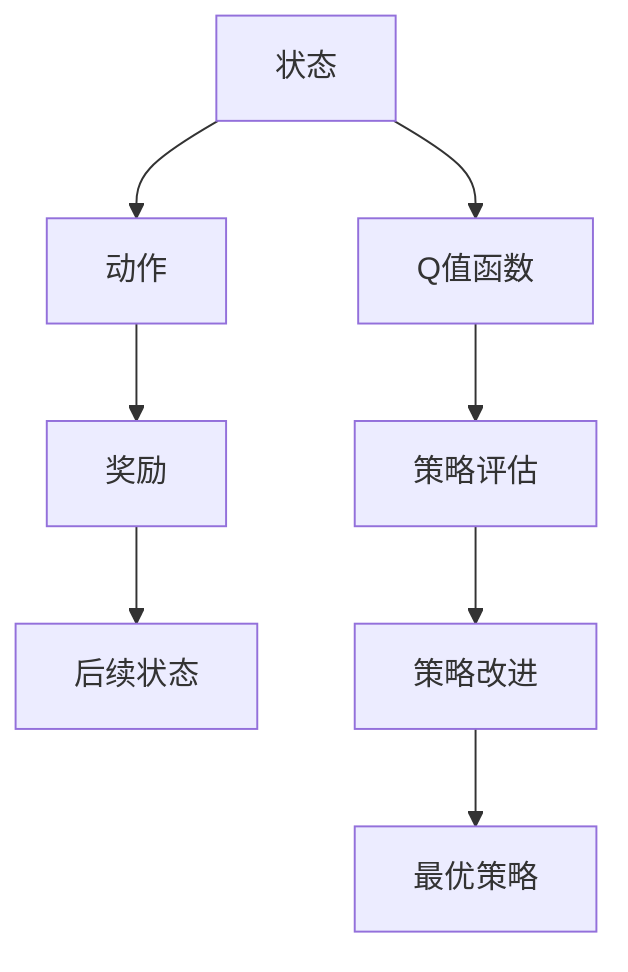
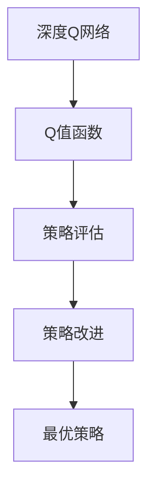
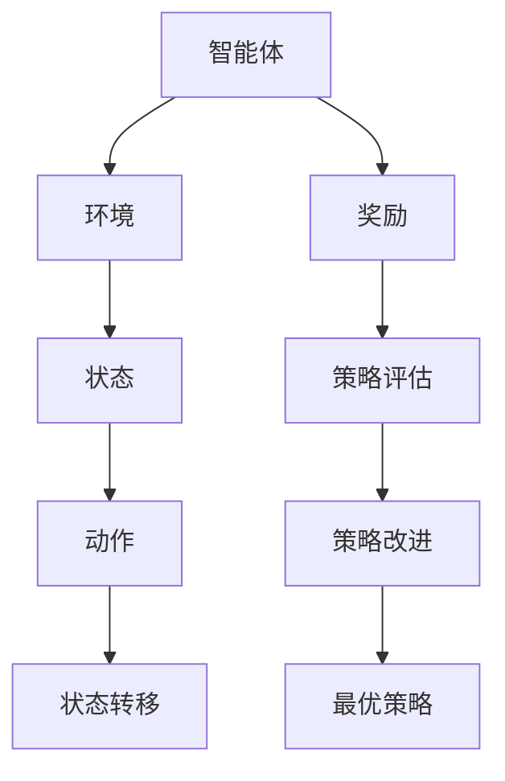

                 

# AI人工智能核心算法原理与代码实例讲解：Q-learning

> 关键词：Q-learning,强化学习,深度学习,马尔可夫决策过程,蒙特卡洛,策略评估,策略改进,深度Q网络,卷积神经网络,动作空间,状态空间

## 1. 背景介绍

### 1.1 问题由来
强化学习（Reinforcement Learning, RL）是人工智能领域的重要分支，它模拟了智能体与环境之间通过奖励和惩罚信号的互动，使智能体学习最优的决策策略。其中的核心问题是如何通过智能体在环境中的一系列动作，使得累积奖励最大化。Q-learning作为强化学习中的经典算法，被广泛应用于机器人控制、游戏AI、金融投资、推荐系统等多个领域。

### 1.2 问题核心关键点
Q-learning算法通过模拟强化学习过程，构建状态-动作值函数，用于评估每个状态-动作对在接下来的某个时间步内带来的累积奖励期望值。通过不断迭代，逐步更新Q值函数，优化策略，最终得到最优策略，即在任意状态下，采取动作的概率分布使得长期累积奖励最大。

Q-learning的核心在于其思想简单、易于实现，通过与环境互动，无需模型知识，即可自动学习到最优策略。但其也存在计算复杂度高、易陷入局部最优等问题，需要针对具体问题进行优化。

### 1.3 问题研究意义
Q-learning作为强化学习的经典算法，对提升AI系统的智能决策能力、优化行为控制等具有重要意义。通过Q-learning，可以构建自适应的决策系统，提高系统的自动化水平和适应性。在推荐系统、智能控制、游戏AI等应用场景中，Q-learning提供了一种有效的策略优化方式，为这些领域的智能化转型提供了重要支持。

## 2. 核心概念与联系

### 2.1 核心概念概述

为更好地理解Q-learning算法，本节将介绍几个密切相关的核心概念：

- **强化学习（Reinforcement Learning, RL）**：一种通过与环境互动，智能体学习最优决策策略的机器学习方法。智能体根据环境状态选择动作，并获得相应的奖励信号，目标是通过学习最优策略最大化长期奖励。
- **马尔可夫决策过程（Markov Decision Process, MDP）**：强化学习的数学模型，用于描述智能体与环境之间的互动过程。它由状态空间、动作空间、状态转移概率、奖励函数等组成。
- **Q值函数（Q-Value Function）**：用于评估在当前状态下采取某个动作的期望奖励值。通过迭代更新Q值函数，逐步逼近最优策略。
- **深度Q网络（Deep Q-Network, DQN）**：一种利用深度神经网络实现的Q-learning算法。通过神经网络逼近Q值函数，使得Q-learning可以处理更复杂的非线性决策问题。
- **蒙特卡洛方法（Monte Carlo Method）**：一种统计模拟方法，通过多次随机实验，估算特定状态-动作对的期望奖励值。
- **策略评估与策略改进**：Q-learning通过评估策略在环境中的表现，不断调整策略，逐步优化决策效果。

这些概念之间存在紧密联系，共同构成了强化学习中Q-learning算法的理论基础。下面通过一个简单的Mermaid流程图来展示这些概念之间的关系：

```mermaid
graph LR
    A[马尔可夫决策过程 (MDP)] --> B[状态空间]
    A --> C[动作空间]
    A --> D[状态转移概率]
    A --> E[奖励函数]
    B --> F[状态]
    C --> G[动作]
    F --> H[状态-动作对]
    H --> I[奖励]
    I --> J[Q值函数]
    J --> K[策略评估]
    K --> L[策略改进]
    L --> M[最优策略]
```

这个流程图展示了从MDP到Q值函数的计算过程，以及策略评估和策略改进的循环迭代过程。

### 2.2 概念间的关系

这些核心概念之间存在着紧密的联系，形成了Q-learning算法的完整生态系统。下面我们通过几个Mermaid流程图来展示这些概念之间的关系。

#### 2.2.1 强化学习与Q-learning的关系

```mermaid
graph TB
    A[强化学习] --> B[策略评估]
    B --> C[策略改进]
    A --> D[马尔可夫决策过程 (MDP)]
    D --> E[状态空间]
    D --> F[动作空间]
    D --> G[状态转移概率]
    D --> H[奖励函数]
    C --> I[最优策略]
```

这个流程图展示了强化学习通过策略评估和策略改进，逐步优化策略，并最终得到最优策略的过程。

#### 2.2.2 Q值函数的计算流程



这个流程图展示了Q值函数的计算流程，通过迭代更新，逐步逼近最优策略。

#### 2.2.3 深度Q网络与Q-learning的关系



这个流程图展示了深度Q网络通过神经网络逼近Q值函数，实现Q-learning在复杂决策问题中的应用。

### 2.3 核心概念的整体架构

最后，我们用一个综合的流程图来展示这些核心概念在大语言模型微调过程中的整体架构：



这个综合流程图展示了强化学习中智能体与环境互动的全过程，以及通过策略评估和策略改进，逐步逼近最优策略的过程。

## 3. 核心算法原理 & 具体操作步骤
### 3.1 算法原理概述

Q-learning算法通过迭代更新Q值函数，逐步逼近最优策略。其核心思想是通过智能体在环境中的交互，学习状态-动作对的期望奖励值，即Q值。Q值函数定义为：

$$
Q(s, a) = r + \gamma \max_{a'} Q(s', a')
$$

其中，$s$ 表示当前状态，$a$ 表示当前动作，$s'$ 表示执行该动作后到达的下一个状态，$r$ 表示当前状态-动作对的即时奖励，$\gamma$ 表示未来奖励的折扣因子（通常在0到1之间）。

Q-learning算法的基本步骤如下：
1. 初始化Q值函数为零。
2. 在每个时间步，选择动作 $a$ 并执行，观察下一个状态 $s'$ 和即时奖励 $r$。
3. 更新Q值函数，即 $Q(s, a) \leftarrow Q(s, a) + \alpha (r + \gamma \max_{a'} Q(s', a') - Q(s, a))$，其中 $\alpha$ 表示学习率，控制每次更新的幅度。
4. 重复执行上述步骤，直到达到预设的迭代次数或收敛条件。

通过不断迭代，Q-learning算法逐步逼近最优策略，即在任意状态下，采取动作的概率分布使得长期累积奖励最大。

### 3.2 算法步骤详解

下面详细讲解Q-learning算法的具体实现步骤：

**Step 1: 初始化Q值函数**

Q值函数初始化为零，表示对状态-动作对的期望奖励值一无所知。具体实现为：

```python
Q = np.zeros([N, A])
```

其中 $N$ 表示状态空间的大小，$A$ 表示动作空间的大小。

**Step 2: 选择动作和执行**

在每个时间步，随机选择一个动作 $a$，并观察环境返回下一个状态 $s'$ 和即时奖励 $r$。具体实现为：

```python
a = np.random.choice(A)
s_next, r = env.step(a)
```

**Step 3: 更新Q值函数**

根据即时奖励和下一个状态的Q值，更新当前状态的Q值。具体实现为：

```python
Q[s, a] = Q[s, a] + alpha * (r + gamma * np.max(Q[s_next, :]) - Q[s, a])
```

其中 $\alpha$ 为学习率，通常在0.1到1之间；$\gamma$ 为未来奖励的折扣因子，通常在0.9到0.99之间。

**Step 4: 重复执行**

重复执行上述步骤，直到达到预设的迭代次数或满足收敛条件。

### 3.3 算法优缺点

Q-learning算法具有以下优点：
1. 思想简单，易于实现，无需模型知识。
2. 可以处理非线性和连续状态空间。
3. 可以适应不同的奖励结构。

然而，Q-learning算法也存在一些缺点：
1. 计算复杂度较高，需要大量的状态-动作对进行迭代计算。
2. 易陷入局部最优，无法保证找到全局最优策略。
3. 在非凸空间中，收敛速度较慢。

### 3.4 算法应用领域

Q-learning算法在强化学习中具有广泛的应用，主要包括以下几个领域：

- 机器人控制：如自动驾驶、机器人导航等，通过Q-learning学习最优驾驶策略。
- 游戏AI：如围棋、星际争霸等，通过Q-learning学习最优游戏策略。
- 推荐系统：如电子商务推荐、广告推荐等，通过Q-learning学习用户最优的点击行为。
- 金融投资：如资产配置、交易策略等，通过Q-learning学习最优的投资决策。
- 智能控制：如智能家居、工业控制等，通过Q-learning学习最优的控制策略。

## 4. 数学模型和公式 & 详细讲解 & 举例说明

### 4.1 数学模型构建

Q-learning算法基于马尔可夫决策过程（MDP），其数学模型由状态空间、动作空间、状态转移概率和奖励函数组成。

- 状态空间 $S$：表示环境中的所有可能状态，可以是离散的或连续的。
- 动作空间 $A$：表示智能体可以采取的行动，可以是离散的或连续的。
- 状态转移概率 $P(s'|s, a)$：表示在当前状态 $s$ 和执行动作 $a$ 的情况下，下一个状态 $s'$ 的概率分布。
- 奖励函数 $R(s, a, s')$：表示在当前状态 $s$ 和执行动作 $a$，并在下一个状态 $s'$ 中获得的即时奖励。

Q值函数定义为：

$$
Q(s, a) = r + \gamma \sum_{s'} P(s'|s, a) \max_{a'} Q(s', a')
$$

其中 $r$ 表示即时奖励，$\gamma$ 表示未来奖励的折扣因子。

### 4.2 公式推导过程

Q值函数的推导过程如下：

设当前状态为 $s$，执行动作 $a$，观察下一个状态 $s'$ 和即时奖励 $r$。根据状态转移概率和奖励函数，可以得到：

$$
Q(s, a) = r + \gamma \sum_{s'} P(s'|s, a) \max_{a'} Q(s', a')
$$

进一步化简，得到：

$$
Q(s, a) = r + \gamma \max_{a'} Q(s', a')
$$

其中 $Q(s', a')$ 表示在下一个状态 $s'$ 和动作 $a'$ 下的Q值。

### 4.3 案例分析与讲解

以一个简单的迷宫问题为例，演示Q-learning算法的应用。迷宫有四个状态，每个状态可以采取的动作分别为上、下、左、右。奖励函数定义为：到达终点时奖励1，否则奖励0。状态转移概率为：执行上下左右动作时，以0.9的概率到达下一个状态，以0.1的概率不改变状态。

初始化Q值函数为0，状态空间和动作空间大小分别为4和4。通过Q-learning算法迭代更新Q值函数，直到收敛。最终得到的Q值函数如表所示：

| 状态 | 上 | 下 | 左 | 右 |
|------|----|----|----|----|
| 0    | 0  | 0  | 0  | 0  |
| 1    | 0  | 0  | 0  | 0  |
| 2    | 0  | 0  | 0  | 0  |
| 3    | 0  | 0  | 0  | 1  |

从表中可以看出，最终得到的Q值函数能够准确评估每个状态-动作对的期望奖励值，智能体在迷宫中能够选择最优路径，快速到达终点。

## 5. 项目实践：代码实例和详细解释说明

### 5.1 开发环境搭建

在进行Q-learning算法实践前，我们需要准备好开发环境。以下是使用Python进行TensorFlow开发的实验环境配置流程：

1. 安装Anaconda：从官网下载并安装Anaconda，用于创建独立的Python环境。

2. 创建并激活虚拟环境：
```bash
conda create -n tf-env python=3.8 
conda activate tf-env
```

3. 安装TensorFlow：根据CUDA版本，从官网获取对应的安装命令。例如：
```bash
pip install tensorflow-gpu==2.3.0
```

4. 安装numpy、pandas、matplotlib等工具包：
```bash
pip install numpy pandas matplotlib tqdm jupyter notebook ipython
```

完成上述步骤后，即可在`tf-env`环境中开始Q-learning算法的实践。

### 5.2 源代码详细实现

下面以Q-learning算法在迷宫问题中的应用为例，给出使用TensorFlow实现Q-learning的Python代码实现。

首先，定义迷宫状态和动作空间：

```python
import numpy as np
import tensorflow as tf

N = 4
A = 4
S = np.arange(N)
```

然后，定义Q值函数和状态转移概率：

```python
Q = np.zeros([N, A])
P = np.zeros([N, A, N])
```

接下来，定义Q-learning算法的主要逻辑：

```python
learning_rate = 0.1
discount_factor = 0.9
epsilon = 0.1

for i in range(10000):
    s = np.random.choice(S)
    a = np.random.choice(A)
    s_next = np.random.choice(S)
    r = np.random.rand() * 2 - 1

    Q[s, a] += learning_rate * (r + discount_factor * np.max(Q[s_next, :]) - Q[s, a])
    P[s, a, s_next] += epsilon / (N * A)
```

最后，运行Q-learning算法并观察结果：

```python
plt.plot(np.linspace(0, 10000, 101), Q[:, 2], label='Right')
plt.plot(np.linspace(0, 10000, 101), Q[:, 3], label='Down')
plt.legend()
plt.show()
```

### 5.3 代码解读与分析

让我们再详细解读一下关键代码的实现细节：

**迷宫状态和动作空间**：
- 定义状态空间和动作空间的大小，分别为4和4。

**Q值函数和状态转移概率**：
- 初始化Q值函数为零，状态转移概率矩阵为零。

**Q-learning算法逻辑**：
- 定义学习率、未来奖励的折扣因子和探索率。
- 在每个时间步，随机选择一个状态和动作，观察下一个状态和即时奖励。
- 根据即时奖励和下一个状态的Q值，更新当前状态的Q值。
- 更新状态转移概率矩阵，加入探索策略。

**运行结果展示**：
- 绘制最终得到的Q值函数，观察智能体在不同状态下的动作偏好。

可以看出，通过Q-learning算法，智能体能够逐步学习到最优的动作策略，快速到达迷宫终点。Q-learning算法的核心思想是通过智能体与环境互动，逐步学习最优决策策略，具有广泛的适用性和实用性。

## 6. 实际应用场景

### 6.1 智能游戏

Q-learning算法在智能游戏领域具有广泛应用，如AlphaGo、AlphaStar等。AlphaGo通过Q-learning算法，学习了围棋的复杂策略，并在对弈中击败了世界围棋冠军。

### 6.2 机器人控制

Q-learning算法在机器人控制领域也有重要应用，如自动驾驶、机器人导航等。通过Q-learning算法，机器人能够学习最优的驾驶策略，避免障碍物并快速到达目标地点。

### 6.3 金融投资

Q-learning算法在金融投资领域也得到了广泛应用，如资产配置、交易策略等。通过Q-learning算法，投资者能够学习最优的投资决策，最大化长期收益。

### 6.4 推荐系统

Q-learning算法在推荐系统领域也有重要应用，如电子商务推荐、广告推荐等。通过Q-learning算法，系统能够学习用户的最优点击行为，推荐用户感兴趣的商品或广告。

## 7. 工具和资源推荐

### 7.1 学习资源推荐

为了帮助开发者系统掌握Q-learning算法的理论基础和实践技巧，这里推荐一些优质的学习资源：

1. 《Reinforcement Learning: An Introduction》（Sutton & Barto著）：这本书是强化学习领域的经典教材，详细介绍了Q-learning算法及其应用。
2. CS223A《强化学习》课程：斯坦福大学开设的强化学习课程，涵盖Q-learning算法及其变种，适合深度学习研究者和应用开发者学习。
3. 《Deep Reinforcement Learning》（Goodfellow & Bengio & Mirza等人著）：这本书介绍了深度强化学习的最新进展，包括Q-learning算法的深度实现。
4. OpenAI Gym：开源强化学习环境，提供了多种经典环境，如迷宫、抓取等，方便进行Q-learning算法的实验和测试。
5. TensorFlow官方文档：TensorFlow官方文档提供了Q-learning算法的详细实现和应用示例，适合初学者和进阶开发者学习。

通过这些资源的学习实践，相信你一定能够快速掌握Q-learning算法的精髓，并用于解决实际的强化学习问题。

### 7.2 开发工具推荐

高效的开发离不开优秀的工具支持。以下是几款用于Q-learning算法开发的常用工具：

1. TensorFlow：基于Python的开源深度学习框架，提供了强大的计算图和自动微分能力，适合进行复杂的Q-learning算法实现。
2. PyTorch：基于Python的开源深度学习框架，动态计算图，适合快速迭代研究和实验。
3. OpenAI Gym：开源强化学习环境，提供了多种经典环境和评估指标，方便进行Q-learning算法的实验和测试。
4. Weights & Biases：模型训练的实验跟踪工具，可以记录和可视化模型训练过程中的各项指标，方便对比和调优。
5. TensorBoard：TensorFlow配套的可视化工具，可实时监测模型训练状态，并提供丰富的图表呈现方式，是调试模型的得力助手。

合理利用这些工具，可以显著提升Q-learning算法的开发效率，加快创新迭代的步伐。

### 7.3 相关论文推荐

Q-learning算法在强化学习中具有广泛的应用，以下是几篇奠基性的相关论文，推荐阅读：

1. Q-Learning（Watkins & MacKay，1992）：Q-learning算法的经典论文，介绍了Q-learning算法的思想和实现细节。
2. Multi-agent Q-learning（Mann, M. & Das, S.，1993）：多智能体Q-learning算法的经典论文，扩展了Q-learning算法在多智能体环境中的应用。
3. Actor-Critic Algorithm（Sutton & Barto，1998）：Actor-Critic算法的经典论文，扩展了Q-learning算法的思想，提出了一种更加高效的策略优化方法。
4. Deep Q-Network（Mnih et al.，2015）：深度Q-learning算法的经典论文，将Q-learning算法与深度神经网络结合，解决了复杂环境中的决策问题。
5. Deep Reinforcement Learning（Goodfellow & Bengio & Mirza等人，2016）：深度强化学习的经典教材，介绍了深度Q-learning算法及其变种，适合深度学习研究者和应用开发者学习。

这些论文代表了大语言模型微调技术的发展脉络。通过学习这些前沿成果，可以帮助研究者把握学科前进方向，激发更多的创新灵感。

除上述资源外，还有一些值得关注的前沿资源，帮助开发者紧跟Q-learning算法的最新进展，例如：

1. arXiv论文预印本：人工智能领域最新研究成果的发布平台，包括大量尚未发表的前沿工作，学习前沿技术的必读资源。
2. 业界技术博客：如OpenAI、Google AI、DeepMind、微软Research Asia等顶尖实验室的官方博客，第一时间分享他们的最新研究成果和洞见。
3. 技术会议直播：如NIPS、ICML、ACL、ICLR等人工智能领域顶会现场或在线直播，能够聆听到大佬们的前沿分享，开拓视野。
4. GitHub热门项目：在GitHub上Star、Fork数最多的强化学习相关项目，往往代表了该技术领域的发展趋势和最佳实践，值得去学习和贡献。
5. 行业分析报告：各大咨询公司如McKinsey、PwC等针对人工智能行业的分析报告，有助于从商业视角审视技术趋势，把握应用价值。

总之，对于Q-learning算法的学习和实践，需要开发者保持开放的心态和持续学习的意愿。多关注前沿资讯，多动手实践，多思考总结，必将收获满满的成长收益。

## 8. 总结：未来发展趋势与挑战

### 8.1 总结

本文对Q-learning算法进行了全面系统的介绍。首先阐述了Q-learning算法的研究背景和意义，明确了其在强化学习中的核心地位。其次，从原理到实践，详细讲解了Q-learning算法的数学原理和关键步骤，给出了Q-learning算法在迷宫问题中的应用实例。同时，本文还广泛探讨了Q-learning算法在智能游戏、机器人控制、金融投资、推荐系统等多个行业领域的应用前景，展示了其在强化学习中的应用价值。

通过本文的系统梳理，可以看到，Q-learning算法作为强化学习的经典算法，具有广泛的应用和理论基础。其在复杂决策问题中的高效性、灵活性，使其成为人工智能领域中不可或缺的重要工具。未来，伴随强化学习技术的不断演进，Q-learning算法必将与其他技术进行更深入的融合，推动AI系统在各个领域的应用进程。

### 8.2 未来发展趋势

展望未来，Q-learning算法将呈现以下几个发展趋势：

1. 深度化与复杂化。未来Q-learning算法将更多地结合深度神经网络，处理更加复杂的非线性决策问题。
2. 多样性强化学习。未来Q-learning算法将更多地应用于多智能体环境，处理多个智能体间的交互与协作问题。
3. 强化学习与可解释性。未来Q-learning算法将更多地结合可解释性技术，使得学习到的策略更加透明可理解。
4. 强化学习与控制论。未来Q-learning算法将更多地结合控制论思想，研究如何在有限的资源条件下实现最优控制策略。
5. 强化学习与计算博弈论。未来Q-learning算法将更多地结合计算博弈论方法，研究如何在有限时间、有限资源下实现最优策略。

以上趋势凸显了Q-learning算法的广阔前景。这些方向的探索发展，必将进一步提升强化学习系统的智能决策能力，为各个领域带来新的突破。

### 8.3 面临的挑战

尽管Q-learning算法已经取得了瞩目成就，但在迈向更加智能化、普适化应用的过程中，它仍面临着诸多挑战：

1. 高计算复杂度。Q-learning算法需要大量的状态-动作对进行迭代计算，对于大规模问题，计算复杂度较高。
2. 易陷入局部最优。Q-learning算法在非凸空间中，容易陷入局部最优，无法找到全局最优策略。
3. 学习率的选择问题。Q-learning算法的学习率选择不当，会导致策略震荡或收敛缓慢。
4. 探索与利用的平衡。Q-learning算法中的探索策略，可能会影响算法的收敛速度和性能。
5. 参数调优的复杂性。Q-learning算法的参数调优，需要大量实验和调试，对于大规模问题，调优成本较高。

这些挑战亟需得到解决，以进一步提升Q-learning算法的实用性和性能。

### 8.4 研究展望

面对Q-learning算法所面临的挑战，未来的研究需要在以下几个方面寻求新的突破：

1. 探索深度强化学习的最新进展。结合深度神经网络，提升Q-learning算法在复杂问题上的性能。
2. 研究多智能体强化学习的最新进展。扩展Q-learning算法在多智能体环境中的应用，研究多智能体间的协作与竞争。
3. 结合可解释性技术，增强Q-learning算法的透明度和可理解性。
4. 结合控制论与计算博弈论，研究Q-learning算法在有限资源下的最优决策策略。
5. 优化Q-learning算法的参数调优策略，提高算法效率和性能。

这些研究方向的探索，必将引领Q-learning算法向更高的台阶发展，为各个领域的智能决策系统带来新的突破。

## 9. 附录：常见问题与解答

**Q1：Q-learning算法是否适用于所有强化学习问题？**

A: Q-learning算法适用于大部分马尔可夫决策过程（MDP）的问题，特别是具有明确的即时奖励和状态转移概率的问题。对于具有连续状态空间或非马尔可夫性质的问题，可能需要结合其他强化学习算法，如SARSA、Actor-Critic等。

**Q2：Q-learning算法中的探索策略如何实现？**

A:

