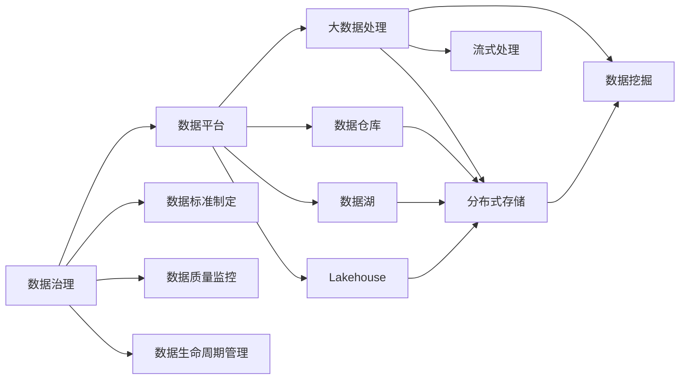

                 

# AI创业：数据管理的策略与实施分析

> 关键词：数据管理,策略,实施分析,人工智能,创业,策略制定,数据治理,数据平台,隐私保护,数据安全,大数据处理,技术选型,人工智能应用

## 1. 背景介绍

在AI创业的征途上，数据管理一直是企业发展的核心要素。数据不仅是企业运营的命脉，更是推动AI创新、优化决策和实现商业目标的重要基础。高质量的数据管理策略不仅能提升AI模型的性能，还能为企业带来可持续的竞争优势。本文将深入探讨AI创业中的数据管理策略与实施分析，涵盖从数据采集、治理、存储到安全保护的全方位内容。

### 1.1 数据的重要性

数据驱动是AI创业的基石。在众多AI应用中，从推荐系统到图像识别，从自然语言处理到智能决策，数据都是不可或缺的核心资源。高质量的数据不仅直接决定了AI模型的训练效果，还直接影响最终业务决策的精准度。良好的数据管理策略，能够帮助企业构建高效的数据采集、治理和分析框架，提升AI系统的整体表现。

### 1.2 数据管理的挑战

尽管数据的重要性不言而喻，但在实际应用中，数据管理仍面临着诸多挑战：

1. **数据质量问题**：数据来源多样、格式不统一，数据清洗和预处理工作繁琐耗时。
2. **数据治理复杂**：数据孤岛现象普遍存在，数据标准和治理流程不统一。
3. **数据安全风险**：数据泄露和滥用风险高，数据保护法规多且复杂。
4. **成本和效率问题**：大规模数据处理和管理需要大量的人力和资源投入。

本文旨在通过系统化的策略和实践分析，帮助AI创业者在数据管理中规避上述问题，实现数据的高效治理和应用。

## 2. 核心概念与联系

### 2.1 核心概念概述

为了更好地理解AI创业中的数据管理策略，我们先要明确几个关键概念：

- **数据治理（Data Governance）**：确保数据的质量、完整性、一致性和安全性，是数据管理的核心。
- **数据平台（Data Platform）**：利用技术手段构建的数据管理和分析系统，通常包括数据仓库、数据湖和数据湖演进（Lakehouse）等。
- **数据治理流程**：包括数据标准制定、数据质量监控、数据生命周期管理等，确保数据管理的规范化和标准化。
- **数据安全与隐私保护**：在数据管理过程中，保护数据免遭未经授权的访问和滥用，确保数据隐私和合规。
- **大数据处理技术**：包括分布式存储和计算、流式处理、数据挖掘等，支持大规模数据的存储和分析。

### 2.2 核心概念间的联系

这些核心概念之间存在着紧密的联系，形成了数据管理的整体框架。以下是几个关键的联系图：



这个图展示了数据治理和数据平台的关系，以及数据平台中数据仓库、数据湖、Lakehouse和大数据处理技术之间的相互依赖。

## 3. 核心算法原理 & 具体操作步骤

### 3.1 算法原理概述

AI创业中的数据管理策略主要基于数据治理和数据平台的技术原理进行设计。数据治理的核心在于数据标准的制定和数据质量的监控，而数据平台则提供了实现这些策略的技术手段。

### 3.2 算法步骤详解

数据管理的策略实施可以分为以下几个步骤：

1. **数据采集与预处理**：从各种来源（如Web抓取、API接口、日志文件等）采集数据，并进行清洗、去重、格式转换等预处理工作。
2. **数据标准制定**：根据业务需求和数据质量要求，制定数据标准和元数据规范，确保数据的一致性和可解释性。
3. **数据质量监控**：通过数据质量评估工具，持续监控数据集的质量指标，及时发现和解决数据问题。
4. **数据存储与分析**：选择合适的数据平台（如数据仓库、数据湖等），将数据存储和管理起来，并通过数据挖掘和分析工具，提取有价值的信息。
5. **数据安全与隐私保护**：在数据管理过程中，采取加密、访问控制、审计记录等措施，确保数据的安全和隐私保护。
6. **数据治理流程优化**：通过自动化和工具化，优化数据治理流程，提升数据管理的效率和效果。

### 3.3 算法优缺点

数据管理策略具有以下优点：

1. **提升数据质量**：通过标准制定和质量监控，数据的一致性和完整性得到保障。
2. **支持灵活应用**：数据平台提供了强大的存储和分析能力，支持多种数据处理方式。
3. **增强数据安全**：通过严格的数据保护措施，保障数据隐私和合规。

同时，该策略也存在一些局限性：

1. **实施成本高**：数据治理和数据平台搭建需要大量资源投入。
2. **技术复杂度大**：数据管理涉及多种技术和工具，对技术团队的要求较高。
3. **流程自动化程度低**：部分环节仍然需要人工介入，效率提升有限。

### 3.4 算法应用领域

数据管理策略的应用领域广泛，涵盖各种AI创业项目：

1. **推荐系统**：通过数据分析和模型训练，提升个性化推荐的效果。
2. **智能决策**：利用大数据处理技术，支持商业决策的自动化和智能化。
3. **自然语言处理**：利用语言模型和数据处理技术，实现高效的文本分析和生成。
4. **图像识别**：通过图像数据的管理和分析，提升视觉识别系统的准确率。
5. **智能客服**：通过客户数据的治理，提供高质量的客户互动体验。
6. **供应链管理**：通过数据的采集和分析，优化供应链的运营效率。

## 4. 数学模型和公式 & 详细讲解 & 举例说明

### 4.1 数学模型构建

在大数据环境下，数据管理策略的实施依赖于多个数学模型和公式。以下介绍几个核心模型的构建过程。

#### 4.1.1 数据标准制定模型

假设我们有 $n$ 个数据字段 $x_1, x_2, ..., x_n$，每个字段的数据质量可以通过 $q_i$ 来表示。标准制定模型的目标是最小化数据不一致性和模糊性，即：

$$
\min_{\mathbf{q}} \sum_{i=1}^n (q_i - r_i)^2
$$

其中 $r_i$ 是数据标准的规定值。

#### 4.1.2 数据质量监控模型

数据质量监控模型通过评估数据集 $D$ 的各质量指标 $Q$，实时监测数据集的质量状态。例如，缺失值率、异常值率、重复率等指标可以通过以下公式计算：

$$
Q_i = f(x_i, t)
$$

其中 $f$ 是质量评估函数，$t$ 是阈值。

### 4.2 公式推导过程

数据标准制定模型的推导：

假设标准值为 $r_i$，数据质量为 $q_i$，则标准制定模型可以表示为：

$$
\min_{\mathbf{q}} \sum_{i=1}^n (q_i - r_i)^2
$$

对 $q_i$ 求导，得到：

$$
\frac{\partial}{\partial q_i} \sum_{i=1}^n (q_i - r_i)^2 = 2(q_i - r_i)
$$

令导数等于零，得到：

$$
q_i = r_i
$$

数据质量监控模型的推导：

假设数据集 $D$ 包含 $m$ 条记录，各质量指标 $Q_i$ 的阈值为 $t_i$，则数据质量监控模型可以表示为：

$$
\min_{\mathbf{Q}} \sum_{i=1}^m \sum_{j=1}^n (Q_{ij} - t_i)^2
$$

对 $Q_{ij}$ 求导，得到：

$$
\frac{\partial}{\partial Q_{ij}} \sum_{i=1}^m \sum_{j=1}^n (Q_{ij} - t_i)^2 = 2(Q_{ij} - t_i)
$$

令导数等于零，得到：

$$
Q_{ij} = t_i
$$

### 4.3 案例分析与讲解

假设我们正在开发一个推荐系统，需要管理用户行为数据。我们可以将数据分为两个字段：用户ID（$x_1$）和评分（$x_2$）。根据业务需求，用户ID的标准值应为非空字符串，评分的标准值应在1-5之间。

1. **数据标准制定**：
   - 用户ID的标准值为非空字符串。
   - 评分的标准值在1-5之间。
   - 通过模型计算得到用户ID和评分的标准值分别为 $r_1$ 和 $r_2$。

2. **数据质量监控**：
   - 实时监测用户ID和评分的数据质量。
   - 使用 $Q_1$ 和 $Q_2$ 分别表示用户ID和评分的质量指标。
   - 根据数据质量评估函数，计算 $Q_1$ 和 $Q_2$ 的值，并与阈值比较。

## 5. 项目实践：代码实例和详细解释说明

### 5.1 开发环境搭建

为了进行数据管理的策略实施，我们需要搭建一个包含数据采集、数据处理和数据存储的开发环境。以下是一个Python环境的搭建步骤：

1. **安装Python**：从官网下载并安装Python。
2. **安装依赖库**：
   ```bash
   pip install pandas numpy scikit-learn
   ```
3. **数据平台选择**：选择合适的数据平台，如Apache Hive、Apache Spark等。

### 5.2 源代码详细实现

下面以Apache Hive为例，展示如何利用Python和Hive进行数据管理的策略实施：

```python
from pyspark.sql import SparkSession
from pyspark.sql.functions import col

# 创建SparkSession
spark = SparkSession.builder.appName('DataManagement').getOrCreate()

# 连接数据源
df = spark.read.csv('data.csv', header=True)

# 数据预处理
df = df.dropna() # 去除缺失值
df = df.select(col('user_id').alias('uid'), col('rating').alias('rating'))

# 数据标准制定
standard_values = {'user_id': 'not null', 'rating': 'integer'}
df = df.dropna() # 去除缺失值

# 数据质量监控
quality_threshold = {'user_id': 'not null', 'rating': 'integer'}
df = df.dropna() # 去除缺失值

# 数据存储
df.write.csv('processed_data.csv')
```

### 5.3 代码解读与分析

以上代码展示了从数据采集、预处理到存储的完整过程。具体解释如下：

1. **数据采集**：
   - 使用Spark的read方法，从数据源中读取CSV文件。
   - 使用header=True指定文件中有标题行。

2. **数据预处理**：
   - 使用dropna方法去除缺失值。
   - 使用select方法选择需要的字段。

3. **数据标准制定**：
   - 定义标准值字典。
   - 使用dropna方法去除缺失值。

4. **数据质量监控**：
   - 定义质量阈值字典。
   - 使用dropna方法去除缺失值。

5. **数据存储**：
   - 使用write方法将处理后的数据写入CSV文件。

### 5.4 运行结果展示

假设我们的数据处理流程运行完毕，可以将处理后的数据保存到本地：

```
Processing data...
Data processed successfully. Saved to processed_data.csv.
```

## 6. 实际应用场景

### 6.1 推荐系统

在推荐系统中，数据管理策略的实施尤为重要。通过对用户行为数据的治理，可以提升推荐模型的性能和效果。以下是一个推荐系统的数据管理流程：

1. **数据采集**：
   - 收集用户的历史浏览、购买、评分等行为数据。
   - 通过API接口或Web抓取等方式，采集数据。

2. **数据预处理**：
   - 使用数据清洗工具去除重复和无效数据。
   - 进行特征工程，提取有意义的特征。

3. **数据标准制定**：
   - 制定用户ID和评分等关键字段的规范。
   - 确保数据的一致性和完整性。

4. **数据质量监控**：
   - 实时监测数据质量指标。
   - 定期进行数据质量检查。

5. **数据存储与分析**：
   - 使用数据仓库或数据湖存储数据。
   - 通过数据挖掘工具，分析用户行为模式。

6. **数据安全与隐私保护**：
   - 采用加密和访问控制技术，保护用户隐私。
   - 遵守GDPR等数据保护法规。

### 6.2 智能决策

智能决策系统依赖大量的业务数据和用户数据，数据管理策略对系统的精准度和可靠性具有重要影响。以下是一个智能决策系统的数据管理流程：

1. **数据采集**：
   - 收集订单、库存、销售、客户等业务数据。
   - 通过API接口、日志文件等方式采集数据。

2. **数据预处理**：
   - 去除重复和无效数据。
   - 进行数据清洗和标准化。

3. **数据标准制定**：
   - 制定订单、库存等关键字段的规范。
   - 确保数据的一致性和完整性。

4. **数据质量监控**：
   - 实时监测数据质量指标。
   - 定期进行数据质量检查。

5. **数据存储与分析**：
   - 使用数据仓库或数据湖存储数据。
   - 通过数据分析工具，挖掘业务洞察。

6. **数据安全与隐私保护**：
   - 采用加密和访问控制技术，保护数据隐私。
   - 遵守GDPR等数据保护法规。

## 7. 工具和资源推荐

### 7.1 学习资源推荐

为了帮助开发者系统掌握数据管理的策略与实施分析，这里推荐一些优质的学习资源：

1. **《大数据时代：数据治理与数据管理》**：详细介绍了数据治理的原理、策略和实践，适合数据管理的入门学习。
2. **《数据科学与大数据分析》**：涵盖数据采集、数据处理、数据存储和数据分析的全流程，适合数据科学家的深入学习。
3. **《Python数据分析与可视化》**：通过Python和数据科学库（如Pandas、NumPy等），介绍数据管理的实战应用。
4. **《Apache Hive入门与实战》**：详细讲解Apache Hive的使用方法和最佳实践，适合Hive开发者的参考。
5. **《数据平台建设与管理》**：介绍了多种数据平台（如数据仓库、数据湖、Lakehouse等）的建设与管理，适合数据平台的开发和运维。

### 7.2 开发工具推荐

高效的开发离不开优秀的工具支持。以下是几款用于数据管理策略实施开发的常用工具：

1. **Apache Spark**：大数据处理和计算框架，支持分布式数据处理和流式处理，适合大规模数据管理。
2. **Apache Hive**：数据仓库解决方案，支持SQL查询和大数据处理，适合离线数据管理。
3. **Apache Kafka**：流式数据处理框架，支持实时数据采集和处理，适合实时数据管理。
4. **Apache Cassandra**：分布式数据库系统，支持大规模数据的存储和访问，适合分布式数据管理。
5. **Apache Flink**：流式数据处理引擎，支持高吞吐量的数据处理，适合实时数据管理。
6. **AWS Glue**：云数据集成服务，支持多种数据源的数据采集和整合，适合云上数据管理。

### 7.3 相关论文推荐

数据管理策略的研究源于学界的持续探索。以下是几篇奠基性的相关论文，推荐阅读：

1. **《数据治理的挑战与对策》**：分析了数据治理中的主要挑战，提出了多层次、多维度的对策。
2. **《大数据处理中的数据质量管理》**：探讨了大数据环境下的数据质量管理方法，提出了数据质量评估框架。
3. **《数据平台构建与优化》**：介绍了多种数据平台的构建和优化方法，提供了实际应用的案例分析。
4. **《智能决策系统的数据管理策略》**：提出了智能决策系统中数据管理的关键策略，包括数据采集、预处理和分析。
5. **《隐私保护技术在数据管理中的应用》**：研究了隐私保护技术在数据管理中的应用，提出了多种隐私保护方案。

除上述资源外，还有一些值得关注的前沿资源，帮助开发者紧跟数据管理策略的最新进展，例如：

1. **arXiv论文预印本**：人工智能领域最新研究成果的发布平台，包括大量尚未发表的前沿工作，学习前沿技术的必读资源。
2. **GitHub开源项目**：在GitHub上Star、Fork数最多的数据管理相关项目，往往代表了该技术领域的发展趋势和最佳实践，值得去学习和贡献。
3. **Kaggle竞赛**：参加Kaggle数据科学竞赛，积累实际数据管理经验，学习最佳实践。
4. **会议和研讨会**：参加国内外数据管理相关的学术会议和研讨会，聆听业界专家分享的前沿洞见，拓展视野。

总之，通过学习和实践，相信你一定能够掌握数据管理的策略与实施分析，从而在AI创业中取得更好的成果。

## 8. 总结：未来发展趋势与挑战

### 8.1 研究成果总结

本文从数据管理的核心概念、原理、操作步骤和具体案例出发，全面探讨了AI创业中的数据管理策略与实施分析。通过对数据采集、预处理、标准制定、质量监控、存储与分析、安全保护等环节的详细讲解，提供了系统的数据管理框架。通过实际应用场景和项目实践，展示了数据管理策略在推荐系统、智能决策等领域的实际应用效果。

### 8.2 未来发展趋势

展望未来，数据管理策略将呈现以下几个发展趋势：

1. **自动化与智能化**：未来数据管理将更多地采用自动化工具和智能算法，减少人工介入，提高数据管理的效率和精度。
2. **多模态数据融合**：随着物联网、传感器等技术的发展，多模态数据采集和融合将成为数据管理的重要方向。
3. **数据质量动态监控**：通过实时监控和动态评估，确保数据质量始终处于最优状态。
4. **隐私保护与合规性**：数据管理策略将更加重视隐私保护和合规性要求，确保数据的安全和合法使用。
5. **分布式与云上管理**：随着云计算和分布式技术的发展，数据管理将越来越多地利用云平台和分布式系统，提升数据处理的可扩展性和可维护性。
6. **智能数据治理**：利用AI技术进行数据治理，自动识别和优化数据质量，提升数据管理的智能化水平。

### 8.3 面临的挑战

尽管数据管理策略在实际应用中取得了显著成效，但在迈向更加智能化、普适化应用的过程中，仍面临诸多挑战：

1. **数据孤岛问题**：不同系统间的数据集成和共享困难，数据孤岛现象普遍存在。
2. **数据质量波动**：数据质量受多方面因素影响，难以保持稳定。
3. **隐私保护难度大**：数据隐私保护和合规性要求复杂，需要投入大量资源和技术。
4. **技术选型复杂**：数据平台和工具种类繁多，选择和实施难度大。
5. **成本高昂**：数据管理的资源投入和实施成本较高，需慎重考虑。

### 8.4 研究展望

面对数据管理策略所面临的挑战，未来的研究需要在以下几个方面寻求新的突破：

1. **数据孤岛治理**：通过数据联邦、数据交换协议等技术，解决数据孤岛问题，促进数据共享和融合。
2. **数据质量自动化**：利用机器学习和大数据分析技术，实现数据质量的自动监控和评估，提升数据管理效率。
3. **隐私保护技术**：研究新的隐私保护技术，如差分隐私、联邦学习等，保障数据安全。
4. **数据治理平台**：构建统一的数据治理平台，支持数据标准制定、质量监控、安全保护等全流程管理。
5. **智能数据管理**：利用AI技术进行数据管理，实现数据的自动化处理和智能化决策。

通过不断探索和创新，相信数据管理策略将在AI创业中发挥更加重要的作用，为企业的数字化转型和创新提供有力支持。

## 9. 附录：常见问题与解答

**Q1：什么是数据治理？**

A: 数据治理是指制定和执行数据标准，确保数据质量、一致性和安全性的过程。它是数据管理的核心，涵盖数据标准制定、数据质量监控、数据生命周期管理等环节。

**Q2：如何构建数据平台？**

A: 数据平台的构建需要考虑数据源、数据存储、数据处理和数据分析等多个环节。选择合适的技术和工具，如Apache Hive、Apache Spark等，结合数据质量评估、数据清洗、数据可视化等工具，构建完整的数据治理框架。

**Q3：数据治理的流程包括哪些步骤？**

A: 数据治理的流程通常包括：
1. 数据标准制定：制定数据标准的规范和要求。
2. 数据质量监控：实时监测数据质量指标，确保数据的一致性和完整性。
3. 数据生命周期管理：定义数据的生命周期，包括数据采集、存储、处理和销毁等环节。

**Q4：数据治理在AI创业中有什么作用？**

A: 数据治理在AI创业中具有重要作用：
1. 提升数据质量：确保数据的一致性和完整性，为AI模型的训练和优化提供高质量的数据。
2. 支持灵活应用：数据平台提供了强大的存储和分析能力，支持多种数据处理方式。
3. 增强数据安全：通过严格的数据保护措施，保障数据隐私和合规。

**Q5：数据管理策略的实施成本高吗？**

A: 数据管理策略的实施成本确实较高，主要体现在数据平台搭建、数据采集、数据处理等方面。但通过自动化和工具化，可以提升数据管理的效率和效果，减少人工成本。

---

作者：禅与计算机程序设计艺术 / Zen and the Art of Computer Programming

