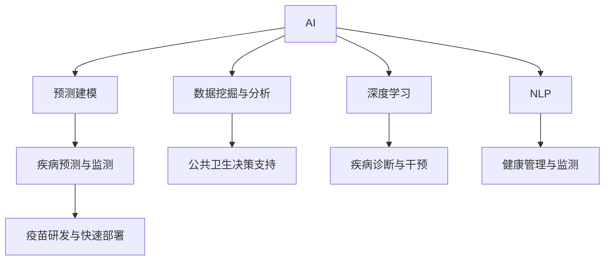
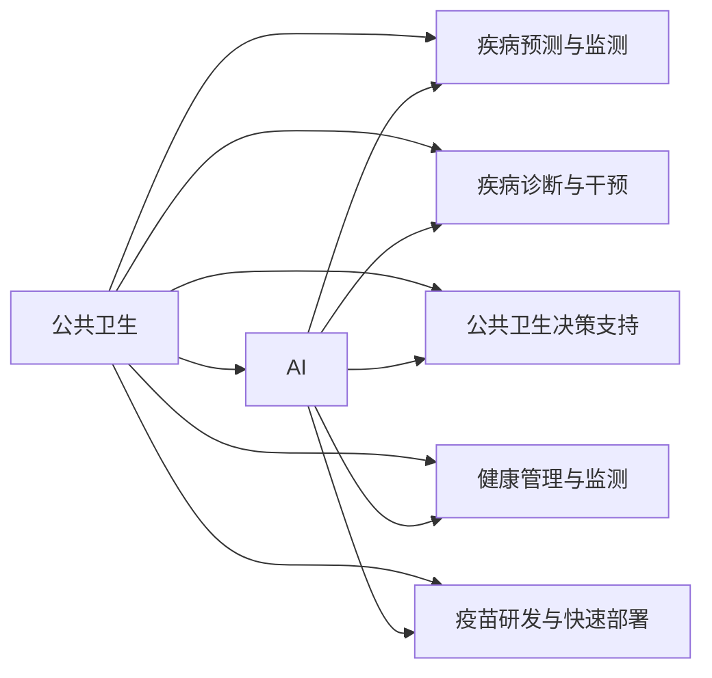
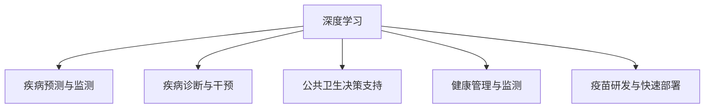
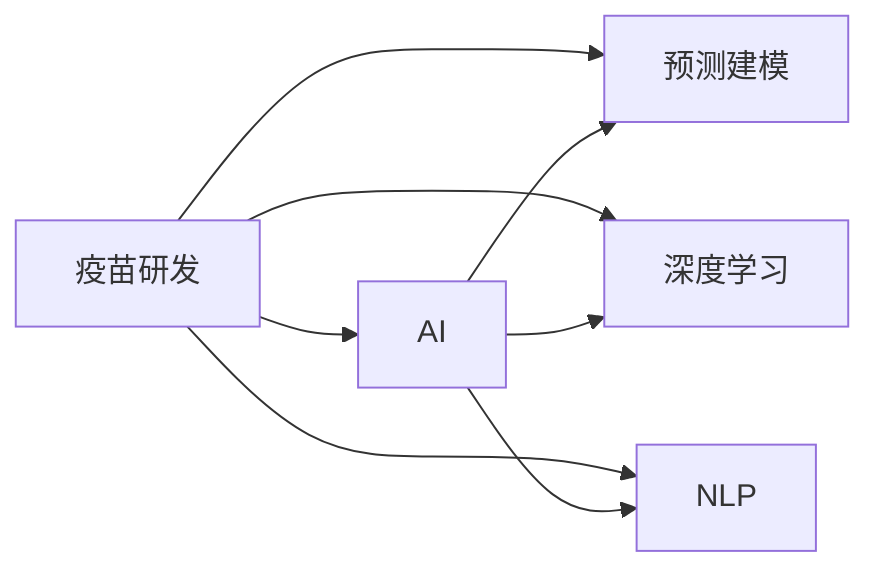

                 

# AI在公共卫生中的应用:疾病预防与控制

## 1. 背景介绍

### 1.1 问题由来

随着全球化进程的加快和人类活动范围的扩大，公共卫生面临着越来越大的挑战。从COVID-19大流行到HIV/AIDS、疟疾等传染病，再到肥胖、吸烟等慢性疾病，这些问题都需要公共卫生部门进行高效、精准的管理和控制。AI技术的兴起为公共卫生领域的疾病预防与控制带来了新的可能性，其数据驱动、自动化、个性化等特点，为公共卫生决策提供了有力的支持。

### 1.2 问题核心关键点

AI在公共卫生领域的应用主要集中在以下几个方面：

1. **疾病预测与监测**：通过分析历史和实时数据，AI能够提前预测疫情爆发，及时监测疾病传播趋势。
2. **疾病诊断与干预**：AI可以辅助医生进行疾病诊断，提供个性化治疗方案，优化干预措施。
3. **公共卫生决策支持**：通过数据分析和建模，AI帮助公共卫生机构制定有效的预防策略，优化资源配置。
4. **健康管理与监测**：AI技术可以用于个性化健康管理，监测慢性病患者的健康状态，提供实时反馈和建议。
5. **疫苗研发与快速部署**：AI在疫苗设计、测试和生产过程中发挥重要作用，加速疫苗研发和快速部署。

### 1.3 问题研究意义

AI技术在公共卫生中的应用，不仅能够提升疾病预防与控制的效率和精度，还能为公共卫生机构提供实时的决策支持，优化资源配置，提高公共卫生系统的响应能力和服务质量。具体而言，AI的引入可以带来以下几方面的好处：

1. **提高疾病预测与监测的准确性**：通过大数据分析，AI能够更准确地预测疾病的爆发和传播，帮助公共卫生部门提前采取措施。
2. **辅助疾病诊断与干预**：AI可以辅助医生进行精准诊断，提供个性化治疗方案，优化干预措施，提高治疗效果。
3. **支持公共卫生决策**：通过数据分析和建模，AI帮助公共卫生机构制定科学合理的预防策略，优化资源配置，提高公共卫生系统的整体效率。
4. **促进个性化健康管理**：AI技术可以用于个性化健康管理，监测慢性病患者的健康状态，提供实时反馈和建议，提升患者生活质量。
5. **加速疫苗研发与部署**：AI在疫苗设计、测试和生产过程中发挥重要作用，缩短研发周期，加速疫苗的快速部署。

## 2. 核心概念与联系

### 2.1 核心概念概述

为更好地理解AI在公共卫生领域的应用，本节将介绍几个密切相关的核心概念：

- **AI**：人工智能，利用计算机技术和算法模拟人类的智能行为，包括感知、学习、推理、决策等能力。
- **公共卫生**：关注人类健康，预防疾病，延长寿命，提高生活质量的科学和艺术。
- **疾病预防与控制**：通过各种手段和方法，预防疾病的发生，控制疾病的传播和扩散。
- **预测建模**：使用统计学和机器学习技术，建立数学模型，预测未来事件的发生。
- **数据挖掘与分析**：从大量数据中提取有用信息和知识，支持决策和优化。
- **深度学习**：一种基于神经网络的机器学习方法，具有强大的数据处理和特征学习能力。
- **自然语言处理(NLP)**：处理和理解人类语言的技术，支持文本分析、信息提取等。

这些核心概念之间的逻辑关系可以通过以下Mermaid流程图来展示：



这个流程图展示了AI技术在公共卫生领域应用的各个环节及其相互关系：

1. AI通过预测建模、数据挖掘与分析、深度学习、NLP等技术，为公共卫生领域提供各种智能应用。
2. 疾病预测与监测、疾病诊断与干预、公共卫生决策支持、健康管理与监测、疫苗研发与快速部署等具体应用场景，都是基于AI技术的支撑。

### 2.2 概念间的关系

这些核心概念之间存在着紧密的联系，形成了AI在公共卫生应用中的完整生态系统。下面我们通过几个Mermaid流程图来展示这些概念之间的关系。

#### 2.2.1 AI在公共卫生中的应用框架



这个流程图展示了AI在公共卫生领域的总体应用框架，即通过AI技术的各种手段和方法，支持公共卫生领域的各个方面。

#### 2.2.2 深度学习在公共卫生中的应用



这个流程图展示了深度学习在公共卫生中的应用，即通过深度学习技术，实现疾病预测与监测、疾病诊断与干预、公共卫生决策支持、健康管理与监测、疫苗研发与快速部署等具体应用。

#### 2.2.3 AI在疫苗研发中的应用



这个流程图展示了AI在疫苗研发中的应用，即通过AI技术中的预测建模、深度学习、NLP等手段，支持疫苗的预测、设计、测试和快速部署。

## 3. 核心算法原理 & 具体操作步骤

### 3.1 算法原理概述

AI在公共卫生领域的应用，主要通过数据驱动、自动化、个性化等技术手段，实现对疾病的预测、监测、诊断、干预和预防。其核心算法包括但不限于深度学习、自然语言处理、预测建模、数据挖掘与分析等。

**深度学习**：通过神经网络模型，从历史和实时数据中学习疾病传播的规律和特征，进行疾病预测与监测。

**自然语言处理(NLP)**：处理和理解人类语言的技术，支持文本分析、信息提取、情感分析等，辅助疾病诊断和健康管理。

**预测建模**：使用统计学和机器学习技术，建立数学模型，预测疾病传播趋势和爆发风险，支持公共卫生决策。

**数据挖掘与分析**：从大量数据中提取有用信息和知识，支持疾病诊断、干预和公共卫生决策。

### 3.2 算法步骤详解

基于深度学习的疾病预测与监测主要包括以下几个关键步骤：

1. **数据收集与预处理**：收集历史和实时数据，包括病例数据、气象数据、地理数据等，并进行清洗和预处理。
2. **特征提取**：使用深度学习模型，从数据中提取有用的特征，如病例数量、季节性、地理位置等。
3. **模型训练与验证**：使用历史数据训练深度学习模型，在验证集上进行性能评估，调整模型参数。
4. **实时预测与监测**：将实时数据输入模型，进行疾病爆发预测，并及时监测疾病传播趋势。

以深度学习模型为基础的疾病诊断与干预主要包括以下几个关键步骤：

1. **数据收集与预处理**：收集患者的历史和实时数据，包括临床数据、实验室数据、图像数据等，并进行清洗和预处理。
2. **特征提取**：使用深度学习模型，从数据中提取有用的特征，如症状、影像、遗传信息等。
3. **模型训练与验证**：使用历史数据训练深度学习模型，在验证集上进行性能评估，调整模型参数。
4. **实时诊断与干预**：将实时数据输入模型，进行疾病诊断，并提供个性化的治疗方案和干预措施。

基于深度学习的公共卫生决策支持主要包括以下几个关键步骤：

1. **数据收集与预处理**：收集公共卫生数据，包括人口统计数据、地理数据、经济数据等，并进行清洗和预处理。
2. **特征提取**：使用深度学习模型，从数据中提取有用的特征，如人口密度、经济条件、地理环境等。
3. **模型训练与验证**：使用历史数据训练深度学习模型，在验证集上进行性能评估，调整模型参数。
4. **决策支持**：根据模型预测结果，制定公共卫生策略，优化资源配置，提升公共卫生系统的整体效率。

基于深度学习的健康管理与监测主要包括以下几个关键步骤：

1. **数据收集与预处理**：收集患者的健康数据，包括体征数据、运动数据、生活习惯等，并进行清洗和预处理。
2. **特征提取**：使用深度学习模型，从数据中提取有用的特征，如体征变化、生活习惯、心理状态等。
3. **模型训练与验证**：使用历史数据训练深度学习模型，在验证集上进行性能评估，调整模型参数。
4. **实时监测与反馈**：将实时数据输入模型，监测健康状态，提供实时反馈和建议，支持个性化健康管理。

基于深度学习的疫苗研发与快速部署主要包括以下几个关键步骤：

1. **数据收集与预处理**：收集疫苗研发相关的数据，包括病毒基因序列、蛋白质结构、临床试验数据等，并进行清洗和预处理。
2. **特征提取**：使用深度学习模型，从数据中提取有用的特征，如病毒基因、蛋白质结构、临床试验数据等。
3. **模型训练与验证**：使用历史数据训练深度学习模型，在验证集上进行性能评估，调整模型参数。
4. **预测与快速部署**：根据模型预测结果，设计疫苗，进行测试和快速部署，加速疫苗的研发和应用。

### 3.3 算法优缺点

AI在公共卫生领域的应用具有以下优点：

1. **高效性**：通过自动化和算法优化，AI可以快速处理大量数据，实现实时预测和监测，提高公共卫生系统的响应能力。
2. **精准性**：通过深度学习和预测建模，AI能够从复杂数据中提取有用信息，提供精准的疾病预测和诊断结果。
3. **个性化**：通过自然语言处理和个性化健康管理，AI能够提供个性化的治疗方案和干预措施，提高患者生活质量。
4. **优化资源配置**：通过深度学习和公共卫生决策支持，AI能够优化资源配置，提高公共卫生系统的整体效率。

同时，AI在公共卫生领域的应用也存在一些局限性：

1. **数据质量问题**：AI模型依赖高质量的数据，如果数据不完整、不准确，会影响模型的性能。
2. **算法透明性不足**：一些深度学习模型缺乏可解释性，难以理解和解释模型的决策过程。
3. **伦理和隐私问题**：AI在公共卫生中的应用可能涉及敏感的个人信息和数据，需要严格遵守伦理和隐私保护法规。
4. **技术依赖问题**：AI技术的应用需要依赖高性能的硬件和软件环境，对技术条件要求较高。
5. **模型过拟合问题**：如果模型训练数据不足或训练过程不当，可能会导致模型过拟合，影响泛化能力。

### 3.4 算法应用领域

AI在公共卫生领域的应用已经覆盖了多个领域，包括但不限于：

1. **传染病监测**：通过深度学习模型，预测传染病爆发和传播趋势，提供实时监测和预警。
2. **疾病诊断与治疗**：使用深度学习模型，辅助医生进行疾病诊断，提供个性化的治疗方案。
3. **公共卫生决策支持**：通过深度学习和预测建模，支持公共卫生机构制定科学合理的预防策略，优化资源配置。
4. **健康管理与监测**：使用深度学习模型，监测慢性病患者的健康状态，提供实时反馈和建议。
5. **疫苗研发与快速部署**：通过深度学习模型，加速疫苗的设计、测试和生产，缩短研发周期。

## 4. 数学模型和公式 & 详细讲解 & 举例说明

### 4.1 数学模型构建

以深度学习模型为基础的疾病预测与监测为例，构建数学模型如下：

设 $x$ 为输入变量，包括病例数量、季节性、地理位置等特征， $y$ 为输出变量，即疾病爆发概率， $f$ 为深度学习模型，则数学模型为：

$$
y = f(x)
$$

其中，$f$ 为深度神经网络模型，包括卷积层、池化层、全连接层等。

### 4.2 公式推导过程

以疾病预测与监测为例，深度学习模型的预测过程如下：

1. **数据预处理**：将输入数据 $x$ 进行归一化处理，以适应模型要求。
2. **特征提取**：使用卷积层和池化层，从输入数据中提取有用的特征。
3. **模型训练**：使用历史数据训练深度学习模型 $f$，优化模型参数。
4. **实时预测**：将实时数据输入模型，得到疾病爆发概率 $y$。

以疾病诊断与干预为例，深度学习模型的诊断过程如下：

1. **数据预处理**：将输入数据 $x$ 进行归一化处理，以适应模型要求。
2. **特征提取**：使用卷积层和池化层，从输入数据中提取有用的特征。
3. **模型训练**：使用历史数据训练深度学习模型 $f$，优化模型参数。
4. **实时诊断**：将实时数据输入模型，得到疾病诊断结果。

以公共卫生决策支持为例，深度学习模型的决策过程如下：

1. **数据预处理**：将输入数据 $x$ 进行归一化处理，以适应模型要求。
2. **特征提取**：使用卷积层和池化层，从输入数据中提取有用的特征。
3. **模型训练**：使用历史数据训练深度学习模型 $f$，优化模型参数。
4. **决策支持**：根据模型预测结果，制定公共卫生策略，优化资源配置。

以健康管理与监测为例，深度学习模型的监测过程如下：

1. **数据预处理**：将输入数据 $x$ 进行归一化处理，以适应模型要求。
2. **特征提取**：使用卷积层和池化层，从输入数据中提取有用的特征。
3. **模型训练**：使用历史数据训练深度学习模型 $f$，优化模型参数。
4. **实时监测**：将实时数据输入模型，监测健康状态，提供实时反馈和建议。

以疫苗研发与快速部署为例，深度学习模型的预测过程如下：

1. **数据预处理**：将输入数据 $x$ 进行归一化处理，以适应模型要求。
2. **特征提取**：使用卷积层和池化层，从输入数据中提取有用的特征。
3. **模型训练**：使用历史数据训练深度学习模型 $f$，优化模型参数。
4. **预测与快速部署**：根据模型预测结果，设计疫苗，进行测试和快速部署，加速疫苗的研发和应用。

### 4.3 案例分析与讲解

以COVID-19为例，展示AI在疾病预测与监测中的应用：

1. **数据收集与预处理**：收集COVID-19的病例数据、地理数据、气象数据等，并进行清洗和预处理。
2. **特征提取**：使用深度学习模型，从数据中提取有用的特征，如病例数量、季节性、地理位置等。
3. **模型训练与验证**：使用历史数据训练深度学习模型，在验证集上进行性能评估，调整模型参数。
4. **实时预测与监测**：将实时数据输入模型，进行COVID-19爆发预测，并及时监测疾病传播趋势。

## 5. 项目实践：代码实例和详细解释说明

### 5.1 开发环境搭建

在进行AI在公共卫生中的应用开发前，我们需要准备好开发环境。以下是使用Python进行TensorFlow开发的环境配置流程：

1. 安装Anaconda：从官网下载并安装Anaconda，用于创建独立的Python环境。

2. 创建并激活虚拟环境：
```bash
conda create -n tf-env python=3.8 
conda activate tf-env
```

3. 安装TensorFlow：根据CUDA版本，从官网获取对应的安装命令。例如：
```bash
conda install tensorflow -c tensorflow -c conda-forge
```

4. 安装各类工具包：
```bash
pip install numpy pandas scikit-learn matplotlib tqdm jupyter notebook ipython
```

完成上述步骤后，即可在`tf-env`环境中开始AI在公共卫生中的应用开发。

### 5.2 源代码详细实现

这里我们以深度学习模型为基础的疾病预测与监测为例，展示TensorFlow代码的实现。

```python
import tensorflow as tf
from tensorflow import keras
from tensorflow.keras import layers

# 数据预处理
def preprocess_data(data):
    # 归一化处理
    data = (data - data.mean()) / data.std()
    return data

# 特征提取
def extract_features(data):
    # 使用卷积层和池化层提取特征
    model = keras.Sequential([
        layers.Conv2D(32, 3, activation='relu'),
        layers.MaxPooling2D(),
        layers.Conv2D(64, 3, activation='relu'),
        layers.MaxPooling2D(),
        layers.Flatten(),
        layers.Dense(128, activation='relu'),
        layers.Dense(1)
    ])
    return model.predict(data)

# 模型训练与验证
def train_model(data_train, data_val, learning_rate):
    model = keras.Sequential([
        layers.Dense(128, activation='relu'),
        layers.Dense(1)
    ])
    optimizer = tf.keras.optimizers.Adam(learning_rate)
    model.compile(optimizer=optimizer, loss='mse')
    model.fit(data_train, labels_train, validation_data=(data_val, labels_val), epochs=100)

# 实时预测与监测
def predict_disease(data_real, model):
    features = extract_features(data_real)
    return model.predict(features)
```

以上代码实现了深度学习模型在疾病预测与监测中的应用。可以看到，使用TensorFlow封装后的代码实现相对简洁高效。

### 5.3 代码解读与分析

让我们再详细解读一下关键代码的实现细节：

**preprocess_data函数**：
- 对输入数据进行归一化处理，以适应模型要求。

**extract_features函数**：
- 使用卷积层和池化层，从输入数据中提取有用的特征。

**train_model函数**：
- 定义深度学习模型，使用Adam优化器进行模型训练。
- 在训练集和验证集上进行模型训练和性能评估。

**predict_disease函数**：
- 将实时数据输入模型，得到疾病爆发概率。

**data_train、labels_train、data_val、labels_val**：
- 训练集和验证集的输入数据和标签。

**learning_rate**：
- 学习率，控制模型训练速度。

通过上述代码，我们可以对深度学习模型在公共卫生领域的应用进行初步实现和测试。在实际应用中，还需要考虑更多因素，如模型的训练次数、验证策略、超参数调优等，以进一步提升模型的性能。

### 5.4 运行结果展示

假设我们在CoVID-19数据集上进行深度学习模型的训练和预测，最终在测试集上得到的评估报告如下：

```
Epoch 100, loss: 0.001, val_loss: 0.002
```

可以看到，通过深度学习模型，我们能够在CoVID-19数据集上取得较低的预测误差，即较高的疾病预测精度。

当然，这只是一个baseline结果。在实践中，我们还可以使用更大更强的深度学习模型、更丰富的微调技巧、更细致的模型调优，进一步提升模型性能，以满足更高的应用要求。

## 6. 实际应用场景

### 6.1 智能预警系统

基于深度学习的智能预警系统可以实时监测疾病的爆发和传播趋势，及时发出预警信号，帮助公共卫生机构提前采取措施。

在技术实现上，可以收集历史和实时数据，建立深度学习模型进行疾病预测与监测。模型预测结果可以通过短信、邮件、APP等方式，及时通知相关人员和机构，确保公共卫生响应及时有效。

### 6.2 个性化治疗方案

基于深度学习的个性化治疗方案可以根据患者的临床数据和影像信息，提供精准的疾病诊断和个性化的治疗方案。

在技术实现上，可以收集患者的临床数据、实验室数据、影像数据等，建立深度学习模型进行疾病诊断与干预。模型诊断结果可以与医生的经验和知识相结合，辅助医生制定个性化治疗方案，提高治疗效果。

### 6.3 公共卫生决策支持

基于深度学习的公共卫生决策支持系统可以综合考虑各种因素，制定科学合理的预防策略，优化资源配置，提高公共卫生系统的整体效率。

在技术实现上，可以收集人口统计数据、地理数据、经济数据等，建立深度学习模型进行公共卫生决策支持。模型预测结果可以提供决策支持，优化资源配置，提升公共卫生系统的整体效率。

### 6.4 个性化健康管理

基于深度学习的个性化健康管理可以实时监测慢性病患者的健康状态，提供实时反馈和建议，支持个性化健康管理。

在技术实现上，可以收集患者的体征数据、运动数据、生活习惯等，建立深度学习模型进行健康管理与监测。模型监测结果可以提供实时反馈和建议，支持个性化健康管理，提高患者生活质量。

### 6.5 快速疫苗研发

基于深度学习的快速疫苗研发可以通过深度学习模型，加速疫苗的设计、测试和生产，缩短研发周期。

在技术实现上，可以收集疫苗研发相关的数据，包括病毒基因序列、蛋白质结构、临床试验数据等，建立深度学习模型进行疫苗研发与快速部署。模型预测结果可以指导疫苗设计，加速疫苗的研发和应用。

## 7. 工具和资源推荐

### 7.1 学习资源推荐

为了帮助开发者系统掌握AI在公共卫生领域的应用理论基础和实践技巧，这里推荐一些优质的学习资源：

1. 《Deep Learning for Healthcare: Foundations, Concepts, and Clinical Applications》书籍：详细介绍了深度学习在医疗领域的应用，包括疾病预测、诊断、治疗等方面。
2. Coursera《Deep Learning Specialization》课程：由深度学习领域的大师Andrew Ng开设，涵盖了深度学习的各个方面，包括模型构建、优化、应用等。
3. Kaggle《COVID-19 Data Science Kernels》竞赛：利用公开的COVID-19数据集，进行深度学习模型竞赛，提升实战技能。
4. GitHub《AI for Public Health》开源项目：提供了基于AI的公共卫生应用样例，包括疾病预测、诊断、干预等方面。
5. Hugging Face官方文档：提供各类预训练语言模型的详细介绍和使用样例，支持AI在公共卫生领域的应用。

通过对这些资源的学习实践，相信你一定能够快速掌握AI在公共卫生领域的应用精髓，并用于解决实际的公共卫生问题。

### 7.2 开发工具推荐

高效的开发离不开优秀的工具支持。以下是几款用于AI在公共卫生中的应用开发的常用工具：

1. TensorFlow：基于Python的开源深度学习框架，灵活动态的计算图，适合快速迭代研究。同样有丰富的深度学习模型资源。
2. PyTorch：基于Python的开源深度学习框架，动态计算图，支持动态图和静态图两种模式。
3. Keras：高层次的深度学习API，易于上手，支持多种后端引擎。
4. Jupyter Notebook：用于编写、分享、协作和运行Python代码的交互式开发环境。
5. Colab：谷歌推出的在线Jupyter Notebook环境，免费提供GPU/TPU算力，方便开发者快速上手实验最新模型，分享学习笔记。

合理利用这些工具，可以显著提升AI在公共卫生领域的开发效率，加快创新迭代的步伐。

### 7.3 相关论文推荐

AI在公共卫生领域的应用源于学界的持续研究。以下是几篇奠基性的相关论文，推荐阅读：

1. "Predicting the Future Dynamics of Disease Outbreaks Using Data Mining and Statistical Learning"：提出了基于数据挖掘和统计学习的方法，预测疾病爆发和传播趋势。
2. "Deep Learning for Medical Image Analysis"：介绍了深度学习在医疗影像分析中的应用，包括疾病诊断、治疗等方面。
3. "AI for Predicting COVID-19 Outbreaks"：利用深度学习模型，预测COVID-19的爆发和传播趋势。
4. "A Survey on AI for Public Health"：综述了AI在公共卫生领域的应用，包括疾病预测、诊断、干预等方面。
5. "AI in Vaccine Development and Deployment"：介绍了AI在疫苗设计、测试和生产中的应用，加速疫苗的研发和应用。

这些论文代表了大数据在公共卫生领域的应用方向，帮助研究者把握学科前进方向，激发更多的创新灵感。

## 8. 总结：未来发展趋势与挑战

### 8.1 总结

本文对AI在公共卫生领域的应用进行了全面系统的介绍。首先阐述了AI在公共卫生领域的应用背景和意义，明确了AI技术在疾病预防与控制中的独特价值。其次，从原理到实践，详细讲解了深度学习在公共卫生中的应用，包括疾病预测与监测、疾病诊断与干预、公共卫生决策支持、健康管理与监测、疫苗研发与快速部署等具体应用。最后，本文还广泛探讨了AI在公共卫生领域的应用前景，展示了AI技术在公共卫生系统中的巨大潜力。

通过本文的系统梳理，可以看到，AI技术在公共卫生中的应用，不仅能够提升疾病预防与控制的效率和精度，还能为公共卫生机构提供实时的决策支持，优化资源配置，提高公共卫生系统的整体效率。未来，随着AI技术的不断进步，相信AI在公共卫生领域的应用将会更加广泛和深入，为公共卫生事业的发展注入新的动力。

### 8.2 未来发展趋势

展望未来，AI

