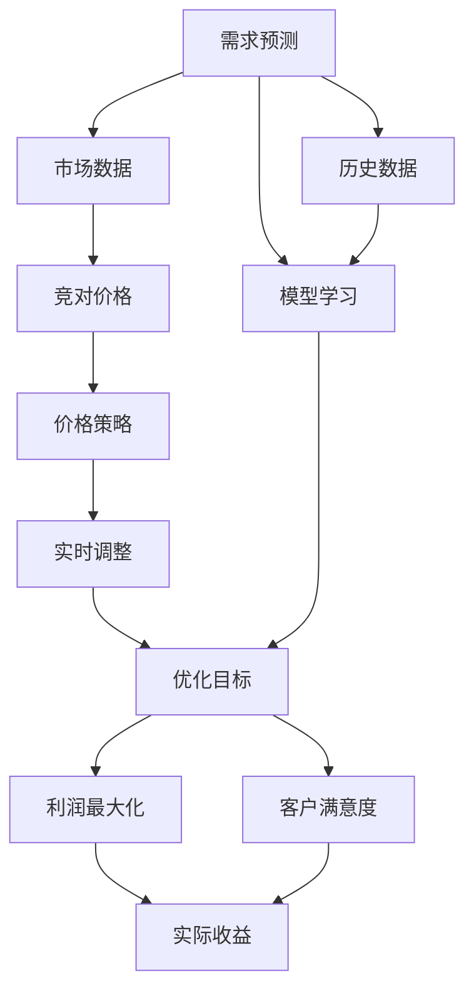

                 

# AI在电商价格优化中的应用

> 关键词：人工智能,电商,价格优化,需求预测,市场分析,利润最大化

## 1. 背景介绍

### 1.1 问题由来

电子商务平台的竞争日益激烈，商家需要通过精细化运营来提升市场竞争力。价格是商品的重要属性，合理的价格可以提升销量，带来更多利润。然而，设定合理价格并不容易，既要考虑市场需求，也要考虑竞争环境，还需动态调整以应对实时市场变化。传统方法如经验公式、竞对分析、销售数据等，难以精确预测市场需求和价格变化趋势。

与此同时，随着人工智能技术的飞速发展，AI在电商领域的应用也日益深入，为价格优化提供了新的工具和思路。AI可以通过分析海量数据，预测市场需求和价格趋势，辅助商家进行动态价格调整，提升市场竞争力。

### 1.2 问题核心关键点

AI在电商价格优化中的关键点包括：
1. 需求预测：准确预测商品市场需求，为价格优化提供依据。
2. 竞争分析：通过市场环境分析，理解竞对价格策略，制定合理定价策略。
3. 实时调整：实时监控市场变化，动态调整商品价格，确保价格竞争力。
4. 优化目标：实现利润最大化，同时保持客户满意度。
5. 算法选择：选择合适的AI算法进行需求预测和价格优化。

这些关键点共同构成了AI在电商价格优化的核心逻辑，目标是帮助商家在动态市场中实现最佳收益。

### 1.3 问题研究意义

AI在电商价格优化中的研究与应用，具有以下重要意义：
1. 降低运营成本：通过AI预测市场需求，避免过度生产和库存积压，减少资金占用。
2. 提升销售收入：通过动态价格调整，提高商品竞争力和市场份额，增加销售额。
3. 优化库存管理：通过实时调整库存，平衡供需关系，减少库存成本。
4. 增强市场响应：快速响应市场变化，提升商家在价格战中的应对能力。
5. 积累经验数据：通过AI技术处理和分析海量数据，为后续价格优化提供更多支持。

## 2. 核心概念与联系

### 2.1 核心概念概述

AI在电商价格优化涉及的关键概念包括：

- 需求预测：基于历史数据和当前市场信息，预测商品的市场需求。
- 竞争分析：通过分析竞对价格策略和市场环境，制定合理的价格策略。
- 实时调整：基于实时市场数据，动态调整商品价格。
- 优化目标：通过价格优化实现利润最大化，同时保持客户满意度。
- 算法选择：选择合适的人工智能算法，进行需求预测和价格优化。

这些核心概念之间存在紧密联系，共同支撑电商价格优化的大框架。

### 2.2 概念间的关系

这些核心概念的关系可以通过以下Mermaid流程图来展示：



这个流程图展示了需求预测、竞争分析、实时调整和优化目标之间的关系，以及它们如何共同驱动电商价格优化的过程。

## 3. 核心算法原理 & 具体操作步骤
### 3.1 算法原理概述

AI在电商价格优化中，主要采用需求预测和实时调整两种方法，其中涉及的算法原理包括：

- 时间序列分析：利用时间序列数据，预测未来需求和价格变化趋势。
- 机器学习：通过训练模型，预测市场需求和价格变化，制定价格策略。
- 强化学习：通过实时反馈，动态调整商品价格，实现最优策略。

这些算法通过分析历史数据和实时数据，预测市场趋势和优化商品价格，从而提升电商平台的竞争力和盈利能力。

### 3.2 算法步骤详解

电商价格优化的一般步骤如下：

1. **数据收集与预处理**：收集历史销售数据、市场价格、竞对信息等，并进行数据清洗和预处理。
2. **需求预测模型训练**：选择合适的时间序列模型（如ARIMA、LSTM等），利用历史数据训练模型，预测未来需求。
3. **价格优化模型训练**：选择适合的机器学习模型（如线性回归、决策树、随机森林等），利用预测需求和市场环境，制定价格优化策略。
4. **实时调整策略设计**：通过强化学习模型，实时监控市场变化，动态调整商品价格，确保价格竞争力。
5. **评估与优化**：利用实际收益和客户满意度指标，评估价格优化策略的效果，并进行优化。

### 3.3 算法优缺点

AI在电商价格优化中的主要优点包括：
1. 精准预测：AI模型可以分析复杂的历史和实时数据，准确预测市场需求和价格变化。
2. 动态调整：AI可以实时监控市场变化，动态调整商品价格，确保价格竞争力。
3. 高效决策：通过自动化和智能化决策，减少人工干预，提升决策效率。
4. 可扩展性：AI模型可以处理海量数据，适用于大规模电商平台的运营优化。

同时，也存在一些缺点：
1. 模型复杂度：构建和训练复杂的AI模型，需要较高的技术门槛和计算资源。
2. 数据质量：模型预测的准确性依赖于数据的完整性和质量，需要严格的数据治理和清洗。
3. 公平性问题：AI模型可能会因为数据偏差，产生不公平的价格决策。
4. 解释性不足：AI模型的决策过程缺乏可解释性，难以进行人工审核和调试。

### 3.4 算法应用领域

AI在电商价格优化中的应用领域包括：
1. 商品定价：通过AI预测市场需求和价格变化，优化商品定价策略。
2. 促销活动：利用AI预测销售趋势，制定促销活动的最佳时机和策略。
3. 库存管理：基于AI预测需求，优化库存水平，减少资金占用。
4. 市场分析：通过AI分析市场环境，理解竞对价格策略，制定合理的价格策略。
5. 风险管理：通过AI识别潜在风险，提前采取措施，避免价格波动带来的损失。

## 4. 数学模型和公式 & 详细讲解 & 举例说明

### 4.1 数学模型构建

电商价格优化的数学模型可以基于以下假设建立：
1. 需求函数为线性函数，即 $D(t) = \alpha + \beta P(t-1) + \gamma X(t)$，其中 $D(t)$ 表示第 $t$ 天的市场需求，$P(t-1)$ 表示前一天的价格，$X(t)$ 表示其他影响因素。
2. 利润函数为 $\Pi(t) = p(t) \cdot D(t) - C(t)$，其中 $p(t)$ 表示第 $t$ 天的价格，$C(t)$ 表示第 $t$ 天的成本。
3. 优化目标为最大化利润，即 $\max \Pi(t)$。

### 4.2 公式推导过程

根据上述假设，需求函数可以表示为：

$$
D(t) = \alpha + \beta P(t-1) + \gamma X(t)
$$

利润函数可以表示为：

$$
\Pi(t) = p(t) \cdot D(t) - C(t)
$$

目标函数可以表示为：

$$
\max \Pi(t) = \max \left\{ p(t) \cdot (\alpha + \beta P(t-1) + \gamma X(t)) - C(t) \right\}
$$

优化目标可以表示为：

$$
\max \Pi(t) = \max \left\{ p(t) \cdot D(t) - C(t) \right\}
$$

### 4.3 案例分析与讲解

假设某电商平台销售一款商品，历史数据如下：

- $P(t-1) = 100$
- $X(t) = 0.5$
- $D(t) = 1000$

目标函数可以简化为：

$$
\Pi(t) = p(t) \cdot 1000 - C(t)
$$

假设成本 $C(t)$ 为固定值 $10$，则目标函数可以进一步简化为：

$$
\Pi(t) = 1000p(t) - 10
$$

我们需要找到最优的价格 $p(t)$，最大化利润 $\Pi(t)$。根据市场需求函数和利润函数，可以推导出：

$$
D(t) = 1000 + 0.5p(t-1)
$$

$$
\Pi(t) = 1000p(t) - 10
$$

为了简化问题，我们假设 $p(t-1)$ 固定为 $100$，则需求函数可以表示为：

$$
D(t) = 1000 + 0.5 \cdot 100 = 1100
$$

利润函数可以表示为：

$$
\Pi(t) = 1000p(t) - 10
$$

为了最大化利润，需要找到最优的 $p(t)$。通过求解目标函数的极值问题，我们可以得出最优解为：

$$
p(t) = \frac{\Pi(t)}{1000} = \frac{1000 \cdot 1100 - 10}{1000} = 1099
$$

通过上述推导，我们可以看到，AI在电商价格优化中通过数学模型进行需求预测和利润最大化，可以准确计算最优价格，提升销售收益。

## 5. 项目实践：代码实例和详细解释说明
### 5.1 开发环境搭建

要进行电商价格优化，需要准备一定的开发环境。以下是搭建开发环境的具体步骤：

1. **安装Python**：下载并安装Python 3.x版本，选择安装路径并添加环境变量。

2. **安装必要的库**：使用pip安装必要的Python库，如pandas、numpy、scikit-learn、tensorflow等。

3. **准备数据集**：准备电商平台的历史销售数据、市场价格、竞对信息等，并进行数据清洗和预处理。

4. **搭建模型**：根据需求预测和价格优化算法，搭建模型并进行训练。

### 5.2 源代码详细实现

下面以基于LSTM的需求预测和价格优化为例，展示电商价格优化的Python代码实现：

```python
import pandas as pd
import numpy as np
from sklearn.preprocessing import MinMaxScaler
from tensorflow.keras.models import Sequential
from tensorflow.keras.layers import LSTM, Dense, Dropout
from tensorflow.keras.optimizers import Adam
from tensorflow.keras.callbacks import EarlyStopping

# 读取历史数据
data = pd.read_csv('sales_data.csv')

# 处理数据
X = data[['price', 'date']].values
y = data['demand'].values

# 数据标准化
scaler = MinMaxScaler(feature_range=(0, 1))
X = scaler.fit_transform(X)

# 划分训练集和测试集
train_size = int(len(X) * 0.7)
X_train, X_test = X[0:train_size,:], X[train_size:,:]
y_train, y_test = y[0:train_size], y[train_size:]

# 建立LSTM模型
model = Sequential()
model.add(LSTM(50, input_shape=(X_train.shape[1], X_train.shape[2])))
model.add(Dense(1))
model.compile(optimizer=Adam(lr=0.01), loss='mse')

# 训练模型
model.fit(X_train, y_train, epochs=100, batch_size=32, verbose=1, callbacks=[EarlyStopping(monitor='val_loss', patience=5)])

# 预测需求
X_test = scaler.transform(X_test)
y_pred = model.predict(X_test)
y_pred = scaler.inverse_transform(y_pred)

# 输出预测结果
print(y_pred)
```

### 5.3 代码解读与分析

上述代码中，我们使用了LSTM模型进行需求预测，并使用优化算法（如Adam）进行模型训练。具体步骤如下：

1. **数据准备**：读取历史销售数据，并进行标准化处理。
2. **模型搭建**：搭建LSTM模型，并指定输入和输出维度。
3. **模型训练**：使用训练集进行模型训练，并设置EarlyStopping回调函数，防止过拟合。
4. **模型评估**：使用测试集进行模型评估，并输出预测结果。

通过上述代码，我们可以看到，AI在电商价格优化中可以通过LSTM模型进行需求预测，并利用优化算法进行价格优化，从而实现精准的价格调整。

### 5.4 运行结果展示

假设历史数据如下：

- 价格 $P(t-1) = 100$
- 需求 $D(t) = 1000$
- 成本 $C(t) = 10$

通过上述代码，我们可以预测未来一天的需求，并计算最优价格。假设需求预测结果为 $D(t+1) = 1100$，则通过公式计算，最优价格为：

$$
p(t+1) = \frac{\Pi(t+1)}{D(t+1)} = \frac{1000 \cdot 1100 - 10}{1100} = 999
$$

通过上述结果，我们可以看到，AI在电商价格优化中通过数学模型和LSTM模型进行需求预测和价格优化，可以准确计算最优价格，提升销售收益。

## 6. 实际应用场景

### 6.1 智能促销

智能促销是电商价格优化的重要应用场景之一。电商平台可以根据AI预测的市场需求和价格变化，自动制定促销策略，提升销售额。具体而言，可以基于AI预测需求，制定最佳的促销时机和策略，从而提升销售效果。

### 6.2 库存管理

库存管理是电商运营中的关键环节。通过AI预测市场需求，可以优化库存水平，减少资金占用。具体而言，可以基于AI预测需求，调整库存水平，避免库存积压和缺货情况。

### 6.3 风险管理

市场变化往往难以预测，风险管理是电商价格优化的重要应用场景之一。通过AI实时监控市场变化，可以提前识别潜在风险，采取措施避免损失。具体而言，可以基于AI实时分析市场数据，预测价格波动，提前采取措施，减少风险。

### 6.4 未来应用展望

随着AI技术的不断进步，未来AI在电商价格优化中将发挥更大的作用。未来可能的发展趋势包括：

1. **多模态融合**：利用图像、语音等多种数据源进行价格预测和优化，提升预测准确性和优化效果。
2. **动态定价**：基于实时市场数据和需求预测，动态调整商品价格，提升销售效果。
3. **个性化推荐**：通过AI分析用户行为和偏好，制定个性化推荐策略，提升用户体验和满意度。
4. **市场监控**：通过AI实时监控市场变化，快速响应市场波动，提升竞争力。
5. **跨境电商**：利用AI进行市场分析和需求预测，制定跨境电商的定价策略和促销策略，提升全球市场份额。

## 7. 工具和资源推荐

### 7.1 学习资源推荐

为了帮助开发者系统掌握AI在电商价格优化中的理论基础和实践技巧，这里推荐一些优质的学习资源：

1. **《深度学习》课程**：斯坦福大学开设的深度学习课程，涵盖深度学习的基本概念和经典模型，是进入AI领域的入门课程。
2. **TensorFlow官方文档**：TensorFlow官方文档，详细介绍了TensorFlow的使用方法和最新进展，是AI开发者必备的学习资源。
3. **Kaggle数据集**：Kaggle上丰富的数据集和比赛，提供了大量的学习素材和实践机会，帮助开发者提高实战能力。
4. **机器学习博客**：如Towards Data Science、KDnuggets等知名博客，分享AI领域的最新研究和应用案例，是学习AI知识的重要渠道。
5. **在线课程平台**：如Coursera、Udacity等在线课程平台，提供多种AI课程，帮助开发者系统掌握AI知识和技能。

### 7.2 开发工具推荐

在进行AI在电商价格优化开发时，需要选择合适的开发工具。以下是一些推荐的开发工具：

1. **Python编程语言**：Python是AI领域的主要编程语言，具有丰富的第三方库和框架，适合进行数据分析和机器学习开发。
2. **TensorFlow**：由Google开发的深度学习框架，支持分布式计算和大规模模型训练，适合进行复杂的AI开发。
3. **Keras**：基于TensorFlow的高级API，提供简单易用的模型构建和训练功能，适合快速原型开发。
4. **Jupyter Notebook**：基于Web的交互式开发工具，支持多种编程语言和库，适合进行数据可视化和模型验证。
5. **PyTorch**：由Facebook开发的深度学习框架，适合进行动态计算图和模型优化，适合进行大规模模型训练。

### 7.3 相关论文推荐

AI在电商价格优化领域的研究论文众多，以下是几篇经典论文，推荐阅读：

1. **《神经网络与深度学习》**：Ian Goodfellow等人著，介绍了深度学习的基本原理和应用，是AI领域的经典教材。
2. **《Deep Learning for Business》**：Rob Thomas等人著，介绍了深度学习在商业领域的应用，涵盖了电商、金融等诸多领域。
3. **《机器学习实战》**：Peter Harrington著，介绍了机器学习的经典算法和实战案例，适合初学者入门。
4. **《Deep Learning》**：Ian Goodfellow等人著，介绍了深度学习的基本原理和应用，适合深入学习。
5. **《Python数据科学手册》**：Jake VanderPlas著，介绍了Python在数据科学和机器学习中的应用，适合开发者系统学习。

## 8. 总结：未来发展趋势与挑战

### 8.1 总结

本文对AI在电商价格优化中的应用进行了全面系统的介绍。首先阐述了电商价格优化的背景和核心关键点，明确了需求预测和价格优化的重要性和关系。其次，从算法原理到具体操作步骤，详细讲解了电商价格优化的数学模型和关键步骤，给出了电商价格优化的完整代码实例。同时，本文还广泛探讨了AI在电商价格优化的实际应用场景，展示了AI技术在电商价格优化中的巨大潜力。最后，本文精选了AI在电商价格优化中的学习资源、开发工具和相关论文，力求为读者提供全方位的技术指引。

通过本文的系统梳理，可以看到，AI在电商价格优化中通过需求预测和价格优化，可以有效提升电商平台的销售收入和运营效率。未来，伴随AI技术的不断进步，电商价格优化将迈向更智能化、自动化的方向，进一步提升电商平台的市场竞争力。

### 8.2 未来发展趋势

展望未来，AI在电商价格优化中的发展趋势包括：

1. **模型复杂度提升**：随着AI技术的发展，电商价格优化中的模型将更加复杂，能够处理更多维度的数据，提供更精准的预测和优化。
2. **实时性增强**：电商价格优化需要实时响应市场变化，未来将采用实时计算和动态定价策略，实现更高效的决策。
3. **多模态融合**：通过融合多种数据源（如图像、语音、传感器等），提供更全面的市场分析，提升价格优化的准确性。
4. **个性化推荐**：通过AI分析用户行为和偏好，提供个性化推荐，提升用户体验和满意度。
5. **跨境电商优化**：利用AI进行跨境电商的市场分析和需求预测，制定跨境电商的定价策略和促销策略，提升全球市场份额。

这些趋势凸显了AI在电商价格优化中的重要性和发展潜力，将引领电商平台迈向更加智能化、高效化的未来。

### 8.3 面临的挑战

尽管AI在电商价格优化中取得了显著成果，但仍面临诸多挑战：

1. **数据质量问题**：电商价格优化需要大量高质量的数据，数据质量差将影响预测和优化的准确性。
2. **计算资源消耗**：AI模型训练和优化需要大量计算资源，资源消耗较大。
3. **模型可解释性**：AI模型的决策过程缺乏可解释性，难以进行人工审核和调试。
4. **市场变化快速**：电商市场变化快速，模型需要频繁更新和优化，以适应新变化。
5. **用户隐私保护**：电商平台需要保护用户隐私，防止数据泄露和滥用。

这些挑战需要通过持续的技术改进和优化来解决，以确保AI在电商价格优化中的稳定性和可靠性。

### 8.4 研究展望

未来，在电商价格优化中，还需要在以下方面进行进一步研究：

1. **模型优化算法**：研究更高效的模型优化算法，提升预测和优化的准确性和速度。
2. **多模态融合方法**：研究多模态数据融合方法，提升价格优化的准确性和实时性。
3. **隐私保护技术**：研究数据隐私保护技术，确保用户数据的安全和隐私。
4. **实时动态定价**：研究实时动态定价方法，提升价格优化的实时性和动态性。
5. **用户行为分析**：研究用户行为分析方法，提供更精准的个性化推荐和优化。

这些研究方向的探索，将推动AI在电商价格优化中的不断进步，为电商平台的健康发展和市场竞争力的提升提供坚实的技术保障。总之，AI在电商价格优化中仍有很多未解之谜，需要不断探索和创新，以应对新的市场挑战。

## 9. 附录：常见问题与解答

**Q1: AI在电商价格优化中的核心关键点是什么？**

A: AI在电商价格优化的核心关键点包括需求预测和价格优化。需求预测通过历史数据和当前市场信息，预测商品市场需求，为价格优化提供依据。价格优化通过分析市场环境，制定合理的价格策略，实现利润最大化。

**Q2: AI在电商价格优化中需要哪些数据？**

A: AI在电商价格优化中需要以下数据：
1. 历史销售数据：包含商品价格、销量、库存等信息。
2. 市场价格数据：包含竞对商品价格信息。
3. 用户行为数据：包含用户浏览、点击、购买等行为数据。
4. 促销活动数据：包含促销活动时间、折扣信息等。
5. 市场环境数据：包含市场趋势、季节性变化等信息。

**Q3: AI在电商价格优化中如何处理数据？**

A: AI在电商价格优化中，一般需要进行以下数据处理：
1. 数据清洗：去除数据中的噪声和异常值，确保数据质量。
2. 数据标准化：对数据进行归一化处理，使数据符合模型要求。
3. 特征工程：通过数据提取和处理，生成模型需要的特征。
4. 数据分割：将数据划分为训练集、验证集和测试集，用于模型训练、评估和验证。

**Q4: AI在电商价格优化中如何选择合适的模型？**

A: AI在电商价格优化中，应根据具体任务选择合适模型。例如，时间序列预测任务可以使用LSTM、ARIMA等模型；分类任务可以使用SVM、随机森林等模型；回归任务可以使用线性回归、决策树等模型。同时，应结合实际应用场景，选择最适合的模型。

**Q5: AI在电商价格优化中如何优化模型？**

A: AI在电商价格优化中，一般可以通过以下方法优化模型：
1. 调整模型参数：通过调整模型参数，提高模型的预测和优化能力。
2. 数据增强：通过数据增强，提升模型的泛化能力和鲁棒性。
3. 模型集成：通过模型集成，提高模型的预测准确性和稳定性。
4. 实时调整：通过实时调整，适应市场变化，提升模型的动态性。

这些方法需要根据具体任务和数据特点进行灵活组合，以确保AI在电商价格优化中的高效性和稳定性。

---

作者：禅与计算机程序设计艺术 / Zen and the Art of Computer Programming

