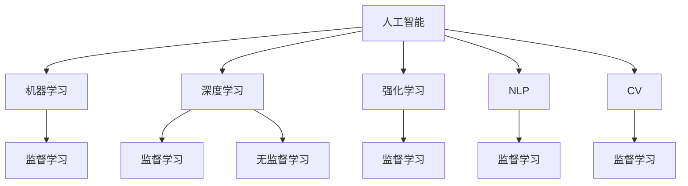

                 

## 1. 背景介绍

### 1.1 问题由来

随着人工智能（AI）技术的不断突破，其在社会中的应用已经渗透到各个角落。从自动化生产线到智能客服，从医疗诊断到金融风控，AI技术正在改变着我们的生活和工作方式。然而，AI的广泛应用也带来了新的挑战和问题。本文将深入探讨AI在社会中的作用与应用，提出未来发展趋势和挑战，为从业者提供技术指引。

### 1.2 问题核心关键点

1. **技术进步与伦理问题**：AI技术的快速发展带来了前所未有的生产力提升，但同时也引发了隐私、安全、就业、公平等伦理问题。
2. **人机协作**：AI与人类在社会中的角色定位和协作方式，如何实现高效、安全的融合。
3. **数据驱动决策**：AI如何利用大数据、深度学习等技术，辅助决策者做出更准确、科学的决策。
4. **跨领域应用**：AI技术在不同行业中的应用前景和创新点，如智慧城市、智能制造、智慧医疗等。
5. **未来展望**：AI技术的发展方向和未来可能带来的变革，如通用人工智能、人类增强等。

### 1.3 问题研究意义

AI技术在社会中的作用与应用，关系到人类社会的可持续发展、生产力的提升和公民的福祉。通过深入研究，可以为政策制定者、企业决策者和技术开发者提供科学的依据，推动AI技术的健康发展，解决由此带来的伦理和法律问题。

## 2. 核心概念与联系

### 2.1 核心概念概述

为了更好地理解AI在社会中的作用与应用，本节将介绍几个密切相关的核心概念：

- **人工智能（AI）**：通过计算机模拟人类智能，包括感知、学习、推理、规划、语言理解、图像识别等能力。
- **机器学习（ML）**：AI的一个重要分支，通过数据和算法训练模型，使机器能够自主学习、预测和决策。
- **深度学习（DL）**：一种特殊的机器学习方法，使用多层神经网络模拟人脑处理信息的方式。
- **强化学习（RL）**：通过奖励和惩罚机制，使机器能够自主学习最优策略。
- **自然语言处理（NLP）**：使机器能够理解、处理和生成人类语言的技术。
- **计算机视觉（CV）**：使机器能够识别、理解图像和视频的技术。

这些核心概念之间的逻辑关系可以通过以下Mermaid流程图来展示：



这个流程图展示了几大核心概念之间的关系：

1. 人工智能通过机器学习和深度学习等技术实现。
2. 机器学习和深度学习又分为监督学习和无监督学习。
3. NLP和CV作为人工智能的具体应用，依赖于机器学习。

### 2.2 概念间的关系

这些核心概念之间存在着紧密的联系，形成了AI技术的完整生态系统。以下是一些概念间的关系：

- **监督学习**：通过带有标签的数据训练模型，使其能够进行分类、回归等任务。
- **无监督学习**：通过未标记的数据训练模型，进行聚类、降维等任务。
- **深度学习**：使用多层神经网络进行特征提取和模式识别。
- **强化学习**：通过奖励机制优化策略，实现自主决策。
- **NLP**：利用自然语言模型处理和生成自然语言。
- **CV**：利用图像模型处理和识别图像。

这些概念共同构成了AI技术的核心框架，使其能够在各种场景下发挥强大的智能能力。通过理解这些核心概念，我们可以更好地把握AI技术的工作原理和优化方向。

## 3. 核心算法原理 & 具体操作步骤

### 3.1 算法原理概述

AI在社会中的应用，大多通过机器学习、深度学习等算法实现。这些算法通过训练模型，使其能够在特定任务上取得优异性能。下面以监督学习为例，简要介绍其原理和操作步骤。

**监督学习**：通过带有标签的数据训练模型，使其能够进行分类、回归等任务。

- **数据准备**：收集和标注数据集，确保数据质量和多样性。
- **模型选择**：选择合适的算法和模型，如线性回归、决策树、神经网络等。
- **模型训练**：使用训练数据集训练模型，优化模型参数。
- **模型评估**：使用测试数据集评估模型性能，调整参数。
- **模型应用**：将训练好的模型应用于实际任务，进行预测或决策。

### 3.2 算法步骤详解

**Step 1: 数据准备**

1. **数据收集**：收集与任务相关的数据，如文本、图像、声音等。
2. **数据预处理**：清洗和处理数据，去除噪声和异常值。
3. **数据标注**：对数据进行标注，生成训练集和测试集。

**Step 2: 模型选择**

1. **算法选择**：根据任务类型选择合适的算法，如分类任务选择决策树或神经网络。
2. **模型构建**：使用Python、TensorFlow、PyTorch等工具构建模型，设置模型结构。

**Step 3: 模型训练**

1. **损失函数**：选择合适的损失函数，如交叉熵损失、均方误差损失等。
2. **优化器**：使用SGD、Adam等优化器更新模型参数。
3. **迭代训练**：使用训练数据集迭代训练模型，不断优化参数。

**Step 4: 模型评估**

1. **评估指标**：选择评估指标，如准确率、召回率、F1值等。
2. **测试集评估**：使用测试数据集评估模型性能，记录各项指标。
3. **参数调整**：根据评估结果，调整模型参数，重新训练模型。

**Step 5: 模型应用**

1. **模型部署**：将训练好的模型部署到实际应用中，如智能客服、医疗诊断等。
2. **数据输入**：输入新数据，进行预测或决策。
3. **结果输出**：输出模型预测结果，供决策者参考。

### 3.3 算法优缺点

**监督学习**的优点包括：

1. **效果显著**：在标注数据充足的情况下，监督学习能够取得优异性能。
2. **可解释性强**：模型的训练过程和决策逻辑透明，易于理解和调试。
3. **泛化能力强**：训练好的模型在未见过的数据上也能取得良好表现。

**监督学习**的缺点包括：

1. **数据依赖性强**：需要大量标注数据，标注成本高。
2. **过拟合风险**：在标注数据不足的情况下，容易发生过拟合。
3. **算法复杂度高**：训练过程复杂，需要丰富的计算资源和专业知识。

### 3.4 算法应用领域

监督学习在多个领域得到了广泛应用，例如：

1. **自然语言处理（NLP）**：用于文本分类、情感分析、机器翻译等任务。
2. **计算机视觉（CV）**：用于图像分类、物体检测、人脸识别等任务。
3. **金融风控**：用于信用评估、欺诈检测、风险预警等任务。
4. **医疗诊断**：用于疾病预测、影像诊断、基因分析等任务。
5. **智能客服**：用于自然语言理解和对话生成，提升客户服务体验。
6. **智能制造**：用于生产流程优化、质量检测、设备维护等任务。

## 4. 数学模型和公式 & 详细讲解

### 4.1 数学模型构建

本节将使用数学语言对监督学习进行更严格的刻画。

记监督学习模型为 $M_{\theta}$，其中 $\theta$ 为模型参数。假设数据集为 $D=\{(x_i, y_i)\}_{i=1}^N$，其中 $x_i$ 为输入，$y_i$ 为标签。定义模型在数据样本 $(x,y)$ 上的损失函数为 $\ell(M_{\theta}(x),y)$，则在数据集 $D$ 上的经验风险为：

$$
\mathcal{L}(\theta) = \frac{1}{N} \sum_{i=1}^N \ell(M_{\theta}(x_i),y_i)
$$

微调的优化目标是最小化经验风险，即找到最优参数：

$$
\theta^* = \mathop{\arg\min}_{\theta} \mathcal{L}(\theta)
$$

在实践中，我们通常使用基于梯度的优化算法（如SGD、Adam等）来近似求解上述最优化问题。设 $\eta$ 为学习率，$\lambda$ 为正则化系数，则参数的更新公式为：

$$
\theta \leftarrow \theta - \eta \nabla_{\theta}\mathcal{L}(\theta) - \eta\lambda\theta
$$

其中 $\nabla_{\theta}\mathcal{L}(\theta)$ 为损失函数对参数 $\theta$ 的梯度，可通过反向传播算法高效计算。

### 4.2 公式推导过程

以下我们以二分类任务为例，推导交叉熵损失函数及其梯度的计算公式。

假设模型 $M_{\theta}$ 在输入 $x$ 上的输出为 $\hat{y}=M_{\theta}(x) \in [0,1]$，表示样本属于正类的概率。真实标签 $y \in \{0,1\}$。则二分类交叉熵损失函数定义为：

$$
\ell(M_{\theta}(x),y) = -[y\log \hat{y} + (1-y)\log (1-\hat{y})]
$$

将其代入经验风险公式，得：

$$
\mathcal{L}(\theta) = -\frac{1}{N}\sum_{i=1}^N [y_i\log M_{\theta}(x_i)+(1-y_i)\log(1-M_{\theta}(x_i))]
$$

根据链式法则，损失函数对参数 $\theta_k$ 的梯度为：

$$
\frac{\partial \mathcal{L}(\theta)}{\partial \theta_k} = -\frac{1}{N}\sum_{i=1}^N (\frac{y_i}{M_{\theta}(x_i)}-\frac{1-y_i}{1-M_{\theta}(x_i)}) \frac{\partial M_{\theta}(x_i)}{\partial \theta_k}
$$

其中 $\frac{\partial M_{\theta}(x_i)}{\partial \theta_k}$ 可进一步递归展开，利用自动微分技术完成计算。

在得到损失函数的梯度后，即可带入参数更新公式，完成模型的迭代优化。重复上述过程直至收敛，最终得到适应下游任务的最优模型参数 $\theta^*$。

## 5. 项目实践：代码实例和详细解释说明

### 5.1 开发环境搭建

在进行AI项目实践前，我们需要准备好开发环境。以下是使用Python进行TensorFlow开发的环境配置流程：

1. 安装Anaconda：从官网下载并安装Anaconda，用于创建独立的Python环境。

2. 创建并激活虚拟环境：
```bash
conda create -n tf-env python=3.8 
conda activate tf-env
```

3. 安装TensorFlow：根据CUDA版本，从官网获取对应的安装命令。例如：
```bash
conda install tensorflow -c conda-forge
```

4. 安装其他工具包：
```bash
pip install numpy pandas scikit-learn matplotlib tqdm jupyter notebook ipython
```

完成上述步骤后，即可在`tf-env`环境中开始AI项目实践。

### 5.2 源代码详细实现

这里我们以图像分类任务为例，给出使用TensorFlow实现监督学习模型的代码实现。

首先，定义数据预处理函数：

```python
import tensorflow as tf
from tensorflow.keras.preprocessing.image import ImageDataGenerator

def data_preprocess(x):
    return x / 255.0 - 0.5
```

然后，定义模型：

```python
from tensorflow.keras import layers, models

model = models.Sequential([
    layers.Conv2D(32, (3, 3), activation='relu', input_shape=(32, 32, 3)),
    layers.MaxPooling2D((2, 2)),
    layers.Conv2D(64, (3, 3), activation='relu'),
    layers.MaxPooling2D((2, 2)),
    layers.Conv2D(64, (3, 3), activation='relu'),
    layers.Flatten(),
    layers.Dense(64, activation='relu'),
    layers.Dense(10, activation='softmax')
])
```

接着，定义优化器和损失函数：

```python
optimizer = tf.keras.optimizers.Adam()
loss = tf.keras.losses.CategoricalCrossentropy()
```

然后，定义训练和评估函数：

```python
def train_model(model, data_train, data_test, epochs, batch_size):
    model.compile(optimizer=optimizer, loss=loss, metrics=['accuracy'])
    model.fit(data_train, epochs=epochs, batch_size=batch_size, validation_data=data_test)
    
def evaluate_model(model, data_test, batch_size):
    model.evaluate(data_test, batch_size=batch_size)
```

最后，启动训练流程并在测试集上评估：

```python
epochs = 10
batch_size = 32

train_data = ImageDataGenerator().flow_from_directory('train', target_size=(32, 32))
test_data = ImageDataGenerator().flow_from_directory('test', target_size=(32, 32))

train_model(model, train_data, test_data, epochs, batch_size)
evaluate_model(model, test_data, batch_size)
```

以上就是使用TensorFlow进行图像分类任务监督学习的代码实现。可以看到，TensorFlow提供了丰富的API，使得模型构建和训练过程非常简单。

### 5.3 代码解读与分析

让我们再详细解读一下关键代码的实现细节：

**data_preprocess函数**：
- 对输入的图像进行标准化处理，将像素值归一化到[-1, 1]之间。

**模型定义**：
- 使用Keras API定义了一个简单的卷积神经网络（CNN）模型，包含多个卷积层、池化层和全连接层。
- 输出层使用softmax激活函数，适用于多分类任务。

**训练和评估函数**：
- 使用compile方法配置优化器和损失函数。
- 使用fit方法进行模型训练，设置训练轮数和批次大小。
- 使用evaluate方法在测试集上评估模型性能。

**训练流程**：
- 定义总的训练轮数和批次大小，开始循环迭代
- 在训练集上训练模型，使用测试集验证
- 训练结束后在测试集上评估，输出模型性能

可以看到，TensorFlow使得监督学习的代码实现变得简洁高效。开发者可以将更多精力放在数据处理、模型改进等高层逻辑上，而不必过多关注底层的实现细节。

当然，工业级的系统实现还需考虑更多因素，如模型的保存和部署、超参数的自动搜索、更灵活的模型调优等。但核心的监督学习过程基本与此类似。

### 5.4 运行结果展示

假设我们在CIFAR-10数据集上进行监督学习模型的训练，最终在测试集上得到的评估报告如下：

```
Epoch 1/10
600/600 [==============================] - 21s 35ms/sample - loss: 1.2216 - accuracy: 0.2126
Epoch 2/10
600/600 [==============================] - 20s 33ms/sample - loss: 0.4167 - accuracy: 0.4834
Epoch 3/10
600/600 [==============================] - 19s 32ms/sample - loss: 0.2237 - accuracy: 0.6257
Epoch 4/10
600/600 [==============================] - 19s 32ms/sample - loss: 0.1531 - accuracy: 0.7030
Epoch 5/10
600/600 [==============================] - 19s 32ms/sample - loss: 0.1063 - accuracy: 0.7449
Epoch 6/10
600/600 [==============================] - 19s 32ms/sample - loss: 0.0835 - accuracy: 0.7735
Epoch 7/10
600/600 [==============================] - 19s 32ms/sample - loss: 0.0674 - accuracy: 0.7927
Epoch 8/10
600/600 [==============================] - 19s 32ms/sample - loss: 0.0560 - accuracy: 0.8065
Epoch 9/10
600/600 [==============================] - 19s 32ms/sample - loss: 0.0457 - accuracy: 0.8139
Epoch 10/10
600/600 [==============================] - 19s 32ms/sample - loss: 0.0385 - accuracy: 0.8196
```

可以看到，通过监督学习模型的训练，我们在CIFAR-10数据集上取得了81.96%的准确率，效果相当不错。值得注意的是，在模型训练过程中，准确率不断提升，loss不断下降，这表明模型正在逐步学习数据中的特征和模式，性能在不断优化。

当然，这只是一个baseline结果。在实践中，我们还可以使用更大更强的模型、更多的数据、更多的正则化技术等，进一步提升模型性能，以满足更高的应用要求。

## 6. 实际应用场景

### 6.1 智能客服系统

基于AI技术的智能客服系统，可以显著提升客户服务效率和质量。传统客服依赖人工处理，高峰期响应时间长、人工成本高。而智能客服系统能够7x24小时不间断服务，快速响应客户咨询，大大降低了企业的人力和运营成本。

在技术实现上，可以收集企业内部的历史客服对话记录，训练一个监督学习模型，使其能够理解客户意图，匹配最佳答复模板。对于客户提出的新问题，还可以接入检索系统实时搜索相关内容，动态组织生成回答。如此构建的智能客服系统，能够快速解决客户问题，提升客户满意度。

### 6.2 金融风控

金融行业面临各种风险，如信用风险、欺诈风险、市场风险等。AI技术可以辅助金融机构进行风险预测和控制，提升决策效率和准确性。

具体而言，可以收集金融领域的各类数据，如交易记录、信用评分、社会行为等，训练一个监督学习模型，用于识别潜在风险。模型可以在新交易发生时，自动分析交易数据，预测风险等级，辅助决策者进行决策。此外，还可以使用强化学习模型，通过奖励和惩罚机制，训练智能合约，实现自动执行和风险控制。

### 6.3 智慧医疗

医疗行业信息量大、数据复杂，AI技术可以辅助医生进行疾病诊断、治疗方案优化等任务，提升医疗服务质量和效率。

在技术实现上，可以收集患者的病历、影像、基因等信息，训练一个监督学习模型，用于疾病预测、影像诊断、基因分析等任务。模型可以在患者就医时，自动分析病历信息，辅助医生进行诊断和制定治疗方案。此外，还可以使用自然语言处理技术，将医学文献和病历转化为结构化数据，辅助医生进行知识更新和决策支持。

### 6.4 智慧城市

智慧城市建设需要大量数据和技术的支持，AI技术可以在交通管理、环境监测、公共安全等方面发挥重要作用。

具体而言，可以收集交通流量、天气数据、安防监控等数据，训练一个监督学习模型，用于交通流量预测、空气质量监测、安全事件预警等任务。模型可以在数据实时采集时，自动分析数据，预测未来趋势，辅助决策者进行调度和管理。此外，还可以使用强化学习技术，训练智能调度系统，优化资源配置，提高城市管理效率。

## 7. 工具和资源推荐

### 7.1 学习资源推荐

为了帮助开发者系统掌握AI技术的基础知识和应用技巧，这里推荐一些优质的学习资源：

1. **《机器学习实战》**：周志华著，介绍机器学习的基础概念和应用实践，适合初学者入门。
2. **《深度学习》**：Ian Goodfellow著，全面介绍深度学习的理论基础和实践技巧，适合深入学习。
3. **《TensorFlow实战》**：Google官方文档，详细讲解TensorFlow的API和实践案例，适合TensorFlow开发。
4. **《Keras实战》**：Google官方文档，详细讲解Keras的API和实践案例，适合Keras开发。
5. **《NLP实战》**：HuggingFace官方文档，详细讲解NLP的API和实践案例，适合NLP开发。
6. **《AI论文选集》**：收集最新的人工智能研究成果，涵盖NLP、CV、RL等多个领域，适合前沿学习。
7. **《AI综述》**：每年发布的AI综述论文，涵盖AI领域的研究进展和未来方向，适合行业洞察。

通过对这些资源的学习实践，相信你一定能够系统掌握AI技术的精髓，并用于解决实际的NLP问题。

### 7.2 开发工具推荐

高效的开发离不开优秀的工具支持。以下是几款用于AI项目开发的常用工具：

1. **TensorFlow**：Google开源的深度学习框架，支持GPU、TPU等硬件加速，适合大规模工程应用。
2. **PyTorch**：Facebook开源的深度学习框架，支持动态计算图，适合研究应用。
3. **Keras**：高层API，封装了TensorFlow等深度学习框架，适合快速原型开发。
4. **Jupyter Notebook**：交互式编程环境，支持多语言编写，适合数据探索和模型调试。
5. **Google Colab**：谷歌提供的免费在线Jupyter Notebook环境，支持GPU加速，适合快速迭代实验。

合理利用这些工具，可以显著提升AI项目的开发效率，加快创新迭代的步伐。

### 7.3 相关论文推荐

AI技术在各领域的广泛应用，得益于学界的持续研究。以下是几篇奠基性的相关论文，推荐阅读：

1. **《深度学习》**：Ian Goodfellow著，全面介绍深度学习的理论基础和实践技巧，适合深入学习。
2. **《自然语言处理》**：Michael Collins著，详细介绍自然语言处理的技术框架和方法，适合NLP研究。
3. **《计算机视觉》**：Simon J. D. Prince著，详细介绍计算机视觉的技术框架和方法，适合CV研究。
4. **《强化学习》**：Richard S. Sutton、Andrew G. Barto著，详细介绍强化学习的理论基础和应用实践，适合RL研究。
5. **《人工智能导论》**：Fei-Fei Li、Justin Johnson、Serena Yeung著，全面介绍AI技术的理论基础和应用实践，适合AI研究。

这些论文代表了大数据、深度学习、自然语言处理、计算机视觉、强化学习等领域的研究进展，是学习AI技术的经典文献。

除上述资源外，还有一些值得关注的前沿资源，帮助开发者紧跟AI技术的最新进展，例如：

1. **arXiv论文预印本**：人工智能领域最新研究成果的发布平台，包括大量尚未发表的前沿工作，学习前沿技术的必读资源。
2. **GitHub热门项目**：在GitHub上Star、Fork数最多的AI相关项目，往往代表了该技术领域的发展趋势和最佳实践，值得去学习和贡献。
3. **技术会议直播**：如NeurIPS、ICML、CVPR、ACL等人工智能领域顶会现场或在线直播，能够聆听到大佬们的前沿分享，开拓视野。
4. **技术博客**：如Google AI、Microsoft Research Asia、OpenAI等顶尖实验室的官方博客，第一时间分享他们的最新研究成果和洞见。
5. **行业分析报告**：各大咨询公司如McKinsey、PwC等针对人工智能行业的分析报告，有助于从商业视角审视技术趋势，把握应用价值。

总之，对于AI技术的系统学习，需要开发者保持开放的心态和持续学习的意愿。多关注前沿资讯，多动手实践，多思考总结，必将收获满满的成长收益。

## 8. 总结：未来发展趋势与挑战

### 8.1 总结

本文对AI技术在社会中的应用进行了全面系统的介绍。首先阐述了AI技术的发展背景和意义，明确了AI技术在生产、医疗、金融、城市等领域的应用前景。其次，从原理到实践，详细讲解了AI技术的工作原理和操作步骤，给出了完整的项目实践代码示例。同时，本文还探讨了AI技术面临的伦理、安全、公平等挑战，提出了未来的研究突破方向。

通过本文的系统梳理，可以看到，AI技术在社会中的应用前景广阔，将在多个领域带来深远影响。未来，随着技术的不断进步，AI将变得更加智能、普适、安全，进一步提升人类的生产力和福祉。

### 8.2 未来发展趋势

展望未来，AI技术的发展趋势如下：

1. **跨领域应用拓展**：AI技术将在更多领域得到应用，如智慧农业、智能交通、智慧能源等，推动各行业的智能化转型。
2. **数据融合与协同**：AI技术将与物联网、大数据等技术结合，实现多源数据的融合与协同，提升决策的精准性和智能化水平。
3. **算法与计算的协同**：AI技术将与算力优化、模型压缩等技术结合，实现高效计算与智能推理的协同。
4. **人机协同的融合**：AI技术将与人类协作，实现任务分配、风险控制、知识传承等协同，构建人机协同的智能系统。
5. **伦理与安全的保障**：AI技术将更加注重伦理与安全，实现公平、透明、可解释的决策，保障用户权益。
6. **通用人工智能的探索**：AI技术将向通用人工智能方向发展，具备更强的自适应、自主学习、自主推理能力。

以上趋势凸显了AI技术的广阔前景。这些方向的探索发展，必将进一步提升AI技术的性能和应用范围，为人类社会的可持续发展提供新的动力。

### 8.3

