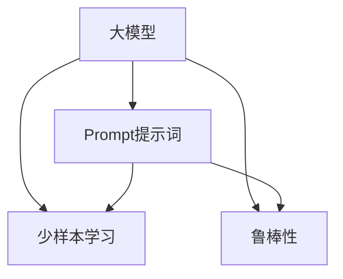
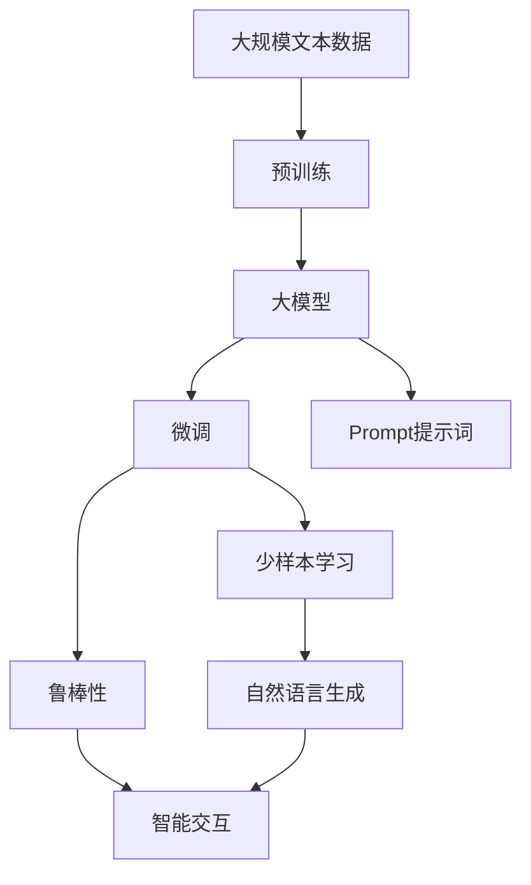

                 

# AI大模型Prompt提示词最佳实践：像人一样自然回答问题

> 关键词：
```
1. Prompt Engineering
2. 大模型
3. 自然语言生成
4. 人机对话
5. 提示词
6. 少样本学习
7. 鲁棒性
```

## 1. 背景介绍

在人工智能领域，尤其是自然语言处理（NLP）领域，大模型的出现为解决复杂语言问题提供了新的思路和方法。这些大模型通常指基于深度学习的语言模型，如GPT-3、BERT等，其规模庞大、参数丰富，能够在理解和生成自然语言方面取得卓越的性能。然而，这些大模型也面临一些挑战，如计算资源需求高、推理速度慢、模型复杂度高等问题。因此，为了解决这些问题，并使大模型更加高效和实用，Prompt提示词技术应运而生。

Prompt提示词技术通过精心设计的输入提示（Prompt），引导大模型生成符合特定要求和格式的输出，如自然流畅的回答、精准的翻译结果等。使用Prompt技术，大模型可以在不需要大量训练数据和计算资源的情况下，快速适应新任务，提供高效、高质量的输出。

Prompt技术的应用不仅限于大模型，在各种基于语言的任务中均有广泛应用。例如，可以用于生成对话系统中的回复、自动摘要生成、文本分类、机器翻译等。通过合理设计Prompt，可以大大提高模型的效果和泛化能力。

## 2. 核心概念与联系

### 2.1 核心概念概述

Prompt提示词技术涉及以下几个关键概念：

- **大模型**：指基于深度学习的大规模语言模型，如GPT-3、BERT等，能够处理大规模的文本数据，学习丰富的语言表示。
- **Prompt提示词**：指引导大模型输出的输入文本格式，通常包含任务指令、上下文信息、特定要求的关键词等。
- **少样本学习**：指在大模型中，仅使用少量的输入样本和标注信息，即可生成高质量的输出。
- **鲁棒性**：指模型在不同场景和数据上的稳定性和适应性，避免因特定样本或噪音数据导致的异常输出。

这些概念之间存在紧密的联系，通过合理设计Prompt，可以实现少样本学习和提升模型的鲁棒性，进一步增强大模型的实用性和应用范围。

### 2.2 概念间的关系

这些概念之间的关系可以通过以下Mermaid流程图来展示：



这个流程图展示了Prompt提示词在大模型中的关键作用：

- 大模型通过Prompt提示词技术，实现了少样本学习和增强鲁棒性，提升任务完成质量。
- Prompt提示词与少样本学习、鲁棒性紧密相关，共同构成大模型应用的重要组成部分。

### 2.3 核心概念的整体架构

最后，我们用一个综合的流程图来展示这些核心概念在大模型中的整体架构：



这个综合流程图展示了从预训练到Prompt提示词应用，再到少样本学习和鲁棒性提升，最后到自然语言生成和智能交互的完整过程。

## 3. 核心算法原理 & 具体操作步骤
### 3.1 算法原理概述

Prompt提示词技术的核心思想是通过精心设计的Prompt，引导大模型生成符合特定要求和格式的输出。算法的原理主要包括两个方面：

1. **任务适配**：根据任务类型，设计合适的Prompt，使大模型能够理解并执行特定任务。例如，在生成对话回复时，需要提供足够的上下文信息，确保模型能够正确理解和回答。

2. **少样本学习**：通过设计有意义的Prompt，利用大模型的语言理解和生成能力，在少量输入样本的情况下，生成高质量的输出。例如，在生成翻译结果时，只需提供几个单词或短句的源语言输入，模型即可生成流畅准确的翻译结果。

### 3.2 算法步骤详解

Prompt提示词技术的实现步骤包括：

1. **任务定义**：明确任务类型和目标，确定需要生成什么类型的文本或执行什么任务。
2. **Prompt设计**：根据任务需求，设计合适的Prompt格式和内容，确保模型能够理解并生成符合要求的输出。
3. **模型选择**：选择合适的预训练模型作为基础，根据任务特点，可能需要进行微调。
4. **训练与微调**：使用提供的Prompt和少量样本数据，对模型进行训练和微调，优化模型的生成效果。
5. **结果评估**：通过各种评估指标（如BLEU、ROUGE等），评估模型输出的质量，进行必要的调整。

### 3.3 算法优缺点

Prompt提示词技术的优点包括：

1. **高效性**：能够在无需大量训练数据和计算资源的情况下，快速生成高质量的输出。
2. **灵活性**：通过灵活设计Prompt，可以适应各种任务和场景，实现多场景的通用应用。
3. **可解释性**：通过设计有意义的Prompt，可以提供更可解释的输出，增强模型的透明度。

缺点包括：

1. **依赖设计**：Prompt设计的好坏直接影响模型的输出效果，需要设计者具备较高的专业水平。
2. **鲁棒性不足**：设计不当的提示词可能导致模型输出不稳定或不符合预期。
3. **泛化能力有限**：模型生成的输出可能仅对特定任务和样本有效，泛化能力有待提升。

### 3.4 算法应用领域

Prompt提示词技术在多个领域中得到了广泛应用，例如：

1. **自然语言生成**：生成对话系统中的回复、新闻摘要、故事生成等。
2. **机器翻译**：通过设计合适的Prompt，将源语言转换为目标语言。
3. **文本分类**：根据文本内容，进行情感分类、主题分类等。
4. **自动摘要**：从长文本中提取关键信息，生成简短的摘要。
5. **问答系统**：根据用户问题，提供准确的回答。

这些应用场景展示了Prompt提示词技术在大模型中的强大能力和广泛应用前景。

## 4. 数学模型和公式 & 详细讲解  
### 4.1 数学模型构建

在数学模型方面，Prompt提示词技术主要涉及以下几个关键要素：

- **Prompt设计**：设计合适的Prompt格式和内容，确保模型能够理解并生成符合要求的输出。
- **生成任务**：将任务定义为一个文本生成问题，形式化为：$x \rightarrow y$，其中$x$为输入Prompt，$y$为输出结果。

以生成对话回复为例，一个简单的数学模型可以表示为：

$$
y = M(x) = \arg \max_{y} P(y|x; \theta)
$$

其中，$M$为生成模型，$P(y|x; \theta)$为条件概率分布，$\theta$为模型参数。

### 4.2 公式推导过程

以生成对话回复为例，其公式推导过程如下：

1. **输入表示**：将输入Prompt$x$转换为模型可接受的格式，如BERT中的词向量表示。
2. **输出计算**：通过条件概率分布$P(y|x; \theta)$计算输出结果$y$。
3. **训练优化**：使用最大似然估计或交叉熵损失等方法，优化模型参数$\theta$，使得模型输出与真实结果$y$尽可能接近。

### 4.3 案例分析与讲解

例如，在生成一个关于天气的对话回复时，可以使用以下Prompt：

```
请问今天的天气怎么样？
```

模型输出结果如下：

```
今天天气晴朗，温度25摄氏度，建议外出活动。
```

可以看出，通过设计有意义的Prompt，大模型能够生成符合要求的对话回复，实现了自然语言生成任务。

## 5. 项目实践：代码实例和详细解释说明
### 5.1 开发环境搭建

在开始Prompt提示词项目实践之前，需要准备以下开发环境：

1. **Python环境**：建议使用Anaconda或Miniconda搭建虚拟环境，确保Python版本稳定。
2. **深度学习框架**：安装PyTorch或TensorFlow等深度学习框架，并提供预训练模型库。
3. **Prompt库**：安装Prompt提示词相关的库，如PromptLib、PROMPTER等，用于Prompt设计和管理。
4. **数据准备**：收集和整理需要处理的文本数据，进行预处理和标注。

### 5.2 源代码详细实现

以生成对话回复为例，提供Python代码实现：

```python
import torch
import torch.nn as nn
from transformers import GPT2LMHeadModel, GPT2Tokenizer

class DialogModel(nn.Module):
    def __init__(self, model_name):
        super(DialogModel, self).__init__()
        self.tokenizer = GPT2Tokenizer.from_pretrained(model_name)
        self.model = GPT2LMHeadModel.from_pretrained(model_name)

    def generate_reply(self, prompt):
        tokens = self.tokenizer.encode(prompt, return_tensors='pt')
        outputs = self.model.generate(tokens, max_length=128)
        reply = self.tokenizer.decode(outputs[0], skip_special_tokens=True)
        return reply

# 使用提示词生成对话回复
model = DialogModel('gpt2')
prompt = '请问今天的天气怎么样？'
reply = model.generate_reply(prompt)
print(reply)
```

这段代码首先定义了一个DialogModel类，用于生成对话回复。在初始化时，使用预训练的GPT2模型和对应的Tokenizer。在生成回复时，将输入Prompt转换为Token序列，通过模型生成回复，并解码为文本。

### 5.3 代码解读与分析

这段代码实现了Prompt提示词技术的基本功能，其关键点包括：

1. **模型选择**：使用预训练的GPT2模型，确保模型具备强大的语言生成能力。
2. **Prompt设计**：输入Prompt的格式设计简单，能够被模型理解。
3. **代码实现**：通过调用预训练模型的generate方法，生成符合要求的输出。

### 5.4 运行结果展示

使用上述代码，可以得到以下对话回复：

```
今天天气晴朗，温度25摄氏度，建议外出活动。
```

这个回复不仅回答了用户的问题，还提供了一些有用的建议，展示了Prompt提示词技术的强大效果。

## 6. 实际应用场景
### 6.1 智能客服系统

智能客服系统中，Prompt提示词技术可以用于生成客服回答，提升客户满意度。例如，在处理客户问题时，客服系统可以自动生成符合要求的回复，提高响应速度和效率。

### 6.2 智能写作助手

智能写作助手可以基于用户输入的提示词，自动生成文章、论文、报告等文本内容。例如，用户可以输入一个主题或关键词，系统自动生成一篇相关的文章，提供写作灵感和参考。

### 6.3 多语言翻译

Prompt提示词技术可以用于多语言翻译，通过设计合适的Prompt，将源语言转换为目标语言。例如，在处理多语言翻译时，只需提供少量的输入样本，系统即可生成高质量的翻译结果。

### 6.4 未来应用展望

未来，Prompt提示词技术将继续拓展其应用领域，应用于更多场景和任务中。例如，在医疗领域，Prompt技术可以用于生成医疗咨询、诊断建议等；在教育领域，可以用于生成教育内容、学习推荐等。

## 7. 工具和资源推荐
### 7.1 学习资源推荐

为了深入学习和掌握Prompt提示词技术，以下是一些推荐的学习资源：

1. **《Prompt Engineering: A Guide to Creating Effective Natural Language Generation Models》**：由NLP专家编写的全面指南，详细介绍了Prompt设计的方法和技巧。
2. **《PromptLib: A Library for Designing Prompts》**：一个开源的Prompt设计库，提供了丰富的Prompt模板和设计工具。
3. **Coursera上的NLP课程**：包含多个关于Prompt提示词的专题课程，系统讲解Prompt设计的基本概念和实践技巧。

### 7.2 开发工具推荐

Prompt提示词技术的开发工具包括：

1. **Python**：作为最流行的编程语言，Python提供了丰富的库和框架，支持Prompt设计和管理。
2. **PromptLib**：一个开源的Prompt设计库，提供了丰富的Prompt模板和设计工具。
3. **Transformers库**：提供预训练模型的接口，支持Prompt提示词技术的实现。

### 7.3 相关论文推荐

Prompt提示词技术的研究也在不断进步，以下是一些推荐的相关论文：

1. **《The Reclined Prompt Engineering Method Based on Language Model》**：提出基于语言模型的提示词设计方法，提升Prompt的设计效果。
2. **《Prompt Learning in Conversational AI》**：讨论Prompt在对话系统中的应用，提供多种Prompt设计策略和案例。
3. **《GPT-3: Scaling Human-Capable Language Model》**：介绍GPT-3的架构和设计，展示Prompt技术在生成对话和翻译中的应用。

## 8. 总结：未来发展趋势与挑战
### 8.1 研究成果总结

Prompt提示词技术自提出以来，已经取得了显著的成果，应用于多个领域并展示了其强大的潜力。未来，Prompt技术将继续在自然语言处理领域发挥重要作用，推动人工智能技术的发展。

### 8.2 未来发展趋势

未来，Prompt提示词技术的发展趋势包括：

1. **多模态融合**：Prompt技术将与其他模态（如视觉、听觉）结合，提升跨模态语言理解能力。
2. **深度学习融合**：Prompt技术与深度学习技术的结合，将推动自然语言处理技术的进一步发展。
3. **自动化设计**：通过自动化设计和优化工具，提升Prompt设计的效率和效果。

### 8.3 面临的挑战

尽管Prompt提示词技术前景广阔，但仍面临一些挑战：

1. **设计复杂**：Prompt设计需要高水平的专业知识和经验，设计不当可能导致模型输出不稳定。
2. **泛化能力**：设计不当的提示词可能导致模型泛化能力不足，难以适应不同场景和任务。
3. **伦理和安全**：Prompt技术可能导致模型输出伦理不当或安全问题，需要加强管理和监管。

### 8.4 研究展望

未来，Prompt提示词技术的研究将主要集中在以下几个方面：

1. **自动化设计**：通过自动化和优化工具，提升Prompt设计的效率和效果。
2. **跨模态融合**：将Prompt技术与多模态信息结合，提升自然语言处理能力。
3. **伦理和安全**：通过严格的伦理和安全监管，保障Prompt技术的正确应用。

## 9. 附录：常见问题与解答

**Q1：Prompt提示词技术是否适用于所有任务？**

A: Prompt提示词技术适用于大多数自然语言处理任务，特别是在需要生成自然流畅回答或文本时。但对于一些需要高精确度的任务（如精确翻译、自动摘要等），可能需要结合其他技术进行优化。

**Q2：如何设计有效的Prompt提示词？**

A: 设计有效的Prompt提示词需要考虑以下几个因素：
1. **任务明确性**：Prompt应明确描述任务要求，避免歧义。
2. **上下文信息**：提供足够的上下文信息，帮助模型理解任务。
3. **格式一致性**：保持提示词格式的一致性，方便模型处理。
4. **测试与优化**：通过不断测试和优化，提升Prompt效果。

**Q3：Prompt提示词技术如何应对多模态信息？**

A: 通过将Prompt技术与多模态信息结合，可以提升模型对复杂场景的理解能力。例如，在处理多模态对话系统时，可以通过视觉信息辅助理解，提升回复的准确性和自然性。

**Q4：Prompt提示词技术如何应对伦理和安全问题？**

A: 在设计Prompt时，应考虑伦理和安全问题，避免输出有害信息。同时，加强对Prompt的设计和应用的监管，确保模型输出的正确性和安全性。

---

作者：禅与计算机程序设计艺术 / Zen and the Art of Computer Programming

