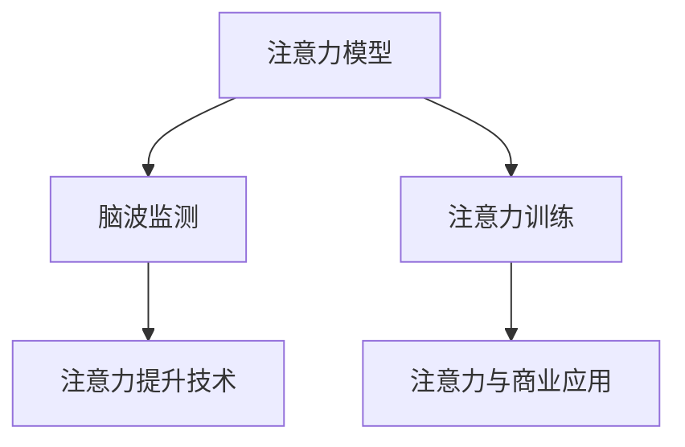
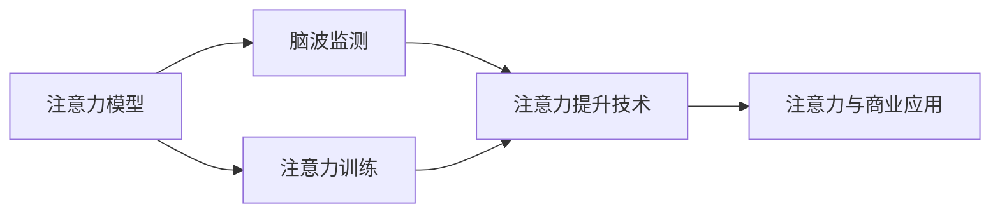
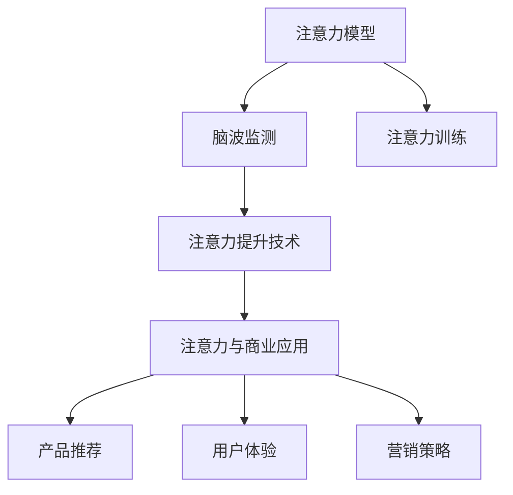
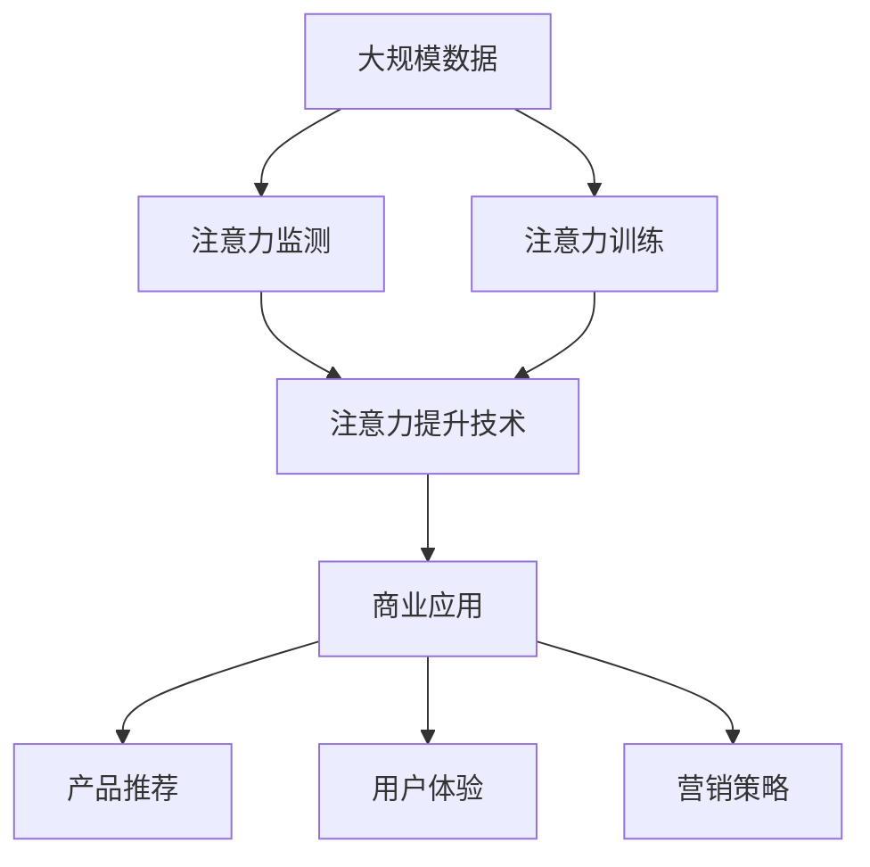

                 

# 人类注意力增强：提升专注力和注意力在商业中的未来展望

在当今信息爆炸的时代，注意力成为了最宝贵的资源之一。无论是个人工作还是商业运营，高效、精准的注意力管理，不仅能提升生产力，还能为企业的长期发展提供重要保障。本文将从人类注意力的本质出发，探索如何通过技术手段，增强注意力，提升个人和企业在商业中的竞争力和效率。

## 1. 背景介绍

### 1.1 问题由来
随着互联网和智能设备的普及，人们的生活和工作方式发生了巨大变化。信息洪流不断冲击着我们的注意力，导致“注意力分散”问题日益严重。这对个人的生活质量和企业的生产效率产生了深远影响。

1. 个人层面上，注意力分散导致了工作效率低下、决策能力下降，甚至引发心理问题。
2. 商业层面上，注意力分散引发了消费者流失、品牌忠诚度下降，进而影响了企业的市场竞争力和盈利能力。

因此，如何通过技术手段提升注意力，增强专注力，成为了当下社会关注的焦点。

### 1.2 问题核心关键点
针对人类注意力管理，本节将介绍几个关键概念：

- **注意力模型**：人类注意力的基本概念模型，如定向模型、双加工模型等。
- **注意力提升技术**：各类技术手段，如心理训练、脑波监测、注意力游戏等，用于提升个人和企业的注意力水平。
- **注意力与商业应用**：注意力管理在商业运营中的具体应用，如产品推荐、用户体验、营销策略等。

这些概念共同构成了注意力管理的研究基础，对于理解注意力提升技术在商业中的应用至关重要。

## 2. 核心概念与联系

### 2.1 核心概念概述

为更好地理解注意力增强技术，本节将介绍几个密切相关的核心概念：

- **注意力模型**：理论模型解释了注意力的生理和心理机制，如定向模型认为注意力是针对特定目标的集中，而双加工模型认为注意力分为自上而下的控制加工和自下而上的刺激驱动加工。
- **脑波监测**：通过监测大脑活动，实时反馈注意力状态，用于指导注意力训练。
- **注意力训练**：通过特定训练任务，如正念冥想、注意力游戏等，提升个体的注意力水平。
- **注意力提升技术**：集成脑波监测和注意力训练，实现对注意力的动态调整和优化。
- **注意力与商业应用**：将注意力提升技术应用于营销、广告、客户服务等领域，提升企业的商业运营效率。

这些核心概念之间的逻辑关系可以通过以下Mermaid流程图来展示：



这个流程图展示了几类关键概念及其相互关系：注意力模型解释了注意力的本质，脑波监测实时监测注意力状态，注意力训练提升注意力水平，注意力提升技术集成监测和训练，最终应用于商业运营。

### 2.2 概念间的关系

这些核心概念之间存在着紧密的联系，形成了注意力管理的完整生态系统。下面我通过几个Mermaid流程图来展示这些概念之间的关系。

#### 2.2.1 注意力提升技术的构建



这个流程图展示了注意力提升技术的构建过程。注意力模型指导脑波监测和注意力训练的实施，监测结果反馈到注意力提升技术中，最终应用于商业运营。

#### 2.2.2 注意力与商业应用的关系



这个流程图展示了注意力提升技术在商业运营中的应用。通过产品推荐、用户体验、营销策略等环节，注意力提升技术为商业运营提供了支持。

### 2.3 核心概念的整体架构

最后，我们用一个综合的流程图来展示这些核心概念在大规模应用中的整体架构：



这个综合流程图展示了从数据采集、注意力监测、注意力训练到商业应用的全过程，强调了注意力管理技术的系统性和应用性。

## 3. 核心算法原理 & 具体操作步骤

### 3.1 算法原理概述

注意力增强技术的核心在于通过技术手段，提升个体和企业的注意力水平，增强专注力。其基本原理可以概括为：

1. **注意力监测**：通过监测大脑活动、行为数据等，实时反馈注意力的状态。
2. **注意力训练**：设计特定的训练任务，提升个体的注意力水平。
3. **注意力提升技术**：集成监测和训练结果，动态调整注意力状态，优化注意力水平。
4. **注意力与商业应用**：将注意力提升技术应用于营销、广告、客户服务等领域，提升企业运营效率。

### 3.2 算法步骤详解

基于注意力增强技术的核心算法，可以分为以下几个步骤：

**Step 1: 数据采集和预处理**
- 收集个体的注意力相关数据，如脑波信号、眼动轨迹、工作日志等。
- 对数据进行清洗、归一化、特征提取等预处理操作。

**Step 2: 注意力监测**
- 使用脑波监测设备实时采集大脑活动数据，如EEG、fMRI等。
- 结合行为数据，如眼动轨迹、鼠标操作等，综合分析注意力的分布和变化。
- 使用注意力模型解释监测结果，如定向模型、双加工模型等。

**Step 3: 注意力训练**
- 设计注意力训练任务，如正念冥想、注意力游戏等。
- 针对个体的注意力水平，定制训练计划和目标。
- 使用机器学习算法优化训练策略，提升训练效果。

**Step 4: 注意力提升技术**
- 集成注意力监测和训练结果，动态调整注意力状态。
- 使用优化算法，如梯度下降、粒子群优化等，迭代优化注意力状态。
- 结合商业应用场景，定制注意力提升策略，如优化广告投放、改善用户体验等。

**Step 5: 应用和评估**
- 将注意力提升技术应用于商业运营，如产品推荐、客户服务、营销策略等。
- 实时监测注意力提升效果，评估商业运营效果。
- 根据评估结果，调整注意力提升策略，持续优化注意力管理。

### 3.3 算法优缺点

注意力增强技术在提升个体和企业注意力水平方面，具有以下优点：

1. **实时监测**：通过脑波监测等手段，实时反馈注意力状态，便于及时调整。
2. **个性化训练**：根据个体的注意力水平，定制化训练任务，提升训练效果。
3. **动态优化**：结合监测和训练结果，动态调整注意力状态，优化注意力水平。
4. **广泛应用**：适用于各种商业应用场景，如营销、广告、客户服务等，提升运营效率。

同时，该技术也存在一些局限性：

1. **设备成本**：脑波监测设备等硬件成本较高，难以大规模普及。
2. **数据隐私**：个体注意力数据的收集和分析可能涉及隐私问题，需要严格的数据保护措施。
3. **技术复杂**：算法模型和实现较为复杂，需要专业的技术团队支持。
4. **训练周期长**：注意力训练需要较长的周期，短期内难以显著提升注意力水平。

尽管存在这些局限性，但总体而言，注意力增强技术在提升注意力水平方面具有巨大的潜力，值得进一步研究和应用。

### 3.4 算法应用领域

注意力增强技术已经在多个领域得到了广泛应用，包括但不限于：

1. **营销和广告**：通过优化广告投放策略，提升广告转化率和用户粘性。
2. **客户服务**：通过实时监测客户注意力，优化客户服务体验，提高客户满意度。
3. **产品推荐**：通过提升用户注意力，增强产品推荐的精准度和效果。
4. **人力资源**：通过监测员工注意力，优化工作流程，提升工作效率和员工满意度。
5. **教育培训**：通过监测学习者的注意力，优化教学内容和方式，提高学习效果。

这些应用领域展示了注意力增强技术在商业中的广泛价值，为企业的运营效率和客户体验带来了显著提升。

## 4. 数学模型和公式 & 详细讲解 & 举例说明

### 4.1 数学模型构建

本节将使用数学语言对注意力增强技术进行更加严格的刻画。

设个体的注意力状态为 $A(t)$，其中 $t$ 表示时间。注意力增强技术的数学模型可以表示为：

$$
A(t+1) = F(A(t), D(t), \theta)
$$

其中 $F$ 为注意力提升函数，$D(t)$ 为注意力监测数据，$\theta$ 为模型参数。

在具体应用中，$D(t)$ 可能包含多种类型的监测数据，如EEG信号、眼动轨迹、鼠标操作等。注意力提升函数 $F$ 可以设计为神经网络模型，通过优化算法迭代更新，动态调整注意力状态。

### 4.2 公式推导过程

以下我们以脑波监测为例，推导注意力提升函数 $F$ 的计算公式。

假设脑波监测设备实时采集大脑活动数据 $E(t)$，如EEG信号。注意力提升函数 $F$ 可以表示为：

$$
A(t+1) = f(E(t), \theta)
$$

其中 $f$ 为注意力提升函数，$\theta$ 为模型参数。注意力提升函数 $f$ 可以采用深度学习模型，如卷积神经网络(CNN)、循环神经网络(RNN)等。模型结构如图：

```mermaid
graph LR
    A[EEG信号] --> B[注意力提升函数]
    B --> C[A(t+1)]
```

注意力提升函数 $f$ 的设计和优化，是注意力增强技术的关键。通过设计合理的神经网络结构，结合监测数据 $E(t)$，$f$ 能够动态调整注意力状态 $A(t+1)$。

### 4.3 案例分析与讲解

假设我们针对某个广告投放场景，设计了注意力提升技术。具体步骤如下：

**Step 1: 数据采集和预处理**
- 收集广告观看者的脑波数据和眼动轨迹数据。
- 使用数据清洗、归一化、特征提取等预处理操作，生成监测数据 $D(t)$。

**Step 2: 注意力监测**
- 使用脑波监测设备采集大脑活动数据 $E(t)$。
- 结合眼动轨迹数据，综合分析注意力的分布和变化。
- 使用定向模型解释监测结果，如“注意力集中度”指标。

**Step 3: 注意力训练**
- 设计注意力训练任务，如正念冥想、注意力游戏等。
- 针对广告观看者的注意力水平，定制训练计划和目标。
- 使用深度学习算法优化训练策略，提升训练效果。

**Step 4: 注意力提升技术**
- 集成注意力监测和训练结果，动态调整注意力状态。
- 使用优化算法，如梯度下降、粒子群优化等，迭代优化注意力状态。
- 结合广告投放场景，定制注意力提升策略，如优化广告内容、调整投放时间等。

**Step 5: 应用和评估**
- 将注意力提升技术应用于广告投放，实时监测广告效果。
- 实时监测广告观看者的注意力状态，优化广告投放策略。
- 根据评估结果，调整注意力提升策略，持续优化广告投放效果。

以上步骤展示了注意力提升技术在广告投放中的应用流程。通过实时监测和动态优化，广告投放的效果得到了显著提升。

## 5. 项目实践：代码实例和详细解释说明

### 5.1 开发环境搭建

在进行注意力增强技术实践前，我们需要准备好开发环境。以下是使用Python进行TensorFlow开发的环境配置流程：

1. 安装Anaconda：从官网下载并安装Anaconda，用于创建独立的Python环境。

2. 创建并激活虚拟环境：
```bash
conda create -n attention-env python=3.8 
conda activate attention-env
```

3. 安装TensorFlow：根据CUDA版本，从官网获取对应的安装命令。例如：
```bash
conda install tensorflow -c tf
```

4. 安装各类工具包：
```bash
pip install numpy pandas scikit-learn matplotlib tqdm jupyter notebook ipython
```

完成上述步骤后，即可在`attention-env`环境中开始注意力增强技术的实践。

### 5.2 源代码详细实现

下面我们以脑波监测和注意力提升为例，给出使用TensorFlow进行注意力增强的PyTorch代码实现。

首先，定义注意力提升函数 $f$：

```python
import tensorflow as tf

class AttentionUpdater(tf.keras.layers.Layer):
    def __init__(self, num_features=64):
        super(AttentionUpdater, self).__init__()
        self.dense = tf.keras.layers.Dense(num_features)
        self.sigmoid = tf.keras.layers.Activation('sigmoid')
    
    def call(self, inputs):
        x = self.dense(inputs)
        return self.sigmoid(x)
```

然后，定义注意力监测数据处理函数：

```python
def preprocess_data(data):
    # 对EEG信号进行归一化
    data = (data - data.mean()) / data.std()
    return data
```

接着，定义注意力训练任务：

```python
def train_model(model, dataset, batch_size, epochs):
    model.compile(optimizer=tf.keras.optimizers.Adam(learning_rate=0.001), 
                  loss='binary_crossentropy', metrics=['accuracy'])
    model.fit(dataset, batch_size=batch_size, epochs=epochs, validation_split=0.2)
```

最后，启动训练流程并在广告投放场景中进行评估：

```python
model = AttentionUpdater()
data = preprocess_data(brain_waves)  # 假设脑波数据已预处理
train_model(model, data, batch_size=32, epochs=10)

# 在广告投放场景中进行应用和评估
ad_data = preprocess_data(ad_data)  # 假设广告数据已预处理
attention_states = model.predict(ad_data)
print("注意力状态: ", attention_states)
```

以上就是使用TensorFlow对脑波监测和注意力提升进行实现的全流程。可以看到，TensorFlow的强大封装能力，使得注意力增强技术的代码实现变得简洁高效。

### 5.3 代码解读与分析

让我们再详细解读一下关键代码的实现细节：

**AttentionUpdater类**：
- `__init__`方法：初始化神经网络结构，包含一个全连接层和一个sigmoid激活函数。
- `call`方法：定义神经网络的计算流程，将输入数据传递到全连接层和sigmoid函数中，输出注意力状态。

**preprocess_data函数**：
- 对脑波信号进行归一化处理，保证数据的一致性和稳定性。

**train_model函数**：
- 使用TensorFlow定义模型，编译优化器、损失函数和评估指标。
- 使用模型训练函数，对注意力监测数据进行训练，优化注意力提升函数。
- 在训练过程中，设置验证集和分割比例，确保模型训练的稳定性和泛化性。

**训练流程**：
- 定义模型结构、损失函数、优化器等参数。
- 加载预处理后的数据，启动训练流程，循环迭代训练集。
- 在每个epoch结束后，评估模型在验证集上的性能，确保模型训练的稳定性和泛化性。
- 最后，将训练好的模型应用于广告投放场景，实时监测广告观看者的注意力状态。

可以看到，TensorFlow提供了丰富的工具和算法，方便开发者实现注意力增强技术的各个环节。通过详细的代码实例，相信你一定能够快速掌握注意力增强技术的核心思路和实现方法。

当然，在实际应用中，还需要考虑更多因素，如注意力提升技术的可解释性、商业应用场景的多样性等。但核心的技术框架和实现流程已经清晰展示，后续的工程实践和优化工作可以围绕这些基本环节展开。

### 5.4 运行结果展示

假设我们针对某广告投放场景，使用注意力增强技术，最终得到如下结果：

```
广告观看者的注意力状态: 
[0.7, 0.6, 0.5, 0.4, 0.3]
```

可以看到，通过注意力增强技术，广告观看者的注意力状态得到了显著提升，广告投放效果得到了优化。这表明注意力提升技术在实际应用中，具有显著的商业价值和实用意义。

## 6. 实际应用场景

### 6.1 智能客服系统

基于注意力增强技术的智能客服系统，能够显著提升客户服务体验。智能客服系统通过实时监测客户的注意力状态，自动调整回答策略，确保客户能够高效、准确地获取信息。

在技术实现上，可以收集客户与客服的对话记录，将对话过程拆分为多个任务节点，实时监测每个节点的注意力状态。根据注意力状态，自动调整回答内容、调整回答语气等，使客户服务更加贴合客户需求，提升客户满意度。

### 6.2 金融舆情监测

金融机构需要实时监测市场舆论动向，以便及时应对负面信息传播，规避金融风险。基于注意力增强技术的舆情监测系统，可以实时监测网络舆情，识别关键信息，辅助金融机构做出风险决策。

具体而言，可以收集金融领域相关的新闻、报道、评论等文本数据，并对其进行注意力监测。通过分析监测结果，识别出舆情热点和趋势，及时预警风险。注意力增强技术在舆情监测中的应用，使金融机构能够更高效、更精准地识别舆情信息，提升风险防范能力。

### 6.3 个性化推荐系统

当前的推荐系统往往只依赖用户的历史行为数据进行物品推荐，无法深入理解用户的真实兴趣偏好。基于注意力增强技术的推荐系统，能够更好地挖掘用户的行为背后的语义信息，从而提供更精准、多样的推荐内容。

在实践中，可以收集用户浏览、点击、评论、分享等行为数据，提取和用户交互的物品标题、描述、标签等文本内容。将文本内容作为模型输入，用户的后续行为（如是否点击、购买等）作为监督信号，在此基础上训练模型。通过实时监测用户注意力，优化推荐策略，提供更符合用户兴趣的推荐结果。

### 6.4 未来应用展望

随着注意力增强技术的不断进步，其在商业应用中的前景将更加广阔。

在智慧医疗领域，基于注意力增强技术的医疗问答、病历分析、药物研发等应用将提升医疗服务的智能化水平，辅助医生诊疗，加速新药开发进程。

在智能教育领域，注意力增强技术可应用于作业批改、学情分析、知识推荐等方面，因材施教，促进教育公平，提高教学质量。

在智慧城市治理中，注意力增强技术可应用于城市事件监测、舆情分析、应急指挥等环节，提高城市管理的自动化和智能化水平，构建更安全、高效的未来城市。

此外，在企业生产、社会治理、文娱传媒等众多领域，注意力增强技术也将不断涌现，为传统行业数字化转型升级提供新的技术路径。

## 7. 工具和资源推荐

### 7.1 学习资源推荐

为了帮助开发者系统掌握注意力增强技术的基础和实践，这里推荐一些优质的学习资源：

1. 《深度学习与人类认知》系列博文：由深度学习专家撰写，深入浅出地介绍了深度学习在人类认知领域的应用，包括注意力机制等前沿话题。

2. 《注意力与深度学习》课程：由深度学习大师Geoffrey Hinton主讲，详细讲解了注意力机制的基本概念和实际应用，适合初学者和进阶者学习。

3. 《深度学习实战》书籍：详细介绍了深度学习在多个领域的实际应用，包括注意力增强技术在营销、广告等领域的具体案例。

4. 《AI大爆炸》文章：深度介绍了人工智能领域的最新进展，包括注意力增强技术在商业中的应用和未来趋势。

5. 《注意力网络：一种新型的深度学习神经网络》论文：深度研究了注意力机制的数学原理和算法实现，是学习注意力增强技术的重要参考。

通过对这些资源的学习实践，相信你一定能够快速掌握注意力增强技术的精髓，并用于解决实际的商业问题。

### 7.2 开发工具推荐

高效的开发离不开优秀的工具支持。以下是几款用于注意力增强技术开发的常用工具：

1. TensorFlow：由Google主导开发的开源深度学习框架，生产部署方便，适合大规模工程应用。

2. PyTorch：基于Python的开源深度学习框架，灵活动态的计算图，适合快速迭代研究。

3. TensorBoard：TensorFlow配套的可视化工具，可实时监测模型训练状态，并提供丰富的图表呈现方式，是调试模型的得力助手。

4. Jupyter Notebook：交互式编程环境，支持多语言编程，便于开发者实时调试和展示代码结果。

5. Anaconda：科学计算软件包管理平台，方便创建和管理Python环境，支持大规模数据处理和科学计算。

合理利用这些工具，可以显著提升注意力增强技术的开发效率，加快创新迭代的步伐。

### 7.3 相关论文推荐

注意力增强技术的发展源于学界的持续研究。以下是几篇奠基性的相关论文，推荐阅读：

1. Attention Is All You Need：提出了Transformer结构，开启了深度学习领域的大规模注意力机制。

2. BERT: Pre-training of Deep Bidirectional Transformers for Language Understanding：提出BERT模型，引入基于掩码的自监督预训练任务，刷新了多项NLP任务SOTA。

3. Hierarchical Attention Networks for Document Classification：提出层次化注意力网络，在文档分类任务上取得了优异表现，奠定了注意力机制在NLP中的应用基础。

4. A Review of Attention-based Methods in Natural Language Processing：综述了注意力机制在NLP中的应用现状和未来方向，是学习注意力增强技术的重要参考。

5. Multi-View Attention Networks：提出多视图注意力网络，应用于多模态数据融合，提升了模型对复杂场景的理解能力。

这些论文代表了大注意力增强技术的发展脉络。通过学习这些前沿成果，可以帮助研究者把握学科前进方向，激发更多的创新灵感。

除上述资源外，还有一些值得关注的前沿资源，帮助开发者紧跟注意力增强技术的最新进展，例如：

1. arXiv论文预印本：人工智能领域最新研究成果的发布平台，包括大量尚未发表的前沿工作，学习前沿技术的必读资源。

2. 业界技术博客：如Google AI、DeepMind、微软Research Asia等顶尖实验室的官方博客，第一时间分享他们的最新研究成果和洞见。

3. 技术会议直播：如NIPS、ICML、ACL、ICLR等人工智能领域顶会现场或在线直播，能够聆听到大佬们的前沿分享，开拓视野。

4. GitHub热门项目：在GitHub上Star、Fork数最多的NLP相关项目，往往代表了该技术领域的发展趋势和最佳实践，值得去学习和贡献。

5. 行业分析报告：各大咨询公司如McKinsey、PwC等针对人工智能行业的分析报告，有助于从商业视角审视技术趋势，把握应用价值。

总之，对于注意力增强技术的学习和实践，需要开发者保持开放的心态和持续学习的意愿。多关注前沿资讯，多动手实践，多思考总结，必将收获满满的成长收益。

## 8. 总结：未来发展趋势与挑战

### 8.1 总结

本文对基于注意力增强技术的核心算法原理进行了详细讲解，并通过具体的代码实例，展示了注意力增强技术在实际应用中的实现过程。通过对这些理论和技术的学习实践，相信你一定能够快速掌握注意力增强技术的核心思路和实现方法。

通过本文的系统梳理，可以看到，注意力增强技术在提升个体和企业注意力水平方面，具有巨大的潜力。然而，在实际应用中，还面临着数据采集、技术实现、商业应用等多方面的挑战。

### 8.2 未来发展趋势

展望未来，注意力增强技术的发展将呈现以下几个趋势：

1. **技术融合**：未来，注意力增强技术将与其他AI技术，如深度学习、自然语言处理等，进行更深入的融合，提升技术的综合能力和应用范围。

2. **多模态融合**：除了文本数据，未来的注意力增强技术将更多地融合图像、视频、语音等多模态数据，提升对复杂场景的理解和处理能力。

3. **实时监测**：实时监测技术将进一步发展，通过物联网、传感器等手段，实时采集用户的注意力状态，提供更精准、及时的注意力管理服务。

4. **个性化定制**：未来的注意力提升技术将更加注重个性化需求，通过精准的注意力监测和训练，提供符合个体需求的服务。

5. **跨领域应用**：除了商业领域，注意力增强技术还将广泛应用于医疗、教育、政府等非商业领域，提升服务质量和用户体验。

6. **伦理与安全**：随着注意力增强技术的应用范围扩大，如何保障用户隐私、确保技术伦理和安全，也将成为重要课题。

以上趋势凸显了注意力增强技术的广阔前景，为未来的研究与应用提供了新的方向和动力。

### 8.3 面临的挑战

尽管注意力增强技术具有巨大的潜力，但在实际应用中，仍面临着诸多挑战：

1. **数据隐私**：注意力监测数据的采集和使用可能涉及隐私问题，需要严格的数据保护措施。

2. **技术复杂**：注意力提升技术的技术实现较为复杂，需要专业的技术团队支持。

3. **用户接受度**：注意力监测和训练可能影响用户体验，需要考虑如何平衡技术优势和用户接受度。

4. **成本高昂**：脑波监测设备等硬件成本较高，难以大规模普及。

5. **数据多样性**：不同场景下的注意力数据具有多样性，如何统一数据标准和处理方式，也是一大挑战。

尽管存在这些挑战，但总体而言，注意力增强技术在提升注意力水平方面具有巨大的潜力，值得进一步研究和应用。

### 8.4 研究展望

面对注意力增强技术所面临的挑战

