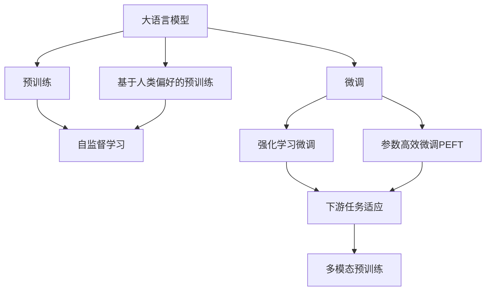
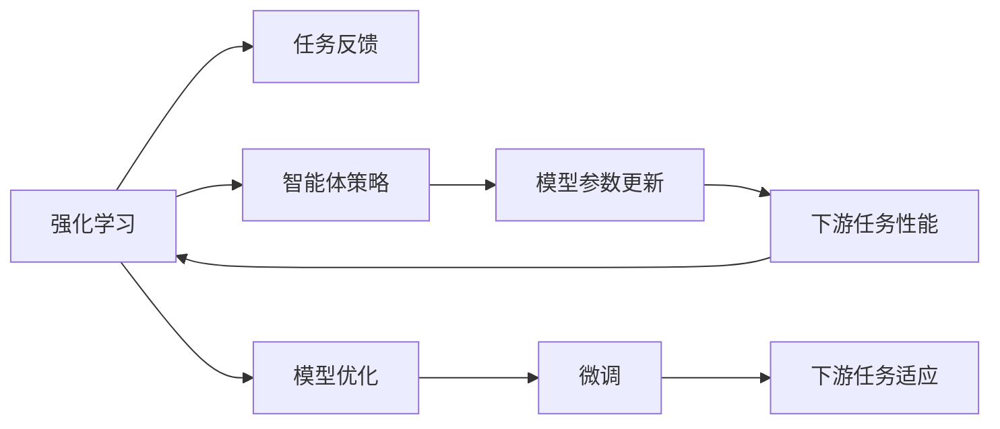
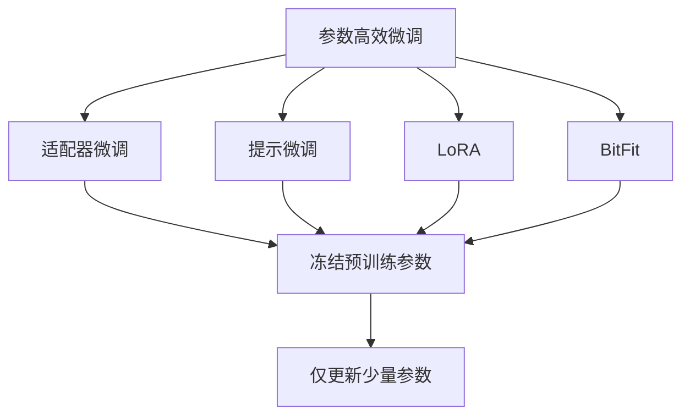
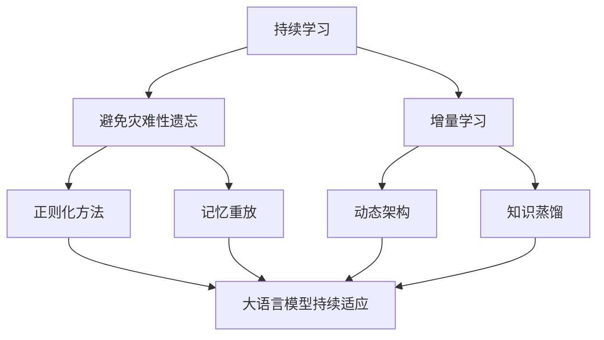
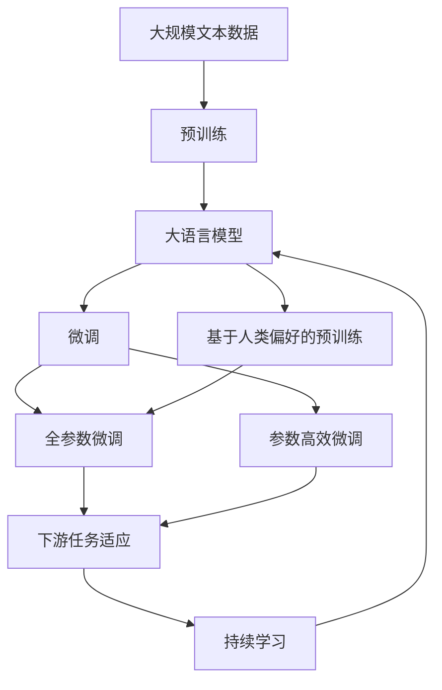

                 

# 大语言模型原理基础与前沿 基于强化学习的微调和基于人类偏好的预训练

> 关键词：大语言模型,强化学习微调,人类偏好预训练,自然语言处理(NLP),Transformer,BERT,预训练,下游任务,参数高效微调,自然语言处理(NLP)

## 1. 背景介绍

### 1.1 问题由来
近年来，深度学习技术在自然语言处理（NLP）领域取得了巨大的突破。其中，基于Transformer架构的预训练语言模型（如BERT、GPT系列）表现出色，能够自动学习大规模语言数据中的语义表示。这些大语言模型不仅在大规模无标签文本数据上进行预训练，还能通过微调在各种下游任务中表现优异。

然而，预训练模型的泛化能力有限，对于特定领域或小规模数据集，其效果往往不尽如人意。因此，研究者们提出了基于强化学习（Reinforcement Learning, RL）的微调方法和基于人类偏好的预训练策略，以期在大语言模型中融入更多人类知识，提升其泛化能力和适用性。

### 1.2 问题核心关键点
强化学习和人类偏好在大语言模型中的应用，主要关注两个核心问题：

1. **基于强化学习的微调（RL-based Fine-tuning）**：利用强化学习框架训练微调后的模型，使其在特定下游任务上表现更好。这要求模型能够从任务反馈中学习并优化自己的决策策略。

2. **基于人类偏好的预训练（Pre-training with Human Preferences）**：在预训练阶段，通过引入人类偏好标签（如质量、真实性、有用性等），训练模型学习符合人类价值观的语言表示。这使得模型在预训练和微调过程中，能更好地契合实际应用场景和用户需求。

这些方法在大语言模型中的应用，不仅提升了模型的性能，也提高了其在实际应用中的可解释性和安全性。

### 1.3 问题研究意义
基于强化学习和人类偏好的预训练技术，对于拓展大语言模型的应用范围，提升下游任务的性能，加速NLP技术的产业化进程，具有重要意义：

1. 降低应用开发成本：基于大模型微调的方法可以减少从头开发所需的数据、计算和人力等成本投入。
2. 提升模型效果：微调使得通用大模型更好地适应特定任务，在应用场景中取得更优表现。
3. 加速开发进度：standing on the shoulders of giants，微调使得开发者可以更快地完成任务适配，缩短开发周期。
4. 带来技术创新：微调范式促进了对预训练-微调的深入研究，催生了更多前沿研究方向，如智能体设计、学习策略优化等。
5. 赋能产业升级：微调使得NLP技术更容易被各行各业所采用，为传统行业数字化转型升级提供新的技术路径。

## 2. 核心概念与联系

### 2.1 核心概念概述

为更好地理解基于强化学习和人类偏好的预训练方法，本节将介绍几个密切相关的核心概念：

- **大语言模型(Large Language Model, LLM)**：以自回归(如GPT)或自编码(如BERT)模型为代表的大规模预训练语言模型。通过在大规模无标签文本语料上进行预训练，学习通用的语言知识和表示。

- **预训练(Pre-training)**：指在大规模无标签文本语料上，通过自监督学习任务训练通用语言模型的过程。常见的预训练任务包括言语建模、掩码语言模型等。预训练使得模型学习到语言的通用表示。

- **强化学习（Reinforcement Learning, RL）**：一种基于智能体（Agent）与环境（Environment）互动的学习范式，智能体通过不断试错，逐步学习最优策略以最大化累积奖励。

- **微调(Fine-tuning)**：指在预训练模型的基础上，使用下游任务的少量标注数据，通过有监督学习优化模型在该任务上的性能。通常只需要调整顶层分类器或解码器，并以较小的学习率更新全部或部分的模型参数。

- **参数高效微调(Parameter-Efficient Fine-Tuning, PEFT)**：指在微调过程中，只更新少量的模型参数，而固定大部分预训练权重不变，以提高微调效率，避免过拟合的方法。

- **基于人类偏好的预训练**：在预训练阶段，通过引入人类偏好标签（如质量、真实性、有用性等），训练模型学习符合人类价值观的语言表示。这使得模型在预训练和微调过程中，能更好地契合实际应用场景和用户需求。

- **多模态预训练**：在预训练阶段，结合视觉、语音等多模态数据，训练模型学习多模态信息，提升模型的泛化能力和理解深度。

这些核心概念之间的逻辑关系可以通过以下Mermaid流程图来展示：

这个流程图展示了大语言模型的核心概念及其之间的关系：

1. 大语言模型通过预训练获得基础能力。
2. 微调是对预训练模型进行任务特定的优化，可以分为全参数微调和参数高效微调（PEFT）。
3. 强化学习微调利用任务反馈指导模型优化策略。
4. 基于人类偏好的预训练在预训练阶段融入更多人类知识。
5. 多模态预训练扩展模型对多模态数据的处理能力。
6. 这些概念共同构成了大语言模型的学习和应用框架，使其能够在各种场景下发挥强大的语言理解和生成能力。

通过理解这些核心概念，我们可以更好地把握大语言模型的工作原理和优化方向。

### 2.2 概念间的关系

这些核心概念之间存在着紧密的联系，形成了大语言模型的完整生态系统。下面我通过几个Mermaid流程图来展示这些概念之间的关系。

#### 2.2.1 大语言模型的学习范式

这个流程图展示了大语言模型的三种主要学习范式：预训练、微调和基于人类偏好的预训练。预训练主要采用自监督学习方法，而微调则是有监督学习的过程。基于人类偏好的预训练通过在预训练阶段引入人类偏好标签，训练模型学习符合人类价值观的语言表示。

#### 2.2.2 强化学习与微调的关系

这个流程图展示了强化学习与微调的基本关系。强化学习利用任务反馈指导智能体优化策略，并通过模型参数更新实现策略优化。微调通过有监督学习优化模型在特定任务上的性能，可以在保持预训练权重的基础上，只更新少数参数。

#### 2.2.3 参数高效微调方法

这个流程图展示了几种常见的参数高效微调方法，包括适配器微调、提示微调、LoRA和BitFit。这些方法的共同特点是冻结大部分预训练参数，只更新少量参数，从而提高微调效率，避免过拟合。

#### 2.2.4 持续学习在大语言模型中的应用

这个流程图展示了持续学习在大语言模型中的应用。持续学习的主要目标是避免灾难性遗忘和实现增量学习。通过正则化方法、记忆重放、动态架构和知识蒸馏等技术，可以使大语言模型持续适应新的任务和数据。

### 2.3 核心概念的整体架构

最后，我们用一个综合的流程图来展示这些核心概念在大语言模型微调过程中的整体架构：

这个综合流程图展示了从预训练到微调，再到基于人类偏好的预训练，以及持续学习的完整过程。大语言模型首先在大规模文本数据上进行预训练，然后通过微调和基于人类偏好的预训练，适应下游任务和融入更多人类知识。最后，通过持续学习技术，模型可以不断更新和适应新的任务和数据。 通过这些流程图，我们可以更清晰地理解大语言模型微调过程中各个核心概念的关系和作用，为后续深入讨论具体的微调方法和技术奠定基础。

## 3. 核心算法原理 & 具体操作步骤
### 3.1 算法原理概述

基于强化学习的大语言模型微调，本质上是一个智能体与环境互动的学习过程。其核心思想是：将预训练的大语言模型视作一个智能体，通过与环境（即下游任务）互动，学习最优的决策策略，以最大化在特定任务上的表现。

形式化地，假设预训练模型为 $M_{\theta}$，其中 $\theta$ 为预训练得到的模型参数。给定下游任务 $T$ 的标注数据集 $D=\{(x_i, y_i)\}_{i=1}^N$，微调的目标是找到新的模型参数 $\hat{\theta}$，使得：

$$
\hat{\theta}=\mathop{\arg\min}_{\theta} \mathcal{L}(M_{\theta},D)
$$

其中 $\mathcal{L}$ 为针对任务 $T$ 设计的损失函数，用于衡量模型预测输出与真实标签之间的差异。常见的损失函数包括交叉熵损失、均方误差损失等。

强化学习的目标是最大化累积奖励，即在每次与环境互动（即一次前向传播）中，通过最大化任务损失函数 $\mathcal{L}$ 来提高模型性能。具体而言，假设智能体在每个时间步 $t$ 的决策策略为 $a_t$，环境提供的状态反馈为 $s_t$，则智能体的决策过程可以表示为：

$$
\max_{a_t} \sum_{t=1}^T \gamma^t \mathcal{L}(M_{\theta},(x_i,y_i)) 
$$

其中 $\gamma$ 为折扣因子，控制未来奖励的重要性。智能体的策略 $a_t$ 可以通过价值函数 $Q(s_t,a_t)$ 和策略函数 $π(s_t,a_t)$ 来表示。常用的强化学习算法包括Q-learning、SARSA、深度Q网络（DQN）等。

### 3.2 算法步骤详解

基于强化学习的大语言模型微调一般包括以下几个关键步骤：

**Step 1: 准备预训练模型和数据集**
- 选择合适的预训练语言模型 $M_{\theta}$ 作为初始化参数，如 BERT、GPT 等。
- 准备下游任务 $T$ 的标注数据集 $D$，划分为训练集、验证集和测试集。一般要求标注数据与预训练数据的分布不要差异过大。

**Step 2: 设计智能体和环境**
- 定义智能体的策略函数 $π(s_t,a_t)$，指定智能体在每个时间步的决策策略。例如，在微调过程中，智能体的策略可以是输出一个随机分类器，或在训练集上获得最高分类精度的分类器。
- 设计环境（即下游任务）的状态空间 $S$ 和动作空间 $A$。对于分类任务，状态空间可以是输入文本及其长度，动作空间可以是所有可能的标签。对于生成任务，状态空间可以是输入文本及其长度，动作空间可以是所有可能的词汇表。

**Step 3: 设置微调超参数**
- 选择合适的优化算法及其参数，如 AdamW、SGD 等，设置学习率、批大小、迭代轮数等。
- 设置正则化技术及强度，包括权重衰减、Dropout、Early Stopping等。
- 确定冻结预训练参数的策略，如仅微调顶层，或全部参数都参与微调。

**Step 4: 执行强化学习训练**
- 初始化智能体和环境，设定初始策略和状态。
- 在每个时间步 $t$，智能体根据当前状态 $s_t$ 选择动作 $a_t$，环境根据动作 $a_t$ 和智能体当前状态 $s_t$ 生成下一个状态 $s_{t+1}$ 和奖励 $r_{t+1}$。
- 根据新的状态 $s_{t+1}$ 和奖励 $r_{t+1}$ 更新智能体的状态值 $Q(s_t,a_t)$ 和策略函数 $π(s_t,a_t)$。
- 重复上述步骤直到满足预设的迭代轮数或 Early Stopping 条件。

**Step 5: 测试和部署**
- 在测试集上评估微调后模型 $M_{\hat{\theta}}$ 的性能，对比微调前后的精度提升。
- 使用微调后的模型对新样本进行推理预测，集成到实际的应用系统中。
- 持续收集新的数据，定期重新微调模型，以适应数据分布的变化。

以上是基于强化学习微调大语言模型的一般流程。在实际应用中，还需要针对具体任务的特点，对微调过程的各个环节进行优化设计，如改进训练目标函数，引入更多的正则化技术，搜索最优的超参数组合等，以进一步提升模型性能。

### 3.3 算法优缺点

基于强化学习的大语言模型微调方法具有以下优点：
1. 智能体可以自动从环境中学习最优决策策略，适应复杂多变的下游任务。
2. 智能体可以在不断与环境互动中逐步优化策略，提高模型性能。
3. 智能体可以融合多模态信息，提升模型在多模态任务上的泛化能力。
4. 智能体可以学习人类偏好，提升模型的可解释性和安全性。

同时，该方法也存在一定的局限性：
1. 强化学习过程可能会陷入局部最优，难以找到全局最优策略。
2. 智能体策略的设计和调整需要人工干预，可能导致策略过拟合。
3. 智能体的决策过程缺乏可解释性，难以理解其内部工作机制。
4. 强化学习训练通常需要大量计算资源和时间，训练成本较高。

尽管存在这些局限性，但就目前而言，基于强化学习的微调方法仍是大语言模型应用的重要范式。未来相关研究的重点在于如何进一步优化智能体策略设计，降低训练成本，提高决策过程的可解释性。

### 3.4 算法应用领域

基于强化学习和人类偏好的预训练方法，已经在NLP领域得到了广泛的应用，覆盖了几乎所有常见任务，例如：

- 文本分类：如情感分析、主题分类、意图识别等。通过微调使模型学习文本-标签映射。
- 命名实体识别：识别文本中的人名、地名、机构名等特定实体。通过微调使模型掌握实体边界和类型。
- 关系抽取：从文本中抽取实体之间的语义关系。通过微调使模型学习实体-关系三元组。
- 问答系统：对自然语言问题给出答案。将问题-答案对作为微调数据，训练模型学习匹配答案。
- 机器翻译：将源语言文本翻译成目标语言。通过微调使模型学习语言-语言映射。
- 文本摘要：将长文本压缩成简短摘要。将文章-摘要对作为微调数据，使模型学习抓取要点。
- 对话系统：使机器能够与人自然对话。将多轮对话历史作为上下文，微调模型进行回复生成。

除了上述这些经典任务外，基于强化学习和人类偏好的预训练方法也被创新性地应用到更多场景中，如可控文本生成、常识推理、代码生成、数据增强等，为NLP技术带来了全新的突破。

## 4. 数学模型和公式 & 详细讲解  
### 4.1 数学模型构建

本节将使用数学语言对基于强化学习的大语言模型微调过程进行更加严格的刻画。

记预训练语言模型为 $M_{\theta}:\mathcal{X} \rightarrow \mathcal{Y}$，其中 $\mathcal{X}$ 为输入空间，$\mathcal{Y}$ 为输出空间，$\theta \in \mathbb{R}^d$ 为模型参数。假设微调任务的训练集为 $D=\{(x_i,y_i)\}_{i=1}^N, x_i \in \mathcal{X}, y_i \in \mathcal{Y}$。

定义模型 $M_{\theta}$ 在输入 $x$ 上的损失函数为 $\ell(M_{\theta}(x),y)$，则在数据集 $D$ 上的经验风险为：

$$
\mathcal{L}(\theta) = \frac{1}{N} \sum_{i=1}^N \ell(M_{\theta}(x_i),y_i)
$$

强化学习的目标是最大化累积奖励，即在每个时间步 $t$ 上，智能体通过动作 $a_t$ 最大化任务损失函数 $\mathcal{L}(M_{\theta},(x_i,y_i))$，从而获得奖励。假设智能体在每个时间步 $t$ 的决策策略为 $π(a_t|s_t)$，则智能体的目标函数可以表示为：

$$
\max_{π} \mathbb{E}_{s_t,a_t}[\sum_{t=1}^T \gamma^t \mathcal{L}(M_{\theta},(x_i,y_i))]
$$

其中 $\gamma$ 为折扣因子，控制未来奖励的重要性。在实际应用中，智能体的策略 $π(a_t|s_t)$ 可以通过神经网络、SVM等模型进行表示。

### 4.2 公式推导过程

以下我们以二分类任务为例，推导强化学习微调的数学模型和算法步骤。

假设智能体在每个时间步 $t$ 的决策策略为输出一个随机分类器，其参数为 $\theta_t$。智能体在每个时间步 $t$ 的决策为 $a_t=\theta_t(x_i)$，其中 $x_i$ 为输入文本。智能体的策略函数 $π(a_t|s_t)$ 可以通过神经网络模型进行表示。

定义智能体在每个时间步 $t$ 的累积奖励为 $G_t=\sum_{i=1}^t \gamma^i r_i$，其中 $r_i$ 为智能体在每个时间步 $t$ 上的奖励，即任务损失函数 $\mathcal{L}(M_{\theta},(x_i,y_i))$。智能体的目标函数可以表示为：

$$
\max_{π} \mathbb{E}_{s_t,a_t}[\sum_{t=1}^T \gamma^t \mathcal{L}(M_{\theta},(x_i,y_i))]
$$

为了求解上述目标函数，我们引入Q值函数 $Q(s_t,a_t)$，表示在状态 $s_t$ 下，智能体选择动作 $a_t$ 的累积奖励。Q值函数可以通过经验风险 $\mathcal{L}(M_{\theta},(x_i,y_i))$ 和策略函数 $π(a_t|s_t)$ 进行迭代更新。在每个时间步 $t$，智能体的决策策略 $π(a_t|s_t)$ 可以表示为：

$$
π(a_t|s_t) = \frac{\exp(Q(s_t,a_t))}{\sum_{a_t} \exp(Q(s_t,a_t))}
$$

智能体的Q值函数 $Q(s_t,a_t)$ 可以通过强化学习算法（如Q-learning、DQN）进行迭代更新。在每个时间步 $t$，智能体的Q值函数更新规则为：

$$
Q(s_t,a_t) \leftarrow Q(s_t,a_t) + α[\mathcal{L}(M_{\theta},(x_i,y_i)) + \gamma \max_{a_{t+1}} Q(s_{t+1},a_{t+1}) - Q(s_t,a_t)]
$$

其中 $α$ 为学习率。在实际应用中，Q值函数可以通过神经网络模型进行表示，并通过反向传播算法进行优化。

### 4.3 案例分析与讲解

为了更好地理解强化学习微调的方法，下面以基于强化学习的情感分析模型为例，进行详细的案例分析与讲解。

假设我们有一个情感分析任务，目标是判断文本情感是正面的还是负面的。训练集包含情感标签为正面的文本 $X_{pos}$ 和情感标签为负面的文本 $X_{neg}$。我们可以将训练集中的文本作为智能体的状态空间 $S$，将文本情感标签作为智能体的动作空间 $A$。智能体的决策策略 $π(a_t|s_t)$ 可以表示为：

$$
π(a_t|s_t) = \frac{\exp(Q(s_t,a_t))}{\sum_{a_t} \exp(Q(s_t,a_t))}
$$

在每个时间步 $t$，智能体的决策策略 $π(a_t|s_t)$ 可以根据当前状态 $s_t$ 和动作 $a_t$ 的Q值函数 $Q(s_t,a_t)$ 进行计算。智能体的Q值函数 $Q(s_t,a_t)$ 可以通过神经网络模型进行表示，并通过反向传播算法进行优化。智能体的目标函数可以表示为：

$$
\max_{π} \mathbb{E}_{s_t,a_t}[\sum_{t=1}^T \gamma^t \mathcal{L}(M_{\theta},(x_i,y_i))]
$$

为了求解上述目标函数，我们可以使用DQN算法，对智能体的Q值函数进行迭代更新。DQN算法的基本步骤如下：

1. 初始化智能体和环境，设定初始策略和状态。
2. 在每个时间步 $t$，智能体根据当前状态 $s_t$ 选择动作 $a_t$，环境根据动作 $a_t$ 和智能体当前状态 $s_t$ 生成下一个状态 $s_{t+1}$ 和奖励 $r_{t+1}$。
3. 根据新的状态 $s_{t+1}$ 和奖励 $r_{t+1}$ 更新智能体的状态值 $Q(s_t,a_t)$ 和策略函数 $π(s_t,a_t)$。
4. 重复上述步骤直到满足预设的迭代轮数或 Early Stopping 条件。

假设我们使用BERT作为预训练语言模型，对其进行情感分析任务的微调。我们首先将文本输入BERT模型，得到其输出表示。然后，我们将输出表示作为智能体的状态空间 $S$，将文本情感标签作为智能体的动作空间 $A$。智能体的策略函数 $π(a_t|s_t)$ 可以通过神经网络模型进行表示。在每个时间步 $t$，智能体的决策策略 $π(a_t|s_t)$ 可以根据当前状态 $s_t$ 和动作 $a_t$ 的Q值函数 $Q(s_t,a_t)$ 进行计算。智能体的Q值函数 $Q(s_t,a_t)$ 可以通过神经网络模型进行表示，并通过反向传播算法进行优化。智能体的目标函数可以表示为：

$$
\max_{π} \mathbb{E}_{s_t,a_t}[\sum_{t=1}^T \gamma^t \mathcal{L}(M_{\theta},(x_i,y_i))]
$$

为了求解上述目标函数，我们可以使用DQN算法，对智能体的Q值函数进行迭代更新。DQN算法的基本步骤如下：

1. 初始化智能体和环境，设定初始策略和状态。
2. 在每个时间步 $t$，智能体根据当前状态 $s_t$ 选择动作 $a_t$，环境根据动作 $a_t$ 和智能体当前状态 $s_t$ 生成下一个状态 $s_{t+1}$ 和奖励 $r_{t+1}$。
3. 根据新的状态 $s_{t+1}$ 和奖励 $r_{t+1}$ 更新智能体的状态值 $Q(s_t,a_t)$ 和策略函数 $π(s_t,a_t)$。
4. 重复上述步骤直到满足预设的迭代轮数或 Early Stopping 条件。

在实际应用中，我们通常会使用PyTorch或TensorFlow等深度学习框架来实现上述算法。在模型训练过程中，我们还需要选择合适的优化算法（如AdamW、SGD等）及其参数，设置学习率、批大小、迭代轮数等超参数，以确保模型训练的稳定性和收敛性。

## 5. 项目实践：代码实例和详细解释说明
### 5.1 开发环境搭建

在进行微调实践前，我们需要准备好开发环境。以下是使用Python进行

