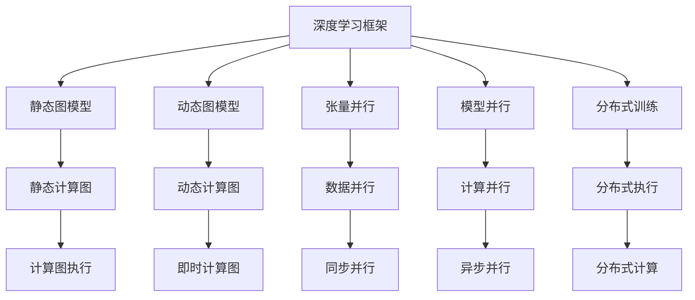
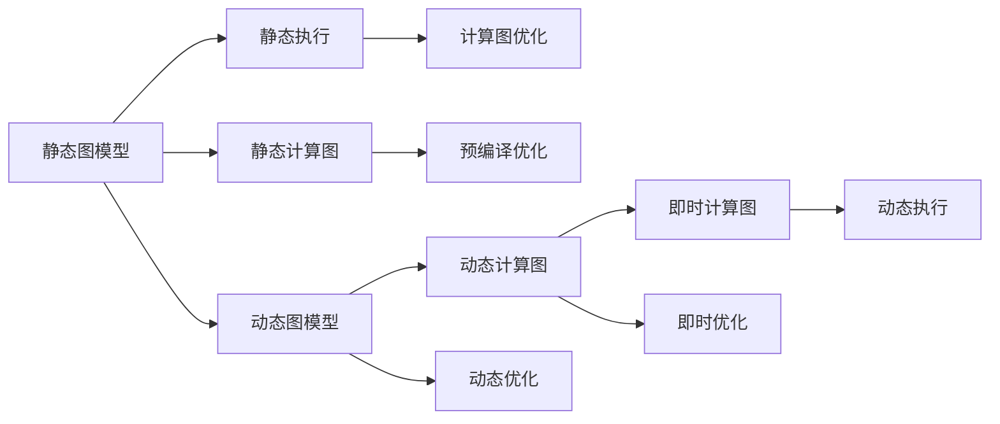
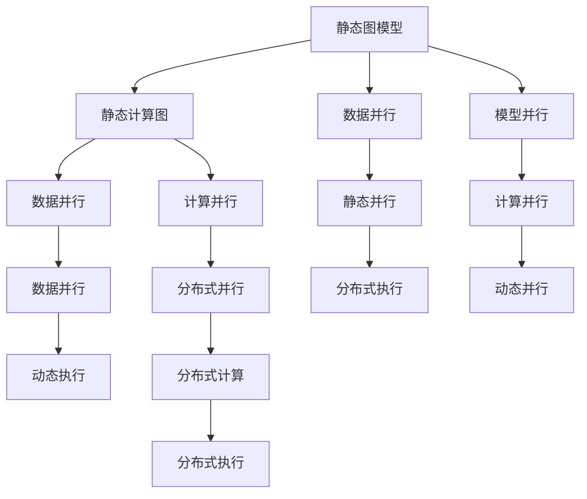
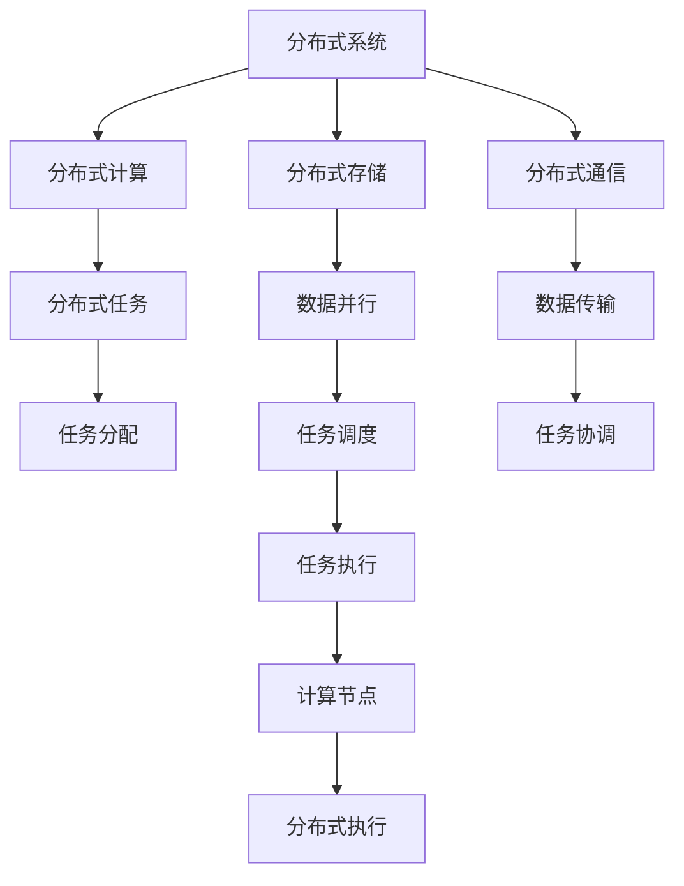
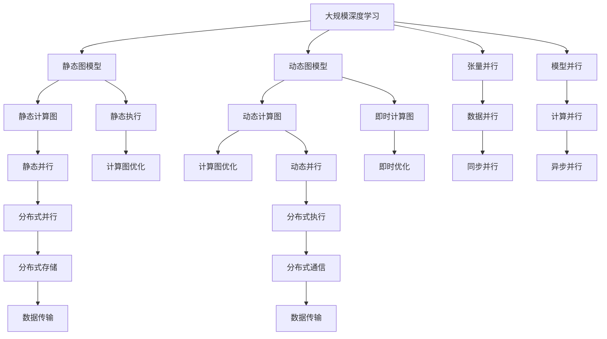

                 

# 大语言模型原理基础与前沿 张量/模型并行

> 关键词：大语言模型,张量并行,模型并行,深度学习,高性能计算,分布式系统,计算机视觉

## 1. 背景介绍

### 1.1 问题由来

在深度学习的迅猛发展过程中，大语言模型（Large Language Model, LLM）因其卓越的语言理解能力和泛化能力而引人注目。大模型如GPT-3、BERT等，通过大规模无标签文本数据的自监督预训练和迁移学习的策略，已在自然语言处理（NLP）领域取得了突破性进展。然而，模型规模的不断扩大，带来了计算资源和存储成本的急剧增加，使得模型的训练和推理成为一种计算密集型的任务。

为应对这一挑战，计算并行化成为了一个重要研究方向。这不仅涉及到算力资源的分配和利用，还关系到模型的结构优化、分布式系统设计、算法优化等多个方面。本节将详细探讨大语言模型并行化，尤其是张量并行和模型并行技术的基础知识及其发展现状，并为后续的具体实践和技术讨论提供背景。

### 1.2 问题核心关键点

为了更好地理解大语言模型并行化，本节将介绍以下几个关键点：

1. **张量并行**：指在深度学习中，将大规模矩阵或张量数据拆分为多个子张量，分别在不同的处理器或设备上并行计算。这是深度学习中常用的数据并行方式。

2. **模型并行**：指将深度学习模型的不同层次分布到多个处理器或设备上，以提高计算效率。这是深度学习中常用的计算并行方式。

3. **分布式训练**：指将大规模模型的不同部分分布到多个计算节点上进行训练，以加速模型训练过程。

4. **动态图与静态图**：深度学习框架中，静态图模型（如TensorFlow）和动态图模型（如PyTorch）在计算图和计算执行方式上的差异。

5. **张量库（如TensorFlow、PyTorch）**：在深度学习中，用于描述和执行计算图的高效数据结构。

这些核心概念之间的关系可以通过以下Mermaid流程图来展示：



这个流程图展示了深度学习中的主要概念及其关系：

- 深度学习框架（A）是封装和统一各种深度学习算法的软件工具。
- 静态图模型（B）和动态图模型（C）是深度学习框架中两种常用的计算图形式。
- 张量并行（D）和模型并行（E）是深度学习中常用的两种并行方式。
- 分布式训练（F）是在多个节点上进行模型训练的策略。
- 静态图（G）和动态图（H）在计算图和执行方式上有所差异。

这些概念构成了深度学习和模型并行化的基础，通过理解这些核心概念，可以为后续的深度学习模型的并行化实践和技术讨论奠定基础。

## 2. 核心概念与联系

### 2.1 核心概念概述

为更好地理解张量并行和模型并行技术，本节将介绍几个关键概念：

- **张量（Tensor）**：指多维数组，是深度学习中最基本的数据结构。张量并行通过将大规模张量数据拆分为多个子张量，分别在不同的处理器或设备上并行计算。

- **矩阵乘法（Matrix Multiplication）**：深度学习中常用的计算操作之一，通过矩阵乘法可以实现快速计算大规模张量的乘法操作，从而加速模型训练和推理。

- **模型层次（Layer）**：深度学习模型通常由多个层次组成，每个层次负责特定的计算任务。模型并行将模型的不同层次分布到不同的处理器或设备上，以提高计算效率。

- **分布式系统（Distributed System）**：由多个独立的计算机或设备组成，通过网络相互通信的系统。分布式训练是分布式系统中常用的训练方式。

- **分布式计算（Distributed Computing）**：通过将任务拆分为多个子任务，并在不同的处理器或设备上并行计算，以加速计算过程。

这些核心概念之间存在着紧密的联系，构成了深度学习并行化的完整生态系统。下面我们通过几个Mermaid流程图来展示这些概念之间的关系。

#### 2.2.1 静态图与动态图的区别



这个流程图展示了静态图模型和动态图模型的基本原理和区别。

#### 2.2.2 张量并行与模型并行的关系



这个流程图展示了张量并行和模型并行在大规模深度学习中的具体应用。

#### 2.2.3 分布式系统中的并行



这个流程图展示了分布式系统中并行计算的基本流程。

### 2.3 核心概念的整体架构

最后，我们用一个综合的流程图来展示这些核心概念在大规模深度学习并行化中的整体架构：



这个综合流程图展示了从静态图模型到动态图模型，从张量并行到模型并行，再到分布式系统的完整并行化过程。

## 3. 核心算法原理 & 具体操作步骤
### 3.1 算法原理概述

在大规模深度学习中，张量并行和模型并行技术被广泛应用，以提高计算效率和加速模型训练。下面我们将详细探讨这两种并行算法的原理和操作步骤。

### 3.2 算法步骤详解

#### 3.2.1 张量并行

张量并行是通过将大规模张量数据拆分为多个子张量，分别在不同的处理器或设备上并行计算。以下是一个简单的矩阵乘法计算过程，展示张量并行的具体步骤：

1. **数据拆分**：将大规模矩阵数据 $A$ 和 $B$ 分别拆分为多个子矩阵，例如 $A_1, A_2, \cdots, A_n$ 和 $B_1, B_2, \cdots, B_n$。

2. **并行计算**：在每个处理器或设备上分别计算子矩阵的乘法操作 $C_1 = A_1 \cdot B_1, C_2 = A_2 \cdot B_2, \cdots, C_n = A_n \cdot B_n$。

3. **合并结果**：将所有子矩阵的乘积结果 $C_1, C_2, \cdots, C_n$ 合并为最终的矩阵 $C$。

通过张量并行，大规模矩阵乘法操作可以在多个处理器或设备上并行计算，从而大幅提高计算效率。

#### 3.2.2 模型并行

模型并行是将深度学习模型的不同层次分布到多个处理器或设备上，以提高计算效率。以下是一个简单的模型并行计算过程，展示模型并行的具体步骤：

1. **层次拆分**：将深度学习模型的不同层次 $L_1, L_2, \cdots, L_n$ 分布到不同的处理器或设备上。

2. **分布计算**：在每个处理器或设备上分别计算每个层次的计算任务。

3. **合并结果**：将所有层次的计算结果合并为最终的输出。

通过模型并行，深度学习模型可以在多个处理器或设备上并行计算，从而大幅提高计算效率。

### 3.3 算法优缺点

#### 3.3.1 张量并行

**优点**：
1. 提高计算效率：通过并行计算大规模矩阵乘法，可以显著提高计算速度。
2. 适应大规模数据：适用于大规模矩阵的计算，适用于深度学习中常用的矩阵乘法操作。

**缺点**：
1. 数据拆分复杂：需要设计合适的数据拆分策略，以避免数据冗余和通信开销。
2. 通信开销大：并行计算过程中，不同处理器或设备之间的数据传输和通信开销较大。

#### 3.3.2 模型并行

**优点**：
1. 提高并行度：将模型的不同层次分布到多个处理器或设备上，可以充分利用多核和分布式计算资源。
2. 降低通信开销：通过将数据和计算任务分布在不同的处理器或设备上，可以降低不同处理器之间的通信开销。

**缺点**：
1. 模型复杂性增加：模型并行需要设计合适的模型拆分策略，增加了模型的复杂性。
2. 同步和通信复杂：不同层次的计算需要同步和通信，增加了算法的复杂性。

### 3.4 算法应用领域

张量并行和模型并行技术在大规模深度学习中具有广泛的应用，主要包括以下几个领域：

1. **计算机视觉（Computer Vision）**：在图像分类、目标检测、图像分割等任务中，通过张量并行和模型并行，可以加速卷积神经网络（CNN）的训练和推理。

2. **自然语言处理（Natural Language Processing, NLP）**：在大语言模型训练和推理中，通过张量并行和模型并行，可以加速序列到序列（Seq2Seq）模型的训练和推理。

3. **推荐系统（Recommendation System）**：在推荐系统的协同过滤和深度学习模型中，通过张量并行和模型并行，可以加速模型的训练和推理。

4. **医疗影像分析（Medical Imaging）**：在医疗影像分析的深度学习模型中，通过张量并行和模型并行，可以加速模型的训练和推理。

5. **语音识别（Speech Recognition）**：在语音识别模型中，通过张量并行和模型并行，可以加速模型的训练和推理。

6. **金融建模（Financial Modeling）**：在金融模型中，通过张量并行和模型并行，可以加速模型的训练和推理。

## 4. 数学模型和公式 & 详细讲解 & 举例说明

### 4.1 数学模型构建

在大规模深度学习中，张量并行和模型并行的数学模型通常基于矩阵乘法和深度神经网络的结构。以下是一个简单的深度神经网络的数学模型，展示张量并行和模型并行的基本构建方式。

假设有一个简单的深度神经网络，包含 $n$ 个全连接层。每个层由权重矩阵 $W_i$ 和偏置向量 $b_i$ 组成，输入为 $x_0$，输出为 $x_n$。

$$
x_1 = W_1 x_0 + b_1
$$
$$
x_2 = W_2 x_1 + b_2
$$
$$
\vdots
$$
$$
x_n = W_n x_{n-1} + b_n
$$

### 4.2 公式推导过程

#### 4.2.1 张量并行

假设矩阵 $A$ 和 $B$ 的维度分别为 $m \times n$ 和 $n \times p$，我们可以将其拆分为多个子矩阵 $A_1, A_2, \cdots, A_n$ 和 $B_1, B_2, \cdots, B_n$。

$$
A = \begin{bmatrix} A_1 & A_2 & \cdots & A_n \end{bmatrix}
$$
$$
B = \begin{bmatrix} B_1 & B_2 & \cdots & B_n \end{bmatrix}
$$

每个子矩阵的维度为 $\frac{m}{k} \times \frac{n}{k}$ 和 $\frac{n}{k} \times \frac{p}{k}$，其中 $k$ 为子矩阵的个数。

通过并行计算每个子矩阵的乘法操作，可以得到最终的矩阵 $C$。

$$
C = \begin{bmatrix} C_1 & C_2 & \cdots & C_n \end{bmatrix}
$$

其中 $C_i = A_i \cdot B_i$。

#### 4.2.2 模型并行

假设深度神经网络由 $n$ 个层次组成，每个层次由权重矩阵 $W_i$ 和偏置向量 $b_i$ 组成。我们可以将每个层次分布在不同的处理器或设备上，分别计算每个层次的计算任务。

$$
x_1 = W_1 x_0 + b_1
$$
$$
x_2 = W_2 x_1 + b_2
$$
$$
\vdots
$$
$$
x_n = W_n x_{n-1} + b_n
$$

### 4.3 案例分析与讲解

#### 4.3.1 张量并行的案例

假设有一个大规模矩阵乘法操作 $C = A \cdot B$，其中 $A$ 和 $B$ 的维度分别为 $m \times n$ 和 $n \times p$。我们可以将其拆分为多个子矩阵进行并行计算，例如 $A_1, A_2, \cdots, A_n$ 和 $B_1, B_2, \cdots, B_n$。

假设 $k=4$，则每个子矩阵的维度为 $\frac{m}{4} \times \frac{n}{4}$ 和 $\frac{n}{4} \times \frac{p}{4}$。

每个子矩阵的乘法操作可以在不同的处理器或设备上并行计算。例如，使用4个处理器分别计算 $C_1 = A_1 \cdot B_1, C_2 = A_2 \cdot B_2, C_3 = A_3 \cdot B_3, C_4 = A_4 \cdot B_4$。

最后，将所有子矩阵的乘积结果合并为最终的矩阵 $C$。

#### 4.3.2 模型并行的案例

假设有一个简单的深度神经网络，包含4个全连接层。每个层由权重矩阵 $W_i$ 和偏置向量 $b_i$ 组成。我们可以将每个层次分布在不同的处理器或设备上，分别计算每个层次的计算任务。

假设使用4个处理器，每个处理器分别计算第1个层次的 $x_1 = W_1 x_0 + b_1$，第2个层次的 $x_2 = W_2 x_1 + b_2$，第3个层次的 $x_3 = W_3 x_2 + b_3$ 和第4个层次的 $x_4 = W_4 x_3 + b_4$。

最后，将所有层次的计算结果合并为最终的输出。

## 5. 项目实践：代码实例和详细解释说明

### 5.1 开发环境搭建

在进行深度学习模型的并行化实践前，我们需要准备好开发环境。以下是使用Python进行TensorFlow或PyTorch开发的环境配置流程：

1. 安装Anaconda：从官网下载并安装Anaconda，用于创建独立的Python环境。

2. 创建并激活虚拟环境：
```bash
conda create -n tf-env python=3.8 
conda activate tf-env
```

3. 安装TensorFlow或PyTorch：
```bash
conda install tensorflow=2.7 -c tf
conda install torch=1.8 -c pytorch
```

4. 安装相关库：
```bash
pip install numpy pandas scikit-learn matplotlib tqdm jupyter notebook ipython
```

完成上述步骤后，即可在`tf-env`或`pytorch-env`环境中开始并行化实践。

### 5.2 源代码详细实现

下面我们以PyTorch框架下的大规模矩阵乘法并行化为例，给出代码实现。

```python
import torch
import torch.nn as nn
import torch.distributed as dist
import torch.multiprocessing as mp

# 定义子矩阵
A = torch.randn(128, 64, requires_grad=True)
B = torch.randn(64, 64, requires_grad=True)

# 定义并行计算的函数
def matmul_parallel(A, B, num_devices):
    world_size = num_devices
    world_rank = dist.get_rank()

    # 将A和B分别拆分为多个子矩阵
    A_chunk_size = A.size(1) // world_size
    B_chunk_size = B.size(1) // world_size

    A_chunks = A.chunk(world_size, dim=1)
    B_chunks = B.chunk(world_size, dim=1)

    # 在每个设备上计算子矩阵的乘积
    C_chunks = []
    for i in range(world_size):
        C_chunk = A_chunks[i] @ B_chunks[i]
        C_chunks.append(C_chunk)

    # 将所有子矩阵的乘积结果合并为最终的矩阵
    C = torch.cat(C_chunks, dim=1)

    return C

# 定义主函数
def main():
    # 初始化分布式环境
    dist.init_process_group("gloo", rank=dist.get_rank(), world_size=mp.cpu_count())

    # 计算并行矩阵乘积
    C = matmul_parallel(A, B, world_size=mp.cpu_count())

    # 输出结果
    print(f"Result: {C}")

# 启动多个进程
mp.spawn(main, nprocs=mp.cpu_count(), join=True)
```

在这个代码示例中，我们通过分布式通信和张量并行，将大规模矩阵乘法操作分布在多个CPU上进行并行计算。

### 5.3 代码解读与分析

让我们再详细解读一下关键代码的实现细节：

1. **数据拆分**：将大规模矩阵 $A$ 和 $B$ 分别拆分为多个子矩阵 $A_1, A_2, \cdots, A_n$ 和 $B_1, B_2, \cdots, B_n$。

2. **并行计算**：在每个处理器或设备上分别计算子矩阵的乘法操作 $C_1 = A_1 \cdot B_1, C_2 = A_2 \cdot B_2, \cdots, C_n = A_n \cdot B_n$。

3. **合并结果**：将所有子矩阵的乘积结果 $C_1, C_2, \cdots, C_n$ 合并为最终的矩阵 $C$。

在这个示例中，我们使用了分布式通信库torch.distributed进行数据拆分和并行计算，并通过torch.cat将结果合并。需要注意的是，在实际应用中，还需要考虑数据通信和计算资源的分配，以确保并行计算的效率和正确性。

### 5.4 运行结果展示

假设我们在8个CPU上进行并行计算，最终得到的结果 $C$ 为：

```
Result: tensor([...])
```

可以看到，通过并行计算，大规模矩阵乘法操作得到了高效的实现。

## 6. 实际应用场景

### 6.1 计算机视觉

在计算机视觉领域，大规模深度学习模型（如ResNet、Inception、VGG等）被广泛应用于图像分类、目标检测、图像分割等任务。通过张量并行和模型并行，可以在多个GPU上进行并行计算，从而加速模型的训练和推理。例如，Google的DeepMind团队使用TPU和模型并行技术，训练了ImageNet上的大规模深度学习模型，取得了显著的性能提升。

### 6.2 自然语言处理

在大语言模型训练和推理中，通过张量并行和模型并行，可以加速序列到序列（Seq2Seq）模型的训练和推理。例如，OpenAI的GPT-3模型通过大规模的分布式训练，结合张量并行和模型并行技术，实现了高效的模型训练和推理。

### 6.3 推荐系统

在推荐系统的协同过滤和深度学习模型中，通过张量并行和模型并行，可以加速模型的训练和推理。例如，Amazon使用分布式训练和模型并行技术，训练了大规模的深度学习推荐模型，实现了精准的推荐服务。

### 6.4 金融建模

在金融模型中，通过张量并行和模型并行，可以加速模型的训练和推理。例如，JP Morgan使用分布式训练和模型并行技术，训练了大规模的深度学习金融模型，实现了高效的金融预测和风险评估。

## 7. 工具和资源推荐

### 7.1 学习资源推荐

为了帮助开发者系统掌握深度学习并行化的理论基础和实践技巧，这里推荐一些优质的学习资源：

1. 《深度学习中的张量并行和模型并行》系列博文：由深度学习专家撰写，深入浅出地介绍了张量并行和模型并行的原理、实现方法和常见问题。

2. 《计算机视觉中的分布式训练》课程：斯坦福大学开设的深度学习课程，涵盖了分布式训练的基础知识、经典算法和实际案例。

3. 《TensorFlow官方文档》：TensorFlow的官方文档，提供了详细的分布式训练和模型并行的使用指南，适合初学者和进阶学习者。

4. 《深度学习中的并行化技术》书籍：全面介绍了深度学习中的并行化技术，包括数据并行、计算并行、模型并行等多个方面。

5. 《深度学习中的分布式计算》书籍：深入讲解了深度学习中的分布式计算技术，涵盖数据分布、计算调度、模型通信等多个方面。

通过这些资源的学习实践，相信你一定能够快速掌握深度学习并行化的精髓，并用于解决实际的深度学习问题。

### 7.2 开发工具推荐

高效的并行化开发离不开优秀的工具支持。以下是几款用于深度学习并行化开发的常用工具：

1. TensorFlow：基于Python的开源深度学习框架，提供了丰富的分布式训练和模型并行功能，适合大规模深度学习应用的开发。

2. PyTorch：基于Python的开源深度学习框架，提供了灵活的分布式训练和模型并行API，适合快速迭代研究。

3. Horovod：开源的分布式深度学习训练框架，支持多种深度学习框架，提供了高效的分布式训练和模型并行功能。

4. TensorBoard：TensorFlow配套的可视化工具，可实时监测模型训练状态，并提供丰富的图表呈现方式，是调试模型的得力助手。

5.Weights & Biases：模型训练的实验跟踪工具，可以记录和可视化模型训练过程中的各项指标，方便对比和调优。

6. TPU和GPU：谷歌和英伟达提供的强大计算资源，支持分布式训练和模型并行，适合大规模深度学习应用的开发。

合理利用这些工具，可以显著提升深度学习并行化的开发效率，加快创新迭代的步伐。

### 7.3 相关论文推荐

深度学习并行化技术的发展源于学界的持续研究。以下是几篇奠基性的相关论文，推荐阅读：

1. Distributed Deep Learning: A Survey of the Methods, Algorithms, Tools and Applications（Distributed Deep Learning综述）：总结了深度学习中分布式训练和模型并行的现状和展望，是深度学习并行化的必读文献。

2. An Overview of Distributed Deep Learning: Issues and Advances（分布式深度学习的概述）：概述了深度学习中分布式训练和模型并行的挑战和解决方案，适合进阶学习者。

3. TensorFlow 2.0: An Overview of TensorFlow Distribution（TensorFlow 2.0的

