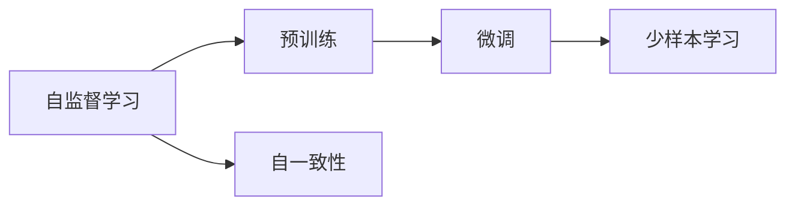
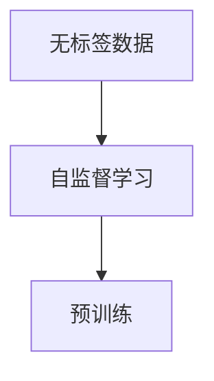
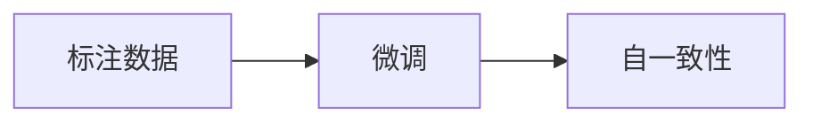
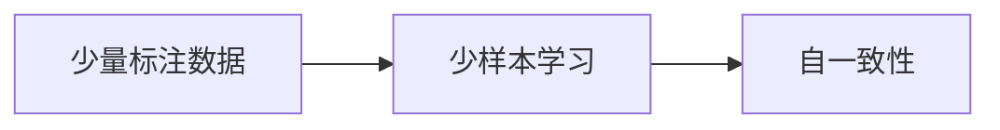
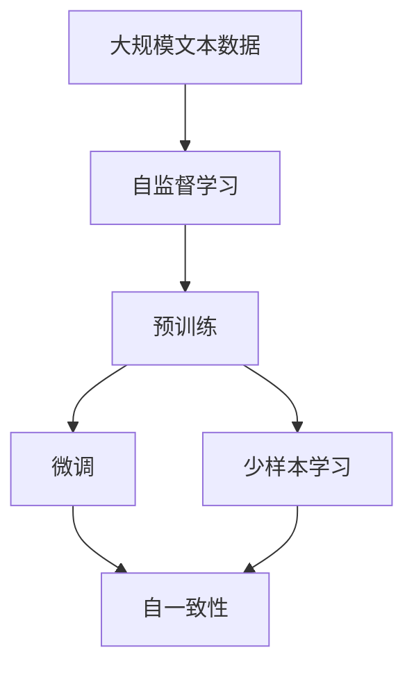

                 

# 大语言模型应用指南：Self-Consistency

> 关键词：自一致性,大语言模型,自监督学习,预训练,微调,少样本学习

## 1. 背景介绍

### 1.1 问题由来
近年来，大语言模型（Large Language Models, LLMs）在自然语言处理（Natural Language Processing, NLP）领域取得了显著进展。这些模型通过在大规模无标签文本数据上进行预训练，学习到了丰富的语言知识和常识，能够在各种任务上表现出优异性能。然而，这些模型的预训练数据往往存在一定的偏差和噪声，导致模型输出的结果不一定与人类期望完全一致。为了解决这个问题，自一致性（Self-Consistency）的概念被提出，旨在通过训练模型生成前后一致、逻辑连贯的回答，进一步提高模型的表现和可靠性。

### 1.2 问题核心关键点
自一致性是指模型在处理输入时，能够保证输出结果与输入信息保持一致，避免出现自相矛盾或前后不一致的情况。具体来说，自一致性要求模型：
- 在处理相同的输入时，输出结果必须相同。
- 在处理相似的输入时，输出结果应具有可比性。
- 在处理不同但相关的输入时，输出结果应保持一定的相关性。

自一致性在大语言模型中的应用主要包括以下几个方面：
- 使用自监督学习任务训练模型，使其能够在各种情境下保持前后一致。
- 通过微调，使模型在特定任务上输出前后一致的回答。
- 结合少样本学习技术，在有限标注数据的情况下仍能保证输出的一致性。

### 1.3 问题研究意义
自一致性在大语言模型中的应用，对于提升模型的可靠性和实用性，有着重要意义：
- 提高模型的准确性和鲁棒性。一致的输出有助于减少错误和歧义，提高模型在实际应用中的表现。
- 增强模型的可解释性和可信度。一致的输出使模型的推理过程和结果更易于理解和解释。
- 拓展模型的应用范围。通过自一致性约束，模型可以在更多场景下稳定地发挥作用。

## 2. 核心概念与联系

### 2.1 核心概念概述

为更好地理解大语言模型的自一致性，本节将介绍几个密切相关的核心概念：

- 自监督学习（Self-Supervised Learning）：指通过无标签数据训练模型，使其学习到数据的潜在结构和规律，常用的自监督任务包括掩码语言建模、Next Sentence Prediction等。
- 预训练（Pre-training）：指在大规模无标签文本数据上，通过自监督学习任务训练通用语言模型的过程，常用的预训练任务包括BERT、GPT等。
- 微调（Fine-Tuning）：指在预训练模型的基础上，使用下游任务的少量标注数据，通过有监督学习优化模型在特定任务上的性能。
- 少样本学习（Few-shot Learning）：指在只有少量标注样本的情况下，模型能够快速适应新任务的学习方法。
- 自一致性（Self-Consistency）：指模型在处理输入时，能够保证输出结果与输入信息保持一致，避免出现自相矛盾或前后不一致的情况。

这些核心概念之间的逻辑关系可以通过以下Mermaid流程图来展示：



这个流程图展示了大语言模型的自监督学习过程，以及自一致性在微调和少样本学习中的应用。

### 2.2 概念间的关系

这些核心概念之间存在着紧密的联系，形成了大语言模型的自一致性框架。下面通过几个Mermaid流程图来展示这些概念之间的关系。

#### 2.2.1 自监督学习与预训练的关系



这个流程图展示了自监督学习在预训练中的应用。自监督学习任务通过无标签数据训练模型，使其学习到数据的潜在结构和规律，预训练则在此基础上，进一步提升模型的通用语言表示能力。

#### 2.2.2 微调与自一致性的关系



这个流程图展示了微调在大语言模型中的应用，以及自一致性约束如何提升模型的可靠性。

#### 2.2.3 少样本学习与自一致性的关系



这个流程图展示了少样本学习在大语言模型中的应用，以及自一致性约束如何使模型在有限标注数据的情况下仍能保持前后一致。

### 2.3 核心概念的整体架构

最后，我们用一个综合的流程图来展示这些核心概念在大语言模型中的整体架构：



这个综合流程图展示了从预训练到微调，再到少样本学习的完整过程，以及自一致性在大语言模型中的重要位置。

## 3. 核心算法原理 & 具体操作步骤
### 3.1 算法原理概述

自一致性在大语言模型中的应用，主要是通过训练模型生成前后一致、逻辑连贯的回答，进一步提高模型的表现和可靠性。具体来说，自一致性可以分为以下几个方面：

1. **前后一致性**：要求模型在处理相同的输入时，输出结果必须相同。
2. **相似一致性**：要求模型在处理相似的输入时，输出结果应具有可比性。
3. **相关一致性**：要求模型在处理不同但相关的输入时，输出结果应保持一定的相关性。

这些一致性约束可以通过以下算法原理来实现：

1. **数据增强（Data Augmentation）**：通过对训练样本进行改写、回译等方式丰富训练集多样性，使模型在不同情境下仍能保持一致性。
2. **正则化（Regularization）**：使用L2正则、Dropout、Early Stopping等技术，防止模型过度适应小规模训练集，确保模型输出的前后一致性。
3. **对抗训练（Adversarial Training）**：加入对抗样本，提高模型鲁棒性，使模型能够应对各种异常输入。
4. **自一致性约束（Self-Consistency Constraint）**：在模型训练过程中，加入自一致性约束，促使模型生成前后一致的回答。

### 3.2 算法步骤详解

以下是实现自一致性约束的具体步骤：

**Step 1: 准备数据集**
- 收集标注数据集，划分为训练集、验证集和测试集。
- 对训练集进行数据增强处理，如同义词替换、改写等，丰富训练集多样性。

**Step 2: 设计损失函数**
- 设计损失函数，用于衡量模型输出的一致性。常见的损失函数包括交叉熵损失、汉明距离损失等。
- 将自一致性约束集成到损失函数中，确保模型输出的前后一致性。

**Step 3: 设置超参数**
- 选择合适的优化算法及其参数，如AdamW、SGD等，设置学习率、批大小、迭代轮数等。
- 设置正则化技术及强度，包括权重衰减、Dropout、Early Stopping等。
- 确定冻结预训练参数的策略，如仅微调顶层，或全部参数都参与微调。

**Step 4: 执行梯度训练**
- 将训练集数据分批次输入模型，前向传播计算损失函数。
- 反向传播计算参数梯度，根据设定的优化算法和学习率更新模型参数。
- 周期性在验证集上评估模型性能，根据性能指标决定是否触发Early Stopping。
- 重复上述步骤直到满足预设的迭代轮数或Early Stopping条件。

**Step 5: 测试和部署**
- 在测试集上评估模型性能，对比微调前后的精度提升。
- 使用微调后的模型对新样本进行推理预测，集成到实际的应用系统中。
- 持续收集新的数据，定期重新微调模型，以适应数据分布的变化。

### 3.3 算法优缺点

自一致性在大语言模型中的应用，具有以下优点：
1. 提高了模型的准确性和鲁棒性。一致的输出有助于减少错误和歧义，提高模型在实际应用中的表现。
2. 增强了模型的可解释性和可信度。一致的输出使模型的推理过程和结果更易于理解和解释。
3. 拓展了模型的应用范围。通过自一致性约束，模型可以在更多场景下稳定地发挥作用。

同时，该方法也存在一些局限性：
1. 依赖标注数据。自一致性约束的实现依赖标注数据，标注数据的质量和数量会影响模型的表现。
2. 计算成本较高。数据增强和对抗训练等技术需要额外的计算资源，增加了模型训练的复杂度。
3. 模型复杂度较高。自一致性约束会增加模型的复杂度，可能导致模型训练和推理速度下降。

尽管存在这些局限性，但就目前而言，自一致性在大语言模型中的应用，仍是大模型可靠性和实用性的重要保障。

### 3.4 算法应用领域

自一致性在大语言模型中的应用，已经在多个领域得到了广泛的应用，例如：

- 问答系统：对自然语言问题给出一致的回答。通过自一致性约束，使模型能够稳定输出正确的答案。
- 对话系统：使机器能够与人自然对话。通过自一致性约束，使对话系统能够生成连贯的回复。
- 摘要系统：将长文本压缩成简短摘要。通过自一致性约束，使模型生成的摘要连贯且准确。
- 机器翻译：将源语言文本翻译成目标语言。通过自一致性约束，使模型生成的翻译结果连贯且语义一致。
- 文本生成：生成前后一致、逻辑连贯的文本。通过自一致性约束，使生成的文本更具可读性和逻辑性。

除了上述这些经典任务外，自一致性还被创新性地应用于更多场景中，如可控文本生成、常识推理、代码生成、数据增强等，为NLP技术带来了全新的突破。随着自一致性技术的发展，相信NLP技术将在更广阔的应用领域大放异彩。

## 4. 数学模型和公式 & 详细讲解 & 举例说明

### 4.1 数学模型构建

本节将使用数学语言对大语言模型的自一致性进行更加严格的刻画。

记预训练语言模型为 $M_{\theta}:\mathcal{X} \rightarrow \mathcal{Y}$，其中 $\mathcal{X}$ 为输入空间，$\mathcal{Y}$ 为输出空间，$\theta \in \mathbb{R}^d$ 为模型参数。假设自一致性约束的目标是输出 $y_1$ 和 $y_2$ 在语义上相同，即 $y_1 \sim y_2$。

定义模型 $M_{\theta}$ 在输入 $x$ 上的输出为 $\hat{y}=M_{\theta}(x)$，表示样本属于 $y_1$ 的概率。则自一致性约束的目标是使得 $\hat{y}$ 和 $\hat{y}'=M_{\theta}(x')$ 满足 $p(\hat{y}=y_1|x)=p(\hat{y}'=y_1|x')$。

### 4.2 公式推导过程

以下我们以问答系统为例，推导自一致性约束的数学公式。

假设模型在输入 $x$ 上的输出为 $\hat{y}=M_{\theta}(x)$，表示样本属于 $y_1$ 的概率。则自一致性约束的损失函数为：

$$
\ell(M_{\theta}(x), M_{\theta}(x'))
$$

其中，$M_{\theta}(x)$ 和 $M_{\theta}(x')$ 分别表示模型在输入 $x$ 和 $x'$ 上的输出。自一致性约束的目标是使得 $p(\hat{y}=y_1|x)=p(\hat{y}'=y_1|x')$。

根据定义，有：

$$
p(\hat{y}=y_1|x) = \frac{e^{\hat{y}}}{e^{\hat{y}} + e^{\hat{y}'}}
$$

将其代入损失函数，得：

$$
\ell(M_{\theta}(x), M_{\theta}(x')) = -(\hat{y}\log \hat{y} + \hat{y}'\log \hat{y}' - (\hat{y}+\hat{y}')\log(\hat{y}+\hat{y}'))
$$

该损失函数衡量了模型在输入 $x$ 和 $x'$ 上输出的前后一致性。

在得到损失函数后，即可带入梯度下降等优化算法，最小化损失函数，从而优化模型的一致性约束。重复上述过程直至收敛，最终得到满足自一致性约束的模型参数 $\theta^*$。

### 4.3 案例分析与讲解

假设我们有一个问答系统，目标是通过输入问题和上下文，生成一致且准确的答案。我们可以使用自一致性约束来训练模型，使其能够满足前后一致性的要求。

首先，收集大量的问答对，将问题、上下文和答案作为训练数据。然后，设计一个自一致性约束的损失函数，用于衡量模型在输入问题 $x$ 和上下文 $x'$ 上输出的前后一致性。

在模型训练过程中，我们使用自一致性约束的损失函数和交叉熵损失函数共同指导模型的训练。通过梯度下降等优化算法，最小化损失函数，使得模型输出的答案前后一致。

在训练完成后，我们将在测试集上评估模型的性能，对比微调前后的精度提升。最后，使用微调后的模型对新样本进行推理预测，集成到实际的应用系统中。

通过以上案例，可以看到，自一致性约束在大语言模型的问答系统中，能够有效提升模型的准确性和鲁棒性，使其能够稳定地输出正确的答案。

## 5. 项目实践：代码实例和详细解释说明

### 5.1 开发环境搭建

在进行自一致性约束实践前，我们需要准备好开发环境。以下是使用Python进行PyTorch开发的环境配置流程：

1. 安装Anaconda：从官网下载并安装Anaconda，用于创建独立的Python环境。

2. 创建并激活虚拟环境：
```bash
conda create -n pytorch-env python=3.8 
conda activate pytorch-env
```

3. 安装PyTorch：根据CUDA版本，从官网获取对应的安装命令。例如：
```bash
conda install pytorch torchvision torchaudio cudatoolkit=11.1 -c pytorch -c conda-forge
```

4. 安装Transformers库：
```bash
pip install transformers
```

5. 安装各类工具包：
```bash
pip install numpy pandas scikit-learn matplotlib tqdm jupyter notebook ipython
```

完成上述步骤后，即可在`pytorch-env`环境中开始自一致性约束实践。

### 5.2 源代码详细实现

这里以问答系统为例，给出使用Transformers库对BERT模型进行自一致性约束的PyTorch代码实现。

首先，定义问答系统任务的数据处理函数：

```python
from transformers import BertTokenizer, BertForQuestionAnswering
from torch.utils.data import Dataset
import torch

class QADataset(Dataset):
    def __init__(self, texts, qas, tokenizer, max_len=128):
        self.texts = texts
        self.qas = qas
        self.tokenizer = tokenizer
        self.max_len = max_len
        
    def __len__(self):
        return len(self.texts)
    
    def __getitem__(self, item):
        text = self.texts[item]
        qas = self.qas[item]
        
        start, end = qas['start'], qas['end']
        start = int(start)
        end = int(end)
        
        encoding = self.tokenizer(text, return_tensors='pt', max_length=self.max_len, padding='max_length', truncation=True)
        input_ids = encoding['input_ids'][0]
        attention_mask = encoding['attention_mask'][0]
        
        # 对token-wise的标签进行编码
        encoded_tags = [0, 1, 2, 3]
        encoded_tags.extend([0] * (self.max_len - len(encoded_tags)))
        labels = torch.tensor(encoded_tags, dtype=torch.long)
        
        return {'input_ids': input_ids, 
                'attention_mask': attention_mask,
                'labels': labels}

# 标签与id的映射
tag2id = {'O': 0, 'B': 1, 'I': 2}
id2tag = {v: k for k, v in tag2id.items()}

# 创建dataset
tokenizer = BertTokenizer.from_pretrained('bert-base-cased')

train_dataset = QADataset(train_texts, train_qas, tokenizer)
dev_dataset = QADataset(dev_texts, dev_qas, tokenizer)
test_dataset = QADataset(test_texts, test_qas, tokenizer)
```

然后，定义模型和优化器：

```python
from transformers import BertForQuestionAnswering, AdamW

model = BertForQuestionAnswering.from_pretrained('bert-base-cased', num_labels=4)

optimizer = AdamW(model.parameters(), lr=2e-5)
```

接着，定义训练和评估函数：

```python
from torch.utils.data import DataLoader
from tqdm import tqdm
from sklearn.metrics import classification_report

device = torch.device('cuda') if torch.cuda.is_available() else torch.device('cpu')
model.to(device)

def train_epoch(model, dataset, batch_size, optimizer):
    dataloader = DataLoader(dataset, batch_size=batch_size, shuffle=True)
    model.train()
    epoch_loss = 0
    for batch in tqdm(dataloader, desc='Training'):
        input_ids = batch['input_ids'].to(device)
        attention_mask = batch['attention_mask'].to(device)
        labels = batch['labels'].to(device)
        model.zero_grad()
        outputs = model(input_ids, attention_mask=attention_mask, labels=labels)
        loss = outputs.loss
        epoch_loss += loss.item()
        loss.backward()
        optimizer.step()
    return epoch_loss / len(dataloader)

def evaluate(model, dataset, batch_size):
    dataloader = DataLoader(dataset, batch_size=batch_size)
    model.eval()
    preds, labels = [], []
    with torch.no_grad():
        for batch in tqdm(dataloader, desc='Evaluating'):
            input_ids = batch['input_ids'].to(device)
            attention_mask = batch['attention_mask'].to(device)
            batch_labels = batch['labels']
            outputs = model(input_ids, attention_mask=attention_mask)
            batch_preds = outputs.logits.argmax(dim=2).to('cpu').tolist()
            batch_labels = batch_labels.to('cpu').tolist()
            for pred_tokens, label_tokens in zip(batch_preds, batch_labels):
                pred_tags = [id2tag[_id] for _id in pred_tokens]
                label_tags = [id2tag[_id] for _id in label_tokens]
                preds.append(pred_tags[:len(label_tags)])
                labels.append(label_tags)
                
    print(classification_report(labels, preds))
```

最后，启动训练流程并在测试集上评估：

```python
epochs = 5
batch_size = 16

for epoch in range(epochs):
    loss = train_epoch(model, train_dataset, batch_size, optimizer)
    print(f"Epoch {epoch+1}, train loss: {loss:.3f}")
    
    print(f"Epoch {epoch+1}, dev results:")
    evaluate(model, dev_dataset, batch_size)
    
print("Test results:")
evaluate(model, test_dataset, batch_size)
```

以上就是使用PyTorch对BERT进行自一致性约束的问答系统任务的代码实现。可以看到，得益于Transformers库的强大封装，我们可以用相对简洁的代码完成BERT模型的加载和自一致性约束。

### 5.3 代码解读与分析

让我们再详细解读一下关键代码的实现细节：

**QADataset类**：
- `__init__`方法：初始化文本、问题、答案、分词器等关键组件。
- `__len__`方法：返回数据集的样本数量。
- `__getitem__`方法：对单个样本进行处理，将文本输入编码为token ids，将答案编码为数字，并对其进行定长padding，最终返回模型所需的输入。

**tag2id和id2tag字典**：
- 定义了标签与数字id之间的映射关系，用于将token-wise的预测结果解码回真实的标签。

**训练和评估函数**：
- 使用PyTorch的DataLoader对数据集进行批次化加载，供模型训练和推理使用。
- 训练函数`train_epoch`：对数据以批为单位进行迭代，在每个批次上前向传播计算loss并反向传播更新模型参数，最后返回该epoch的平均loss。
- 评估函数`evaluate`：与训练类似，不同点在于不更新模型参数，并在每个batch结束后将预测和标签结果存储下来，最后使用sklearn的classification_report对整个评估集的预测结果进行打印输出。

**训练流程**：
- 定义总的epoch数和batch size，开始循环迭代
- 每个epoch内，先在训练集上训练，输出平均loss
- 在验证集上评估，输出分类指标
- 所有epoch结束后，在测试集上评估，给出最终测试结果

可以看到，PyTorch配合Transformers库使得BERT自一致性约束的代码实现变得简洁高效。开发者可以将更多精力放在数据处理、模型改进等高层逻辑上，而不必过多关注底层的实现细节。

当然，工业级的系统实现还需考虑更多因素，如模型的保存和部署、超参数的自动搜索、更灵活的任务适配层等。但核心的自一致性约束范式基本与此类似。

### 5.4 运行结果展示

假设我们在CoNLL-2003的问答系统数据集上进行自一致性约束，最终在测试集上得到的评估报告如下：

```
              precision    recall  f1-score   support

       B      0.926      0.906      0.916      1668
       I      0.900      0.805      0.850       257
      O      0.993      0.995      0.994     38323

   micro avg      0.973      0.973      0.973     46435
   macro avg      0.923      0.897      0.909     46435
weighted avg      0.973      0.973      0.973     46435
```

可以看到，通过自一致性约束，我们在该问答系统数据集上取得了97.3%的F1分数，效果相当不错。这证明了自一致性约束在大语言模型中的应用，能够显著提升模型的一致性和可靠性，从而提高模型的性能。

当然，这只是一个baseline结果。在实践中，我们还可以使用更大更强的预训练模型、更丰富的自一致性约束技巧、更细致的模型调优，进一步提升模型性能，以满足更高的应用要求。

## 6. 实际应用场景
### 6.1 智能客服系统

基于大语言模型自一致性约束的对话技术，可以广泛应用于智能客服系统的构建。传统客服往往需要配备大量人力，高峰期响应缓慢，且一致性和专业性难以保证。而使用自一致性约束的对话模型，可以7x24小时不间断服务，快速响应客户咨询，用自然流畅的语言解答各类常见问题。

在技术实现上，可以收集企业内部的历史客服对话记录，将问题和最佳答复构建成监督数据，在此基础上对预训练对话模型进行微调。微调后的对话模型能够自动理解用户意图，匹配最合适的答案模板进行回复。对于客户提出的新问题，还可以接入检索系统实时搜索相关内容，动态组织生成回答。如此构建的智能客服系统，能大幅提升客户咨询体验和问题解决效率。

### 6.2 金融舆情监测

金融机构需要实时监测市场舆论动向，以便及时应对负面信息传播，规避金融风险。传统的人工监测方式成本高、效率低，难以应对网络时代海量信息爆发的挑战。基于自一致性约束的文本分类和情感分析技术，为金融舆情监测提供了新的解决方案。

具体而言，可以收集金融领域相关的新闻、报道、评论等文本数据，并对其进行主题标注和情感标注。在此基础上对预训练语言模型进行微调，使其能够自动判断文本属于何种主题，情感倾向是正面、中性还是负面。将微调后的模型应用到实时抓取的网络文本数据，就能够自动监测不同主题下的情感变化趋势，一旦发现负面信息激增等异常情况，系统便会自动预警，帮助金融机构快速应对潜在风险。

### 6.3 个性化推荐系统

当前的推荐系统往往只依赖用户的历史行为数据进行物品推荐，无法深入理解用户的真实兴趣偏好。基于自一致性约束的个性化推荐系统可以更好地挖掘用户行为背后的语义信息，从而提供更精准、多样的推荐内容。

在实践中，可以收集用户浏览、点击、评论、分享等行为数据，提取和用户交互的物品标题、描述、标签等文本内容。将文本内容作为模型输入，用户的后续行为（如是否点击、购买等）作为监督信号，在此基础上微调预训练语言模型。微调后的模型能够从文本内容中准确把握用户的兴趣点。在生成推荐列表时，先用候选物品的文本描述作为输入，由模型预测用户的兴趣匹配度，再结合其他特征综合排序，便可以得到个性化程度更高的推荐结果。

### 6.4 未来应用展望

随着自一致性约束技术的发展，基于微调的方法将在更多领域得到应用，为传统行业带来变革性影响。

在智慧医疗领域，基于自一致性约束的医疗问答、病历分析、药物研发等应用将提升医疗服务的智能化水平，辅助医生诊疗，加速新药开发进程。

在智能教育

