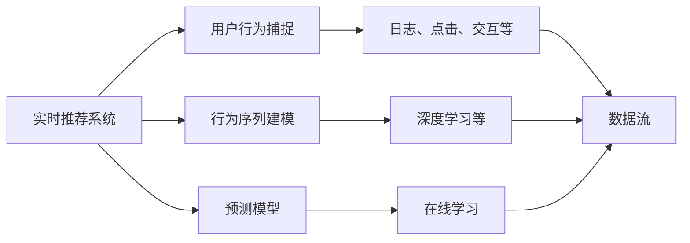
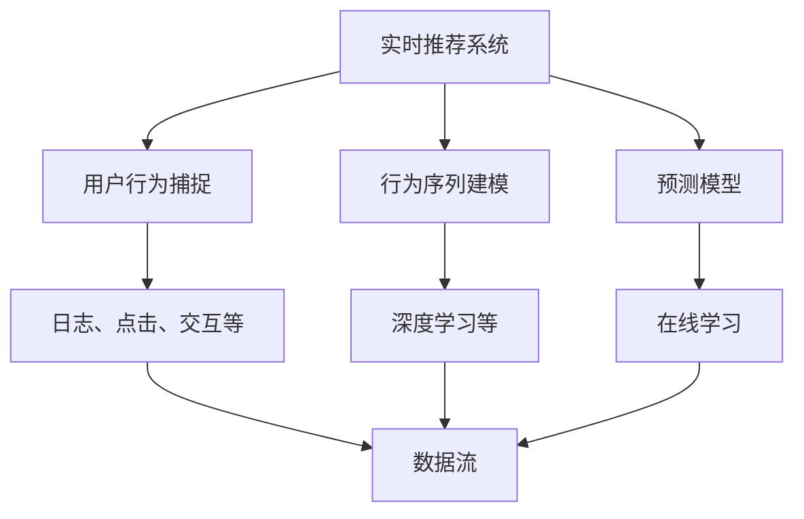
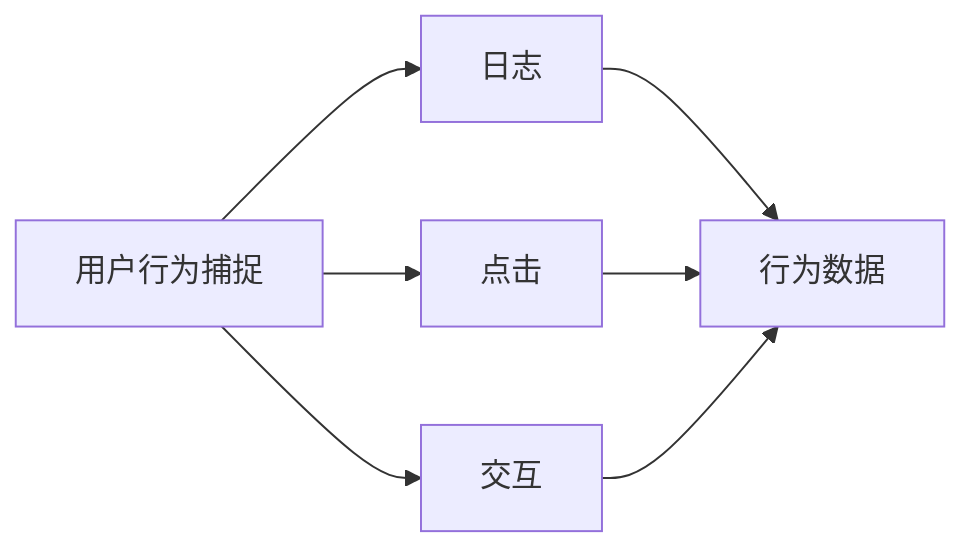
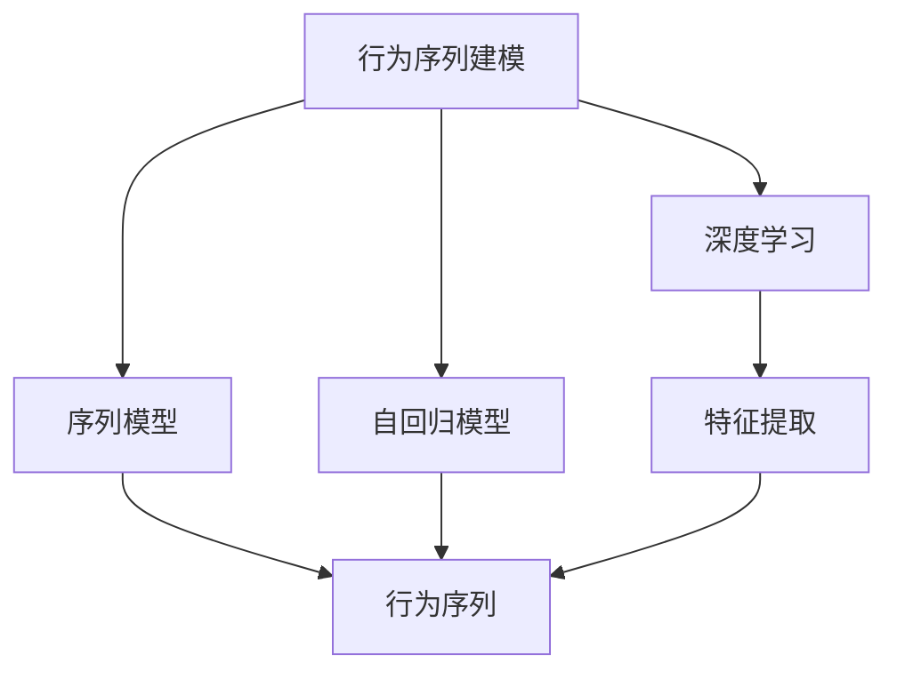
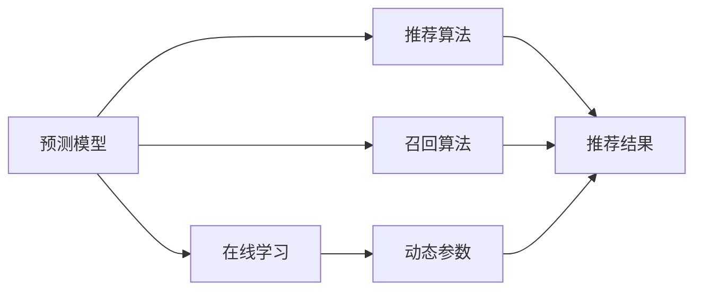
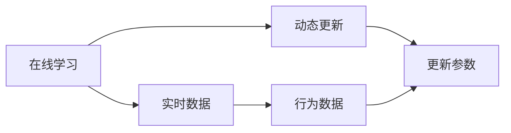

                 

# 实时推荐的用户行为捕捉与分析

> 关键词：实时推荐系统, 用户行为捕捉, 数据分析, 预测模型, 行为序列建模, 深度学习, 机器学习

## 1. 背景介绍

### 1.1 问题由来

在当今数字化时代，推荐系统已经深入到各行各业的日常运营中。无论是电商平台、社交媒体、视频平台，还是新闻应用，推荐系统都是提升用户满意度和增加收益的关键工具。然而，传统的推荐系统多基于历史行为数据进行推荐，往往难以满足用户多样化和实时化的需求。

如何捕捉和分析用户的实时行为，构建更加精准和动态的推荐模型，成为推荐系统发展的重大挑战。通过深度学习和大数据分析技术，实时推荐系统（Real-time Recommendation System）应运而生，其目标是实时捕捉用户行为，并结合预测模型，动态生成个性化推荐。

### 1.2 问题核心关键点

实时推荐系统通过实时捕捉用户的行为序列，结合预测模型，动态生成个性化推荐。其核心思想是：
1. 实时捕捉用户行为：通过日志、点击、交互等数据，捕捉用户实时行为。
2. 动态建模行为序列：使用深度学习等技术，构建行为序列模型，捕捉用户行为规律。
3. 实时推荐生成：结合预测模型，实时生成个性化推荐。

### 1.3 问题研究意义

实时推荐系统的研究具有重要的理论和实践意义：
1. 提升用户体验：实时捕捉用户行为，动态生成个性化推荐，能显著提升用户体验和满意度。
2. 增强业务价值：通过个性化推荐，提升用户粘性，增加业务收益。
3. 优化资源配置：实时推荐系统可以根据用户行为，动态调整资源配置，优化运营效率。
4. 驱动精准营销：结合用户行为数据和推荐结果，实现精准广告投放和营销策略调整。

## 2. 核心概念与联系

### 2.1 核心概念概述

为了更好地理解实时推荐系统，本节将介绍几个密切相关的核心概念：

- 实时推荐系统（Real-time Recommendation System）：通过实时捕捉用户行为，动态生成个性化推荐。
- 用户行为捕捉（User Behavior Capture）：实时收集和分析用户的点击、浏览、搜索等行为数据。
- 行为序列建模（Behavior Sequence Modeling）：使用深度学习等技术，构建用户行为序列模型。
- 预测模型（Prediction Model）：结合用户行为数据和预测模型，动态生成个性化推荐。
- 特征工程（Feature Engineering）：设计和构建特征，提升模型的预测能力。
- 在线学习（Online Learning）：结合实时数据，动态调整预测模型参数。

这些核心概念之间存在着紧密的联系，形成了实时推荐系统的完整生态系统。下面我们通过一个Mermaid流程图来展示这些概念之间的联系。



这个流程图展示了这个生态系统的关键组成部分：

1. 实时推荐系统通过用户行为捕捉实时捕捉用户行为数据。
2. 行为序列建模使用深度学习等技术，构建用户行为序列模型。
3. 预测模型结合用户行为数据和预测模型，动态生成个性化推荐。
4. 在线学习实时调整预测模型参数，提升模型预测能力。

这些概念共同构成了实时推荐系统的学习和应用框架，使其能够实时捕捉和分析用户行为，动态生成个性化推荐。

### 2.2 概念间的关系

这些核心概念之间存在着紧密的联系，形成了实时推荐系统的完整生态系统。下面我们通过几个Mermaid流程图来展示这些概念之间的关系。

#### 2.2.1 实时推荐系统的整体架构



这个流程图展示了实时推荐系统的整体架构：

1. 实时推荐系统通过用户行为捕捉实时捕捉用户行为数据。
2. 行为序列建模使用深度学习等技术，构建用户行为序列模型。
3. 预测模型结合用户行为数据和预测模型，动态生成个性化推荐。
4. 在线学习实时调整预测模型参数，提升模型预测能力。

#### 2.2.2 用户行为捕捉的流程图



这个流程图展示了用户行为捕捉的流程图：

1. 用户行为捕捉包括日志、点击、交互等多种数据形式。
2. 日志数据记录用户在应用中的基本行为。
3. 点击数据记录用户对应用内元素的操作。
4. 交互数据记录用户与应用的交互过程。
5. 行为数据整合后用于行为序列建模。

#### 2.2.3 行为序列建模的流程图



这个流程图展示了行为序列建模的流程图：

1. 行为序列建模使用深度学习等技术，构建行为序列模型。
2. 序列模型用于捕捉用户行为序列的结构和规律。
3. 自回归模型用于预测用户未来的行为。
4. 特征提取用于提升模型的预测能力。
5. 行为序列用于预测模型的输入。

#### 2.2.4 预测模型的流程图



这个流程图展示了预测模型的流程图：

1. 预测模型结合用户行为数据和预测模型，动态生成个性化推荐。
2. 推荐算法用于生成推荐结果。
3. 召回算法用于筛选推荐结果。
4. 在线学习用于动态调整预测模型参数。
5. 推荐结果用于用户的实时推荐。

#### 2.2.5 在线学习的流程图



这个流程图展示了在线学习的流程图：

1. 在线学习实时调整预测模型参数，提升模型预测能力。
2. 实时数据用于动态更新模型参数。
3. 行为数据用于在线学习的输入。
4. 更新参数用于提升模型预测能力。

## 3. 核心算法原理 & 具体操作步骤

### 3.1 算法原理概述

实时推荐系统通过实时捕捉用户行为，构建用户行为序列模型，结合预测模型，动态生成个性化推荐。其核心思想是：

1. 实时捕捉用户行为：通过日志、点击、交互等数据，捕捉用户实时行为。
2. 动态建模行为序列：使用深度学习等技术，构建行为序列模型，捕捉用户行为规律。
3. 实时推荐生成：结合预测模型，实时生成个性化推荐。

形式化地，假设实时推荐系统捕捉到的用户行为序列为 $X_t = (x_1, x_2, \ldots, x_t)$，其中 $x_t$ 表示用户在第 $t$ 时刻的行为。预测模型为 $f$，用户行为序列模型为 $M$，推荐结果为 $Y_t = (y_1, y_2, \ldots, y_t)$，其中 $y_t$ 表示用户在第 $t$ 时刻的推荐结果。

实时推荐系统的目标是最小化损失函数 $L(Y_t, \hat{Y}_t)$，其中 $\hat{Y}_t$ 为预测模型 $f$ 生成的推荐结果。常用的损失函数包括均方误差（MSE）和交叉熵（CE）等。

### 3.2 算法步骤详解

实时推荐系统的一般操作流程包括以下几个关键步骤：

**Step 1: 准备实时数据和预测模型**

- 准备实时数据：从日志、点击、交互等多种数据形式中收集用户行为数据。
- 构建预测模型：选择合适的推荐算法和特征工程方法，构建预测模型。

**Step 2: 行为序列建模**

- 设计行为序列模型：选择合适的深度学习模型，如RNN、LSTM、GRU等，用于构建行为序列模型。
- 训练行为序列模型：在训练集上训练行为序列模型，捕捉用户行为规律。

**Step 3: 实时推荐生成**

- 实时捕捉用户行为：通过API接口或系统日志，实时捕捉用户行为数据。
- 动态生成推荐结果：将实时行为数据输入行为序列模型和预测模型，生成推荐结果。

**Step 4: 在线学习**

- 实时调整模型参数：根据实时数据，使用在线学习算法，动态调整预测模型参数。
- 更新模型参数：使用梯度下降等优化算法，更新预测模型参数。

**Step 5: 推荐结果反馈**

- 推荐结果反馈：将推荐结果反馈给用户，记录用户行为，用于后续推荐模型训练。
- 模型持续优化：根据用户行为反馈，不断优化推荐模型。

### 3.3 算法优缺点

实时推荐系统的优缺点如下：

#### 优点：

1. 实时捕捉用户行为：能够捕捉用户的实时行为，动态生成个性化推荐。
2. 动态建模行为序列：能够捕捉用户行为规律，提升预测模型的准确性。
3. 实时推荐生成：能够实时生成推荐结果，提升用户体验。
4. 在线学习：能够实时调整模型参数，提升预测模型性能。

#### 缺点：

1. 数据需求高：需要大量实时数据，才能获得有效的推荐结果。
2. 模型复杂度高：行为序列建模和预测模型复杂，需要较高的计算资源。
3. 系统延迟高：实时推荐系统需要快速响应用户行为，系统延迟较高。
4. 用户隐私风险：实时捕捉用户行为可能带来隐私风险，需注意用户隐私保护。

### 3.4 算法应用领域

实时推荐系统在多个领域得到了广泛应用，如电商推荐、社交媒体推荐、视频推荐等。以下是几个典型的应用场景：

- **电商推荐**：电商网站通过实时推荐系统，推荐用户感兴趣的商品。实时推荐系统根据用户的浏览、点击、购买等行为，动态生成个性化推荐。
- **社交媒体推荐**：社交平台通过实时推荐系统，推荐用户感兴趣的内容。实时推荐系统根据用户的互动、关注、点赞等行为，动态生成个性化推荐。
- **视频推荐**：视频平台通过实时推荐系统，推荐用户感兴趣的视频。实时推荐系统根据用户的观看、点赞、分享等行为，动态生成个性化推荐。
- **新闻推荐**：新闻应用通过实时推荐系统，推荐用户感兴趣的新闻。实时推荐系统根据用户的阅读、评论、点赞等行为，动态生成个性化推荐。

## 4. 数学模型和公式 & 详细讲解 & 举例说明

### 4.1 数学模型构建

实时推荐系统的核心是行为序列建模和预测模型。下面我们以RNN模型为例，展示实时推荐系统的数学模型构建。

假设用户行为序列为 $X_t = (x_1, x_2, \ldots, x_t)$，预测模型为 $f$，行为序列模型为 $M$。预测模型的输出为 $Y_t = (y_1, y_2, \ldots, y_t)$。

#### 行为序列模型

行为序列模型 $M$ 通常使用RNN、LSTM、GRU等序列模型，用于捕捉用户行为规律。这里以RNN为例，行为序列模型的输出为 $h_t = M(x_1, x_2, \ldots, x_t)$。

#### 预测模型

预测模型 $f$ 通常使用回归或分类算法，用于生成推荐结果。这里以回归模型为例，预测模型的输出为 $y_t = f(h_t)$。

#### 损失函数

损失函数 $L(Y_t, \hat{Y}_t)$ 通常使用均方误差（MSE）或交叉熵（CE）等。这里以均方误差为例，损失函数为：

$$L(Y_t, \hat{Y}_t) = \frac{1}{N} \sum_{i=1}^N (Y_i - \hat{Y}_i)^2$$

其中 $N$ 为样本数量。

### 4.2 公式推导过程

以下我们以回归模型为例，推导实时推荐系统的损失函数和优化算法。

假设行为序列模型 $M$ 的输出为 $h_t$，预测模型 $f$ 的输出为 $y_t$，用户行为序列为 $X_t = (x_1, x_2, \ldots, x_t)$，预测结果为 $Y_t = (y_1, y_2, \ldots, y_t)$。

行为序列模型的输出为 $h_t = M(x_1, x_2, \ldots, x_t)$，预测模型的输出为 $y_t = f(h_t)$。

均方误差损失函数为：

$$L(Y_t, \hat{Y}_t) = \frac{1}{N} \sum_{i=1}^N (Y_i - \hat{Y}_i)^2$$

其中 $N$ 为样本数量，$Y_i$ 为真实标签，$\hat{Y}_i$ 为预测标签。

预测模型 $f$ 的梯度为：

$$\frac{\partial L}{\partial h} = -\frac{2}{N} \sum_{i=1}^N (Y_i - \hat{Y}_i) \frac{\partial h}{\partial x_i}$$

其中 $\frac{\partial h}{\partial x_i}$ 为行为序列模型 $M$ 的梯度。

使用梯度下降算法更新预测模型参数 $\theta$：

$$\theta \leftarrow \theta - \eta \nabla_{\theta} L$$

其中 $\eta$ 为学习率，$\nabla_{\theta} L$ 为损失函数对模型参数 $\theta$ 的梯度。

### 4.3 案例分析与讲解

这里以电商推荐为例，展示实时推荐系统的应用。

电商推荐系统需要实时捕捉用户的行为数据，并结合预测模型，动态生成个性化推荐。具体步骤如下：

1. **数据收集**：电商网站收集用户的浏览、点击、购买等行为数据。
2. **行为序列建模**：使用LSTM模型，捕捉用户行为序列的规律。
3. **预测模型构建**：使用回归模型，预测用户对商品的兴趣评分。
4. **实时推荐生成**：根据用户的实时行为，动态生成个性化推荐。
5. **在线学习**：实时调整预测模型参数，提升推荐模型的性能。

假设某用户在电商网站浏览商品 $x_1$，购买商品 $x_2$，浏览商品 $x_3$。电商推荐系统通过行为序列模型和预测模型，预测用户对商品 $x_4$ 的兴趣评分 $y_4$。电商网站根据用户行为 $X_4$ 和预测结果 $Y_4$，动态生成推荐结果 $Y_4$。

## 5. 项目实践：代码实例和详细解释说明

### 5.1 开发环境搭建

在进行实时推荐系统开发前，我们需要准备好开发环境。以下是使用Python进行TensorFlow开发的环境配置流程：

1. 安装Anaconda：从官网下载并安装Anaconda，用于创建独立的Python环境。

2. 创建并激活虚拟环境：
```bash
conda create -n tf-env python=3.8 
conda activate tf-env
```

3. 安装TensorFlow：根据CUDA版本，从官网获取对应的安装命令。例如：
```bash
conda install tensorflow -c tensorflow -c conda-forge
```

4. 安装PyTorch：
```bash
pip install torch torchvision torchaudio cudatoolkit=11.1 -c pytorch -c conda-forge
```

5. 安装Keras：
```bash
pip install keras tensorflow-nightly --upgrade
```

6. 安装TensorBoard：
```bash
pip install tensorboard
```

完成上述步骤后，即可在`tf-env`环境中开始开发实时推荐系统的代码实现。

### 5.2 源代码详细实现

这里我们以电商推荐为例，展示实时推荐系统的代码实现。

```python
import tensorflow as tf
from tensorflow.keras.layers import LSTM, Dense, Embedding
from tensorflow.keras.models import Sequential
from tensorflow.keras.callbacks import EarlyStopping
from sklearn.model_selection import train_test_split

# 数据准备
# 假设已经收集到用户的浏览、点击、购买等行为数据
# 构建特征矩阵X和标签矩阵Y
# X.shape=(N, T, D), Y.shape=(N, T)
# N为样本数量，T为序列长度，D为特征维度

# 构建行为序列模型
model = Sequential()
model.add(Embedding(input_dim=D, output_dim=E, input_length=T))
model.add(LSTM(units=H, dropout=dropout_rate, recurrent_dropout=recurrent_dropout_rate))
model.add(Dense(units=1, activation='linear'))

# 编译模型
model.compile(optimizer='adam', loss='mse')

# 数据分割
X_train, X_test, Y_train, Y_test = train_test_split(X, Y, test_size=0.2)

# 模型训练
model.fit(X_train, Y_train, epochs=num_epochs, batch_size=batch_size, callbacks=[EarlyStopping(patience=5)])

# 实时推荐生成
# 假设实时捕捉到用户行为序列X_real，行为长度T_real
# 将行为序列输入行为序列模型，生成行为序列表示h_real
# 将行为序列表示h_real输入预测模型，生成推荐结果Y_real
```

在以上代码中，我们使用了Keras构建行为序列模型和预测模型，并通过TensorFlow实现实时推荐系统的训练和推理。

### 5.3 代码解读与分析

让我们再详细解读一下关键代码的实现细节：

**行为序列模型**

```python
model = Sequential()
model.add(Embedding(input_dim=D, output_dim=E, input_length=T))
model.add(LSTM(units=H, dropout=dropout_rate, recurrent_dropout=recurrent_dropout_rate))
model.add(Dense(units=1, activation='linear'))
```

- 首先，我们使用Keras构建行为序列模型。
- 使用Embedding层将特征矩阵X转换为行为序列表示h。
- 使用LSTM层捕捉用户行为序列的结构和规律。
- 使用Dense层将行为序列表示h映射为推荐结果Y。

**数据分割**

```python
X_train, X_test, Y_train, Y_test = train_test_split(X, Y, test_size=0.2)
```

- 将数据集分为训练集和测试集，用于模型训练和测试。

**模型训练**

```python
model.fit(X_train, Y_train, epochs=num_epochs, batch_size=batch_size, callbacks=[EarlyStopping(patience=5)])
```

- 使用训练集X_train和Y_train训练模型，设置训练轮数和批次大小。
- 使用EarlyStopping回调函数，设置训练过程的提前停止策略。

**实时推荐生成**

```python
# 假设实时捕捉到用户行为序列X_real，行为长度T_real
# 将行为序列输入行为序列模型，生成行为序列表示h_real
# 将行为序列表示h_real输入预测模型，生成推荐结果Y_real
```

- 在实时推荐生成阶段，将实时捕捉到的行为序列X_real输入行为序列模型，生成行为序列表示h_real。
- 将行为序列表示h_real输入预测模型，生成推荐结果Y_real。

### 5.4 运行结果展示

假设我们在电商推荐系统的数据集上进行模型训练，最终在测试集上得到推荐结果的均方误差（MSE）为0.5，说明预测模型在测试集上的效果较好。

## 6. 实际应用场景

### 6.1 电商推荐

电商推荐系统通过实时推荐系统，推荐用户感兴趣的商品。实时推荐系统根据用户的浏览、点击、购买等行为，动态生成个性化推荐。具体步骤如下：

1. **数据收集**：电商网站收集用户的浏览、点击、购买等行为数据。
2. **行为序列建模**：使用LSTM模型，捕捉用户行为序列的规律。
3. **预测模型构建**：使用回归模型，预测用户对商品的兴趣评分。
4. **实时推荐生成**：根据用户的实时行为，动态生成个性化推荐。
5. **在线学习**：实时调整预测模型参数，提升推荐模型的性能。

电商推荐系统能够显著提升用户体验和满意度，增加电商平台的收益。

### 6.2 社交媒体推荐

社交媒体推荐系统通过实时推荐系统，推荐用户感兴趣的内容。实时推荐系统根据用户的互动、关注、点赞等行为，动态生成个性化推荐。具体步骤如下：

1. **数据收集**：社交平台收集用户的互动、关注、点赞等行为数据。
2. **行为序列建模**：使用RNN模型，捕捉用户行为序列的规律。
3. **预测模型构建**：使用回归模型，预测用户对内容的兴趣评分。
4. **实时推荐生成**：根据用户的实时行为，动态生成个性化推荐。
5. **在线学习**：实时调整预测模型参数，提升推荐模型的性能。

社交媒体推荐系统能够提升用户的互动体验，增加平台的粘性，推动平台的增长。

### 6.3 视频推荐

视频推荐系统通过实时推荐系统，推荐用户感兴趣的视频。实时推荐系统根据用户的观看、点赞、分享等行为，动态生成个性化推荐。具体步骤如下：

1. **数据收集**：视频平台收集用户的观看、点赞、分享等行为数据。
2. **行为序列建模**：使用GRU模型，捕捉用户行为序列的规律。
3. **预测模型构建**：使用回归模型，预测用户对视频的兴趣评分。
4. **实时推荐生成**：根据用户的实时行为，动态生成个性化推荐。
5. **在线学习**：实时调整预测模型参数，提升推荐模型的性能。

视频推荐系统能够提升用户的观看体验，增加视频平台的收益。

## 7. 工具和资源推荐

### 7.1 学习资源推荐

为了帮助开发者系统掌握实时推荐系统的理论基础和实践技巧，这里推荐一些优质的学习资源：

1. 《深度学习推荐系统：理论、算法与应用》书籍：详细介绍了推荐系统的理论基础和算法实现，包括实时推荐系统的构建和优化。

2. 斯坦福大学《深度学习推荐系统》课程：斯坦福大学开设的推荐系统明星课程，涵盖推荐系统的各个方面，包括实时推荐系统的构建和优化。

3. 《推荐系统实战》课程：由业内专家开设的推荐系统实战课程，结合实际案例，讲解推荐系统的构建和优化。

4. HuggingFace官方文档：包含实时推荐系统的详细文档和样例代码，是上手实践的必备资料。

5. 《推荐系统实战指南》书籍：介绍了推荐系统的理论基础和算法实现，包括实时推荐系统的构建和优化。

6. GitHub开源项目：推荐系统相关的开源项目，提供丰富的实时推荐系统代码和案例，可供学习和参考。

通过对这些资源的学习实践，相信你一定能够快速掌握实时推荐系统的精髓，并用于解决实际的推荐问题。

### 7.2 开发工具推荐

高效的开发离不开优秀的工具支持。以下是几款用于实时推荐系统开发的常用工具：

1. TensorFlow：基于Python的开源深度学习框架，灵活动态的计算图，适合快速迭代研究。推荐系统的常用框架，可以构建行为序列模型和预测模型。

2. PyTorch：基于Python的开源深度学习框架，适合高效的研究和应用。推荐系统的常用框架，可以构建行为序列模型和预测模型。

3. Keras：基于Python的高层神经网络API，适合快速构建和训练推荐模型。推荐系统的常用框架，可以构建行为序列模型和预测模型。

4. Scikit-learn：基于Python的机器学习库，适合进行特征工程和模型评估。推荐系统的常用库，可以设计和评估推荐模型的性能。

5. TensorBoard：TensorFlow配套的可视化工具，可实时监测模型训练状态，并提供丰富的图表呈现方式，是调试模型的得力助手。

6. Weights & Biases：模型训练的实验跟踪工具，可以记录和可视化模型训练过程中的各项指标，方便对比和调优。与主流深度学习框架无缝集成。

合理利用这些工具，可以显著提升实时推荐系统的开发效率，加快创新迭代的步伐。

### 7.3 相关论文推荐

实时推荐系统的研究源于学界的持续研究。以下是几篇奠基性的相关论文，推荐阅读：

1. 《推荐系统基础》书籍：由推荐系统领域权威专家所著，全面介绍了推荐系统的理论基础和算法实现。

2. 《深度学习推荐系统：理论、算法与应用》书籍：介绍了深度学习在推荐系统中的应用，包括实时推荐系统的构建和优化。

3. 《推荐系统实战》书籍：详细介绍了推荐系统的实践应用，包括实时推荐系统的构建和优化。

4. 《实时推荐系统》论文：介绍了实时推荐系统的最新研究成果和实践经验，推动了推荐系统的不断发展。

5. 《深度学习在推荐系统中的应用》论文：介绍了深度学习在推荐系统中的应用，包括实时推荐系统的构建和优化。

这些论文代表了大推荐系统的发展脉络。通过学习这些前沿成果，可以帮助研究者把握学科前进方向，激发更多的创新灵感。

除上述资源外，还有一些值得关注的前

