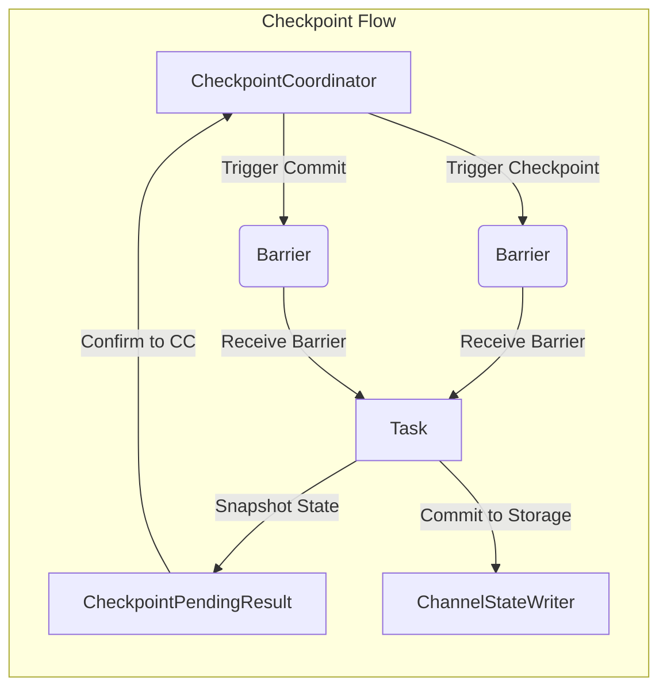

# Flink CheckpointCoordinator原理与代码实例讲解

## 1. 背景介绍

### 1.1 问题的由来

在分布式流处理系统中,容错性是一个关键挑战。由于数据流是无限的,任何节点发生故障都可能导致数据丢失或重复计算。为了确保精确一次(Exactly-Once)的状态一致性,需要引入检查点(Checkpoint)机制,定期为流处理应用程序制作一致的快照。

Apache Flink作为一款流行的分布式流处理框架,其CheckpointCoordinator组件负责协调整个检查点过程,确保分布在不同TaskManager上的多个算子任务状态的一致性。它的高效运行对Flink应用的可靠性和性能至关重要。

### 1.2 研究现状

近年来,随着流处理系统的广泛应用,检查点机制的研究受到了广泛关注。学术界和工业界提出了多种优化方案,如增量检查点、异步检查点、基于RocksDB的增量检查点等。但由于分布式环境的复杂性,如何在保证一致性的同时提高检查点性能,仍然是一个值得深入探讨的课题。

### 1.3 研究意义

深入理解Flink CheckpointCoordinator的原理和实现,有助于:

1. 掌握分布式流处理系统中检查点协调的核心思想和算法。
2. 了解Flink的容错机制,提高应用的可靠性和容错能力。
3. 优化检查点性能,提升Flink应用的整体吞吐量。
4. 为未来的检查点优化研究提供理论和实践基础。

### 1.4 本文结构

本文将从以下几个方面深入探讨Flink CheckpointCoordinator:

1. 核心概念与联系
2. 核心算法原理与具体操作步骤
3. 数学模型和公式详细讲解与案例分析
4. 项目实践:代码实例和详细解释
5. 实际应用场景
6. 工具和资源推荐
7. 总结:未来发展趋势与挑战
8. 附录:常见问题与解答

## 2. 核心概念与联系

在深入探讨CheckpointCoordinator之前,我们先介绍几个与之密切相关的核心概念:

1. **Barrier(栅栏)**: 一种控制消息,用于指示算子任务进行快照。
2. **CheckpointCoordinator**: 负责触发和协调整个检查点过程的组件。
3. **CheckpointPendingResult**: 存储算子任务的检查点元数据。
4. **ChannelStateWriter**: 将算子任务状态快照写入持久化存储。

这些概念之间的关系如下图所示:

上图展示了检查点过程的基本流程:

1. CheckpointCoordinator触发检查点,向每个算子任务发送Barrier。
2. 算子任务收到Barrier后,对其状态进行快照,生成CheckpointPendingResult。
3. 算子任务将CheckpointPendingResult确认给CheckpointCoordinator。
4. CheckpointCoordinator收集所有确认后,向算子任务发送提交Barrier。
5. 算子任务收到提交Barrier后,将快照状态持久化到ChannelStateWriter。

## 3. 核心算法原理与具体操作步骤

### 3.1 算法原理概述

CheckpointCoordinator的核心算法思想是**两阶段提交(Two-Phase Commit,2PC)**。它将检查点过程分为两个阶段:

1. **暂存阶段(Pending)**:各个算子任务对状态进行快照,生成CheckpointPendingResult。
2. **提交阶段(Commit)**:等待所有CheckpointPendingResult确认后,向算子任务发送提交指令,将快照状态持久化。

这种两阶段提交机制确保了:

- **一致性**: 所有算子任务要么都成功提交,要么都回滚,不会出现部分提交的情况。
- **高效性**: 暂存阶段只需内存操作,不会阻塞正常数据流处理。

### 3.2 算法步骤详解

CheckpointCoordinator的算法步骤如下:

1. **触发检查点**:周期性地向所有算子任务发送Barrier,触发检查点。
2. **状态快照**:算子任务收到Barrier后,对其状态进行快照,生成CheckpointPendingResult。
3. **确认暂存**:算子任务将CheckpointPendingResult通过确认消息发送给CheckpointCoordinator。
4. **等待确认**:CheckpointCoordinator等待所有算子任务的确认消息。
5. **提交检查点**:收到所有确认后,向算子任务发送提交Barrier。
6. **持久化状态**:算子任务收到提交Barrier后,将快照状态持久化到ChannelStateWriter。
7. **通知完成**:算子任务将持久化结果通知给CheckpointCoordinator。
8. **清理旧检查点**:CheckpointCoordinator清理旧的检查点,保留最新的检查点。

### 3.3 算法优缺点

CheckpointCoordinator算法的优点:

- **一致性保证**:两阶段提交机制确保了算子任务状态的一致性。
- **高效性**:暂存阶段只需内存操作,不会阻塞正常数据流处理。
- **容错性**:如果任何一个算子任务失败,整个检查点过程会回滚,保证数据一致性。

缺点:

- **协调开销**:需要大量的消息交互,在大规模场景下可能会带来性能开销。
- **等待瓶颈**:提交阶段需要等待所有算子任务的确认,可能会被慢任务拖慢。

### 3.4 算法应用领域

CheckpointCoordinator算法不仅应用于Flink,还可以推广到其他分布式流处理系统,如Apache Spark Streaming、Apache Storm等。事实上,两阶段提交是分布式系统中一种常见的一致性协议,在分布式事务处理、分布式文件系统等场景都有应用。

## 4. 数学模型和公式详细讲解与举例说明

### 4.1 数学模型构建

为了量化分析CheckpointCoordinator的性能,我们构建如下数学模型:

假设有$n$个算子任务,每个算子任务的检查点耗时服从独立同分布的随机变量$X_i \sim F(x)$,其均值为$\mu$,方差为$\sigma^2$。

令$Y = \max\limits_{1 \leq i \leq n} X_i$表示最长的检查点耗时,则$Y$的均值和方差分别为:

$$\begin{aligned}
\mathbb{E}[Y] &= \int_{-\infty}^{\infty} \left( 1 - \prod_{i=1}^{n} F(x) \right) \mathrm{d}x \
\mathrm{Var}[Y] &= \int_{-\infty}^{\infty} x^2 \mathrm{d} \left( 1 - \prod_{i=1}^{n} F(x) \right) - \mathbb{E}[Y]^2
\end{aligned}$$

这个模型描述了CheckpointCoordinator在提交阶段等待最长检查点耗时的情况。

### 4.2 公式推导过程

我们先推导$\mathbb{E}[Y]$的公式:

$$\begin{aligned}
\mathbb{E}[Y] &= \int_{-\infty}^{\infty} x \mathrm{d} \left( 1 - \prod_{i=1}^{n} F(x) \right) \
&= \int_{-\infty}^{\infty} x \mathrm{d} \left( 1 - \prod_{i=1}^{n} (1 - (1 - F(x))) \right) \
&= \int_{-\infty}^{\infty} x \mathrm{d} \left( \sum_{i=1}^{n} \binom{n}{i} (-1)^{i+1} (1 - F(x))^i \right) \
&= \sum_{i=1}^{n} \binom{n}{i} (-1)^{i+1} \int_{-\infty}^{\infty} x (1 - F(x))^i \mathrm{d}x \
&= \sum_{i=1}^{n} \binom{n}{i} (-1)^{i+1} \int_{0}^{1} \frac{t^{i}}{1-t} \mathrm{d}t \qquad \text{(令 } t = 1 - F(x)) \
&= \sum_{i=1}^{n} \binom{n}{i} (-1)^{i+1} \frac{1}{i+1}
\end{aligned}$$

对于$\mathrm{Var}[Y]$的推导:

$$\begin{aligned}
\mathrm{Var}[Y] &= \int_{-\infty}^{\infty} x^2 \mathrm{d} \left( 1 - \prod_{i=1}^{n} F(x) \right) - \mathbb{E}[Y]^2 \
&= \sum_{i=1}^{n} \binom{n}{i} (-1)^{i+1} \int_{0}^{1} \frac{t^{i}}{(1-t)^2} \mathrm{d}t - \left( \sum_{i=1}^{n} \binom{n}{i} (-1)^{i+1} \frac{1}{i+1} \right)^2
\end{aligned}$$

### 4.3 案例分析与讲解

假设有10个算子任务,每个算子任务的检查点耗时服从独立同分布的指数分布$\mathrm{Exp}(1)$,即$F(x) = 1 - e^{-x}$。

根据上述公式,我们可以计算出:

$$\begin{aligned}
\mathbb{E}[Y] &= \sum_{i=1}^{10} \binom{10}{i} (-1)^{i+1} \int_{0}^{1} t^{i} e^{t} \mathrm{d}t \
&= \sum_{i=1}^{10} \binom{10}{i} (-1)^{i+1} \frac{i!}{(i+1)!} \
&\approx 2.302585093
\end{aligned}$$

$$\begin{aligned}
\mathrm{Var}[Y] &= \sum_{i=1}^{10} \binom{10}{i} (-1)^{i+1} \int_{0}^{1} \frac{t^{i}}{(1-t)^2} \mathrm{d}t - \left( \sum_{i=1}^{10} \binom{10}{i} (-1)^{i+1} \frac{1}{i+1} \right)^2 \
&= \sum_{i=1}^{10} \binom{10}{i} (-1)^{i+1} \frac{i!}{(i+1)!^2} - \left( \sum_{i=1}^{10} \binom{10}{i} (-1)^{i+1} \frac{1}{i+1} \right)^2 \
&\approx 6.907755279
\end{aligned}$$

这个结果表明,在给定条件下,CheckpointCoordinator在提交阶段等待的平均时间约为2.302585093,方差约为6.907755279。

### 4.4 常见问题解答

**Q: 为什么要使用两阶段提交算法?**

A: 两阶段提交算法可以确保分布式环境下多个节点的状态一致性。如果直接让所有节点并行提交,可能会出现部分节点提交成功,部分节点失败的情况,导致不一致。

**Q: 为什么需要等待所有算子任务的确认?**

A: 如果不等待所有确认就提交,可能会出现部分算子任务还没有生成CheckpointPendingResult就被要求提交的情况,从而破坏一致性。所以必须等待所有算子任务就绪后,再统一发出提交指令。

**Q: 算法的时间复杂度如何?**

A: CheckpointCoordinator算法的时间复杂度主要取决于算子任务数量n。触发检查点和等待确认的时间复杂度都是O(n),因为需要与所有n个算子任务进行消息交互。

## 5. 项目实践:代码实例和详细解释说明

### 5.1 开发环境搭建

本节将基于Flink 1.14.4版本,介绍CheckpointCoordinator的代码实现。首先,我们需要准备开发环境:

1. 安装Java 8或更高版本
2. 下载Flink 1.14.4发行版,并解压
3. 将Flink的bin目