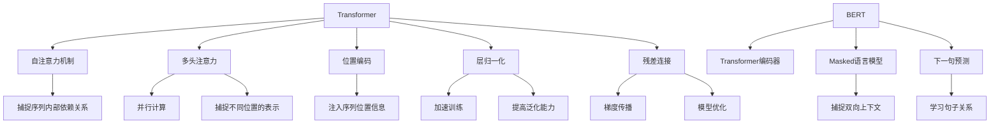

# Transformer大模型实战 汉语的BERT模型

## 1. 背景介绍

### 1.1 问题的由来

在自然语言处理(NLP)领域,机器理解人类语言一直是一个巨大的挑战。传统的NLP模型主要依赖于手工设计的特征工程,这种方法存在一些固有的缺陷,例如:

1. 特征工程耗时耗力,需要大量的人工干预。
2. 手工设计的特征往往无法很好地捕捉语义和上下文信息。
3. 针对不同的NLP任务,需要重新设计特征,缺乏通用性。

为了克服这些问题,研究人员开始探索使用深度学习技术来自动学习文本特征表示。其中,Transformer模型因其出色的性能而备受关注。

### 1.2 研究现状

2017年,Transformer模型被提出,它完全基于注意力机制,摒弃了传统序列模型中的循环神经网络和卷积神经网络结构。Transformer模型在机器翻译任务上取得了突破性的成果,极大地推动了NLP领域的发展。

随后,BERT(Bidirectional Encoder Representations from Transformers)模型应运而生。BERT是一种基于Transformer的双向编码器模型,能够有效地捕捉文本的双向上下文信息。BERT在多个NLP任务上取得了state-of-the-art的表现,成为NLP领域的里程碑式模型。

### 1.3 研究意义

BERT模型在英文NLP任务上表现卓越,但对于汉语等其他语种,由于语言结构和特点的差异,直接应用英文BERT模型往往效果不佳。因此,研究和开发针对汉语的BERT模型具有重要的理论和实践意义。

本文将深入探讨汉语BERT模型的原理、实现和应用,旨在为读者提供全面的理解和实践指导。通过学习本文,读者可以掌握以下内容:

1. 理解Transformer和BERT模型的核心概念和原理。
2. 掌握汉语BERT模型的设计和优化策略。
3. 学习如何使用汉语BERT模型进行文本表示和下游任务建模。
4. 了解汉语BERT模型在实际应用中的案例和挑战。

### 1.4 本文结构

本文将按照以下结构展开:

1. 背景介绍
2. 核心概念与联系
3. 核心算法原理与具体操作步骤
4. 数学模型和公式详细讲解与举例说明
5. 项目实践:代码实例和详细解释说明
6. 实际应用场景
7. 工具和资源推荐
8. 总结:未来发展趋势与挑战
9. 附录:常见问题与解答

## 2. 核心概念与联系

在深入探讨汉语BERT模型之前,我们需要先了解一些核心概念和它们之间的联系。

1. **Transformer**是一种全新的基于注意力机制的序列模型架构,它摒弃了传统序列模型中的循环神经网络和卷积神经网络结构,完全基于注意力机制来捕捉序列内部的依赖关系。
2. **自注意力机制**是Transformer的核心,它允许每个位置的输出向量与输入序列的其他位置进行关联,从而捕捉序列内部的长程依赖关系。
3. **多头注意力**将注意力机制进行多路分解,每一路捕捉不同位置的表示,然后将多路信息进行融合,从而提高了模型的表示能力和并行计算能力。
4. **位置编码**是为了注入序列的位置信息,因为Transformer没有像RNN那样的递归结构,无法直接获取序列的位置信息。
5. **层归一化**和**残差连接**是为了加速模型的训练convergence并提高模型的泛化能力。
6. **BERT**是一种基于Transformer的双向编码器模型,它通过**Masked语言模型**和**下一句预测**两个预训练任务,能够有效地捕捉文本的双向上下文信息,为下游的NLP任务提供强大的文本表示能力。

## 3. 核心算法原理与具体操作步骤

### 3.1 算法原理概述

汉语BERT模型的核心算法原理可以概括为以下几个方面:

1. **Transformer编码器**:BERT模型的基础架构是Transformer的编码器部分,它由多个相同的编码器层堆叠而成。每个编码器层包含两个子层:多头自注意力机制和前馈神经网络,并使用残差连接和层归一化来加速训练和提高泛化能力。
2. **Masked语言模型(MLM)**: MLM是BERT的一个预训练任务,它通过随机遮蔽部分输入tokens,然后基于其他tokens的上下文信息来预测被遮蔽的tokens。这种方式可以让BERT模型学习到双向的上下文表示。
3. **下一句预测(NSP)**: NSP是BERT的另一个预训练任务,它旨在捕捉句子之间的关系。在预训练时,BERT需要判断两个句子是否为连续的句子对。
4. **字词piece嵌入**: 为了处理汉语中的字词歧义问题,BERT采用了字词piece嵌入的方式,将每个词拆分成多个字词piece,然后对每个字词piece进行嵌入表示。
5. **模型微调**: 在完成预训练后,BERT可以通过在特定的下游NLP任务上进行微调(fine-tuning),将预训练得到的通用语言表示知识迁移到具体的任务中。

### 3.2 算法步骤详解

1. **输入表示**

   BERT的输入由三部分组成:token embeddings、segment embeddings和position embeddings。

   - Token Embeddings: 将输入序列的每个token映射到一个高维的向量空间中。对于汉语,采用了字词piece嵌入的方式,将每个词拆分成多个字词piece,然后对每个字词piece进行嵌入表示。
   - Segment Embeddings: 用于区分输入序列中不同的句子,对于单句输入,全部为0;对于句子对输入,第一句为0,第二句为1。
   - Position Embeddings: 因为Transformer没有递归结构,无法直接获取序列的位置信息,所以需要显式地添加位置编码来注入位置信息。

   最终的输入表示是这三部分的元素级求和。

2. **Transformer编码器**

   BERT使用了Transformer的编码器部分,编码器由多个相同的编码器层堆叠而成,每个编码器层包含两个子层:

   - 多头自注意力机制(Multi-Head Attention):通过计算Query、Key和Value之间的注意力权重,捕捉输入序列中不同位置之间的依赖关系。
   - 前馈神经网络(Feed-Forward Network):对每个位置的表示进行非线性映射,为模型增加更强的表示能力。

   在每个子层之后,都使用了残差连接和层归一化,以加速训练和提高泛化能力。

3. **Masked语言模型(MLM)预训练**

   MLM是BERT的一个预训练任务,具体步骤如下:

   - 随机选择输入序列中的15%的tokens进行遮蔽,其中80%的遮蔽tokens用`[MASK]`token替换,10%保持不变,10%用随机的token替换。
   - 将遮蔽后的序列输入到Transformer编码器中,获取每个位置的上下文表示。
   - 对于被遮蔽的tokens,基于其上下文表示,使用softmax分类器预测它们的原始token。

   通过MLM预训练,BERT可以学习到双向的上下文表示。

4. **下一句预测(NSP)预训练**

   NSP是BERT的另一个预训练任务,具体步骤如下:

   - 对于每个输入样本,有50%的概率是从语料库中连续的两个句子,另外50%的概率是两个无关的随机句子。
   - 将两个句子作为一个序列输入到Transformer编码器中。
   - 基于两个句子的表示,使用二元分类器预测它们是否为连续的句子对。

   通过NSP预训练,BERT可以学习到句子之间的关系表示。

5. **模型微调**

   在完成预训练后,BERT可以通过在特定的下游NLP任务上进行微调,将预训练得到的通用语言表示知识迁移到具体的任务中。微调的步骤如下:

   - 将BERT模型的输出作为特征表示,接一个输出层(分类器或回归器)。
   - 在特定的下游任务数据上,对整个模型(BERT+输出层)进行端到端的微调训练。
   - 在测试集上评估模型的性能。

### 3.3 算法优缺点

**优点**:

1. 通过预训练的方式,BERT可以学习到通用的语言表示知识,为下游任务提供强大的文本表示能力。
2. 基于Transformer的架构,BERT能够有效地捕捉长程依赖关系,并通过多头注意力机制实现并行计算。
3. MLM预训练任务可以让BERT学习到双向的上下文表示,NSP预训练任务可以捕捉句子之间的关系。
4. 字词piece嵌入的方式可以很好地处理汉语中的字词歧义问题。

**缺点**:

1. BERT模型庞大,包含大量参数,对计算资源和内存的需求较高。
2. 预训练过程耗时较长,需要消耗大量的计算资源。
3. BERT是一个静态的语言模型,无法很好地捕捉上下文的动态变化。
4. BERT的输入长度有限制,无法很好地处理超长文本序列。

### 3.4 算法应用领域

由于BERT模型强大的文本表示能力,它可以广泛应用于各种自然语言处理任务,包括但不限于:

1. **文本分类**: 新闻分类、情感分析、垃圾邮件检测等。
2. **序列标注**: 命名实体识别、关系抽取、词性标注等。
3. **问答系统**: 阅读理解、开放域问答等。
4. **文本生成**: 文本摘要、机器翻译、对话系统等。
5. **语言理解**: 语义相似度计算、语义框架预测等。
6. **信息检索**: 文本相似度计算、个性化推荐等。

## 4. 数学模型和公式详细讲解与举例说明

### 4.1 数学模型构建

在介绍BERT模型的数学模型之前,我们先来回顾一下Transformer模型中的**缩放点积注意力(Scaled Dotted-Product Attention)**机制。

缩放点积注意力是Transformer中自注意力机制的核心,它可以计算出Query和Key的注意力权重,然后将Value加权求和作为输出。具体计算过程如下:

$$\begin{aligned}
\text{Attention}(Q, K, V) &= \text{softmax}\left(\frac{QK^T}{\sqrt{d_k}}\right)V \
\text{head}_i &= \text{Attention}\left(QW_i^Q, KW_i^K, VW_i^V\right)
\end{aligned}$$

其中, $Q$、$K$、$V$分别表示Query、Key和Value;$d_k$是缩放因子,用于防止点积的值过大导致softmax的梯度较小;$W_i^Q$、$W_i^K$、$W_i^V$是可训练的投影矩阵,用于将$Q$、$K$、$V$映射到不同的子空间。

多头注意力机制(Multi-Head Attention)是将多个注意力头(head)的结果进行拼接:

$$\text{MultiHead}(Q, K, V) = \text{Concat}(\text{head}_1, \dots, \text{head}_h)W^O