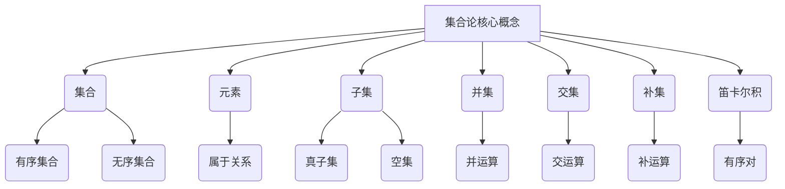
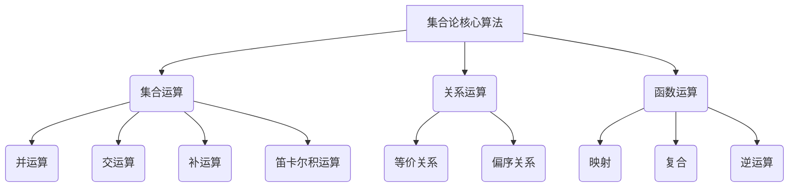

# 集合论导引：集合论模型

## 1. 背景介绍

### 1.1 问题的由来

集合论作为数学的一个基础分支,其概念和理论对于计算机科学、逻辑学、人工智能等领域有着广泛的应用和影响。它为这些领域提供了坚实的理论基础,并且为解决实际问题提供了强有力的工具和方法。然而,对于初学者来说,集合论的抽象性和复杂性往往会造成一定的障碍,使得学习和掌握集合论的基本概念和方法变得困难。

### 1.2 研究现状

目前,已有大量的教材和资源致力于阐释集合论的基本概念和理论,但大多数资源都过于学术化和专业化,缺乏对初学者友好的介绍和引导。此外,许多资源缺乏实际应用案例和可视化工具,使得学习者难以将抽象的概念与实际问题联系起来,从而影响了学习效果。

### 1.3 研究意义

集合论作为数学基础理论之一,对于计算机科学、人工智能等领域的发展至关重要。通过对集合论基本概念和理论的深入学习和掌握,可以帮助学习者更好地理解和解决实际问题,提高逻辑思维能力和抽象建模能力。因此,探索一种更加友好、直观和实用的集合论学习方式,对于培养复合型人才、促进相关领域的发展具有重要意义。

### 1.4 本文结构

本文将从集合论的基本概念和原理出发,通过实例和可视化工具,逐步引导读者掌握集合论的核心内容。文章将分为以下几个部分:

1. 背景介绍
2. 核心概念与联系
3. 核心算法原理与具体操作步骤
4. 数学模型和公式详细讲解与举例说明
5. 项目实践:代码实例和详细解释说明
6. 实际应用场景
7. 工具和资源推荐
8. 总结:未来发展趋势与挑战
9. 附录:常见问题与解答

## 2. 核心概念与联系

集合论的核心概念包括集合、元素、子集、并集、交集、补集、笛卡尔积等。这些概念相互关联,构成了集合论的基本框架。

### 2.1 集合

集合是集合论的基本概念,它是由具有某种特征的元素所构成的整体。集合可以是有序的,也可以是无序的。

### 2.2 元素

元素是构成集合的基本单位。一个元素可以属于一个或多个集合,也可以不属于任何集合。

### 2.3 子集

如果一个集合A中的所有元素都属于另一个集合B,那么A就是B的子集。子集包括真子集和集合本身。

### 2.4 并集

两个或多个集合的并集是由这些集合中所有元素构成的新集合。

### 2.5 交集

两个或多个集合的交集是由这些集合中共同元素构成的新集合。

### 2.6 补集

一个集合A相对于另一个集合B的补集是由属于B但不属于A的所有元素构成的集合。

### 2.7 笛卡尔积

两个集合A和B的笛卡尔积是由所有有序对(a,b)构成的集合,其中a属于A,b属于B。

## 3. 核心算法原理与具体操作步骤

集合论中的核心算法主要包括集合运算、关系运算和函数运算等。这些算法为处理和操作集合提供了基本的方法和工具。

### 3.1 算法原理概述

#### 3.1.1 集合运算

集合运算包括并运算、交运算、补运算和笛卡尔积运算等,它们是操作和处理集合的基本方法。

#### 3.1.2 关系运算

关系运算主要包括等价关系和偏序关系等,它们用于描述和处理集合之间的关系。

#### 3.1.3 函数运算

函数运算包括映射、复合和逆运算等,它们用于描述和处理集合之间的映射关系。

### 3.2 算法步骤详解

#### 3.2.1 并运算

并运算的步骤如下:

1. 确定需要进行并运算的集合A和B。
2. 构造一个新集合C,初始为空集。
3. 将A中的所有元素加入到C中。
4. 将B中不属于A的元素加入到C中。
5. 得到A和B的并集C。

#### 3.2.2 交运算

交运算的步骤如下:

1. 确定需要进行交运算的集合A和B。
2. 构造一个新集合C,初始为空集。
3. 遍历A中的每个元素,如果该元素也属于B,则将其加入到C中。
4. 得到A和B的交集C。

#### 3.2.3 补运算

补运算的步骤如下:

1. 确定需要进行补运算的集合A和B。
2. 构造一个新集合C,初始为空集。
3. 遍历B中的每个元素,如果该元素不属于A,则将其加入到C中。
4. 得到A相对于B的补集C。

#### 3.2.4 笛卡尔积运算

笛卡尔积运算的步骤如下:

1. 确定需要进行笛卡尔积运算的集合A和B。
2. 构造一个新集合C,初始为空集。
3. 遍历A中的每个元素a和B中的每个元素b,构造有序对(a,b),并将其加入到C中。
4. 得到A和B的笛卡尔积C。

### 3.3 算法优缺点

#### 3.3.1 优点

- 集合运算提供了处理和操作集合的基本方法,具有简单直观的特点。
- 关系运算和函数运算为描述和处理复杂的集合关系提供了工具。
- 这些算法具有良好的可扩展性,可以应用于各种场景和问题。

#### 3.3.2 缺点

- 对于大型集合,算法的时间复杂度和空间复杂度可能会较高。
- 某些算法步骤可能需要人工干预和判断,缺乏自动化能力。
- 对于一些特殊情况和边界条件,算法可能会出现错误或异常。

### 3.4 算法应用领域

集合论的核心算法在以下领域有广泛的应用:

- 数据库系统:用于数据建模、查询优化和数据操作等。
- 编译原理:用于词法分析、语法分析和代码优化等。
- 人工智能:用于知识表示、推理引擎和决策系统等。
- 密码学:用于密钥管理、加密算法和安全协议等。
- 网络系统:用于路由算法、拓扑结构和流量控制等。

## 4. 数学模型和公式详细讲解与举例说明

集合论中的数学模型和公式为描述和操作集合提供了严谨的理论基础。本节将详细介绍一些核心的数学模型和公式,并通过实例进行说明和讲解。

### 4.1 数学模型构建

#### 4.1.1 集合表示法

集合可以用列举法、描述法或使用一些特殊符号来表示。

- 列举法: $A = \{1, 2, 3, 4, 5\}$
- 描述法: $B = \{x | x \text{是偶数}\}$
- 特殊符号: $\emptyset$ 表示空集, $\mathbb{N}$ 表示自然数集合

#### 4.1.2 集合关系

两个集合A和B之间可能存在以下几种关系:

- 相等: $A = B$
- 子集: $A \subseteq B$
- 真子集: $A \subset B$
- 不相交: $A \cap B = \emptyset$

#### 4.1.3 基本运算

集合的基本运算包括并运算、交运算、补运算和笛卡尔积运算等。

- 并运算: $A \cup B = \{x | x \in A \text{ 或 } x \in B\}$
- 交运算: $A \cap B = \{x | x \in A \text{ 且 } x \in B\}$
- 补运算: $A - B = \{x | x \in A \text{ 且 } x \notin B\}$
- 笛卡尔积: $A \times B = \{(a, b) | a \in A \text{ 且 } b \in B\}$

### 4.2 公式推导过程

#### 4.2.1 交换律

对于任意集合A和B,都有:

$$
\begin{aligned}
A \cup B &= \{x | x \in A \text{ 或 } x \in B\} \
&= \{x | x \in B \text{ 或 } x \in A\} \
&= B \cup A
\end{aligned}
$$

$$
\begin{aligned}
A \cap B &= \{x | x \in A \text{ 且 } x \in B\} \
&= \{x | x \in B \text{ 且 } x \in A\} \
&= B \cap A
\end{aligned}
$$

因此,并运算和交运算都满足交换律。

#### 4.2.2 结合律

对于任意集合A、B和C,都有:

$$
\begin{aligned}
(A \cup B) \cup C &= \{x | x \in A \text{ 或 } x \in B\} \cup C \
&= \{x | x \in A \text{ 或 } x \in B \text{ 或 } x \in C\} \
&= \{x | x \in A \text{ 或 } (x \in B \text{ 或 } x \in C)\} \
&= A \cup (B \cup C)
\end{aligned}
$$

$$
\begin{aligned}
(A \cap B) \cap C &= \{x | x \in A \text{ 且 } x \in B\} \cap C \
&= \{x | x \in A \text{ 且 } x \in B \text{ 且 } x \in C\} \
&= \{x | x \in A \text{ 且 } (x \in B \text{ 且 } x \in C)\} \
&= A \cap (B \cap C)
\end{aligned}
$$

因此,并运算和交运算都满足结合律。

#### 4.2.3 分配律

对于任意集合A、B和C,都有:

$$
\begin{aligned}
A \cap (B \cup C) &= \{x | x \in A \text{ 且 } (x \in B \text{ 或 } x \in C)\} \
&= \{x | (x \in A \text{ 且 } x \in B) \text{ 或 } (x \in A \text{ 且 } x \in C)\} \
&= (A \cap B) \cup (A \cap C)
\end{aligned}
$$

$$
\begin{aligned}
A \cup (B \cap C) &= \{x | x \in A \text{ 或 } (x \in B \text{ 且 } x \in C)\} \
&= \{x | (x \in A \text{ 或 } x \in B) \text{ 且 } (x \in A \text{ 或 } x \in C)\} \
&= (A \cup B) \cap (A \cup C)
\end{aligned}
$$

因此,交运算和并运算满足分配律。

### 4.3 案例分析与讲解

#### 4.3.1 案例1: 集合运算

假设有两个集合:

$A = \{1, 2, 3, 4\}$
$B = \{3, 4, 5, 6\}$

求:

1. $A \cup B$
2. $A \cap B$
3. $A - B$
4. $A \times B$

解:

1. $A \cup B = \{1, 2, 3, 4, 5