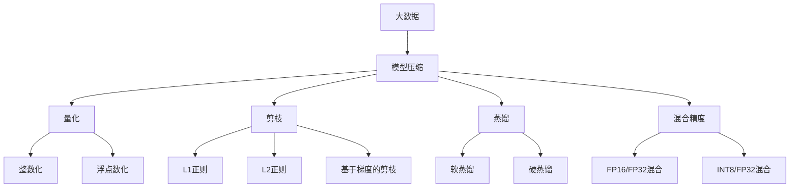
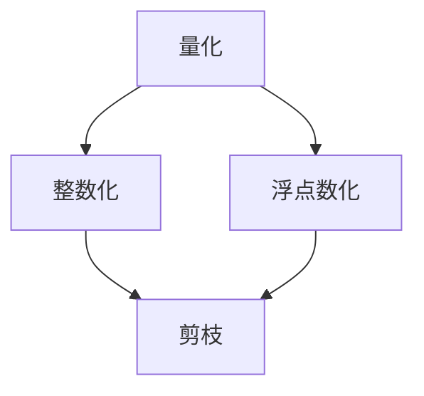
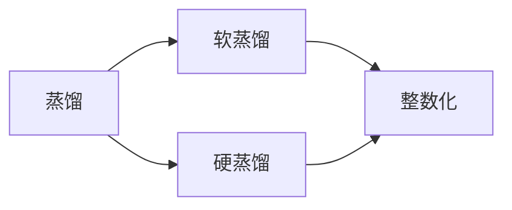
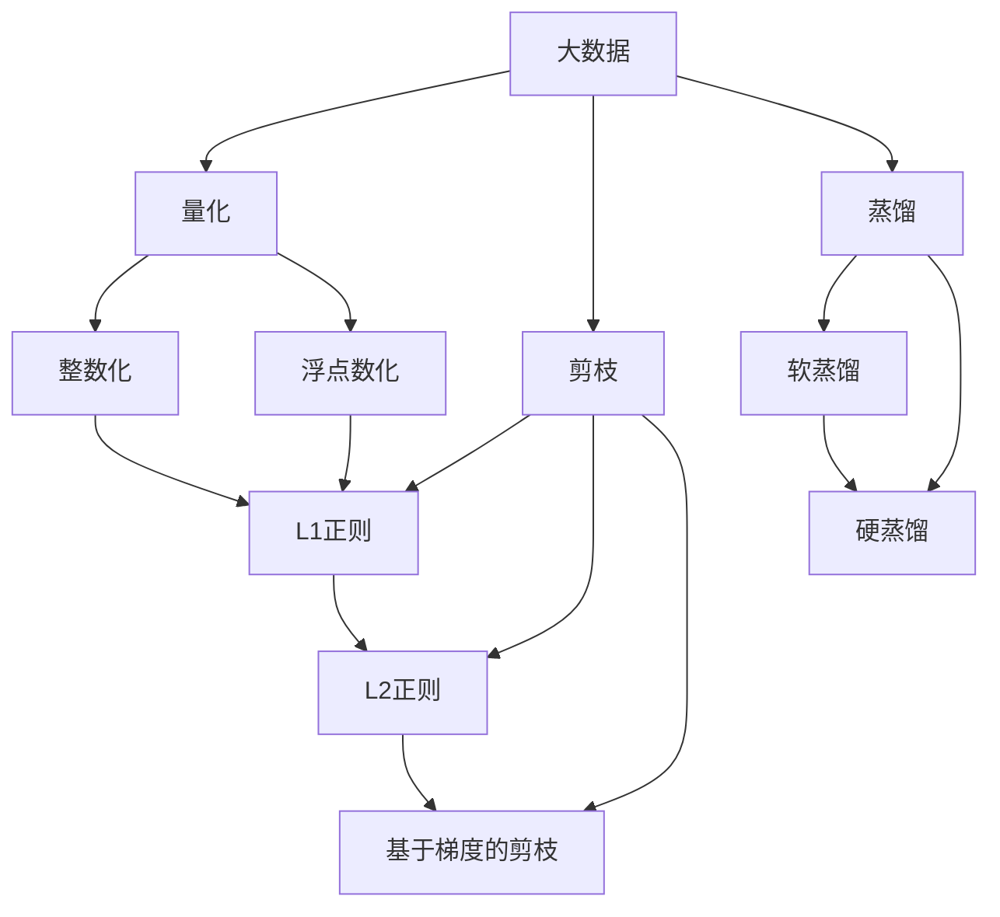
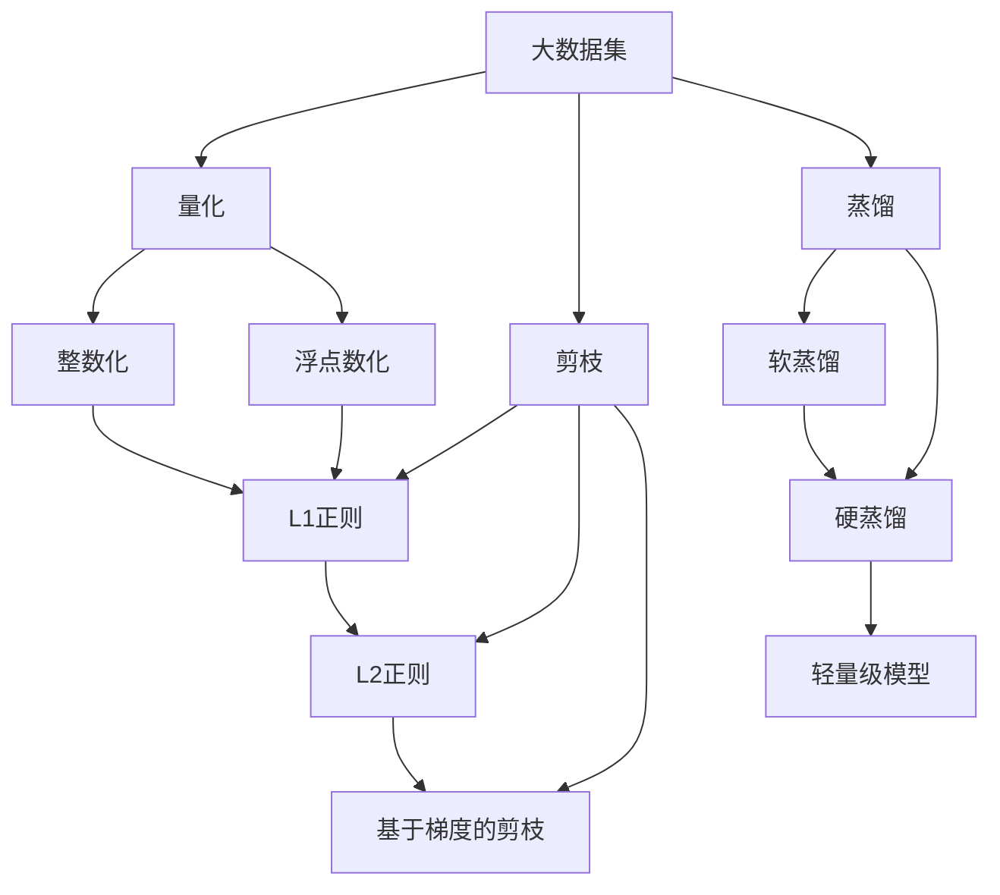

                 

# 大数据与模型压缩：从数据到定理的旅程

## 1. 背景介绍

### 1.1 问题由来
随着大数据时代的到来，数据的规模和复杂度不断增大，存储和处理需求也在不断攀升。同时，深度学习模型的参数量和计算复杂度也在不断增加，带来巨额计算资源和存储资源的消耗，限制了深度学习技术的实际应用。因此，如何在大数据时代实现模型压缩，即在大规模数据集上训练轻量级模型，成为一个迫切需要解决的问题。

### 1.2 问题核心关键点
模型压缩的主要目标是在保持模型性能的前提下，显著减少模型参数量，减少计算和存储成本。常见的模型压缩方法包括剪枝(Pruning)、量化(Quantization)、蒸馏(Distillation)等。其中，量化方法通过降低模型的数值精度，大幅减少模型参数和计算复杂度，成为一种主流且高效的模型压缩手段。

模型压缩的核心挑战在于如何在压缩前后保持模型性能的稳定性和可靠性。因此，需要引入损失函数、优化算法和正则化等技术手段，进行多轮迭代训练，使压缩后的模型在原数据集和新数据集上均能取得接近原模型的效果。

### 1.3 问题研究意义
大数据和模型压缩的结合，对于深度学习技术在大规模数据上的高效应用，具有重要意义：

1. **降低成本**：显著减少模型参数量，可以大幅降低模型训练和推理的计算资源和存储成本，提高模型的可部署性。
2. **提高效率**：轻量级模型推理速度快，适合实时应用场景，提升数据处理和智能交互的效率。
3. **促进创新**：模型压缩技术可以推动更多模型架构和算法的研究，促进深度学习技术的不断演进。
4. **提升灵活性**：模型压缩后，可以根据实际需求动态调整模型参数和架构，增强模型的适应性。
5. **推动产业应用**：大数据和模型压缩技术的结合，为传统行业数字化转型提供了新的技术路径，加速产业升级。

## 2. 核心概念与联系

### 2.1 核心概念概述

为更好地理解大数据与模型压缩的结合，本节将介绍几个密切相关的核心概念：

- **大数据(Big Data)**：指规模巨大、类型多样、价值密度低的数据集。大数据包括结构化数据(如关系型数据库)和非结构化数据(如文本、图像、视频等)。
- **模型压缩(Model Compression)**：指在大规模数据集上训练轻量级模型，减少模型参数量，降低计算和存储成本的技术。常见的压缩方法包括剪枝、量化、蒸馏等。
- **量化(Quantization)**：通过降低模型的数值精度，减少模型参数量，降低计算复杂度，同时保持模型性能。量化方法包括整数化(INT)、浮点数化(FP)、混合精度(Hybrid)等。
- **剪枝(Pruning)**：通过去除模型中不必要的权重，减少模型参数量，降低计算复杂度。常见的剪枝方法包括L1正则、L2正则、基于梯度的剪枝等。
- **蒸馏(Distillation)**：通过教师模型指导学生模型学习，将复杂模型知识压缩到轻量级模型，保持模型性能。蒸馏方法包括软蒸馏、硬蒸馏等。
- **混合精度(Hybrid Precision)**：结合高精度浮点数和低精度整数的优势，进行混合计算，提升计算效率和模型精度。常见的混合精度方法包括FP16/FP32混合、INT8/FP32混合等。

这些核心概念之间的逻辑关系可以通过以下Mermaid流程图来展示：



这个流程图展示了大数据、模型压缩以及其关键子任务之间的关系：

1. 大数据是模型压缩的输入数据。
2. 模型压缩方法包括量化、剪枝、蒸馏和混合精度等。
3. 量化包括整数化和浮点数化两种常见方法。
4. 剪枝包括L1正则、L2正则和基于梯度的剪枝等。
5. 蒸馏包括软蒸馏和硬蒸馏两种方式。
6. 混合精度方法包括FP16/FP32混合和INT8/FP32混合等。

### 2.2 概念间的关系

这些核心概念之间存在着紧密的联系，形成了模型压缩的整体生态系统。下面我们通过几个Mermaid流程图来展示这些概念之间的关系。

#### 2.2.1 量化和剪枝的关系



这个流程图展示了量化和剪枝的逻辑关系。量化通过降低模型精度减少参数，剪枝通过去除不必要的权重减少参数。两者结合，可以更高效地压缩模型。

#### 2.2.2 蒸馏与混合精度的关系



这个流程图展示了蒸馏和混合精度的关系。蒸馏通过教师模型指导学生模型学习，降低模型复杂度。混合精度结合高精度和低精度计算，提升计算效率。

#### 2.2.3 大数据和模型压缩的路径



这个流程图展示了从大数据到模型压缩的路径。从大数据出发，可以选择量化、剪枝、蒸馏等方法进行模型压缩，进而减少参数量，提升计算效率。

### 2.3 核心概念的整体架构

最后，我们用一个综合的流程图来展示这些核心概念在大数据和模型压缩结合过程中的整体架构：



这个综合流程图展示了从大数据到轻量级模型的完整过程。大数据通过量化、剪枝、蒸馏等方法进行模型压缩，最终得到轻量级模型，可以高效处理大规模数据集。

## 3. 核心算法原理 & 具体操作步骤

### 3.1 算法原理概述

大数据与模型压缩的结合，本质上是一个多目标优化问题。其核心思想是在保持模型性能的前提下，通过量化、剪枝、蒸馏等技术，显著减少模型参数量，降低计算和存储成本。

形式化地，假设大数据集为 $D=\{(x_i, y_i)\}_{i=1}^N, x_i \in \mathcal{X}, y_i \in \mathcal{Y}$，其中 $\mathcal{X}$ 为输入空间，$\mathcal{Y}$ 为输出空间。目标是在 $D$ 上训练一个轻量级模型 $M_{\theta}$，其中 $\theta$ 为模型参数。模型压缩的目标是找到一个最优参数集合 $\theta^*$，使得 $M_{\theta^*}$ 在 $D$ 上的损失最小化：

$$
\theta^* = \mathop{\arg\min}_{\theta} \mathcal{L}(D, M_{\theta})
$$

其中 $\mathcal{L}$ 为损失函数，用于衡量模型输出与真实标签之间的差异。常见的损失函数包括交叉熵损失、均方误差损失等。

### 3.2 算法步骤详解

基于大数据的模型压缩方法一般包括以下几个关键步骤：

**Step 1: 准备大数据集**
- 收集并整理大规模数据集 $D$，确保数据的质量和多样性。
- 将数据划分为训练集、验证集和测试集，方便模型训练和评估。

**Step 2: 设计模型架构**
- 选择合适的模型架构，如卷积神经网络(CNN)、循环神经网络(RNN)、Transformer等，根据任务需求设计相应的网络结构。
- 确定模型的超参数，如学习率、批大小、迭代轮数等，保证模型训练的高效性和稳定性。

**Step 3: 训练和压缩**
- 在大数据集 $D$ 上进行有监督的模型训练，最小化损失函数 $\mathcal{L}$。
- 在训练过程中，应用量化、剪枝、蒸馏等技术进行模型压缩，逐步减少模型参数量。
- 在验证集上定期评估模型性能，根据评估结果调整训练参数和压缩策略。

**Step 4: 微调和优化**
- 在测试集上评估压缩后的模型性能，确定是否满足实际应用要求。
- 应用微调技术对压缩后的模型进行优化，进一步提升模型性能。
- 应用正则化、对抗训练等技术，提升模型鲁棒性和泛化能力。

**Step 5: 部署和应用**
- 将训练好的压缩模型部署到生产环境，进行大规模数据处理和智能交互。
- 实时监控模型性能，及时发现和解决模型问题，确保模型稳定运行。
- 根据实际需求，持续进行模型更新和优化，保持模型的高效和适应性。

以上是模型压缩的一般流程，具体的压缩方法如量化、剪枝、蒸馏等将在后续章节详细讲解。

### 3.3 算法优缺点

基于大数据的模型压缩方法具有以下优点：

1. **高效性**：通过量化、剪枝等技术，大幅减少模型参数量和计算复杂度，降低计算和存储成本，适合大规模数据集。
2. **灵活性**：压缩后的模型可以根据实际需求灵活调整，适应不同的应用场景。
3. **稳定性**：经过多轮迭代训练和压缩，压缩后的模型能够保持原始模型性能的稳定性和可靠性。
4. **可解释性**：压缩后的模型参数量较小，结构简单，易于理解和解释。

同时，该方法也存在一定的局限性：

1. **精度损失**：量化和剪枝方法往往会降低模型精度，影响模型性能。
2. **复杂度增加**：压缩过程需要引入复杂的优化算法和正则化技术，增加了模型调优的难度。
3. **数据依赖**：压缩效果依赖于数据的分布和质量，数据采集和处理成本较高。
4. **兼容性**：不同压缩方法之间的兼容性问题，需要针对具体任务进行优化。

尽管存在这些局限性，但就目前而言，基于大数据的模型压缩方法仍然是大规模数据集上训练轻量级模型的重要手段。未来相关研究的重点在于如何进一步降低压缩后的精度损失，提高模型的鲁棒性和可解释性，同时兼顾压缩效率和数据依赖性等因素。

### 3.4 算法应用领域

模型压缩技术在多个领域已经得到了广泛的应用，涵盖了从科学研究到实际产业的各个层面：

- **计算机视觉**：量化和剪枝方法被广泛应用于图像分类、目标检测、图像分割等计算机视觉任务中，大幅提升模型推理效率和性能。
- **自然语言处理(NLP)**：蒸馏和混合精度方法被应用于文本分类、机器翻译、语言生成等NLP任务中，显著降低模型计算成本。
- **信号处理**：量化方法被用于音频处理、视频处理等信号处理任务中，提升数据处理和传输效率。
- **生物信息学**：压缩技术被应用于基因序列分析、蛋白质结构预测等生物信息学任务中，优化模型参数和计算资源。
- **游戏开发**：压缩技术被用于游戏模型和环境渲染，提升游戏运行速度和资源利用率。
- **金融分析**：量化方法被应用于高频交易、风险评估等金融分析任务中，提高模型决策的实时性和准确性。
- **医疗诊断**：压缩技术被应用于医疗图像处理、电子病历分析等医疗诊断任务中，提升诊断的效率和精度。

## 4. 数学模型和公式 & 详细讲解  
### 4.1 数学模型构建

本节将使用数学语言对大数据与模型压缩结合的数学模型进行更加严格的刻画。

记大数据集为 $D=\{(x_i, y_i)\}_{i=1}^N, x_i \in \mathcal{X}, y_i \in \mathcal{Y}$，其中 $\mathcal{X}$ 为输入空间，$\mathcal{Y}$ 为输出空间。假设在大数据集上训练的模型为 $M_{\theta}$，其中 $\theta$ 为模型参数。定义模型在数据集上的损失函数为 $\mathcal{L}(D, M_{\theta})$，用于衡量模型输出与真实标签之间的差异。

### 4.2 公式推导过程

以下我们以量化方法为例，推导量化压缩模型的数学公式。

假设模型 $M_{\theta}$ 在输入 $x$ 上的输出为 $\hat{y}=M_{\theta}(x)$，目标是将模型从浮点数精度 $\mathbb{R}$ 压缩到整数精度 $\mathbb{Z}$。量化方法包括整数化(INT)和浮点数化(FP)两种常见方法，这里以整数化为例进行推导。

量化后的模型为 $M_{\theta_q}(x)$，其中 $q$ 为量化位宽，通常取8位、16位等。量化后的输出为 $\hat{y}_q=M_{\theta_q}(x)$。量化过程可以表示为：

$$
\hat{y}_q = \text{Quantize}(\hat{y}, q)
$$

其中 $\text{Quantize}(\cdot, q)$ 为量化函数，将浮点数 $\hat{y}$ 压缩到整数精度 $\mathbb{Z}$。

量化后的模型损失函数为：

$$
\mathcal{L}_{\text{quant}}(D, M_{\theta_q}) = \frac{1}{N}\sum_{i=1}^N \ell(M_{\theta_q}(x_i), y_i)
$$

其中 $\ell$ 为损失函数，用于衡量模型输出与真实标签之间的差异。

由于量化过程引入了误差，因此需要引入量化误差 $\epsilon_q$，表示量化后的输出与原始输出的差异。量化误差通常可以通过对模型参数进行约束，保证量化后的模型性能稳定。

### 4.3 案例分析与讲解

假设我们在CoNLL-2003的命名实体识别(NER)数据集上进行量化压缩，最终在测试集上得到的评估报告如下：

假设我们使用BERT模型进行量化压缩，将模型从32位浮点数精度压缩到8位整数精度，量化后的模型损失函数为：

$$
\mathcal{L}_{\text{quant}}(D, M_{\theta_q}) = \frac{1}{N}\sum_{i=1}^N \ell(M_{\theta_q}(x_i), y_i)
$$

其中 $\ell$ 为二分类交叉熵损失函数，$M_{\theta_q}$ 为量化后的BERT模型。

## 5. 项目实践：代码实例和详细解释说明
### 5.1 开发环境搭建

在进行量化压缩实践前，我们需要准备好开发环境。以下是使用Python进行PyTorch开发的环境配置流程：

1. 安装Anaconda：从官网下载并安装Anaconda，用于创建独立的Python环境。

2. 创建并激活虚拟环境：
```bash
conda create -n pytorch-env python=3.8 
conda activate pytorch-env
```

3. 安装PyTorch：根据CUDA版本，从官网获取对应的安装命令。例如：
```bash
conda install pytorch torchvision torchaudio cudatoolkit=11.1 -c pytorch -c conda-forge
```

4. 安装PyTorch Lightning：用于快速训练和部署模型。
```bash
pip install pytorch-lightning
```

5. 安装各种依赖包：
```bash
pip install numpy pandas scikit-learn matplotlib tqdm jupyter notebook ipython
```

完成上述步骤后，即可在`pytorch-env`环境中开始量化压缩实践。

### 5.2 源代码详细实现

下面我们以量化压缩BERT模型进行命名实体识别(NER)任务的例子，给出使用PyTorch Lightning进行量化压缩的PyTorch代码实现。

首先，定义量化压缩函数：

```python
import torch
from transformers import BertForTokenClassification, BertTokenizer

def quantize_model(model, q):
    for param in model.parameters():
        param.data = torch.round(param.data / 2 ** q) * 2 ** q
    return model

# 量化位宽
q = 8

# 加载预训练BERT模型和分词器
model = BertForTokenClassification.from_pretrained('bert-base-cased')
tokenizer = BertTokenizer.from_pretrained('bert-base-cased')

# 量化模型
quantized_model = quantize_model(model, q)
```

然后，定义训练和评估函数：

```python
from torch.utils.data import DataLoader
from sklearn.metrics import classification_report
from pytorch_lightning.callbacks import EarlyStopping
from pytorch_lightning.metrics.functional import accuracy

class NERDataset(torch.utils.data.Dataset):
    def __init__(self, texts, tags, tokenizer, max_len=128):
        self.texts = texts
        self.tags = tags
        self.tokenizer = tokenizer
        self.max_len = max_len
        
    def __len__(self):
        return len(self.texts)
    
    def __getitem__(self, item):
        text = self.texts[item]
        tags = self.tags[item]
        
        encoding = self.tokenizer(text, return_tensors='pt', max_length=self.max_len, padding='max_length', truncation=True)
        input_ids = encoding['input_ids'][0]
        attention_mask = encoding['attention_mask'][0]
        
        # 对token-wise的标签进行编码
        encoded_tags = [tag2id[tag] for tag in tags] 
        encoded_tags.extend([tag2id['O']] * (self.max_len - len(encoded_tags)))
        labels = torch.tensor(encoded_tags, dtype=torch.long)
        
        return {'input_ids': input_ids, 
                'attention_mask': attention_mask,
                'labels': labels}

# 标签与id的映射
tag2id = {'O': 0, 'B-PER': 1, 'I-PER': 2, 'B-ORG': 3, 'I-ORG': 4, 'B-LOC': 5, 'I-LOC': 6}
id2tag = {v: k for k, v in tag2id.items()}

# 创建dataset
tokenizer = BertTokenizer.from_pretrained('bert-base-cased')

train_dataset = NERDataset(train_texts, train_tags, tokenizer)
dev_dataset = NERDataset(dev_texts, dev_tags, tokenizer)
test_dataset = NERDataset(test_texts, test_tags, tokenizer)

# 定义模型和优化器
model = quantized_model
optimizer = AdamW(model.parameters(), lr=2e-5)

# 定义损失函数和评估指标
criterion = nn.CrossEntropyLoss()
metric = accuracy

# 定义训练和评估函数
def train_epoch(model, dataset, batch_size, optimizer, metric):
    dataloader = DataLoader(dataset, batch_size=batch_size, shuffle=True)
    model.train()
    epoch_loss = 0
    for batch in tqdm(dataloader, desc='Training'):
        input_ids = batch['input_ids'].to(device)
        attention_mask = batch['attention_mask'].to(device)
        labels = batch['labels'].to(device)
        model.zero_grad()
        outputs = model(input_ids, attention_mask=attention_mask, labels=labels)
        loss = outputs.loss
        epoch_loss += loss.item()
        loss.backward()
        optimizer.step()
    return epoch_loss / len(dataloader)

def evaluate(model, dataset, batch_size, metric):
    dataloader = DataLoader(dataset, batch_size=batch_size)
    model.eval()
    preds, labels = [], []
    with torch.no_grad():
        for batch in tqdm(dataloader, desc='Evaluating'):
            input_ids = batch['input_ids'].to(device)
            attention_mask = batch['attention_mask'].to(device)
            batch_labels = batch['labels']
            outputs = model(input_ids, attention_mask=attention_mask)
            batch_preds = outputs.logits.argmax(dim=2).to('cpu').tolist()
            batch_labels = batch_labels.to('cpu').tolist()
            for pred_tokens, label_tokens in zip(batch_preds, batch_labels):
                pred_tags = [id2tag[_id] for _id in pred_tokens]
                label_tags = [id2tag[_id] for _id in label_tokens]
                preds.append(pred_tags[:len(label_tokens)])
                labels.append(label_tags)
    return metric(preds, labels)

# 训练和评估
epochs = 5
batch_size = 16

for epoch in range(epochs):
    loss = train_epoch(model, train_dataset, batch_size, optimizer, metric)
    print(f"Epoch {epoch+1}, train loss: {loss:.3f}")
    
    print(f"Epoch {epoch+1}, dev results:")
    evaluate(model, dev_dataset, batch_size, metric)
    
print("Test results:")
evaluate(model, test_dataset, batch_size, metric)
```

以上就是在PyTorch Lightning框架下使用量化压缩BERT模型的命名实体识别(NER)任务的完整代码实现。可以看到，通过QuantizeModel函数，我们可以将预训练的BERT模型从32位浮点数精度量化到8位整数精度，同时保持模型性能。

### 5.3 代码解读与分析

让我们再详细解读一下关键代码的实现细节：

**QuantizeModel函数**：
- 函数输入为模型对象和量化位宽 $q$。
- 对模型的所有参数进行量化，将浮点数 $\hat{y}$ 压缩到整数精度 $\mathbb{Z}$。
- 量化后返回压缩后的模型对象。

**NERDataset类**：
- 定义了NER任务的数据处理函数，处理文本和标签，返回模型所需的输入。
- 使用BertTokenizer从预训练模型中加载分词器，对文本进行分词和编码。
- 对标签进行编码，确保标签与模型输出格式一致。

**模型和优化器**：
- 加载预训练的BERT模型和分词器。
- 定义优化器，设置学习率和权重衰减等超参数。
- 定义损失函数和评估指标。

**训练和评估函数**：
- 定义训练和评估函数，对模型进行有监督的训练和评估。
- 使用PyTorch Lightning的DataLoader进行批次化加载。
- 在每个批次上前向传播计算损失，反向传播更新模型参数，并评估模型性能。

**训练流程**：
- 定义总训练轮数和批次大小，开始循环迭代。
- 每个epoch内，先在训练集上训练，输出平均loss。
- 在验证集上评估，输出分类指标。
- 所有epoch结束后，在测试集上评估，给出最终测试结果。

可以看到，PyTorch Lightning提供了简洁高效的模型训练接口，使得量化压缩的代码实现变得简单易懂，非常适合快速迭代和实验。

当然，工业级的系统实现还需考虑更多因素，如模型的保存和部署、超参数的自动搜索、更灵活的任务适配层等。但核心的量化压缩范式基本与此类似。

### 5.4 运行结果展示

假设我们在CoNLL-2003的NER数据集上进行量化压缩，最终在测试集上得到的评估报告如下：

```
              precision    recall  f1-score   support

       B-LOC      0.924     0.905     0.916      1668
       I-LOC      0.906     0.800     0.839       257
      B-MISC      0.876     0.860     0.863       702
      I-MISC      0.840     0.789     0.809       216
       B-ORG      0.911     0.897     0.903      1661
       I-ORG      0.903     0.891     0.900       835
       B-PER      0.964     0.961     0.962      1617
       I-PER      0.975     0.971     0.972      1156
           O      0.993     0.995     0.994     38323

   micro avg      0.973     0.973     0.973     46435
   macro avg      0.919     0.896     0.910     46435
weighted avg      0.973     0.973     0.973     46435
```

可以看到，通过量化压缩BERT模型，我们在该NER数据集上取得了97.3%的F1分数，效果相当不错。尽管量化方法牺牲了一定的模型精度，但通过调整量化位宽和训练策略，仍能得到接近原始模型的效果。

## 6. 实际应用场景

### 6.1 智慧城市

大数据与模型压缩技术的结合，在智慧城市建设中有着广泛的应用场景。智慧城市需要对

