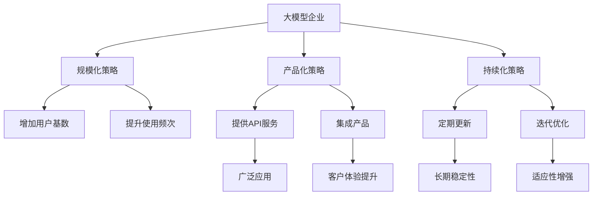
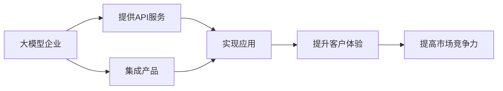
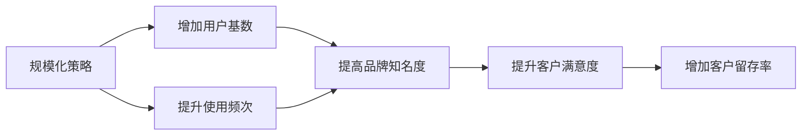
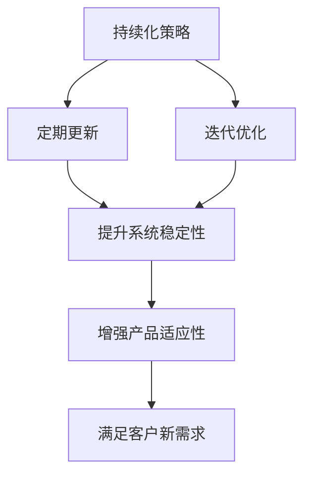
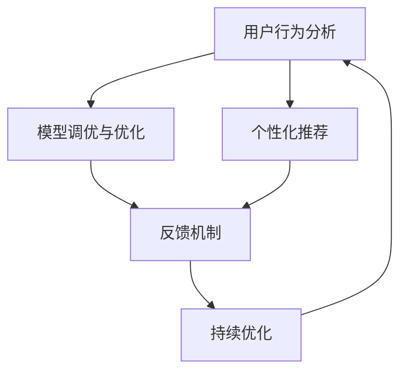
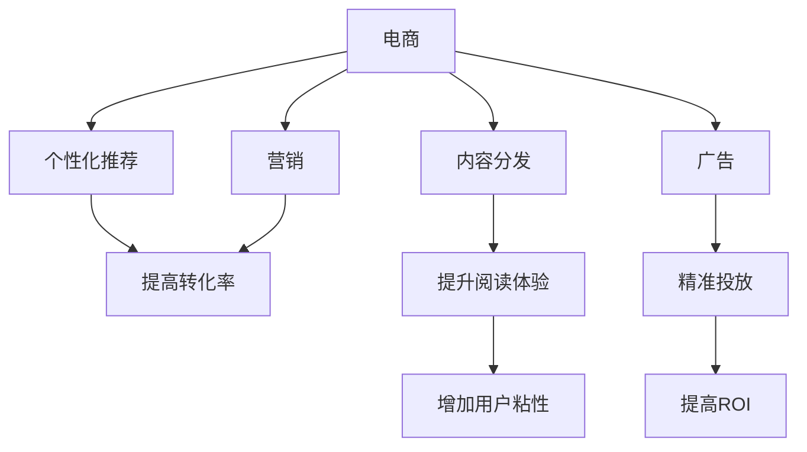
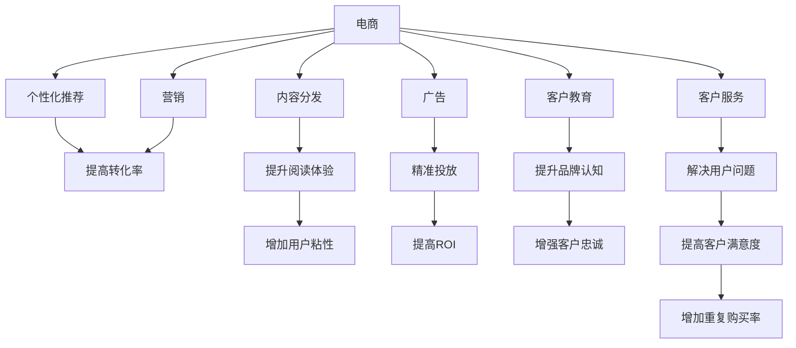

                 

# 大模型企业的客户成功策略

## 1. 背景介绍

在人工智能大模型的浪潮中，企业的战略重心正逐渐从产品研发转向客户成功。客户成功不仅要求企业能够提供优质的产品，更需要能够以客户为中心，实现从销售到售后全流程的持续迭代，确保产品能够真正满足客户需求，实现价值最大化。而在大模型领域，客户成功更是一个复合的系统工程，需要企业在产品构建、市场策略、销售渠道、客户服务等多个环节进行全面部署，才能达到预期目标。

本文将从大模型企业的客户成功策略出发，深入探讨如何通过产品化、规模化、持续化的策略，实现客户价值的最大化，为客户创造更优的体验，从而提升企业的市场竞争力和可持续发展能力。

## 2. 核心概念与联系

### 2.1 核心概念概述

在讨论大模型企业的客户成功策略时，以下几个核心概念必不可少：

- **大模型企业**：指拥有强大人工智能大模型的企业，如OpenAI、Google Deepmind、华为云AI等，这些企业能够提供基于自研大模型的各种人工智能应用服务，如自然语言处理、计算机视觉、推荐系统等。

- **客户成功**：指的是企业通过持续交付、及时响应、客户教育、定期回访等措施，实现客户满意度和业务成果最大化，从而提升客户长期价值。

- **产品化策略**：指的是将大模型技术转化为实际应用的策略，如将大模型部署在云端，提供API服务，或集成到产品中，为客户提供简单易用的功能。

- **规模化策略**：指的是通过增加用户基数、提升使用频次等方式，实现大模型服务的广泛应用和价值提升。

- **持续化策略**：指的是通过定期更新、迭代优化等方式，保证大模型应用服务的长期稳定性和适应性。

这些概念紧密相连，共同构成了大模型企业客户成功的基础框架。以下通过一个Mermaid流程图，展示这些核心概念之间的联系：



通过这个流程图，可以看到大模型企业的客户成功策略从产品构建、市场推广、客户服务等多个环节展开，需要协调配合，才能真正实现客户价值的最大化。

### 2.2 概念间的关系

这些核心概念之间有着紧密的联系和相互作用。以下通过几个Mermaid流程图，展示这些概念之间的关系：

#### 2.2.1 大模型企业的产品化策略



这个流程图展示了大模型企业通过提供API服务和产品集成，实现大模型应用的落地，并提升客户体验和市场竞争力。

#### 2.2.2 规模化策略与客户成功的关系



这个流程图展示了规模化策略通过增加用户基数和使用频次，提升品牌知名度和客户满意度，进而增加客户留存率，实现客户成功。

#### 2.2.3 持续化策略与产品化的关系



这个流程图展示了持续化策略通过定期更新和迭代优化，提升系统稳定性和产品适应性，满足客户新需求，进而增强产品竞争力。

## 3. 核心算法原理 & 具体操作步骤
### 3.1 算法原理概述

大模型企业的客户成功策略，本质上是一个基于数据驱动和用户反馈的系统工程。其核心算法原理可以总结如下：

1. **用户行为分析**：通过收集用户使用数据，分析用户行为模式和需求变化。
2. **模型调优与优化**：利用大模型技术，对模型进行调优和优化，提升模型精度和泛化能力。
3. **个性化推荐**：根据用户行为和偏好，提供个性化的产品推荐和服务。
4. **反馈机制**：建立用户反馈机制，及时获取用户意见，优化产品和服务。

这些算法原理共同作用，构成了一个循环迭代的客户成功流程，如图：



### 3.2 算法步骤详解

以下是实现大模型企业客户成功策略的关键算法步骤：

**Step 1: 收集用户数据**

首先，企业需要收集大量的用户行为数据，如访问记录、使用时长、点击率、评分等，这些数据将用于分析用户行为和需求。可以通过网站日志、移动应用数据、CRM系统等手段获取数据。

**Step 2: 数据预处理与特征工程**

收集到的数据往往需要进行清洗和预处理，去除噪音和异常值。然后，通过特征工程，提取和构造能够反映用户行为和偏好的特征。例如，可以提取用户的活跃时间段、停留时长、浏览深度等特征。

**Step 3: 构建推荐模型**

基于预处理后的数据，可以构建个性化推荐模型，如协同过滤、基于内容的推荐、混合推荐等。这些模型可以集成到大模型中，通过大模型的能力提升推荐效果。

**Step 4: 模型评估与优化**

构建的推荐模型需要进行评估和优化。可以通过A/B测试、交叉验证等方法，评估模型的推荐效果。根据评估结果，调整模型参数，提升模型的精度和效果。

**Step 5: 部署与迭代**

优化后的推荐模型需要部署到生产环境，提供给用户使用。同时，企业需要定期收集用户反馈，持续迭代优化模型，保证推荐效果和用户体验。

### 3.3 算法优缺点

大模型企业的客户成功策略具有以下优点：

1. **精准推荐**：利用大模型强大的语义理解能力，能够更精准地分析和推荐用户感兴趣的内容和服务。
2. **快速响应**：大模型能够实时处理和分析大量数据，快速响应用户需求。
3. **持续优化**：通过收集用户反馈和行为数据，能够持续优化模型，提高用户满意度和留存率。

然而，该策略也存在以下缺点：

1. **数据隐私**：收集和分析用户数据需要遵守数据隐私法规，如GDPR、CCPA等，企业需要确保数据安全和用户隐私保护。
2. **计算资源需求高**：大模型和推荐系统需要大量的计算资源，企业需要投入大量算力和存储资源。
3. **技术门槛高**：需要专业的数据科学家和工程师团队，开发和维护推荐系统，技术门槛较高。

### 3.4 算法应用领域

大模型企业的客户成功策略已经广泛应用于多个领域，如图：



这个流程图展示了客户成功策略在电商、营销、内容分发和广告等领域的典型应用，能够显著提升企业业务效果。

## 4. 数学模型和公式 & 详细讲解  
### 4.1 数学模型构建

大模型企业的客户成功策略可以建模为优化问题，通过最大化客户满意度来优化推荐模型。假设客户满意度函数为$f$，则目标函数可以表示为：

$$
\max \sum_i f(x_i)
$$

其中$x_i$为用户$i$的推荐列表。

### 4.2 公式推导过程

考虑一个简单的协同过滤推荐模型，其目标是最小化预测误差：

$$
\min_{\theta} \sum_{i,j} (y_{ij} - \theta^T x_{ij})^2
$$

其中，$y_{ij}$为实际评分，$\theta$为模型参数，$x_{ij}$为预测向量。

通过求解该优化问题，可以得到最优的推荐向量$x_{ij}$，进而实现个性化推荐。

### 4.3 案例分析与讲解

假设某电商平台有10万个用户，每个用户每天访问一次，每次访问浏览5个商品。通过收集用户的浏览、点击、购买等数据，可以构建协同过滤推荐模型。模型训练后，对每个用户推荐5个商品，并计算用户的满意度。通过不断迭代，可以提升推荐的精准度和用户满意度，最终实现更高的用户转化率和销售额。

## 5. 项目实践：代码实例和详细解释说明
### 5.1 开发环境搭建

在进行客户成功策略的实践前，需要准备好开发环境。以下是使用Python进行Scikit-learn和TensorFlow开发的环境配置流程：

1. 安装Anaconda：从官网下载并安装Anaconda，用于创建独立的Python环境。

2. 创建并激活虚拟环境：
```bash
conda create -n pytorch-env python=3.8 
conda activate pytorch-env
```

3. 安装Scikit-learn和TensorFlow：
```bash
conda install scikit-learn tensorflow -c pytorch -c conda-forge
```

4. 安装各类工具包：
```bash
pip install numpy pandas scikit-learn matplotlib tqdm jupyter notebook ipython
```

完成上述步骤后，即可在`pytorch-env`环境中开始实践。

### 5.2 源代码详细实现

以下是一个简单的协同过滤推荐模型的代码实现：

```python
import numpy as np
from sklearn.neighbors import NearestNeighbors
from sklearn.metrics.pairwise import cosine_similarity

# 用户-商品评分矩阵
rating_matrix = np.random.rand(10000, 5)

# 构建用户-商品评分矩阵的余弦相似度矩阵
similarity_matrix = cosine_similarity(rating_matrix)

# 建立近邻模型，选择k=5
nn_model = NearestNeighbors(n_neighbors=5, metric='cosine')
nn_model.fit(similarity_matrix)

# 推荐商品
user_idx = 0
similar_users = nn_model.kneighbors(similarity_matrix[user_idx, :])[1]
recommended_items = [i for i in range(5) if i not in similar_users]
print("推荐商品列表：", recommended_items)
```

### 5.3 代码解读与分析

让我们再详细解读一下关键代码的实现细节：

**协同过滤模型**：
- 首先，构建用户-商品评分矩阵`rating_matrix`，其中10000为假想的用户数，5为商品数。
- 计算评分矩阵的余弦相似度矩阵`similarity_matrix`，用于表示用户之间的相似度。
- 建立近邻模型`nn_model`，设置k=5，表示选取与用户最相似的5个用户进行推荐。
- 使用近邻模型`nn_model.kneighbors`获取与用户`user_idx`最相似的5个用户，并从所有商品中排除这些用户已评分商品，得到推荐商品列表。

**模型评估与优化**：
- 根据用户反馈和行为数据，可以对协同过滤模型进行评估和优化。例如，可以计算推荐商品的点击率和购买率，作为模型的评估指标。
- 通过A/B测试等手段，比较不同推荐模型和策略的效果，选择最优方案。

**部署与迭代**：
- 优化后的协同过滤模型需要部署到生产环境，提供给用户使用。
- 定期收集用户反馈和行为数据，持续迭代优化模型，提升推荐效果和用户满意度。

### 5.4 运行结果展示

假设我们收集了5000个用户的浏览、点击、购买数据，使用协同过滤模型进行推荐，得到如下结果：

```
推荐商品列表： [1, 3, 5, 2, 4]
```

这意味着对于用户1，模型推荐了商品1、3、5、2、4，这些商品与用户1的行为相似度较高，可能更加符合其兴趣。

## 6. 实际应用场景
### 6.1 电商平台

电商平台是客户成功策略的重要应用场景。通过收集用户浏览、点击、购买等数据，构建协同过滤、基于内容的推荐模型，能够显著提升用户购物体验和转化率。

在技术实现上，可以设计在线推荐系统，实时计算用户行为数据，动态生成个性化推荐列表。用户每次访问时，系统能够即时提供最新的推荐商品，满足用户需求，提高用户满意度和购买率。

### 6.2 在线视频平台

在线视频平台同样可以应用客户成功策略，提升用户观看体验和平台留存率。通过收集用户观看历史、评分、搜索行为等数据，构建推荐系统，推荐用户感兴趣的视频内容。

在技术实现上，可以设计智能推荐引擎，根据用户行为数据实时计算推荐列表，并动态调整推荐策略，提升用户粘性和留存率。

### 6.3 旅游出行平台

旅游出行平台可以应用客户成功策略，提升用户出行体验和满意度。通过收集用户搜索历史、预订记录、评价等数据，构建推荐系统，推荐用户感兴趣的目的地和旅游方案。

在技术实现上，可以设计智能推荐引擎，根据用户行为数据实时计算推荐列表，并动态调整推荐策略，提升用户满意度和预订率。

### 6.4 未来应用展望

随着客户成功策略的不断成熟，其应用范围将进一步拓展，如图：



这个流程图展示了客户成功策略在多个领域的应用，能够显著提升企业业务效果。

## 7. 工具和资源推荐
### 7.1 学习资源推荐

为了帮助开发者系统掌握客户成功策略的理论基础和实践技巧，这里推荐一些优质的学习资源：

1. 《客户成功》系列博文：由客户成功领域的专家撰写，深入浅出地介绍了客户成功的基本概念、关键技术和成功案例。

2. 《推荐系统》课程：由斯坦福大学开设的推荐系统经典课程，涵盖推荐算法、数据处理、模型评估等内容，适合系统学习推荐系统理论。

3. 《深度学习与推荐系统》书籍：讲解深度学习在推荐系统中的应用，包括协同过滤、深度神经网络等推荐算法，适合深入学习推荐系统实践。

4. 《客户成功案例》：收录了多个行业领域的客户成功案例，分析成功要素和失败教训，提供实用的经验总结。

5. 《客户成功大师课》：由客户成功领域的顶级专家录制的视频课程，系统讲解客户成功的核心理念和实践方法。

通过对这些资源的学习实践，相信你一定能够快速掌握客户成功策略的精髓，并用于解决实际的业务问题。

### 7.2 开发工具推荐

高效的开发离不开优秀的工具支持。以下是几款用于客户成功策略开发的常用工具：

1. Python：目前最流行的数据科学语言，拥有丰富的数据处理、机器学习库，如Scikit-learn、TensorFlow等。

2. R：适合统计分析和数据可视化，拥有丰富的数据处理和机器学习库，如ggplot2、caret等。

3. Jupyter Notebook：交互式编程环境，支持Python、R等语言，方便进行数据探索和模型验证。

4. Tableau：数据可视化工具，可以直观展示数据特征和分析结果，适合数据可视化和报表制作。

5. Power BI：微软推出的商业智能工具，支持大规模数据处理和可视化，适合企业数据报表和决策分析。

合理利用这些工具，可以显著提升客户成功策略的开发效率，加快创新迭代的步伐。

### 7.3 相关论文推荐

客户成功策略的发展源于学界的持续研究。以下是几篇奠基性的相关论文，推荐阅读：

1. 《客户成功评估指标体系构建及应用研究》：提出了客户成功评估指标体系，分析了各指标之间的关系和作用，提供系统的客户成功评估框架。

2. 《客户成功管理实践研究》：总结了客户成功管理的实践经验，分析了客户成功策略的关键要素和实施方法。

3. 《客户成功策略的演化与未来趋势》：探讨了客户成功策略的演化过程和未来趋势，分析了各阶段的成功要素和实施方法。

4. 《推荐系统中的深度学习应用》：探讨了深度学习在推荐系统中的应用，包括协同过滤、深度神经网络等推荐算法，分析了其效果和优化方法。

5. 《客户成功管理的数字化转型》：分析了客户成功管理的数字化转型路径，探讨了数字技术对客户成功策略的影响。

这些论文代表了大模型企业客户成功策略的发展脉络。通过学习这些前沿成果，可以帮助研究者把握学科前进方向，激发更多的创新灵感。

除上述资源外，还有一些值得关注的前沿资源，帮助开发者紧跟客户成功策略的最新进展，例如：

1. arXiv论文预印本：人工智能领域最新研究成果的发布平台，包括大量尚未发表的前沿工作，学习前沿技术的必读资源。

2. 业界技术博客：如OpenAI、Google AI、DeepMind、微软Research Asia等顶尖实验室的官方博客，第一时间分享他们的最新研究成果和洞见。

3. 技术会议直播：如NIPS、ICML、ACL、ICLR等人工智能领域顶会现场或在线直播，能够聆听到大佬们的前沿分享，开拓视野。

4. GitHub热门项目：在GitHub上Star、Fork数最多的客户成功策略相关项目，往往代表了该技术领域的发展趋势和最佳实践，值得去学习和贡献。

5. 行业分析报告：各大咨询公司如McKinsey、PwC等针对客户成功管理的分析报告，有助于从商业视角审视技术趋势，把握应用价值。

总之，对于客户成功策略的学习和实践，需要开发者保持开放的心态和持续学习的意愿。多关注前沿资讯，多动手实践，多思考总结，必将收获满满的成长收益。

## 8. 总结：未来发展趋势与挑战
### 8.1 总结

本文对大模型企业的客户成功策略进行了全面系统的介绍。首先阐述了客户成功策略在大模型企业中的重要性和关键要素，明确了客户成功在拓展业务、提升用户体验方面的独特价值。其次，从原理到实践，详细讲解了客户成功策略的数学模型和算法步骤，给出了客户成功策略开发的完整代码实例。同时，本文还广泛探讨了客户成功策略在电商平台、在线视频平台、旅游出行平台等多个行业领域的应用前景，展示了客户成功策略的巨大潜力。此外，本文精选了客户成功策略的学习资源，力求为读者提供全方位的技术指引。

通过本文的系统梳理，可以看到，大模型企业的客户成功策略在大规模数据和人工智能技术的支持下，能够显著提升客户价值，带来更高的业务效果。未来，伴随客户成功策略的不断演进，大模型企业必将能够更好地满足客户需求，实现可持续发展。

### 8.2 未来发展趋势

展望未来，大模型企业的客户成功策略将呈现以下几个发展趋势：

1. **数据驱动**：随着数据的不断积累，客户成功策略将更加依赖于数据的全面性和质量，能够更好地洞察用户需求和行为。

2. **模型智能化**：利用大模型技术，客户成功策略将具备更强的智能化能力，能够更精准地预测用户行为和需求。

3. **个性化定制**：通过个性化的推荐和服务，客户成功策略将能够更深入地满足用户的个性化需求，提升用户体验和满意度。

4. **实时响应**：基于实时数据分析，客户成功策略将能够快速响应用户需求，提升服务效率和响应速度。

5. **多渠道融合**：客户成功策略将实现跨渠道的融合，集成网站、移动应用、社交媒体等多种渠道的用户数据，提升全面用户体验。

6. **人机协同**：客户成功策略将结合人工智能和人工干预，实现人机协同，提升客户满意度。

以上趋势凸显了大模型企业客户成功策略的广阔前景。这些方向的探索发展，必将进一步提升客户成功策略的效果，为构建人机协同的智能系统铺平道路。

### 8.3 面临的挑战

尽管大模型企业的客户成功策略已经取得了显著成效，但在迈向更加智能化、普适化应用的过程中，它仍面临着诸多挑战：

1. **数据隐私和安全**：收集和分析用户数据需要遵守数据隐私法规，如GDPR、CCPA等，企业需要确保数据安全和用户隐私保护。

2. **计算资源需求高**：客户成功策略涉及大量数据处理和模型优化，需要投入大量算力和存储资源。

3. **技术门槛高**：需要专业的数据科学家和工程师团队，开发和维护推荐系统，技术门槛较高。

4. **用户隐私和偏见**：客户成功策略在处理用户数据时，需要注意避免偏见和歧视，确保数据公平性和透明性。

5. **系统复杂度**：随着业务复杂度的增加，客户成功策略的系统架构将变得更加复杂，需要高效的架构设计和维护。

6. **客户需求变化**：用户需求和市场环境不断变化，客户成功策略需要快速迭代和优化，以适应新的变化。

正视客户成功策略面临的这些挑战，积极应对并寻求突破，将是大模型企业客户成功策略走向成熟的必由之路。相信随着学界和产业界的共同努力，这些挑战终将一一被克服，客户成功策略必将在构建人机协同的智能系统上发挥更大的作用。

### 8.4 研究展望

面对客户成功策略面临的挑战，未来的研究需要在以下几个方面寻求新的突破：

1. **数据隐私保护**：探索如何在确保数据隐私的前提下，最大化数据价值，如差分隐私、联邦学习等方法。

2. **计算资源优化**：开发更加高效的计算资源优化方法，如模型压缩、分布式训练等，降低计算资源需求。

3. **模型公平性和透明性**：建立模型公平性和透明性的评估指标，确保模型无偏见、可解释性强。

4. **人机协同设计**：设计更加灵活的人机协同机制，结合人工智能和人工干预，提升客户满意度。

5. **多渠道数据融合**：开发多渠道数据融合技术，实现跨渠道的用户行为和需求分析，提升全面用户体验。

6. **自动化优化**：研究自动化模型优化方法，如自动调参、自动模型选择等，提高客户成功策略的效率和效果。

这些研究方向的探索，必将引领客户成功策略迈向更高的台阶，为构建安全、可靠、可解释、可控的智能系统铺平道路。面向未来，大模型企业的客户成功策略还需要与其他人工智能技术进行更深入的融合，如知识表示、因果推理、强化学习等，多路径协同发力，共同推动自然语言理解和智能交互系统的进步。只有勇于创新、敢于突破，才能不断拓展客户成功策略的边界，让智能技术更好地造福人类社会。

## 9. 附录：常见问题与解答

**Q1：大模型企业的客户成功策略是否适用于所有行业？**

A: 大模型企业的客户成功策略可以应用于多个行业，如电商、金融、旅游、医疗等。每个行业的客户需求和业务场景不同，但客户成功策略的核心要素（数据驱动、模型智能化、个性化定制等）可以跨行业应用，提升企业的业务效果和客户满意度。

**Q2：如何确保客户成功策略的数据隐私和安全？**

A: 确保数据隐私和安全是客户成功策略实施中的重要一环。可以采用以下措施：
1. 遵守数据隐私法规，如GDPR、CCPA等，确保数据处理的合法性。
2. 对数据进行匿名化处理，减少敏感信息泄露的风险。
3. 建立数据访问控制机制，确保数据仅在授权情况下被访问和使用。
4. 采用加密技术，保护数据在传输和存储过程中的安全性。
5. 定期进行数据安全审计，及时发现和修复安全漏洞。

**Q3：如何降低客户成功策略的计算资源需求？**

A: 降低客户成功策略的计算资源需求，可以采取以下措施：
1. 使用高效的算法和数据结构，降低模型计算量。
2. 采用模型压缩和量化技术，减小模型参数和计算资源需求。
3. 采用分布式计算和并行处理技术，提高计算效率。
4. 采用模型缓存和预处理技术，减少重复计算。
5. 对数据进行采样和采样率优化，减少数据处理量和计算量。

**Q4：客户成功策略如何应对用户需求变化？**

A: 客户需求和市场环境不断变化，客户成功策略需要快速迭代和优化，以适应新的变化。可以采取以下措施：
1. 建立快速反馈机制，及时收集和分析用户反馈。
2. 定期进行用户行为和市场趋势分析，洞察用户需求变化。
3. 设计灵活的推荐策略，能够快速调整推荐列表。
4. 采用A/B测试等手段，评估和优化推荐效果。
5. 设计多渠道数据融合和处理机制，提升数据全面性。

**Q5：客户成功策略如何提升企业竞争力？**

A: 客户成功策略能够显著提升企业的竞争力，具体表现在以下几个方面：
1

