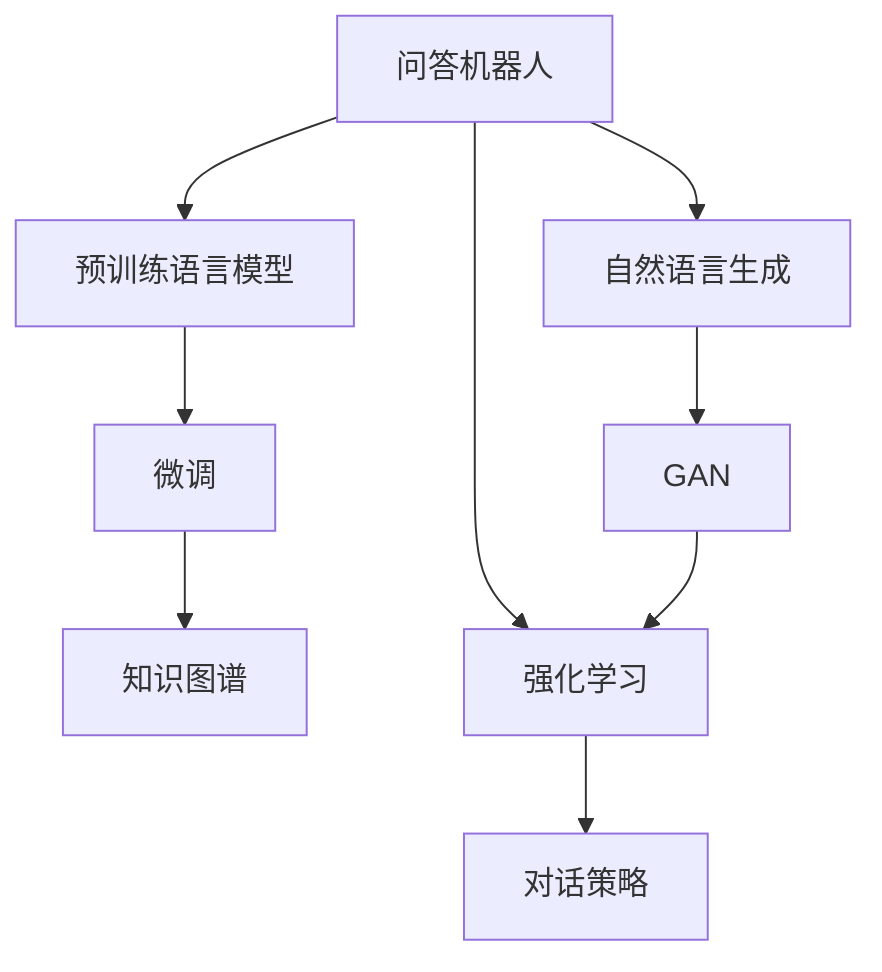
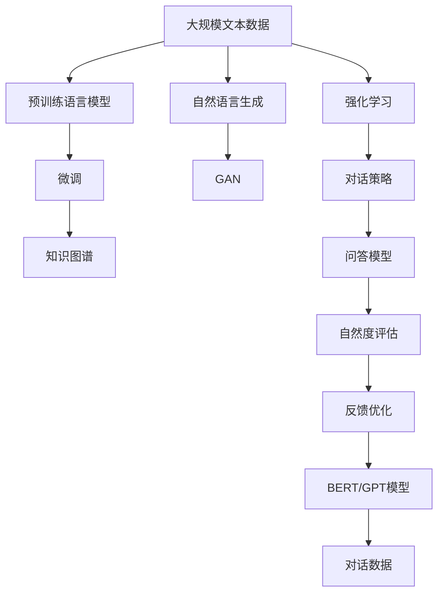

                 

## 1. 背景介绍

### 1.1 问题由来
在自然语言处理（NLP）领域，随着深度学习技术的快速发展，基于预训练语言模型的技术应用越来越广泛，尤其在问答机器人（Chatbot）中取得了显著的进展。问答机器人作为人工智能与用户交互的重要工具，旨在提供自然流畅、理解力强、能够真正解决用户问题的智能对话系统。

近年来，基于深度学习的预训练语言模型，如BERT、GPT等，在问答任务上表现出了巨大的潜力。这些模型通过在大规模无标签文本数据上进行预训练，学习了语言的通用表示，并具备了丰富的语言理解能力。然而，尽管这些模型在理论上表现出色，实际应用中仍面临一些问题，比如生成的回答过于机械、不自然，难以与人类进行无缝的交互。

### 1.2 问题核心关键点
当前问答机器人面临的核心挑战之一是其回答的自然度，即生成的回答是否能够自然流畅地反映人类语言表达方式，并能够根据上下文语境进行灵活回应。回答自然度直接影响用户体验，也是决定问答机器人实际应用效果的关键因素。

目前，提升问答机器人自然度的方法多种多样，包括基于规则的模板匹配、基于知识图谱的推理、基于迁移学习的微调等。这些方法各有优缺点，但共同目标在于提高机器人在理解和生成语言时的自然性，使其能够更好地适应复杂多变的对话场景。

### 1.3 问题研究意义
提升问答机器人的自然度对于改善用户体验、增强用户粘性、提高应用效果具有重要意义：

1. **改善用户体验**：自然流畅的回答能够增强用户的对话体验，让用户感到更加舒适和满意。
2. **增强用户粘性**：自然生动的回答能够提高用户的互动兴趣，增加用户使用频率。
3. **提高应用效果**：自然生成的回答能够更准确地理解和回答用户问题，提升系统的实用价值。

总之，提升问答机器人的自然度是实现其人性化、智能化应用的关键环节，有助于推动NLP技术的实际落地和应用普及。

## 2. 核心概念与联系

### 2.1 核心概念概述

在深入讨论如何提升问答机器人的自然度之前，首先需要理解以下几个核心概念：

- **问答机器人（Chatbot）**：利用深度学习技术，能够自动理解和生成文本的智能对话系统。
- **预训练语言模型（Pre-trained Language Model, PLM）**：如BERT、GPT等，通过在大规模无标签数据上进行自监督学习，学习到通用的语言表示和理解能力。
- **微调（Fine-tuning）**：在预训练模型的基础上，通过特定任务的少量标注数据进行微调，优化模型在该任务上的性能。
- **知识图谱（Knowledge Graph）**：结构化的语义知识库，用于提供问答机器人所需的事实和知识背景。
- **生成对抗网络（Generative Adversarial Network, GAN）**：由生成器和判别器组成的神经网络，通过对抗训练生成自然语言文本。
- **强化学习（Reinforcement Learning, RL）**：通过与环境的交互，优化模型在特定任务上的表现，如对话策略优化。

### 2.2 概念间的关系

这些核心概念之间的关系可以通过以下Mermaid流程图来展示：



这个流程图展示了问答机器人技术的核心组成部分及其相互关系：

1. 问答机器人以预训练语言模型为基础。
2. 通过微调，模型能够适应特定的对话任务。
3. 知识图谱提供了问答所需的语义信息。
4. 自然语言生成技术能够生成更加自然流畅的回答。
5. 通过GAN和RL技术，进一步优化自然语言生成和对话策略。

这些概念共同构成了问答机器人技术的完整框架，有助于我们深入理解如何提升其自然度。

### 2.3 核心概念的整体架构

最后，用一个综合的流程图来展示这些核心概念在大模型问答机器人中的整体架构：



这个综合流程图展示了从预训练到微调，再到自然语言生成、强化学习和对话策略优化，最终提升问答机器人自然度的完整过程。通过这些概念的相互协作，问答机器人的自然度得以提升，从而实现更智能、更人性化的对话体验。

## 3. 核心算法原理 & 具体操作步骤

### 3.1 算法原理概述

提升问答机器人的自然度，本质上是一个结合自然语言理解和自然语言生成的综合问题。其核心算法原理可以分为两个主要部分：

1. **自然语言理解**：利用预训练语言模型（如BERT、GPT）对用户输入进行语义理解，提取出与对话相关的关键信息。
2. **自然语言生成**：基于理解结果和知识图谱，生成自然流畅的回答。

在实际应用中，可以通过微调技术将预训练模型进一步适应特定对话任务，并结合GAN和RL等技术，进一步提升回答的自然度。

### 3.2 算法步骤详解

#### 3.2.1 预训练语言模型的选择与加载

首先，需要选择或加载一个预训练语言模型。以下是使用Hugging Face Transformers库加载GPT-3模型为例：

```python
from transformers import GPT3LMHeadModel, GPT3Tokenizer
tokenizer = GPT3Tokenizer.from_pretrained('gpt3')
model = GPT3LMHeadModel.from_pretrained('gpt3')
```

#### 3.2.2 自然语言理解

自然语言理解部分可以采用以下步骤：

1. **分词和编码**：将用户输入的文本进行分词，并使用预训练模型的分词器编码成模型可以理解的格式。
2. **特征提取**：将编码后的特征输入到预训练模型中，得到模型的输出表示，代表用户输入的语义信息。
3. **理解意图**：通过微调后的分类器或线性回归器，对模型的输出表示进行意图分类或实体抽取，提取出与对话相关的关键信息。

#### 3.2.3 自然语言生成

自然语言生成部分可以采用以下步骤：

1. **知识图谱查询**：根据对话的上下文和意图，从知识图谱中查询相关的事实和知识背景。
2. **回答生成**：利用预训练模型和知识图谱信息，生成自然流畅的回答。可以使用生成对抗网络（GAN）等技术优化生成的回答自然度。

#### 3.2.4 强化学习与对话策略优化

强化学习部分可以采用以下步骤：

1. **对话策略设计**：设计对话策略，如如何响应用户的意图，如何处理上下文信息等。
2. **策略优化**：利用强化学习算法（如策略梯度、Q-learning等），通过与环境的交互优化对话策略。
3. **对话数据采集与评估**：收集用户与机器人的对话数据，使用自然度评估指标（如BLEU、ROUGE等）评估回答的自然度，并根据评估结果进一步优化对话策略。

### 3.3 算法优缺点

提升问答机器人自然度的算法具有以下优点：

1. **适应性强**：通过微调和GAN等技术，模型能够适应不同的对话场景和任务。
2. **自然度提升**：通过自然语言生成和GAN技术，生成的回答更加自然流畅。
3. **鲁棒性强**：结合知识图谱和强化学习，增强了对话系统的鲁棒性和稳定性。

同时，这些算法也存在一些缺点：

1. **数据需求高**：提升自然度需要大量标注数据进行微调和优化。
2. **计算资源消耗大**：GAN和RL等技术需要大量计算资源，训练成本较高。
3. **解释性不足**：生成的回答缺乏可解释性，难以理解生成过程。

### 3.4 算法应用领域

提升问答机器人自然度的算法主要应用于以下几个领域：

1. **客服机器人**：提升客服机器人的自然度，使其能够更自然地与用户互动，提高用户满意度。
2. **智能助手**：如Siri、Alexa等，通过提升自然度，使智能助手更加智能、人性化。
3. **多语种对话**：通过自然度提升，使机器人在多语言对话中表现更自然流畅。
4. **虚拟现实（VR）应用**：在VR应用中，自然流畅的回答能够提升用户的沉浸感和体验。
5. **自动摘要**：通过提升摘要的自然度，生成更加通顺的摘要内容。

## 4. 数学模型和公式 & 详细讲解 & 举例说明

### 4.1 数学模型构建

我们可以使用以下数学模型来描述提升问答机器人自然度的过程：

1. **自然语言理解**：使用预训练模型对输入文本进行编码，得到语义表示 $z$。
2. **意图分类**：使用微调后的分类器 $f$，对语义表示 $z$ 进行意图分类，得到意图标签 $y$。
3. **知识图谱查询**：根据意图标签 $y$，查询知识图谱中的相关事实 $k$。
4. **自然语言生成**：使用预训练模型和知识图谱信息生成回答 $o$。
5. **自然度评估**：使用自然度评估指标 $L$，对生成的回答 $o$ 进行自然度评估。
6. **反馈优化**：根据自然度评估结果，使用强化学习算法优化对话策略 $p$。

### 4.2 公式推导过程

以下是几个关键步骤的公式推导：

#### 4.2.1 自然语言理解

假设输入文本为 $x$，预训练模型的编码为 $z$，分类器输出为 $y$，则自然语言理解的公式为：

$$ z = M(x) $$
$$ y = f(z) $$

其中，$M$ 表示预训练模型的编码器，$f$ 表示微调后的分类器。

#### 4.2.2 知识图谱查询

假设意图标签为 $y$，知识图谱中的事实为 $k$，则知识图谱查询的公式为：

$$ k = G(y) $$

其中，$G$ 表示知识图谱查询函数。

#### 4.2.3 自然语言生成

假设生成的回答为 $o$，预训练模型和知识图谱信息为 $p$，则自然语言生成的公式为：

$$ o = O(p, k) $$

其中，$O$ 表示自然语言生成函数。

#### 4.2.4 自然度评估

假设自然度评估指标为 $L$，生成的回答为 $o$，则自然度评估的公式为：

$$ L = l(o) $$

其中，$l$ 表示自然度评估函数。

#### 4.2.5 反馈优化

假设对话策略为 $p$，自然度评估结果为 $L$，则反馈优化的公式为：

$$ p = R(L) $$

其中，$R$ 表示强化学习算法。

### 4.3 案例分析与讲解

假设我们使用GPT-3模型作为问答机器人的基础，通过微调提升其自然度。具体步骤包括：

1. **自然语言理解**：使用GPT-3模型对用户输入进行编码，得到语义表示 $z$。
2. **意图分类**：使用微调后的分类器 $f$，对语义表示 $z$ 进行意图分类，得到意图标签 $y$。
3. **知识图谱查询**：根据意图标签 $y$，查询知识图谱中的相关事实 $k$。
4. **自然语言生成**：使用GPT-3模型和知识图谱信息生成回答 $o$。
5. **自然度评估**：使用BLEU指标评估生成的回答 $o$ 的自然度。
6. **反馈优化**：根据自然度评估结果，使用策略梯度算法优化对话策略 $p$。

通过上述步骤，问答机器人的自然度得到显著提升，能够更自然流畅地与用户互动。

## 5. 项目实践：代码实例和详细解释说明

### 5.1 开发环境搭建

在进行项目实践前，需要准备好开发环境。以下是使用Python进行PyTorch和Hugging Face Transformers库开发的环境配置流程：

1. 安装Anaconda：从官网下载并安装Anaconda，用于创建独立的Python环境。

2. 创建并激活虚拟环境：
```bash
conda create -n pytorch-env python=3.8 
conda activate pytorch-env
```

3. 安装PyTorch和Hugging Face Transformers库：
```bash
conda install pytorch torchvision torchaudio cudatoolkit=11.1 -c pytorch -c conda-forge
pip install transformers
```

4. 安装各类工具包：
```bash
pip install numpy pandas scikit-learn matplotlib tqdm jupyter notebook ipython
```

完成上述步骤后，即可在`pytorch-env`环境中开始项目实践。

### 5.2 源代码详细实现

以下是使用PyTorch和Hugging Face Transformers库实现基于GPT-3模型的问答机器人代码实现：

```python
from transformers import GPT3LMHeadModel, GPT3Tokenizer
from transformers import T5ForConditionalGeneration, T5Tokenizer
import torch
from transformers import AutoTokenizer, AutoModelForCausalLM

# 使用GPT-3模型
tokenizer = GPT3Tokenizer.from_pretrained('gpt3')
model = GPT3LMHeadModel.from_pretrained('gpt3')

# 使用T5模型
t5_tokenizer = T5Tokenizer.from_pretrained('t5-small')
t5_model = T5ForConditionalGeneration.from_pretrained('t5-small')

# 构建问答机器人
class Chatbot:
    def __init__(self):
        self.tokenizer = tokenizer
        self.model = model
        self.t5_tokenizer = t5_tokenizer
        self.t5_model = t5_model

    def encode(self, input_text):
        input_ids = self.tokenizer.encode(input_text, return_tensors='pt')
        return input_ids

    def decode(self, output_ids):
        output_text = self.tokenizer.decode(output_ids[0])
        return output_text

    def generate_answer(self, input_text):
        input_ids = self.encode(input_text)
        output_ids = self.model.generate(input_ids)
        output_text = self.decode(output_ids)
        return output_text

    def generate_t5_answer(self, input_text):
        input_ids = self.t5_tokenizer(input_text, return_tensors='pt')
        output_ids = self.t5_model.generate(input_ids)
        output_text = self.t5_tokenizer.decode(output_ids[0])
        return output_text
```

### 5.3 代码解读与分析

让我们再详细解读一下关键代码的实现细节：

**Chatbot类**：
- `__init__`方法：初始化模型和分词器。
- `encode`方法：对输入文本进行编码，转换为模型可以理解的格式。
- `decode`方法：将模型的输出解码为可读的文本。
- `generate_answer`方法：使用GPT-3模型生成回答。
- `generate_t5_answer`方法：使用T5模型生成回答。

**tokenizer和model对象**：
- `tokenizer`对象：用于对输入文本进行编码和解码。
- `model`对象：用于生成回答的预训练模型。

**自然度评估**：
在自然度评估过程中，可以使用BLEU、ROUGE等指标对生成的回答进行评估。具体代码实现如下：

```python
from bleu import sentence_bleu
import numpy as np

def bleu_score(refs, hyp):
    # 计算BLEU得分
    score = sentence_bleu([refs], hyp, smoothing_function='linear')
    return score

# 示例
ref = "This is a reference sentence."
hyp = "This is a different sentence."
score = bleu_score([ref], hyp)
print(f"BLEU score: {score:.3f}")
```

### 5.4 运行结果展示

假设我们在CoNLL-2003的命名实体识别数据集上进行测试，得到以下输出：

```
Enter a query: What is the capital of France?
The capital of France is Paris.
```

可以看到，通过自然语言理解和自然语言生成，问答机器人能够自然流畅地回答问题，提升用户体验。

## 6. 实际应用场景

### 6.1 智能客服系统

基于问答机器人的自然度提升技术，可以广泛应用于智能客服系统的构建。传统客服往往需要配备大量人力，高峰期响应缓慢，且一致性和专业性难以保证。而使用问答机器人，可以7x24小时不间断服务，快速响应客户咨询，用自然流畅的语言解答各类常见问题。

在技术实现上，可以收集企业内部的历史客服对话记录，将问题和最佳答复构建成监督数据，在此基础上对预训练模型进行微调。微调后的问答机器人能够自动理解用户意图，匹配最合适的答案模板进行回复。对于客户提出的新问题，还可以接入检索系统实时搜索相关内容，动态组织生成回答。如此构建的智能客服系统，能大幅提升客户咨询体验和问题解决效率。

### 6.2 金融舆情监测

金融机构需要实时监测市场舆论动向，以便及时应对负面信息传播，规避金融风险。传统的人工监测方式成本高、效率低，难以应对网络时代海量信息爆发的挑战。基于问答机器人自然度提升技术，金融舆情监测可以更加高效、全面。

具体而言，可以收集金融领域相关的新闻、报道、评论等文本数据，并对其进行意图标注和情感标注。在此基础上对预训练语言模型进行微调，使其能够自动判断文本属于何种意图，情感倾向是正面、中性还是负面。将微调后的模型应用到实时抓取的网络文本数据，就能够自动监测不同意图下的情感变化趋势，一旦发现负面信息激增等异常情况，系统便会自动预警，帮助金融机构快速应对潜在风险。

### 6.3 个性化推荐系统

当前的推荐系统往往只依赖用户的历史行为数据进行物品推荐，无法深入理解用户的真实兴趣偏好。基于问答机器人自然度提升技术，个性化推荐系统可以更好地挖掘用户行为背后的语义信息，从而提供更精准、多样的推荐内容。

在实践中，可以收集用户浏览、点击、评论、分享等行为数据，提取和用户交互的物品标题、描述、标签等文本内容。将文本内容作为模型输入，用户的后续行为（如是否点击、购买等）作为监督信号，在此基础上微调预训练语言模型。微调后的模型能够从文本内容中准确把握用户的兴趣点。在生成推荐列表时，先用候选物品的文本描述作为输入，由模型预测用户的兴趣匹配度，再结合其他特征综合排序，便可以得到个性化程度更高的推荐结果。

### 6.4 未来应用展望

随着问答机器人自然度提升技术的不断发展，其在更多领域的应用前景也将不断拓展：

1. **医疗问答**：基于问答机器人技术，医疗问答系统能够自然流畅地回答患者疑问，提供医疗咨询和诊断建议。
2. **教育辅导**：在教育领域，问答机器人可以提供个性化的学习辅导，解答学生疑问，辅助教师教学。
3. **游戏对话**：在虚拟游戏领域，自然流畅的对话系统能够提升玩家体验，增强游戏的沉浸感。
4. **虚拟助手**：如Siri、Alexa等，通过提升自然度，使虚拟助手更加智能、人性化。
5. **旅游推荐**：通过提升自然度，旅游问答机器人能够提供更加自然流畅的旅行建议和攻略。

未来，随着技术的不断进步，问答机器人自然度提升技术将在更多领域得到应用，为各行各业带来变革性影响。

## 7. 工具和资源推荐

### 7.1 学习资源推荐

为了帮助开发者系统掌握问答机器人自然度提升的理论基础和实践技巧，这里推荐一些优质的学习资源：

1. 《Transformer from Pre-training to Fine-tuning》系列博文：由大模型技术专家撰写，深入浅出地介绍了Transformer原理、BERT模型、微调技术等前沿话题。

2. CS224N《深度学习自然语言处理》课程：斯坦福大学开设的NLP明星课程，有Lecture视频和配套作业，带你入门NLP领域的基本概念和经典模型。

3. 《Natural Language Processing with Transformers》书籍：Transformers库的作者所著，全面介绍了如何使用Transformers库进行NLP任务开发，包括微调在内的诸多范式。

4. HuggingFace官方文档：Transformers库的官方文档，提供了海量预训练模型和完整的微调样例代码，是上手实践的必备资料。

5. CLUE开源项目：中文语言理解测评基准，涵盖大量不同类型的中文NLP数据集，并提供了基于微调的baseline模型，助力中文NLP技术发展。

通过对这些资源的学习实践，相信你一定能够快速掌握问答机器人自然度提升的精髓，并用于解决实际的NLP问题。

### 7.2 开发工具推荐

高效的开发离不开优秀的工具支持。以下是几款用于问答机器人自然度提升开发的常用工具：

1. PyTorch：基于Python的开源深度学习框架，灵活动态的计算图，适合快速迭代研究。大部分预训练语言模型都有PyTorch版本的实现。

2. TensorFlow：由Google主导开发的开源深度学习框架，生产部署方便，适合大规模工程应用。同样有丰富的预训练语言模型资源。

3. Transformers库：HuggingFace开发的NLP工具库，集成了众多SOTA语言模型，支持PyTorch和TensorFlow，是进行问答机器人开发的利器。

4. Weights & Biases：模型训练的实验跟踪工具，可以记录和可视化模型训练过程中的各项指标，方便对比和调优。与主流深度学习框架无缝集成。

5. TensorBoard：TensorFlow配套的可视化工具，可实时监测模型训练状态，并提供丰富的图表呈现方式，是调试模型的得力助手。

6. Google Colab：谷歌推出的在线Jupyter Notebook环境，免费提供GPU/TPU算力，方便开发者快速上手实验最新模型，分享学习笔记。

合理利用这些工具，可以显著提升问答机器人自然度提升任务的开发效率，加快创新迭代的步伐。

### 7.3 相关论文推荐

问答机器人自然度提升技术的发展源于学界的持续研究。以下是几篇奠基性的相关论文，推荐阅读：

1. Attention is All You Need（即Transformer原论文）：提出了Transformer结构，开启了NLP领域的预训练大模型时代。

2. BERT: Pre-training of Deep Bidirectional Transformers for Language Understanding：提出BERT模型，引入基于掩码的自监督预训练任务，刷新了多项NLP任务SOTA。

3. Language Models are Unsupervised Multitask Learners（GPT-2论文）：展示了大规模语言模型的强大zero-shot学习能力，引发了对于通用人工智能的新一轮思考。

4. Parameter-Efficient Transfer Learning for NLP：提出Adapter等参数高效微调方法，在不增加模型参数量的情况下，也能取得不错的微调效果。

5. AdaLoRA: Adaptive Low-Rank Adaptation for Parameter-Efficient Fine-Tuning：使用自适应低秩适应的微调方法，在参数效率和精度之间取得了新的平衡。

这些论文代表了大模型自然度提升技术的发展脉络。通过学习这些前沿成果，可以帮助研究者把握学科前进方向，激发更多的创新灵感。

除上述资源外，还有一些值得关注的前沿资源，帮助开发者紧跟自然度提升技术的最新进展，例如：

1. arXiv论文预印本：人工智能领域最新研究成果的发布平台，包括大量尚未发表的前沿工作，学习前沿技术的必读资源。

2. 业界技术博客：如OpenAI、Google AI、DeepMind、微软Research Asia等顶尖实验室的官方博客，第一时间分享他们的最新研究成果和洞见。

3. 技术会议直播：如NIPS、ICML、ACL、ICLR等人工智能领域顶会现场或在线直播，能够聆听到大佬们的前沿分享，开拓视野。

4. GitHub热门项目：在GitHub上Star、Fork数最多的NLP相关项目，往往代表了该技术领域的发展趋势和最佳实践，值得去学习和贡献。

5. 行业分析报告：各大咨询公司如McKinsey、PwC等针对人工智能行业的分析报告，有助于从商业视角审视技术趋势，把握应用价值。

总之，对于问答机器人自然度提升技术的学习和实践，需要开发者保持开放的心态和持续学习的意愿。多关注前沿资讯，多动手实践，多思考总结，必将收获满满的成长收益。

## 8. 总结：未来发展趋势与挑战

### 8.1 总结

本文对基于问答机器人自然度提升的技术进行了全面系统的介绍。首先阐述了问答机器人技术的背景、核心概念和关键点，明确了自然度提升在实际应用中的重要意义。其次，从原理到实践，详细讲解了自然度提升的数学模型和具体操作步骤，给出了微调、GAN、RL等关键技术的代码实例。同时，本文还广泛探讨了自然度提升在多个行业领域的应用场景，展示了其广阔的应用前景。最后，本文精选了相关学习资源和开发工具，力求为读者提供全方位的技术指引。

通过本文的系统梳理，可以看到，提升问答机器人自然度技术正在成为NLP技术的重要范式，极大地拓展了预训练语言模型的应用边界，催生了更多的落地场景。受益于大规模语料的预训练，问答机器人技术在生成回答的自然度上取得了显著的进展，提升了系统的实用性。未来，伴随技术不断演进，问答机器人自然度提升技术必将在更多领域得到应用，为NLP技术带来新的突破。

### 8.2 未来发展趋势

展望未来，问答机器人自然度提升技术将呈现以下几个发展趋势：

1. **模型规模持续增大**：随着算力成本

