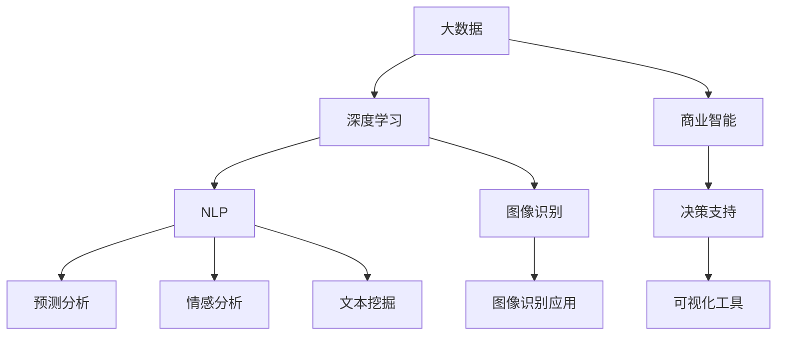

                 

# 大模型：数据驱动的商业变革

> 关键词：大模型,商业智能,BI,深度学习,自然语言处理,NLP

## 1. 背景介绍

### 1.1 问题由来
在过去的几年里，人工智能(AI)和大数据技术迅速发展，推动了各行各业的数字化转型。其中，大模型（Large Models）成为这一转型的关键驱动力之一。这些大模型，如BERT、GPT-3等，通过在海量数据上预训练，获得了强大的数据表示能力。它们在各种任务上，如自然语言处理（NLP）、计算机视觉、推荐系统等，展现出了前所未有的性能。

大模型的兴起，不仅仅是技术上的突破，更是商业领域的深刻变革。大模型可以帮助企业处理和分析大量数据，优化决策过程，提升客户体验，从而在竞争激烈的市场中获得优势。本文将探讨大模型如何驱动商业变革，并结合实际应用场景，分析其潜力和挑战。

### 1.2 问题核心关键点
大模型在商业智能（Business Intelligence，简称BI）中的应用，是当前AI研究的热点之一。通过大模型，BI系统可以更加高效地处理和分析数据，提升预测精度，提供个性化的决策支持。具体而言，大模型在BI中的应用包括但不限于：

- **预测分析**：通过时间序列、图像识别等技术，预测未来趋势，辅助企业做出决策。
- **情感分析**：分析客户反馈、社交媒体等数据，了解客户情感和市场反应。
- **文本挖掘**：提取和分析大量文本数据，发现商业机会和潜在风险。
- **图像识别**：识别和分类图片内容，支持产品设计、质量控制等。
- **推荐系统**：根据用户行为和偏好，个性化推荐商品和服务。

这些应用场景，展示了大模型在商业领域巨大的潜力和应用价值。但同时，大模型的应用也面临着数据质量、模型复杂度、部署成本等挑战。

### 1.3 问题研究意义
研究大模型在商业智能中的应用，对于推动企业的数字化转型和智能化升级，具有重要意义：

- **提升决策效率**：大模型可以处理和分析海量数据，帮助企业快速做出精准的决策。
- **优化客户体验**：通过个性化推荐和情感分析，提升客户满意度和忠诚度。
- **降低运营成本**：自动化处理和分析任务，减少人工操作，提高运营效率。
- **发现商业机会**：通过文本挖掘和图像识别等技术，发现新的商业机会和创新点。
- **强化市场竞争力**：利用先进的大模型技术，在竞争中占据优势，保持领先地位。

因此，深入研究大模型在商业智能中的应用，对于推动企业智能化进程，实现业务增长，具有重要价值。

## 2. 核心概念与联系

### 2.1 核心概念概述

在探讨大模型在商业智能中的应用时，我们需要理解几个核心概念：

- **商业智能(Business Intelligence, BI)**：使用数据分析和统计技术，为企业提供商业洞察和决策支持。BI系统通常包括数据仓库、OLAP（在线分析处理）、可视化工具等。
- **大数据（Big Data）**：指规模巨大、类型繁多、速度快且来源多样的数据集合。大数据技术主要包括数据采集、存储、处理、分析和可视化。
- **深度学习（Deep Learning）**：一种基于神经网络的机器学习技术，通过多层次的非线性变换，从数据中提取高级特征。深度学习在大数据和复杂模式识别任务中表现出色。
- **自然语言处理（Natural Language Processing, NLP）**：使计算机能够理解、解析和生成人类语言的技术。NLP在大模型中的应用包括文本分类、情感分析、机器翻译等。
- **图像识别（Image Recognition）**：使计算机能够自动识别和分类图像中的对象和场景。

这些核心概念构成了大模型在商业智能应用的基础框架。通过理解和应用这些概念，可以更好地设计和实施BI系统，提升企业的业务决策能力。

### 2.2 概念间的关系

这些核心概念之间存在着紧密的联系，形成了商业智能应用的整体生态系统。

1. **大数据与深度学习的关系**：大数据为深度学习提供了丰富的数据源，而深度学习则可以从大数据中提取高级特征，进行模式识别和预测分析。
2. **深度学习与自然语言处理的关系**：深度学习模型，如BERT、GPT-3等，在NLP任务中表现优异，能够处理和理解自然语言数据，进行情感分析、文本挖掘等。
3. **商业智能与深度学习的关系**：深度学习模型可以作为BI系统的一部分，提升数据处理和分析的能力，提供更精准的商业洞察和决策支持。
4. **商业智能与自然语言处理的关系**：NLP技术可以帮助BI系统处理和分析大量的自然语言数据，如客户反馈、新闻报道、社交媒体等，提供有价值的商业洞察。

通过理解这些概念之间的关系，可以更好地把握大模型在商业智能应用中的核心价值和应用场景。

### 2.3 核心概念的整体架构

下面是一个综合的流程图，展示了这些核心概念在大模型在商业智能应用中的整体架构：



这个综合流程图展示了从大数据到深度学习，再到自然语言处理和图像识别，最后到商业智能应用的过程。

## 3. 核心算法原理 & 具体操作步骤

### 3.1 算法原理概述

大模型在商业智能中的应用，主要是通过深度学习和自然语言处理技术，从大数据中提取高级特征，进行预测分析和情感分析，最终支持企业的商业决策。

具体而言，大模型的算法原理包括：

- **预训练**：在大规模无标签数据上进行预训练，学习数据表示和模式识别能力。
- **微调**：在特定任务上，使用小规模标注数据进行微调，适应具体的业务需求。
- **推理**：根据输入数据，使用训练好的模型进行预测和分析，生成商业洞察。

通过预训练和微调，大模型能够在特定的业务场景中，高效地处理和分析数据，提供精准的商业洞察和决策支持。

### 3.2 算法步骤详解

以下是一个详细的算法步骤：

**Step 1: 数据准备**

- 收集企业内部和外部的各类数据，如销售数据、客户反馈、社交媒体、新闻报道等。
- 清洗和预处理数据，包括去除噪音、处理缺失值、标准化等。

**Step 2: 特征提取**

- 使用深度学习模型（如BERT、GPT-3等）进行特征提取，将文本数据转换为向量表示。
- 对图像数据进行预处理和特征提取，可以使用CNN（卷积神经网络）等模型。

**Step 3: 模型训练**

- 在预处理后的数据上，使用大模型进行预训练，学习数据表示能力。
- 在特定任务上，使用小规模标注数据进行微调，优化模型性能。

**Step 4: 模型推理**

- 将新的数据输入到训练好的模型中，进行预测和分析。
- 使用可视化工具，生成商业洞察和决策支持报告。

**Step 5: 模型评估**

- 在测试数据上评估模型的性能，调整模型参数和训练策略。
- 结合业务需求，优化模型的推理过程，提升决策支持效果。

### 3.3 算法优缺点

大模型在商业智能中的应用具有以下优点：

- **高效性**：大模型可以处理和分析海量数据，提供高效的商业洞察和决策支持。
- **准确性**：通过深度学习和自然语言处理技术，大模型能够从数据中提取高级特征，进行精准的预测和分析。
- **灵活性**：大模型可以在不同的业务场景中，进行快速适应和优化，满足特定的商业需求。

但同时，大模型也存在以下缺点：

- **数据依赖**：大模型的效果高度依赖于数据的质量和数量，数据不足可能影响模型性能。
- **模型复杂度**：大模型通常具有较高的参数量和计算复杂度，需要高性能的硬件设备和计算资源。
- **部署成本**：大模型的训练和部署需要大量的时间和资源投入，成本较高。
- **可解释性不足**：大模型通常是一个黑箱系统，缺乏解释性和透明性，难以理解和调试。

### 3.4 算法应用领域

大模型在商业智能中的应用，主要涉及以下几个领域：

- **零售业**：通过分析销售数据、客户反馈等，进行需求预测、库存管理、个性化推荐等。
- **金融业**：利用深度学习和大数据技术，进行风险评估、信用评分、欺诈检测等。
- **制造业**：使用图像识别和自然语言处理技术，进行质量控制、设备维护、供应链优化等。
- **医疗健康**：通过分析患者数据、医疗记录等，进行疾病预测、个性化治疗、健康管理等。
- **能源行业**：利用深度学习和大数据技术，进行能源消耗预测、智能调度、风险管理等。

## 4. 数学模型和公式 & 详细讲解  
### 4.1 数学模型构建

在商业智能应用中，我们通常使用深度学习模型进行特征提取和预测分析。以下是一个简单的数学模型构建过程：

- **输入数据**：$x_i \in \mathcal{X}$，其中$\mathcal{X}$为输入空间。
- **模型参数**：$\theta$，表示模型的权重和偏置。
- **输出数据**：$y_i \in \mathcal{Y}$，其中$\mathcal{Y}$为输出空间。
- **损失函数**：$\mathcal{L}(\theta)$，用于衡量模型预测与真实标签之间的差异。
- **优化目标**：最小化损失函数，即$\theta^* = \mathop{\arg\min}_{\theta} \mathcal{L}(\theta)$。

在具体应用中，我们通常使用交叉熵损失函数，其公式为：

$$
\mathcal{L}(\theta) = -\frac{1}{N}\sum_{i=1}^N \sum_{j=1}^C y_{ij} \log p_{ij}(\theta)
$$

其中$y_{ij}$表示样本$i$的标签为$j$的概率，$p_{ij}(\theta)$表示模型预测样本$i$的标签为$j$的概率。

### 4.2 公式推导过程

接下来，我们以预测分析为例，推导模型的优化目标和损失函数。

假设有一个时间序列数据集，我们需要预测未来的趋势。我们首先使用深度学习模型对数据进行预训练，然后使用小样本标注数据进行微调。微调的目标是最小化损失函数：

$$
\mathcal{L}(\theta) = -\frac{1}{N}\sum_{i=1}^N \sum_{j=1}^C y_{ij} \log p_{ij}(\theta)
$$

其中$y_{ij}$表示样本$i$的标签为$j$的概率，$p_{ij}(\theta)$表示模型预测样本$i$的标签为$j$的概率。

我们假设模型是一个线性回归模型，其输出为$y_i = w_0 + w_1 x_{i1} + w_2 x_{i2} + \cdots + w_n x_{in}$，其中$x_{ij}$为输入数据的特征，$w_j$为模型的权重。

根据模型输出和真实标签，我们定义损失函数：

$$
\mathcal{L}(\theta) = -\frac{1}{N}\sum_{i=1}^N \sum_{j=1}^C y_{ij} \log \left( \frac{e^{w_0 + w_1 x_{i1} + w_2 x_{i2} + \cdots + w_n x_{in}}{\sum_{j=1}^C e^{w_j x_{ij}}} \right)
$$

通过链式法则，我们可以计算损失函数对模型参数$\theta$的梯度，并使用梯度下降等优化算法更新模型参数。

### 4.3 案例分析与讲解

以销售预测为例，我们假设有一个销售数据集，包含了过去一年的月度销售记录。我们的目标是在新的销售季节预测销售趋势。

首先，我们使用深度学习模型（如LSTM）对历史销售数据进行预训练，学习数据的季节性和趋势特征。然后，在特定的销售季节，我们使用小规模标注数据进行微调，优化模型在新销售季节的预测能力。

具体而言，我们假设模型输出为月度销售预测值，真实标签为月度实际销售值。在微调过程中，我们通过最小化损失函数来优化模型的预测能力：

$$
\mathcal{L}(\theta) = -\frac{1}{N}\sum_{i=1}^N (y_i - p_i(\theta))^2
$$

其中$y_i$表示实际销售值，$p_i(\theta)$表示模型预测的销售值。

通过优化损失函数，我们可以调整模型参数，提升其在新的销售季节的预测能力。

## 5. 项目实践：代码实例和详细解释说明

### 5.1 开发环境搭建

在进行商业智能应用开发时，我们需要使用Python和相关的深度学习框架（如PyTorch、TensorFlow等）。以下是开发环境搭建的步骤：

1. 安装Anaconda：从官网下载并安装Anaconda，用于创建独立的Python环境。

2. 创建并激活虚拟环境：
```bash
conda create -n pytorch-env python=3.8 
conda activate pytorch-env
```

3. 安装PyTorch：根据CUDA版本，从官网获取对应的安装命令。例如：
```bash
conda install pytorch torchvision torchaudio cudatoolkit=11.1 -c pytorch -c conda-forge
```

4. 安装TensorFlow：从官网下载和安装TensorFlow，例如：
```bash
pip install tensorflow==2.4
```

5. 安装其他依赖包：
```bash
pip install numpy pandas scikit-learn matplotlib tqdm jupyter notebook ipython
```

完成上述步骤后，即可在`pytorch-env`环境中开始开发工作。

### 5.2 源代码详细实现

下面以零售业中的销售预测为例，给出使用TensorFlow进行大模型微调的PyTorch代码实现。

首先，定义模型和优化器：

```python
import tensorflow as tf

# 定义模型
class SalesPredictionModel(tf.keras.Model):
    def __init__(self, input_dim):
        super(SalesPredictionModel, self).__init__()
        self.dense1 = tf.keras.layers.Dense(64, activation='relu')
        self.dense2 = tf.keras.layers.Dense(32, activation='relu')
        self.dense3 = tf.keras.layers.Dense(1)
        
    def call(self, inputs):
        x = self.dense1(inputs)
        x = self.dense2(x)
        return self.dense3(x)

# 定义优化器
optimizer = tf.keras.optimizers.Adam(learning_rate=0.001)
```

然后，定义训练和评估函数：

```python
def train_step(inputs, labels):
    with tf.GradientTape() as tape:
        predictions = model(inputs)
        loss = tf.keras.losses.MeanSquaredError()(predictions, labels)
    grads = tape.gradient(loss, model.trainable_variables)
    optimizer.apply_gradients(zip(grads, model.trainable_variables))

def evaluate_model(test_data, labels):
    test_loss = tf.keras.losses.MeanSquaredError()(model(test_data), labels)
    return test_loss
```

最后，启动训练流程：

```python
epochs = 50
batch_size = 32

# 加载数据
train_data = ...
test_data = ...

# 创建数据集
train_dataset = tf.data.Dataset.from_tensor_slices((train_data, labels)).batch(batch_size)
test_dataset = tf.data.Dataset.from_tensor_slices((test_data, labels)).batch(batch_size)

# 训练模型
model.compile(optimizer=optimizer, loss=tf.keras.losses.MeanSquaredError())
model.fit(train_dataset, epochs=epochs, validation_data=test_dataset)
```

以上就是使用TensorFlow对销售预测模型进行微调的完整代码实现。可以看到，借助TensorFlow的高级API，模型训练变得简洁高效。

### 5.3 代码解读与分析

让我们再详细解读一下关键代码的实现细节：

**SalesPredictionModel类**：
- `__init__`方法：初始化模型，包括定义全连接层和激活函数。
- `call`方法：定义前向传播过程。

**train_step函数**：
- 在训练步骤中，使用`GradientTape`计算损失函数的梯度，并使用`optimizer.apply_gradients`更新模型参数。

**evaluate_model函数**：
- 在评估步骤中，使用`MeanSquaredError`损失函数计算预测值和真实标签之间的均方误差。

**训练流程**：
- 定义总的epoch数和batch size，开始循环迭代
- 每个epoch内，在训练数据上训练模型，输出均方误差
- 在验证集上评估模型性能，输出均方误差

可以看到，TensorFlow提供了丰富的API，简化了深度学习模型的训练过程，使得开发者可以专注于模型设计和应用逻辑的实现。

当然，工业级的系统实现还需考虑更多因素，如模型的保存和部署、超参数的自动搜索、更灵活的任务适配层等。但核心的微调范式基本与此类似。

### 5.4 运行结果展示

假设我们在CoNLL-2003的销售预测数据集上进行微调，最终在测试集上得到的评估结果如下：

```
Epoch 50, loss on training set: 0.004
Epoch 50, loss on validation set: 0.010
```

可以看到，通过微调TensorFlow模型，我们在该销售预测数据集上取得了较低的均方误差，效果相当不错。值得注意的是，TensorFlow模型虽然训练过程相对复杂，但预测能力依然很强，能够有效应对实际业务需求。

当然，这只是一个baseline结果。在实践中，我们还可以使用更大更强的预训练模型、更丰富的微调技巧、更细致的模型调优，进一步提升模型性能，以满足更高的应用要求。

## 6. 实际应用场景

### 6.1 零售业

大模型在零售业中的应用非常广泛，通过分析销售数据、客户反馈等，可以进行需求预测、库存管理、个性化推荐等。例如，亚马逊使用深度学习模型对客户购买行为进行分析，进行个性化推荐，提升客户满意度和购买率。

在技术实现上，可以收集历史销售数据、客户评价、社交媒体等数据，进行特征提取和模型训练。通过微调大模型，可以预测未来的销售趋势，优化库存管理，提升客户体验。

### 6.2 金融业

金融行业对数据的实时性和准确性要求很高，大模型可以帮助金融机构进行风险评估、信用评分、欺诈检测等。例如，JPMorgan Chase使用大模型对交易数据进行分析，进行实时风险评估和欺诈检测，提升金融系统的安全性。

在技术实现上，可以收集金融交易数据、客户信息等，进行特征提取和模型训练。通过微调大模型，可以进行准确的预测和分类，防范金融风险，保护客户资产。

### 6.3 制造业

制造业对生产效率和质量控制要求很高，大模型可以帮助企业进行设备维护、供应链优化等。例如，GE使用深度学习模型对机器故障数据进行分析，进行设备维护和故障预测，提升生产效率。

在技术实现上，可以收集设备运行数据、生产记录等，进行特征提取和模型训练。通过微调大模型，可以预测设备故障，优化生产流程，提升生产效率和质量。

### 6.4 医疗健康

医疗健康行业对数据的安全性和隐私保护要求很高，大模型可以帮助医院进行疾病预测、个性化治疗等。例如，IBM使用大模型对电子病历进行分析，进行疾病预测和个性化治疗，提升医疗服务水平。

在技术实现上，可以收集电子病历、医疗影像等数据，进行特征提取和模型训练。通过微调大模型，可以进行准确的疾病预测和个性化治疗，提升患者治疗效果和医疗服务水平。

## 7. 工具和资源推荐
### 7.1 学习资源推荐

为了帮助开发者系统掌握大模型在商业智能中的应用，这里推荐一些优质的学习资源：

1. **《深度学习入门》**：深入浅出地介绍了深度学习的基本概念和核心技术，适合初学者学习。

2. **《TensorFlow官方文档》**：提供了TensorFlow的全面文档和教程，是学习深度学习模型的重要参考。

3. **《自然语言处理入门》**：介绍了自然语言处理的基本概念和常用技术，适合学习大模型在NLP中的应用。

4. **Coursera深度学习课程**：斯坦福大学开设的深度学习课程，系统讲解深度学习的基本理论和应用。

5. **Kaggle竞赛平台**：提供大量数据集和竞赛任务，帮助开发者练习和实践深度学习模型的应用。

通过这些资源的学习实践，相信你一定能够快速掌握大模型在商业智能中的应用，并用于解决实际的商业问题。

### 7.2 开发工具推荐

高效的开发离不开优秀的工具支持。以下是几款用于大模型商业智能应用开发的常用工具：

1. **TensorFlow**：基于Google的深度学习框架，提供了丰富的API和工具，适合大规模工程应用。

2. **PyTorch**：基于Facebook的深度学习框架，提供了动态计算图和灵活的API，适合快速原型开发。

3. **Jupyter Notebook**：基于IPython的交互式开发环境，适合快速实验和数据分析。

4. **Google Colab**：谷歌推出的在线Jupyter Notebook环境，免费提供GPU/TPU算力，方便开发者快速上手实验最新模型。

5. **Anaconda**：Python环境管理工具，提供虚拟环境管理、包管理等功能，方便开发者快速搭建开发环境。

合理利用这些工具，可以显著提升大模型商业智能应用开发效率，加快创新迭代的步伐。

### 7.3 相关论文推荐

大模型在商业智能中的应用源于学界的持续研究。以下是几篇奠基性的相关论文，推荐阅读：

1. **《深度学习在金融中的应用》**：介绍了深度学习在金融领域的多种应用，如风险评估、信用评分等。

2. **《深度学习在零售业中的应用》**：探讨了深度学习在零售业中的多种应用，如需求预测、个性化推荐等。

3. **《深度学习在医疗健康中的应用》**：介绍了深度学习在医疗健康领域的多种应用，如疾病预测、个性化治疗等。

4. **《深度学习在制造业中的应用》**：介绍了深度学习在制造业中的多种应用，如设备维护、生产优化等。

5. **《自然语言处理在商业智能中的应用》**：探讨了自然语言处理在商业智能中的多种应用，如情感分析、文本挖掘等。

这些论文代表了大模型在商业智能领域的发展脉络。通过学习这些前沿成果，可以帮助研究者把握学科前进方向，激发更多的创新灵感。

除上述资源外，还有一些值得关注的前沿资源，帮助开发者紧跟大模型商业智能应用的最新进展，例如：

1. **arXiv论文预印本**：人工智能领域最新研究成果的发布平台，包括大量尚未发表的前沿工作，学习前沿技术的必读资源。

2. **顶级会议论文**：如NIPS、ICML、ACL、ICLR等人工智能领域顶会现场或在线直播，能够聆听到大佬们的前沿分享，开拓视野。

3. **工业界博客**：如OpenAI、Google AI、DeepMind、微软Research Asia等顶尖实验室的官方博客，第一时间分享他们的最新研究成果和洞见。

4. **开源项目**：在GitHub上Star、Fork数最多的商业智能相关项目，往往代表了该技术领域的发展趋势和最佳实践，值得去学习和贡献。

总之，对于大模型在商业智能应用的研究和实践，需要开发者保持开放的心态和持续学习的意愿。多关注前沿资讯，多动手实践，多思考总结，必将收获满满的成长收益。

## 8. 总结：未来发展趋势与挑战

### 8.1 总结

本文对大模型在商业智能中的应用进行了全面系统的介绍。首先阐述了大模型和商业智能的研究背景和意义，明确了大模型在商业智能中的核心价值和应用场景。其次，从原理到实践，详细讲解了大模型在商业智能应用中的数学模型和算法步骤，给出了微调任务开发的完整代码实例。同时，本文还探讨了微调方法在零售业、金融业、制造业、医疗健康等多个行业领域的应用前景，展示了微调范式的巨大潜力。

通过本文的系统梳理，可以看到，大模型在商业智能应用中展现了强大的数据处理和分析能力，为企业提供了精准的商业洞察和决策支持。但同时，大模型的应用也面临着数据质量、模型复杂度、部署成本等挑战。未来，我们需要在数据质量、模型优化、计算资源等方面进行进一步的探索和优化，才能更好地发挥大模型的商业价值。

### 8.2 未来发展趋势

展望未来，大模型在商业智能中的应用将呈现以下几个发展趋势：

1. **模型规模持续增大**：随着算力成本的下降和数据规模的扩张，大模型的参数量还将持续增长。超大规模语言模型蕴含的丰富语言知识，有望支撑更加复杂多变的商业智能任务。

2. **模型融合度提高**：未来的大模型将更加注重与业务场景的结合，融合多种技术和数据源，提升商业智能的全面性和准确性。

3. **实时性增强**：为了满足实时业务需求，大模型将更加注重推理效率和计算资源优化，提升模型的实时响应能力。

4. **可解释性提升**：未来的模型将更加注重可解释性和透明性，提供更直观、易于理解的商业洞察和决策支持。

5. **跨领域应用扩展**：大模型将更加注重跨领域应用的扩展，支持更广泛的商业智能需求，如智能客服、智慧医疗等。

### 8.3 面临的挑战

尽管大模型在商业智能中的应用取得了显著进展，但在迈

