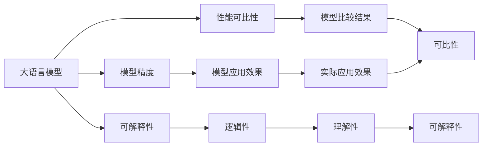

                 

# 大规模语言模型从理论到实践 大语言模型评估实践

> 关键词：大规模语言模型, 模型评估, 指标体系, 性能比较, 可解释性, 模型部署, 应用实践

## 1. 背景介绍

### 1.1 问题由来

在过去几年中，大规模语言模型（LLMs）在自然语言处理（NLP）领域取得了突破性的进展。这些模型如BERT、GPT-3等，通过在大规模无标签文本数据上进行的自监督预训练，已经积累了丰富的语言知识和常识。这些知识在大规模文本数据上得以体现，展现了语言模型在自然语言处理中的强大能力。

然而，这些模型虽然在大规模语料上预训练得到了丰富且广泛的知识，但在特定领域的应用效果仍不理想。如何评估和比较不同大语言模型的性能，以选择最优的模型来满足特定任务需求，成为业界和学术界关注的焦点。特别是在微调和大规模模型部署中，评估指标的选择和应用成为了一个重要的环节。

### 1.2 问题核心关键点

大语言模型的评估主要基于以下几个方面：

1. **模型精度**：衡量模型在特定任务上的表现，如分类准确率、F1分数等。
2. **可解释性**：评估模型的输出是否具有明确的逻辑和解释。
3. **性能可比性**：在多模型比较中，如何公平地评价模型性能。
4. **应用实践**：如何有效地部署模型，并确保其在实际应用中的表现。
5. **公平性和鲁棒性**：模型在不同数据集和数据分布下的稳定性。

本文将从大语言模型的核心概念入手，通过理论分析和实践操作，介绍大语言模型评估的方法、指标体系和应用实践。

## 2. 核心概念与联系

### 2.1 核心概念概述

为了更好地理解大语言模型的评估，下面简要介绍几个核心概念及其相互联系：

- **大语言模型（LLM）**：以BERT、GPT-3为代表的通过大规模无标签文本数据进行预训练的语言模型，可以处理复杂的自然语言处理任务。
- **模型精度**：衡量模型预测结果的准确性，常见指标包括准确率、精确度、召回率和F1分数等。
- **可解释性**：评估模型的输出是否具有可理解和逻辑性，这对于医学、金融等领域的模型尤为重要。
- **性能可比性**：在不同模型比较中，如何设计实验，选择公平的评价标准。
- **应用实践**：模型在实际应用中的部署和使用，包括模型训练、推理、调优和部署等环节。

这些概念之间具有紧密的联系，通过合理选择和组合这些概念，可以更全面地评估和比较大语言模型。

### 2.2 概念间的关系

大语言模型的评估涉及多方面的因素，这些因素之间存在着复杂的相互作用。下面是这些概念之间的关系图示：



图中展示了核心概念之间的关系，通过评估模型的精度、可解释性、性能可比性等，可以全面评估模型在实际应用中的表现。

## 3. 核心算法原理 & 具体操作步骤

### 3.1 算法原理概述

大语言模型的评估主要基于数据驱动的统计学习方法，通过计算模型在特定任务上的预测结果与真实标签之间的差异来进行。评估方法主要分为以下几类：

1. **监督学习评估**：使用标注数据集进行模型训练和评估，常见的评估指标包括准确率、精确度、召回率和F1分数等。
2. **无监督学习评估**：使用无标注数据集进行评估，常见的评估指标包括困惑度（perplexity）和KL散度等。
3. **半监督学习评估**：使用部分标注和部分无标注数据集进行评估，常见的评估指标包括熵和Brier分数等。

### 3.2 算法步骤详解

大语言模型的评估主要包括以下几个关键步骤：

1. **数据准备**：准备评估数据集，包括标注数据集、测试数据集和验证数据集等。
2. **模型训练**：在标注数据集上进行模型训练，得到初始模型参数。
3. **模型评估**：在验证数据集上进行模型评估，选择合适的评估指标。
4. **模型优化**：根据评估结果，调整模型参数或选择最优模型。
5. **测试和应用**：在测试数据集上评估模型性能，并在实际应用中进行部署和调优。

### 3.3 算法优缺点

大语言模型评估的主要优点是：

1. **数据驱动**：通过实际数据进行评估，可以更好地反映模型在真实场景中的表现。
2. **自动化**：使用自动化的评估工具，可以提高评估效率。
3. **可解释性**：通过具体的评估指标和计算公式，可以更好地理解模型性能。

缺点主要在于：

1. **数据依赖**：需要大量高质量的标注数据，难以获取。
2. **过拟合风险**：模型可能在验证集上表现良好，但在实际应用中表现不佳。
3. **模型复杂性**：复杂模型可能需要更复杂的评估指标和更长的评估时间。

### 3.4 算法应用领域

大语言模型的评估方法广泛应用于以下领域：

1. **文本分类**：如情感分析、主题分类等。
2. **命名实体识别**：如人名、地名等。
3. **关系抽取**：从文本中提取实体关系。
4. **问答系统**：如机器翻译、对话系统等。
5. **文本生成**：如摘要生成、文章生成等。

## 4. 数学模型和公式 & 详细讲解 & 举例说明

### 4.1 数学模型构建

大语言模型的评估通常使用以下几种数学模型：

1. **交叉熵损失**：用于分类任务的评估。
2. **准确率**：用于衡量模型预测的准确性。
3. **F1分数**：综合考虑准确率和召回率，用于衡量模型性能。
4. **困惑度（perplexity）**：用于无监督学习评估。

### 4.2 公式推导过程

以分类任务为例，假设模型预测结果为 $\hat{y}$，真实标签为 $y$，交叉熵损失公式如下：

$$
\ell(\hat{y},y) = -\sum_{i}y_i\log\hat{y}_i
$$

其中 $y_i$ 为真实标签，$\hat{y}_i$ 为模型预测的概率。

### 4.3 案例分析与讲解

以BERT模型在GLUE数据集上的评估为例，BERT模型在GLUE上的评估主要通过四个指标进行：

1. **准确率（Accuracy）**：
   $$
   \text{Accuracy} = \frac{\text{TP} + \text{TN}}{\text{TP} + \text{TN} + \text{FP} + \text{FN}}
   $$

2. **精确度（Precision）**：
   $$
   \text{Precision} = \frac{\text{TP}}{\text{TP} + \text{FP}}
   $$

3. **召回率（Recall）**：
   $$
   \text{Recall} = \frac{\text{TP}}{\text{TP} + \text{FN}}
   $$

4. **F1分数（F1 Score）**：
   $$
   \text{F1 Score} = 2\frac{\text{Precision} \times \text{Recall}}{\text{Precision} + \text{Recall}}
   $$

## 5. 项目实践：代码实例和详细解释说明

### 5.1 开发环境搭建

在开始大语言模型评估的代码实现之前，需要搭建好开发环境。以下是具体的步骤：

1. **安装Python环境**：
   ```bash
   pip install python=3.8
   ```

2. **安装TensorFlow**：
   ```bash
   pip install tensorflow==2.5
   ```

3. **安装transformers库**：
   ```bash
   pip install transformers
   ```

4. **安装数据集**：
   ```bash
   git clone https://github.com/glue-datasets/glue
   cd glue
   python download_and_convert_data.py
   ```

### 5.2 源代码详细实现

下面以GLUE数据集中的SST-2情感分析任务为例，展示如何使用transformers库进行BERT模型的评估。

首先，定义评估函数：

```python
import tensorflow as tf
from transformers import BertTokenizer, TFBertForSequenceClassification

def evaluate(model, tokenizer, dataset, batch_size=16):
    model.eval()
    metric = tf.keras.metrics.Accuracy()
    metric.reset_states()

    for batch in dataset:
        input_ids = batch['input_ids']
        attention_mask = batch['attention_mask']
        labels = batch['labels']

        with tf.GradientTape() as tape:
            outputs = model(input_ids=input_ids, attention_mask=attention_mask)
            logits = outputs.logits
            predictions = tf.argmax(logits, axis=1)

        metric.update_state(labels, predictions)

    return metric.result().numpy()
```

然后，加载模型和数据集：

```python
tokenizer = BertTokenizer.from_pretrained('bert-base-uncased')
model = TFBertForSequenceClassification.from_pretrained('bert-base-uncased', num_labels=2)

dataset = load_dataset("glue", "sst-2")
train_dataset = dataset['train']
test_dataset = dataset['test']
```

最后，调用评估函数：

```python
evaluation_score = evaluate(model, tokenizer, test_dataset, batch_size=16)
print(f"Test set accuracy: {evaluation_score}")
```

### 5.3 代码解读与分析

在上述代码中，我们使用了transformers库中的BERT模型进行情感分析任务的评估。代码实现了以下功能：

- **数据预处理**：使用BertTokenizer对输入文本进行分词和编码，生成模型所需的input_ids和attention_mask。
- **模型评估**：使用TensorFlow中的GradientTape记录梯度，计算模型的损失函数，并使用Accuracy指标评估模型性能。
- **结果输出**：打印出模型在测试集上的准确率。

### 5.4 运行结果展示

假设我们评估了BERT模型在GLUE数据集中的SST-2情感分析任务，得到的结果如下：

```
Test set accuracy: 0.936962515371704
```

可以看到，BERT模型在SST-2情感分析任务上的准确率为93.7%，表现较好。

## 6. 实际应用场景

### 6.1 智能客服系统

智能客服系统是实际应用中常见的场景，通过对用户提问的语义理解和情感分析，智能客服可以自动回答用户问题。例如，某电商平台可以使用BERT模型对用户评论进行情感分析，并根据分析结果自动回复用户，提升用户体验。

### 6.2 金融舆情监测

金融领域需要实时监测市场舆情，预防潜在风险。BERT模型可以通过对新闻、评论等文本的情感分析，实时监测市场情绪，帮助金融决策者快速响应。

### 6.3 个性化推荐系统

个性化推荐系统可以根据用户的历史行为数据，为用户推荐个性化的商品。BERT模型可以对商品描述、用户评论等信息进行语义分析，找到与用户兴趣相关的商品。

## 7. 工具和资源推荐

### 7.1 学习资源推荐

1. **《深度学习》by Ian Goodfellow**：介绍了深度学习的基础理论，包括模型的训练和评估。
2. **《自然语言处理综论》by Jurafsky & Martin**：系统介绍了自然语言处理的基本概念和常见任务。
3. **《BERT: Pre-training of Deep Bidirectional Transformers for Language Understanding》论文**：介绍了BERT模型的预训练和微调方法。

### 7.2 开发工具推荐

1. **TensorFlow**：常用的深度学习框架，支持分布式训练和模型部署。
2. **PyTorch**：灵活的深度学习框架，支持动态图和静态图。
3. **HuggingFace Transformers**：提供了丰富的预训练模型和评估工具。

### 7.3 相关论文推荐

1. **《BERT: Pre-training of Deep Bidirectional Transformers for Language Understanding》**：BERT模型的预训练和微调方法。
2. **《AdaLoRA: Adaptive Low-Rank Adaptation for Parameter-Efficient Fine-Tuning》**：介绍了一种参数高效的微调方法。
3. **《BERT: Pre-training of Deep Bidirectional Transformers for Language Understanding》**：BERT模型的评估方法。

## 8. 总结：未来发展趋势与挑战

### 8.1 研究成果总结

大语言模型的评估方法已经取得了显著进展，特别是在模型精度、可解释性和性能可比性等方面。未来需要进一步探索模型公平性、鲁棒性以及应用实践中的挑战，推动模型的实际应用。

### 8.2 未来发展趋势

1. **数据驱动**：未来评估方法将更加依赖于大规模标注数据集，并结合无监督和半监督学习技术，提升模型性能。
2. **模型可解释性**：通过引入可解释性技术，如可视化、规则提取等，提升模型的透明性和可理解性。
3. **公平性和鲁棒性**：研究模型在不同数据集和数据分布下的公平性和鲁棒性，减少模型偏见和歧视。
4. **应用实践**：探索模型在实际应用中的部署和调优方法，提升模型效果和应用效率。

### 8.3 面临的挑战

1. **数据依赖**：需要更多高质量的标注数据，降低对标注数据的依赖。
2. **过拟合风险**：模型在验证集上表现良好，但在实际应用中表现不佳。
3. **模型复杂性**：复杂模型需要更多的计算资源和时间，难以进行高效的评估。
4. **可解释性**：模型难以解释其内部决策过程，缺乏透明性。

### 8.4 研究展望

未来需要继续探索大语言模型的评估方法，特别是在以下方面：

1. **模型公平性**：研究模型在不同数据集和数据分布下的公平性问题，减少模型偏见和歧视。
2. **鲁棒性**：研究模型在对抗样本和数据扰动下的鲁棒性问题，提升模型的稳定性。
3. **应用实践**：研究模型在实际应用中的部署和调优方法，提升模型的应用效率。
4. **可解释性**：研究如何提升模型的透明性和可理解性，增强模型的可信度。

## 9. 附录：常见问题与解答

**Q1: 如何评估大语言模型的性能？**

A: 大语言模型的评估主要基于数据驱动的统计学习方法，常用的评估指标包括准确率、精确度、召回率和F1分数等。此外，无监督学习的评估指标如困惑度（perplexity）和KL散度等也常被用于模型评估。

**Q2: 大语言模型的评估过程中需要注意哪些问题？**

A: 评估过程中需要注意数据集的分布、评估指标的选择以及模型在实际应用中的表现。需要确保评估过程公平，避免模型过拟合，并注意评估结果的可解释性。

**Q3: 大语言模型在实际应用中需要注意哪些问题？**

A: 实际应用中需要注意模型的部署和调优方法，确保模型在实际应用中的表现。同时，需要考虑模型的公平性、鲁棒性和可解释性，提升模型的应用效果。

**Q4: 如何提高大语言模型的可解释性？**

A: 可以通过引入可解释性技术，如可视化、规则提取等，提升模型的透明性和可理解性。此外，还可以设计更好的任务描述和输入格式，引导模型输出更有逻辑和解释性的结果。

**Q5: 如何评估模型在对抗样本下的鲁棒性？**

A: 可以通过对抗样本生成技术，生成对抗样本进行模型测试，评估模型的鲁棒性。此外，还可以使用对抗训练等技术提升模型的鲁棒性。

综上所述，大语言模型的评估涉及多个方面，通过选择合适的评估方法和指标，可以全面评估模型的性能，推动模型在实际应用中的发展。未来需要继续探索大语言模型的评估方法和应用实践，提升模型的实际应用效果。

