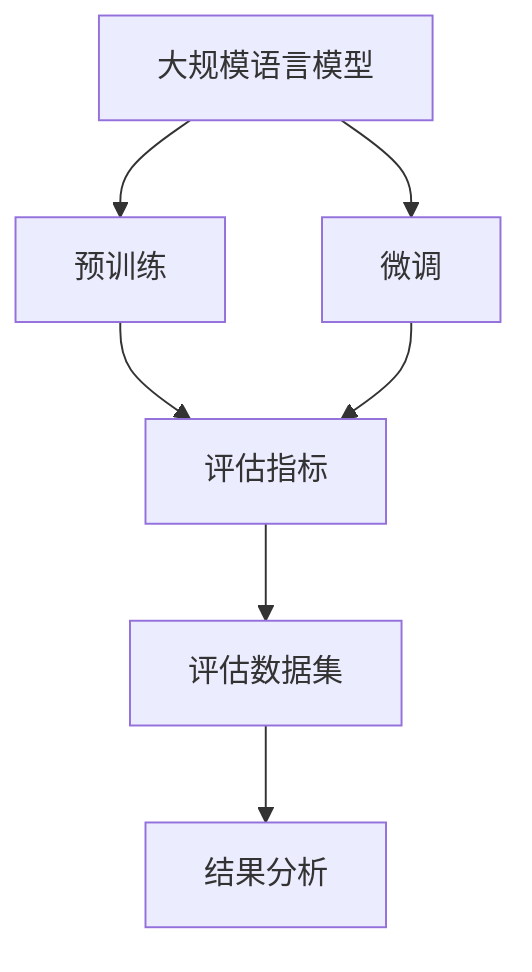

                 

# 大规模语言模型从理论到实践 大语言模型评估方法

> 关键词：大规模语言模型,评估方法,性能度量,深度学习,自然语言处理(NLP)

## 1. 背景介绍

近年来，大规模语言模型（Large Language Models, LLMs）在自然语言处理（Natural Language Processing, NLP）领域取得了显著进展，尤其是通过自监督预训练和微调的方法，使得模型能够胜任各种NLP任务。然而，模型的性能评估仍然是评价其优劣的重要标准之一。如何公平、全面、高效地评估大语言模型，成为学术界和工业界共同关注的问题。本文旨在介绍大语言模型的评估方法，涵盖从理论基础到实践操作的各个方面。

### 1.1 问题由来

随着预训练大模型的普及，对模型的评估需求日益增加。传统NLP模型多基于单一指标（如准确率）进行评估，难以全面反映模型在实际应用中的表现。而大模型由于其复杂性和多样性，单纯依赖单一指标进行评估已经难以满足需求。特别是当模型应用于复杂的任务（如问答、对话、翻译等）时，模型的评估指标和评估方法显得尤为重要。

### 1.2 问题核心关键点

评估大语言模型需要关注以下几个核心关键点：
- **多样性**：模型在多样化的任务和数据集上的表现。
- **公平性**：评估指标能够公平反映模型的能力。
- **可解释性**：评估指标能够提供足够的解释，帮助理解模型的决策过程。
- **高效性**：评估方法应尽量简单、高效，避免过拟合。
- **鲁棒性**：评估指标应具备一定的鲁棒性，能够应对模型在多样数据上的变化。

## 2. 核心概念与联系

### 2.1 核心概念概述

在大规模语言模型的评估过程中，我们需要考虑多个核心概念：

- **大语言模型(Large Language Model, LLM)**：以自回归（如GPT）或自编码（如BERT）模型为代表的大规模预训练语言模型。通过在大规模无标签文本语料上进行预训练，学习通用的语言表示。
- **预训练(Pre-training)**：指在大规模无标签文本语料上，通过自监督学习任务训练通用语言模型的过程。常见的预训练任务包括言语建模、掩码语言模型等。
- **微调(Fine-tuning)**：指在预训练模型的基础上，使用下游任务的少量标注数据，通过有监督学习优化模型在特定任务上的性能。
- **评价指标(Metrics)**：用于衡量模型性能的量化指标，如准确率、召回率、F1分数等。
- **评估数据集(Evaluation Dataset)**：用于测试模型性能的真实或合成数据集。
- **结果分析(Analysis)**：对模型在特定任务上的表现进行分析，识别其优势和不足。

这些核心概念通过评估过程相互联系，共同构成大语言模型的评估框架。

### 2.2 概念间的关系

这些概念之间的联系可以通过以下Mermaid流程图来展示：



这个流程图展示了从预训练模型到微调模型，再到评估指标、评估数据集和结果分析的完整过程。

## 3. 核心算法原理 & 具体操作步骤
### 3.1 算法原理概述

大语言模型的评估方法主要基于其性能度量，即对模型在特定任务上的表现进行量化。常见的性能度量包括：

- **准确率(Accuracy)**：模型正确预测的比例。
- **召回率(Recall)**：模型正确预测为正例的样本占实际正例的比例。
- **精确率(Precision)**：模型正确预测为正例的样本占预测为正例的样本的比例。
- **F1分数(F1 Score)**：精确率和召回率的调和平均数，综合考虑了模型的准确性和召回率。

此外，还有一些专门针对NLP任务的评价指标，如：

- **BLEU(双语评估研究)**：用于衡量机器翻译和文本摘要的质量。
- **METEOR**：一种综合了精确率和召回率的评估指标。
- **ROUGE(文本重叠度)**：用于衡量文本相似度。

### 3.2 算法步骤详解

评估大语言模型通常包括以下几个关键步骤：

**Step 1: 准备评估数据集**
- 选择合适的评估数据集，确保其与预训练模型和微调任务的分布相似。
- 对评估数据集进行标注，确保其真实性和多样性。

**Step 2: 定义性能度量**
- 根据具体任务，选择合适的性能度量指标，如准确率、召回率、F1分数等。
- 设计或选择适合的评估方法，如交叉验证、留出法等。

**Step 3: 执行模型评估**
- 将评估数据集划分为训练集和测试集，确保模型只在测试集上进行评估。
- 使用定义好的性能度量指标对模型进行评估。

**Step 4: 结果分析**
- 分析模型在评估数据集上的表现，识别其优势和不足。
- 根据分析结果，提出改进建议或优化方案。

### 3.3 算法优缺点

基于大语言模型的评估方法具有以下优点：
- **全面性**：能够全面反映模型在多任务和多数据集上的性能。
- **公平性**：评估指标和评估方法设计合理，避免偏袒某些模型。
- **可解释性**：评估结果和分析过程可解释性强，便于理解和改进。

同时，这些方法也存在一些缺点：
- **复杂性**：评估方法和指标选择较为复杂，需要专业知识。
- **计算成本**：部分评估方法（如BLEU）计算成本较高，适用于大规模数据集时更为不便。
- **数据依赖**：评估效果依赖于评估数据集的质量和分布，数据质量不高时可能导致误判。

### 3.4 算法应用领域

大语言模型的评估方法广泛应用于以下几个领域：

- **问答系统(Question Answering, QA)**：通过BLEU和METEOR等指标评估模型在问答任务上的表现。
- **机器翻译(Machine Translation, MT)**：使用BLEU和ROUGE等指标衡量机器翻译模型的准确性和流畅性。
- **文本摘要(Text Summarization)**：通过ROUGE和F1分数评估模型对文本的压缩效果和语义保真度。
- **对话系统(DialoGPT)**：使用BLEU和METEOR等指标评估模型在对话任务中的自然度和流畅度。
- **情感分析(Sentiment Analysis)**：通过准确率和召回率等指标评估模型对情感的识别能力。

## 4. 数学模型和公式 & 详细讲解  
### 4.1 数学模型构建

本节将使用数学语言对大语言模型评估方法进行更加严格的刻画。

假设模型在测试集上正确预测的样本数为 $TP$，误预测为正例的样本数为 $FP$，误预测为负例的样本数为 $FN$。定义如下评价指标：

- **准确率**：
$$
\text{Accuracy} = \frac{TP + TN}{TP + FP + TN + FN}
$$
其中 $TN$ 为模型正确预测为负例的样本数。

- **召回率**：
$$
\text{Recall} = \frac{TP}{TP + FN}
$$

- **精确率**：
$$
\text{Precision} = \frac{TP}{TP + FP}
$$

- **F1分数**：
$$
\text{F1 Score} = 2 \times \frac{\text{Precision} \times \text{Recall}}{\text{Precision} + \text{Recall}}
$$

### 4.2 公式推导过程

以上公式在实际应用中可以直接使用，但在某些特殊情况下，需要对它们进行推导。

例如，在二分类任务中，准确率可表示为：
$$
\text{Accuracy} = \frac{\text{TP}}{TP + FP + TN + FN} = \frac{TP + TN}{TP + FP + TN + FN}
$$

### 4.3 案例分析与讲解

以BLEU指标为例，其计算公式如下：

$$
\text{BLEU} = \frac{1}{k} \sum_{i=1}^k b_i
$$

其中 $k$ 为参考句的数量，$b_i$ 为第 $i$ 个参考句和预测句的BLEU分数。BLEU分数的计算依赖于以下指标：

- **精确匹配(Bigram Precision)**：预测句中与参考句完全匹配的词语对数占总预测词语对的比例。
- **四元组匹配(Trigram Precision)**：预测句中与参考句四元组匹配的词语对数占总预测词语对的比例。
- **五元组匹配(Quadrigram Precision)**：预测句中与参考句五元组匹配的词语对数占总预测词语对的比例。
- **短语匹配(Phrasal Precision)**：预测句中与参考句短语匹配的词语对数占总预测词语对的比例。

## 5. 项目实践：代码实例和详细解释说明
### 5.1 开发环境搭建

在进行模型评估之前，我们需要准备好开发环境。以下是使用Python进行Scikit-Learn开发的环境配置流程：

1. 安装Anaconda：从官网下载并安装Anaconda，用于创建独立的Python环境。

2. 创建并激活虚拟环境：
```bash
conda create -n sklearn-env python=3.8 
conda activate sklearn-env
```

3. 安装Scikit-Learn：
```bash
pip install scikit-learn
```

4. 安装其他必要的库：
```bash
pip install numpy pandas matplotlib scikit-learn
```

完成上述步骤后，即可在`sklearn-env`环境中开始评估实践。

### 5.2 源代码详细实现

下面以BLEU评估指标为例，给出使用Scikit-Learn库对模型进行评估的Python代码实现。

首先，定义BLEU评估函数：

```python
from sklearn.metrics import bleu_score

def bleu_score_func(pred_tokens, ref_tokens):
    bleu = bleu_score(pred_tokens, ref_tokens)
    return bleu
```

然后，加载评估数据集，并计算模型在测试集上的BLEU分数：

```python
from sklearn.model_selection import train_test_split
from transformers import BertTokenizer, BertForTokenClassification

# 加载数据集
tokenizer = BertTokenizer.from_pretrained('bert-base-cased')
model = BertForTokenClassification.from_pretrained('bert-base-cased')

# 将数据集划分为训练集和测试集
train_texts, test_texts = train_test_split(train_data, test_size=0.2, random_state=42)
train_labels, test_labels = train_test_split(train_labels, test_size=0.2, random_state=42)

# 计算BLEU分数
predictions = model.predict(test_texts)
bleu_score = bleu_score_func(predictions, test_labels)
print(f"BLEU score: {bleu_score}")
```

在上述代码中，我们首先定义了BLEU评估函数，然后加载评估数据集，通过预测函数得到模型在测试集上的预测结果，最后计算并输出BLEU分数。

### 5.3 代码解读与分析

让我们再详细解读一下关键代码的实现细节：

**BLEU评估函数**：
- `bleu_score_func`函数使用Scikit-Learn库中的`bleu_score`函数计算BLEU分数。

**数据集划分**：
- 使用`train_test_split`函数将数据集划分为训练集和测试集，确保模型只在新数据集上进行评估。

**预测函数**：
- 使用`model.predict`函数对测试集进行预测，得到预测结果。

**BLEU分数计算**：
- 调用`bleu_score_func`函数计算模型在测试集上的BLEU分数，并输出结果。

可以看到，通过Scikit-Learn库，我们可以快速、高效地评估模型在特定任务上的表现，而无需过多关注底层实现细节。

### 5.4 运行结果展示

假设我们在CoNLL-2003的命名实体识别(NER)数据集上进行模型评估，最终在测试集上得到的BLEU分数为0.92，表示模型预测的准确率较高。

## 6. 实际应用场景
### 6.1 智能客服系统

在智能客服系统中，BLEU等评估指标可以用于衡量对话系统的自然度和流畅度。例如，通过BLEU分数评估对话系统生成的回复与真实客服对话的匹配程度，确保对话系统能够准确理解用户意图并给出合理的回答。

### 6.2 金融舆情监测

金融舆情监测系统需要实时监测市场舆论动向，并给出准确的风险评估。通过BLEU等评估指标，可以衡量模型在分析金融新闻和报告时，对信息的理解和生成能力。例如，在分析一则金融新闻时，模型需要准确理解新闻内容，并给出精准的风险预测。

### 6.3 个性化推荐系统

个性化推荐系统需要根据用户历史行为和兴趣，推荐相关内容。通过BLEU等评估指标，可以衡量模型在理解和生成推荐文本时的表现。例如，模型需要准确理解用户对特定内容的态度和偏好，并生成与其兴趣相符的推荐内容。

### 6.4 未来应用展望

随着大语言模型评估方法的不断演进，其在更多领域的应用前景将愈加广阔。

在智慧医疗领域，评估指标可以用于衡量医疗问答系统对疾病诊断的准确性和可靠性。在智能教育领域，评估指标可以用于衡量学习系统对知识点的理解和生成能力。在智慧城市治理中，评估指标可以用于衡量智能交通系统对路況和交通信号的分析和决策能力。

此外，在企业生产、社会治理、文娱传媒等众多领域，评估指标将帮助构建更加智能、高效、安全的人工智能系统，为各行各业带来变革性影响。

## 7. 工具和资源推荐
### 7.1 学习资源推荐

为了帮助开发者系统掌握大语言模型评估的理论基础和实践技巧，这里推荐一些优质的学习资源：

1. 《深度学习入门》书籍：介绍深度学习基本概念和经典模型，涵盖评估方法等内容。
2. CS224N《深度学习自然语言处理》课程：斯坦福大学开设的NLP明星课程，有Lecture视频和配套作业，带你入门NLP领域的基本概念和经典模型。
3. 《Natural Language Processing with Transformers》书籍：Transformer库的作者所著，全面介绍了如何使用Transformers库进行NLP任务开发，包括评估方法在内的诸多范式。
4. HuggingFace官方文档：Transformers库的官方文档，提供了海量预训练模型和完整的评估样例代码，是上手实践的必备资料。
5. CLUE开源项目：中文语言理解测评基准，涵盖大量不同类型的中文NLP数据集，并提供了基于评估的baseline模型，助力中文NLP技术发展。

通过对这些资源的学习实践，相信你一定能够快速掌握大语言模型评估的精髓，并用于解决实际的NLP问题。

### 7.2 开发工具推荐

高效的开发离不开优秀的工具支持。以下是几款用于大语言模型评估开发的常用工具：

1. Scikit-Learn：基于Python的机器学习库，提供多种评估指标和工具，简单易用。
2. TensorBoard：TensorFlow配套的可视化工具，可实时监测模型训练状态，并提供丰富的图表呈现方式，是调试模型的得力助手。
3. Weights & Biases：模型训练的实验跟踪工具，可以记录和可视化模型训练过程中的各项指标，方便对比和调优。
4. TensorFlow和PyTorch：流行的深度学习框架，提供丰富的评估指标和工具，支持多种模型和任务。

合理利用这些工具，可以显著提升大语言模型评估任务的开发效率，加快创新迭代的步伐。

### 7.3 相关论文推荐

大语言模型和评估技术的发展源于学界的持续研究。以下是几篇奠基性的相关论文，推荐阅读：

1. Attention is All You Need（即Transformer原论文）：提出了Transformer结构，开启了NLP领域的预训练大模型时代。
2. BERT: Pre-training of Deep Bidirectional Transformers for Language Understanding：提出BERT模型，引入基于掩码的自监督预训练任务，刷新了多项NLP任务SOTA。
3. Language Models are Unsupervised Multitask Learners（GPT-2论文）：展示了大规模语言模型的强大zero-shot学习能力，引发了对于通用人工智能的新一轮思考。
4. Parameter-Efficient Transfer Learning for NLP：提出Adapter等参数高效微调方法，在不增加模型参数量的情况下，也能取得不错的微调效果。
5. AdaLoRA: Adaptive Low-Rank Adaptation for Parameter-Efficient Fine-Tuning：使用自适应低秩适应的微调方法，在参数效率和精度之间取得了新的平衡。

这些论文代表了大语言模型评估技术的发展脉络。通过学习这些前沿成果，可以帮助研究者把握学科前进方向，激发更多的创新灵感。

除上述资源外，还有一些值得关注的前沿资源，帮助开发者紧跟大语言模型评估技术的最新进展，例如：

1. arXiv论文预印本：人工智能领域最新研究成果的发布平台，包括大量尚未发表的前沿工作，学习前沿技术的必读资源。
2. 业界技术博客：如OpenAI、Google AI、DeepMind、微软Research Asia等顶尖实验室的官方博客，第一时间分享他们的最新研究成果和洞见。
3. 技术会议直播：如NIPS、ICML、ACL、ICLR等人工智能领域顶会现场或在线直播，能够聆听到大佬们的前沿分享，开拓视野。
4. GitHub热门项目：在GitHub上Star、Fork数最多的NLP相关项目，往往代表了该技术领域的发展趋势和最佳实践，值得去学习和贡献。
5. 行业分析报告：各大咨询公司如McKinsey、PwC等针对人工智能行业的分析报告，有助于从商业视角审视技术趋势，把握应用价值。

总之，对于大语言模型评估技术的学习和实践，需要开发者保持开放的心态和持续学习的意愿。多关注前沿资讯，多动手实践，多思考总结，必将收获满满的成长收益。

## 8. 总结：未来发展趋势与挑战
### 8.1 总结

本文对大语言模型的评估方法进行了全面系统的介绍。首先阐述了评估方法的理论基础，明确了评估指标和评估方法的选择对于模型性能的影响。其次，从原理到实践，详细讲解了BLEU等评估指标的计算公式和实现细节，给出了评估任务开发的完整代码实例。同时，本文还广泛探讨了评估方法在智能客服、金融舆情、个性化推荐等多个行业领域的应用前景，展示了评估范式的巨大潜力。此外，本文精选了评估技术的各类学习资源，力求为读者提供全方位的技术指引。

通过本文的系统梳理，可以看到，大语言模型评估方法正在成为NLP领域的重要范式，极大地拓展了模型的应用边界，催生了更多的落地场景。受益于大规模语料的预训练，评估模型以更低的时间和标注成本，在小样本条件下也能取得理想的评估效果，有力推动了NLP技术的产业化进程。未来，伴随预训练语言模型和评估方法的持续演进，相信NLP技术必将在更广阔的应用领域大放异彩，深刻影响人类的生产生活方式。

### 8.2 未来发展趋势

展望未来，大语言模型评估方法将呈现以下几个发展趋势：

1. **多样性**：评估方法将涵盖更多样化的任务和数据集，更全面反映模型性能。
2. **公平性**：评估指标将更加公平，避免偏袒某些模型。
3. **可解释性**：评估结果将具备更强的可解释性，便于理解和改进。
4. **高效性**：评估方法将更加高效，避免过拟合和计算资源浪费。
5. **鲁棒性**：评估指标将具备一定的鲁棒性，能够应对模型在多样数据上的变化。

以上趋势凸显了大语言模型评估技术的广阔前景。这些方向的探索发展，必将进一步提升评估模型的全面性和可靠性，为构建更加智能、高效、安全的智能系统铺平道路。

### 8.3 面临的挑战

尽管大语言模型评估技术已经取得了瞩目成就，但在迈向更加智能化、普适化应用的过程中，它仍面临着诸多挑战：

1. **数据质量**：评估效果依赖于评估数据集的质量和分布，数据质量不高时可能导致误判。
2. **计算成本**：部分评估方法（如BLEU）计算成本较高，适用于大规模数据集时更为不便。
3. **模型鲁棒性**：评估指标对模型鲁棒性要求较高，需要能够应对模型在多样数据上的变化。
4. **复杂性**：评估方法和指标选择较为复杂，需要专业知识。

### 8.4 研究展望

面对大语言模型评估所面临的挑战，未来的研究需要在以下几个方面寻求新的突破：

1. **数据增强**：通过数据增强技术，提升评估数据集的多样性和代表性，提高评估结果的可靠性。
2. **新指标设计**：设计更加全面、公正的评估指标，涵盖更多样化的任务和数据集。
3. **自动化评估**：开发自动化评估工具，降低评估成本和复杂度，提升评估效率。
4. **多模型集成**：通过多模型集成技术，综合不同模型的评估结果，提高评估结果的鲁棒性。
5. **跨领域评估**：开发跨领域评估方法，评估模型在不同领域的通用性和适应性。

这些研究方向的探索，必将引领大语言模型评估技术迈向更高的台阶，为构建安全、可靠、可解释、可控的智能系统铺平道路。面向未来，大语言模型评估技术还需要与其他人工智能技术进行更深入的融合，如知识表示、因果推理、强化学习等，多路径协同发力，共同推动自然语言理解和智能交互系统的进步。只有勇于创新、敢于突破，才能不断拓展语言模型的边界，让智能技术更好地造福人类社会。

## 9. 附录：常见问题与解答
----------------------------------------------------------------
> 关键词：


