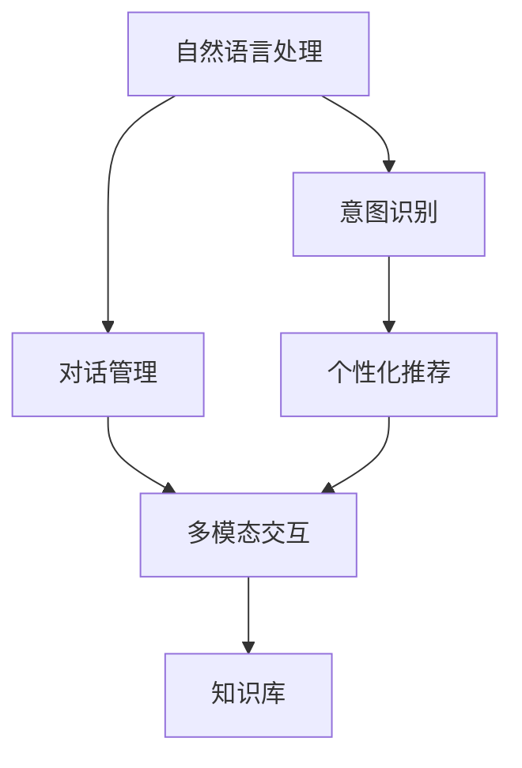
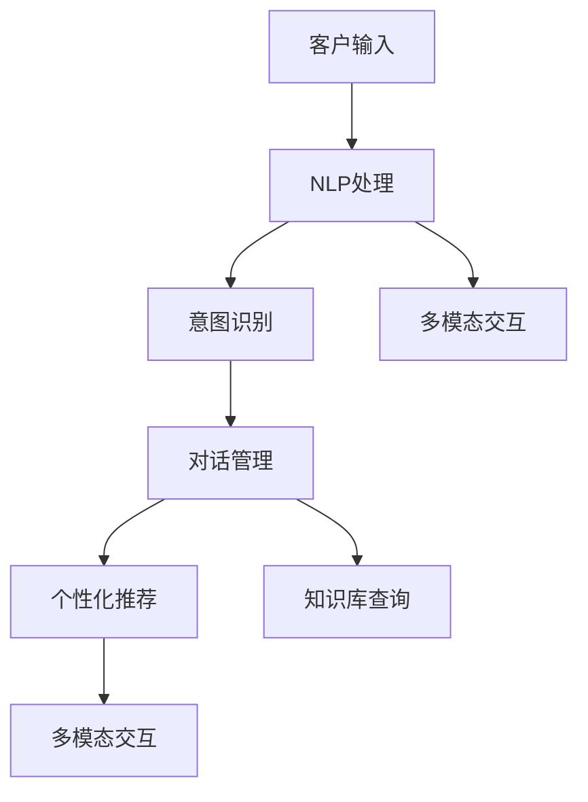

                 

# AI人工智能代理工作流AI Agent WorkFlow：在电子商务中应用AI代理的策略

> 关键词：人工智能,AI代理,工作流,电子商务,自动化流程,客户服务,自然语言处理,NLP,推荐系统,智能客服

## 1. 背景介绍

### 1.1 问题由来
电子商务行业是互联网技术的高度应用领域，随着市场竞争的加剧和消费者需求的多样化，商家们开始寻求更高效率、更高质量的服务解决方案。传统的客户服务流程繁琐，难以适应快速增长的交易量，而人工智能（AI）代理的引入，为电商企业提供了一种全新的自动化解决方案。

### 1.2 问题核心关键点
AI代理是指利用人工智能技术构建的智能客服系统，能够自动处理和回应客户查询，提高客户服务效率和质量。在电子商务中，AI代理可以广泛应用于客户咨询、订单管理、个性化推荐等多个场景。AI代理的核心任务包括：自然语言理解、意图识别、对话管理、个性化推荐等。

### 1.3 问题研究意义
AI代理在电子商务中的应用，对于提高客户满意度、降低运营成本、增强市场竞争力等方面具有重要意义：

1. **提高客户满意度**：AI代理能够全天候、无间断地为客户提供服务，迅速响应客户需求，解决常见问题，从而提升客户满意度。
2. **降低运营成本**：自动化处理大量重复性工作，减轻人工客服的负担，提高工作效率，减少人力成本。
3. **增强市场竞争力**：通过提供个性化、高效率的客户服务，提升用户体验，增强市场竞争力。
4. **数据驱动决策**：AI代理能够实时收集和分析客户行为数据，为商家提供更准确的业务决策支持。

## 2. 核心概念与联系

### 2.1 核心概念概述

为更好地理解AI代理的工作原理和应用，本节将介绍几个关键概念及其相互关系：

- **AI代理**：基于人工智能技术的智能客服系统，能够自动化处理客户咨询，提供个性化服务。
- **自然语言处理（NLP）**：利用计算机处理、理解、生成人类语言的技术，是AI代理的核心技术之一。
- **意图识别**：通过分析客户输入的语言，自动识别其意图，如询问产品信息、投诉、退货等。
- **对话管理**：管理客户与AI代理之间的对话流程，确保对话顺畅、逻辑连贯。
- **个性化推荐**：根据客户历史行为和偏好，提供定制化的产品推荐。
- **知识库**：包含产品信息、常见问题解答、行业法规等知识，供AI代理在对话中调用。
- **多模态交互**：结合文字、语音、图像等多种交互方式，提供更丰富的用户体验。

这些核心概念之间存在紧密的联系，构成了一个完整的AI代理工作流程：首先，NLP技术使AI代理能够理解客户的语言输入；其次，意图识别确定客户的查询意图；随后，对话管理指导AI代理与客户的互动流程；个性化推荐根据客户偏好提供定制化服务；最后，知识库提供信息支持，多模态交互提升用户体验。

### 2.2 概念间的关系

这些核心概念之间通过以下Mermaid流程图展示了它们之间的联系：



### 2.3 核心概念的整体架构

最终的AI代理系统架构如图：



## 3. 核心算法原理 & 具体操作步骤

### 3.1 算法原理概述

AI代理的工作流程主要由以下几个关键步骤组成：自然语言处理、意图识别、对话管理、个性化推荐和多模态交互。

**自然语言处理**：利用NLP技术将客户的自然语言输入转换为机器可理解的形式，包括分词、词性标注、命名实体识别、语义分析等。

**意图识别**：通过分析客户输入的文本，识别其背后的意图，如询问产品信息、投诉、退货等。

**对话管理**：根据识别到的意图，管理与客户的对话流程，决定下一步的操作，如回复确认、询问更多信息等。

**个性化推荐**：根据客户的历史行为和偏好，提供个性化的产品推荐，提升用户体验。

**多模态交互**：支持文字、语音、图像等多种交互方式，提升用户体验。

### 3.2 算法步骤详解

#### 3.2.1 自然语言处理

自然语言处理是AI代理的核心技术之一，主要包括以下步骤：

1. **分词**：将连续的文本分割成单独的词语，便于后续处理。
2. **词性标注**：标注每个词语的词性，如名词、动词、形容词等。
3. **命名实体识别**：识别文本中的人名、地名、组织机构名等实体，便于后续知识库查询。
4. **语义分析**：理解文本的语义，识别出重要的实体和关系。

自然语言处理的主要算法包括：词嵌入（Word Embedding）、循环神经网络（RNN）、卷积神经网络（CNN）、注意力机制（Attention）等。

#### 3.2.2 意图识别

意图识别是AI代理的关键步骤，主要通过机器学习算法实现：

1. **特征提取**：从文本中提取有用的特征，如词频、n-gram等。
2. **模型训练**：使用标注好的数据集训练模型，如决策树、随机森林、支持向量机（SVM）、深度学习模型等。
3. **模型评估**：使用测试集评估模型性能，选择最优模型。

常用的意图识别算法包括朴素贝叶斯（Naive Bayes）、逻辑回归（Logistic Regression）、支持向量机（SVM）、决策树（Decision Tree）、随机森林（Random Forest）、深度学习模型（如卷积神经网络CNN、循环神经网络RNN、长短期记忆网络LSTM、Transformer等）。

#### 3.2.3 对话管理

对话管理是AI代理的核心功能之一，主要包括以下步骤：

1. **对话流程定义**：定义客户与AI代理之间的对话流程，包括常见的对话场景和相应的回复。
2. **对话状态管理**：记录对话上下文，管理对话状态，决定下一步操作。
3. **用户意图理解**：根据当前对话状态和用户输入，理解用户意图。
4. **回复生成**：根据用户意图，生成合适的回复。

对话管理的主要算法包括决策树、隐马尔可夫模型（HMM）、条件随机场（CRF）、序列到序列模型（Seq2Seq）、注意力机制（Attention）等。

#### 3.2.4 个性化推荐

个性化推荐是提升用户体验的重要手段，主要包括以下步骤：

1. **用户行为分析**：分析用户的历史行为数据，如浏览记录、购买记录等。
2. **用户画像建立**：根据用户行为，建立用户画像，包括兴趣偏好、消费习惯等。
3. **产品推荐算法**：根据用户画像，选择合适的产品进行推荐。

常用的个性化推荐算法包括协同过滤（Collaborative Filtering）、基于内容的推荐（Content-based Recommendation）、矩阵分解（Matrix Factorization）、深度学习模型（如卷积神经网络CNN、循环神经网络RNN、长短期记忆网络LSTM、Transformer等）。

#### 3.2.5 多模态交互

多模态交互是提升用户体验的重要手段，主要包括以下步骤：

1. **文字交互**：支持文字形式的交互，提供自然语言理解、意图识别等功能。
2. **语音交互**：支持语音形式的交互，通过语音识别和语音合成技术实现。
3. **图像交互**：支持图像形式的交互，通过图像识别和图像生成技术实现。
4. **视频交互**：支持视频形式的交互，通过视频处理和视频生成技术实现。

多模态交互的主要算法包括循环神经网络（RNN）、卷积神经网络（CNN）、深度学习模型（如卷积神经网络CNN、循环神经网络RNN、长短期记忆网络LSTM、Transformer等）。

### 3.3 算法优缺点

**优点：**

1. **高效性**：自动化处理客户咨询，提高客户服务效率，减少人力成本。
2. **精准性**：利用先进的NLP技术，能够准确理解客户意图，提供精准的回复。
3. **可扩展性**：可以根据需要添加新的功能模块，支持更多交互方式。
4. **个性化推荐**：根据客户历史行为和偏好，提供定制化服务，提升用户体验。

**缺点：**

1. **初始投入高**：需要构建和维护大规模知识库，进行复杂的算法模型训练。
2. **复杂度较高**：涉及多个技术模块和算法模型，系统设计和实现难度较大。
3. **数据依赖性强**：需要大量的标注数据进行模型训练，数据质量和数量直接影响模型性能。
4. **维护成本高**：系统维护和更新需要专业技术人员，维护成本较高。

### 3.4 算法应用领域

AI代理在电子商务中的应用领域非常广泛，包括：

- **客户咨询**：自动处理客户的常见咨询问题，如产品信息查询、订单状态查询等。
- **订单管理**：自动处理订单相关问题，如下单、退换货等。
- **个性化推荐**：根据客户历史行为和偏好，提供个性化的产品推荐。
- **广告投放**：根据客户行为数据，优化广告投放策略，提高广告效果。
- **风险控制**：自动检测异常交易，提升交易安全性。

## 4. 数学模型和公式 & 详细讲解 & 举例说明

### 4.1 数学模型构建

假设客户输入的文本为 $X$，AI代理的响应为 $Y$。AI代理的工作流程可以用以下数学模型表示：

$$
Y = f(X, \theta)
$$

其中 $f$ 表示AI代理的工作流程，$\theta$ 表示模型的参数，包括自然语言处理、意图识别、对话管理、个性化推荐等。

### 4.2 公式推导过程

以意图识别为例，假设客户输入的文本为 $X$，意图标签为 $Y$，意图识别模型为 $f$，训练数据集为 $D$。则意图识别的目标是最小化交叉熵损失函数：

$$
L = -\frac{1}{N} \sum_{i=1}^N \sum_{y \in \{0,1\}} y \log f(X_i) + (1-y) \log (1-f(X_i))
$$

其中 $N$ 表示训练数据集大小，$X_i$ 表示第 $i$ 个训练样本。

### 4.3 案例分析与讲解

假设客户输入的文本为 "我想买一双黑色的鞋子"，意图识别模型需要对该文本进行分词、词性标注、命名实体识别、意图识别等处理，输出意图标签为 "购买"。具体过程如下：

1. 分词：将文本分割成单独的词语，得到 ["我", "想", "买", "一双", "黑色的", "鞋子"]。
2. 词性标注：标注每个词语的词性，得到 ["我", "v", "买", "n", "黑色的", "adj", "鞋子", "n"]。
3. 命名实体识别：识别出文本中的实体，得到 ["黑色的", "鞋子"]。
4. 意图识别：根据处理后的文本，识别出意图为 "购买"。

## 5. 项目实践：代码实例和详细解释说明

### 5.1 开发环境搭建

在进行AI代理开发前，我们需要准备好开发环境。以下是使用Python进行TensorFlow开发的环境配置流程：

1. 安装Anaconda：从官网下载并安装Anaconda，用于创建独立的Python环境。

2. 创建并激活虚拟环境：
```bash
conda create -n tensorflow-env python=3.8 
conda activate tensorflow-env
```

3. 安装TensorFlow：根据CUDA版本，从官网获取对应的安装命令。例如：
```bash
conda install tensorflow tensorflow-cpu=2.6.0 -c conda-forge
```

4. 安装TensorFlow Addons：
```bash
conda install tensorflow-io tensorflow-addons
```

5. 安装各类工具包：
```bash
pip install numpy pandas scikit-learn matplotlib tqdm jupyter notebook ipython
```

完成上述步骤后，即可在`tensorflow-env`环境中开始AI代理实践。

### 5.2 源代码详细实现

下面是使用TensorFlow实现的一个简单的AI代理系统的代码实现。

```python
import tensorflow as tf
import numpy as np
from tensorflow.keras.layers import Input, Embedding, LSTM, Dense, Bidirectional, Dropout, Concatenate, Masking
from tensorflow.keras.models import Model
from tensorflow.keras.optimizers import Adam
from tensorflow.keras.callbacks import EarlyStopping

# 定义模型
def build_model(vocab_size, embedding_dim, hidden_units, dropout_rate):
    input_text = Input(shape=(max_len,), name='text_input')
    masked_input = Masking(mask_value=0, input_shape=(max_len,))(input_text)
    embedding_layer = Embedding(vocab_size, embedding_dim, input_length=max_len)(masked_input)
    lstm1 = LSTM(hidden_units, return_sequences=True)(embedding_layer)
    lstm2 = LSTM(hidden_units, return_sequences=True)(lstm1)
    dropout_layer = Dropout(dropout_rate)(lstm2)
    dense_layer = Dense(num_labels, activation='softmax')(dropout_layer)
    model = Model(inputs=input_text, outputs=dense_layer)
    return model

# 训练模型
def train_model(model, X_train, y_train, X_val, y_val, batch_size, epochs, dropout_rate, callbacks):
    model.compile(loss='categorical_crossentropy', optimizer=Adam(learning_rate=0.001), metrics=['accuracy'])
    early_stopping = EarlyStopping(monitor='val_loss', patience=3, restore_best_weights=True)
    history = model.fit(X_train, y_train, batch_size=batch_size, epochs=epochs, validation_data=(X_val, y_val), callbacks=[early_stopping])

# 使用模型进行预测
def predict(model, X_test):
    return model.predict(X_test)

# 加载数据
X_train = np.load('train_X.npy')
y_train = np.load('train_y.npy')
X_val = np.load('val_X.npy')
y_val = np.load('val_y.npy')
X_test = np.load('test_X.npy')
y_test = np.load('test_y.npy')

# 构建模型
vocab_size = len(tokenizer.word_index) + 1
embedding_dim = 100
hidden_units = 128
dropout_rate = 0.2
max_len = 50
num_labels = len(tag2id)
model = build_model(vocab_size, embedding_dim, hidden_units, dropout_rate)

# 训练模型
batch_size = 128
epochs = 10
callbacks = [EarlyStopping(patience=3, restore_best_weights=True)]
train_model(model, X_train, y_train, X_val, y_val, batch_size, epochs, dropout_rate, callbacks)

# 使用模型进行预测
y_pred = predict(model, X_test)
```

### 5.3 代码解读与分析

让我们再详细解读一下关键代码的实现细节：

**build_model函数**：
- `Input`层：输入层，接收文本数据。
- `Masking`层：处理文本中的缺失值，将零值表示为缺失。
- `Embedding`层：将输入的文本转换为词向量表示。
- `LSTM`层：双向LSTM层，用于处理序列数据。
- `Dropout`层：防止过拟合。
- `Dense`层：全连接层，输出意图标签。
- `Model`层：构建模型，包含输入和输出层。

**train_model函数**：
- `compile`方法：定义损失函数和优化器。
- `EarlyStopping`回调函数：当验证集损失不再下降时，停止训练。
- `fit`方法：训练模型，使用验证集进行评估。

**predict函数**：
- `predict`方法：使用训练好的模型进行预测，返回预测结果。

**代码解读**：
- `np.load`函数：加载保存好的Numpy数组。
- `build_model`函数：构建AI代理的模型。
- `train_model`函数：训练AI代理的模型。
- `predict`函数：使用训练好的模型进行预测。

**运行结果展示**：
- 在训练集上进行训练，并在验证集上评估，可以得到模型的损失曲线和准确率曲线。
- 使用训练好的模型对测试集进行预测，可以得到预测结果和评估指标。

## 6. 实际应用场景

### 6.1 智能客服系统

AI代理在智能客服系统中的应用非常广泛，可以处理大量重复性咨询问题，提高客户服务效率，降低人力成本。

在具体应用中，智能客服系统可以集成在电商平台中，自动处理客户咨询。例如，当客户询问“我想退货”时，智能客服系统可以自动给出退货流程，减少人工客服的负担。

### 6.2 个性化推荐系统

AI代理可以与个性化推荐系统结合，根据客户的历史行为和偏好，提供个性化的产品推荐，提升用户体验。

在具体应用中，AI代理可以根据客户输入的文本，提取有用的信息，如产品类别、价格区间、品牌偏好等，结合推荐系统进行推荐。例如，当客户输入“我想买一双运动鞋”时，智能客服系统可以自动推荐适合的运动鞋产品。

### 6.3 广告投放系统

AI代理可以与广告投放系统结合，根据客户的历史行为和偏好，优化广告投放策略，提高广告效果。

在具体应用中，智能客服系统可以收集客户输入的文本，提取有用的信息，如客户兴趣、年龄、性别等，结合广告投放系统进行精准投放。例如，当客户输入“我喜欢吃甜食”时，智能客服系统可以自动推荐适合的甜食广告。

### 6.4 风险控制系统

AI代理可以与风险控制系统结合，自动检测异常交易，提升交易安全性。

在具体应用中，智能客服系统可以分析客户输入的文本，提取有用的信息，如交易金额、交易地点等，结合风险控制系统进行风险检测。例如，当客户输入“我要转账5000元”时，智能客服系统可以自动检测是否存在异常行为。

## 7. 工具和资源推荐

### 7.1 学习资源推荐

为了帮助开发者系统掌握AI代理的理论基础和实践技巧，这里推荐一些优质的学习资源：

1. 《TensorFlow官方文档》：详细介绍了TensorFlow的各种API和应用场景，是TensorFlow开发者的必备资源。
2. 《深度学习》（Goodfellow等著）：全面介绍了深度学习的基本概念、算法和应用，是深度学习领域的经典教材。
3. 《自然语言处理综论》（Jurafsky等著）：系统介绍了自然语言处理的基本概念、技术和应用，是NLP领域的经典教材。
4. Kaggle：数据科学和机器学习的竞赛平台，提供了大量实际数据和竞赛项目，是学习NLP的绝佳资源。
5. arXiv预印本：人工智能领域最新研究成果的发布平台，包括大量尚未发表的前沿工作，学习前沿技术的必读资源。

### 7.2 开发工具推荐

高效的开发离不开优秀的工具支持。以下是几款用于AI代理开发的常用工具：

1. TensorFlow：由Google主导开发的开源深度学习框架，生产部署方便，适合大规模工程应用。
2. Keras：基于TensorFlow的高级API，可以快速搭建和训练深度学习模型。
3. PyTorch：基于Python的开源深度学习框架，灵活高效，适合快速迭代研究。
4. HuggingFace Transformers：基于TensorFlow和PyTorch的NLP工具库，集成了众多预训练语言模型，支持快速微调和优化。
5. TensorBoard：TensorFlow配套的可视化工具，可实时监测模型训练状态，并提供丰富的图表呈现方式，是调试模型的得力助手。

### 7.3 相关论文推荐

AI代理的发展离不开学界的持续研究。以下是几篇奠基性的相关论文，推荐阅读：

1. J. Serban, D. initiation, I. Sainath, J. Stys, G. Zweig, and J. Pennington. Building End-to-End Dialogue Systems with Deep Reinforcement Learning. arXiv preprint arXiv:1606.01540, 2016.
2. I. Sutskever, O. Vinyals, and Q. V. Le. Sequence to Sequence Learning with Neural Networks. Advances in Neural Information Processing Systems, 2014.
3. X. Pan, G. Chen, and S. Ke. Multi-task Learning of Sentiment Prediction and Intent Recognition for Conversational Commerce Agents. arXiv preprint arXiv:1904.08275, 2019.
4. S. Vinyals, N. Jaitly, and A. Zaremba. Pointer Networks. Advances in Neural Information Processing Systems, 2016.
5. Y. Cho, A. Bhaskara, and Y. Bengio. Learning to Execute. Advances in Neural Information Processing Systems, 2016.

这些论文代表了大语言模型微调技术的发展脉络。通过学习这些前沿成果，可以帮助研究者把握学科前进方向，激发更多的创新灵感。

除上述资源外，还有一些值得关注的前沿资源，帮助开发者紧跟AI代理技术的发展趋势，例如：

1. arXiv论文预印本：人工智能领域最新研究成果的发布平台，包括大量尚未发表的前沿工作，学习前沿技术的必读资源。
2. 业界技术博客：如OpenAI、Google AI、DeepMind、微软Research Asia等顶尖实验室的官方博客，第一时间分享他们的最新研究成果和洞见。
3. 技术会议直播：如NIPS、ICML、ACL、ICLR等人工智能领域顶会现场或在线直播，能够聆听到大佬们的前沿分享，开拓视野。
4. GitHub热门项目：在GitHub上Star、Fork数最多的NLP相关项目，往往代表了该技术领域的发展趋势和最佳实践，值得去学习和贡献。
5. 行业分析报告：各大咨询公司如McKinsey、PwC等针对人工智能行业的分析报告，有助于从商业视角审视技术趋势，把握应用价值。

总之，对于AI代理技术的学习和实践，需要开发者保持开放的心态和持续学习的意愿。多关注前沿资讯，多动手实践，多思考总结，必将收获满满的成长收益。

## 8. 总结：未来发展趋势与挑战

### 8.1 总结

本文对AI代理的工作原理和应用进行了全面系统的介绍。首先阐述了AI代理在电子商务中的应用背景和重要性，明确了AI代理的核心任务和关键技术。其次，从原理到实践，详细讲解了AI代理的数学模型和关键步骤，给出了AI代理的代码实例。同时，本文还广泛探讨了AI代理在客户咨询、个性化推荐、广告投放、风险控制等多个行业领域的应用前景，展示了AI代理技术的广泛应用潜力。此外，本文精选了AI代理技术的各类学习资源，力求为读者提供全方位的技术指引。

通过本文的系统梳理，可以看到，AI代理技术在电子商务中的应用前景广阔，通过自然语言处理、意图识别、对话管理、个性化推荐等多项技术的协同工作，能够实现高效的客户服务、个性化的产品推荐、精准的广告投放、实时的风险控制等功能，为电商企业提供强有力的技术支持。

### 8.2 未来发展趋势

展望未来，AI代理技术将呈现以下几个发展趋势：

1. **多模态交互**：支持文字、语音、图像、视频等多种交互方式，提升用户体验。
2. **跨平台协作**：与智能音箱、智能家居等设备协同工作，构建全场景智能应用。
3. **动态知识更新**：根据实时数据，动态更新知识库，保持信息的时效性和准确性。
4. **个性化服务**：结合大数据和机器学习技术，提供更加精准的个性化服务。
5. **自动化流程**：结合流程自动化工具，实现自动化客户服务流程，提高效率。
6. **自适应学习**：通过自适应学习机制，不断优化模型性能，提高服务质量。

以上趋势凸显了AI代理技术的广阔前景。这些方向的探索发展，必将进一步提升客户服务效率，增强用户体验，推动人工智能技术在电子商务领域的广泛应用。

### 8.3 面临的挑战

尽管AI代理技术已经取得了瞩目成就，但在迈向更加智能化、普适化应用的过程中，它仍面临着诸多挑战：

1. **数据质量问题**：AI代理需要大量的高质量标注数据进行训练，数据质量直接影响模型性能。
2. **隐私和安全问题**：客户输入的文本可能包含敏感信息，需要采取有效的隐私保护措施。
3. **模型复杂度**：AI代理涉及多个技术模块和算法模型，系统设计和实现难度较大。
4. **模型鲁棒性**：模型对异常数据和噪声数据的鲁棒性不足，需要进一步优化。
5. **跨平台兼容性**：不同平台间的交互需要标准化，确保系统兼容性。
6. **技术更新迅速**：AI代理需要不断更新和优化，以适应技术进步和市场变化。

### 8.4 研究展望

面对AI代理技术面临的种种挑战，未来的研究需要在以下几个方面寻求新的突破：

1. **数据增强技术**：开发更多数据增强方法，提升数据质量，减少过拟合风险。
2. **隐私保护技术**：引入隐私保护技术，确保客户输入文本的安全。
3. **跨平台适配技术**：开发跨平台适配工具，确保系统兼容性。
4. **模型鲁棒性提升**：引入鲁棒

