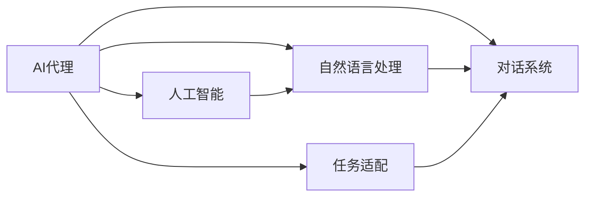

                 

# AI人工智能代理工作流AI Agent WorkFlow：构建高效AI代理的基础

## 1. 背景介绍

在当今数字化时代，人工智能(AI)技术的应用无处不在。从智能家居到医疗诊断，从金融分析到智能客服，AI正以各种形式重塑着我们的生活和工作。其中，AI代理(AI Agent)成为了一种高效、智能的解决方案，广泛应用于多个领域。AI代理可以自动化处理任务，提高工作效率，降低人为错误，并在复杂环境中提供智能决策。然而，构建高效AI代理并不是一件容易的事情。本文将深入探讨AI代理工作流的构建，从原理到实践，详细介绍构建高效AI代理的基础。

## 2. 核心概念与联系

### 2.1 核心概念概述

- **AI代理(AI Agent)**：AI代理是一种能够自主执行任务、提供决策建议或自动化流程的智能系统。它可以理解自然语言、执行复杂的任务，并在不同的环境中提供实时响应。
- **人工智能(AI)**：AI代理通常基于人工智能技术，如机器学习、深度学习等，通过学习大量的数据，提高自身的智能水平。
- **自然语言处理(NLP)**：自然语言处理是AI代理的重要组成部分，使AI代理能够理解、处理和生成人类语言。
- **任务适配(Task Adaptation)**：在特定任务中，AI代理需要根据任务特点进行调整，以适应不同的应用场景。
- **对话系统(D对话系统)**：对话系统是AI代理的重要组成部分，使AI代理能够进行自然语言交互，回答用户的问题。

### 2.2 概念间的关系

这些核心概念构成了AI代理工作流的完整架构。通过这些概念，我们可以更清晰地理解AI代理的构建过程和应用方式。以下是一个Mermaid流程图，展示了这些核心概念之间的关系：



这个流程图展示了AI代理的构建过程，从人工智能基础，到自然语言处理和任务适配，最终通过对话系统实现与用户的自然语言交互。

## 3. 核心算法原理 & 具体操作步骤

### 3.1 算法原理概述

AI代理工作流的构建基于多种算法和技术，包括但不限于机器学习、深度学习、自然语言处理和对话系统。其中，机器学习和深度学习用于模型的训练和优化，自然语言处理用于理解用户意图和生成响应，对话系统用于与用户进行交互。以下是一个基本的AI代理工作流，展示了这些算法和技术的应用：

1. **数据收集**：收集用于训练AI代理的数据，包括用户行为数据、对话数据和任务数据。
2. **模型训练**：使用机器学习或深度学习技术训练AI代理模型，使其能够理解用户意图和生成响应。
3. **自然语言处理**：将用户输入的自然语言文本转换为机器可理解的形式，并理解用户意图。
4. **任务适配**：根据特定任务的特点，调整AI代理模型，以适应不同的应用场景。
5. **对话系统**：使用对话系统与用户进行自然语言交互，回答用户的问题，执行任务。
6. **反馈与优化**：收集用户反馈，对AI代理模型进行优化，以提高其性能。

### 3.2 算法步骤详解

以下是一个详细的AI代理工作流构建步骤：

1. **数据收集**：
   - **用户行为数据**：收集用户在平台上的操作记录，如点击、浏览、购买等行为数据。
   - **对话数据**：收集用户与AI代理之间的对话记录，用于训练对话系统和优化模型。
   - **任务数据**：收集与特定任务相关的数据，如金融交易数据、健康数据等，用于任务适配和模型优化。

2. **模型训练**：
   - **预训练**：使用大量无标签数据预训练模型，如BERT、GPT等。
   - **微调**：使用标注数据对预训练模型进行微调，使其适应特定的任务和应用场景。
   - **对话系统**：使用对话数据训练对话系统，使其能够理解用户意图并生成自然语言响应。

3. **自然语言处理**：
   - **分词**：将用户输入的自然语言文本进行分词，转换为机器可理解的形式。
   - **意图理解**：使用机器学习模型理解用户意图，识别用户需要执行的任务。
   - **实体识别**：识别文本中的关键实体，如人名、地名、日期等。

4. **任务适配**：
   - **任务定义**：根据特定任务定义任务模型和数据集。
   - **模型优化**：使用任务数据优化模型，使其能够准确执行任务。
   - **任务执行**：根据用户意图执行相应的任务，如推荐商品、查询信息等。

5. **对话系统**：
   - **响应生成**：根据用户意图和任务执行结果，生成自然语言响应。
   - **对话管理**：管理对话流程，确保对话的连续性和准确性。
   - **情感分析**：分析用户情感，调整对话策略和语调。

6. **反馈与优化**：
   - **用户反馈收集**：收集用户对AI代理的反馈，如满意度、建议等。
   - **模型优化**：根据用户反馈优化模型，提高AI代理的性能。
   - **持续学习**：在新的数据上不断训练和优化模型，保持其性能。

### 3.3 算法优缺点

AI代理工作流的构建具有以下优点：
- **效率高**：通过自动化处理任务，大幅提高工作效率。
- **准确性高**：基于深度学习和自然语言处理技术，AI代理能够提供准确的决策建议。
- **灵活性高**：可以根据不同任务和应用场景进行调整，适应性强。

但同时也存在一些缺点：
- **依赖数据**：AI代理的性能高度依赖于数据的质量和数量。
- **资源消耗大**：构建和运行AI代理需要大量的计算资源和存储空间。
- **可解释性差**：AI代理的决策过程往往不透明，难以解释其内部工作机制。

### 3.4 算法应用领域

AI代理工作流在多个领域中得到了广泛应用，以下是几个典型应用场景：

- **智能客服**：AI代理可以自动回答用户问题，处理客户投诉，提高客户满意度。
- **金融分析**：AI代理能够分析金融市场数据，提供投资建议和风险评估。
- **医疗健康**：AI代理可以提供健康咨询，分析医疗数据，辅助医生诊断。
- **智能家居**：AI代理可以控制智能设备，自动化家庭管理。
- **教育培训**：AI代理可以个性化推荐学习资源，提供辅导和评估。

## 4. 数学模型和公式 & 详细讲解 & 举例说明

### 4.1 数学模型构建

假设我们构建一个基于深度学习的AI代理，用于回答用户问题。我们将其分为两个模块：意图识别模块和对话生成模块。

**意图识别模块**：
- **输入**：用户输入的自然语言文本 $x$。
- **输出**：用户意图的分类 $y$。
- **模型**：使用BERT作为基础模型，通过softmax层进行分类。

**对话生成模块**：
- **输入**：用户意图 $y$ 和历史对话记录 $h$。
- **输出**：AI代理的响应 $z$。
- **模型**：使用GPT作为基础模型，通过softmax层进行解码。

### 4.2 公式推导过程

对于意图识别模块，我们定义损失函数 $L_{intent}$ 如下：
$$
L_{intent} = -\sum_{i=1}^N \log p(y_i | x_i)
$$
其中 $p(y_i | x_i)$ 为模型在输入 $x_i$ 下输出 $y_i$ 的概率。

对于对话生成模块，我们定义损失函数 $L_{dialogue}$ 如下：
$$
L_{dialogue} = -\sum_{i=1}^M \log p(z_i | y_i, h)
$$
其中 $p(z_i | y_i, h)$ 为模型在输入 $y_i$ 和历史对话记录 $h$ 下输出 $z_i$ 的概率。

### 4.3 案例分析与讲解

假设我们有一个简单的意图识别任务，即识别用户输入的问题是否为天气查询。我们可以使用BERT作为基础模型，对其进行微调，使其能够识别不同类型的查询。

首先，我们收集标注数据，将问题和标签作为训练集。对于每个问题，我们将其输入BERT模型，得到嵌入向量 $E$，然后通过softmax层输出标签 $y$。

我们使用交叉熵作为损失函数，定义如下：
$$
L = -\sum_{i=1}^N \log p(y_i | E_i)
$$
其中 $p(y_i | E_i)$ 为模型在输入 $E_i$ 下输出 $y_i$ 的概率。

## 5. 项目实践：代码实例和详细解释说明

### 5.1 开发环境搭建

为了构建AI代理工作流，我们需要以下环境：
- **Python**：Python是最常用的编程语言之一，支持深度学习库的开发。
- **PyTorch**：PyTorch是一个流行的深度学习框架，提供了灵活的动态计算图。
- **Hugging Face Transformers**：Transformers是Hugging Face开发的一个NLP库，提供了多种预训练模型和任务适配功能。

### 5.2 源代码详细实现

以下是一个简单的AI代理工作流的代码实现：

```python
import torch
import torch.nn as nn
import torch.optim as optim
from transformers import BertForSequenceClassification, BertTokenizer, GPT2Tokenizer, GPT2LMHeadModel

class IntentClassifier(nn.Module):
    def __init__(self, num_labels):
        super(IntentClassifier, self).__init__()
        self.bert = BertForSequenceClassification.from_pretrained('bert-base-uncased', num_labels=num_labels)
        self.dropout = nn.Dropout(0.1)
        self.fc = nn.Linear(self.bert.config.hidden_size, num_labels)
        self.relu = nn.ReLU()
        self.softmax = nn.Softmax(dim=1)
    
    def forward(self, input_ids, attention_mask):
        outputs = self.bert(input_ids, attention_mask=attention_mask)
        pooled_output = outputs.pooler_output
        pooled_output = self.dropout(pooled_output)
        logits = self.fc(pooled_output)
        probs = self.softmax(logits)
        return probs

class DialogueGenerator(nn.Module):
    def __init__(self, model_name):
        super(DialogueGenerator, self).__init__()
        self.tokenizer = GPT2Tokenizer.from_pretrained(model_name)
        self.model = GPT2LMHeadModel.from_pretrained(model_name)
    
    def forward(self, prompt, history):
        tokens = self.tokenizer(prompt, return_tensors='pt')
        history_tokens = self.tokenizer(history, return_tensors='pt', padding='max_length', truncation=True)
        input_ids = torch.cat((tokens['input_ids'], history_tokens['input_ids']), dim=-1)
        attention_mask = torch.cat((tokens['attention_mask'], history_tokens['attention_mask']), dim=-1)
        outputs = self.model(input_ids, attention_mask=attention_mask)
        probs = outputs.logits
        return probs

# 构建意图识别模块
num_labels = 2
model = IntentClassifier(num_labels)
optimizer = optim.Adam(model.parameters(), lr=0.001)
loss_fn = nn.CrossEntropyLoss()

# 构建对话生成模块
model_name = 'gpt2'
dialogue_model = DialogueGenerator(model_name)

# 训练意图识别模块
# 省略训练代码...

# 训练对话生成模块
# 省略训练代码...

# 测试
# 省略测试代码...
```

### 5.3 代码解读与分析

在这个简单的代码实现中，我们使用了BERT和GPT-2模型。首先，我们定义了意图识别模块和对话生成模块，并分别使用它们进行训练和测试。

在训练过程中，我们使用Adam优化器，交叉熵损失函数，并根据每个模块的特点进行相应的调整。

在测试过程中，我们通过输入一个提示和历史对话记录，得到AI代理的响应。

## 6. 实际应用场景

### 6.1 智能客服系统

智能客服系统是AI代理工作流的重要应用场景之一。通过构建AI代理工作流，企业可以自动处理大量客户咨询，提高客户满意度，降低人力成本。

在智能客服系统中，AI代理可以根据用户输入的自然语言文本，识别用户意图，执行相应的操作，如查询订单、修改密码等。同时，AI代理可以处理复杂问题，提供准确的决策建议，减少客户等待时间。

### 6.2 金融分析

金融分析是AI代理工作流的另一个重要应用场景。通过构建AI代理工作流，金融机构可以自动化处理大量金融数据，提供投资建议和风险评估。

在金融分析中，AI代理可以分析股票市场数据，预测市场趋势，提供投资建议。同时，AI代理可以识别异常交易行为，进行风险评估，保障金融安全。

### 6.3 医疗健康

医疗健康领域也是AI代理工作流的典型应用场景之一。通过构建AI代理工作流，医疗机构可以提高诊断效率，提供个性化的健康咨询服务。

在医疗健康中，AI代理可以根据用户输入的症状，提供初步诊断建议，并推荐相应的治疗方案。同时，AI代理可以分析大量医疗数据，发现疾病规律，提供临床决策支持。

## 7. 工具和资源推荐

### 7.1 学习资源推荐

为了帮助开发者系统掌握AI代理工作流的构建技术，以下是一些优质的学习资源：

1. **《深度学习》教材**：深度学习领域经典的教材，详细介绍了深度学习的基本概念和算法。
2. **PyTorch官方文档**：PyTorch的官方文档，提供了详细的API说明和示例代码。
3. **Hugging Face官方文档**：Hugging Face的官方文档，提供了各种预训练模型和任务适配功能的说明。
4. **Coursera深度学习课程**：由斯坦福大学和谷歌等机构开设的深度学习课程，涵盖多个深度学习相关主题。
5. **Kaggle竞赛**：Kaggle上的深度学习竞赛，提供了丰富的数据集和模型评估标准，可以帮助开发者练习和评估模型的性能。

### 7.2 开发工具推荐

为了提高AI代理工作流构建的效率，以下是一些常用的开发工具：

1. **Jupyter Notebook**：Jupyter Notebook是一个交互式的编程环境，支持Python等语言的开发。
2. **Visual Studio Code**：Visual Studio Code是一个轻量级的代码编辑器，支持多种编程语言。
3. **Git**：Git是一个版本控制系统，支持多人协作开发。
4. **Docker**：Docker是一个容器化平台，支持在单个容器中运行多个服务，便于部署和管理。
5. **AWS**：Amazon Web Services提供了丰富的云计算资源，支持大规模深度学习模型的训练和部署。

### 7.3 相关论文推荐

为了深入理解AI代理工作流的构建技术，以下是几篇重要的相关论文：

1. **Attention is All You Need**：Transformer论文，引入了自注意力机制，推动了深度学习的发展。
2. **BERT: Pre-training of Deep Bidirectional Transformers for Language Understanding**：BERT论文，提出了基于掩码的预训练任务，提高了语言模型的性能。
3. **GPT-2: Language Models are Unsupervised Multitask Learners**：GPT-2论文，展示了大规模语言模型的强大零样本学习能力。
4. **Parameter-Efficient Transfer Learning for NLP**：探讨了参数高效微调方法，在固定大部分预训练参数的情况下，只更新少量的任务相关参数。
5. **Prefix-Tuning: Optimizing Continuous Prompts for Generation**：引入连续型Prompt的微调范式，为如何充分利用预训练知识提供了新的思路。

## 8. 总结：未来发展趋势与挑战

### 8.1 总结

本文对AI代理工作流的构建进行了全面系统的介绍。从原理到实践，详细讲解了AI代理工作流的构建过程，包括数据收集、模型训练、自然语言处理、任务适配和对话系统等关键步骤。通过这些步骤，构建了高效、智能的AI代理，能够自动化处理任务，提供准确的决策建议。

通过本文的系统梳理，可以看到，AI代理工作流为NLP应用开启了广阔的想象空间，极大地拓展了预训练语言模型的应用边界，催生了更多的落地场景。受益于深度学习技术的发展，AI代理工作流在多个领域中得到了广泛应用，如智能客服、金融分析、医疗健康等。未来，随着技术的不断进步，AI代理工作流必将在更多领域中得到应用，为人类认知智能的进化带来深远影响。

### 8.2 未来发展趋势

展望未来，AI代理工作流的构建将呈现以下几个发展趋势：

1. **模型规模持续增大**：随着算力成本的下降和数据规模的扩张，预训练语言模型的参数量还将持续增长。超大规模语言模型蕴含的丰富语言知识，有望支撑更加复杂多变的下游任务微调。
2. **微调方法日趋多样**：除了传统的全参数微调外，未来会涌现更多参数高效的微调方法，如Adapter等，在固定大部分预训练参数的情况下，只更新极少量的任务相关参数。
3. **持续学习成为常态**：随着数据分布的不断变化，微调模型也需要持续学习新知识以保持性能。如何在不遗忘原有知识的同时，高效吸收新样本信息，将成为重要的研究课题。
4. **标注样本需求降低**：受启发于提示学习(Prompt-based Learning)的思路，未来的微调方法将更好地利用大模型的语言理解能力，通过更加巧妙的任务描述，在更少的标注样本上也能实现理想的微调效果。
5. **多模态微调崛起**：当前的微调主要聚焦于纯文本数据，未来会进一步拓展到图像、视频、语音等多模态数据微调。多模态信息的融合，将显著提升语言模型对现实世界的理解和建模能力。
6. **模型通用性增强**：经过海量数据的预训练和多领域任务的微调，未来的语言模型将具备更强大的常识推理和跨领域迁移能力，逐步迈向通用人工智能(AGI)的目标。

以上趋势凸显了AI代理工作流构建技术的广阔前景。这些方向的探索发展，必将进一步提升NLP系统的性能和应用范围，为人类认知智能的进化带来深远影响。

### 8.3 面临的挑战

尽管AI代理工作流构建技术已经取得了瞩目成就，但在迈向更加智能化、普适化应用的过程中，它仍面临着诸多挑战：

1. **标注成本瓶颈**：虽然AI代理的性能高度依赖于数据的质量和数量，但对于长尾应用场景，难以获得充足的高质量标注数据，成为制约AI代理性能的瓶颈。如何进一步降低微调对标注样本的依赖，将是一大难题。
2. **模型鲁棒性不足**：当前AI代理模型面对域外数据时，泛化性能往往大打折扣。对于测试样本的微小扰动，AI代理模型的预测也容易发生波动。如何提高AI代理模型的鲁棒性，避免灾难性遗忘，还需要更多理论和实践的积累。
3. **推理效率有待提高**：大规模语言模型虽然精度高，但在实际部署时往往面临推理速度慢、内存占用大等效率问题。如何在保证性能的同时，简化模型结构，提升推理速度，优化资源占用，将是重要的优化方向。
4. **可解释性亟需加强**：当前AI代理模型的决策过程往往不透明，难以解释其内部工作机制和决策逻辑。对于医疗、金融等高风险应用，算法的可解释性和可审计性尤为重要。如何赋予AI代理模型更强的可解释性，将是亟待攻克的难题。
5. **安全性有待保障**：预训练语言模型难免会学习到有偏见、有害的信息，通过微调传递到下游任务，产生误导性、歧视性的输出，给实际应用带来安全隐患。如何从数据和算法层面消除模型偏见，避免恶意用途，确保输出的安全性，也将是重要的研究课题。
6. **知识整合能力不足**：现有的AI代理模型往往局限于任务内数据，难以灵活吸收和运用更广泛的先验知识。如何让AI代理过程更好地与外部知识库、规则库等专家知识结合，形成更加全面、准确的信息整合能力，还有很大的想象空间。

正视AI代理工作流构建面临的这些挑战，积极应对并寻求突破，将是大规模语言模型微调走向成熟的必由之路。相信随着学界和产业界的共同努力，这些挑战终将一一被克服，AI代理工作流必将在构建人机协同的智能时代中扮演越来越重要的角色。

### 8.4 研究展望

面对AI代理工作流构建所面临的种种挑战，未来的研究需要在以下几个方面寻求新的突破：

1. **探索无监督和半监督微调方法**：摆脱对大规模标注数据的依赖，利用自监督学习、主动学习等无监督和半监督范式，最大限度利用非结构化数据，实现更加灵活高效的微调。
2. **研究参数高效和计算高效的微调范式**：开发更加参数高效的微调方法，在固定大部分预训练参数的情况下，只更新极少量的任务相关参数。同时优化微调模型的计算图，减少前向传播和反向传播的资源消耗，实现更加轻量级、实时性的部署。
3. **融合因果和对比学习范式**：通过引入因果推断和对比学习思想，增强AI代理模型建立稳定因果关系的能力，学习更加普适、鲁棒的语言表征，从而提升模型泛化性和抗干扰能力。
4. **引入更多先验知识**：将符号化的先验知识，如知识图谱、逻辑规则等，与神经网络模型进行巧妙融合，引导AI代理模型学习更准确、合理的语言模型。同时加强不同模态数据的整合，实现视觉、语音等多模态信息与文本信息的协同建模。
5. **结合因果分析和博弈论工具**：将因果分析方法引入AI代理模型，识别出模型决策的关键特征，增强输出解释的因果性和逻辑性。借助博弈论工具刻画人机交互过程，主动探索并规避模型的脆弱点，提高系统稳定性。
6. **纳入伦理道德约束**：在模型训练目标中引入伦理导向的评估指标，过滤和惩罚有偏见、有害的输出倾向。同时加强人工干预和审核，建立模型行为的监管机制，确保输出符合人类价值观和伦理道德。

这些研究方向的探索，必将引领AI代理工作流构建技术迈向更高的台阶，为构建安全、可靠、可解释、可控的智能系统铺平道路。面向未来，AI代理工作流构建技术还需要与其他人工智能技术进行更深入的融合，如知识表示、因果推理、强化学习等，多路径协同发力，共同推动自然语言理解和智能交互系统的进步。只有勇于创新、敢于突破，才能不断拓展语言模型的边界，让智能技术更好地造福人类社会。

## 9. 附录：常见问题与解答

**Q1: AI代理工作流构建是否适用于所有NLP任务？**

A: AI代理工作流在大多数NLP任务上都能取得不错的效果，特别是对于数据量较小的任务。但对于一些特定领域的任务，如医学、法律等，仅仅依靠通用语料预训练的模型可能难以很好地适应。此时需要在特定领域语料上进一步预训练，再进行微调，才能获得理想效果。此外，对于一些需要时效性、个性化很强的任务，如对话、推荐等，AI代理工作流也需要针对性的改进优化。

**Q2: 采用AI代理工作流时会面临哪些资源瓶颈？**

A: 目前主流的预训练大模型动辄以亿计的参数规模，对算力、内存、存储都提出了很高的要求。GPU/TPU等高性能设备是必不可少的，但即便如此，超大批次的训练和推理也可能遇到显存不足的问题。因此需要采用一些资源优化技术，如梯度积累、混合精度训练、模型并行等，来突破硬件瓶颈。同时，模型的存储和读取也可能占用大量时间和空间，需要采用模型压缩、稀疏化存储等方法进行优化。

**Q3: 如何缓解AI代理工作流构建过程中的过拟合问题？**

A: 过拟合是AI代理工作流构建面临的主要挑战之一。常见的缓解策略包括：
1. 数据增强：通过回译、近义替换等方式扩充训练集
2. 正则化：使用L2正则、Dropout、Early Stopping等避免过拟合
3. 对抗训练：引入对抗样本，提高模型鲁棒性
4. 参数高效微调：只调整少量参数(如Adapter、Prefix等)，减小过拟合风险
5. 多模型集成：训练多个AI代理模型，取平均输出，抑制过拟合

这些策略往往需要根据具体任务和数据特点进行灵活组合。只有在数据、模型、训练、推理等各环节进行全面优化，才能最大限度地发挥AI代理工作流的威力。

**Q4: AI代理工作流在落地部署时需要注意哪些问题？**

A: 将AI代理工作流转化为实际应用，还需要考虑以下因素：
1. 模型裁剪：去除不必要的层和参数，减小模型尺寸，加快推理速度
2. 量化加速：将浮点模型转为定点模型，压缩存储空间，提高计算效率
3. 服务化封装：将模型封装为标准化服务接口，便于集成调用
4. 弹性伸缩：根据请求流量动态调整资源配置，平衡服务质量和成本
5. 监控告警：实时采集系统指标，设置异常告警阈值，确保服务稳定性
6. 安全防护：采用访问鉴权、数据脱敏等措施，保障数据和模型安全

AI代理工作流构建需要开发者根据具体任务，不断迭代和优化模型、数据和算法，方能得到理想的效果。

**Q5: AI代理工作流构建面临哪些伦理和法律挑战？**

A: AI代理工作流构建涉及大量的数据处理和模型训练，可能面临以下伦理和法律挑战：
1. 隐私保护：在使用用户数据进行训练和微调时，需要保护用户的隐私，避免数据泄露。
2. 偏见和歧视：AI代理模型可能会学习到有偏见

