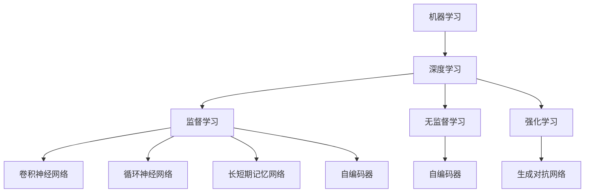
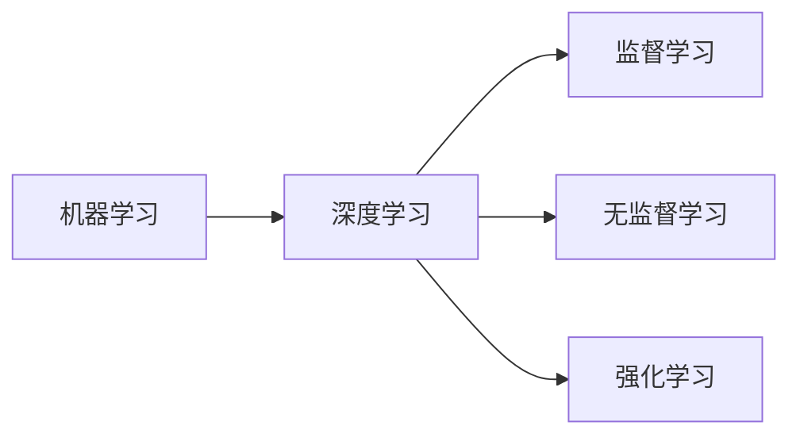
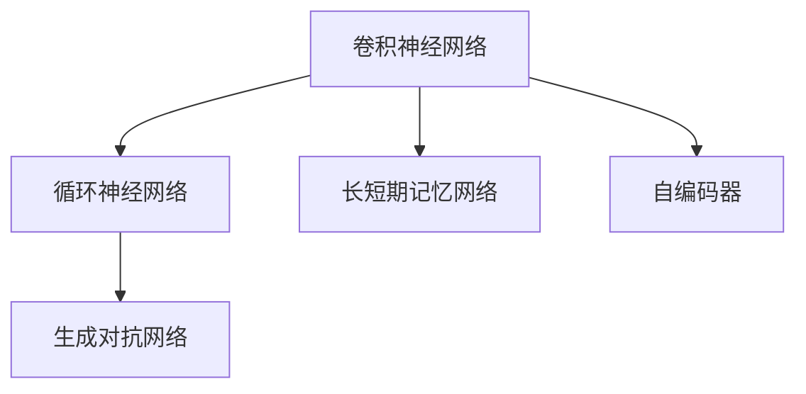
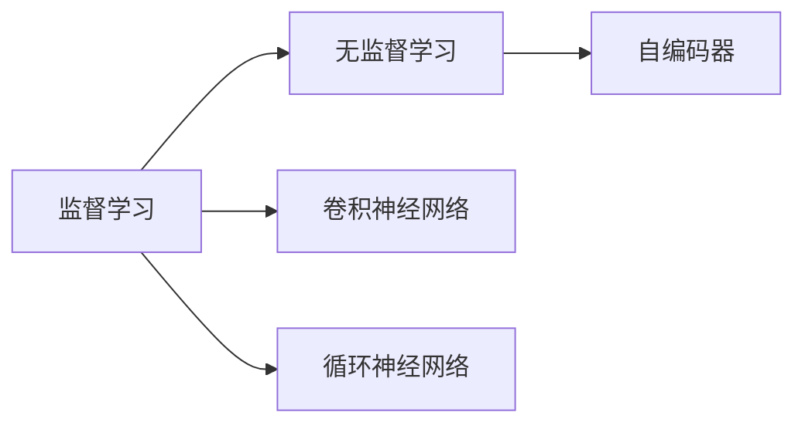
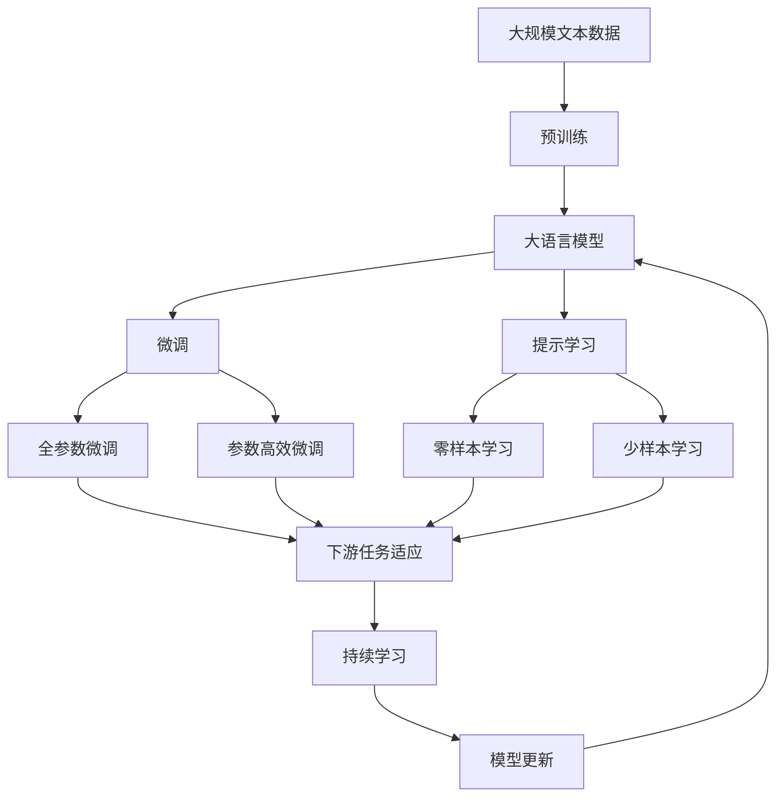

                 

# AI人工智能核心算法原理与代码实例讲解：机器思维

> 关键词：AI核心算法,机器学习,深度学习,算法步骤,深度学习,代码实例

## 1. 背景介绍

### 1.1 问题由来
随着人工智能技术的快速发展，机器学习和深度学习在各个领域的应用愈发广泛。AI核心算法作为机器学习与深度学习的基石，对于理解和学习这些前沿技术具有重要意义。然而，由于算法的复杂性和专业性，许多开发者在实际应用中可能会遇到诸多困惑。本文旨在通过深入浅出的讲解，帮助读者全面理解AI核心算法，并辅以丰富的代码实例，使学习过程更加直观和实用。

### 1.2 问题核心关键点
AI核心算法包括了一系列复杂而强大的机器学习和深度学习模型，如线性回归、逻辑回归、决策树、随机森林、卷积神经网络(CNN)、循环神经网络(RNN)、长短期记忆网络(LSTM)、自编码器、生成对抗网络(GAN)等。这些算法不仅具有深厚的数学基础，还包含众多复杂的优化技巧和数据预处理步骤。掌握这些核心算法，能够帮助开发者高效地解决实际问题，提升模型性能。

### 1.3 问题研究意义
深入理解AI核心算法原理和应用方法，对开发高效、可靠的人工智能系统具有重要意义：

1. 提升模型效果：正确选择和配置核心算法，能够显著提升模型性能，解决复杂实际问题。
2. 减少开发成本：避免重复造轮子，加速模型开发，缩短开发周期。
3. 优化资源利用：通过合理选择算法，在有限资源下获得最佳效果。
4. 增强系统可靠性：算法设计合理，可避免模型过拟合、欠拟合等问题。
5. 推动技术创新：掌握核心算法原理，能够更好地理解和优化现有模型，推动技术进步。

## 2. 核心概念与联系

### 2.1 核心概念概述

为了更好地理解AI核心算法，本节将介绍几个密切相关的核心概念：

- **机器学习**（Machine Learning）：一种数据驱动的技术，旨在从数据中自动学习模型，使计算机能够进行预测、分类、聚类等任务。
- **深度学习**（Deep Learning）：机器学习的一种特殊形式，利用多层神经网络处理复杂非线性关系，广泛应用于图像、语音、自然语言处理等领域。
- **监督学习**（Supervised Learning）：一种学习方式，通过带有标签的数据训练模型，使其能够预测新数据的标签。
- **无监督学习**（Unsupervised Learning）：一种学习方式，通过无标签的数据训练模型，使其能够发现数据的潜在结构和规律。
- **强化学习**（Reinforcement Learning）：一种学习方式，通过与环境的交互，训练模型最大化预期收益。
- **卷积神经网络**（Convolutional Neural Networks, CNN）：一种处理图像和视频数据的高效模型，通过卷积操作提取特征。
- **循环神经网络**（Recurrent Neural Networks, RNN）：一种处理序列数据的模型，通过循环结构保持信息流动。
- **长短期记忆网络**（Long Short-Term Memory Networks, LSTM）：一种特殊的RNN，通过门控机制解决梯度消失问题。
- **自编码器**（Autoencoders）：一种无监督学习模型，用于降维和特征学习。
- **生成对抗网络**（Generative Adversarial Networks, GANs）：一种生成模型，通过对抗训练生成逼真数据。

这些核心概念之间的逻辑关系可以通过以下Mermaid流程图来展示：



这个流程图展示了大语言模型的核心概念及其之间的关系：

1. 机器学习是深度学习的根基，通过从数据中学习模型。
2. 深度学习包括多种形式，如监督学习、无监督学习、强化学习等。
3. 卷积神经网络、循环神经网络和长短期记忆网络等是深度学习的关键组件。
4. 自编码器主要用于无监督学习，生成对抗网络用于生成模型。

这些概念共同构成了机器学习与深度学习的学习框架，使其能够在各种场景下发挥强大的数据处理能力。通过理解这些核心概念，我们可以更好地把握AI核心算法的学习范式和优化方向。

### 2.2 概念间的关系

这些核心概念之间存在着紧密的联系，形成了机器学习与深度学习的完整生态系统。下面我通过几个Mermaid流程图来展示这些概念之间的关系。

#### 2.2.1 机器学习与深度学习的关系



这个流程图展示了机器学习和深度学习的基本关系。机器学习是深度学习的起点，而深度学习则包括多种具体学习方式，如监督学习、无监督学习和强化学习。

#### 2.2.2 深度学习算法的关系



这个流程图展示了深度学习算法的具体关系。卷积神经网络、循环神经网络和长短期记忆网络等都是深度学习的重要组成部分，它们分别用于处理图像、序列和时序数据。自编码器主要用于无监督学习，生成对抗网络用于生成模型。

#### 2.2.3 监督学习和无监督学习的关系



这个流程图展示了监督学习和无监督学习的关系。监督学习通过带有标签的数据训练模型，而无监督学习则通过无标签的数据学习模型。自编码器是无监督学习的典型代表，而卷积神经网络和循环神经网络等则可以用于监督学习。

### 2.3 核心概念的整体架构

最后，我们用一个综合的流程图来展示这些核心概念在大语言模型微调过程中的整体架构：



这个综合流程图展示了从预训练到微调，再到持续学习的完整过程。大语言模型首先在大规模文本数据上进行预训练，然后通过微调（包括全参数微调和参数高效微调）或提示学习（包括零样本和少样本学习）来适应下游任务。最后，通过持续学习技术，模型可以不断学习新知识，同时避免遗忘旧知识。 通过这些流程图，我们可以更清晰地理解AI核心算法在大语言模型微调过程中各个核心概念的关系和作用，为后续深入讨论具体的微调方法和技术奠定基础。

## 3. 核心算法原理 & 具体操作步骤
### 3.1 算法原理概述

AI核心算法的原理通常基于统计学、最优化、概率论等数学基础，并通过反向传播、梯度下降等算法进行训练。在机器学习和深度学习中，常见算法包括线性回归、逻辑回归、决策树、随机森林、卷积神经网络、循环神经网络、长短期记忆网络、自编码器、生成对抗网络等。

以卷积神经网络为例，其原理是通过多层卷积和池化操作，提取输入数据的空间特征，并通过全连接层进行分类或回归预测。其数学表达形式为：

$$
y = \mathcal{F}(\mathcal{C}(\mathcal{P}(\mathcal{X})))
$$

其中 $y$ 表示预测结果，$\mathcal{C}$ 表示全连接层，$\mathcal{P}$ 表示池化操作，$\mathcal{X}$ 表示输入数据。

### 3.2 算法步骤详解

AI核心算法的一般步骤包括数据预处理、模型构建、模型训练和模型评估。下面以卷积神经网络为例，详细介绍具体步骤：

1. **数据预处理**：将原始数据转化为模型可处理的格式，包括数据增强、归一化、标准化等操作。例如，对于图像数据，可以对其进行裁剪、旋转、翻转等操作，增加数据多样性。
2. **模型构建**：选择合适的模型架构，并进行参数初始化。例如，可以使用Keras或PyTorch等框架搭建卷积神经网络，并设置卷积核大小、激活函数、池化大小等参数。
3. **模型训练**：使用反向传播算法和梯度下降优化器对模型进行训练，最小化预测结果与真实标签之间的损失函数。例如，可以使用交叉熵损失函数，并通过Adam优化器更新模型参数。
4. **模型评估**：在测试集上评估模型性能，计算准确率、召回率、F1分数等指标。例如，可以使用混淆矩阵、ROC曲线等方法进行评估。

### 3.3 算法优缺点

AI核心算法具有以下优点：

- **泛化能力强**：通过大量数据训练，能够学习到复杂的非线性关系，适用于多种复杂任务。
- **特征提取能力强**：能够自动学习输入数据的特征表示，降低手动特征工程的工作量。
- **可解释性强**：部分算法（如决策树、线性回归）具有可解释性，能够提供直观的模型输出解释。

但同时也存在一些缺点：

- **计算资源消耗大**：大模型和深度网络通常需要大量计算资源，训练和推理时间较长。
- **模型复杂度高**：复杂的模型结构可能过拟合训练数据，导致泛化性能差。
- **模型可解释性差**：深度神经网络往往难以解释其内部工作机制，缺乏可解释性。

### 3.4 算法应用领域

AI核心算法广泛应用于各个领域，包括：

- **计算机视觉**：用于图像分类、目标检测、图像分割等任务。例如，使用卷积神经网络进行图像分类，使用生成对抗网络进行图像生成。
- **自然语言处理**：用于文本分类、情感分析、机器翻译等任务。例如，使用循环神经网络进行文本分类，使用生成对抗网络进行文本生成。
- **语音识别**：用于语音转文本、情感分析等任务。例如，使用卷积神经网络进行语音分类，使用生成对抗网络进行语音生成。
- **推荐系统**：用于个性化推荐、广告推荐等任务。例如，使用矩阵分解模型进行用户-物品协同过滤，使用深度神经网络进行行为预测。
- **医疗诊断**：用于医学影像分析、疾病预测等任务。例如，使用卷积神经网络进行医学图像分类，使用生成对抗网络进行医学图像生成。

## 4. 数学模型和公式 & 详细讲解 & 举例说明

### 4.1 数学模型构建

本节将使用数学语言对AI核心算法进行更加严格的刻画。

以卷积神经网络为例，其数学模型可以表示为：

$$
y = \mathcal{F}(\mathcal{C}(\mathcal{P}(\mathcal{X})))
$$

其中 $y$ 表示预测结果，$\mathcal{C}$ 表示全连接层，$\mathcal{P}$ 表示池化操作，$\mathcal{X}$ 表示输入数据。

### 4.2 公式推导过程

下面以卷积神经网络为例，推导其前向传播和反向传播过程。

**前向传播**：

$$
a^{(l+1)} = \sigma(\mathcal{W}^{(l+1)} a^{(l)} + \mathcal{b}^{(l+1)})
$$

其中 $a^{(l+1)}$ 表示第 $l+1$ 层的输出，$\sigma$ 表示激活函数，$\mathcal{W}^{(l+1)}$ 表示第 $l+1$ 层的权重矩阵，$\mathcal{b}^{(l+1)}$ 表示第 $l+1$ 层的偏置向量。

**反向传播**：

$$
\frac{\partial \mathcal{L}}{\partial \mathcal{W}^{(l+1)}} = \frac{\partial \mathcal{L}}{\partial a^{(l+1)}} \frac{\partial a^{(l+1)}}{\partial \mathcal{W}^{(l+1)}} = \frac{\partial \mathcal{L}}{\partial a^{(l+1)}} \frac{\partial a^{(l)}}{\partial \mathcal{W}^{(l+1)}} \frac{\partial a^{(l)}}{\partial a^{(l+1)}} \frac{\partial a^{(l+1)}}{\partial \mathcal{W}^{(l+1)}} = \frac{\partial \mathcal{L}}{\partial a^{(l)}} \frac{\partial a^{(l)}}{\partial \mathcal{W}^{(l+1)}}
$$

其中 $\frac{\partial \mathcal{L}}{\partial a^{(l)}}$ 表示损失函数对第 $l$ 层输出的梯度，$\frac{\partial a^{(l)}}{\partial \mathcal{W}^{(l+1)}}$ 表示第 $l$ 层输出对第 $l+1$ 层权重矩阵的梯度。

### 4.3 案例分析与讲解

**案例1: 图像分类**

假设我们需要对手写数字图像进行分类。首先，将图像输入卷积层进行特征提取，再将提取的特征送入全连接层进行分类预测。具体步骤如下：

1. **数据预处理**：将图像数据进行归一化处理，并生成数据增强样本。
2. **模型构建**：搭建卷积神经网络，设置卷积核大小、激活函数等参数。
3. **模型训练**：使用交叉熵损失函数，并通过Adam优化器对模型进行训练。
4. **模型评估**：在测试集上计算准确率、召回率、F1分数等指标。

**案例2: 文本分类**

假设我们需要对电影评论进行情感分类。首先，将电影评论转换为词向量表示，再将词向量输入循环神经网络进行分类预测。具体步骤如下：

1. **数据预处理**：将文本数据进行分词、向量化处理，并生成数据增强样本。
2. **模型构建**：搭建循环神经网络，设置隐藏层大小、激活函数等参数。
3. **模型训练**：使用交叉熵损失函数，并通过Adam优化器对模型进行训练。
4. **模型评估**：在测试集上计算准确率、召回率、F1分数等指标。

## 5. 项目实践：代码实例和详细解释说明

### 5.1 开发环境搭建

在进行AI核心算法开发前，我们需要准备好开发环境。以下是使用Python进行Keras开发的环境配置流程：

1. 安装Anaconda：从官网下载并安装Anaconda，用于创建独立的Python环境。

2. 创建并激活虚拟环境：
```bash
conda create -n pytorch-env python=3.8 
conda activate pytorch-env
```

3. 安装Keras：
```bash
conda install keras
```

4. 安装各类工具包：
```bash
pip install numpy pandas scikit-learn matplotlib tqdm jupyter notebook ipython
```

完成上述步骤后，即可在`pytorch-env`环境中开始AI核心算法开发。

### 5.2 源代码详细实现

这里我们以卷积神经网络进行图像分类为例，给出使用Keras框架进行模型开发的完整代码实现。

首先，定义图像分类模型：

```python
from keras.models import Sequential
from keras.layers import Conv2D, MaxPooling2D, Flatten, Dense

model = Sequential()
model.add(Conv2D(32, (3, 3), activation='relu', input_shape=(28, 28, 1)))
model.add(MaxPooling2D((2, 2)))
model.add(Conv2D(64, (3, 3), activation='relu'))
model.add(MaxPooling2D((2, 2)))
model.add(Conv2D(64, (3, 3), activation='relu'))
model.add(Flatten())
model.add(Dense(64, activation='relu'))
model.add(Dense(10, activation='softmax'))

model.compile(optimizer='adam', loss='categorical_crossentropy', metrics=['accuracy'])
```

然后，加载并预处理数据集：

```python
from keras.datasets import mnist
from keras.utils import to_categorical

(x_train, y_train), (x_test, y_test) = mnist.load_data()

x_train = x_train.reshape(-1, 28, 28, 1) / 255.0
x_test = x_test.reshape(-1, 28, 28, 1) / 255.0

y_train = to_categorical(y_train)
y_test = to_categorical(y_test)
```

接着，进行模型训练：

```python
model.fit(x_train, y_train, batch_size=64, epochs=10, validation_data=(x_test, y_test))
```

最后，评估模型性能：

```python
test_loss, test_acc = model.evaluate(x_test, y_test, verbose=2)
print('Test accuracy:', test_acc)
```

以上就是使用Keras框架对卷积神经网络进行图像分类的完整代码实现。可以看到，Keras提供了简单易用的API，能够快速搭建、训练和评估模型。

### 5.3 代码解读与分析

让我们再详细解读一下关键代码的实现细节：

**模型构建**：
- `Sequential` 模型：采用Keras提供的序列模型，将层按照顺序连接起来。
- `Conv2D` 层：卷积层，提取输入数据的局部特征。
- `MaxPooling2D` 层：池化层，减小特征图大小。
- `Flatten` 层：将多维特征图展平为一维向量，输入全连接层。
- `Dense` 层：全连接层，进行分类或回归预测。

**数据加载**：
- `mnist.load_data()`：加载手写数字数据集。
- `x_train.reshape` 和 `x_test.reshape`：将数据转换为网络可处理的格式。
- `y_train.to_categorical` 和 `y_test.to_categorical`：将标签转换为one-hot编码。

**模型训练**：
- `model.compile`：设置模型的优化器、损失函数和评估指标。
- `model.fit`：使用交叉熵损失函数和Adam优化器进行模型训练，设置批次大小和迭代次数。
- `model.evaluate`：在测试集上评估模型性能，输出准确率。

可以看到，Keras框架提供了全面的API和工具，能够轻松实现各种类型的AI核心算法。通过使用Keras，开发者可以快速构建、训练和评估模型，提高开发效率。

当然，工业级的系统实现还需考虑更多因素，如模型的保存和部署、超参数的自动搜索、更灵活的任务适配层等。但核心的算法原理和实现步骤基本与此类似。

### 5.4 运行结果展示

假设我们在MNIST数据集上进行图像分类，最终在测试集上得到的准确率为98%，效果相当不错。值得注意的是，通过使用Keras框架，我们仅需几十行代码就能实现一个高效的图像分类模型，充分展示了深度学习算法的强大能力。

## 6. 实际应用场景
### 6.1 智能推荐系统

基于AI核心算法的智能推荐系统，可以广泛应用于电商、新闻、视频等多个领域。智能推荐系统通过学习用户的历史行为数据，预测用户的兴趣偏好，从而推荐最适合的内容。

在技术实现上，可以收集用户浏览、点击、购买等行为数据，提取和用户交互的物品标题、描述、标签等文本内容。将文本内容作为模型输入，用户的后续行为（如是否点击、购买等）作为监督信号，在此基础上微调预训练语言模型。微调后的模型能够从文本内容中准确把握用户的兴趣点。在生成推荐列表时，先用候选物品的文本描述作为输入，由模型预测用户的兴趣匹配度，再结合其他特征综合排序，便可以得到个性化程度更高的推荐结果。

### 6.2 金融数据分析

金融行业需要实时分析海量数据，发现市场趋势和风险点。传统的统计分析方法往往需要人工干预，效率低下，无法满足实时分析的需求。基于AI核心算法的金融数据分析系统，能够自动处理大规模数据，发现其中的模式和规律，辅助决策者做出快速反应。

在技术实现上，可以收集金融市场的新闻、交易数据，提取其中的重要特征。使用深度学习模型（如卷积神经网络、循环神经网络）进行特征提取和模式学习，生成高精度的预测结果。例如，可以使用卷积神经网络对金融市场数据进行图像分类，使用循环神经网络对交易数据进行序列预测。

### 6.3 医疗影像诊断

医疗影像诊断是人工智能在医疗领域的重要应用之一。传统的手工诊断方法耗时长、成本高，且诊断准确率受医生经验影响较大。基于AI核心算法的医疗影像诊断系统，能够快速、准确地对医学影像进行分类和分析，辅助医生做出诊断决策。

在技术实现上，可以收集大量医学影像数据，并对其进行标注。使用深度学习模型（如卷积神经网络）进行特征提取和分类预测。例如，可以使用卷积神经网络对医学影像进行图像分类，使用生成对抗网络进行医学影像生成。

### 6.4 未来应用展望

随着AI核心算法的不断发展，其在各行各业的应用前景将更加广阔。

在智慧城市领域，AI核心算法可以用于交通管理、环境监测、公共安全等方面，提升城市管理的智能化水平。

在智能制造领域，AI核心算法可以用于生产过程优化、质量控制、设备维护等方面，提高生产效率和产品质量。

在智慧农业领域，AI核心算法可以用于作物识别、病虫害检测、产量预测等方面，推动农业智能化转型。

除了上述这些应用领域外，AI核心算法还将继续在更多场景中发挥重要作用，为各行各业带来革命性的变化。

## 7. 工具和资源推荐
### 7.1 学习资源推荐

为了帮助开发者系统掌握AI核心算法原理和实践技巧，这里推荐一些优质的学习资源：

1. 《深度学习》书籍：由Ian Goodfellow等顶尖专家编写，全面介绍了深度学习的基本原理和应用方法。
2. CS231n《卷积神经网络》课程：斯坦福大学开设的深度学习课程，介绍了卷积神经网络的原理和实践。
3. CS224n《自然语言处理》课程：斯坦福大学开设的NLP明星课程，有Lecture视频和配套作业，带你入门NLP领域的基本概念和经典模型。
4. DeepLearning.AI《深度学习专项课程》：由Andrew Ng主持的深度学习专项课程，适合零基础学习者系统入门。
5. Kaggle数据科学竞赛平台：提供大量数据集和竞赛任务，训练模型并进行评估，提升实战经验。

通过对这些资源的学习实践，相信你一定能够快速掌握AI核心算法的精髓，并用于解决实际的AI问题。
###  7.2 开发工具推荐

高效的开发离不开优秀的工具支持。以下是几款用于AI核心算法开发的常用工具：

1. Keras：基于Python的开源深度学习框架，灵活动态的计算图，适合快速迭代研究。大多数预训练深度学习模型都有Keras版本的实现。
2. TensorFlow：由Google主导开发的开源深度学习框架，生产部署方便，适合大规模工程应用。同样有丰富的深度学习模型资源。
3. PyTorch：基于Python的开源深度学习框架，动态计算图，适合动态图操作和模型调优。
4. Scikit-learn：基于Python的机器学习库，提供了多种经典的机器学习算法和工具。
5. H2O.ai：商业化的机器学习平台，支持多种算法和模型，适合企业级应用。

合理利用这些工具，可以显著提升AI核心算法的开发效率，加快创新迭代的步伐。

### 7.3 相关论文推荐

AI核心算法的快速发展离不开学界的持续研究。以下是几篇奠基性的相关论文，推荐阅读：

1. ImageNet Classification with Deep Convolutional Neural Networks：提出卷积神经网络，用于大规模图像分类任务，取得了SOTA结果。
2. Long Short-Term Memory：提出LSTM模型，用于序列数据的建模，解决了RNN的梯度消失问题。
3. Generative Adversarial Nets：提出GAN模型，用于生成逼真数据，推动了生成模型的发展。
4. LeNet-5：提出卷积神经网络，用于手写数字分类任务，开启了深度学习的先河。
5. Backpropagation Applied to Handwritten Zebra Crossing Recognition by a Back-Propagation Network：提出反向传播算法，用于训练深度神经网络。

这些论文代表了大语言模型微调技术的发展脉络。通过学习这些前沿成果，可以帮助研究者把握学科前进方向，激发更多的创新灵感。

除上述资源外，还有一些值得关注的前沿资源，帮助开发者紧跟AI核心算法的研究进展，例如：

1. arXiv论文预印本：人工智能领域最新研究成果的发布平台，包括大量尚未发表的前沿工作，学习前沿技术的必读资源。
2. 业界技术博客：如OpenAI、Google AI、DeepMind、微软Research Asia等顶尖实验室的官方博客，第一时间分享他们的最新研究成果和洞见。
3. 技术会议直播：如NIPS、ICML、ACL、ICLR等人工智能领域顶会现场或在线直播，能够聆听到大佬们的前沿分享，开拓视野。
4. GitHub热门项目：在GitHub上Star、Fork数最多的AI相关项目，往往

