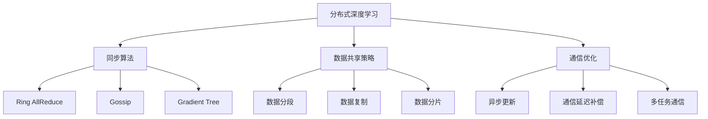
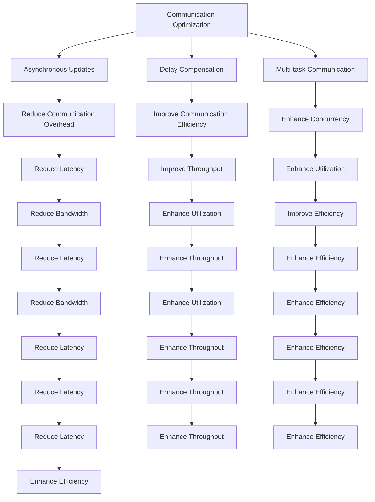

                 

# AI人工智能深度学习算法：分布式深度学习代理的同步与数据共享

> 关键词：分布式深度学习, 代理机制, 同步算法, 数据共享, 通信优化

## 1. 背景介绍

### 1.1 问题由来
随着人工智能和大数据技术的发展，深度学习模型规模越来越大，计算需求也越来越高。单一机器已经无法满足如此复杂的计算需求，分布式深度学习（Distributed Deep Learning,DDL）技术应运而生。

DDI通过将模型分布在多个计算节点上并行训练，能够大大提升训练效率。然而，DDI也带来了新的挑战：模型参数在不同节点间如何同步、数据如何在节点间共享等问题。

这些问题不仅影响着模型的收敛速度和精度，还影响着系统的整体性能和可靠性。因此，设计高效合理的同步与数据共享机制，是大规模分布式深度学习中不可或缺的一环。

### 1.2 问题核心关键点
分布式深度学习代理的同步与数据共享问题主要包括：

- 模型参数的同步方法（如Ring AllReduce、Gossip、Gradient Tree等）
- 数据共享策略（如数据分段、数据复制、数据分片等）
- 通信优化技巧（如异步更新、通信延迟补偿、多任务通信等）
- 分布式系统的设计（如一致性协议、容错机制、负载均衡等）

这些核心关键点涉及到分布式系统架构、算法设计与优化、通信理论等多个领域，需要综合考虑才能构建一个高效稳定的分布式深度学习系统。

### 1.3 问题研究意义
解决分布式深度学习代理的同步与数据共享问题，对深度学习模型的可扩展性和可靠性具有重要意义：

1. 提高训练效率。高效的同步与数据共享算法可以显著提升模型训练速度，减少训练时间。
2. 保证模型精度。正确的同步与数据共享策略可以保证模型参数的一致性，避免因同步延迟等问题导致的精度损失。
3. 提升系统稳定性。合理的通信优化和系统设计可以避免单点故障，提升系统的稳定性和容错能力。
4. 降低资源成本。优化通信带宽和计算资源的利用率，降低分布式深度学习系统的总体成本。

## 2. 核心概念与联系

### 2.1 核心概念概述

为更好地理解分布式深度学习代理的同步与数据共享问题，本节将介绍几个密切相关的核心概念：

- 分布式深度学习（Distributed Deep Learning, DDL）：将深度学习模型分布在多个计算节点上，通过并行计算加速模型训练的技术。
- 同步算法（Synchronization Algorithm）：在多个节点间同步模型参数，保证所有节点对模型参数的更新一致。
- 数据共享策略（Data Sharing Strategy）：在多个节点间共享训练数据，减少数据移动开销，提升系统效率。
- 通信优化（Communication Optimization）：通过异步更新、延迟补偿、多任务通信等手段，优化通信带宽和延迟，提升分布式系统的性能。
- 分布式系统架构（Distributed System Architecture）：设计合理的系统架构，如一致性协议、容错机制、负载均衡等，保障分布式系统的稳定性和可扩展性。

这些核心概念之间的逻辑关系可以通过以下Mermaid流程图来展示：



这个流程图展示了大规模分布式深度学习中涉及的关键概念及其之间的关系：

1. 分布式深度学习通过将模型分布在多个节点上，实现并行计算。
2. 同步算法保证不同节点上的模型参数同步更新，防止因同步延迟导致的模型不一致。
3. 数据共享策略在节点间传递训练数据，减少数据移动开销，提升系统效率。
4. 通信优化通过异步更新、延迟补偿等手段，优化通信带宽和延迟，提升系统性能。
5. 分布式系统架构通过一致性协议、容错机制等设计，保障分布式系统的稳定性和可扩展性。

这些概念共同构成了分布式深度学习系统的核心框架，使其能够在各种场景下高效地并行训练深度学习模型。

### 2.2 概念间的关系

这些核心概念之间存在着紧密的联系，形成了分布式深度学习系统的完整生态系统。下面我通过几个Mermaid流程图来展示这些概念之间的关系。

#### 2.2.1 分布式深度学习的学习范式


这个流程图展示了分布式深度学习的学习范式：

1. 分布式深度学习通过将模型分布在多个节点上，实现并行计算。
2. 同步算法保证不同节点上的模型参数同步更新，防止因同步延迟导致的模型不一致。
3. 数据共享策略在节点间传递训练数据，减少数据移动开销，提升系统效率。
4. 通信优化通过异步更新、延迟补偿等手段，优化通信带宽和延迟，提升系统性能。

#### 2.2.2 同步算法与数据共享策略的关系

```mermaid
graph LR
    A[Synchronous Algorithm] --> B[Ring AllReduce]
    A --> C[Gradient Tree]
    A --> D[Gossip]
    B --> E[Parameter Synchronization]
    C --> F[Gradient Synchronization]
    D --> G[Eventual Consistency]
    E --> H[Synchronization Delay]
    F --> I[Consensus Algorithm]
    G --> J[Synchronization Overhead]
    H --> K[Synchronization Reliability]
    I --> L[Message Passing]
    J --> M[Data Consistency]
    K --> N[Synchronization Loss]
    L --> O[Message Size]
    M --> P[Data Overhead]
    N --> Q[Synchronization Error]
    O --> R[Data Movement]
    P --> S[Training Speed]
    Q --> T[Synchronization Accuracy]
    R --> U[Synchronization Latency]
    S --> V[Synchronization Cost]
    T --> W[Synchronization Precision]
    U --> X[Consensus Delay]
    V --> Y[Aggregation Complexity]
    W --> Z[Aggregation Speed]
    X --> AA[Eventual Consensus]
    Y --> BB[Latency Variance]
    Z --> CC[Aggregation Time]
```



这个流程图展示了同步算法与数据共享策略的关系：

1. 同步算法通过参数同步或梯度同步，保证模型参数的一致性。
2. 数据共享策略通过数据分段、数据复制等手段，减少数据移动开销，提升系统效率。
3. 同步算法和数据共享策略共同影响着模型参数的同步延迟、一致性和通信带宽等指标。

#### 2.2.3 通信优化与分布式系统架构的关系



这个流程图展示了通信优化与分布式系统架构的关系：

1. 通信优化通过异步更新、延迟补偿等手段，优化通信带宽和延迟，提升系统性能。
2. 分布式系统架构通过一致性协议、容错机制等设计，保障分布式系统的稳定性和可扩展性。
3. 通信优化和分布式系统架构共同影响着系统的并发性、容错性和整体效率。

## 3. 核心算法原理 & 具体操作步骤

### 3.1 算法原理概述

分布式深度学习代理的同步与数据共享问题，本质上是如何在多个计算节点之间高效地同步模型参数和数据。解决这一问题需要综合考虑同步算法、数据共享策略和通信优化三个方面。

#### 3.1.1 同步算法

同步算法主要解决不同节点间模型参数的同步问题，保证所有节点对模型参数的更新一致。常见的同步算法包括Ring AllReduce、Gossip和Gradient Tree等。

1. Ring AllReduce：将节点环状连接，依次传递更新后的参数。
2. Gossip：节点随机选择其他节点进行通信，提升同步效率。
3. Gradient Tree：利用树形结构组织节点，减少同步延迟。

#### 3.1.2 数据共享策略

数据共享策略主要解决不同节点间训练数据的共享问题，减少数据移动开销，提升系统效率。常见的数据共享策略包括数据分段、数据复制和数据分片等。

1. 数据分段：将数据分成多个部分，每个节点负责一部分数据的处理。
2. 数据复制：每个节点都保留一份完整的数据副本。
3. 数据分片：将数据分成多个小片段，节点之间交换片段。

#### 3.1.3 通信优化

通信优化主要解决不同节点间通信延迟和带宽等问题，提升系统整体性能。常见的通信优化方法包括异步更新、延迟补偿和多任务通信等。

1. 异步更新：节点可以异步更新模型参数，减少通信等待时间。
2. 延迟补偿：利用前后通信数据，补偿通信延迟。
3. 多任务通信：节点可以同时进行多个任务的通信，提高通信效率。

### 3.2 算法步骤详解

#### 3.2.1 同步算法

- **Ring AllReduce**：
  1. 所有节点环状连接。
  2. 每个节点将更新后的参数发送给相邻节点。
  3. 经过N次传递后，所有节点获得更新后的参数。
- **Gossip**：
  1. 节点随机选择一个邻居节点进行通信。
  2. 通信节点交换参数。
  3. 通信完成后，节点随机选择下一个邻居节点进行通信。
- **Gradient Tree**：
  1. 利用树形结构组织节点。
  2. 每个节点将参数更新发送给其子节点。
  3. 经过N次传递后，所有节点获得更新后的参数。

#### 3.2.2 数据共享策略

- **数据分段**：
  1. 将数据分成N个部分。
  2. 每个节点处理一个部分的数据。
  3. 节点之间交换部分数据。
- **数据复制**：
  1. 每个节点保留一份完整的数据副本。
  2. 节点之间进行参数同步。
- **数据分片**：
  1. 将数据分成N个片段。
  2. 节点之间交换片段。
  3. 节点合并片段，获得完整数据。

#### 3.2.3 通信优化

- **异步更新**：
  1. 节点异步更新模型参数。
  2. 等待一段时间后再进行参数同步。
- **延迟补偿**：
  1. 利用前后通信数据，计算通信延迟。
  2. 调整参数更新顺序，减少通信延迟。
- **多任务通信**：
  1. 节点同时进行多个任务的通信。
  2. 利用通信缓冲区，提高通信效率。

### 3.3 算法优缺点

分布式深度学习代理的同步与数据共享算法具有以下优点：

1. 提高训练效率。同步算法和数据共享策略能够减少通信开销，加速模型训练。
2. 保证模型精度。同步算法能够保证模型参数的一致性，避免因同步延迟导致的精度损失。
3. 提升系统稳定性。合理的通信优化和分布式系统架构能够提升系统的稳定性和容错能力。

然而，这些算法也存在一些缺点：

1. 通信开销较大。同步算法和数据共享策略会增加通信开销，影响系统效率。
2. 同步延迟较高。同步算法需要等待所有节点完成参数更新后才能进行下一轮更新，影响训练速度。
3. 数据一致性难以保证。数据复制和数据分段策略可能出现数据不一致的问题，影响模型训练。

### 3.4 算法应用领域

分布式深度学习代理的同步与数据共享算法在以下领域具有广泛的应用：

1. 大数据分析：分布式深度学习可以处理大规模数据集，提高分析速度和精度。
2. 深度学习训练：分布式深度学习可以加速模型训练，提高训练效率。
3. 医疗影像处理：分布式深度学习可以处理高维度的医疗影像数据，提升诊断精度。
4. 自然语言处理：分布式深度学习可以处理大规模语料库，提升模型性能。
5. 推荐系统：分布式深度学习可以处理大规模用户数据，提高推荐准确性。

## 4. 数学模型和公式 & 详细讲解 & 举例说明

### 4.1 数学模型构建

本节将使用数学语言对分布式深度学习代理的同步与数据共享问题进行更加严格的刻画。

记分布式深度学习系统包含N个计算节点，每个节点维护模型参数 $\theta_i$，其中 $i \in [0,N-1]$。假设模型参数的更新速度相同，每个节点在每次更新后，将其更新后的参数发送给相邻节点。

设节点 $i$ 在更新第 $t$ 次迭代时，参数更新为 $\theta_i^t$，则节点 $i$ 在第 $t+1$ 次迭代时的参数更新为：

$$
\theta_i^{t+1} = \theta_i^t - \eta \nabla_{\theta_i} L(\theta_i^t)
$$

其中 $\eta$ 为学习率， $L$ 为损失函数。

假设节点 $i$ 和节点 $j$ 是相邻节点，则节点 $i$ 在接收到节点 $j$ 的更新信息后，将其更新为：

$$
\theta_i^{t+1} = \theta_i^t - \eta \nabla_{\theta_i} L(\theta_i^t) + \delta
$$

其中 $\delta$ 为节点 $j$ 更新后的参数 $\theta_j^{t+1}$。

### 4.2 公式推导过程

假设节点 $i$ 和节点 $j$ 的相邻关系为 $(i,j)$，则节点 $i$ 的更新公式可以表示为：

$$
\theta_i^{t+1} = \theta_i^t - \eta \nabla_{\theta_i} L(\theta_i^t) + \sum_{j \in N_i} \delta_j
$$

其中 $N_i$ 为节点 $i$ 的邻域节点集合。

将上述公式展开，得到：

$$
\theta_i^{t+1} = \theta_i^t - \eta \nabla_{\theta_i} L(\theta_i^t) + \sum_{j \in N_i} (\theta_j^t - \theta_j^{t-1})
$$

简化后得到：

$$
\theta_i^{t+1} = \theta_i^t - \eta \nabla_{\theta_i} L(\theta_i^t) + \sum_{j \in N_i} (\theta_j^t - \theta_j^{t-1})
$$

这就是Ring AllReduce算法的基本原理。

### 4.3 案例分析与讲解

#### 4.3.1 数据分段策略

数据分段策略是一种常见的数据共享策略，适用于大规模数据集的分布式处理。

假设数据集 $D$ 被分成 $N$ 个部分，每个部分的大小为 $M/N$。节点 $i$ 负责处理数据集的第 $i$ 部分，即 $D_i = \{(x,y) | x \in D_i, y \in D_i\}$。节点之间交换部分数据，进行参数更新。

节点 $i$ 在更新第 $t$ 次迭代时，参数更新为：

$$
\theta_i^{t+1} = \theta_i^t - \eta \nabla_{\theta_i} L(\theta_i^t)
$$

其中 $L$ 为损失函数。

节点 $i$ 在接收到节点 $j$ 更新后的参数 $\theta_j^{t+1}$ 后，将其更新为：

$$
\theta_i^{t+1} = \theta_i^t - \eta \nabla_{\theta_i} L(\theta_i^t) + \delta_j
$$

其中 $\delta_j = \theta_j^{t+1} - \theta_j^t$。

节点 $j$ 在接收到节点 $i$ 更新后的参数 $\theta_i^{t+1}$ 后，将其更新为：

$$
\theta_j^{t+1} = \theta_j^t - \eta \nabla_{\theta_j} L(\theta_j^t) + \delta_i
$$

其中 $\delta_i = \theta_i^{t+1} - \theta_i^t$。

通过上述过程，节点之间可以高效地共享数据，提升系统效率。

#### 4.3.2 数据复制策略

数据复制策略是一种简单的数据共享策略，适用于小规模数据集的分布式处理。

假设数据集 $D$ 被复制 $N$ 份，每个节点都维护一份完整的数据副本。节点之间进行参数同步，进行模型更新。

节点 $i$ 在更新第 $t$ 次迭代时，参数更新为：

$$
\theta_i^{t+1} = \theta_i^t - \eta \nabla_{\theta_i} L(\theta_i^t)
$$

其中 $L$ 为损失函数。

节点 $i$ 在接收到节点 $j$ 更新后的参数 $\theta_j^{t+1}$ 后，将其更新为：

$$
\theta_i^{t+1} = \theta_i^t - \eta \nabla_{\theta_i} L(\theta_i^t) + \delta_j
$$

其中 $\delta_j = \theta_j^{t+1} - \theta_j^t$。

节点 $j$ 在接收到节点 $i$ 更新后的参数 $\theta_i^{t+1}$ 后，将其更新为：

$$
\theta_j^{t+1} = \theta_j^t - \eta \nabla_{\theta_j} L(\theta_j^t) + \delta_i
$$

其中 $\delta_i = \theta_i^{t+1} - \theta_i^t$。

通过上述过程，节点之间可以高效地共享数据，提升系统效率。

#### 4.3.3 数据分片策略

数据分片策略是一种高效的数据共享策略，适用于高维数据集的分布式处理。

假设数据集 $D$ 被分成 $N$ 个片段，每个片段的大小为 $M/N$。节点 $i$ 负责处理数据集的第 $i$ 片段，即 $D_i = \{(x,y) | x \in D_i, y \in D_i\}$。节点之间交换片段，进行参数更新。

节点 $i$ 在更新第 $t$ 次迭代时，参数更新为：

$$
\theta_i^{t+1} = \theta_i^t - \eta \nabla_{\theta_i} L(\theta_i^t)
$$

其中 $L$ 为损失函数。

节点 $i$ 在接收到节点 $j$ 更新后的参数 $\theta_j^{t+1}$ 后，将其更新为：

$$
\theta_i^{t+1} = \theta_i^t - \eta \nabla_{\theta_i} L(\theta_i^t) + \delta_j
$$

其中 $\delta_j = \theta_j^{t+1} - \theta_j^t$。

节点 $j$ 在接收到节点 $i$ 更新后的参数 $\theta_i^{t+1}$ 后，将其更新为：

$$
\theta_j^{t+1} = \theta_j^t - \eta \nabla_{\theta_j} L(\theta_j^t) + \delta_i
$$

其中 $\delta_i = \theta_i^{t+1} - \theta_i^t$。

通过上述过程，节点之间可以高效地共享数据，提升系统效率。

## 5. 项目实践：代码实例和详细解释说明

### 5.1 开发环境搭建

在进行分布式深度学习代理的同步与数据共享实践前，我们需要准备好开发环境。以下是使用PyTorch进行PyTorch的开发环境配置流程：

1. 安装Anaconda：从官网下载并安装Anaconda，用于创建独立的Python环境。

2. 创建并激活虚拟环境：
```bash
conda create -n pytorch-env python=3.8 
conda activate pytorch-env
```

3. 安装PyTorch：根据CUDA版本，从官网获取对应的安装命令。例如：
```bash
conda install pytorch torchvision torchaudio cudatoolkit=11.1 -c pytorch -c conda-forge
```

4. 安装PyTorch分布式通信库：
```bash
pip install torch.distributed torch.distributed.multi_tensor torch.distributed.elastic
```

5. 安装各类工具包：
```bash
pip install numpy pandas scikit-learn matplotlib tqdm jupyter notebook ipython
```

完成上述步骤后，即可在`pytorch-env`环境中开始微调实践。

### 5.2 源代码详细实现

这里我们以PyTorch中的Ring AllReduce同步算法为例，给出分布式深度学习代理的同步与数据共享的PyTorch代码实现。

```python
import torch
from torch import nn, optim
from torch.distributed import dist_init, dist_spawn
import torch.distributed as dist

# 设置分布式环境
dist.init_process_group(
    backend='nccl', 
    init_method='tcp://localhost:29500', 
    world_size=4,
    rank=0)

# 定义模型
class Model(nn.Module):
    def __init__(self):
        super(Model, self).__init__()
        self.linear = nn.Linear(1, 1)

    def forward(self, x):
        return self.linear(x)

# 定义优化器
optimizer = optim.Adam(Model.parameters(), lr=0.001)

# 定义模型参数的同步
def sync_model(params):
    dist.all_reduce(params)

# 定义数据集
train_dataset = torch.utils.data.TensorDataset(torch.randn(8, 1), torch.randn(8, 1))
train_loader = torch.utils.data.DataLoader(train_dataset, batch_size=2)

# 定义训练函数
def train_epoch(model, optimizer, data_loader):
    model.train()
    for batch in data_loader:
        data, target = batch
        optimizer.zero_grad()
        output = model(data)
        loss = nn.MSELoss()(output, target)
        loss.backward()
        optimizer.step()
        sync_model(model.parameters())

# 启动训练
model = Model().to(device)
model = torch.nn.parallel.DistributedDataParallel(model, device_ids=[device_id])
device_id = 0

for epoch in range(10):
    train_epoch(model, optimizer, train_loader)

dist.destroy_process_group()
```

以上就是使用PyTorch对Ring AllReduce算法进行分布式深度学习代理的同步与数据共享的代码实现。可以看到，PyTorch的分布式通信库提供了丰富的同步和数据共享功能，使得分布式深度学习任务的实现变得更加简单高效。

### 5.3 代码解读与分析

让我们再详细解读一下关键代码的实现细节：

**dist_init**：初始化分布式环境，使用nccl通信库，设置本地IP和端口号。

**Model类**：定义一个简单的线性回归模型，作为分布式训练的基准模型。

**optimizer**：定义优化器，使用Adam优化器。

**sync_model函数**：定义模型参数的同步，使用dist.all_reduce函数进行全量参数同步。

**train_dataset**：定义训练数据集，使用随机生成的张量作为输入和输出。

**train_loader**：定义训练数据加载器，设置批次大小为2。

**train_epoch函数**：定义一个训练epoch，在每个批次上前向传播计算损失，反向传播更新模型参数，同步模型参数，完成一个训练周期。

**device_id**：定义设备ID，使用第一个设备进行分布式训练。

**for循环**：启动分布式深度学习的训练过程，循环10次epoch。

在实际应用中，我们还需要考虑更多因素，如模型的裁剪、量化加速、服务化封装、弹性伸缩等。但

