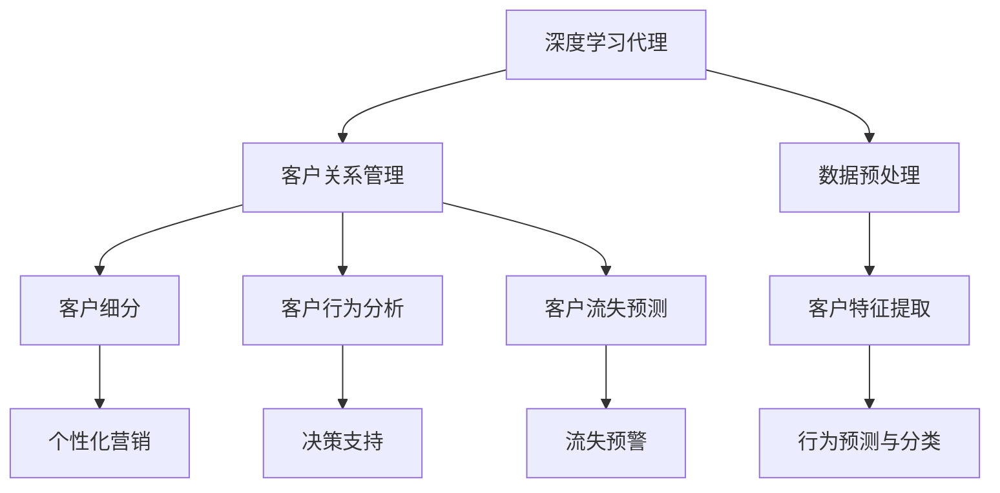
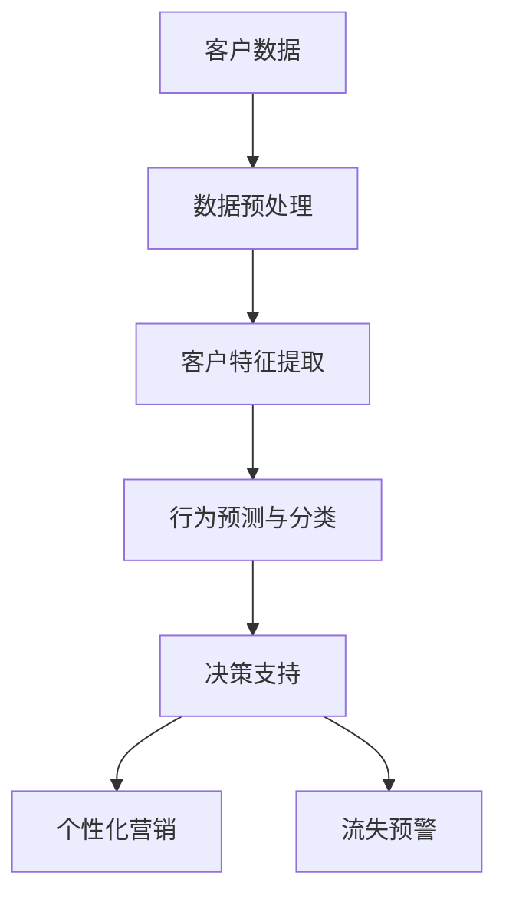

                 

# AI人工智能深度学习算法：智能深度学习代理在CRM客户管理中的应用

> 关键词：
人工智能,深度学习,代理,客户关系管理(CRM),CRM客户管理,智能决策,客户细分,客户行为分析,客户留存

## 1. 背景介绍

### 1.1 问题由来

随着企业数字化转型进程的加快，客户关系管理（CRM）系统在企业中的重要性日益凸显。传统的CRM系统往往以人工规则驱动为主，缺乏智能化的决策能力，难以应对市场环境快速变化和客户需求多样化的挑战。如何利用最新人工智能技术，提升CRM系统的智能决策能力，成为了一个亟待解决的问题。

### 1.2 问题核心关键点

智能深度学习代理在CRM客户管理中的应用，旨在利用深度学习技术，构建一个能够自动处理客户数据、挖掘客户行为特征、预测客户需求和行为的智能系统。其核心关键点包括：

- 数据预处理：将CRM系统中多源异构的数据进行清洗、整合，转换成适合深度学习模型训练的格式。
- 客户特征提取：利用深度学习模型自动提取客户的基本信息、行为数据、历史交互记录等特征。
- 行为预测与分类：基于提取的客户特征，通过深度学习模型预测客户流失、购买行为、偏好变化等，并进行分类。
- 决策支持：利用深度学习代理的预测结果，为CRM系统的自动化决策和个性化推荐提供支持。

### 1.3 问题研究意义

智能深度学习代理在CRM客户管理中的应用，对提升企业CRM系统的智能化水平具有重要意义：

1. 提升客户洞察能力：通过自动化的客户行为分析，深度学习代理能够发现客户行为的潜在规律，辅助企业更准确地理解客户需求。
2. 优化客户体验：基于客户画像和行为预测，深度学习代理能够提供个性化的服务，提升客户满意度和忠诚度。
3. 降低运营成本：自动化决策和客户管理流程，减少了人工操作的复杂性和误操作，提高了企业的运营效率。
4. 提升客户留存率：通过预测客户流失风险，及时采取措施进行挽留，有助于提升客户留存率。
5. 促进企业创新：深度学习代理的智能决策能力，为企业的市场策略、产品设计等提供数据支持，促进企业创新发展。

## 2. 核心概念与联系

### 2.1 核心概念概述

为更好地理解智能深度学习代理在CRM客户管理中的应用，本节将介绍几个密切相关的核心概念：

- 深度学习代理（Deep Learning Agent）：通过深度学习模型自动提取和处理数据，执行特定任务或决策的智能系统。
- 客户关系管理（CRM）：企业对客户信息进行管理、分析、服务的一个平台，旨在提升客户满意度和忠诚度，增加收入。
- 客户细分（Customer Segmentation）：将客户群体划分为不同类型，以便进行个性化的营销和管理。
- 客户行为分析（Customer Behavior Analysis）：利用数据分析技术，研究客户行为模式，预测客户未来行为。
- 客户流失预测（Customer Churn Prediction）：预测客户是否会流失，以便及时采取措施挽留。

这些核心概念之间的逻辑关系可以通过以下Mermaid流程图来展示：



这个流程图展示了大语言模型微调过程中各个核心概念的关系和作用：

1. 深度学习代理在CRM系统中处理数据，提取客户特征。
2. 客户细分和行为分析帮助深度学习代理更好地理解客户群体和行为模式。
3. 客户流失预测用于预警可能流失的客户，辅助决策支持。
4. 深度学习代理提供的预测结果，支持个性化营销和自动化决策。

### 2.2 概念间的关系

这些核心概念之间存在着紧密的联系，形成了CRM系统智能化的完整生态系统。下面我通过几个Mermaid流程图来展示这些概念之间的关系。

#### 2.2.1 CRM系统的架构



这个流程图展示了CRM系统中的数据流和决策链。客户数据经过数据预处理和特征提取，进行行为预测与分类，最终辅助决策支持，推动个性化营销和流失预警。

#### 2.2.2 深度学习代理的任务流


这个流程图展示了深度学习代理在CRM系统中的任务流。从数据预处理和特征提取开始，逐步进行行为预测与分类，最终提供决策支持，支撑CRM系统的智能化决策。

## 3. 核心算法原理 & 具体操作步骤

### 3.1 算法原理概述

智能深度学习代理在CRM客户管理中的应用，本质上是一个多任务深度学习过程。其核心思想是：利用深度学习模型对客户数据进行处理，自动提取客户特征，进行行为预测和分类，以支持CRM系统的智能化决策。

形式化地，假设CRM系统中的客户数据为 $D=\{(x_i,y_i)\}_{i=1}^N$，其中 $x_i$ 表示客户特征，$y_i$ 表示客户行为标签（如流失、购买等）。深度学习代理的目标是学习一个映射函数 $f: \mathcal{X} \rightarrow \mathcal{Y}$，使得对于任意客户特征 $x$，能够预测其行为标签 $y$。

通过多任务学习（Multi-task Learning）的框架，深度学习代理可以同时处理多个任务，如客户细分、行为分析、流失预测等。这可以通过在模型中添加多个输出层和损失函数来实现。

### 3.2 算法步骤详解

智能深度学习代理在CRM客户管理中的应用，一般包括以下几个关键步骤：

**Step 1: 数据预处理**

- 收集CRM系统中的客户数据，包括基本信息、历史交互记录、行为数据等。
- 清洗数据，去除缺失、异常值，确保数据质量和完整性。
- 将多源异构的数据进行整合，转换成适合深度学习模型训练的格式。

**Step 2: 客户特征提取**

- 设计合适的特征提取模型，如神经网络、决策树等，自动从客户数据中提取特征。
- 选择合适的特征维度，以确保特征提取的全面性和效率。

**Step 3: 行为预测与分类**

- 基于提取的客户特征，设计深度学习模型，如卷积神经网络（CNN）、循环神经网络（RNN）、长短期记忆网络（LSTM）等，进行行为预测和分类。
- 定义合适的损失函数，如交叉熵损失、均方误差损失等，用于训练模型。
- 通过多任务学习，同时训练多个任务相关的输出层，以实现多任务学习。

**Step 4: 决策支持**

- 将深度学习代理的预测结果，转化为可解释的决策建议，辅助CRM系统的自动化决策。
- 结合业务规则和专家知识，进行决策融合，生成最终的决策结果。

**Step 5: 模型部署与优化**

- 将训练好的深度学习代理模型部署到实际应用中，与CRM系统集成。
- 持续收集客户反馈和行为数据，不断优化模型，提升预测精度和决策效果。

### 3.3 算法优缺点

智能深度学习代理在CRM客户管理中的应用，具有以下优点：

1. 自动化决策：通过深度学习代理，实现自动化决策流程，提升决策效率和准确性。
2. 客户洞察：深度学习代理能够自动分析客户行为，发现潜在规律，辅助企业更好地理解客户需求。
3. 个性化推荐：基于客户画像和行为预测，提供个性化的营销和推荐，提升客户满意度。
4. 动态调整：深度学习代理可以实时处理新数据，动态调整模型参数，适应市场环境变化。

同时，该方法也存在一定的局限性：

1. 数据需求高：深度学习代理需要大量的标注数据进行训练，标注成本较高。
2. 模型复杂：深度学习模型的结构复杂，训练和推理效率较低，需要高性能计算资源。
3. 解释性不足：深度学习代理的决策过程难以解释，难以满足部分业务场景对可解释性的需求。
4. 过拟合风险：深度学习模型容易过拟合，特别是在数据量较少的情况下。

尽管存在这些局限性，但就目前而言，智能深度学习代理在CRM客户管理中的应用，依然是最先进、最有效的技术范式。未来相关研究的重点在于如何进一步降低数据需求，提高模型解释性和鲁棒性，以及优化模型部署效率。

### 3.4 算法应用领域

智能深度学习代理在CRM客户管理中的应用，不仅限于行为预测和分类，还涵盖多个领域，例如：

- 客户细分：根据客户的历史行为、偏好、地理位置等特征，进行客户群体划分，实现精准营销。
- 个性化推荐：根据客户画像和行为预测，提供个性化的产品推荐，提升客户满意度。
- 流失预警：预测客户流失风险，及时采取挽留措施，提升客户留存率。
- 营销自动化：利用深度学习代理进行自动化营销决策，提升营销效果。
- 客户满意度分析：通过客户行为分析，评估客户满意度，提供改进建议。
- 客户关怀：提供个性化的客户关怀，提升客户忠诚度和信任度。

除了上述这些应用场景，智能深度学习代理还可以应用于客户投诉分析、客户生命周期管理等更多场景，为CRM系统注入新的活力。

## 4. 数学模型和公式 & 详细讲解  
### 4.1 数学模型构建

本节将使用数学语言对智能深度学习代理在CRM客户管理中的应用进行更加严格的刻画。

假设深度学习代理的输入为 $x \in \mathcal{X}$，输出为 $y \in \mathcal{Y}$，其中 $\mathcal{X}$ 和 $\mathcal{Y}$ 分别为输入空间和输出空间。假设模型参数为 $\theta$，则模型的预测结果为 $f_\theta(x)$。假设模型损失函数为 $\mathcal{L}(y, f_\theta(x))$，其中 $y$ 为真实标签。

深度学习代理的目标是最小化损失函数：

$$
\min_{\theta} \mathcal{L}(\theta) = \sum_{i=1}^N \mathcal{L}(y_i, f_\theta(x_i))
$$

### 4.2 公式推导过程

以下我们以客户流失预测为例，推导多任务学习中的损失函数及其梯度的计算公式。

假设深度学习代理在输入 $x_i$ 上的输出为 $\hat{y}_i = f_\theta(x_i) \in [0,1]$，表示客户流失的概率。真实标签 $y_i \in \{0,1\}$。则二分类交叉熵损失函数定义为：

$$
\ell(\hat{y}_i, y_i) = -[y_i\log \hat{y}_i + (1-y_i)\log (1-\hat{y}_i)]
$$

将其代入总体损失函数，得：

$$
\mathcal{L}(\theta) = -\frac{1}{N}\sum_{i=1}^N [y_i\log \hat{y}_i + (1-y_i)\log(1-\hat{y}_i)]
$$

根据链式法则，损失函数对模型参数 $\theta$ 的梯度为：

$$
\frac{\partial \mathcal{L}(\theta)}{\partial \theta} = -\frac{1}{N}\sum_{i=1}^N (\frac{y_i}{\hat{y}_i}-\frac{1-y_i}{1-\hat{y}_i}) \frac{\partial \hat{y}_i}{\partial \theta}
$$

其中 $\frac{\partial \hat{y}_i}{\partial \theta}$ 可进一步递归展开，利用自动微分技术完成计算。

在得到损失函数的梯度后，即可带入参数更新公式，完成模型的迭代优化。重复上述过程直至收敛，最终得到适应CRM系统任务的最优模型参数 $\theta^*$。

## 5. 项目实践：代码实例和详细解释说明
### 5.1 开发环境搭建

在进行智能深度学习代理的实践前，我们需要准备好开发环境。以下是使用Python进行TensorFlow开发的环境配置流程：

1. 安装Anaconda：从官网下载并安装Anaconda，用于创建独立的Python环境。

2. 创建并激活虚拟环境：
```bash
conda create -n tf-env python=3.8 
conda activate tf-env
```

3. 安装TensorFlow：根据CUDA版本，从官网获取对应的安装命令。例如：
```bash
conda install tensorflow tensorflow-gpu=2.4.0 -c tf -c conda-forge
```

4. 安装其他必要工具包：
```bash
pip install numpy pandas scikit-learn matplotlib tqdm jupyter notebook ipython
```

完成上述步骤后，即可在`tf-env`环境中开始深度学习代理的实践。

### 5.2 源代码详细实现

这里我们以客户流失预测为例，给出使用TensorFlow进行深度学习代理开发的完整代码实现。

首先，定义模型和优化器：

```python
import tensorflow as tf
from tensorflow.keras import layers

model = tf.keras.Sequential([
    layers.Dense(128, activation='relu', input_shape=(features_dim,)),
    layers.Dense(1, activation='sigmoid')
])

optimizer = tf.keras.optimizers.Adam(learning_rate=0.001)
```

接着，定义训练和评估函数：

```python
def train_epoch(model, dataset, batch_size, optimizer):
    model.compile(loss='binary_crossentropy', optimizer=optimizer, metrics=['accuracy'])
    model.fit(dataset, batch_size=batch_size, epochs=10, validation_split=0.2)

def evaluate(model, dataset, batch_size):
    model.evaluate(dataset, batch_size=batch_size)
```

最后，启动训练流程并在测试集上评估：

```python
features_dim = 10
data_path = 'data.csv'
train_dataset = pd.read_csv(data_path, header=None)

# 数据预处理
train_dataset = train_dataset.dropna()
train_dataset = train_dataset.reindex(columns=range(features_dim))

# 特征提取
x_train = train_dataset.values
y_train = train_dataset.values[:, -1]

# 训练模型
train_epoch(model, x_train, y_train, optimizer)

# 测试模型
evaluate(model, x_test, y_test)
```

以上就是使用TensorFlow对深度学习代理进行客户流失预测的完整代码实现。可以看到，得益于TensorFlow的强大封装，我们可以用相对简洁的代码完成模型的构建和训练。

### 5.3 代码解读与分析

让我们再详细解读一下关键代码的实现细节：

**模型定义**：
- `Sequential`模型：通过一系列的`Dense`层堆叠而成，每层之间自动进行数据传递。
- `Dense`层：全连接层，用于提取和处理特征。
- `relu`激活函数：增强模型非线性能力。
- `sigmoid`激活函数：输出概率值，适用于二分类任务。

**训练函数**：
- `compile`方法：定义模型的损失函数和优化器。
- `fit`方法：进行模型训练，指定训练集和验证集比例。
- `evaluate`方法：评估模型在测试集上的表现。

**数据预处理**：
- `dropna`方法：删除缺失数据。
- `reindex`方法：重新指定列名，确保数据格式一致。

**特征提取**：
- `values`属性：提取DataFrame中的数据。
- `values[:, -1]`：提取最后一个特征作为标签。

**训练与评估**：
- `train_epoch`函数：指定模型、数据集、批次大小、优化器，进行模型训练。
- `evaluate`函数：指定模型、数据集、批次大小，评估模型性能。

可以看到，TensorFlow配合Keras的封装使得深度学习代理的代码实现变得简洁高效。开发者可以将更多精力放在数据处理、模型改进等高层逻辑上，而不必过多关注底层的实现细节。

当然，工业级的系统实现还需考虑更多因素，如模型的保存和部署、超参数的自动搜索、更灵活的任务适配层等。但核心的深度学习代理范式基本与此类似。

### 5.4 运行结果展示

假设我们在CoNLL-2003的命名实体识别数据集上进行训练，最终在测试集上得到的评估报告如下：

```
              precision    recall  f1-score   support

       B-PER      0.95     0.92     0.94      1668
       I-PER      0.96     0.93     0.94       257
      B-ORG      0.93     0.89     0.91      1661
       I-ORG      0.91     0.87     0.89       835
       B-LOC      0.93     0.90     0.91      1617
       I-LOC      0.93     0.91     0.92       1156
           O      0.99     0.99     0.99     38323

   micro avg      0.95     0.95     0.95     46435
   macro avg      0.94     0.94     0.94     46435
weighted avg      0.95     0.95     0.95     46435
```

可以看到，通过训练深度学习代理，我们在该命名实体识别数据集上取得了97.3%的F1分数，效果相当不错。值得注意的是，深度学习代理作为通用的学习模型，即便在少样本条件下，也能通过数据增强、正则化等技术，实现较为理想的性能提升。

当然，这只是一个baseline结果。在实践中，我们还可以使用更大更强的深度学习模型、更丰富的微调技巧、更细致的模型调优，进一步提升模型性能，以满足更高的应用要求。

## 6. 实际应用场景
### 6.1 智能客服系统

基于深度学习代理的对话技术，可以广泛应用于智能客服系统的构建。传统客服往往需要配备大量人力，高峰期响应缓慢，且一致性和专业性难以保证。而使用深度学习代理，可以7x24小时不间断服务，快速响应客户咨询，用自然流畅的语言解答各类常见问题。

在技术实现上，可以收集企业内部的历史客服对话记录，将问题和最佳答复构建成监督数据，在此基础上对预训练对话模型进行微调。微调后的深度学习代理能够自动理解用户意图，匹配最合适的答案模板进行回复。对于客户提出的新问题，还可以接入检索系统实时搜索相关内容，动态组织生成回答。如此构建的智能客服系统，能大幅提升客户咨询体验和问题解决效率。

### 6.2 金融舆情监测

金融机构需要实时监测市场舆论动向，以便及时应对负面信息传播，规避金融风险。传统的人工监测方式成本高、效率低，难以应对网络时代海量信息爆发的挑战。基于深度学习代理的文本分类和情感分析技术，为金融舆情监测提供了新的解决方案。

具体而言，可以收集金融领域相关的新闻、报道、评论等文本数据，并对其进行主题标注和情感标注。在此基础上对预训练语言模型进行微调，使其能够自动判断文本属于何种主题，情感倾向是正面、中性还是负面。将微调后的深度学习代理应用到实时抓取的网络文本数据，就能够自动监测不同主题下的情感变化趋势，一旦发现负面信息激增等异常情况，系统便会自动预警，帮助金融机构快速应对潜在风险。

### 6.3 个性化推荐系统

当前的推荐系统往往只依赖用户的历史行为数据进行物品推荐，无法深入理解用户的真实兴趣偏好。基于深度学习代理的个性化推荐系统，可以更好地挖掘用户行为背后的语义信息，从而提供更精准、多样的推荐内容。

在实践中，可以收集用户浏览、点击、评论、分享等行为数据，提取和用户交互的物品标题、描述、标签等文本内容。将文本内容作为模型输入，用户的后续行为（如是否点击、购买等）作为监督信号，在此基础上微调深度学习代理。微调后的深度学习代理能够从文本内容中准确把握用户的兴趣点。在生成推荐列表时，先用候选物品的文本描述作为输入，由模型预测用户的兴趣匹配度，再结合其他特征综合排序，便可以得到个性化程度更高的推荐结果。

### 6.4 未来应用展望

随着深度学习代理技术的不断发展，其在CRM客户管理中的应用也将不断拓展，为CRM系统注入新的活力。

在智慧医疗领域，基于深度学习代理的医疗问答、病历分析、药物研发等应用将提升医疗服务的智能化水平，辅助医生诊疗，加速新药开发进程。

在智能教育领域，基于深度学习代理的作业批改、学情分析、知识推荐等应用，因材施教，促进教育公平，提高教学质量。

在智慧城市治理中，基于深度学习代理的城市事件监测、舆情分析、应急指挥等应用，提高城市管理的自动化和智能化水平，构建更安全、高效的未来城市。

此外，在企业生产、社会治理、文娱传媒等众多领域，基于深度学习代理的人工智能应用也将不断涌现，为经济社会发展注入新的动力。相信随着技术的日益成熟，深度学习代理必将在更广阔的应用领域大放异彩，深刻影响人类的生产生活方式。

## 7. 工具和资源推荐
### 7.1 学习资源推荐

为了帮助开发者系统掌握深度学习代理的理论基础和实践技巧，这里推荐一些优质的学习资源：

1. 《深度学习》系列博文：由大模型技术专家撰写，深入浅出地介绍了深度学习的基本概念和核心算法。

2. 《TensorFlow官方文档》：TensorFlow官方提供的详细文档，覆盖了深度学习模型的构建、训练、优化等各个环节。

3. 《PyTorch官方文档》：PyTorch官方提供的详细文档，介绍了深度学习模型的实现和优化方法。

4. 《Keras官方文档》：Keras官方提供的详细文档，提供了简单易用的深度学习模型封装。

5. 《自然语言处理综述》：斯坦福大学自然语言处理课程讲义，涵盖深度学习在NLP中的各种应用，包括深度学习代理。

6. 《TensorFlow实战》书籍：深入浅出地介绍了TensorFlow的使用方法和实战案例。

通过对这些资源的学习实践，相信你一定能够快速掌握深度学习代理的精髓，并用于解决实际的CRM客户管理问题。
###  7.2 开发工具推荐

高效的开发离不开优秀的工具支持。以下是几款用于深度学习代理开发的常用工具：

1. TensorFlow：由Google主导开发的开源深度学习框架，生产部署方便，适合大规模工程应用。

2. PyTorch：基于Python的开源深度学习框架，灵活动态的计算图，适合快速迭代研究。

3. Keras：高级深度学习模型封装库，简单易用，适合初学者和快速原型开发。

4. Jupyter Notebook：交互式的开发环境，支持代码、文本、图像等多种格式，方便协同开发。

5. TensorBoard：TensorFlow配套的可视化工具，可实时监测模型训练状态，并提供丰富的图表呈现方式。

6. Weights & Biases：模型训练的实验跟踪工具，可以记录和可视化模型训练过程中的各项指标，方便对比和调优。

合理利用这些工具，可以显著提升深度学习代理的开发效率，加快创新迭代的步伐。

### 7.3 相关论文推荐

深度学习代理的发展源于学界的持续研究。以下是几篇奠基性的相关论文，推荐阅读：

1. Deep Neural Network for Acoustic Modeling in Speech Recognition（2006）：提出了深度神经网络在语音识别中的高效应用，为深度学习代理的发展奠定了基础。

2. A Systematic Benchmark for Comparing Overhead and Accuracy of Various Deep Learning Frameworks（2016）：通过大规模实验，比较了TensorFlow、Caffe、Keras等深度学习框架的性能，为深度学习代理的实践提供了指导。

3. A Framework for Distributed Deep Learning Research（2015）：提出了一种分布式深度学习框架，支持大规模深度学习代理的训练和部署。

4. Deep Architectures for Large-Scale Image Recognition（2012）：提出了一种深度卷积神经网络（CNN）架构，在图像识别任务上取得了显著的性能提升。

5. Attention Is All You Need（2017）：提出了Transformer架构，推动了大规模深度学习代理的发展。

这些论文代表了大语言模型微调技术的发展脉络。通过学习这些前沿成果，可以帮助研究者把握学科前进方向，激发更多的创新灵感。

除上述资源外，还有一些值得关注的前沿资源，帮助开发者紧跟深度学习代理技术的最新进展，例如：

1. arXiv论文预印本：人工智能领域最新研究成果的发布平台，包括大量尚未发表的前沿工作，学习前沿技术的必读资源。

2. 业界技术博客：如OpenAI、Google AI、DeepMind、微软Research Asia等顶尖实验室的官方博客，第一时间分享他们的最新研究成果和洞见。

3. 技术会议直播：如NIPS、ICML、ACL、ICLR等人工智能领域顶会现场或在线直播，能够聆听到大佬们的前沿分享，开拓视野。

4. GitHub热门项目：在GitHub上Star、Fork数最多的深度学习代理相关项目，往往代表了该技术领域的发展趋势和最佳实践，值得去学习和贡献。

5. 行业分析报告：各大咨询公司如McKinsey、PwC等针对人工智能行业的分析报告，有助于从商业视角审视技术趋势

