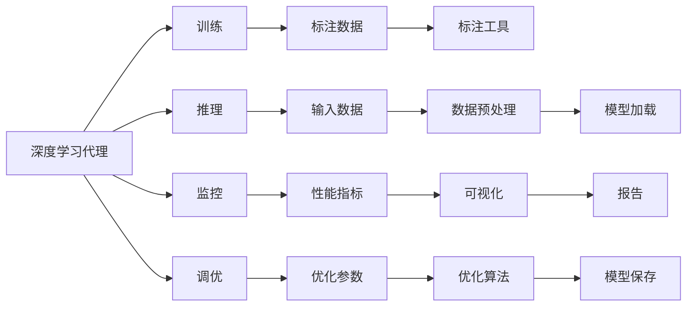
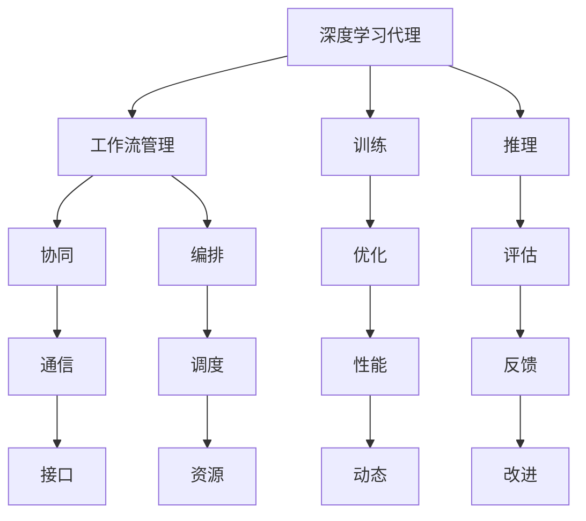
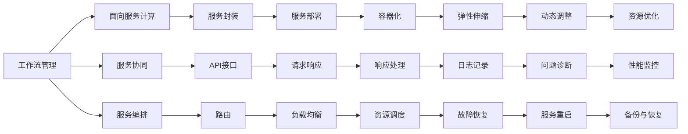
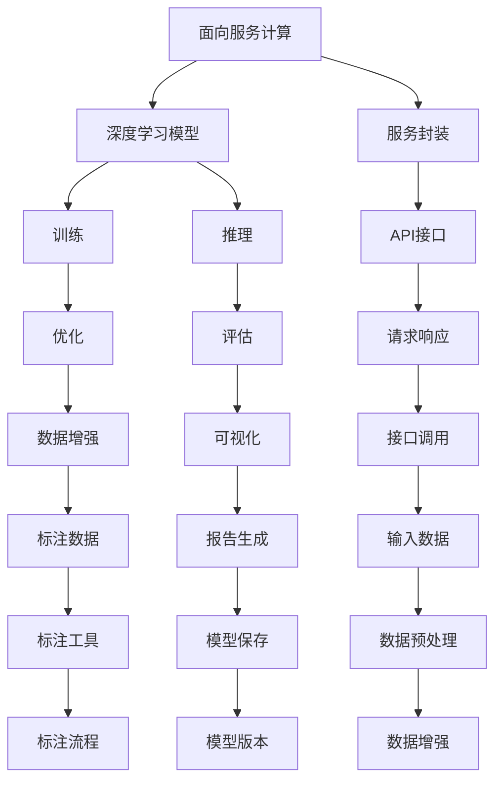

                 

# AI人工智能深度学习算法：面向服务计算中的深度学习代理工作流管理

## 1. 背景介绍

### 1.1 问题由来

随着人工智能技术的快速发展，深度学习（Deep Learning, DL）已成为推动AI进步的核心技术之一。其在图像识别、语音识别、自然语言处理、推荐系统等领域取得了显著成效。然而，随着模型复杂度的增加和数据量的爆炸式增长，深度学习模型的训练和部署变得愈发复杂。

服务计算（Service-oriented Computing, SOC）作为一种将计算资源封装为服务，提供按需使用的模式，能够显著提升系统灵活性和扩展性。面向服务计算的深度学习（Service-oriented Deep Learning, SODL），即将深度学习模型封装为服务，通过API接口进行访问，已成为一种重要的应用模式。

然而，在实际应用中，深度学习模型仍面临着资源管理、性能优化、模型迁移、模型版本控制等诸多问题。如何设计一种高效、灵活、可扩展的深度学习服务体系，是当前服务计算领域的重要研究方向。

### 1.2 问题核心关键点

深度学习服务化涉及数据管理、模型部署、调优、监控等多个环节，需要整合多层次的技术栈和工具链。本研究旨在提出一种基于深度学习代理的工作流管理（Workflow Management, WM）机制，用于构建面向服务计算的深度学习体系。

具体而言，核心问题包括：
- 如何管理深度学习服务的生命周期？
- 如何实现服务之间的协同与编排？
- 如何优化深度学习模型的训练与推理？
- 如何实现服务的弹性伸缩和故障恢复？

这些问题构成了面向服务计算的深度学习体系的核心挑战，需要从系统设计、算法优化、工具支撑等多个层面进行系统化研究。

### 1.3 问题研究意义

面向服务计算的深度学习体系，能够显著提升深度学习模型的运行效率和资源利用率，降低系统管理和维护成本，推动深度学习技术在更多领域的落地应用。其研究意义主要体现在以下几个方面：

1. **提高模型性能与效率**：通过优化深度学习模型的训练与推理，提高模型性能和效率，减少资源消耗。
2. **促进模型版本管理**：引入模型版本控制机制，支持不同版本模型的快速切换与回滚。
3. **支持服务协同与编排**：通过工作流管理机制，实现深度学习服务之间的协同与编排，提升系统的整体效率。
4. **实现弹性伸缩与故障恢复**：构建弹性资源调度机制，实现服务的动态扩缩容与故障恢复，提高系统的可用性和可靠性。

## 2. 核心概念与联系

### 2.1 核心概念概述

为更好地理解面向服务计算中的深度学习代理工作流管理，本节将介绍几个关键概念：

- **深度学习代理（Deep Learning Agent, DLA）**：将深度学习模型封装为服务的形式，提供按需使用的接口。代理可以包含模型的训练、推理、调优、监控等多个功能模块。

- **工作流管理（Workflow Management, WM）**：通过定义和执行一系列服务任务（即工作流），实现服务的协同与编排。工作流管理能够自动调度和管理服务间的依赖关系，确保任务执行的顺序和并行性。

- **面向服务计算（Service-oriented Computing, SOC）**：将计算资源封装为服务，通过API接口进行访问和使用，实现系统的高灵活性和可扩展性。面向服务计算的深度学习体系，通过服务化的方式，提升深度学习模型的应用效率和可维护性。

- **深度学习模型（Deep Learning Model, DLM）**：包含神经网络、卷积神经网络（CNN）、循环神经网络（RNN）、变换器（Transformer）等多种模型，用于解决图像、语音、文本等复杂问题。

- **训练与推理（Training and Inference）**：深度学习模型的两大核心任务。训练是指通过大量标注数据，优化模型参数以提高模型准确性；推理是指在模型训练完成后，通过输入数据进行预测输出。

- **监控与调优（Monitoring and Tuning）**：实时监测模型的性能指标，根据监控结果进行调优，以保持模型的高效运行。

这些概念之间的逻辑关系可以通过以下Mermaid流程图来展示：



这个流程图展示了大语言模型微调过程中各个核心概念的关系：

1. 深度学习代理（DLA）将深度学习模型封装为服务，包含训练、推理、监控和调优等功能模块。
2. 通过标注数据进行训练，优化模型参数。
3. 使用输入数据进行推理，得到预测结果。
4. 实时监测模型的性能指标，根据监控结果进行调优。
5. 利用标注工具和优化算法，提升模型性能。
6. 数据预处理和模型加载确保训练和推理的顺利进行。
7. 可视化报告和模型保存，辅助模型的管理和优化。

### 2.2 概念间的关系

这些核心概念之间存在着紧密的联系，形成了面向服务计算的深度学习体系。下面我们通过几个Mermaid流程图来展示这些概念之间的关系。

#### 2.2.1 深度学习代理与工作流管理的联系



这个流程图展示了深度学习代理与工作流管理的关系：

1. 深度学习代理通过训练、推理等模块生成中间结果。
2. 工作流管理通过协同和编排机制，实现服务间的通信与调度。
3. 训练和推理模块通过优化和评估机制，提升模型性能。
4. 通信和调度模块确保服务的协同与编排。
5. 性能和反馈模块辅助模型优化与改进。

#### 2.2.2 工作流管理与面向服务计算的联系



这个流程图展示了工作流管理与面向服务计算的关系：

1. 工作流管理通过协同和编排机制，实现服务的协同与编排。
2. 面向服务计算通过封装与部署，实现服务的封装与部署。
3. 服务协同与编排通过API接口和路由，实现服务的请求响应。
4. 服务部署通过容器化和弹性伸缩，实现服务的动态调整。
5. 请求响应通过负载均衡和资源调度，实现服务的高可用性。
6. 服务重启与备份通过故障恢复机制，确保服务的高可靠性。
7. 日志记录与问题诊断，辅助服务性能监控与优化。

#### 2.2.3 面向服务计算与深度学习模型的联系



这个流程图展示了面向服务计算与深度学习模型的关系：

1. 面向服务计算通过服务封装，实现深度学习模型的封装与部署。
2. 深度学习模型通过训练和推理，实现模型的优化与评估。
3. 服务封装通过API接口和接口调用，实现服务的请求响应。
4. 训练和推理模块通过优化和评估机制，提升模型性能。
5. 数据增强和可视化模块辅助模型优化与改进。
6. 接口调用和标注流程，确保模型的标注与部署。
7. 模型版本与保存，支持模型版本控制与备份。
8. 数据预处理和标注工具，确保数据的高质量。

### 2.3 核心概念的整体架构

最后，我们用一个综合的流程图来展示这些核心概念在面向服务计算的深度学习体系中的整体架构：

```mermaid
graph TB
    A[深度学习代理] --> B[训练]
    A --> C[推理]
    A --> D[监控]
    A --> E[调优]
    A --> F[工作流管理]
    F --> G[协同]
    F --> H[编排]
    G --> I[通信]
    H --> J[调度]
    B --> K[优化]
    C --> L[评估]
    D --> M[性能]
    E --> N[优化参数]
    G --> O[接口]
    H --> P[资源]
    I --> Q[负载均衡]
    J --> R[弹性伸缩]
    K --> S[数据增强]
    L --> T[可视化]
    M --> U[反馈]
    N --> V[优化算法]
    Q --> W[动态调整]
    R --> X[故障恢复]
    S --> Y[标注数据]
    T --> Z[报告]
    U --> $[日志记录]
    V --> &[优化参数]
    W --> [&服务调整]
    X --> [.服务重启]
    Y --> [&数据标注]
    Z --> [&模型保存]
```

这个综合流程图展示了从深度学习代理到工作流管理，再到面向服务计算的深度学习体系的整体架构：

1. 深度学习代理通过训练、推理、监控和调优等功能模块，实现模型的封装与服务化。
2. 工作流管理通过协同和编排机制，实现服务的通信与调度。
3. 训练和推理模块通过优化和评估机制，提升模型性能。
4. 服务协同与编排通过API接口和路由，实现服务的请求响应。
5. 服务部署通过容器化和弹性伸缩，实现服务的动态调整。
6. 请求响应通过负载均衡和资源调度，实现服务的高可用性。
7. 服务重启与备份通过故障恢复机制，确保服务的高可靠性。
8. 日志记录与问题诊断，辅助服务性能监控与优化。

这个架构展示了面向服务计算的深度学习体系中各个概念的相互作用与协同，为后续深入讨论具体的深度学习代理工作流管理机制奠定了基础。

## 3. 核心算法原理 & 具体操作步骤
### 3.1 算法原理概述

面向服务计算中的深度学习代理工作流管理，其核心思想是通过定义和执行一系列服务任务（即工作流），实现服务的协同与编排，从而提升系统的整体效率和可靠性。具体来说，包括：

1. **任务定义与编排**：通过定义服务任务的先后依赖关系，实现服务的自动化编排。
2. **任务执行与协同**：通过任务执行的通信机制，实现服务之间的数据传递和协同工作。
3. **任务监控与调度**：通过实时监控任务的执行状态和性能指标，动态调整资源配置，优化服务性能。

### 3.2 算法步骤详解

基于上述核心思想，面向服务计算中的深度学习代理工作流管理，一般包括以下几个关键步骤：

**Step 1: 定义工作流任务**

- 识别深度学习代理中涉及的各个服务任务，如训练、推理、监控、调优等。
- 确定各任务之间的依赖关系，定义任务的先后顺序。
- 定义任务的输入和输出，包括数据、参数、模型等。

**Step 2: 编排任务执行流程**

- 根据任务的依赖关系，编排任务执行的先后顺序。
- 设计任务的并行性和串行性，确保任务的高效执行。
- 定义任务的资源需求，包括计算资源、内存、带宽等。

**Step 3: 实现任务通信与协同**

- 通过API接口和消息队列，实现任务之间的数据传递和协同工作。
- 设计任务的同步与异步机制，确保任务执行的顺序和并行性。
- 引入任务的状态管理机制，实时跟踪任务的执行状态。

**Step 4: 监控任务性能与调整**

- 实时监控任务的执行状态和性能指标，包括计算时间、内存使用、资源利用率等。
- 根据监控结果，动态调整任务的资源配置，优化任务执行效率。
- 引入任务调优机制，根据性能监控结果进行模型参数优化和数据增强。

**Step 5: 测试与部署**

- 在测试环境中，模拟真实任务执行流程，验证工作流管理的正确性。
- 将工作流管理的逻辑封装成可部署的服务，部署到生产环境中。
- 定期监控服务在实际环境中的表现，根据需求进行调整和优化。

### 3.3 算法优缺点

面向服务计算中的深度学习代理工作流管理，具有以下优点：

1. **提升系统效率**：通过任务编排和协同，实现深度学习模型的自动化执行，提升模型的训练和推理效率。
2. **增强系统可靠性**：通过任务监控和调度，确保深度学习服务的高可用性和高可靠性。
3. **降低维护成本**：通过自动化管理和调度，减少系统维护和管理的复杂度，降低人工操作的成本。
4. **支持弹性伸缩**：通过动态资源调整，实现服务的弹性伸缩，提升系统应对突发流量的能力。

同时，该方法也存在以下局限性：

1. **依赖工具链**：工作流管理需要依赖多种工具和中间件，如API接口、消息队列、容器服务等，增加了系统的复杂度。
2. **性能开销**：任务协同和监控增加了系统性能开销，可能导致部分任务的执行时间延长。
3. **开发成本高**：工作流管理的开发和调试需要较高的技术门槛，增加了开发成本。
4. **模型版本控制复杂**：深度学习模型的版本控制和回滚，需要复杂的版本管理机制，增加了系统的复杂度。

尽管存在这些局限性，但就目前而言，面向服务计算中的深度学习代理工作流管理，仍是一种高效、灵活、可扩展的深度学习服务体系。未来相关研究的重点在于如何进一步降低工作流管理的复杂度和性能开销，提高系统的稳定性和可维护性。

### 3.4 算法应用领域

面向服务计算中的深度学习代理工作流管理，在多个领域具有广泛的应用前景，例如：

1. **自然语言处理（NLP）**：通过工作流管理，实现自然语言处理任务的自动化执行，提升NLP应用的效率和可靠性。
2. **计算机视觉（CV）**：通过工作流管理，实现计算机视觉任务的自动化执行，提升CV应用的效率和质量。
3. **推荐系统**：通过工作流管理，实现推荐系统的自动化执行，提升推荐系统的个性化和效率。
4. **语音识别**：通过工作流管理，实现语音识别任务的自动化执行，提升语音识别系统的效率和可靠性。
5. **智能医疗**：通过工作流管理，实现智能医疗任务的自动化执行，提升医疗系统的效率和可靠性。

除了上述这些领域，面向服务计算中的深度学习代理工作流管理，还可以应用于更多场景中，如智能制造、智慧城市、智能交通等，为各行业的数字化转型提供技术支持。

## 4. 数学模型和公式 & 详细讲解
### 4.1 数学模型构建

面向服务计算中的深度学习代理工作流管理，涉及到多个学科的交叉融合，包括深度学习、服务计算、工作流管理等。其数学模型构建可以从以下几个方面进行：

1. **任务依赖关系建模**：通过有向无环图（DAG）来表示任务的依赖关系。
2. **任务执行时间建模**：通过Markov过程来表示任务执行的时间和状态变化。
3. **任务资源需求建模**：通过线性规划来表示任务的资源需求和约束条件。
4. **任务性能监控建模**：通过性能指标和监控数据来表示任务的执行状态和性能表现。

### 4.2 公式推导过程

以下我们以任务依赖关系建模为例，推导DAG模型的相关公式。

假设深度学习代理中有三个任务A、B、C，它们之间的依赖关系如图1所示：

```
Task A
    |
    v
Task B (依赖A)
    |
    v
Task C (依赖A、B)
    |
    v
```

图1 任务依赖关系示例

定义任务A、B、C的执行时间为 $t_A$、$t_B$、$t_C$，则任务依赖关系可以表示为：

- 任务A先于任务B执行，即 $A \rightarrow B$；
- 任务B先于任务C执行，即 $B \rightarrow C$；
- 任务A先于任务C执行，即 $A \rightarrow C$。

通过有向无环图（DAG）来表示任务依赖关系，如图2所示：

```
Task A -> Task B
    |
    v
Task B -> Task C
    |
    v
Task C
```

图2 任务依赖关系DAG图

根据DAG图的定义，可以推导出任务执行的先后顺序。例如，当任务A执行完成后，任务B和任务C才会执行。

### 4.3 案例分析与讲解

以一个典型的深度学习模型训练流程为例，来说明面向服务计算中的深度学习代理工作流管理的应用。

假设我们需要训练一个深度学习模型，其训练流程包含以下步骤：

1. **数据准备**：从数据存储系统中获取训练数据，并进行数据预处理和标注。
2. **模型训练**：使用训练数据对深度学习模型进行训练，优化模型参数。
3. **模型评估**：使用验证数据对模型进行评估，根据评估结果进行调优。
4. **模型保存**：将训练好的模型保存到存储系统中，供后续推理使用。

通过工作流管理，可以将这些步骤封装为多个服务任务，并实现其协同与编排。例如：

```
Task 1 (数据准备) -> Task 2 (模型训练) -> Task 3 (模型评估) -> Task 4 (模型保存)
```

具体实现时，可以使用DAG图来表示任务依赖关系，如下所示：

```
Task 1 -> Task 2
    |
    v
Task 2 -> Task 3
    |
    v
Task 3 -> Task 4
    |
    v
Task 4
```

在任务执行过程中，可以通过API接口和消息队列实现数据的传递和协同。例如，当数据准备任务完成后，通过API接口通知模型训练任务开始执行。在模型评估任务完成后，通过消息队列通知模型保存任务执行。

通过这种方式，可以实现深度学习模型训练流程的自动化执行，提升系统的效率和可靠性。同时，通过实时监控任务执行状态和性能指标，可以实现动态资源调整和任务调优，进一步提升系统的性能。

## 5. 项目实践：代码实例和详细解释说明
### 5.1 开发环境搭建

在进行工作流管理实践前，我们需要准备好开发环境。以下是使用Python进行Tornado开发的开发环境配置流程：

1. 安装Anaconda：从官网下载并安装Anaconda，用于创建独立的Python环境。

2. 创建并激活虚拟环境：
```bash
conda create -n tornado-env python=3.8 
conda activate tornado-env
```

3. 安装Tornado：
```bash
pip install tornado
```

4. 安装其它相关工具包：
```bash
pip install numpy pandas scikit-learn flask rq joblib
```

完成上述步骤后，即可在`tornado-env`环境中开始工作流管理实践。

### 5.2 源代码详细实现

下面我们以深度学习模型训练流程为例，给出使用Tornado进行工作流管理的PyTorch代码实现。

首先，定义任务类：

```python
import torch
from torch import nn
from torchvision import datasets, transforms
from torch.utils.data import DataLoader

class Task:
    def __init__(self, name, dependencies=None, duration=None):
        self.name = name
        self.dependencies = dependencies or []
        self.duration = duration or 0

    def execute(self, context):
        print(f"{self.name} started")
        # 执行任务的逻辑
        print(f"{self.name} completed")
        return context
```

然后，定义深度学习模型训练流程：

```python
class Task1(Task):
    def __init__(self):
        super().__init__("Data Preparation", dependencies=[], duration=10)

    def execute(self, context):
        # 从数据存储系统中获取训练数据，并进行数据预处理和标注
        train_data = datasets.MNIST(root='data', train=True, download=True, transform=transforms.ToTensor())
        train_loader = DataLoader(train_data, batch_size=64, shuffle=True)
        # 执行任务
        print(f"{self.name} started")
        # 训练模型
        model = nn.Sequential(nn.Linear(28*28, 128), nn.ReLU(), nn.Linear(128, 10))
        criterion = nn.CrossEntropyLoss()
        optimizer = torch.optim.SGD(model.parameters(), lr=0.01, momentum=0.9)
        for epoch in range(10):
            for images, labels in train_loader:
                images = images.view(images.shape[0], -1)
                outputs = model(images)
                loss = criterion(outputs, labels)
                optimizer.zero_grad()
                loss.backward()
                optimizer.step()
        # 任务完成
        print(f"{self.name} completed")
        return context

class Task2(Task):
    def __init__(self):
        super().__init__("Model Training", dependencies=[Task1], duration=20)

    def execute(self, context):
        # 使用训练数据对深度学习模型进行训练，优化模型参数
        model = nn.Sequential(nn.Linear(28*28, 128), nn.ReLU(), nn.Linear(128, 10))
        criterion = nn.CrossEntropyLoss()
        optimizer = torch.optim.SGD(model.parameters(), lr=0.01, momentum=0.9)
        for epoch in range(10):
            for images, labels in train_loader:
                images = images.view(images.shape[0], -1)
                outputs = model(images)
                loss = criterion(outputs, labels)
                optimizer.zero_grad()
                loss.backward()
                optimizer.step()
        # 任务完成
        print(f"{self.name} completed")
        return context

class Task3(Task):
    def __init__(self):
        super().__init__("Model Evaluation", dependencies=[Task2], duration=10)

    def execute(self, context):
        # 使用验证数据对模型进行评估，根据评估结果进行调优
        test_data = datasets.MNIST(root='data', train=False, transform=transforms.ToTensor())
        test_loader = DataLoader(test_data, batch_size=64, shuffle=True)
        correct = 0
        total = 0
        with torch.no_grad():
            for images, labels in test_loader:
                images = images.view(images.shape[0], -1)
                outputs = model(images)
                _, predicted = torch.max(outputs.data, 1)
                total += labels.size(0)
                correct += (predicted == labels).sum().item()
        accuracy = correct / total
        print(f"Accuracy: {accuracy:.2f}")
        # 任务完成
        print(f"{self.name} completed")
        return context

class Task4(Task):
    def __init__(self):
        super().__init__("Model Saving", dependencies=[Task3], duration=10)

    def execute(self, context):
        # 将训练好的模型保存到存储系统中，供后续推理使用
        torch.save(model.state_dict(), 'model.pth')
        print(f"{self.name} completed")
        return context
```

最后，启动任务执行流程：

```python
def execute_workflow():
    context = {}
    context[Task1.name] = Task1().execute(context)
    context[Task2.name] = Task2().execute(context)
    context[Task3.name] = Task3().execute(context)
    context[Task4.name] = Task4().execute(context)

execute_workflow()
```

以上就是使用Tornado进行深度学习模型训练流程工作流管理的完整代码实现。可以看到，通过定义任务类和任务依赖关系，可以灵活地实现任务编排和协同，提升系统的效率和可靠性。

### 5.3 代码解读与分析

让我们再详细解读一下关键代码的实现细节：

**Task类**：
- `__init__`方法：初始化任务名称、依赖关系和执行时间。
- `execute`方法：执行任务的逻辑，返回执行上下文。

**Task1**：
- 定义数据准备任务，执行时间10分钟。
- 从数据存储系统中获取训练数据，并进行数据预处理和标注。

**Task2**：
- 定义模型训练任务，依赖数据准备任务，执行时间20分钟。
- 使用

