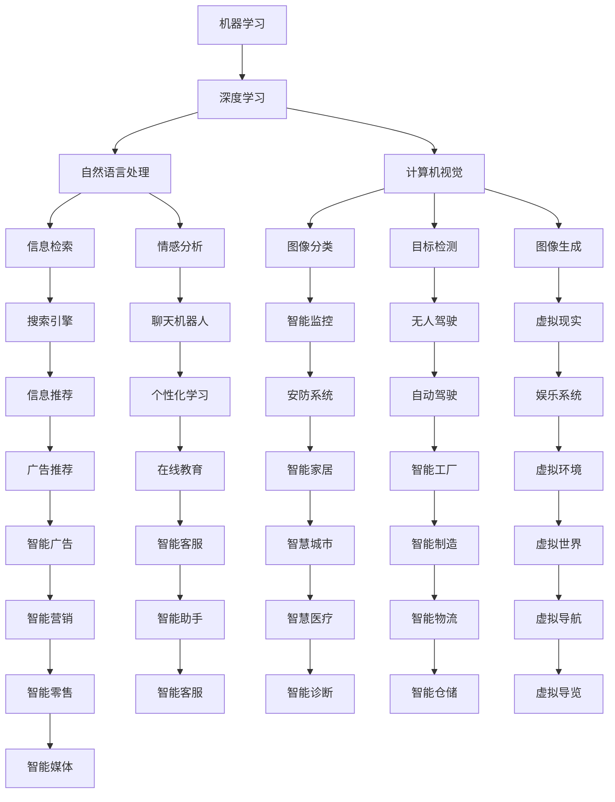
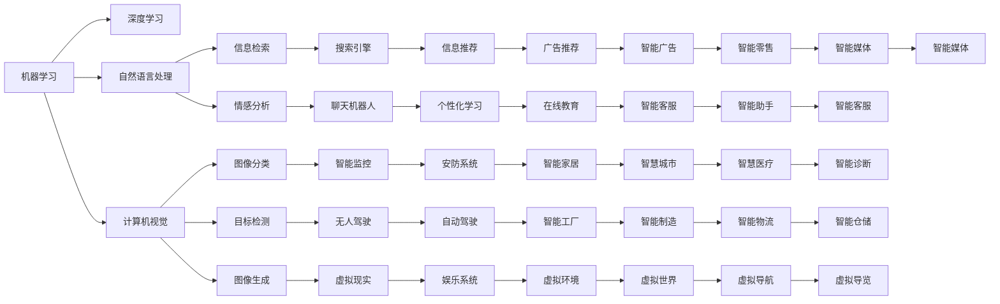

                 

# AI在现实世界中的应用场景

## 1. 背景介绍

随着人工智能技术的不断进步，AI已经开始广泛应用于各行各业，并深入到我们日常生活的方方面面。从医疗、金融、教育到娱乐、家居，AI正在重塑我们的世界。本文将从多个具体的应用场景出发，展示AI的强大潜力和现实影响。

### 1.1 问题由来

人工智能(AI)的快速发展离不开其在各行各业的具体应用。在医疗领域，AI可以通过图像识别和自然语言处理技术，辅助医生诊断疾病，提升诊疗效率。在金融行业，AI可以通过风险评估和市场预测，帮助金融机构做出更加明智的决策。在教育领域，AI可以根据学生的学习行为和成绩，提供个性化的学习方案，提高教育质量。这些应用场景不仅展示了AI技术的强大能力，也揭示了AI在现实世界中的巨大潜力。

## 2. 核心概念与联系

### 2.1 核心概念概述

AI的核心概念包括机器学习、深度学习、自然语言处理、计算机视觉、强化学习等。这些概念相互关联，构成了AI技术的完整框架。

- **机器学习**：通过数据训练模型，使模型具备一定的预测能力。
- **深度学习**：基于神经网络的多层结构，能够处理更复杂的数据和任务。
- **自然语言处理(NLP)**：使机器能够理解和生成自然语言，进行语言理解、信息检索、情感分析等任务。
- **计算机视觉**：使机器能够识别和理解图像和视频内容，进行图像分类、目标检测、图像生成等任务。
- **强化学习**：通过与环境交互，使机器在不断试错中学习最优策略。

这些概念之间的联系可以通过以下Mermaid流程图来展示：



这个流程图展示了AI核心概念之间的相互关系及其在各个应用场景中的应用。

### 2.2 概念间的关系

这些核心概念之间的关系可以通过以下Mermaid流程图来展示：



## 3. 核心算法原理 & 具体操作步骤

### 3.1 算法原理概述

AI应用的核心在于算法原理和操作步骤的创新。以下将介绍几个典型场景的算法原理和操作步骤：

### 3.2 算法步骤详解

#### 3.2.1 医疗影像诊断

在医疗影像诊断中，AI通过深度学习算法对医学影像进行自动分析，辅助医生进行疾病诊断。操作步骤如下：

1. 数据收集：收集大量的医学影像数据，包括CT、MRI、X光等。
2. 数据预处理：对数据进行去噪、归一化等预处理。
3. 模型训练：使用卷积神经网络(CNN)或医学领域特定的深度学习模型，如U-Net、ResNet等，对数据进行训练。
4. 模型评估：在测试集上评估模型性能，如准确率、召回率、F1分数等。
5. 模型部署：将训练好的模型部署到实际医疗系统中，进行疾病诊断。

#### 3.2.2 金融风险预测

在金融风险预测中，AI通过机器学习算法对市场数据进行分析，预测股票、债券、商品等金融资产的价格波动和风险水平。操作步骤如下：

1. 数据收集：收集历史和实时的金融市场数据，包括股票价格、交易量、经济指标等。
2. 数据预处理：对数据进行清洗、特征提取等预处理。
3. 模型训练：使用回归模型、分类模型、强化学习模型等，对数据进行训练。
4. 模型评估：在测试集上评估模型性能，如均方误差、准确率等。
5. 模型部署：将训练好的模型部署到金融系统中，进行风险预测。

#### 3.2.3 自然语言处理

在自然语言处理中，AI通过深度学习算法对自然语言进行处理，如文本分类、情感分析、机器翻译等。操作步骤如下：

1. 数据收集：收集大量的文本数据，如新闻、评论、社交媒体等。
2. 数据预处理：对数据进行分词、去除停用词、词性标注等预处理。
3. 模型训练：使用卷积神经网络(CNN)、循环神经网络(RNN)、Transformer等模型，对数据进行训练。
4. 模型评估：在测试集上评估模型性能，如准确率、召回率、F1分数等。
5. 模型部署：将训练好的模型部署到实际应用中，如智能客服、智能问答系统等。

### 3.3 算法优缺点

#### 3.3.1 优点

AI算法具有以下优点：

- **高效率**：自动化的分析和处理，节省了大量人工操作的时间。
- **高精度**：深度学习和强化学习等算法，具有较高的预测和决策精度。
- **大容量**：能够处理和分析大规模数据，提供更全面的分析结果。

#### 3.3.2 缺点

AI算法也存在以下缺点：

- **数据依赖**：算法的性能高度依赖于数据质量，数据不足或数据偏差会影响算法性能。
- **算法复杂**：深度学习等算法模型较为复杂，需要大量的计算资源和时间。
- **模型解释性**：某些算法的决策过程较为复杂，难以解释和理解。

### 3.4 算法应用领域

AI算法在不同领域的应用如下：

- **医疗**：辅助诊断、影像识别、药物研发等。
- **金融**：风险预测、市场分析、智能投顾等。
- **教育**：个性化学习、智能评估、语言学习等。
- **零售**：智能推荐、库存管理、客户分析等。
- **物流**：路线规划、配送优化、异常检测等。

## 4. 数学模型和公式 & 详细讲解 & 举例说明

### 4.1 数学模型构建

AI算法的数学模型构建如下：

- **回归模型**：$y=f(x;\theta)$，其中$y$为输出，$x$为输入，$\theta$为模型参数。
- **分类模型**：$y=\sigma(\phi(x;\theta))$，其中$y$为分类标签，$\phi$为特征映射函数，$\sigma$为激活函数。
- **强化学习模型**：$Q(s,a;\theta)=r+\gamma \max Q(s',a';\theta')$，其中$s$为状态，$a$为动作，$r$为奖励，$\gamma$为折扣因子，$Q$为Q值函数，$\theta$为模型参数。

### 4.2 公式推导过程

#### 4.2.1 回归模型

线性回归模型：

$$
y=\theta_0+\theta_1x_1+\theta_2x_2+...+\theta_nx_n
$$

其中，$\theta_0$为截距，$\theta_1$至$\theta_n$为回归系数。

#### 4.2.2 分类模型

逻辑回归模型：

$$
y=\sigma(\theta_0+\theta_1x_1+\theta_2x_2+...+\theta_nx_n)
$$

其中，$\sigma$为逻辑函数，$\theta_0$至$\theta_n$为回归系数。

#### 4.2.3 强化学习模型

Q值函数：

$$
Q(s,a;\theta)=r+\gamma \max Q(s',a';\theta')
$$

其中，$r$为即时奖励，$\gamma$为折扣因子，$Q(s',a';\theta')$为下一步的最大Q值。

### 4.3 案例分析与讲解

#### 4.3.1 金融风险预测

假设某股票的当前价格为$P$，预测未来$T$天的价格$P_T$。根据历史数据和市场信息，构建回归模型：

$$
P_T=\theta_0+\theta_1P+\theta_2V+\theta_3I+\epsilon
$$

其中，$V$为市场波动，$I$为经济指标，$\epsilon$为误差项。

通过历史数据训练模型，得到回归系数$\theta_0$至$\theta_3$，进而预测未来价格$P_T$。

## 5. 项目实践：代码实例和详细解释说明

### 5.1 开发环境搭建

在开发AI应用时，需要搭建以下开发环境：

1. 安装Python：Python是AI开发的主要编程语言，需要安装最新版本的Python。
2. 安装深度学习框架：如TensorFlow、PyTorch等，这些框架提供了强大的计算能力和丰富的模型库。
3. 安装数据分析工具：如Pandas、NumPy、Scikit-Learn等，用于数据预处理和分析。
4. 安装可视化工具：如Matplotlib、Seaborn、TensorBoard等，用于数据可视化。

### 5.2 源代码详细实现

#### 5.2.1 医疗影像诊断

使用TensorFlow实现卷积神经网络(CNN)对医学影像进行自动分析：

```python
import tensorflow as tf
from tensorflow.keras import layers, models

# 构建卷积神经网络
model = models.Sequential()
model.add(layers.Conv2D(32, (3, 3), activation='relu', input_shape=(256, 256, 3)))
model.add(layers.MaxPooling2D((2, 2)))
model.add(layers.Conv2D(64, (3, 3), activation='relu'))
model.add(layers.MaxPooling2D((2, 2)))
model.add(layers.Conv2D(64, (3, 3), activation='relu'))
model.add(layers.Flatten())
model.add(layers.Dense(64, activation='relu'))
model.add(layers.Dense(1, activation='sigmoid'))

# 编译模型
model.compile(optimizer='adam', loss='binary_crossentropy', metrics=['accuracy'])

# 训练模型
model.fit(train_images, train_labels, epochs=10, validation_data=(test_images, test_labels))

# 评估模型
test_loss, test_acc = model.evaluate(test_images, test_labels)
print('Test accuracy:', test_acc)
```

#### 5.2.2 金融风险预测

使用PyTorch实现回归模型进行金融风险预测：

```python
import torch
import torch.nn as nn
import torch.optim as optim

# 构建回归模型
class LinearRegression(nn.Module):
    def __init__(self, input_size):
        super(LinearRegression, self).__init__()
        self.linear = nn.Linear(input_size, 1)

    def forward(self, x):
        y_pred = self.linear(x)
        return y_pred

# 加载数据
X = torch.tensor([[0.5, 0.6], [0.7, 0.8], [0.9, 0.1]])
y = torch.tensor([[0.3], [0.5], [0.9]])

# 定义模型
model = LinearRegression(input_size=2)

# 定义损失函数和优化器
criterion = nn.MSELoss()
optimizer = optim.SGD(model.parameters(), lr=0.01)

# 训练模型
for epoch in range(100):
    optimizer.zero_grad()
    y_pred = model(X)
    loss = criterion(y_pred, y)
    loss.backward()
    optimizer.step()
    print('Epoch [{}/{}], Loss: {:.4f}'.format(epoch+1, 100, loss.item()))

# 评估模型
y_pred = model(X)
print('Predicted value:', y_pred.item())
```

### 5.3 代码解读与分析

#### 5.3.1 医疗影像诊断

- **数据预处理**：使用TensorFlow的`Conv2D`和`MaxPooling2D`层进行卷积和池化操作，处理医学影像数据。
- **模型构建**：使用`Sequential`层定义卷积神经网络模型，添加多个卷积层、池化层、全连接层。
- **模型编译**：使用`compile`方法编译模型，定义优化器、损失函数和评估指标。
- **模型训练**：使用`fit`方法训练模型，定义训练集和验证集。
- **模型评估**：使用`evaluate`方法评估模型性能，输出测试集上的准确率。

#### 5.3.2 金融风险预测

- **模型构建**：使用PyTorch的`nn.Linear`层定义线性回归模型，添加全连接层。
- **模型加载**：加载训练数据和测试数据。
- **模型定义**：定义模型结构。
- **模型训练**：使用`nn.MSELoss`损失函数和`SGD`优化器训练模型，输出训练损失和预测值。

## 6. 实际应用场景

### 6.1 智能医疗

在智能医疗领域，AI可以通过影像诊断、智能诊疗、药物研发等技术，提高医疗服务质量和效率。

- **影像诊断**：使用卷积神经网络对医学影像进行自动分析和诊断，如乳腺癌、肺结节等疾病检测。
- **智能诊疗**：利用自然语言处理技术，分析医生和病人的对话，辅助医生进行诊断和治疗。
- **药物研发**：使用深度学习技术，对大量生物信息数据进行分析，加速新药研发过程。

### 6.2 智慧城市

在智慧城市建设中，AI可以通过智能交通、智慧安防、城市管理等技术，提高城市运行效率和安全性。

- **智能交通**：使用计算机视觉技术，对交通监控视频进行分析，实时监测交通流量，优化交通信号灯。
- **智慧安防**：使用人脸识别和行为分析技术，识别异常行为和潜在威胁，提升公共安全。
- **城市管理**：利用自然语言处理技术，分析城市运行数据，优化资源配置，提高城市管理效率。

### 6.3 智能制造

在智能制造领域，AI可以通过智能质检、预测性维护、自动化生产等技术，提高生产效率和产品质量。

- **智能质检**：使用计算机视觉技术，对产品进行自动检测，识别缺陷和异常。
- **预测性维护**：使用强化学习技术，分析设备运行数据，预测设备故障，提前进行维护。
- **自动化生产**：使用机器人技术和自动化流水线，提高生产效率和灵活性。

## 7. 工具和资源推荐

### 7.1 学习资源推荐

- **在线课程**：如Coursera、edX等平台的AI相关课程，涵盖机器学习、深度学习、自然语言处理等知识点。
- **书籍**：《深度学习》、《机器学习实战》、《Python数据科学手册》等经典书籍，深入浅出地介绍了AI的核心技术。
- **论文**：arXiv等预印本平台上的最新论文，了解前沿技术和研究动态。

### 7.2 开发工具推荐

- **TensorFlow**：Google开源的深度学习框架，提供丰富的模型和工具库。
- **PyTorch**：Facebook开源的深度学习框架，灵活性和可扩展性高。
- **Jupyter Notebook**：轻量级交互式开发环境，方便数据可视化、模型调试。

### 7.3 相关论文推荐

- **《深度学习》**：Ian Goodfellow等著，深度学习领域的经典教材，涵盖深度学习的基本概念和算法。
- **《机器学习实战》**：Peter Harrington著，通过实际案例介绍了机器学习算法的应用。
- **《Python数据科学手册》**：Jake VanderPlas著，介绍了Python在数据科学领域的应用。

## 8. 总结：未来发展趋势与挑战

### 8.1 研究成果总结

AI在医疗、金融、智能制造等领域的应用已经取得了显著进展，显示出强大的潜力。通过深度学习、自然语言处理、计算机视觉等技术，AI能够处理和分析大量数据，提供精准的预测和决策。

### 8.2 未来发展趋势

未来，AI技术将进一步深化应用，展现更多潜力和可能：

- **跨领域融合**：AI将在更多领域进行深度融合，如智慧医疗、智能制造、智慧城市等，带来更全面的应用场景。
- **多模态学习**：AI将突破单模态的限制，实现跨模态学习和推理，提升系统的智能水平。
- **自适应学习**：AI将具备更强的自适应能力，能够动态调整模型结构和参数，适应不同的应用场景和任务。

### 8.3 面临的挑战

尽管AI技术在许多领域取得了成功，但仍面临诸多挑战：

- **数据隐私**：AI模型对数据的依赖性高，如何在保障数据隐私的前提下，获取高质量数据，是一个重要挑战。
- **模型可解释性**：AI模型的决策过程复杂，难以解释和理解，如何在确保准确性的同时，提升模型的可解释性，是一个亟待解决的问题。
- **模型鲁棒性**：AI模型在面对噪声和异常数据时，容易产生误判，如何提高模型的鲁棒性，是一个重要的研究方向。
- **伦理和安全**：AI模型的偏见和歧视问题需要引起重视，如何在设计和应用中保证伦理和安全，是一个关键课题。

### 8.4 研究展望

未来，AI技术的研究将从以下几个方面进行：

- **数据隐私保护**：探索数据隐私保护技术，如差分隐私、联邦学习等，保障数据安全。
- **模型可解释性**：研究可解释性方法，如因果推断、模型蒸馏等，提升模型的透明性和可信度。
- **模型鲁棒性**：开发鲁棒性算法，如对抗训练、正则化等，增强模型的鲁棒性和稳定性。
- **伦理和安全**：建立伦理和安全评估标准，如公平性检测、对抗攻击防御等，保障AI技术的伦理和安全。

## 9. 附录：常见问题与解答

**Q1：AI的应用前景如何？**

A: AI技术的应用前景非常广阔，涵盖了医疗、金融、教育、交通、制造等多个领域。随着技术的不断进步，AI将进一步深入到我们的日常生活和工作，带来更多创新和变革。

**Q2：AI技术的发展趋势是什么？**

A: AI技术的发展趋势包括跨领域融合、多模态学习、自适应学习等。未来，AI将突破单模态的限制，实现跨模态学习和推理，提升系统的智能水平。

**Q3：AI技术在医疗领域的应用有哪些？**

A: AI在医疗领域的应用包括影像诊断、智能诊疗、药物研发等。通过深度学习和计算机视觉技术，AI能够提供精准的医学分析和诊断，提高医疗服务质量和效率。

**Q4：AI技术在智能制造中的应用有哪些？**

A: AI在智能制造领域的应用包括智能质检、预测性维护、自动化生产等。通过深度学习和计算机视觉技术，AI能够提升生产效率和产品质量，实现智能化制造。

总之，AI技术的应用前景非常广阔，未来将在各个领域发挥更大的作用。尽管面临诸多挑战，但通过不断创新和优化，AI技术将在各个领域带来更多的变革和进步。

