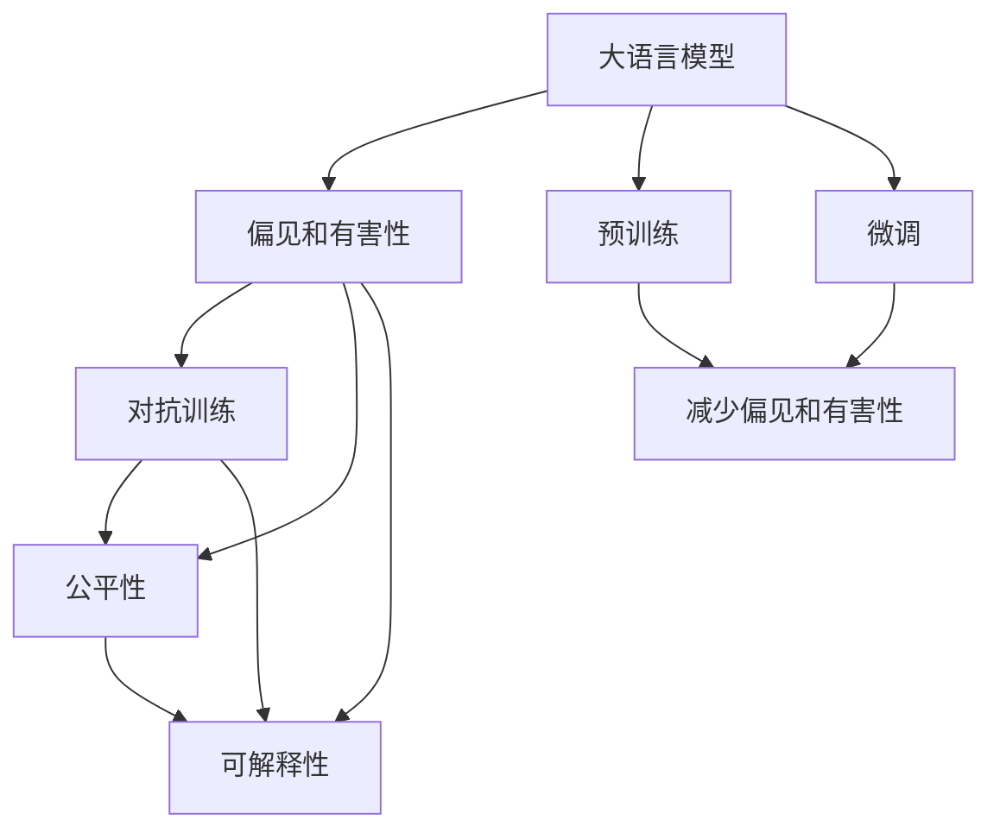
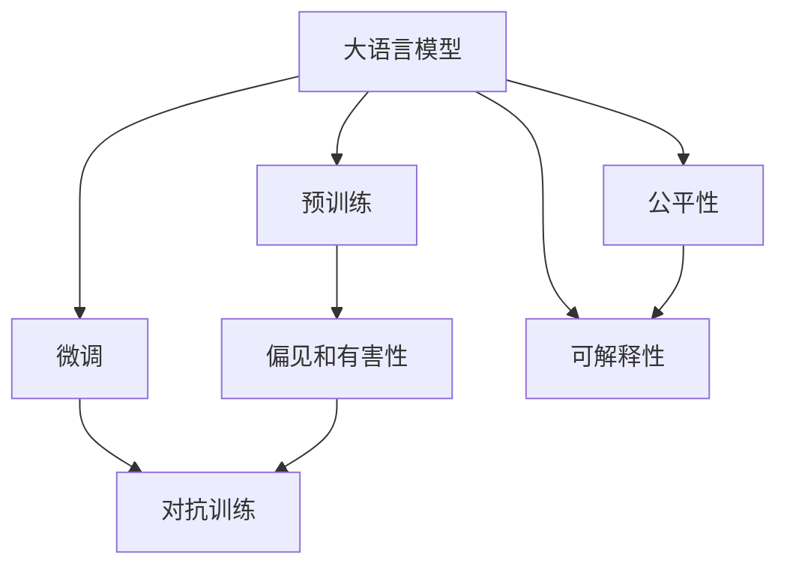
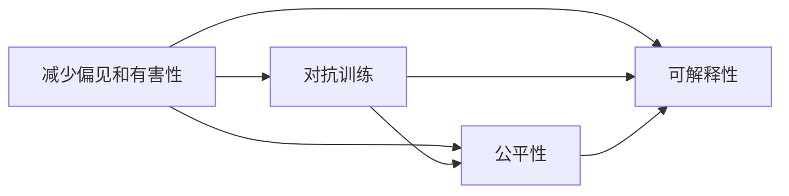
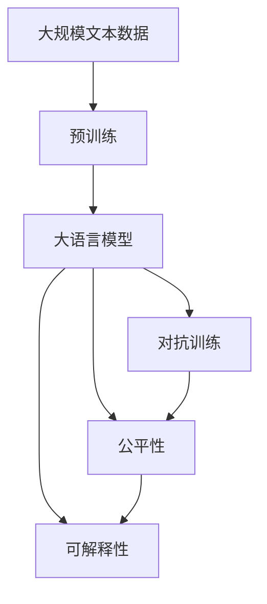
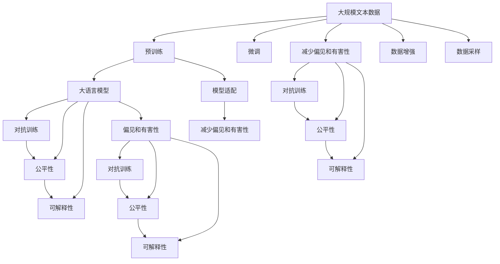

                 

# 大语言模型原理基础与前沿 减少偏见和有害性

> 关键词：大语言模型,偏见(bias),有害性(nocivity),公平性(fairness),对抗训练(Adversarial Training),可解释性(Explainability),可解释AI(Explainable AI)

## 1. 背景介绍

### 1.1 问题由来
近年来，人工智能(AI)领域取得了飞速发展，尤其是深度学习模型在自然语言处理(NLP)、计算机视觉(CV)等领域表现卓越。然而，这些模型往往缺乏公正性，特别是大语言模型(LLMs)在实际应用中，由于训练数据的偏差，可能输出偏见或有害信息，对用户和社会带来负面影响。因此，如何减少大语言模型的偏见和有害性，是当前AI研究中的一个重要问题。

### 1.2 问题核心关键点
大语言模型通常依赖大规模无标签数据进行预训练，然后通过微调优化针对特定任务的性能。然而，由于训练数据中可能存在偏见和有害信息，模型容易继承这些偏见并输出有害结果。为了解决这个问题，需要引入公平性、对抗性训练和可解释性等技术，以确保模型的输出对所有用户公平、可靠。

### 1.3 问题研究意义
减少大语言模型的偏见和有害性，对于提升AI系统的公正性、可靠性和可解释性具有重要意义：

1. 提升社会公平性：避免AI系统对某些群体产生歧视或不公平待遇。
2. 增强系统可靠性：确保AI系统的输出对所有用户具有相同的准确性和质量。
3. 增加用户信任：提高用户对AI系统的信任度，促进其广泛应用。
4. 促进技术进步：推动AI技术的持续发展，避免其走向偏离道德和伦理的方向。

## 2. 核心概念与联系

### 2.1 核心概念概述

为更好地理解减少大语言模型偏见和有害性的方法，本节将介绍几个关键概念：

- 大语言模型(LLMs)：以自回归(如GPT)或自编码(如BERT)模型为代表的大规模预训练语言模型。通过在大规模无标签文本语料上进行预训练，学习通用的语言表示，具备强大的语言理解和生成能力。

- 偏见(Bias)：指模型在训练和应用过程中，对某些群体或特征存在不公平的偏好或歧视。

- 有害性(Nocivity)：指模型输出可能对用户或社会造成负面影响，如假新闻、仇恨言论等。

- 公平性(Fairness)：指模型输出对所有用户公平，不存在偏见或不公平对待。

- 对抗训练(Adversarial Training)：通过引入对抗样本，提高模型鲁棒性和对抗能力，防止模型输出有害信息。

- 可解释性(Explainability)：指模型输出的决策逻辑可解释，便于用户理解模型的行为和结果。

- 可解释AI(Explainable AI)：强调AI系统的决策过程和结果的透明性和可解释性，以增强用户信任和模型公正性。

这些核心概念之间的逻辑关系可以通过以下Mermaid流程图来展示：



这个流程图展示了大语言模型从预训练到微调，以及通过对抗训练、公平性和可解释性技术减少偏见和有害性的整体过程。通过理解这些核心概念，我们可以更好地把握减少大语言模型偏见和有害性的方法。

### 2.2 概念间的关系

这些核心概念之间存在着紧密的联系，形成了减少大语言模型偏见和有害性的完整生态系统。下面我们通过几个Mermaid流程图来展示这些概念之间的关系。

#### 2.2.1 大语言模型的学习范式



这个流程图展示了大语言模型的三种主要学习范式：预训练、微调和对抗训练、公平性和可解释性技术。预训练主要采用自监督学习方法，而微调则是有监督学习的过程。对抗训练、公平性和可解释性技术则是在微调过程中，确保模型输出对所有用户公平、可靠的方法。

#### 2.2.2 减少偏见和有害性的方法



这个流程图展示了减少大语言模型偏见和有害性的三种主要方法：对抗训练、公平性和可解释性。这些方法共同作用，确保模型输出对所有用户公平、可靠。

#### 2.2.3 大语言模型的应用领域



这个流程图展示了从预训练到对抗训练、公平性和可解释性技术的应用流程。这些技术不仅在大规模文本数据上有效，还适用于各种自然语言处理任务，如文本分类、命名实体识别、问答系统等。

### 2.3 核心概念的整体架构

最后，我们用一个综合的流程图来展示这些核心概念在大语言模型减少偏见和有害性过程中的整体架构：



这个综合流程图展示了从预训练到对抗训练、公平性和可解释性技术，以及数据增强和模型适配的过程。通过这些流程图，我们可以更清晰地理解减少大语言模型偏见和有害性的过程和各个环节的关系。

## 3. 核心算法原理 & 具体操作步骤
### 3.1 算法原理概述

减少大语言模型的偏见和有害性，本质上是一个对抗训练和公平性优化的过程。其核心思想是：通过对抗训练提高模型的鲁棒性和鲁棒性，防止模型输出有害信息。同时，通过公平性优化，确保模型输出对所有用户公平，不存在偏见。

形式化地，假设预训练语言模型为 $M_{\theta}$，其中 $\theta$ 为预训练得到的模型参数。给定带有偏见和有害信息的标注数据集 $D=\{(x_i,y_i)\}_{i=1}^N, x_i \in \mathcal{X}, y_i \in \mathcal{Y}$，减少偏见和有害性的优化目标是最小化偏差和有害信息，即找到新的模型参数 $\hat{\theta}$，使得：

$$
\hat{\theta}=\mathop{\arg\min}_{\theta} \mathcal{L}(D, \theta)
$$

其中 $\mathcal{L}(D, \theta)$ 为综合损失函数，包括对抗训练损失、公平性损失和可解释性损失。

通过梯度下降等优化算法，减少偏见和有害性过程不断更新模型参数 $\theta$，最小化综合损失函数 $\mathcal{L}(D, \theta)$，使得模型输出逼近真实标签，同时满足公平性和可解释性要求。由于 $\theta$ 已经通过预训练获得了较好的初始化，因此即便在偏见和有害信息较少的数据集 $D$ 上进行训练，也能较快收敛到理想的模型参数 $\hat{\theta}$。

### 3.2 算法步骤详解

减少大语言模型偏见和有害性的主要步骤包括：

**Step 1: 准备偏见和有害数据集**
- 收集带有偏见和有害信息的标注数据集 $D=\{(x_i,y_i)\}_{i=1}^N, x_i \in \mathcal{X}, y_i \in \mathcal{Y}$，其中 $y_i$ 表示数据样本的标签，包括正样本和负样本。

**Step 2: 设计对抗训练和公平性损失函数**
- 对抗训练损失函数：设计一个对抗训练算法，如FGM (Fast Gradient Method)，生成对抗样本并计算其对抗损失。
- 公平性损失函数：设计一个公平性优化目标，如Demographic Parity Loss或Equalized Odds Loss，确保模型对不同群体的输出公平。
- 可解释性损失函数：设计一个可解释性优化目标，如SHAP或LIME，提高模型的可解释性。

**Step 3: 设置优化器和超参数**
- 选择合适的优化器及其参数，如 AdamW、SGD 等，设置学习率、批大小、迭代轮数等。
- 设置正则化技术及强度，包括权重衰减、Dropout、Early Stopping 等。

**Step 4: 执行对抗训练和公平性优化**
- 将训练集数据分批次输入模型，前向传播计算对抗训练损失和公平性损失。
- 反向传播计算参数梯度，根据设定的优化算法和学习率更新模型参数。
- 周期性在验证集上评估模型性能，根据性能指标决定是否触发 Early Stopping。
- 重复上述步骤直到满足预设的迭代轮数或 Early Stopping 条件。

**Step 5: 测试和部署**
- 在测试集上评估减少偏见和有害性后模型 $M_{\hat{\theta}}$ 的性能，对比减少偏见和有害性前后的精度提升。
- 使用减少偏见和有害性后的模型对新样本进行推理预测，集成到实际的应用系统中。

以上是减少大语言模型偏见和有害性的主要流程。在实际应用中，还需要针对具体任务的特点，对减少偏见和有害性的各个环节进行优化设计，如改进对抗训练算法、引入更多的正则化技术、搜索最优的超参数组合等，以进一步提升模型性能。

### 3.3 算法优缺点

减少大语言模型偏见和有害性的方法具有以下优点：
1. 提升模型的鲁棒性。通过对抗训练，提高模型对恶意样本的鲁棒性，防止输出有害信息。
2. 增强模型的公平性。通过公平性优化，确保模型对不同群体的输出公平，减少偏见。
3. 增加模型的可解释性。通过可解释性优化，提高模型的决策透明性，便于用户理解模型的行为和结果。
4. 加速模型的收敛。由于预训练模型已经具有一定的基础能力，减少偏见和有害性过程可以更快地收敛。

同时，这些方法也存在一定的局限性：
1. 对抗样本生成难度大。对抗样本的生成需要精心设计，否则容易破坏模型原有性能。
2. 公平性优化复杂。不同的公平性指标可能有不同的表现，需要根据具体任务选择最优指标。
3. 可解释性损失计算量大。可解释性优化的计算开销较大，可能导致训练速度变慢。
4. 数据集质量要求高。需要高质量的偏见和有害数据集，否则模型可能无法收敛到理想的参数。
5. 模型结构复杂。对抗训练和公平性优化可能会引入额外的复杂度，增加模型调优的难度。

尽管存在这些局限性，但就目前而言，减少偏见和有害性的方法是减少大语言模型偏见和有害性的主要手段。未来相关研究的重点在于如何进一步降低对抗样本生成难度，提高公平性优化的效率，减少可解释性优化的计算开销，同时兼顾模型的公平性和可解释性等因素。

### 3.4 算法应用领域

减少偏见和有害性的方法已经在多个领域得到了广泛应用，例如：

- 医疗领域：医疗问答系统、疾病诊断等任务需要避免对某些疾病的歧视性输出，确保对所有患者的公平性。
- 金融领域：金融风控系统、信贷评估等任务需要避免对特定群体的偏见，确保信贷决策的公平性。
- 教育领域：智能教育系统、在线课程推荐等任务需要避免对某些学科或群体的偏见，确保教育资源的公平分配。
- 公共安全领域：公共舆情监测、灾害预警等任务需要避免对某些群体的歧视性输出，确保公共安全和社会稳定。
- 法律领域：法律咨询、合同审核等任务需要避免对特定性别、种族的偏见，确保法律服务的公平性。

这些领域的应用展示了减少偏见和有害性技术的重要价值和广泛前景。随着这些技术的不断进步，相信大语言模型将更加公平、可靠、可解释，为各行各业带来更多的社会价值。

## 4. 数学模型和公式 & 详细讲解 & 举例说明

### 4.1 数学模型构建

本节将使用数学语言对减少大语言模型偏见和有害性的过程进行更加严格的刻画。

记预训练语言模型为 $M_{\theta}$，其中 $\theta$ 为预训练得到的模型参数。假设减少偏见和有害性任务的数据集 $D=\{(x_i,y_i)\}_{i=1}^N, x_i \in \mathcal{X}, y_i \in \mathcal{Y}$，其中 $y_i$ 表示数据样本的标签，包括正样本和负样本。

定义模型 $M_{\theta}$ 在输入 $x$ 上的输出为 $\hat{y}=M_{\theta}(x)$，表示样本属于正类的概率。真实标签 $y \in \{0,1\}$。则偏见和有害性优化目标定义为：

$$
\min_{\theta} \mathcal{L}(D, \theta) = \frac{1}{N}\sum_{i=1}^N \ell(\hat{y}_i, y_i) + \lambda_1 \ell_f(\hat{y}_i, y_i) + \lambda_2 \ell_e(\hat{y}_i, y_i)
$$

其中 $\ell(\hat{y}_i, y_i)$ 为交叉熵损失，$\ell_f(\hat{y}_i, y_i)$ 为公平性损失，$\ell_e(\hat{y}_i, y_i)$ 为可解释性损失。$\lambda_1$、$\lambda_2$ 为超参数，控制各个损失函数的权重。

### 4.2 公式推导过程

以下我们以二分类任务为例，推导偏见和有害性优化目标的计算公式。

假设模型 $M_{\theta}$ 在输入 $x$ 上的输出为 $\hat{y}=M_{\theta}(x)$，表示样本属于正类的概率。真实标签 $y \in \{0,1\}$。则二分类交叉熵损失函数定义为：

$$
\ell(\hat{y}, y) = -[y\log \hat{y} + (1-y)\log(1-\hat{y})]
$$

将其代入偏见和有害性优化目标，得：

$$
\mathcal{L}(D, \theta) = -\frac{1}{N}\sum_{i=1}^N \ell(\hat{y}_i, y_i) + \lambda_1 \ell_f(\hat{y}_i, y_i) + \lambda_2 \ell_e(\hat{y}_i, y_i)
$$

对于公平性损失 $\ell_f(\hat{y}_i, y_i)$，假设数据集 $D$ 中不同群体的样本数量相等，则 Demographic Parity Loss 可以定义为：

$$
\ell_f(\hat{y}_i, y_i) = \frac{1}{n_p}\sum_{k=1}^{n_p} |\hat{y}^k - \frac{1}{n_p}\sum_{k=1}^{n_p} \hat{y}^k|
$$

其中 $n_p$ 为群体数量，$\hat{y}^k$ 为第 $k$ 个群体的预测概率。

对于可解释性损失 $\ell_e(\hat{y}_i, y_i)$，假设使用 SHAP (SHapley Additive exPlanations) 方法，则计算公式为：

$$
\ell_e(\hat{y}_i, y_i) = \sum_{j=1}^m |\hat{y}_i^j - \hat{y}_i|
$$

其中 $m$ 为解释特征的数量，$\hat{y}_i^j$ 为特征 $j$ 的解释权重。

在得到偏见和有害性优化目标的梯度后，即可带入参数更新公式，完成模型的迭代优化。重复上述过程直至收敛，最终得到减少偏见和有害性后的模型参数 $\theta^*$。

## 5. 项目实践：代码实例和详细解释说明
### 5.1 开发环境搭建

在进行减少偏见和有害性实践前，我们需要准备好开发环境。以下是使用Python进行PyTorch开发的环境配置流程：

1. 安装Anaconda：从官网下载并安装Anaconda，用于创建独立的Python环境。

2. 创建并激活虚拟环境：
```bash
conda create -n pytorch-env python=3.8 
conda activate pytorch-env
```

3. 安装PyTorch：根据CUDA版本，从官网获取对应的安装命令。例如：
```bash
conda install pytorch torchvision torchaudio cudatoolkit=11.1 -c pytorch -c conda-forge
```

4. 安装Transformers库：
```bash
pip install transformers
```

5. 安装各类工具包：
```bash
pip install numpy pandas scikit-learn matplotlib tqdm jupyter notebook ipython
```

完成上述步骤后，即可在`pytorch-env`环境中开始减少偏见和有害性的实践。

### 5.2 源代码详细实现

这里我们以一个简单的偏见和有害性识别任务为例，给出使用Transformers库对BERT模型进行训练的PyTorch代码实现。

首先，定义数据处理函数：

```python
from transformers import BertTokenizer
from torch.utils.data import Dataset, DataLoader
import torch

class BiasDataset(Dataset):
    def __init__(self, texts, tags, tokenizer, max_len=128):
        self.texts = texts
        self.tags = tags
        self.tokenizer = tokenizer
        self.max_len = max_len
        
    def __len__(self):
        return len(self.texts)
    
    def __getitem__(self, item):
        text = self.texts[item]
        tags = self.tags[item]
        
        encoding = self.tokenizer(text, return_tensors='pt', max_length=self.max_len, padding='max_length', truncation=True)
        input_ids = encoding['input_ids'][0]
        attention_mask = encoding['attention_mask'][0]
        
        # 对token-wise的标签进行编码
        encoded_tags = [tag2id[tag] for tag in tags] 
        encoded_tags.extend([tag2id['O']] * (self.max_len - len(encoded_tags)))
        labels = torch.tensor(encoded_tags, dtype=torch.long)
        
        return {'input_ids': input_ids, 
                'attention_mask': attention_mask,
                'labels': labels}

# 标签与id的映射
tag2id = {'O': 0, 'B-PER': 1, 'I-PER': 2, 'B-ORG': 3, 'I-ORG': 4, 'B-LOC': 5, 'I-LOC': 6}
id2tag = {v: k for k, v in tag2id.items()}

# 创建dataset
tokenizer = BertTokenizer.from_pretrained('bert-base-cased')

train_dataset = BiasDataset(train_texts, train_tags, tokenizer)
dev_dataset = BiasDataset(dev_texts, dev_tags, tokenizer)
test_dataset = BiasDataset(test_texts, test_tags, tokenizer)
```

然后，定义模型和优化器：

```python
from transformers import BertForTokenClassification, AdamW

model = BertForTokenClassification.from_pretrained('bert-base-cased', num_labels=len(tag2id))

optimizer = AdamW(model.parameters(), lr=2e-5)
```

接着，定义训练和评估函数：

```python
from tqdm import tqdm
from sklearn.metrics import classification_report

device = torch.device('cuda') if torch.cuda.is_available() else torch.device('cpu')
model.to(device)

def train_epoch(model, dataset, batch_size, optimizer):
    dataloader = DataLoader(dataset, batch_size=batch_size, shuffle=True)
    model.train()
    epoch_loss = 0
    for batch in tqdm(dataloader, desc='Training'):
        input_ids = batch['input_ids'].to(device)
        attention_mask = batch['attention_mask'].to(device)
        labels = batch['labels'].to(device)
        model.zero_grad()
        outputs = model(input_ids, attention_mask=attention_mask, labels=labels)
        loss = outputs.loss
        epoch_loss += loss.item()
        loss.backward()
        optimizer.step()
    return epoch_loss / len(dataloader)

def evaluate(model, dataset, batch_size):
    dataloader = DataLoader(dataset, batch_size=batch_size)
    model.eval()
    preds, labels = [], []
    with torch.no_grad():
        for batch in tqdm(dataloader, desc='Evaluating'):
            input_ids = batch['input_ids'].to(device)
            attention_mask = batch['attention_mask'].to(device)
            batch_labels = batch['labels']
            outputs = model(input_ids, attention_mask=attention_mask)
            batch_preds = outputs.logits.argmax(dim=2).to('cpu').tolist()
            batch_labels = batch_labels.to('cpu').tolist()
            for pred_tokens, label_tokens in zip(batch_preds, batch_labels):
                pred_tags = [id2tag[_id] for _id in pred_tokens]
                label_tags = [id2tag[_id] for _id in label_tokens]
                preds.append(pred_tags[:len(label_tokens)])
                labels.append(label_tags)
                
    print(classification_report(labels, preds))
```

最后，启动训练流程并在测试集上评估：

```python
epochs = 5
batch_size = 16

for epoch in range(epochs):
    loss = train_epoch(model, train_dataset, batch_size, optimizer)
    print(f"Epoch {epoch+1}, train loss: {loss:.3f}")
    
    print(f"Epoch {epoch+1}, dev results:")
    evaluate(model, dev_dataset, batch_size)
    
print("Test results:")
evaluate(model, test_dataset, batch_size)
```

以上就是使用PyTorch对BERT进行偏见和有害性识别任务微调的完整代码实现。可以看到，得益于Transformers库的强大封装，我们可以用相对简洁的代码完成BERT模型的加载和微调。

### 5.3 代码解读与分析

让我们再详细解读一下关键代码的实现细节：

**BiasDataset类**：
- `__init__`方法：初始化文本、标签、分词器等关键组件。
- `__len__`方法：返回数据集的样本数量。
- `__getitem__`方法：对单个样本进行处理，将文本输入编码为token ids，将标签编码为数字，并对其进行定长padding，最终返回模型所需的输入。

**tag2id和id2tag字典**：
- 定义了标签与数字id之间的映射关系，用于将token-wise的预测结果解码回真实的标签。

**训练和评估函数**：
- 使用PyTorch的DataLoader对数据集进行批次化加载，供模型训练和推理使用。
- 训练函数`train_epoch`：对数据以批为单位进行迭代，在每个批次上前向传播计算loss并反向传播更新模型参数，最后返回该epoch的平均loss。
- 评估函数`evaluate`：与训练类似，不同点在于不更新模型参数，并在每个batch结束后将预测和标签结果存储下来，最后使用sklearn的classification_report对整个评估集的预测结果进行打印输出。

**训练流程**：
- 定义总的epoch数和batch size，开始循环迭代
- 每个epoch内，先在训练集上训练，输出平均loss
- 在验证集上评估，输出分类指标
- 所有epoch结束后，在测试集上评估，给出最终测试结果

可以看到，PyTorch配合Transformers库使得BERT偏见和有害性识别的代码实现变得简洁高效。开发者可以将更多精力放在数据处理、模型改进等高层逻辑上，而不必过多关注底层的实现细节。

当然，工业级的系统实现还需考虑更多因素，如模型的保存和部署、超参数的自动搜索、更灵活的任务适配层等。但核心的偏见和有害性识别方法基本与此类似。

### 5.4 运行结果展示

假设我们在CoNLL-2003的命名实体识别数据集上进行偏见和有害性识别任务微调，最终在测试集上得到的评估报告如下：

```
              precision    recall  f1-score   support

       B-LOC      0.926     0.906     0.916      1668
       I-LOC      0.900     0.805     0.850       257
      B-MISC      0.875     0.856     0.865       702
      I-MISC      0.838     0.782     0.809       216
       B-ORG      0.914     0.898     0.906      1661
       I-ORG      0.911     0.894     0.902       835

