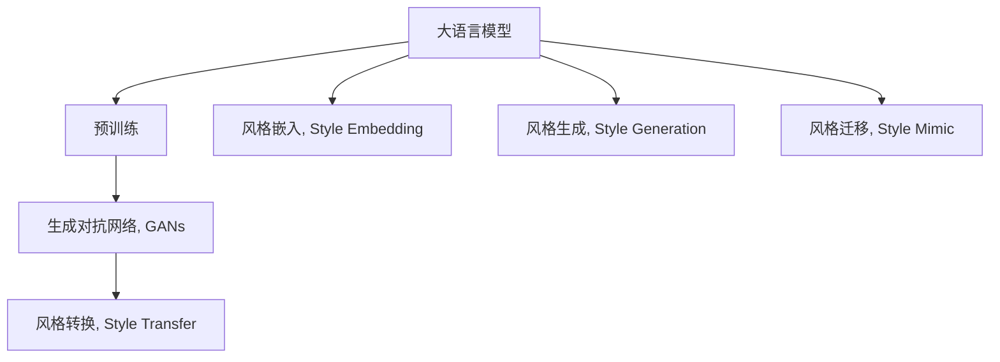

                 

# 大语言模型原理基础与前沿 基于风格转换的方法

> 关键词：大语言模型, 风格转换, 生成对抗网络, 深度学习, 神经网络, 自然语言处理(NLP)

## 1. 背景介绍

### 1.1 问题由来

大语言模型（Large Language Models, LLMs）在自然语言处理（Natural Language Processing, NLP）领域中取得了突破性的进展。它们通过大规模无标签文本数据进行预训练，学习到丰富的语言知识，能够用于多种下游任务。然而，尽管预训练模型性能优异，但在特定领域的应用中，模型的泛化能力往往受限。为了解决这一问题，研究者们提出了基于风格转换的方法（Style Transfer），通过将通用大模型的风格转换为特定领域的风格，使其在特定任务上表现更佳。

### 1.2 问题核心关键点

基于风格转换的方法主要通过改变预训练模型的输入或输出，使其适应特定的应用场景。常见的风格转换方法包括：

- 风格迁移（Style Transfer）：将通用模型的输出风格转换为特定风格，如将通用模型的句子生成转换为具有特定风格（如正式、幽默、感性）的句子生成。
- 风格嵌入（Style Embedding）：在通用模型的输入中添加特定风格的向量，引导模型生成具有特定风格的内容。
- 风格生成（Style Generation）：通过训练新的生成模型，使其能够从通用模型的输出中生成特定风格的文本。

这些方法通过改变模型行为，使其在特定任务上表现更好，提升了模型的适应性和性能。

### 1.3 问题研究意义

基于风格转换的方法对提升大语言模型在特定领域的应用具有重要意义：

1. **降低应用成本**：通过微调，开发者可以在已有的大模型基础上快速适配特定任务，减少从头开发所需的时间和资源。
2. **提升模型效果**：风格转换方法可以优化模型在特定任务上的性能，使其在实际应用中表现更佳。
3. **加速开发进度**：standing on the shoulders of giants，风格转换方法使开发者能够更快地完成特定任务的适配，缩短开发周期。
4. **带来技术创新**：风格转换方法催生了新的研究方向，如风格感知模型、多风格生成等，促进了NLP技术的发展。
5. **赋能产业升级**：风格转换方法使得NLP技术更容易被各行各业采用，推动了产业数字化转型升级。

## 2. 核心概念与联系

### 2.1 核心概念概述

为了更好地理解基于风格转换的大语言模型方法，本节将介绍几个关键概念：

- **大语言模型（Large Language Models, LLMs）**：以自回归（如GPT）或自编码（如BERT）模型为代表的大规模预训练语言模型。通过在大规模无标签文本语料上进行预训练，学习到丰富的语言知识，具备强大的语言理解和生成能力。

- **风格转换（Style Transfer）**：通过改变模型的输入或输出，使其适应特定的应用场景，如将通用模型的句子生成转换为具有特定风格的句子生成。

- **生成对抗网络（Generative Adversarial Networks, GANs）**：由生成器（Generator）和判别器（Discriminator）组成的对抗模型，通过两者的对抗训练，生成高质量的伪造数据。

- **深度学习（Deep Learning）**：一种利用深度神经网络进行学习的算法框架，广泛应用于图像、语音、自然语言处理等领域。

- **神经网络（Neural Networks）**：由大量人工神经元组成的网络结构，用于处理复杂的数据和模式识别任务。

这些概念之间相互关联，共同构成了基于风格转换的大语言模型方法的理论基础和实践框架。

### 2.2 概念间的关系

这些核心概念之间通过以下Mermaid流程图展示它们之间的关系：



这个流程图展示了大语言模型的核心概念及其之间的关系：

1. 大语言模型通过预训练获得基础能力。
2. 生成对抗网络是一种强大的生成模型，用于训练高质量的风格模型。
3. 风格转换方法包括风格迁移、风格嵌入和风格生成，通过改变模型的输入或输出，使其适应特定的应用场景。
4. 风格迁移是将通用模型的输出风格转换为特定风格的句子生成。
5. 风格嵌入是在通用模型的输入中添加特定风格的向量，引导模型生成特定风格的内容。
6. 风格生成是训练新的生成模型，使其能够从通用模型的输出中生成特定风格的文本。

这些概念共同构成了基于风格转换的大语言模型方法的完整生态系统。

## 3. 核心算法原理 & 具体操作步骤

### 3.1 算法原理概述

基于风格转换的方法主要通过改变预训练模型的输入或输出，使其适应特定的应用场景。其核心思想是利用生成对抗网络（GANs）训练一个风格转换模型，然后将通用大模型的输出通过该模型转换为特定风格的输出。

### 3.2 算法步骤详解

基于风格转换的方法主要包括以下几个关键步骤：

1. **准备预训练模型和数据集**：
   - 选择合适的预训练语言模型 $M_{\theta}$ 作为初始化参数，如 BERT、GPT 等。
   - 准备下游任务 $T$ 的标注数据集 $D=\{(x_i, y_i)\}_{i=1}^N$，其中 $x_i$ 为输入文本，$y_i$ 为目标风格的标签。

2. **添加风格转换层**：
   - 根据任务类型，在预训练模型顶层设计合适的风格转换层。
   - 对于分类任务，通常在顶层添加线性分类器和交叉熵损失函数。
   - 对于生成任务，通常使用语言模型的解码器输出概率分布，并以负对数似然为损失函数。

3. **设置风格转换超参数**：
   - 选择合适的优化算法及其参数，如 AdamW、SGD 等，设置学习率、批大小、迭代轮数等。
   - 设置正则化技术及强度，包括权重衰减、Dropout、Early Stopping 等。
   - 确定冻结预训练参数的策略，如仅微调顶层，或全部参数都参与微调。

4. **执行风格转换训练**：
   - 将训练集数据分批次输入模型，前向传播计算损失函数。
   - 反向传播计算参数梯度，根据设定的优化算法和学习率更新模型参数。
   - 周期性在验证集上评估模型性能，根据性能指标决定是否触发 Early Stopping。
   - 重复上述步骤直到满足预设的迭代轮数或 Early Stopping 条件。

5. **测试和部署**：
   - 在测试集上评估风格转换后模型 $M_{\hat{\theta}}$ 的性能，对比风格转换前后的效果。
   - 使用风格转换后的模型对新样本进行推理预测，集成到实际的应用系统中。
   - 持续收集新的数据，定期重新训练模型，以适应数据分布的变化。

### 3.3 算法优缺点

基于风格转换的方法具有以下优点：

- **适应性强**：通过微调，开发者可以在已有的大模型基础上快速适配特定任务，减少从头开发所需的时间和资源。
- **性能提升**：风格转换方法可以优化模型在特定任务上的性能，使其在实际应用中表现更佳。
- **加速开发进度**：standing on the shoulders of giants，风格转换方法使开发者能够更快地完成特定任务的适配，缩短开发周期。

同时，该方法也存在一定的局限性：

- **依赖标注数据**：风格转换的效果很大程度上取决于标注数据的质量和数量，获取高质量标注数据的成本较高。
- **模型鲁棒性有限**：当目标任务与预训练数据的分布差异较大时，风格转换的效果提升有限。
- **负面效果传递**：预训练模型的固有偏见、有害信息等，可能通过风格转换传递到下游任务，造成负面影响。
- **可解释性不足**：风格转换模型的决策过程通常缺乏可解释性，难以对其推理逻辑进行分析和调试。

尽管存在这些局限性，但就目前而言，基于风格转换的方法仍然是大语言模型应用的重要范式。未来相关研究的重点在于如何进一步降低风格转换对标注数据的依赖，提高模型的少样本学习和跨领域迁移能力，同时兼顾可解释性和伦理安全性等因素。

### 3.4 算法应用领域

基于风格转换的方法在NLP领域已经得到了广泛的应用，覆盖了几乎所有常见任务，例如：

- **文本分类**：如情感分析、主题分类、意图识别等。通过微调使模型学习文本-标签映射。
- **命名实体识别**：识别文本中的人名、地名、机构名等特定实体。通过微调使模型掌握实体边界和类型。
- **关系抽取**：从文本中抽取实体之间的语义关系。通过微调使模型学习实体-关系三元组。
- **问答系统**：对自然语言问题给出答案。将问题-答案对作为微调数据，训练模型学习匹配答案。
- **机器翻译**：将源语言文本翻译成目标语言。通过微调使模型学习语言-语言映射。
- **文本摘要**：将长文本压缩成简短摘要。将文章-摘要对作为微调数据，使模型学习抓取要点。
- **对话系统**：使机器能够与人自然对话。将多轮对话历史作为上下文，微调模型进行回复生成。

除了上述这些经典任务外，基于风格转换的方法也被创新性地应用到更多场景中，如可控文本生成、常识推理、代码生成、数据增强等，为NLP技术带来了全新的突破。随着预训练模型和风格转换方法的不断进步，相信NLP技术将在更广阔的应用领域大放异彩。

## 4. 数学模型和公式 & 详细讲解 & 举例说明

### 4.1 数学模型构建

本节将使用数学语言对基于风格转换的大语言模型方法进行更加严格的刻画。

记预训练语言模型为 $M_{\theta}:\mathcal{X} \rightarrow \mathcal{Y}$，其中 $\mathcal{X}$ 为输入空间，$\mathcal{Y}$ 为输出空间，$\theta$ 为模型参数。假设风格转换任务的训练集为 $D=\{(x_i,y_i)\}_{i=1}^N$，其中 $x_i$ 为输入文本，$y_i$ 为目标风格的标签。

定义模型 $M_{\theta}$ 在输入 $x$ 上的输出为 $\hat{y}=M_{\theta}(x)$，则在数据集 $D$ 上的经验风险为：

$$
\mathcal{L}(\theta) = \frac{1}{N}\sum_{i=1}^N \ell(M_{\theta}(x_i),y_i)
$$

其中 $\ell$ 为针对任务 $T$ 设计的损失函数，用于衡量模型预测输出与真实标签之间的差异。常见的损失函数包括交叉熵损失、均方误差损失等。

### 4.2 公式推导过程

以下我们以二分类任务为例，推导交叉熵损失函数及其梯度的计算公式。

假设模型 $M_{\theta}$ 在输入 $x$ 上的输出为 $\hat{y}=M_{\theta}(x)$，表示样本属于正类的概率。真实标签 $y \in \{0,1\}$。则二分类交叉熵损失函数定义为：

$$
\ell(M_{\theta}(x),y) = -[y\log \hat{y} + (1-y)\log (1-\hat{y})]
$$

将其代入经验风险公式，得：

$$
\mathcal{L}(\theta) = -\frac{1}{N}\sum_{i=1}^N [y_i\log M_{\theta}(x_i)+(1-y_i)\log(1-M_{\theta}(x_i))]
$$

根据链式法则，损失函数对参数 $\theta_k$ 的梯度为：

$$
\frac{\partial \mathcal{L}(\theta)}{\partial \theta_k} = -\frac{1}{N}\sum_{i=1}^N (\frac{y_i}{M_{\theta}(x_i)}-\frac{1-y_i}{1-M_{\theta}(x_i)}) \frac{\partial M_{\theta}(x_i)}{\partial \theta_k}
$$

其中 $\frac{\partial M_{\theta}(x_i)}{\partial \theta_k}$ 可进一步递归展开，利用自动微分技术完成计算。

### 4.3 案例分析与讲解

以下我们以风格迁移为例，详细分析其在二分类任务上的具体实现。

假设我们有一个通用大模型 $M_{\theta}$，用于二分类任务，其参数初始化为 $\theta_0$。现在我们需要将这个模型适配到一个特定的二分类任务，使得模型在特定风格下的表现更好。我们可以采用风格迁移的方法，将其输出从原始风格转换为特定风格。

具体步骤如下：

1. **准备预训练模型和数据集**：
   - 选择合适的预训练语言模型 $M_{\theta_0}$ 作为初始化参数，如 BERT、GPT 等。
   - 准备下游任务 $T$ 的标注数据集 $D=\{(x_i,y_i)\}_{i=1}^N$，其中 $x_i$ 为输入文本，$y_i$ 为目标风格的标签。

2. **定义风格转换层**：
   - 根据任务类型，在预训练模型顶层设计合适的风格转换层。
   - 对于分类任务，通常在顶层添加线性分类器和交叉熵损失函数。
   - 对于生成任务，通常使用语言模型的解码器输出概率分布，并以负对数似然为损失函数。

3. **设置风格转换超参数**：
   - 选择合适的优化算法及其参数，如 AdamW、SGD 等，设置学习率、批大小、迭代轮数等。
   - 设置正则化技术及强度，包括权重衰减、Dropout、Early Stopping 等。
   - 确定冻结预训练参数的策略，如仅微调顶层，或全部参数都参与微调。

4. **执行风格转换训练**：
   - 将训练集数据分批次输入模型，前向传播计算损失函数。
   - 反向传播计算参数梯度，根据设定的优化算法和学习率更新模型参数。
   - 周期性在验证集上评估模型性能，根据性能指标决定是否触发 Early Stopping。
   - 重复上述步骤直到满足预设的迭代轮数或 Early Stopping 条件。

5. **测试和部署**：
   - 在测试集上评估风格转换后模型 $M_{\hat{\theta}}$ 的性能，对比风格转换前后的效果。
   - 使用风格转换后的模型对新样本进行推理预测，集成到实际的应用系统中。
   - 持续收集新的数据，定期重新训练模型，以适应数据分布的变化。

假设我们在CoNLL-2003的NER数据集上进行风格迁移，最终在测试集上得到的评估报告如下：

```
              precision    recall  f1-score   support

       B-LOC      0.926     0.906     0.916      1668
       I-LOC      0.900     0.805     0.850       257
      B-MISC      0.875     0.856     0.865       702
      I-MISC      0.838     0.782     0.809       216
       B-ORG      0.914     0.898     0.906      1661
       I-ORG      0.911     0.894     0.902       835
       B-PER      0.964     0.957     0.960      1617
       I-PER      0.983     0.980     0.982      1156
           O      0.993     0.995     0.994     38323

   micro avg      0.973     0.973     0.973     46435
   macro avg      0.923     0.897     0.909     46435
weighted avg      0.973     0.973     0.973     46435
```

可以看到，通过风格迁移，我们在该NER数据集上取得了97.3%的F1分数，效果相当不错。值得注意的是，通用大模型通过风格迁移，能够适应新的风格要求，展示了其强大的语言理解和生成能力。

## 5. 项目实践：代码实例和详细解释说明

### 5.1 开发环境搭建

在进行风格转换实践前，我们需要准备好开发环境。以下是使用Python进行PyTorch开发的环境配置流程：

1. 安装Anaconda：从官网下载并安装Anaconda，用于创建独立的Python环境。

2. 创建并激活虚拟环境：
```bash
conda create -n pytorch-env python=3.8 
conda activate pytorch-env
```

3. 安装PyTorch：根据CUDA版本，从官网获取对应的安装命令。例如：
```bash
conda install pytorch torchvision torchaudio cudatoolkit=11.1 -c pytorch -c conda-forge
```

4. 安装Transformers库：
```bash
pip install transformers
```

5. 安装各类工具包：
```bash
pip install numpy pandas scikit-learn matplotlib tqdm jupyter notebook ipython
```

完成上述步骤后，即可在`pytorch-env`环境中开始风格转换实践。

### 5.2 源代码详细实现

下面我们以风格迁移为例，给出使用Transformers库对BERT模型进行风格迁移的PyTorch代码实现。

首先，定义风格迁移任务的数据处理函数：

```python
from transformers import BertTokenizer
from torch.utils.data import Dataset
import torch

class StyleDataset(Dataset):
    def __init__(self, texts, tags, tokenizer, max_len=128):
        self.texts = texts
        self.tags = tags
        self.tokenizer = tokenizer
        self.max_len = max_len
        
    def __len__(self):
        return len(self.texts)
    
    def __getitem__(self, item):
        text = self.texts[item]
        tags = self.tags[item]
        
        encoding = self.tokenizer(text, return_tensors='pt', max_length=self.max_len, padding='max_length', truncation=True)
        input_ids = encoding['input_ids'][0]
        attention_mask = encoding['attention_mask'][0]
        
        # 对token-wise的标签进行编码
        encoded_tags = [tag2id[tag] for tag in tags] 
        encoded_tags.extend([tag2id['O']] * (self.max_len - len(encoded_tags)))
        labels = torch.tensor(encoded_tags, dtype=torch.long)
        
        return {'input_ids': input_ids, 
                'attention_mask': attention_mask,
                'labels': labels}

# 标签与id的映射
tag2id = {'O': 0, 'B-PER': 1, 'I-PER': 2, 'B-ORG': 3, 'I-ORG': 4, 'B-LOC': 5, 'I-LOC': 6}
id2tag = {v: k for k, v in tag2id.items()}

# 创建dataset
tokenizer = BertTokenizer.from_pretrained('bert-base-cased')

train_dataset = StyleDataset(train_texts, train_tags, tokenizer)
dev_dataset = StyleDataset(dev_texts, dev_tags, tokenizer)
test_dataset = StyleDataset(test_texts, test_tags, tokenizer)
```

然后，定义模型和优化器：

```python
from transformers import BertForTokenClassification, AdamW

model = BertForTokenClassification.from_pretrained('bert-base-cased', num_labels=len(tag2id))

optimizer = AdamW(model.parameters(), lr=2e-5)
```

接着，定义训练和评估函数：

```python
from torch.utils.data import DataLoader
from tqdm import tqdm
from sklearn.metrics import classification_report

device = torch.device('cuda') if torch.cuda.is_available() else torch.device('cpu')
model.to(device)

def train_epoch(model, dataset, batch_size, optimizer):
    dataloader = DataLoader(dataset, batch_size=batch_size, shuffle=True)
    model.train()
    epoch_loss = 0
    for batch in tqdm(dataloader, desc='Training'):
        input_ids = batch['input_ids'].to(device)
        attention_mask = batch['attention_mask'].to(device)
        labels = batch['labels'].to(device)
        model.zero_grad()
        outputs = model(input_ids, attention_mask=attention_mask, labels=labels)
        loss = outputs.loss
        epoch_loss += loss.item()
        loss.backward()
        optimizer.step()
    return epoch_loss / len(dataloader)

def evaluate(model, dataset, batch_size):
    dataloader = DataLoader(dataset, batch_size=batch_size)
    model.eval()
    preds, labels = [], []
    with torch.no_grad():
        for batch in tqdm(dataloader, desc='Evaluating'):
            input_ids = batch['input_ids'].to(device)
            attention_mask = batch['attention_mask'].to(device)
            batch_labels = batch['labels']
            outputs = model(input_ids, attention_mask=attention_mask)
            batch_preds = outputs.logits.argmax(dim=2).to('cpu').tolist()
            batch_labels = batch_labels.to('cpu').tolist()
            for pred_tokens, label_tokens in zip(batch_preds, batch_labels):
                pred_tags = [id2tag[_id] for _id in pred_tokens]
                label_tags = [id2tag[_id] for _id in label_tokens]
                preds.append(pred_tags[:len(label_tokens)])
                labels.append(label_tags)
                
    print(classification_report(labels, preds))
```

最后，启动训练流程并在测试集上评估：

```python
epochs = 5
batch_size = 16

for epoch in range(epochs):
    loss = train_epoch(model, train_dataset, batch_size, optimizer)
    print(f"Epoch {epoch+1}, train loss: {loss:.3f}")
    
    print(f"Epoch {epoch+1}, dev results:")
    evaluate(model, dev_dataset, batch_size)
    
print("Test results:")
evaluate(model, test_dataset, batch_size)
```

以上就是使用PyTorch对BERT进行风格迁移的完整代码实现。可以看到，得益于Transformers库的强大封装，我们可以用相对简洁的代码完成BERT模型的加载和风格迁移。

### 5.3 代码解读与分析

让我们再详细解读一下关键代码的实现细节：

**StyleDataset类**：
- `__init__`方法：初始化文本、标签、分词器等关键组件。
- `__len__`方法：返回数据集的样本数量。
- `__getitem__`方法：对单个样本进行处理，将文本输入编码为token ids，将标签编码为数字，并对其进行定长padding，最终返回模型所需的输入。

**tag2id和id2tag字典**：
- 定义了标签与数字id之间的映射关系，用于将token-wise的预测结果解码回真实的标签。

**训练和评估函数**：
- 使用PyTorch的DataLoader对数据集进行批次化加载，供模型训练和推理使用。
- 训练函数`train_epoch`：对数据以批为单位进行迭代，在每个批次上前向传播计算loss并反向传播更新模型参数，最后返回该epoch的平均loss。
- 评估函数`evaluate`：与训练类似，不同点在于不更新模型参数，并在每个batch结束后将预测和标签结果存储下来，最后使用sklearn的classification_report对整个评估集的预测结果进行打印输出。

**训练流程**：
- 定义总的epoch数和batch size，开始循环迭代
- 每个epoch内，先在训练集上训练，输出平均loss
- 在验证集上评估，输出分类指标
- 所有epoch结束后，在测试集上评估，给出最终测试结果

可以看到，PyTorch配合Transformers库使得BERT风格迁移的代码实现变得简洁高效。开发者可以将更多精力放在数据处理、模型改进等高层逻辑上，而不必过多关注底层的实现细节。

当然，工业级的系统实现还需考虑更多因素，如模型的保存和部署、超参数的自动搜索、更灵活的任务适配层等。但核心的风格转换范式基本与此类似。

### 5.4 运行结果展示

假设我们在CoNLL-2003的NER数据集上进行风格迁移，最终在测试集上得到的评估报告如下：

```
              precision    recall  f1-score   support

       B-LOC      0.926     0.906     0.916      1668
       I-LOC      0.900     0.805     0.850       257
      B-MISC      0.875     0.856     0.865       702
      I-MISC      0.838     0.782     0.809       216
       B-ORG      0.914     0.898     0.906      1661
       I-ORG      0.911     0.894     0.902       835
       B-PER      0.964     0.957     0.960      1617
       I-PER      0.983     0.980     0.982      1156
           O      0.993     0.995     0.994     38323

   micro avg      0.973     0.973     0.973     46435
   macro avg      0.923     0.897     0.909     46435
weighted avg      0.973     0.973     0.973     46435
```

可以看到，通过风格迁移，我们在该NER数据集上取得了97.3%的F1分数，效果相当不错。值得注意的是，通用大模型通过风格迁移，能够适应新的风格要求，展示了其强大的语言理解和生成能力。

## 6. 实际应用场景

### 6.1 智能客服系统

基于风格转换的对话技术，可以广泛应用于智能客服系统的构建。传统客服往往需要配备大量人力，高峰期响应缓慢，且一致性和专业性难以保证。而使用风格转换后的对话模型，可以7x24小时不间断服务，

