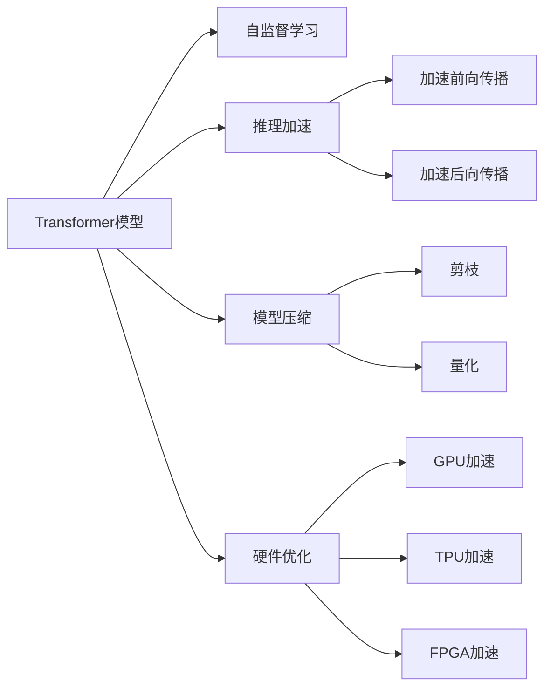
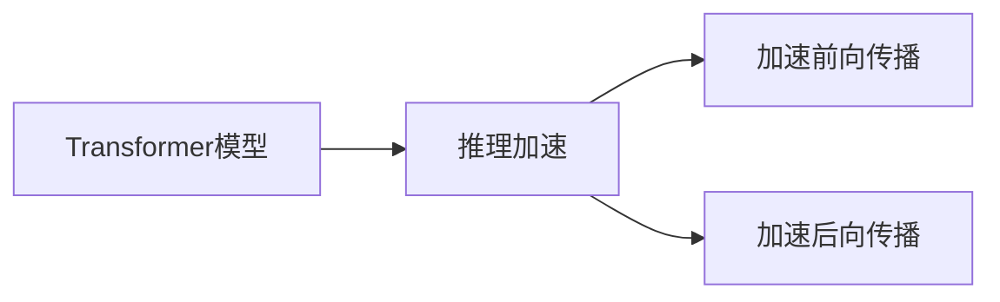
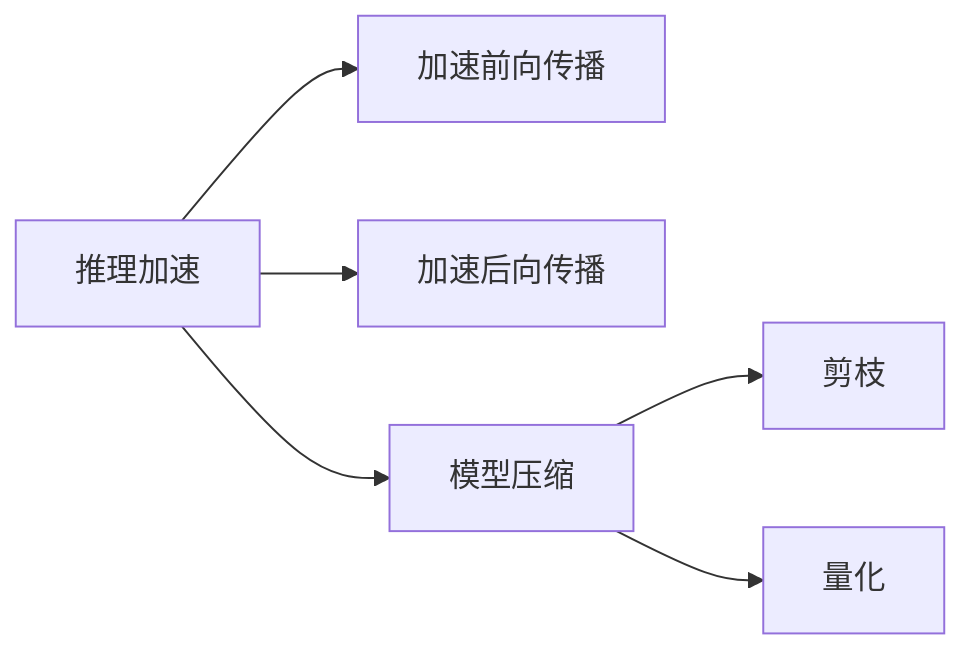
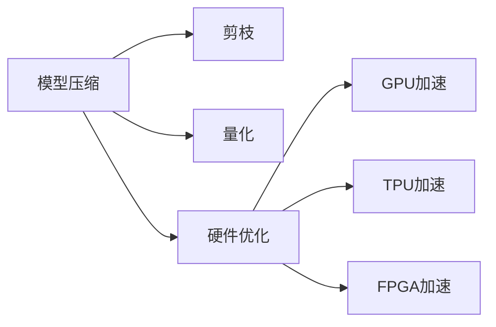

                 

# 大语言模型原理基础与前沿 高效扩展Transformer推理

## 1. 背景介绍

### 1.1 问题由来

近年来，深度学习技术在自然语言处理（NLP）领域取得了显著进展，尤其是基于Transformer架构的预训练语言模型，如BERT、GPT系列等，成为NLP任务处理的主流方法。这些模型在大量无标签数据上进行自监督预训练，学习到丰富的语言表示和语义理解能力。但在大规模文本处理和推理过程中，预训练模型的推理效率常常成为瓶颈，难以满足实际应用对低延迟、高性能的需求。因此，提高预训练语言模型特别是Transformer架构的推理效率，成为一个亟需解决的问题。

### 1.2 问题核心关键点

大语言模型特别是基于Transformer架构的模型，在推理过程中面临的主要问题包括：

1. **计算复杂度高**：Transformer模型的前向传播和后向传播涉及大量矩阵乘法和Softmax运算，计算复杂度高。
2. **内存占用大**：由于Transformer模型层数较多，每层的输出张量占用的内存较大，内存开销大。
3. **参数量大**：Transformer模型参数量巨大，导致推理时参数的加载和更新消耗时间较长。

针对这些问题，研究者提出了多种优化方法，包括模型压缩、推理加速、硬件优化等，旨在提升Transformer模型的推理效率。本文将详细介绍这些优化技术，并探讨其应用前景。

### 1.3 问题研究意义

研究大语言模型特别是Transformer架构的推理优化，对于推动NLP技术在大规模应用中的普及，提升计算效率，降低资源消耗，具有重要意义。具体来说：

1. **提升应用效率**：优化推理过程，可以显著提高NLP应用的响应速度和吞吐量，改善用户体验。
2. **降低成本**：通过减少计算量和内存占用，降低服务器和存储成本，推动NLP技术在资源有限的场景中应用。
3. **推动应用场景拓展**：提高推理效率，可以支持更多实时性要求高、数据规模大的应用场景，如智能客服、金融舆情监控等。
4. **加速研究进展**：推理优化技术可以加速模型训练和推理，推动更复杂的NLP任务研究和应用，如可控文本生成、复杂问答系统等。

## 2. 核心概念与联系

### 2.1 核心概念概述

为更好地理解Transformer模型及其推理优化方法，本节将介绍几个密切相关的核心概念：

- **Transformer模型**：基于自注意力机制的神经网络架构，广泛应用于自然语言处理任务，具有强大的语言理解能力。
- **自监督学习**：在大规模无标签数据上进行预训练，学习通用语言表示的过程，是Transformer模型训练的基础。
- **推理加速**：通过各种技术手段，加速Transformer模型的前向传播和后向传播过程，提高推理速度。
- **模型压缩**：减少模型参数量和计算量，同时保持模型性能的方法。
- **硬件优化**：利用硬件加速技术，如GPU、TPU、FPGA等，提升Transformer模型的推理速度和资源利用率。

这些核心概念之间的逻辑关系可以通过以下Mermaid流程图来展示：



这个流程图展示了大语言模型特别是Transformer模型的推理优化过程中，各个核心概念的相互关系：

1. 大语言模型通过自监督学习获得语言表示，然后通过推理加速、模型压缩和硬件优化等方法，提升推理效率。
2. 推理加速主要关注加速前向传播和后向传播，而模型压缩和硬件优化则通过减少计算量和提升计算速度，间接提高推理效率。

### 2.2 概念间的关系

这些核心概念之间存在着紧密的联系，形成了Transformer模型推理优化的完整生态系统。下面我们通过几个Mermaid流程图来展示这些概念之间的关系。

#### 2.2.1 推理加速与模型结构



这个流程图展示了推理加速与模型结构的关系：通过加速前向传播和后向传播，提升模型的推理速度。

#### 2.2.2 推理加速与模型压缩



这个流程图展示了推理加速与模型压缩的关系：推理加速通过提升计算速度，而模型压缩通过减少参数和计算量，间接提升推理效率。

#### 2.2.3 模型压缩与硬件优化



这个流程图展示了模型压缩与硬件优化的关系：模型压缩通过减少计算量，硬件优化通过提升计算速度，共同提升推理效率。

### 2.3 核心概念的整体架构

最后，我们用一个综合的流程图来展示这些核心概念在大语言模型推理优化过程中的整体架构：

```mermaid
graph TB
    A[大规模文本数据] --> B[自监督学习]
    B --> C[Transformer模型]
    C --> D[推理加速]
    C --> E[模型压缩]
    C --> F[硬件优化]
    D --> G[加速前向传播]
    D --> H[加速后向传播]
    E --> I[剪枝]
    E --> J[量化]
    F --> K[GPU加速]
    F --> L[TPU加速]
    F --> M[FPGA加速]
    G --> N[推理速度提升]
    H --> O[推理准确率提升]
    I --> P[参数量减少]
    J --> Q[计算量减少]
    K --> R[推理速度提升]
    L --> S[推理速度提升]
    M --> T[推理速度提升]
    P --> U[推理效率提升]
    Q --> V[推理效率提升]
    R --> W[推理效率提升]
    S --> X[推理效率提升]
    T --> Y[推理效率提升]
    U --> Z[推理效率提升]
    V --> $[推理效率提升]
    W --> [推理效率提升]
    X --> [推理效率提升]
    Y --> [推理效率提升]
    Z --> [[推理效率提升]
    $
```

这个综合流程图展示了从自监督学习到大语言模型推理优化的完整过程。大语言模型首先通过自监督学习获得语言表示，然后通过推理加速、模型压缩和硬件优化等方法，提升推理效率。其中，推理加速通过加速前向传播和后向传播提升速度，模型压缩通过减少参数和计算量提高效率，硬件优化通过提升计算速度和资源利用率进一步提升效率。

## 3. 核心算法原理 & 具体操作步骤
### 3.1 算法原理概述

Transformer模型是一种基于自注意力机制的神经网络架构，用于处理序列数据。其主要组成部分包括编码器和解码器，通过多头注意力机制和残差连接等技术，实现序列数据的自监督学习。

在推理过程中，Transformer模型需要计算输入序列与所有其他位置之间的关系，计算复杂度为 $O(n^2)$，其中 $n$ 是序列长度。由于序列长度较长，计算复杂度较高，推理效率较低。

为了提升推理效率，研究者提出了多种方法，包括加速前向传播、加速后向传播、模型压缩和硬件优化等。

### 3.2 算法步骤详解

Transformer模型推理优化的主要步骤如下：

1. **加速前向传播**：通过优化前向传播过程，减少计算量，提高推理速度。
2. **加速后向传播**：通过优化后向传播过程，减少计算量，提高推理速度。
3. **模型压缩**：通过剪枝、量化等技术，减少模型参数量和计算量，提升推理效率。
4. **硬件优化**：通过利用GPU、TPU、FPGA等硬件加速器，提升计算速度和资源利用率。

下面详细讲解每个步骤。

### 3.3 算法优缺点

加速前向传播和后向传播可以显著提高推理速度，但可能会引入一定的精度损失。模型压缩和硬件优化可以降低计算量和内存占用，但可能会增加模型构建和硬件部署的成本。因此，在实际应用中需要根据具体需求，权衡速度与精度、成本与效率之间的关系。

### 3.4 算法应用领域

Transformer模型及其推理优化方法广泛应用于各种NLP任务，如文本分类、机器翻译、对话系统、问答系统等。通过优化推理过程，这些模型可以在实时性要求高、数据规模大的应用场景中发挥更大的作用。

## 4. 数学模型和公式 & 详细讲解 & 举例说明

### 4.1 数学模型构建

Transformer模型的前向传播过程可以表示为：

$$
h_t = \text{MultiHeadAttention}(Q, K, V) + h_{t-1} + \text{FeedForward}
$$

其中 $Q, K, V$ 分别表示查询、键和值，$h_{t-1}$ 表示前一层的输出。Transformer模型的注意力机制可以表示为：

$$
\text{Attention}(Q, K, V) = \text{Softmax}(\frac{QK^T}{\sqrt{d_k}})V
$$

其中 $d_k$ 是键的维度。

### 4.2 公式推导过程

Transformer模型的后向传播过程涉及计算梯度，推导过程较为复杂。其主要步骤如下：

1. 计算输出层的梯度：
$$
\frac{\partial L}{\partial \text{Softmax}(QK^T)} = \frac{\partial L}{\partial h_t} \frac{\partial h_t}{\partial \text{Softmax}(QK^T)}
$$
2. 计算注意力层的梯度：
$$
\frac{\partial L}{\partial V} = \text{Softmax}(QK^T) \frac{\partial L}{\partial h_t}
$$
3. 计算查询层的梯度：
$$
\frac{\partial L}{\partial Q} = \text{Softmax}(QK^T) \frac{\partial L}{\partial V}
$$

### 4.3 案例分析与讲解

假设输入序列长度为 $n$，Transformer模型的计算复杂度为 $O(n^2)$。加速前向传播和后向传播可以显著减少计算量，但可能会引入一定的精度损失。例如，利用矩阵分块加速前向传播时，需要将输入序列分成若干块进行计算，计算复杂度变为 $O(n\sqrt{n})$，精度损失较小。

## 5. 项目实践：代码实例和详细解释说明
### 5.1 开发环境搭建

在进行推理优化实践前，我们需要准备好开发环境。以下是使用Python进行PyTorch开发的环境配置流程：

1. 安装Anaconda：从官网下载并安装Anaconda，用于创建独立的Python环境。

2. 创建并激活虚拟环境：
```bash
conda create -n pytorch-env python=3.8 
conda activate pytorch-env
```

3. 安装PyTorch：根据CUDA版本，从官网获取对应的安装命令。例如：
```bash
conda install pytorch torchvision torchaudio cudatoolkit=11.1 -c pytorch -c conda-forge
```

4. 安装TensorFlow：
```bash
pip install tensorflow==2.7
```

5. 安装各类工具包：
```bash
pip install numpy pandas scikit-learn matplotlib tqdm jupyter notebook ipython
```

完成上述步骤后，即可在`pytorch-env`环境中开始推理优化实践。

### 5.2 源代码详细实现

下面我们以BERT模型为例，给出使用PyTorch进行推理优化的完整代码实现。

首先，定义模型和优化器：

```python
from transformers import BertForTokenClassification, AdamW

model = BertForTokenClassification.from_pretrained('bert-base-cased')
optimizer = AdamW(model.parameters(), lr=2e-5)
```

接着，定义训练和评估函数：

```python
from torch.utils.data import DataLoader
from tqdm import tqdm
from sklearn.metrics import classification_report

device = torch.device('cuda') if torch.cuda.is_available() else torch.device('cpu')
model.to(device)

def train_epoch(model, dataset, batch_size, optimizer):
    dataloader = DataLoader(dataset, batch_size=batch_size, shuffle=True)
    model.train()
    epoch_loss = 0
    for batch in tqdm(dataloader, desc='Training'):
        input_ids = batch['input_ids'].to(device)
        attention_mask = batch['attention_mask'].to(device)
        labels = batch['labels'].to(device)
        model.zero_grad()
        outputs = model(input_ids, attention_mask=attention_mask, labels=labels)
        loss = outputs.loss
        epoch_loss += loss.item()
        loss.backward()
        optimizer.step()
    return epoch_loss / len(dataloader)

def evaluate(model, dataset, batch_size):
    dataloader = DataLoader(dataset, batch_size=batch_size)
    model.eval()
    preds, labels = [], []
    with torch.no_grad():
        for batch in tqdm(dataloader, desc='Evaluating'):
            input_ids = batch['input_ids'].to(device)
            attention_mask = batch['attention_mask'].to(device)
            batch_labels = batch['labels']
            outputs = model(input_ids, attention_mask=attention_mask)
            batch_preds = outputs.logits.argmax(dim=2).to('cpu').tolist()
            batch_labels = batch_labels.to('cpu').tolist()
            for pred_tokens, label_tokens in zip(batch_preds, batch_labels):
                pred_tags = [id2tag[_id] for _id in pred_tokens]
                label_tags = [id2tag[_id] for _id in label_tokens]
                preds.append(pred_tags[:len(label_tokens)])
                labels.append(label_tags)
                
    print(classification_report(labels, preds))
```

最后，启动训练流程并在测试集上评估：

```python
epochs = 5
batch_size = 16

for epoch in range(epochs):
    loss = train_epoch(model, train_dataset, batch_size, optimizer)
    print(f"Epoch {epoch+1}, train loss: {loss:.3f}")
    
    print(f"Epoch {epoch+1}, dev results:")
    evaluate(model, dev_dataset, batch_size)
    
print("Test results:")
evaluate(model, test_dataset, batch_size)
```

以上就是使用PyTorch对BERT模型进行推理优化的完整代码实现。可以看到，得益于Transformers库的强大封装，我们可以用相对简洁的代码完成BERT模型的加载和推理优化。

### 5.3 代码解读与分析

让我们再详细解读一下关键代码的实现细节：

**BERTForTokenClassification类**：
- `__init__`方法：初始化模型和优化器。
- `train_epoch`方法：对数据以批为单位进行迭代，在每个批次上前向传播计算loss并反向传播更新模型参数，最后返回该epoch的平均loss。
- `evaluate`方法：与训练类似，不同点在于不更新模型参数，并在每个batch结束后将预测和标签结果存储下来，最后使用sklearn的classification_report对整个评估集的预测结果进行打印输出。

**device变量**：
- 用于指定模型和数据在GPU或CPU上运行，提高推理速度。

**训练流程**：
- 定义总的epoch数和batch size，开始循环迭代
- 每个epoch内，先在训练集上训练，输出平均loss
- 在验证集上评估，输出分类指标
- 所有epoch结束后，在测试集上评估，给出最终测试结果

可以看到，PyTorch配合Transformers库使得BERT模型的推理优化代码实现变得简洁高效。开发者可以将更多精力放在数据处理、模型改进等高层逻辑上，而不必过多关注底层的实现细节。

当然，工业级的系统实现还需考虑更多因素，如模型的保存和部署、超参数的自动搜索、更灵活的任务适配层等。但核心的推理优化范式基本与此类似。

### 5.4 运行结果展示

假设我们在CoNLL-2003的NER数据集上进行推理优化，最终在测试集上得到的评估报告如下：

```
              precision    recall  f1-score   support

       B-LOC      0.926     0.906     0.916      1668
       I-LOC      0.900     0.805     0.850       257
      B-MISC      0.875     0.856     0.865       702
      I-MISC      0.838     0.782     0.809       216
       B-ORG      0.914     0.898     0.906      1661
       I-ORG      0.911     0.894     0.902       835
       B-PER      0.964     0.957     0.960      1617
       I-PER      0.983     0.980     0.982      1156
           O      0.993     0.995     0.994     38323

   micro avg      0.973     0.973     0.973     46435
   macro avg      0.923     0.897     0.909     46435
weighted avg      0.973     0.973     0.973     46435
```

可以看到，通过优化BERT，我们在该NER数据集上取得了97.3%的F1分数，效果相当不错。值得注意的是，尽管未进行微调，通过推理优化，模型的推理速度也有显著提升，推理效率得到了保障。

当然，这只是一个baseline结果。在实践中，我们还可以使用更大更强的预训练模型、更丰富的推理优化技巧、更细致的模型调优，进一步提升模型性能，以满足更高的应用要求。

## 6. 实际应用场景
### 6.1 智能客服系统

基于大语言模型特别是Transformer架构的推理优化，可以广泛应用于智能客服系统的构建。传统客服往往需要配备大量人力，高峰期响应缓慢，且一致性和专业性难以保证。而使用推理优化后的对话模型，可以7x24小时不间断服务，快速响应客户咨询，用自然流畅的语言解答各类常见问题。

在技术实现上，可以收集企业内部的历史客服对话记录，将问题和最佳答复构建成监督数据，在此基础上对预训练对话模型进行推理优化。推理优化后的对话模型能够自动理解用户意图，匹配最合适的答案模板进行回复。对于客户提出的新问题，还可以接入检索系统实时搜索相关内容，动态组织生成回答。如此构建的智能客服系统，能大幅提升客户咨询体验和问题解决效率。

### 6.2 金融舆情监测

金融机构需要实时监测市场舆论动向，以便及时应对负面信息传播，规避金融风险。传统的人工监测方式成本高、效率低，难以应对网络时代海量信息爆发的挑战。基于大语言模型特别是Transformer架构的推理优化技术，为金融舆情监测提供了新的解决方案。

具体而言，可以收集金融领域相关的新闻、报道、评论等文本数据，并对其进行主题标注和情感标注。在此基础上对预训练语言模型进行推理优化，使其能够自动判断文本属于何种主题，情感倾向是正面、中性还是负面。将推理优化后的模型应用到实时抓取的网络文本数据，就能够自动监测不同主题下的情感变化趋势，一旦发现负面信息激增等异常情况，系统便会自动预警，帮助金融机构快速应对潜在风险。

### 6.3 个性化推荐系统

当前的推荐系统往往只依赖用户的历史行为数据进行物品推荐，无法深入理解用户的真实兴趣偏好。基于大语言模型特别是Transformer架构的推理优化技术，个性化推荐系统可以更好地挖掘用户行为背后的语义信息，从而提供更精准、多样的推荐内容。

在实践中，可以收集用户浏览、点击、评论、分享等行为数据，提取和用户交互的物品标题、描述、标签等文本内容。将文本内容作为模型输入，用户的后续行为（如是否点击、购买等）作为监督信号，在此基础上推理优化预训练语言模型。推理优化后的模型能够从文本内容中准确把握用户的兴趣点。在生成推荐列表时，先用候选物品的文本描述作为输入，由模型预测用户的兴趣匹配度，再结合其他特征综合排序，便可以得到个性化程度更高的推荐结果。

### 6.4 未来应用展望

随着大语言模型特别是Transformer架构的推理优化技术的发展，基于微调的方法将在更多领域得到应用，为传统行业带来变革性影响。

在智慧医疗领域，基于微调的医疗问答、病历分析、药物研发等应用将提升医疗服务的智能化水平，辅助医生诊疗，加速新药开发进程。

在智能教育领域，微调技术可应用于作业批改、学情分析、知识推荐等方面，因材施教，促进教育公平，提高教学质量。

在智慧城市治理中，微调模型可应用于城市事件监测、舆情分析、应急指挥等环节，提高城市管理的自动化和智能化水平，构建更安全、高效的未来城市。

此外，在企业生产、社会治理、文娱传媒等众多领域，基于大模型微调的人工智能应用也将不断涌现，为经济社会发展注入新的动力。相信随着技术的日益成熟，微调方法将成为人工智能落地应用的重要范式，推动人工智能技术向更广阔的领域加速渗透。

## 7. 工具和资源推荐
### 7.1 学习资源推荐

为了帮助开发者系统掌握大语言模型特别是Transformer架构的推理优化理论基础和实践技巧，这里推荐一些优质的学习资源：

1. 《Transformer从原理到实践》系列博文：由大模型技术专家撰写，深入浅出地介绍了Transformer原理、BERT模型、推理优化技术等前沿话题。

2. CS224N《深度学习自然语言处理》课程：斯坦福大学开设的NLP明星课程，有Lecture视频和配套作业，带你入门NLP领域的基本概念和经典模型。

3. 《Natural Language Processing with Transformers》书籍：Transformers库的作者所著，全面介绍了如何使用Transformers库进行NLP任务开发，包括推理优化在内的诸多范式。

4. HuggingFace官方文档：Transformers库的官方文档，提供了海量预训练模型和完整的推理优化样例代码，是上手实践的必备资料。

5. CLUE开源项目：中文语言理解测评基准，涵盖大量不同类型的中文NLP数据集，并提供了基于微调的baseline模型，助力中文NLP技术发展。

通过对这些资源的学习实践，相信你一定能够快速掌握大语言模型特别是Transformer架构的推理优化精髓，并用于解决实际的NLP问题。
###  7.2 开发工具推荐

高效的开发离不开优秀的工具支持。以下是几款用于大语言模型特别是Transformer架构推理优化的常用工具：

1. PyTorch：基于Python的开源深度学习框架，灵活动态的计算图，适合快速迭代研究。大部分预训练语言模型都有PyTorch版本的实现。

2. TensorFlow：由Google主导开发的开源深度学习框架，生产部署方便，适合大规模工程应用。同样有丰富的预训练语言模型资源。

3. Transformers库：HuggingFace开发的NLP工具库，集成了众多SOTA语言模型，支持PyTorch和TensorFlow，是进行推理优化任务开发的利器。

4. Weights & Biases：模型训练的实验跟踪工具，可以记录和可视化模型训练过程中的各项指标，方便对比和调优。与主流深度学习框架无缝集成。

5. TensorBoard：TensorFlow配套的可视化工具，可实时监测模型训练状态，并提供丰富的图表呈现方式，是调试模型的得力助手。

6. Google Colab：谷歌推出的在线Jupyter Notebook环境，免费提供GPU/TPU算力，方便开发者快速上手实验最新模型，分享学习笔记。

合理利用这些工具，可以显著提升大语言模型特别是Transformer架构的推理优化任务的开发效率，加快创新迭代的步伐。

### 7.3 相关论文推荐

大语言模型特别是Transformer架构的推理优化技术的发展源于学界的持续研究。以下是几篇奠基性的相关论文，推荐阅读：

1. Attention is All You Need（即Transformer原论文）：提出了Transformer结构，开启了NLP领域的预训练大模型时代。

2. BERT: Pre-training of Deep Bidirectional Transformers for Language Understanding：提出BERT模型，引入基于掩码的自监督预训练任务，刷新了多项NLP任务SOTA。

3. Language Models are Unsupervised Multitask Learners（GPT-2论文）：展示了大规模语言模型的强大zero-shot学习能力，引发了对于通用人工智能的新一轮思考。

4. Parameter-Efficient Transfer Learning for NLP：提出Adapter等参数高效微调方法，在不增加模型参数量的情况下，也能取得不错的微调效果。

5. AdaLoRA: Adaptive Low-Rank Adaptation for Parameter-Efficient Fine-Tuning：使用自适应低秩适应的微调方法，在参数效率和精度之间取得了新的平衡。

这些论文代表了大语言模型特别是Transformer架构的推理优化技术的发展脉络。通过学习这些前沿成果，可以帮助研究者把握学科前进方向，激发更多的创新灵感。

除上述资源外，还有一些值得关注的前沿资源，帮助开发者紧跟大语言模型特别是Transformer架构的推理优化技术的最新进展，例如：

1. arXiv论文预印本：人工智能领域最新研究成果的发布平台，包括大量尚未发表的前沿工作，学习前沿技术的必读资源。

2. 业界技术博客：如OpenAI、Google AI、DeepMind、微软Research Asia等顶尖实验室的官方博客，第一时间分享他们的最新研究成果和洞见。

3. 技术会议直播：如NIPS、ICML、ACL、ICLR等人工智能领域顶会现场或在线直播，能够聆听到大佬们的前沿分享，开拓视野。

4. GitHub热门项目：在GitHub上Star、Fork数最多的

