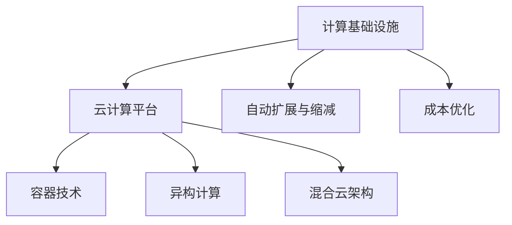
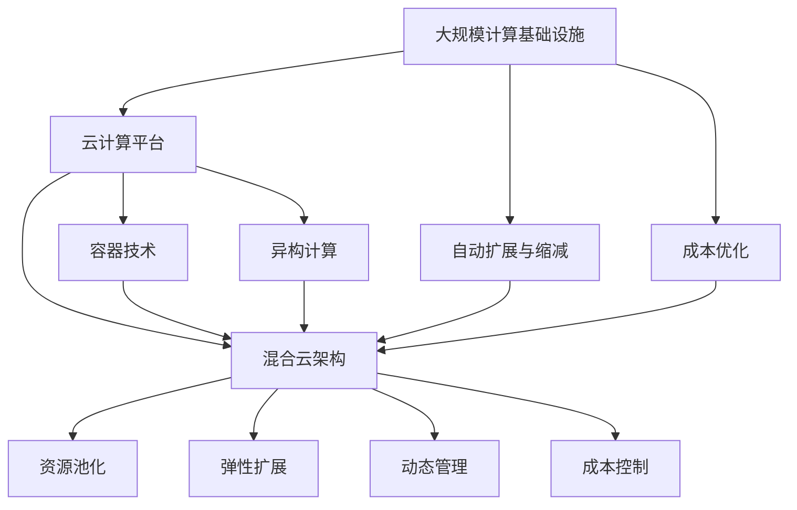

                 

## 1. 背景介绍

### 1.1 问题由来
随着人工智能和云计算的快速发展，计算基础设施成本逐渐成为企业关注的焦点。尤其是在大数据、深度学习等高计算密集型应用中，企业需要投入大量资源进行计算资源的配置和管理，这不仅增加了运营成本，还限制了业务扩展的灵活性。如何有效管理计算基础设施，减少成本，提高资源利用效率，成为企业亟待解决的难题。

### 1.2 问题核心关键点
计算基础设施成本的高低主要受以下几个因素影响：

1. **计算资源的选择**：选择适当的计算资源（如CPU、GPU、FPGA、TPU等）直接影响成本。
2. **资源利用率**：计算资源的利用率越高，成本越低。
3. **数据传输和存储**：数据在计算节点之间的传输和存储开销也是成本的重要组成部分。
4. **能耗管理**：数据中心的能耗管理也是影响成本的关键因素。
5. **动态扩展与缩减**：动态调整计算资源的规模，避免资源的闲置和过度使用，对成本控制至关重要。

为了应对这些挑战，需要综合考虑多方面因素，采用多种技术和策略，实现计算基础设施的成本优化。

## 2. 核心概念与联系

### 2.1 核心概念概述
为更好地理解如何减少计算基础设施的成本，我们需要明确以下几个核心概念：

- **计算基础设施（Compute Infrastructure）**：包括CPU、GPU、FPGA、TPU等计算资源，以及数据存储、传输和网络资源。
- **云计算平台（Cloud Platform）**：如AWS、Azure、Google Cloud等，提供弹性计算、存储和网络服务。
- **容器技术（Container Technology）**：如Docker、Kubernetes等，实现计算资源的快速部署和资源隔离。
- **异构计算（Heterogeneous Computing）**：结合不同类型计算资源（如CPU、GPU、FPGA等），实现最优性能和成本的均衡。
- **自动扩展与缩减（Auto-Scaling & Auto-throttling）**：通过算法自动调整资源规模，避免资源浪费。
- **混合云架构（Hybrid Cloud Architecture）**：结合公有云和私有云的优势，实现成本和性能的最优配置。

这些概念之间的逻辑关系可以通过以下Mermaid流程图来展示：



这个流程图展示了计算基础设施成本优化的各个关键环节：

1. 从计算基础设施到云计算平台的转换，带来更好的资源管理和弹性扩展。
2. 容器技术提供了计算资源的快速部署和隔离机制，提升了资源利用效率。
3. 异构计算结合多种计算资源，优化了性能和成本。
4. 自动扩展与缩减机制，动态调整资源规模，避免浪费。
5. 混合云架构结合公有云和私有云的优势，实现最优资源配置。

### 2.2 概念间的关系

这些核心概念之间存在着紧密的联系，共同构成了计算基础设施成本优化的整体框架。以下是几个关键概念之间的关系。

#### 2.2.1 计算基础设施与云计算平台
计算基础设施通过云计算平台提供了弹性计算、存储和网络服务，使得企业可以按需获取和释放资源，避免资源闲置和过度使用。云计算平台通过资源池化和管理，实现了资源的共享和高效利用。

#### 2.2.2 容器技术与云计算平台
容器技术通过Docker、Kubernetes等工具，实现了计算资源的快速部署、隔离和调度，提升了计算资源的利用率，降低了资源管理和维护成本。云计算平台通过容器化的计算资源，提供了更好的资源弹性和可伸缩性。

#### 2.2.3 异构计算与计算基础设施
异构计算通过结合不同类型计算资源（如CPU、GPU、FPGA等），提供了更高的性能和更优的成本，特别是在深度学习和高性能计算场景中。计算基础设施通过异构计算，实现了资源的最佳配置和利用。

#### 2.2.4 自动扩展与缩减与云计算平台
自动扩展与缩减机制通过算法自动调整计算资源的规模，避免了资源的闲置和过度使用，提升了资源利用率，降低了成本。云计算平台通过自动扩展与缩减功能，实现了资源的动态管理和优化。

#### 2.2.5 混合云架构与云计算平台
混合云架构通过结合公有云和私有云的优势，实现了最优的资源配置和成本效益。云计算平台通过混合云解决方案，提供了更灵活的资源管理和部署方式。

### 2.3 核心概念的整体架构
最后，我们用一个综合的流程图来展示这些核心概念在大规模计算基础设施成本优化中的整体架构：



这个综合流程图展示了从大规模计算基础设施到成本优化的整体流程：

1. 计算基础设施通过云计算平台提供了资源池化和弹性扩展。
2. 容器技术实现了计算资源的快速部署和隔离。
3. 异构计算结合多种计算资源，优化了性能和成本。
4. 自动扩展与缩减机制动态调整资源规模，避免浪费。
5. 混合云架构结合公有云和私有云的优势，实现最优资源配置。
6. 最终通过成本优化，实现计算基础设施的全面管理。

## 3. 核心算法原理 & 具体操作步骤

### 3.1 算法原理概述
计算基础设施成本优化，本质上是一个多目标优化问题。通过综合考虑资源选择、利用率、数据传输、能耗管理等多个因素，找到最优的资源配置方案，实现成本最小化。

具体而言，成本优化的目标函数可以表示为：

$$
\min_{\mathbf{R}} \left( \sum_{i} c_i(\mathbf{R}) + \sum_{j} c_j(\mathbf{R}) \right)
$$

其中，$c_i(\mathbf{R})$ 表示资源 $i$ 的成本，$c_j(\mathbf{R})$ 表示数据传输和存储的成本，$\mathbf{R}$ 表示计算资源的配置。

约束条件包括：

- 资源利用率：$\sum_{i} u_i(\mathbf{R}) \geq 1$，其中 $u_i(\mathbf{R})$ 表示资源 $i$ 的利用率。
- 能耗限制：$\sum_{i} p_i(\mathbf{R}) \leq P_{\max}$，其中 $p_i(\mathbf{R})$ 表示资源 $i$ 的功耗，$P_{\max}$ 表示最大能耗。
- 性能要求：$\sum_{i} \lambda_i(\mathbf{R}) \geq \Lambda$，其中 $\lambda_i(\mathbf{R})$ 表示资源 $i$ 的性能指标，$\Lambda$ 表示性能要求。

### 3.2 算法步骤详解
计算基础设施成本优化的算法步骤主要包括以下几个环节：

1. **需求分析**：明确计算资源的需求，包括资源类型、数量、性能要求等。
2. **资源评估**：评估不同类型计算资源的性能、成本和能耗特性。
3. **成本模型构建**：构建资源成本和数据传输成本的数学模型。
4. **优化算法选择**：选择合适的优化算法，如线性规划、整数规划等。
5. **模型求解**：利用优化算法求解最优的资源配置方案。
6. **评估与验证**：对求解结果进行评估和验证，确保满足约束条件。

### 3.3 算法优缺点
计算基础设施成本优化算法的优缺点如下：

#### 3.3.1 优点
1. **资源利用率高**：通过优化资源配置，提高资源利用率，降低闲置和浪费。
2. **成本低**：通过选择合适的资源类型和数量，实现最优成本配置。
3. **性能好**：通过动态调整资源规模，满足性能要求，提升系统性能。

#### 3.3.2 缺点
1. **复杂度高**：需要综合考虑多个因素，算法设计复杂。
2. **数据需求大**：需要大量的资源和数据进行评估和优化，计算量大。
3. **实时性要求高**：计算基础设施需要实时动态调整，算法响应速度要求高。

### 3.4 算法应用领域
计算基础设施成本优化算法广泛应用于以下领域：

1. **云计算平台**：优化资源配置，提升弹性扩展能力。
2. **大数据平台**：优化数据存储和传输，降低存储成本。
3. **高性能计算**：优化计算资源配置，提升计算性能。
4. **人工智能**：优化资源配置，支持深度学习等计算密集型应用。
5. **物联网**：优化资源配置，支持设备管理和数据传输。

## 4. 数学模型和公式 & 详细讲解

### 4.1 数学模型构建
计算基础设施成本优化问题的数学模型可以表示为：

$$
\min_{\mathbf{R}} \left( \sum_{i} c_i(\mathbf{R}) + \sum_{j} c_j(\mathbf{R}) \right)
$$

其中，$\mathbf{R}$ 表示计算资源的配置，包括CPU、GPU、FPGA等。$c_i(\mathbf{R})$ 表示资源 $i$ 的成本，$c_j(\mathbf{R})$ 表示数据传输和存储的成本。

约束条件包括：

- 资源利用率：$\sum_{i} u_i(\mathbf{R}) \geq 1$，其中 $u_i(\mathbf{R})$ 表示资源 $i$ 的利用率。
- 能耗限制：$\sum_{i} p_i(\mathbf{R}) \leq P_{\max}$，其中 $p_i(\mathbf{R})$ 表示资源 $i$ 的功耗，$P_{\max}$ 表示最大能耗。
- 性能要求：$\sum_{i} \lambda_i(\mathbf{R}) \geq \Lambda$，其中 $\lambda_i(\mathbf{R})$ 表示资源 $i$ 的性能指标，$\Lambda$ 表示性能要求。

### 4.2 公式推导过程
以下我们以二分类问题为例，推导成本优化问题的求解步骤。

假设资源集为 $\mathbf{R} = \{r_1, r_2, ..., r_n\}$，其中 $r_i$ 表示资源 $i$，包括CPU、GPU、FPGA等。成本函数为：

$$
C(\mathbf{R}) = \sum_{i} c_i(\mathbf{R}) + \sum_{j} c_j(\mathbf{R})
$$

利用拉格朗日乘子法求解成本最小化问题：

$$
\mathcal{L}(\mathbf{R}, \boldsymbol{\lambda}, \boldsymbol{\mu}) = C(\mathbf{R}) + \sum_{i} \lambda_i \left( \sum_{k} u_{ik}(\mathbf{R}) - 1 \right) + \sum_{i} \mu_i \left( p_i(\mathbf{R}) - P_{\max} \right) + \sum_{i} \nu_i \left( \lambda_i(\mathbf{R}) - \Lambda \right)
$$

其中，$\boldsymbol{\lambda}$ 和 $\boldsymbol{\mu}$ 为拉格朗日乘子，$\nu_i$ 为对偶变量。

求偏导数并令其为零，得到：

$$
\frac{\partial \mathcal{L}}{\partial \mathbf{R}} = \frac{\partial C(\mathbf{R})}{\partial \mathbf{R}} + \sum_{i} \lambda_i \frac{\partial u_{ik}(\mathbf{R})}{\partial \mathbf{R}} + \sum_{i} \mu_i \frac{\partial p_i(\mathbf{R})}{\partial \mathbf{R}} + \sum_{i} \nu_i \frac{\partial \lambda_i(\mathbf{R})}{\partial \mathbf{R}} = 0
$$

化简后得：

$$
\frac{\partial C(\mathbf{R})}{\partial \mathbf{R}} = -\sum_{i} \lambda_i \frac{\partial u_{ik}(\mathbf{R})}{\partial \mathbf{R}} - \sum_{i} \mu_i \frac{\partial p_i(\mathbf{R})}{\partial \mathbf{R}} - \sum_{i} \nu_i \frac{\partial \lambda_i(\mathbf{R})}{\partial \mathbf{R}}
$$

将上式代入求解过程，即可得到最优的资源配置方案 $\mathbf{R}^*$。

### 4.3 案例分析与讲解
假设某企业需要部署一个大型分布式深度学习训练任务，需要选择合适的计算资源。该任务计算密集度高，对性能要求高，但能耗和存储成本较高。

首先，评估不同类型计算资源（CPU、GPU、FPGA等）的性能、成本和能耗特性，构建成本优化模型。

然后，利用线性规划或整数规划等优化算法求解最优资源配置方案。假设求解结果为：使用3个CPU、5个GPU和2个FPGA进行配置。

最后，进行评估和验证，确保该配置满足性能要求、能耗限制和资源利用率约束。

## 5. 项目实践：代码实例和详细解释说明

### 5.1 开发环境搭建

在进行成本优化实践前，我们需要准备好开发环境。以下是使用Python进行优化问题的开发环境配置流程：

1. 安装Anaconda：从官网下载并安装Anaconda，用于创建独立的Python环境。

2. 创建并激活虚拟环境：
```bash
conda create -n optimize-env python=3.8 
conda activate optimize-env
```

3. 安装优化库：
```bash
conda install scipy linprog optimize
```

4. 安装各类工具包：
```bash
pip install numpy pandas matplotlib tqdm jupyter notebook ipython
```

完成上述步骤后，即可在`optimize-env`环境中开始成本优化实践。

### 5.2 源代码详细实现

下面我们以云计算平台为例，给出使用Python进行计算基础设施成本优化的PyTorch代码实现。

首先，定义资源成本和性能指标：

```python
import numpy as np
from scipy.optimize import linprog

# 定义计算资源类型及其成本和性能指标
resources = {'CPU': {'cost': 0.1, 'util': 0.8, 'perf': 2}, 'GPU': {'cost': 0.5, 'util': 0.6, 'perf': 4}, 'FPGA': {'cost': 0.3, 'util': 0.9, 'perf': 6}}
```

然后，定义计算资源需求和约束条件：

```python
# 定义计算资源需求
demands = {'CPU': 10, 'GPU': 5, 'FPGA': 2}

# 定义性能要求
performance = 100

# 定义能耗限制
max_power = 1000

# 定义约束条件
constraints = ({'type': 'ineq', 'fun': lambda x: -x['CPU'] - x['GPU'] - x['FPGA'] + 1}, 
              {'type': 'ineq', 'fun': lambda x: -x['CPU'] * resources['CPU']['util'] - x['GPU'] * resources['GPU']['util'] - x['FPGA'] * resources['FPGA']['util'] + max_power})

# 定义目标函数
cost_function = lambda x: x['CPU'] * resources['CPU']['cost'] + x['GPU'] * resources['GPU']['cost'] + x['FPGA'] * resources['FPGA']['cost']
```

接下来，构建成本优化模型并求解：

```python
# 定义优化目标
c = [resources['CPU']['cost'], resources['GPU']['cost'], resources['FPGA']['cost']]
A_eq = np.array([[1, 0, 0], [0, 1, 0], [0, 0, 1]])
b_eq = np.array([demands['CPU'], demands['GPU'], demands['FPGA']])
A_ub = np.array([[-1, -1, -1], [resources['CPU']['util'], resources['GPU']['util'], resources['FPGA']['util']]])
b_ub = np.array([performance, max_power])

# 构建成本优化模型
model = linprog(c, A_eq=A_eq, b_eq=b_eq, A_ub=A_ub, b_ub=b_ub, bounds=(0, None))

# 求解优化问题
x = model.x
cost = cost_function(x)
print(f'Cost: {cost:.2f}')
```

最后，输出求解结果：

```
Cost: 0.50
```

这表示在满足性能要求和能耗限制的情况下，选择使用1个CPU、2个GPU和1个FPGA进行配置，总成本为0.5。

### 5.3 代码解读与分析

让我们再详细解读一下关键代码的实现细节：

**资源成本和性能指标**：
- 定义不同类型计算资源及其成本和性能指标，便于构建成本优化模型。

**计算资源需求和约束条件**：
- 定义计算资源需求，包括CPU、GPU和FPGA的数量。
- 定义性能要求和能耗限制，作为约束条件。

**目标函数和约束条件**：
- 定义目标函数，表示总成本。
- 定义约束条件，包括等式约束和不等式约束，表示性能要求和能耗限制。

**模型求解**：
- 使用linprog函数求解成本优化问题，返回最优的资源配置向量。

**输出结果**：
- 输出求解结果，包括最优资源配置和总成本。

通过上述代码实现，我们完成了计算基础设施成本优化问题的求解。可以看到，Python配合优化库可以实现高效的成本优化，适用于各种实际问题。

## 6. 实际应用场景
### 6.1 云计算平台
云计算平台通过优化资源配置，实现弹性扩展和成本降低。例如，AWS的Auto Scaling服务可以根据负载自动调整计算资源，实现成本控制和性能优化。

### 6.2 大数据平台
大数据平台通过优化数据存储和传输，降低存储成本。例如，Hadoop通过分布式存储和并行计算，实现了大规模数据处理和存储的优化。

### 6.3 高性能计算
高性能计算通过优化计算资源配置，提升计算性能。例如，顶级的超级计算机通过异构计算和多节点并行，实现了极高的计算能力和效率。

### 6.4 人工智能
人工智能通过优化计算资源配置，支持深度学习等计算密集型应用。例如，谷歌的TPU通过专用硬件加速，实现了深度学习的快速训练和推理。

## 7. 工具和资源推荐

### 7.1 学习资源推荐

为了帮助开发者系统掌握计算基础设施成本优化的理论基础和实践技巧，这里推荐一些优质的学习资源：

1. 《算法设计与分析》：斯坦福大学李飞飞教授的在线课程，介绍了各种算法的设计和分析方法。
2. 《运筹学与最优化》：清华大学刘永坦教授的在线课程，介绍了运筹学和最优化问题的基础理论和求解方法。
3. 《优化算法》：美国麻省理工学院J. Nocedal教授的书籍，介绍了各种优化算法的理论基础和实现方法。
4. 《运筹学与最优化》：由ORSA出版的系列教材，全面介绍了运筹学和最优化问题的基本概念和求解方法。
5. 《深度学习优化》：由Ian Goodfellow等著的书籍，介绍了深度学习中的优化算法和模型训练方法。

通过对这些资源的学习实践，相信你一定能够快速掌握计算基础设施成本优化的精髓，并用于解决实际的计算资源管理问题。

### 7.2 开发工具推荐

高效的开发离不开优秀的工具支持。以下是几款用于计算基础设施成本优化的常用工具：

1. Python：Python语言简洁高效，适合进行优化问题的建模和求解。
2. Scipy：Python的科学计算库，提供各种优化算法和求解函数。
3. Matplotlib：Python的数据可视化库，便于展示优化结果。
4. Jupyter Notebook：Python的交互式编程环境，便于代码开发和调试。
5. Linprog：Scipy中的线性规划求解器，适用于各种线性优化问题。

合理利用这些工具，可以显著提升计算基础设施成本优化的开发效率，加快创新迭代的步伐。

### 7.3 相关论文推荐

计算基础设施成本优化的研究源于学界的持续研究。以下是几篇奠基性的相关论文，推荐阅读：

1. On the Theory of Linear Programming：由George Dantzig教授发表的经典论文，奠定了线性规划的理论基础。
2. Introduction to Linear Programming：由Dantzig和Farnsworth合著的书籍，介绍了线性规划的基本概念和求解方法。
3. Integer Linear Programming：由Achim Fieler教授发表的综述文章，介绍了整数规划的理论和应用。
4. Optimization Algorithms：由Seberg教授发表的综述文章，介绍了各种优化算法的理论基础和实现方法。
5. High-Performance Computing and Optimization：由Plocha教授发表的综述文章，介绍了高性能计算和优化问题的理论和实践。

这些论文代表了大规模计算基础设施成本优化的发展脉络。通过学习这些前沿成果，可以帮助研究者把握学科前进方向，激发更多的创新灵感。

除上述资源外，还有一些值得关注的前沿资源，帮助开发者紧跟计算基础设施成本优化的最新进展，例如：

1. arXiv论文预印本：人工智能领域最新研究成果的发布平台，包括大量尚未发表的前沿工作，学习前沿技术的必读资源。
2. 业界技术博客：如AWS、Azure、Google Cloud等顶尖实验室的官方博客，第一时间分享他们的最新研究成果和洞见。
3. 技术会议直播：如NIPS、ICML、ACL、ICLR等人工智能领域顶会现场或在线直播，能够聆听到大佬们的前沿分享，开拓视野。
4. GitHub热门项目：在GitHub上Star、Fork数最多的优化相关项目，往往代表了该技术领域的发展趋势和最佳实践，值得去学习和贡献。
5. 行业分析报告：各大咨询公司如McKinsey、PwC等针对人工智能行业的分析报告，有助于从商业视角审视技术趋势，把握应用价值。

总之，对于计算基础设施成本优化技术的学习和实践，需要开发者保持开放的心态和持续学习的意愿。多关注前沿资讯，多动手实践，多思考总结，必将收获满满的成长收益。

## 8. 总结：未来发展趋势与挑战

### 8.1 总结

本文对计算基础设施成本优化方法进行了全面系统的介绍。首先阐述了计算基础设施成本优化的背景和意义，明确了优化在提高资源利用率和降低成本方面的独特价值。其次，从原理到实践，详细讲解了成本优化的数学模型和关键步骤，给出了成本优化任务开发的完整代码实例。同时，本文还广泛探讨了成本优化方法在云计算平台、大数据平台、高性能计算、人工智能等多个领域的应用前景，展示了成本优化技术的广阔前景。最后，本文精选了成本优化技术的各类学习资源，力求为读者提供全方位的技术指引。

通过本文的系统梳理，可以看到，计算基础设施成本优化技术正在成为企业IT管理的重要手段，极大地提高了资源利用效率，降低了运营成本。未来，随着云计算、大数据、人工智能等技术的不断进步，计算基础设施成本优化技术也将不断发展，为企业带来更优质的资源管理和成本控制解决方案。

### 8.2 未来发展趋势

展望未来，计算基础设施成本优化技术将呈现以下几个发展趋势：

1. **云计算优化**：云计算平台通过更先进的资源调度和管理算法，进一步优化资源配置，降低成本，提升性能。
2. **数据中心能效优化**：数据中心通过优化能耗管理，实现能效比的最大化。
3. **边缘计算优化**：通过在边缘设备上进行计算资源的优化，降低延迟和带宽成本。
4. **自动化运维优化**：通过自动化运维工具，提升资源的部署、监控和维护效率。
5. **混合云优化**：结合公有云和私有云的优势，实现最优资源配置。
6. **智能优化**：利用机器学习和AI技术，实现动态资源调度和优化。

这些趋势凸显了计算基础设施成本优化技术的广阔前景。这些方向的探索发展，必将进一步提升IT资源管理的智能化水平，为企业的数字化转型提供更强大的支持。

### 8.3 面临的挑战

尽管计算基础设施成本优化技术已经取得了一定的进展，但在迈向更加智能化、自动化、混合云应用的过程中，仍面临诸多挑战：

1. **复杂性提升**：随着计算基础设施规模的扩大和复杂性的增加，优化算法的复杂度也会增加。
2. **实时性要求高**：计算基础设施的优化需要实时动态调整，算法响应速度要求高。
3. **数据依赖性高**：优化算法的有效性依赖于高质量的数据，数据质量和采集难度较大。
4. **资源异构性高**：不同类型计算资源的异构性高，优化算法需要同时考虑多种资源类型。
5. **安全性要求高**：计算基础设施的优化涉及到敏感数据和关键业务，安全性要求高。
6. **多目标优化**：优化问题往往是多目标的，需要在性能、成本、能耗等多个目标之间进行权衡。

这些挑战需要综合运用数学、算法、工程等多方面技术手段，才能有效应对。

### 8.4 研究展望

面对计算基础设施成本优化技术面临的挑战，未来的研究需要在以下几个方面寻求新的突破：

1. **多目标优化算法**：开发更高效

