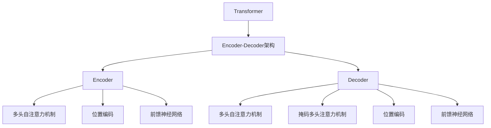

# Transformer原理与代码实战案例讲解

## 1. 背景介绍

### 1.1 问题的由来

在自然语言处理(NLP)和序列到序列(Seq2Seq)建模任务中,长期以来都存在着一个核心问题:如何有效地捕捉输入序列中长程依赖关系。传统的基于循环神经网络(RNN)和长短期记忆网络(LSTM)的模型在处理长序列时存在梯度消失或爆炸的问题,难以很好地捕捉长程依赖关系。

为了解决这一问题,Transformer模型应运而生。Transformer是一种全新的基于自注意力机制(Self-Attention)的神经网络架构,它完全摒弃了RNN和LSTM等循环结构,使用并行计算来捕捉序列中任意两个位置之间的依赖关系,从而有效解决了长程依赖问题。

### 1.2 研究现状

自2017年Transformer模型被提出以来,它在机器翻译、文本生成、语音识别等多个NLP任务上取得了令人瞩目的成绩,并迅速成为NLP领域的主流模型。随后,Transformer的思想也被广泛应用于计算机视觉(CV)、语音处理等其他领域,产生了一系列新的模型,如Vision Transformer、Speech Transformer等。

目前,基于Transformer的预训练语言模型(PLM),如BERT、GPT、XLNet等,已成为NLP领域的核心技术,在各种下游任务中表现出色。此外,Transformer也是构建大型语言模型(如GPT-3)和多模态模型(如DALL-E)的关键组件。

### 1.3 研究意义

深入理解Transformer模型的原理和实现细节,对于掌握当前主流的NLP技术、开发相关应用系统具有重要意义。本文将全面介绍Transformer的核心概念、算法原理、数学模型、代码实现等内容,旨在帮助读者系统地学习和掌握这一里程碑式的模型。

### 1.4 本文结构

本文共分为9个部分:

1. 背景介绍
2. 核心概念与联系
3. 核心算法原理与具体操作步骤
4. 数学模型和公式详细讲解与举例说明
5. 项目实践:代码实例和详细解释说明
6. 实际应用场景
7. 工具和资源推荐
8. 总结:未来发展趋势与挑战
9. 附录:常见问题与解答

## 2. 核心概念与联系

Transformer模型的核心概念包括:

1. **Encoder-Decoder架构**: Transformer采用了经典的Encoder-Decoder架构,用于序列到序列的建模任务,如机器翻译。
2. **多头自注意力机制(Multi-Head Self-Attention)**: 自注意力机制是Transformer的核心,它能够捕捉序列中任意两个位置之间的依赖关系,解决了长程依赖问题。
3. **位置编码(Positional Encoding)**: 由于Transformer没有循环结构,无法像RNN那样自然地捕捉序列的位置信息,因此引入了位置编码来为每个位置赋予独特的位置信息。
4. **前馈神经网络(Feed-Forward Neural Network)**: Transformer在自注意力层之后还引入了前馈神经网络,用于对每个位置的表示进行非线性变换。

在Encoder-Decoder架构中,Encoder和Decoder的结构基本相似,都由多个相同的层组成,每一层包含多头自注意力机制、位置编码和前馈神经网络等组件。不同之处在于,Decoder还引入了掩码多头注意力机制,用于处理解码时的自回归特性。

这些核心概念相互关联、相互作用,共同构建了Transformer的强大建模能力。

## 3. 核心算法原理与具体操作步骤

### 3.1 算法原理概述

Transformer的核心算法原理是**自注意力机制(Self-Attention)**。传统的序列模型(如RNN、LSTM)是按照序列顺序逐个处理每个位置,而自注意力机制则是直接捕捉序列中任意两个位置之间的依赖关系,从而更好地解决了长程依赖问题。

自注意力机制的基本思想是:对于序列中的每个位置,通过与其他所有位置的表示进行注意力加权,得到该位置的新表示。具体来说,给定一个长度为n的序列$X = (x_1, x_2, \dots, x_n)$,自注意力机制会为每个位置$x_i$计算一个注意力权重向量$\alpha_i = (\alpha_{i1}, \alpha_{i2}, \dots, \alpha_{in})$,其中$\alpha_{ij}$表示$x_i$对$x_j$的注意力权重。然后,将注意力权重与序列表示相结合,得到$x_i$的新表示:

$$
x_i' = \sum_{j=1}^{n} \alpha_{ij}(x_j)
$$

通过这种方式,每个位置的表示都融合了序列中其他所有位置的信息,从而能够有效地捕捉长程依赖关系。

### 3.2 算法步骤详解

自注意力机制的具体计算过程可以分为以下几个步骤:

1. **线性投影**: 将输入序列$X$分别通过三个线性投影矩阵$W^Q$、$W^K$和$W^V$进行投影,得到查询(Query)、键(Key)和值(Value)向量序列:

$$
Q = XW^Q, K = XW^K, V = XW^V
$$

2. **计算注意力分数**: 对于每个查询向量$q_i$,计算它与所有键向量$k_j$的点积,得到未缩放的注意力分数:

$$
e_{ij} = q_i^Tk_j
$$

3. **缩放和软最大化**: 将注意力分数缩放后通过软最大化函数(Softmax)计算注意力权重:

$$
\alpha_{ij} = \text{softmax}(e_{ij}/\sqrt{d_k}) = \frac{exp(e_{ij}/\sqrt{d_k})}{\sum_{l=1}^{n}exp(e_{il}/\sqrt{d_k})}
$$

其中,$d_k$是键向量的维度,缩放是为了避免较大的点积导致软最大化函数的梯度较小。

4. **加权求和**: 使用注意力权重对值向量序列进行加权求和,得到每个位置的新表示:

$$
z_i = \sum_{j=1}^{n} \alpha_{ij}(v_j)
$$

5. **多头注意力**: 为了捕捉不同的子空间信息,Transformer使用了多头注意力机制。具体来说,将查询/键/值向量线性投影$h$次,分别计算$h$个注意力表示,然后将它们拼接起来作为最终的注意力表示。

上述步骤描述了标准的缩放点积注意力机制。在Transformer中,还引入了掩码机制,用于处理填充(Padding)和解码时的自回归特性。

### 3.3 算法优缺点

**优点**:

1. **并行计算**: 与RNN不同,自注意力机制可以并行计算序列中所有位置的表示,避免了序列计算的递归特性,提高了计算效率。
2. **长程依赖建模**: 通过直接捕捉任意两个位置之间的依赖关系,有效解决了RNN在长序列上的梯度消失/爆炸问题。
3. **灵活的序列建模**: 自注意力机制可以适用于变长序列,不受序列长度的限制。

**缺点**:

1. **计算复杂度较高**: 标准的自注意力机制的计算复杂度为$O(n^2d)$,其中$n$是序列长度,$d$是表示维度。当序列较长时,计算代价会急剧增加。
2. **缺乏确定的归纳偏置**: 与RNN和CNN不同,Transformer缺乏确定的归纳偏置,需要通过大量数据来学习序列的模式。
3. **位置编码的影响**: 位置编码对模型性能有一定影响,不同的位置编码方式可能会导致性能差异。

### 3.4 算法应用领域

自注意力机制及Transformer模型广泛应用于自然语言处理、计算机视觉、语音处理等序列建模任务,包括但不限于:

- **机器翻译**: Transformer最初就是为机器翻译任务而设计的,在多种语言对上取得了最佳性能。
- **文本生成**: 基于Transformer的语言模型(如GPT)在文本生成、对话系统等任务上表现出色。
- **文本分类**: Transformer可用于文本分类任务,如情感分析、新闻分类等。
- **阅读理解**: Transformer被广泛应用于各种阅读理解任务,如问答系统、事实抽取等。
- **计算机视觉**: Vision Transformer在图像分类、目标检测、图像分割等视觉任务中取得了优异表现。
- **语音处理**: Speech Transformer在语音识别、语音合成等语音任务中也有应用。
- **多模态建模**: Transformer是构建多模态模型(如DALL-E)的关键组件。

## 4. 数学模型和公式详细讲解与举例说明

### 4.1 数学模型构建

我们将自注意力机制的数学模型形式化为:

给定一个长度为$n$的序列$X = (x_1, x_2, \dots, x_n)$,其中$x_i \in \mathbb{R}^{d_x}$是$d_x$维的向量表示。我们希望计算一个新的序列表示$Z = (z_1, z_2, \dots, z_n)$,其中$z_i \in \mathbb{R}^{d_z}$是$d_z$维的向量,融合了$X$中所有位置的信息。

自注意力机制的计算过程可以表示为:

$$
Z = \text{Attention}(Q, K, V)
$$

其中,$Q$、$K$和$V$分别是查询(Query)、键(Key)和值(Value)向量序列,通过线性投影得到:

$$
\begin{aligned}
Q &= XW^Q \
K &= XW^K \
V &= XW^V
\end{aligned}
$$

$W^Q \in \mathbb{R}^{d_x \times d_q}$、$W^K \in \mathbb{R}^{d_x \times d_k}$和$W^V \in \mathbb{R}^{d_x \times d_v}$是可学习的线性投影矩阵。

注意力机制的核心是计算注意力权重矩阵$A \in \mathbb{R}^{n \times n}$,其中$A_{ij}$表示查询向量$q_i$对键向量$k_j$的注意力权重。具体来说:

$$
A_{ij} = \text{softmax}\left(\frac{q_i^Tk_j}{\sqrt{d_k}}\right)
$$

其中,$\sqrt{d_k}$是一个缩放因子,用于避免较大的点积导致软最大化函数的梯度较小。

最后,使用注意力权重矩阵$A$对值向量序列$V$进行加权求和,得到新的序列表示$Z$:

$$
Z = AV
$$

在实际应用中,Transformer通常使用多头注意力机制,即将上述过程重复执行$h$次,每次使用不同的投影矩阵,然后将$h$个注意力表示拼接起来作为最终的注意力表示。

### 4.2 公式推导过程

我们将详细推导自注意力机制中注意力分数和注意力权重的计算公式。

首先,定义查询向量$q_i$和键向量$k_j$的点积为未缩放的注意力分数:

$$
e_{ij} = q_i^Tk_j
$$

为了避免较大的点积导致软最大化函数的梯度较小,我们对注意力分数进行缩放:

$$
\tilde{e}_{ij} = \frac{e_{ij}}{\sqrt{d_k}} = \frac{q_i^Tk_j}{\sqrt{d_k}}
$$

其中,$d_k$是键向量的维度,$\sqrt{d_k}$是缩放因子。

接下来,我们对缩放后的注意力分数应用软最大化函数(Softmax),得到注意力权