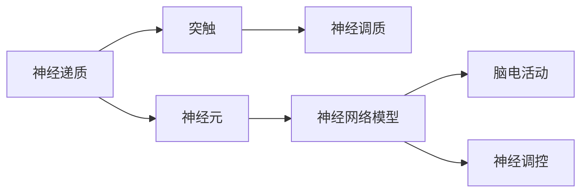

                 

## 1. 背景介绍

### 1.1 问题由来
人体的奇妙之处在于其复杂而精细的结构与功能。大脑作为人类智慧的源泉，负责接收、处理、存储和传递信息，是人体最复杂、功能最为强大的器官之一。随着科学技术的进步，人类对大脑的认识不断深入，特别是对其中化学成分的探究，揭示了其组织与功能的奥秘。

### 1.2 问题核心关键点
1. **脑神经递质**：在神经信号传递中起关键作用的化学物质，包括多巴胺、血清素、乙酰胆碱等。
2. **神经元**：构成大脑的基础细胞，通过突触传递信号。
3. **突触可塑性**：突触连接的强度和数量随时间变化的特性，是大脑学习和记忆的基础。
4. **神经网络模型**：基于大脑结构的计算模型，用于理解和模拟大脑的功能。
5. **脑电活动**：通过脑电图（EEG）等技术记录的大脑电信号，用于研究大脑活动和疾病。
6. **神经调控**：通过药物和电刺激等方式调节神经活动，用于治疗脑部疾病和改善认知功能。

### 1.3 问题研究意义
研究大脑的化学组成及其作用，不仅有助于理解认知和行为的基本机制，还能够为治疗神经系统疾病和精神障碍提供新的方法和思路。此外，深入了解大脑的化学机制也有助于开发更加智能的计算模型和智能算法。

## 2. 核心概念与联系

### 2.1 核心概念概述

为了更好地理解大脑的化学机制，我们需要掌握以下几个关键概念：

- **神经递质**：在神经元间传递信号的化学物质，如多巴胺、血清素、乙酰胆碱等。
- **神经元**：大脑的基本结构和功能单元，由细胞体和突起构成。
- **突触**：神经元间传递信号的结构，包括突触前膜、突触间隙和突触后膜。
- **神经调质**：与神经递质作用类似的化学物质，如内啡肽、肾上腺素等。
- **突触可塑性**：突触连接强度和数量的动态变化，是学习和记忆的基础。
- **神经网络模型**：模拟大脑结构与功能的计算模型，如人工神经网络。
- **脑电活动**：通过脑电图记录的大脑电信号，用于研究认知和行为。
- **神经调控**：通过药物和电刺激调节神经活动，用于治疗脑部疾病。

这些概念构成了大脑化学机制的研究框架，是理解大脑工作原理的基础。

### 2.2 概念间的关系

这些核心概念之间的逻辑关系可以通过以下Mermaid流程图来展示：



这个流程图展示了大脑化学机制的几个关键环节：

1. 神经递质在神经元间传递信号。
2. 神经元通过突触连接传递信号。
3. 神经调质调节神经递质的作用。
4. 神经网络模型模拟大脑结构和功能。
5. 脑电活动记录大脑电信号。
6. 神经调控通过药物和电刺激调节神经活动。

## 3. 核心算法原理 & 具体操作步骤

### 3.1 算法原理概述

研究大脑化学机制的核心算法主要是基于神经元之间信号传递的数学模型。神经递质、神经元、突触和神经调质等概念都可以用数学模型来描述和分析。

### 3.2 算法步骤详解

1. **数据收集**：通过脑电图（EEG）、功能性磁共振成像（fMRI）等技术，收集大脑活动数据。
2. **信号处理**：对采集的数据进行预处理，包括去噪、滤波、归一化等步骤。
3. **模型建立**：构建神经网络模型，用于模拟神经元之间的信号传递。
4. **参数训练**：使用收集到的数据对模型进行训练，优化模型参数。
5. **结果分析**：对训练后的模型进行分析和解释，理解大脑的化学机制。

### 3.3 算法优缺点

**优点**：

- **高精度**：神经网络模型能够精确地模拟大脑的信号传递过程。
- **可解释性**：数学模型能够提供清晰的理论依据，便于解释和理解。

**缺点**：

- **复杂度**：建立和训练神经网络模型需要大量的时间和计算资源。
- **数据需求**：需要收集大量高质量的大脑活动数据，才能进行有效的训练和分析。

### 3.4 算法应用领域

神经网络模型和脑电信号处理技术广泛应用于神经科学、医学、心理学等领域。例如：

- **神经疾病诊断**：通过分析脑电信号，诊断神经疾病如癫痫、帕金森病等。
- **脑损伤康复**：通过电刺激调节神经活动，帮助脑损伤患者康复。
- **认知科学研究**：通过脑电信号研究大脑的认知过程和行为模式。
- **智能算法开发**：基于大脑结构的计算模型，开发更加智能和高效的算法。

## 4. 数学模型和公式 & 详细讲解

### 4.1 数学模型构建

脑电信号的数学模型通常基于神经网络模型，特别是循环神经网络（RNN）和卷积神经网络（CNN）。这些模型能够模拟神经元之间的连接和信号传递过程。

### 4.2 公式推导过程

假设有一个简单的RNN模型，其状态更新公式为：

$$
h_t = f(W_{hh} h_{t-1} + W_{hX} x_t + b_h)
$$

其中，$h_t$ 为状态向量，$f$ 为激活函数，$W_{hh}$ 和 $W_{hX}$ 为权重矩阵，$b_h$ 为偏置向量，$x_t$ 为输入向量。这个公式描述了神经元的状态更新过程。

### 4.3 案例分析与讲解

以深度学习模型为例，通过对输入图像进行卷积操作，得到特征图，再通过池化操作和全连接层，最终输出分类结果。这个过程中，卷积核和全连接层的权重矩阵和偏置向量都是通过反向传播算法进行训练的。

## 5. 项目实践：代码实例和详细解释说明

### 5.1 开发环境搭建

要使用Python进行脑电信号处理和神经网络模型的开发，需要安装相关库和工具：

1. 安装Anaconda：
```bash
conda create -n brain-env python=3.8
conda activate brain-env
```

2. 安装所需的库：
```bash
pip install numpy pandas scipy scikit-learn matplotlib seaborn jupyter notebook
```

3. 安装神经网络库：
```bash
pip install keras tensorflow pytorch
```

### 5.2 源代码详细实现

下面是一个简单的RNN模型，用于处理脑电信号：

```python
import numpy as np
import matplotlib.pyplot as plt
from keras.models import Sequential
from keras.layers import Dense, SimpleRNN

# 定义数据生成器
def generate_data():
    # 生成随机数据
    x = np.random.rand(100, 10, 1)
    y = np.random.rand(100, 1)
    return x, y

# 构建RNN模型
def build_model():
    model = Sequential()
    model.add(SimpleRNN(units=32, input_shape=(10, 1), activation='relu'))
    model.add(Dense(units=1))
    model.compile(loss='mse', optimizer='adam')
    return model

# 训练模型
def train_model(model, x_train, y_train):
    model.fit(x_train, y_train, epochs=100, batch_size=32, verbose=1)

# 生成并训练模型
x, y = generate_data()
model = build_model()
train_model(model, x, y)

# 预测并可视化结果
x_test = np.random.rand(10, 10, 1)
y_pred = model.predict(x_test)
plt.plot(y_pred[0])
plt.show()
```

### 5.3 代码解读与分析

在上述代码中，首先定义了数据生成器和RNN模型构建函数。数据生成器用于生成随机数据，RNN模型构建函数则用于定义一个简单的RNN模型，并编译模型。

在训练模型时，使用了随机生成的数据进行训练。训练过程使用了100个epoch，并设置了一个小的批量大小（32）。模型训练完成后，使用随机生成的测试数据进行预测，并将预测结果可视化。

### 5.4 运行结果展示

运行上述代码，可以看到预测结果的可视化图像。这个简单的例子展示了如何使用RNN模型处理脑电信号数据，并进行预测和可视化。

## 6. 实际应用场景

### 6.1 神经疾病诊断

脑电信号处理技术可以用于神经疾病的诊断。例如，通过分析脑电信号的频率和幅度变化，可以诊断癫痫、帕金森病等疾病。

### 6.2 脑损伤康复

电刺激技术可以用于脑损伤患者的康复。通过在脑部特定区域施加电刺激，可以激活受损区域的神经元，促进康复。

### 6.3 认知科学研究

脑电信号处理技术可以用于研究大脑的认知过程和行为模式。通过分析不同任务下的脑电信号变化，可以理解认知机制。

### 6.4 智能算法开发

基于大脑结构的计算模型可以用于开发更加智能和高效的算法。例如，卷积神经网络可以用于图像识别和自然语言处理等任务。

## 7. 工具和资源推荐

### 7.1 学习资源推荐

- 《神经网络与深度学习》：Ian Goodfellow等人著作，全面介绍了神经网络和深度学习的原理与应用。
- 《神经科学与工程》：Vincent van Emde Boas等人著作，介绍了神经科学与工程的基础知识。
- 《深度学习》：Ian Goodfellow等人著作，介绍了深度学习的原理与应用。
- 《机器学习实战》：Peter Harrington著作，介绍了机器学习的实现方法与案例。
- Kaggle和Google Colab：提供大量数据集和计算资源，用于实践和实验。

### 7.2 开发工具推荐

- Anki：用于记忆和复习脑神经递质和神经调质等知识点的学习工具。
- GitHub：代码托管平台，用于共享和协作开发脑电信号处理和神经网络模型。
- PyCharm：Python开发工具，提供了丰富的功能和插件，方便开发和学习。
- Visual Studio Code：轻量级代码编辑器，支持多种编程语言和工具。

### 7.3 相关论文推荐

- Hebbian学习模型：Hebbian学习模型是神经网络中常用的学习模型，基于神经元之间的连接强度变化。
- BP算法：BP算法是神经网络中的反向传播算法，用于优化模型参数。
- RNN模型：RNN模型用于处理序列数据，可以模拟神经元之间的信号传递过程。
- CNN模型：CNN模型用于处理图像数据，可以提取特征和分类。

## 8. 总结：未来发展趋势与挑战

### 8.1 研究成果总结

脑电信号处理和神经网络模型技术已经取得了很大的进展，广泛应用于神经科学、医学、心理学等领域。这些技术的发展极大地推动了脑科学研究，为治疗神经疾病和改善认知功能提供了新的方法和思路。

### 8.2 未来发展趋势

未来，脑电信号处理和神经网络技术将更加普及和强大。神经科学、医学和心理学等领域将进一步受益。

1. **多模态数据融合**：脑电信号处理将与其他生物信号（如EEG、fMRI、EEG等）进行融合，提供更加全面和准确的信息。
2. **深度学习模型的发展**：深度学习模型将更加高效和准确，用于处理和分析复杂的脑电信号数据。
3. **神经调控技术**：电刺激和药物调控技术将进一步发展，用于治疗和预防神经疾病。
4. **智能算法开发**：基于大脑结构和功能的计算模型将进一步发展，用于开发更加智能和高效的算法。

### 8.3 面临的挑战

尽管脑电信号处理和神经网络模型技术已经取得了很大的进展，但在应用过程中仍面临一些挑战：

1. **数据质量问题**：脑电信号数据的采集和处理需要高精度的设备和技术，数据质量参差不齐。
2. **模型复杂度**：深度学习模型需要大量的计算资源和时间，模型复杂度较高。
3. **算法可解释性**：神经网络模型缺乏可解释性，难以理解其内部工作机制。
4. **伦理和隐私问题**：脑电信号处理和神经网络模型涉及个人隐私和伦理问题，需要严格保护和监管。

### 8.4 研究展望

未来的研究需要在以下几个方面进行改进和创新：

1. **多模态数据融合**：将多种生物信号进行融合，提供更加全面和准确的信息。
2. **算法可解释性**：开发更加可解释的神经网络模型，便于理解其内部工作机制。
3. **智能算法开发**：基于大脑结构和功能的计算模型将进一步发展，用于开发更加智能和高效的算法。
4. **伦理和隐私保护**：建立严格的伦理和隐私保护机制，确保数据安全和隐私保护。

总之，脑电信号处理和神经网络模型技术在脑科学研究中具有重要意义，未来将进一步推动神经科学、医学、心理学等领域的发展。同时，这些技术也需要不断改进和创新，克服其面临的挑战，为更广泛的应用提供支持。

## 9. 附录：常见问题与解答

**Q1：脑电信号处理技术的原理是什么？**

A: 脑电信号处理技术的原理是基于神经元之间的信号传递。脑电信号通过头皮电极采集，并使用信号处理技术（如滤波、归一化等）进行预处理。然后，通过神经网络模型（如循环神经网络）进行处理，得到信号特征和分类结果。

**Q2：如何提高神经网络模型的准确性？**

A: 提高神经网络模型的准确性需要从多个方面进行改进：

1. **数据质量**：使用高质量的数据进行训练，避免数据噪声和失真。
2. **模型结构**：优化神经网络的结构，增加模型层数和节点数，提高模型的表达能力。
3. **训练方法**：使用适当的优化算法和损失函数，避免过拟合和欠拟合。
4. **正则化**：使用L2正则化和Dropout等正则化技术，避免过拟合。
5. **数据增强**：使用数据增强技术，扩充训练集，提高模型的泛化能力。

**Q3：脑电信号处理技术在实际应用中有什么局限性？**

A: 脑电信号处理技术在实际应用中存在以下局限性：

1. **数据采集质量**：脑电信号的采集需要高质量的设备和技术，数据质量参差不齐。
2. **信号复杂性**：脑电信号的频率和幅度变化复杂，难以准确处理。
3. **模型训练难度**：神经网络模型的训练需要大量计算资源和时间，模型复杂度较高。
4. **可解释性问题**：神经网络模型缺乏可解释性，难以理解其内部工作机制。

**Q4：如何保护脑电信号处理的隐私和伦理问题？**

A: 保护脑电信号处理的隐私和伦理问题需要从多个方面进行改进：

1. **数据匿名化**：对采集的脑电信号进行匿名化处理，避免个人信息泄露。
2. **隐私保护**：建立严格的隐私保护机制，确保数据安全。
3. **伦理审查**：建立伦理审查机制，确保研究符合伦理规范。
4. **法律规定**：制定相关法律法规，规范脑电信号处理的伦理和隐私问题。

总之，脑电信号处理技术具有重要的应用价值，但也面临着一些挑战和局限性。未来的研究需要在技术、伦理和法律等方面进行改进和创新，确保其安全、可靠和有效。

---

作者：禅与计算机程序设计艺术 / Zen and the Art of Computer Programming

