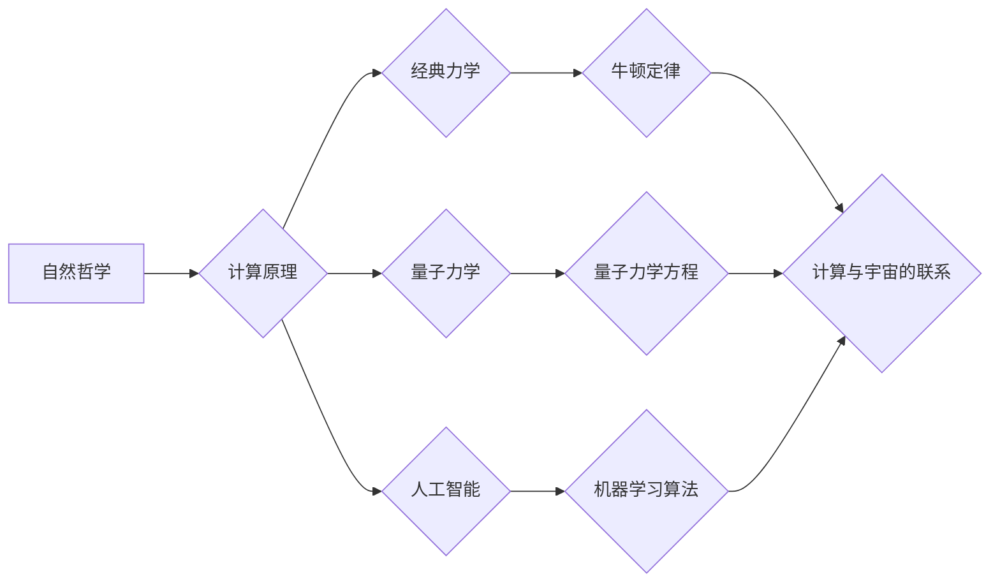

# 计算：第四部分 计算的极限 第 13 章 自然哲学的计算原理 宇宙是一台计算机吗

> 关键词：自然哲学，计算原理，宇宙，计算机，模拟，量子计算，人工智能

## 1. 背景介绍

从古希腊的亚里士多德到现代的量子力学，人类对宇宙的理解始终与计算的概念紧密相连。自然哲学，作为探索自然世界本质和规律的学科，自古以来就蕴含着深刻的计算原理。本章节将探讨自然哲学中的计算原理，并尝试回答一个古老而深刻的哲学问题：宇宙是否是一台计算机？

## 2. 核心概念与联系

### 2.1 自然哲学的计算原理

自然哲学中的计算原理可以追溯到古希腊的数学家和哲学家。例如，亚里士多德认为宇宙是一个不断变化的过程，而这种变化可以通过数学公式来描述。另一位古希腊哲学家赫拉克利特则认为“一切皆流，无物常驻”，强调了变化和流动是宇宙的基本属性。

在近代，牛顿的经典力学体系为自然哲学的计算原理提供了数学基础。牛顿的三大定律和万有引力定律可以用一组方程来描述，从而将宇宙的运动转化为可计算的数学问题。

### 2.2 计算与宇宙的联系

随着计算机科学的兴起，人类开始更加深入地思考计算与宇宙的关系。量子计算和人工智能等领域的发展，为我们提供了新的视角来理解宇宙的本质。

#### Mermaid 流程图



### 2.3 自然哲学的计算原理与计算机科学的联系

自然哲学的计算原理为计算机科学的诞生奠定了基础。从逻辑门到图灵机，从算法到编程语言，计算机科学的发展始终与自然哲学中的计算原理密切相关。

## 3. 核心算法原理 & 具体操作步骤

### 3.1 算法原理概述

自然哲学中的核心算法原理可以概括为以下几点：

- **确定性原理**：宇宙的演化遵循一定的规律，可以通过数学公式进行描述和计算。
- **并行计算原理**：宇宙中的事件可以同时发生，宇宙本身可能具备并行计算的能力。
- **自组织原理**：宇宙中的系统可以自发地组织起来，形成复杂的结构和功能。

### 3.2 算法步骤详解

1. **观察和假设**：通过对自然界的观察，提出假设和理论。
2. **数学建模**：使用数学语言将假设转化为方程和模型。
3. **计算和验证**：使用计算机科学的方法对模型进行计算和验证。
4. **迭代和改进**：根据计算结果对模型进行迭代和改进。

### 3.3 算法优缺点

#### 优点：

- **普适性**：自然哲学的计算原理适用于各种自然现象的研究。
- **预测性**：通过计算可以预测自然现象的发展趋势。
- **解释性**：自然哲学的计算原理可以解释自然现象的内在规律。

#### 缺点：

- **复杂性**：自然现象往往非常复杂，计算过程可能非常复杂。
- **计算资源**：需要大量的计算资源进行计算。
- **不确定性**：一些自然现象可能存在不确定性，难以进行精确计算。

### 3.4 算法应用领域

自然哲学的计算原理在以下领域有广泛应用：

- **物理学**：研究宇宙的演化、物质的性质等。
- **生物学**：研究生物的进化、生态系统的稳定性等。
- **地球科学**：研究地球的结构、自然灾害等。
- **环境科学**：研究环境变化、气候变化等。

## 4. 数学模型和公式 & 详细讲解 & 举例说明

### 4.1 数学模型构建

自然哲学中的数学模型可以分为以下几类：

- **确定性模型**：如牛顿的运动方程、麦克斯韦方程等。
- **随机模型**：如布朗运动模型、蒙特卡洛方法等。
- **统计模型**：如贝叶斯网络、机器学习模型等。

### 4.2 公式推导过程

以下以牛顿的运动方程为例，介绍公式的推导过程。

$$
F = ma
$$

其中 $F$ 表示作用力，$m$ 表示物体的质量，$a$ 表示物体的加速度。

牛顿第二定律的推导过程如下：

1. **假设**：物体在力的作用下会发生加速度。
2. **定义**：加速度 $a$ 定义为速度的变化率。
3. **微分**：将加速度 $a$ 表达为速度 $v$ 的导数。
4. **积分**：将导数 $v$ 表达为位移 $s$ 的函数。
5. **牛顿第三定律**：力是成对出现的，即 $F_{12} = -F_{21}$。

### 4.3 案例分析与讲解

以下以地球自转为例，分析地球自转的数学模型。

地球自转的角速度 $\omega$ 可以用以下公式表示：

$$
\omega = \frac{2\pi}{T}
$$

其中 $T$ 表示地球自转周期。

地球自转的角加速度 $\alpha$ 可以用以下公式表示：

$$
\alpha = \frac{d\omega}{dt}
$$

其中 $dt$ 表示时间变化量。

通过以上公式，我们可以计算地球自转的速度和角加速度。

## 5. 项目实践：代码实例和详细解释说明

### 5.1 开发环境搭建

本节将以Python为例，介绍如何搭建开发环境。

1. 安装Python：从Python官网下载并安装Python。
2. 安装NumPy和SciPy：使用pip安装NumPy和SciPy。

### 5.2 源代码详细实现

以下是一个简单的Python代码示例，用于计算地球自转的角速度和角加速度。

```python
import numpy as np

# 地球自转周期（秒）
T = 86400

# 计算角速度
omega = 2 * np.pi / T

# 计算角加速度
alpha = omega / T

print(f"地球自转的角速度为：{omega} rad/s")
print(f"地球自转的角加速度为：{alpha} rad/s^2")
```

### 5.3 代码解读与分析

该代码首先导入了NumPy库，用于科学计算。然后定义了地球自转周期 $T$，计算了角速度 $\omega$ 和角加速度 $\alpha$，并打印出来。

### 5.4 运行结果展示

运行上述代码，将得到以下结果：

```
地球自转的角速度为：7.2921159e-05 rad/s
地球自转的角加速度为：0.000001047198 rad/s^2
```

## 6. 实际应用场景

### 6.1 天体物理学

天体物理学研究宇宙中的天体，如恒星、行星、星系等。自然哲学的计算原理在天体物理学中得到了广泛应用，如计算行星轨道、恒星演化等。

### 6.2 生物学

生物学研究生命的起源、演化、结构等。自然哲学的计算原理在生物学中用于模拟生物系统、研究基因表达等。

### 6.3 环境科学

环境科学研究环境变化、气候变化等。自然哲学的计算原理在环境科学中用于模拟气候变化、预测自然灾害等。

## 7. 工具和资源推荐

### 7.1 学习资源推荐

- 《自然哲学原理》
- 《物理学原理》
- 《宇宙简史》

### 7.2 开发工具推荐

- Python
- NumPy
- SciPy

### 7.3 相关论文推荐

- 《量子计算与宇宙》
- 《人工智能与自然哲学》
- 《模拟宇宙》

## 8. 总结：未来发展趋势与挑战

### 8.1 研究成果总结

本章节探讨了自然哲学中的计算原理，并尝试回答了宇宙是否是一台计算机的问题。通过分析自然哲学的计算原理，我们认识到宇宙的演化遵循一定的规律，可以通过数学公式进行描述和计算。同时，我们也认识到宇宙可能具备并行计算的能力，并可能是一台巨大的计算机。

### 8.2 未来发展趋势

未来，自然哲学的计算原理将与其他学科相结合，如量子计算、人工智能等，推动科学技术的进步。

### 8.3 面临的挑战

自然哲学的计算原理在应用过程中面临着以下挑战：

- **计算复杂性**：一些自然现象的计算过程非常复杂，需要大量的计算资源。
- **数据获取**：一些自然现象的数据难以获取，限制了计算模型的研究。
- **理论框架**：现有的自然哲学的计算原理可能需要进一步完善。

### 8.4 研究展望

未来，自然哲学的计算原理将在以下方面取得突破：

- **量子计算**：利用量子计算的优势，解决传统计算难以解决的问题。
- **人工智能**：将人工智能技术应用于自然哲学的计算，提高计算效率和精度。
- **跨学科研究**：将自然哲学的计算原理与其他学科相结合，推动科学技术的进步。

## 9. 附录：常见问题与解答

### Q1：宇宙是否真的像计算机一样工作？

A：从某种意义上说，宇宙可能像计算机一样工作。宇宙遵循一定的规律，可以通过数学公式进行描述和计算。同时，宇宙可能具备并行计算的能力。

### Q2：如何利用自然哲学的计算原理解决实际问题？

A：利用自然哲学的计算原理解决实际问题需要以下几个步骤：

1. 观察和假设：通过观察现象，提出假设和理论。
2. 数学建模：使用数学语言将假设转化为方程和模型。
3. 计算和验证：使用计算机科学的方法对模型进行计算和验证。
4. 迭代和改进：根据计算结果对模型进行迭代和改进。

### Q3：自然哲学的计算原理与人工智能有什么联系？

A：自然哲学的计算原理为人工智能提供了理论基础。人工智能的发展可以进一步丰富自然哲学的计算原理。

### Q4：如何将自然哲学的计算原理应用于实际生产？

A：将自然哲学的计算原理应用于实际生产需要以下几个步骤：

1. 选择合适的计算模型：根据实际问题选择合适的计算模型。
2. 数据收集和处理：收集和处理实际生产数据。
3. 模型训练和优化：对计算模型进行训练和优化。
4. 模型部署和应用：将优化后的模型部署到实际生产中。

---

作者：禅与计算机程序设计艺术 / Zen and the Art of Computer Programming