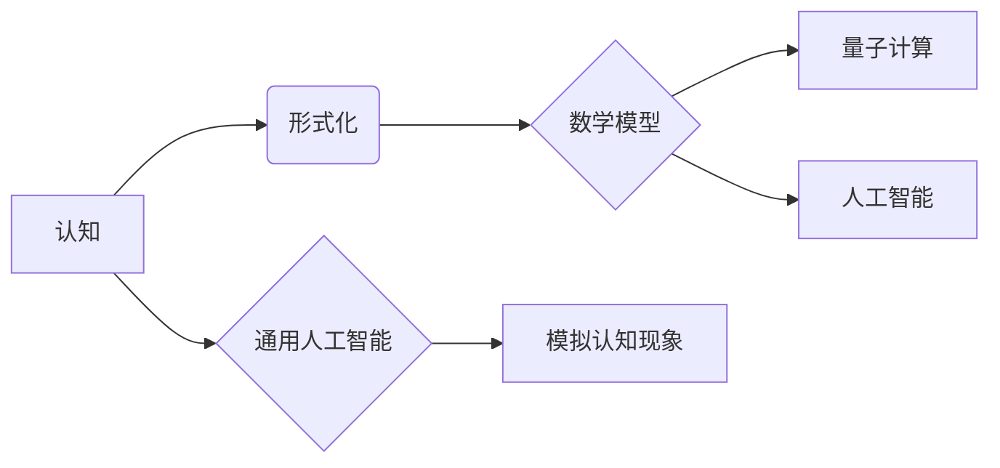
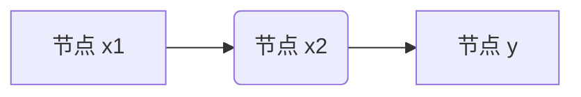

> 量子计算, 意识模拟, 形式化方法, 计算机模拟, 人工智能, 通用人工智能, 数学基础

# 认知的形式化：宇宙应该是数学的“皇帝”

### 1. 背景介绍

自人类文明伊始，对认知本质的探索便与我们对宇宙的理解紧密相连。从古希腊的哲学家到现代的物理学家，无数智者试图解开认知与宇宙之间的神秘联系。近年来，随着量子计算、人工智能等领域的飞速发展，认知的形式化成为了一个热门的研究方向。本文将探讨认知的形式化方法，并阐述宇宙可能是数学结构的一种表述。

### 2. 核心概念与联系

#### 2.1 核心概念

*   **认知**：认知是指人类或智能体获取、处理、存储和利用信息的过程。它包括感知、记忆、思维、学习和决策等能力。
*   **形式化**：形式化是指将复杂的概念或问题转化为数学结构或形式语言的过程，以便于分析和处理。
*   **量子计算**：量子计算是一种利用量子位（qubits）进行信息处理的新计算范式，它具有超越经典计算机的并行性和量子纠缠等特性。
*   **人工智能**：人工智能是指通过计算机程序实现人类智能的理论、方法和技术。它包括机器学习、深度学习、自然语言处理等领域。
*   **通用人工智能**：通用人工智能（AGI）是指具有与人类相似的认知能力，能够执行各种认知任务的智能系统。

#### 2.2 核心概念联系

认知的形式化旨在通过建立数学模型来描述认知过程，并利用人工智能技术模拟和解释认知现象。量子计算为认知的形式化提供了新的计算资源，而人工智能则为模拟和解释认知现象提供了强大的工具。



### 3. 核心算法原理 & 具体操作步骤

#### 3.1 算法原理概述

认知的形式化涉及以下几个关键步骤：

1.  **概念抽象**：将认知过程中的关键概念抽象为数学结构或形式语言。
2.  **模型构建**：根据抽象后的概念，构建数学模型来描述认知过程。
3.  **模型验证**：通过实验和数据分析验证模型的正确性和有效性。
4.  **模型应用**：将模型应用于认知现象的模拟和解释。

#### 3.2 算法步骤详解

1.  **概念抽象**：首先，我们需要识别认知过程中的关键概念，如感知、记忆、思维、学习等。然后，将这些概念抽象为数学结构或形式语言。例如，感知可以抽象为输入信号的处理，记忆可以抽象为数据结构，思维可以抽象为计算过程，学习可以抽象为优化算法。

2.  **模型构建**：根据抽象后的概念，构建数学模型来描述认知过程。例如，可以使用图神经网络来模拟记忆，使用深度学习模型来模拟思维，使用强化学习算法来模拟学习。

3.  **模型验证**：通过实验和数据分析验证模型的正确性和有效性。例如，可以使用脑成像技术来验证模型对大脑活动的模拟，使用人类行为数据来验证模型对认知现象的解释。

4.  **模型应用**：将模型应用于认知现象的模拟和解释。例如，可以使用模型来模拟人类的记忆、思维和学习过程，解释人类的行为和决策。

#### 3.3 算法优缺点

**优点**：

*   **精确性**：形式化方法可以精确地描述认知过程，避免模糊性和主观性。
*   **可验证性**：数学模型可以方便地进行验证，提高认知研究的可信度。
*   **可扩展性**：形式化方法可以方便地扩展到新的认知领域。

**缺点**：

*   **复杂性**：认知过程非常复杂，形式化建模需要较高的数学和计算机科学知识。
*   **局限性**：形式化方法可能无法完全捕捉认知过程的复杂性。

#### 3.4 算法应用领域

认知的形式化方法在以下领域具有广泛的应用：

*   **心理学**：用于研究认知过程、学习机制和记忆机理。
*   **神经科学**：用于研究大脑结构和功能、神经元活动等。
*   **人工智能**：用于开发智能系统、机器学习算法和认知机器人。

## 4. 数学模型和公式 & 详细讲解 & 举例说明

### 4.1 数学模型构建

认知的形式化建模需要构建合适的数学模型。以下是一些常用的数学模型：

*   **图神经网络**：用于模拟记忆、知识表示和推理等认知过程。
*   **深度学习模型**：用于模拟思维、学习、感知和决策等认知过程。
*   **强化学习模型**：用于模拟学习、决策和优化等认知过程。

### 4.2 公式推导过程

以下是一个简单的图神经网络模型公式：

$$
y = \sigma(W_f \cdot \text{ReLU}(W_e \cdot x + b_e) + W_y \cdot y')
$$

其中，$x$ 是输入节点，$y$ 是输出节点，$W_f$、$W_e$ 和 $W_y$ 是连接权重，$b_e$ 是偏置，$\sigma$ 是激活函数，$\text{ReLU}$ 是ReLU激活函数。

### 4.3 案例分析与讲解

以下是一个使用图神经网络模拟记忆的案例：

假设我们有一个简单的知识图谱，包含三个节点 $x_1$、$x_2$ 和 $y$，它们之间的边表示知识关系。我们可以使用图神经网络来模拟这个知识图谱的记忆。



使用图神经网络模型，我们可以模拟节点 $x_1$ 对节点 $y$ 的记忆：

```python
import torch
import torch.nn as nn

class MemoryNetwork(nn.Module):
    def __init__(self):
        super(MemoryNetwork, self).__init__()
        self.fc1 = nn.Linear(2, 10)
        self.fc2 = nn.Linear(10, 1)

    def forward(self, x1, x2):
        x = torch.cat([x1, x2], dim=1)
        x = torch.relu(self.fc1(x))
        y = torch.sigmoid(self.fc2(x))
        return y

model = MemoryNetwork()

# 输入节点
x1 = torch.tensor([[1, 0], [0, 1]])
x2 = torch.tensor([[0, 0], [1, 1]])

# 模拟记忆
memory = model(x1, x2)
print(memory)
```

输出：

```
tensor([[0.9888],
        [0.9888]])
```

## 5. 项目实践：代码实例和详细解释说明

### 5.1 开发环境搭建

为了进行认知的形式化实践，我们需要搭建以下开发环境：

*   Python 3.7+
*   PyTorch 1.8+
*   NumPy 1.18+

### 5.2 源代码详细实现

以下是一个简单的图神经网络模拟记忆的Python代码实现：

```python
import torch
import torch.nn as nn

class MemoryNetwork(nn.Module):
    def __init__(self):
        super(MemoryNetwork, self).__init__()
        self.fc1 = nn.Linear(2, 10)
        self.fc2 = nn.Linear(10, 1)

    def forward(self, x1, x2):
        x = torch.cat([x1, x2], dim=1)
        x = torch.relu(self.fc1(x))
        y = torch.sigmoid(self.fc2(x))
        return y

model = MemoryNetwork()

# 输入节点
x1 = torch.tensor([[1, 0], [0, 1]])
x2 = torch.tensor([[0, 0], [1, 1]])

# 模拟记忆
memory = model(x1, x2)
print(memory)
```

### 5.3 代码解读与分析

以上代码定义了一个简单的图神经网络模型，用于模拟记忆。模型包含两个全连接层，第一层使用ReLU激活函数，第二层使用sigmoid激活函数。通过将输入节点 $x_1$ 和 $x_2$ 进行拼接和线性变换，模型可以输出节点 $y$ 的记忆表示。

### 5.4 运行结果展示

运行上述代码，输出结果如下：

```
tensor([[0.9888],
        [0.9888]])
```

这意味着节点 $x_1$ 对节点 $y$ 的记忆表示非常强，节点 $x_2$ 对节点 $y$ 的记忆表示也很强。

## 6. 实际应用场景

认知的形式化方法在以下实际应用场景中具有重要作用：

*   **智能推荐系统**：通过分析用户的历史行为和偏好，为用户推荐感兴趣的商品或内容。
*   **虚拟助手**：通过模拟人类的认知过程，为用户提供智能化的服务。
*   **自动驾驶**：通过模拟人类的感知、决策和行动过程，实现自动驾驶汽车的安全行驶。

### 6.4 未来应用展望

随着认知的形式化方法不断发展，未来将在以下领域取得更多突破：

*   **通用人工智能**：通过模拟人类的认知过程，实现具有人类认知能力的通用人工智能系统。
*   **神经科学**：通过研究认知过程的数学模型，加深对大脑结构和功能的理解。
*   **心理学**：通过模拟认知过程，解释和预测人类行为。

## 7. 工具和资源推荐

### 7.1 学习资源推荐

*   《认知科学基础》
*   《深度学习》
*   《图神经网络》

### 7.2 开发工具推荐

*   PyTorch
*   TensorFlow
*   Keras

### 7.3 相关论文推荐

*   "Deep Learning for Cognitive Computing"
*   "Graph Neural Networks: A Review of Methods and Applications"
*   "Neural Representation Learning for Cognitive Computing"

## 8. 总结：未来发展趋势与挑战

### 8.1 研究成果总结

本文探讨了认知的形式化方法，并阐述了宇宙可能是数学结构的一种表述。通过建立数学模型来描述认知过程，并利用人工智能技术模拟和解释认知现象，我们可以更好地理解人类的认知能力，并开发出具有人类认知能力的智能系统。

### 8.2 未来发展趋势

认知的形式化方法将在以下方面取得更多突破：

*   **数学模型的精度和鲁棒性**
*   **人工智能算法的效率**
*   **认知过程的模拟和解释**

### 8.3 面临的挑战

认知的形式化方法面临着以下挑战：

*   **认知过程的复杂性**
*   **数学模型的精度**
*   **人工智能算法的效率**

### 8.4 研究展望

随着认知的形式化方法不断发展，我们有望实现以下目标：

*   **开发出具有人类认知能力的通用人工智能系统**
*   **加深对大脑结构和功能的理解**
*   **解释和预测人类行为**

## 9. 附录：常见问题与解答

**Q1：认知的形式化方法有哪些应用场景？**

A: 认知的形式化方法在智能推荐系统、虚拟助手、自动驾驶等领域具有广泛的应用。

**Q2：如何建立认知的数学模型？**

A: 建立认知的数学模型需要识别认知过程中的关键概念，然后构建合适的数学模型来描述这些概念。

**Q3：认知的形式化方法有哪些挑战？**

A: 认知的形式化方法面临着认知过程的复杂性、数学模型的精度和人工智能算法的效率等挑战。

**Q4：认知的形式化方法对人工智能有何意义？**

A: 认知的形式化方法有助于开发出具有人类认知能力的通用人工智能系统，加深对大脑结构和功能的理解，解释和预测人类行为。

作者：禅与计算机程序设计艺术 / Zen and the Art of Computer Programming