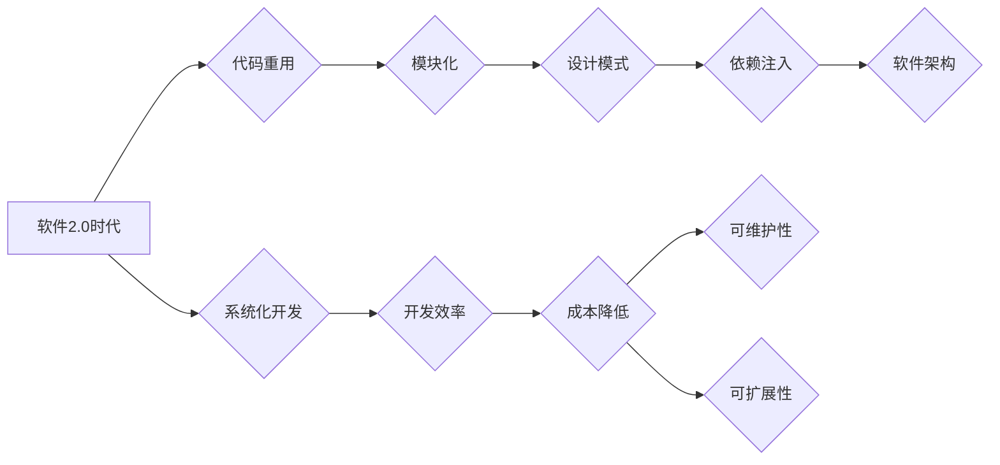

# 软件2.0时代的代码重用与模块化

> 关键词：软件2.0，代码重用，模块化，软件工程，组件化，设计模式，依赖注入，面向接口编程

## 1. 背景介绍

软件工程的历史可以追溯到几十年前，从最初的程序设计到现在的软件开发，经历了多个阶段。软件2.0时代标志着软件开发进入了一个新的阶段，其中代码重用和模块化成为核心概念。本文将深入探讨软件2.0时代的代码重用与模块化，分析其原理、实践方法以及面临的挑战。

### 1.1 软件发展的历史阶段

1. **软件1.0时代**：以程序设计为主，注重代码的编写和调试，缺乏系统化的软件开发方法和工具。
2. **软件2.0时代**：强调代码重用和模块化，软件开发变得更加系统化、工程化。
3. **软件3.0时代**：注重软件的易用性和用户体验，强调软件即服务(SaaS)和云计算。
4. **软件4.0时代**：以人工智能和大数据为核心，软件更加智能化，能够自主学习、自我进化。

### 1.2 软件2.0时代的特征

1. **强调代码重用**：通过模块化和组件化，提高软件开发效率，降低开发成本。
2. **注重系统架构**：采用分层、松耦合的架构设计，提高软件的可维护性和可扩展性。
3. **使用设计模式**：通过设计模式，解决软件设计中的常见问题，提高代码质量。
4. **依赖注入**：降低模块间的耦合度，提高代码的可测试性和可维护性。

## 2. 核心概念与联系

### 2.1 核心概念原理和架构的 Mermaid 流程图



### 2.2 核心概念解释

- **代码重用**：通过模块化和组件化，将通用的代码段封装成模块或组件，在其他项目中重复使用，提高开发效率。
- **模块化**：将软件系统分解为独立的模块，每个模块负责特定的功能，模块间通过接口进行通信。
- **设计模式**：经过长期实践总结出来的、可重用的设计经验，用于解决软件开发中的常见问题。
- **依赖注入**：将模块间的依赖关系通过接口进行管理，降低模块间的耦合度。
- **软件架构**：对软件系统的整体设计，包括组件、接口和通信机制等。

## 3. 核心算法原理 & 具体操作步骤

### 3.1 算法原理概述

代码重用和模块化主要通过以下方法实现：

1. **模块化**：将软件系统分解为独立的模块，每个模块具有明确的职责和接口。
2. **组件化**：将模块进一步封装成组件，组件之间通过标准接口进行通信。
3. **设计模式**：采用设计模式，解决模块之间的依赖关系和通信问题。
4. **依赖注入**：通过接口管理模块间的依赖关系，降低耦合度。

### 3.2 算法步骤详解

1. **需求分析**：分析软件系统的功能需求，确定模块划分和接口设计。
2. **设计模块**：根据需求分析结果，设计模块的功能和接口。
3. **编码实现**：使用编程语言实现模块的功能。
4. **单元测试**：对每个模块进行单元测试，确保其功能正确性。
5. **集成测试**：将各个模块集成在一起，进行集成测试，确保整个系统功能的正确性。
6. **依赖注入**：通过接口管理模块间的依赖关系，降低耦合度。
7. **代码审查**：对代码进行审查，确保代码质量。

### 3.3 算法优缺点

**优点**：

1. 提高开发效率，降低开发成本。
2. 提高软件的可维护性和可扩展性。
3. 提高代码质量，降低缺陷率。

**缺点**：

1. 设计复杂，需要丰富的软件工程知识。
2. 开发周期较长，需要更多的前期投入。
3. 可能出现模块间耦合度过高，影响系统性能。

### 3.4 算法应用领域

代码重用和模块化适用于所有软件开发领域，包括：

1. 企业级应用开发
2. 移动应用开发
3. 网络应用开发
4. 游戏开发
5. 物联网应用开发

## 4. 数学模型和公式 & 详细讲解 & 举例说明

### 4.1 数学模型构建

软件2.0时代的代码重用和模块化可以通过以下数学模型进行描述：

$$
\text{软件系统} = \{ \text{模块集}, \text{接口集}, \text{通信机制} \}
$$

其中，模块集表示软件系统中的所有模块，接口集表示模块之间的通信接口，通信机制表示模块间交互的方式。

### 4.2 公式推导过程

假设有一个软件系统，包含 $n$ 个模块，每个模块具有 $m$ 个接口。模块 $i$ 与模块 $j$ 之间通过接口 $k$ 进行通信，表示为：

$$
M_i \rightarrow M_j : I_k
$$

其中，$M_i$ 和 $M_j$ 分别表示模块 $i$ 和模块 $j$，$I_k$ 表示接口 $k$。

### 4.3 案例分析与讲解

以一个简单的图书管理系统为例，分析代码重用和模块化在软件2.0时代的应用。

1. **模块化**：将图书管理系统分解为以下几个模块：
    - 图书信息模块：负责图书信息的增删改查操作。
    - 用户信息模块：负责用户信息的增删改查操作。
    - 借阅信息模块：负责图书借阅信息的增删改查操作。
    - 系统管理模块：负责系统参数设置、用户管理等操作。

2. **设计模式**：采用单例模式管理系统参数，确保系统参数的一致性。

3. **依赖注入**：通过接口管理模块之间的依赖关系，例如，借阅信息模块需要依赖图书信息模块和用户信息模块，可以通过接口进行注入。

4. **代码重用**：图书信息模块、用户信息模块和借阅信息模块中的代码可以在其他类似系统中重复使用，提高开发效率。

## 5. 项目实践：代码实例和详细解释说明

### 5.1 开发环境搭建

1. 安装Java开发环境，如JDK和IDEA。
2. 创建一个Maven项目，添加必要的依赖。

### 5.2 源代码详细实现

以下是一个简单的图书信息模块的示例代码：

```java
public class Book {
    private String id;
    private String title;
    private String author;
    // getter和setter方法
}

public class BookService {
    public List<Book> getAllBooks() {
        // 查询所有图书
        return bookList;
    }

    public void addBook(Book book) {
        // 添加图书
        bookList.add(book);
    }

    public void deleteBook(String id) {
        // 删除图书
        for (int i = 0; i < bookList.size(); i++) {
            if (bookList.get(i).getId().equals(id)) {
                bookList.remove(i);
                break;
            }
        }
    }

    public void updateBook(Book book) {
        // 更新图书
        for (int i = 0; i < bookList.size(); i++) {
            if (bookList.get(i).getId().equals(book.getId())) {
                bookList.set(i, book);
                break;
            }
        }
    }
}
```

### 5.3 代码解读与分析

- `Book` 类表示图书信息，包含图书ID、标题和作者等信息。
- `BookService` 类负责图书信息的增删改查操作，通过封装在 `BookService` 类中，实现代码重用。
- 该示例展示了如何通过模块化和设计模式实现代码重用和模块化。

### 5.4 运行结果展示

1. 编译并运行程序，执行图书信息的增删改查操作。
2. 观察控制台输出，验证程序的功能。

## 6. 实际应用场景

### 6.1 企业级应用开发

在企业级应用开发中，代码重用和模块化可以显著提高开发效率，降低开发成本。例如，在开发企业资源规划(ERP)系统时，可以采用模块化设计，将系统分解为各个功能模块，如财务模块、人力资源模块、销售模块等。各个模块之间通过接口进行通信，方便维护和扩展。

### 6.2 移动应用开发

在移动应用开发中，模块化可以提高代码的可维护性和可扩展性。例如，一个移动应用可以分解为以下几个模块：
- 数据访问模块：负责数据持久化操作。
- 业务逻辑模块：负责处理业务逻辑。
- 视图模块：负责用户界面设计。

### 6.3 网络应用开发

在网络应用开发中，代码重用和模块化可以提高系统性能和可扩展性。例如，在开发电商平台时，可以采用模块化设计，将系统分解为以下几个模块：
- 商品模块：负责商品信息的展示和管理。
- 购物车模块：负责购物车的添加、修改和删除操作。
- 订单模块：负责订单的创建、修改和删除操作。

## 7. 工具和资源推荐

### 7.1 学习资源推荐

1. 《软件架构的艺术》
2. 《设计模式：可复用面向对象软件的基础》
3. 《代码大全》
4. 《重构：改善既有代码的设计》

### 7.2 开发工具推荐

1. Maven
2. Gradle
3. Spring Boot
4. Spring Cloud

### 7.3 相关论文推荐

1. "Component-Based Software Engineering: A Research Roadmap" by Mark L. Feathers
2. "The Design of Object-Oriented Software" by Grady Booch
3. "Pattern-Oriented Software Architecture: A System of Patterns" by Peter Coad, Eric Lefebvre, and Richard Robert Martin

## 8. 总结：未来发展趋势与挑战

### 8.1 研究成果总结

软件2.0时代的代码重用和模块化已经取得了显著成果，为软件开发带来了许多好处。然而，随着软件系统规模的不断扩大，代码重用和模块化也面临着一些挑战。

### 8.2 未来发展趋势

1. **自动化模块化**：通过自动化工具，将软件系统自动分解为模块，提高模块化效率。
2. **智能模块化**：利用人工智能技术，根据项目需求自动选择合适的模块和设计模式。
3. **微服务架构**：将大型软件系统拆分为多个微服务，每个微服务负责特定的功能，提高系统可扩展性和可维护性。

### 8.3 面临的挑战

1. **模块化粒度**：如何确定合适的模块化粒度，平衡模块的独立性和耦合性。
2. **模块化复杂性**：随着模块数量的增加，系统复杂性也会增加，如何降低系统复杂性。
3. **模块化成本**：模块化需要额外的开发成本，如何控制模块化成本。

### 8.4 研究展望

为了应对软件2.0时代代码重用和模块化面临的挑战，未来的研究需要关注以下几个方面：

1. **模块化方法**：研究更有效的模块化方法，提高模块化的效率和效果。
2. **模块化工具**：开发自动化和智能化的模块化工具，降低模块化成本。
3. **模块化标准**：制定统一的模块化标准，促进模块的共享和重用。

通过不断的研究和实践，相信软件2.0时代的代码重用和模块化将会取得更大的突破，为软件开发带来更多便利。

## 9. 附录：常见问题与解答

**Q1：什么是模块化？**

A：模块化是将软件系统分解为独立的模块，每个模块负责特定的功能，模块间通过接口进行通信。

**Q2：什么是代码重用？**

A：代码重用是指将通用的代码段封装成模块或组件，在其他项目中重复使用。

**Q3：什么是设计模式？**

A：设计模式是经过长期实践总结出来的、可重用的设计经验，用于解决软件开发中的常见问题。

**Q4：什么是依赖注入？**

A：依赖注入是将模块间的依赖关系通过接口进行管理，降低模块间的耦合度。

**Q5：代码重用和模块化的好处有哪些？**

A：代码重用和模块化可以显著提高开发效率，降低开发成本，提高软件的可维护性和可扩展性。

**Q6：代码重用和模块化有哪些挑战？**

A：代码重用和模块化需要额外的开发成本，可能增加系统复杂性，需要平衡模块的独立性和耦合性。

作者：禅与计算机程序设计艺术 / Zen and the Art of Computer Programming