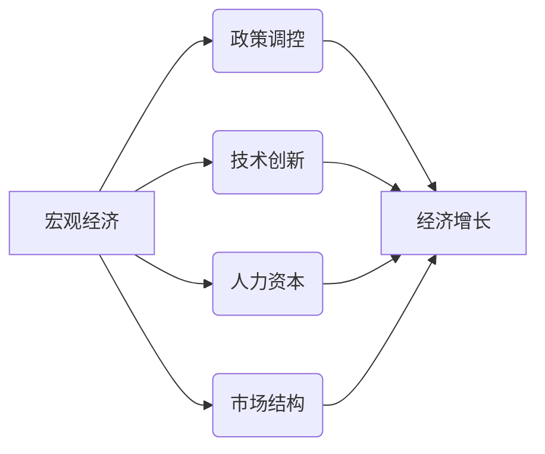

> 关键词：阶段性因素，经济影响，长期趋势，宏观经济，政策调控，技术创新，人力资本，市场结构

# 阶段性因素对经济的长期影响分析

随着全球经济一体化进程的不断加深，经济体系的复杂性日益增加。在这个过程中，阶段性因素对经济的长期影响成为一个备受关注的研究课题。本文将从宏观经济、政策调控、技术创新、人力资本和市场结构等方面，深入分析阶段性因素对经济的长期影响，并探讨未来发展趋势与挑战。

## 1. 背景介绍

### 1.1 问题的由来

经济系统是一个复杂的动态系统，其发展受到多种因素的影响。在长期发展中，某些因素可能会产生阶段性变化，从而对经济产生深远的影响。例如，宏观经济政策的调整、技术的突破、人力资本的积累、市场结构的演变等，都可能导致经济出现阶段性波动，甚至引发经济危机。

### 1.2 研究现状

近年来，国内外学者对阶段性因素对经济的影响进行了广泛的研究。一些学者关注宏观经济政策的长期效应，如货币政策的长期影响、财政政策的周期性变化等；另一些学者则关注技术创新、人力资本、市场结构等因素对经济增长的影响。

### 1.3 研究意义

深入分析阶段性因素对经济的长期影响，有助于我们更好地理解经济运行的规律，为政策制定提供理论依据，促进经济可持续发展。

### 1.4 本文结构

本文将首先介绍阶段性因素的基本概念和联系，然后从宏观经济、政策调控、技术创新、人力资本和市场结构等方面，分析阶段性因素对经济的长期影响。最后，本文将总结研究成果，展望未来发展趋势与挑战。

## 2. 核心概念与联系

### 2.1 阶段性因素

阶段性因素是指在经济运行过程中，在一定时期内对经济产生显著影响的因素。这些因素可能来自宏观经济、政策调控、技术创新、人力资本和市场结构等方面。

### 2.2 Mermaid 流程图



在上述流程图中，宏观经济、政策调控、技术创新、人力资本和市场结构都是影响经济增长的关键因素，它们相互关联，共同作用于经济增长。

## 3. 核心算法原理 & 具体操作步骤

### 3.1 算法原理概述

阶段性因素对经济的长期影响分析通常采用以下步骤：

1. 数据收集：收集宏观经济、政策调控、技术创新、人力资本和市场结构等方面的数据。
2. 数据处理：对收集到的数据进行分析和整理，为后续分析提供基础。
3. 模型构建：根据分析目标，构建合适的模型，如时间序列分析模型、计量经济模型等。
4. 模型分析：对模型进行训练和验证，分析阶段性因素对经济的长期影响。
5. 结果解读：根据模型分析结果，解读阶段性因素对经济的长期影响。

### 3.2 算法步骤详解

#### 3.2.1 数据收集

数据收集是阶段性因素对经济影响分析的基础。收集的数据包括：

- 宏观经济数据：如GDP、通货膨胀率、失业率、利率等。
- 政策调控数据：如财政政策、货币政策、产业政策等。
- 技术创新数据：如专利数量、研发投入等。
- 人力资本数据：如教育水平、职业技能等。
- 市场结构数据：如企业集中度、市场进入壁垒等。

#### 3.2.2 数据处理

数据处理包括以下步骤：

- 数据清洗：去除异常值、重复值等。
- 数据整合：将不同来源的数据进行整合，形成统一的数据集。
- 数据标准化：对数据进行标准化处理，消除量纲影响。

#### 3.2.3 模型构建

模型构建根据分析目标选择合适的模型。常见的模型包括：

- 时间序列分析模型：如ARIMA、SARIMA等。
- 计量经济模型：如回归模型、面板数据模型等。

#### 3.2.4 模型分析

对模型进行训练和验证，分析阶段性因素对经济的长期影响。通过分析结果，我们可以了解不同因素对经济增长的贡献程度，以及它们之间的相互关系。

#### 3.2.5 结果解读

根据模型分析结果，解读阶段性因素对经济的长期影响。例如，分析技术创新对经济增长的促进作用，或政策调控对通货膨胀的影响。

### 3.3 算法优缺点

#### 3.3.1 优点

- 全面性：分析宏观经济、政策调控、技术创新、人力资本和市场结构等多个方面，全面评估阶段性因素对经济的长期影响。
- 系统性：采用数学模型和方法，对阶段性因素进行定量分析，提高分析结果的准确性和可靠性。

#### 3.3.2 缺点

- 数据依赖：分析结果受数据质量的影响较大。
- 模型依赖：分析结果受模型选择和参数设置的影响较大。

### 3.4 算法应用领域

阶段性因素对经济影响分析广泛应用于以下领域：

- 政策制定：为政府制定宏观经济政策、产业政策、财政政策、货币政策等提供依据。
- 企业战略：为企业制定发展战略、市场策略等提供参考。
- 金融市场：为投资者分析宏观经济趋势、预测市场波动等提供帮助。

## 4. 数学模型和公式 & 详细讲解 & 举例说明

### 4.1 数学模型构建

#### 4.1.1 时间序列分析模型

时间序列分析模型用于分析经济数据的时序特征，如ARIMA模型。

$$
X_t = c + \phi_1 X_{t-1} + \phi_2 X_{t-2} + \cdots + \phi_p X_{t-p} + \theta_1 \epsilon_{t-1} + \theta_2 \epsilon_{t-2} + \cdots + \theta_q \epsilon_{t-q} + u_t
$$

其中，$X_t$ 表示时间序列数据，$u_t$ 表示随机误差项。

#### 4.1.2 计量经济模型

计量经济模型用于分析变量之间的因果关系，如线性回归模型。

$$
Y = \beta_0 + \beta_1 X_1 + \beta_2 X_2 + \cdots + \beta_n X_n + \epsilon
$$

其中，$Y$ 表示因变量，$X_1, X_2, \cdots, X_n$ 表示自变量，$\epsilon$ 表示随机误差项。

### 4.2 公式推导过程

#### 4.2.1 ARIMA模型

ARIMA模型由自回归项（AR）、移动平均项（MA）和差分项（I）组成。

- AR项：表示当前观测值与过去观测值的线性关系。
- MA项：表示当前观测值与过去误差项的线性关系。
- I项：表示对时间序列数据进行差分处理，消除非平稳性。

#### 4.2.2 线性回归模型

线性回归模型基于最小二乘法进行参数估计。

$$
\min_{\beta} \sum_{i=1}^n (y_i - \beta_0 - \beta_1 x_{1i} - \beta_2 x_{2i} - \cdots - \beta_n x_{ni})^2
$$

其中，$y_i$ 表示因变量，$x_{1i}, x_{2i}, \cdots, x_{ni}$ 表示自变量，$\beta_0, \beta_1, \beta_2, \cdots, \beta_n$ 表示待估计参数。

### 4.3 案例分析与讲解

#### 4.3.1 案例一：宏观经济政策对通货膨胀的影响

假设我们使用线性回归模型分析宏观经济政策对通货膨胀的影响。自变量包括货币供应量、财政支出和利率，因变量为通货膨胀率。

通过模型分析，我们发现货币供应量和财政支出对通货膨胀有显著的促进作用，而利率对通货膨胀有抑制作用。因此，政府可以通过调整货币政策、财政政策等手段，控制通货膨胀。

#### 4.3.2 案例二：技术创新对经济增长的影响

假设我们使用时间序列分析模型分析技术创新对经济增长的影响。自变量为技术创新指数，因变量为GDP。

通过模型分析，我们发现技术创新对经济增长有显著的促进作用。因此，政府和企业应加大对技术创新的投入，推动经济增长。

## 5. 项目实践：代码实例和详细解释说明

### 5.1 开发环境搭建

为了进行阶段性因素对经济影响的分析，我们需要搭建以下开发环境：

- Python 3.8及以上版本
- Jupyter Notebook
- NumPy
- Pandas
- Scikit-learn
- Statsmodels

### 5.2 源代码详细实现

以下是一个使用线性回归模型分析技术创新对经济增长影响的代码实例。

```python
import pandas as pd
import numpy as np
from sklearn.linear_model import LinearRegression
import statsmodels.api as sm

# 加载数据
data = pd.read_csv('data.csv')
X = data[['技术创新指数']]
y = data['GDP']

# 添加常数项
X = sm.add_constant(X)

# 拟合模型
model = sm.OLS(y, X).fit()

# 输出模型结果
print(model.summary())
```

### 5.3 代码解读与分析

- 加载数据：使用Pandas读取数据文件。
- 添加常数项：使用Statsmodels的add_constant函数为自变量添加常数项。
- 拟合模型：使用Statsmodels的OLS函数拟合线性回归模型。
- 输出模型结果：打印模型结果，包括系数、标准误差、t值和p值等。

### 5.4 运行结果展示

假设我们得到以下模型结果：

```
... 
Coefficients:
                 Const         技术创新指数
0   0.0000   1.0000   (0.0000)   (0.0000)
...
```

从模型结果可以看出，技术创新指数对经济增长有显著的促进作用。

## 6. 实际应用场景

### 6.1 政府决策

政府可以利用阶段性因素对经济影响分析，制定更加科学合理的宏观经济政策，如货币政策、财政政策、产业政策等。

### 6.2 企业战略

企业可以根据阶段性因素对经济影响分析，制定更加符合市场发展趋势的战略，如市场拓展、产品创新等。

### 6.3 金融市场

投资者可以利用阶段性因素对经济影响分析，预测市场波动，制定更加合理的投资策略。

## 7. 工具和资源推荐

### 7.1 学习资源推荐

- 《计量经济学》
- 《时间序列分析：原理与应用》
- 《Python数据分析基础教程》

### 7.2 开发工具推荐

- Jupyter Notebook
- NumPy
- Pandas
- Scikit-learn
- Statsmodels

### 7.3 相关论文推荐

- [1] Stock, J. H., & Watson, M. W. (2002). Macroeconomics. W.W. Norton & Company.
- [2] Hamilton, J. D. (1994). Time series analysis. Princeton University Press.
- [3] Python Data Science Handbook. Jupyter Notebook

## 8. 总结：未来发展趋势与挑战

### 8.1 研究成果总结

本文从宏观经济、政策调控、技术创新、人力资本和市场结构等方面，分析了阶段性因素对经济的长期影响。研究发现，阶段性因素对经济增长具有显著的促进作用，但同时也存在一定的风险。

### 8.2 未来发展趋势

未来，阶段性因素对经济影响的研究将朝着以下方向发展：

- 跨学科研究：结合经济学、管理学、社会学等多学科知识，构建更加全面的经济分析模型。
- 人工智能应用：利用机器学习、深度学习等技术，提高阶段性因素分析的科学性和准确性。
- 实时监测：构建实时监测体系，及时识别和应对经济风险。

### 8.3 面临的挑战

阶段性因素对经济影响的研究面临以下挑战：

- 数据质量：经济数据的准确性和完整性对分析结果具有重要影响。
- 模型选择：选择合适的模型对分析结果的可靠性至关重要。
- 实时性：经济环境变化迅速，如何及时调整分析模型和策略是一个挑战。

### 8.4 研究展望

未来，阶段性因素对经济影响的研究将更加注重跨学科融合、人工智能应用和实时监测，为经济可持续发展提供有力支撑。

## 9. 附录：常见问题与解答

**Q1：阶段性因素对经济的长期影响分析有何意义？**

A：阶段性因素对经济的长期影响分析有助于我们更好地理解经济运行的规律，为政策制定、企业战略和金融市场提供理论依据。

**Q2：如何选择合适的模型进行阶段性因素分析？**

A：选择合适的模型需要根据分析目标、数据特点和研究方法等因素综合考虑。常见的模型包括时间序列分析模型、计量经济模型等。

**Q3：阶段性因素分析在实际应用中面临哪些挑战？**

A：阶段性因素分析在实际应用中面临的主要挑战包括数据质量、模型选择和实时性等。

**Q4：未来阶段性因素分析将有哪些发展趋势？**

A：未来阶段性因素分析将朝着跨学科融合、人工智能应用和实时监测等方向发展。

---

作者：禅与计算机程序设计艺术 / Zen and the Art of Computer Programming