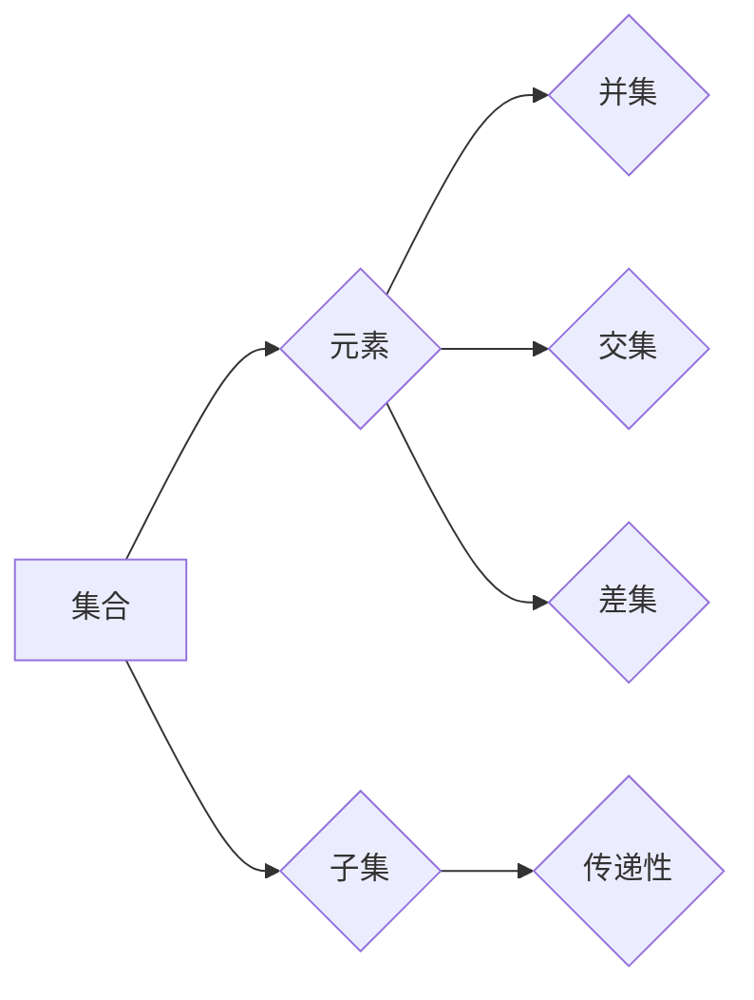

> 集合论，传递性，集合论刚性，数学基础，抽象数据类型，递归定义，形式化方法

# 集合论导引：传递集合之刚性

集合论是现代数学的基石，它为我们提供了一种描述和操作对象集合的形式化方法。在计算机科学中，集合论的概念被广泛应用于抽象数据类型的设计，特别是那些需要传递性的数据结构，如集合、序列和关系。本文将深入探讨集合论的核心概念，特别是传递集合的刚性，以及如何在计算机程序设计中应用这些概念。

## 1. 背景介绍

### 1.1 集合论的起源

集合论起源于19世纪末，由德国数学家乔治·康托尔(Georg Cantor)创立。康托尔试图将数学建立在严格的基础上，即通过集合的概念来定义所有数学对象。他的工作对数学和哲学产生了深远的影响。

### 1.2 集合论在计算机科学中的应用

在计算机科学中，集合论的概念被用来定义数据结构，如数组、列表、栈、队列等。这些数据结构允许我们以一致和形式化的方式组织和操作数据。

### 1.3 研究意义

理解集合论的基本原理对于设计高效、可靠的计算机程序至关重要。特别是传递集合的刚性，它确保了集合操作的一致性和可预测性。

### 1.4 本文结构

本文将分为以下几个部分：
- 介绍集合论的基本概念和传递性。
- 探讨传递集合的刚性及其在计算机科学中的应用。
- 分析传递集合的数学模型和公式。
- 展示传递集合的代码实例和解释。
- 讨论传递集合在实际应用中的场景。
- 推荐学习资源、开发工具和相关论文。
- 总结研究成果，展望未来发展趋势和挑战。

## 2. 核心概念与联系

### 2.1 集合论的基本概念

集合论的基本概念包括：

- **元素**：集合中的单个对象。
- **集合**：由元素组成的无序集合。
- **子集**：一个集合的所有元素都属于另一个集合。
- **并集**：包含两个集合所有元素的集合。
- **交集**：同时属于两个集合的所有元素的集合。
- **差集**：属于第一个集合但不属于第二个集合的所有元素的集合。

### 2.2 传递性

传递性是集合论中的一个重要性质，它意味着如果A是B的子集，且B是C的子集，那么A也是C的子集。用数学语言表示为：

$$
A \subseteq B \quad \text{且} \quad B \subseteq C \quad \Rightarrow \quad A \subseteq C
$$

### 2.3 Mermaid流程图



## 3. 核心算法原理 & 具体操作步骤

### 3.1 算法原理概述

传递集合的刚性确保了集合操作的逻辑一致性和可预测性。在计算机科学中，这意味着我们可以依靠集合的性质来设计抽象数据类型，而不用担心操作的结果会违反集合的基本规则。

### 3.2 算法步骤详解

在设计抽象数据类型时，以下步骤是必要的：

1. **定义集合的操作**：包括创建、添加元素、删除元素、检查元素是否存在等。
2. **确保传递性**：在实现这些操作时，要确保传递性得到满足。
3. **测试和验证**：通过一系列测试来验证集合操作的一致性和正确性。

### 3.3 算法优缺点

**优点**：
- 确保数据结构的一致性和可预测性。
- 提高程序的可读性和可维护性。

**缺点**：
- 实现可能比较复杂，需要仔细设计。
- 在某些情况下，可能需要牺牲性能以换取一致性。

### 3.4 算法应用领域

传递集合的刚性在以下领域有广泛应用：

- 数据库系统
- 程序设计语言
- 软件工程
- 系统设计

## 4. 数学模型和公式 & 详细讲解 & 举例说明

### 4.1 数学模型构建

集合论可以形式化为以下数学模型：

- **集合**：可以表示为 $\{x | P(x)\}$，其中 $P(x)$ 是一个谓词。
- **子集**：用 $\subseteq$ 表示。
- **并集**：用 $\cup$ 表示。
- **交集**：用 $\cap$ 表示。
- **差集**：用 $-$ 表示。

### 4.2 公式推导过程

以下是一个简单的例子，展示如何使用集合论公式推导：

假设 $A = \{1, 2, 3\}$，$B = \{2, 3, 4\}$，那么：

$$
A \cup B = \{1, 2, 3, 4\}
$$

$$
A \cap B = \{2, 3\}
$$

### 4.3 案例分析与讲解

以下是一个使用Python实现的集合类，它确保了集合操作的一致性和传递性：

```python
class Set:
    def __init__(self, elements=None):
        self.elements = set(elements) if elements is not None else set()

    def add(self, element):
        self.elements.add(element)

    def remove(self, element):
        self.elements.discard(element)

    def union(self, other):
        return Set(self.elements | other.elements)

    def intersect(self, other):
        return Set(self.elements & other.elements)

    def difference(self, other):
        return Set(self.elements - other.elements)

    def __contains__(self, element):
        return element in self.elements

# Example usage
set_a = Set([1, 2, 3])
set_b = Set([2, 3, 4])

union_set = set_a.union(set_b)
print(union_set)  # Output: Set([1, 2, 3, 4])

intersect_set = set_a.intersect(set_b)
print(intersect_set)  # Output: Set([2, 3])
```

## 5. 项目实践：代码实例和详细解释说明

### 5.1 开发环境搭建

为了运行以下代码，您需要一个Python开发环境。可以使用Python 3.6或更高版本。

### 5.2 源代码详细实现

上一节中给出的 `Set` 类的实现即为代码实例。它是一个简单的集合类，支持添加、删除元素，以及并集、交集和差集操作。

### 5.3 代码解读与分析

`Set` 类通过Python内置的 `set` 类型来实现集合操作。`add` 和 `remove` 方法分别用于添加和删除元素。`union`、`intersect` 和 `difference` 方法分别实现了并集、交集和差集操作。`__contains__` 方法用于检查元素是否存在于集合中。

### 5.4 运行结果展示

如上所述，以下代码示例展示了如何使用 `Set` 类进行集合操作：

```python
set_a = Set([1, 2, 3])
set_b = Set([2, 3, 4])

union_set = set_a.union(set_b)
print(union_set)  # Output: Set([1, 2, 3, 4])

intersect_set = set_a.intersect(set_b)
print(intersect_set)  # Output: Set([2, 3])
```

## 6. 实际应用场景

传递集合的刚性在许多实际应用场景中都非常重要，以下是一些例子：

- **数据库索引**：数据库索引通常是基于集合论的概念设计的，确保快速查询和更新。
- **软件设计模式**：设计模式如工厂模式和单例模式，利用集合的概念来管理对象实例。
- **算法分析**：在分析算法时，集合论的概念用于描述算法的数据结构。

## 7. 工具和资源推荐

### 7.1 学习资源推荐

- 《集合论及其在计算机科学中的应用》
- 《离散数学及其应用》
- 《Python编程：从入门到实践》

### 7.2 开发工具推荐

- Python 3.x
- Jupyter Notebook

### 7.3 相关论文推荐

- 《集合论基础》
- 《离散数学》

## 8. 总结：未来发展趋势与挑战

### 8.1 研究成果总结

集合论是现代数学和计算机科学的基础，它提供了形式化描述和操作对象集合的工具。传递集合的刚性确保了集合操作的一致性和可预测性，这在计算机科学中非常重要。

### 8.2 未来发展趋势

未来，集合论将继续在计算机科学中扮演重要角色，特别是在以下方面：

- 面向高维数据的集合论研究
- 集合论在机器学习中的应用
- 集合论在软件工程中的应用

### 8.3 面临的挑战

尽管集合论在计算机科学中应用广泛，但仍面临以下挑战：

- 理解和解释复杂的集合论概念
- 将集合论应用于新兴领域
- 提高集合论的教学质量

### 8.4 研究展望

随着计算机科学和数学的不断发展，集合论将继续发展，为计算机科学提供新的理论工具和解决方案。

## 9. 附录：常见问题与解答

**Q1：什么是集合论？**

A：集合论是现代数学的基石，它提供了一种描述和操作对象集合的形式化方法。

**Q2：集合论在计算机科学中有什么应用？**

A：集合论在计算机科学中应用广泛，包括数据结构设计、算法分析、软件工程等。

**Q3：什么是传递集合的刚性？**

A：传递集合的刚性是指如果A是B的子集，且B是C的子集，那么A也是C的子集。

**Q4：如何确保集合操作的一致性和可预测性？**

A：通过确保传递集合的刚性，可以在设计抽象数据类型时保证集合操作的一致性和可预测性。

**Q5：集合论在机器学习中有哪些应用？**

A：集合论在机器学习中用于描述特征空间、数据集和模型。

作者：禅与计算机程序设计艺术 / Zen and the Art of Computer Programming