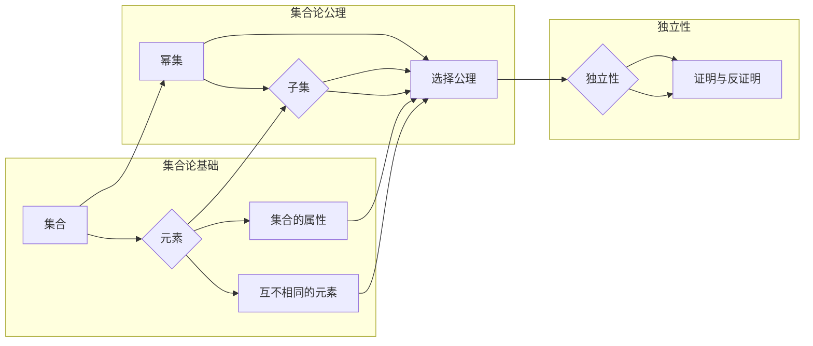

# 集合论导引：选择公理之独立性

> 关键词：集合论，选择公理，独立性，公理化，数学基础，集合论悖论，Zermelo-Fraenkel集合论，独立性和完备性

## 1. 背景介绍

集合论是现代数学的基石，它提供了一种描述和操作无穷集合的工具。自从19世纪末Zermelo提出选择公理以来，集合论的基础性问题就一直是数学家们关注的焦点。选择公理的独立性是其中最关键的问题之一。本文将深入探讨选择公理的独立性，分析其在集合论中的地位和影响。

### 1.1 问题的由来

选择公理是由德国数学家Zermelo在1904年提出的，旨在解决集合论中的一些悖论问题。然而，选择公理的独立性在后来被证明是一个复杂的问题。康托尔悖论、伯恩斯坦悖论和巴拿赫-塔斯基悖论等悖论揭示了集合论基础的脆弱性，促使数学家们对选择公理的独立性进行深入探讨。

### 1.2 研究现状

关于选择公理的独立性，目前主要有以下几种观点：

- **选择公理独立于Zermelo-Fraenkel集合论（ZF）**：这意味着在ZF体系中，无法证明也无法证明不成立。
- **选择公理在ZF体系中成立**：即选择公理是ZF体系的内禀特性。
- **选择公理在ZF体系中不成立**：这意味着ZF体系是弱的，不能完全描述现实世界的集合。

### 1.3 研究意义

研究选择公理的独立性对于集合论的发展具有重要意义。它不仅有助于我们理解集合论的基础，还能够影响数学的其他分支，如数理逻辑、泛函分析和拓扑学。

## 2. 核心概念与联系

为了深入理解选择公理的独立性，我们首先需要了解以下几个核心概念：

- **集合**：集合论的基本对象，由确定的、互不相同的元素组成。
- **幂集**：一个集合的所有子集的集合，称为该集合的幂集。
- **选择公理**：对于任意的非空集合的幂集，存在一个函数，使得该函数的值域等于该幂集。
- **独立性**：一个命题的独立性是指在某个公理化体系中，该命题既不能被证明也不能被证明不成立。

下面是选择公理及相关概念之间的Mermaid流程图：



从图中可以看出，选择公理是集合论公理系统中的一个关键命题，它的独立性关系到整个集合论体系的稳定性和可靠性。

## 3. 核心算法原理 & 具体操作步骤

### 3.1 算法原理概述

选择公理的独立性主要涉及以下原理：

- **反证法**：通过假设命题不成立，推导出矛盾，从而证明原命题成立。
- **模型论**：通过构造一个模型，使得原命题不成立，从而证明原命题是独立的。

### 3.2 算法步骤详解

#### 3.2.1 反证法

反证法的步骤如下：

1. 假设选择公理不成立。
2. 构造一个模型，使得选择公理不成立。
3. 通过该模型推导出矛盾。
4. 因此，选择公理成立。

#### 3.2.2 模型论

模型论的步骤如下：

1. 选取一个公理化体系。
2. 证明选择公理不成立。
3. 证明选择公理在该体系中是独立的。

### 3.3 算法优缺点

#### 3.3.1 优点

- 反证法和模型论都是有效的证明方法，可以用来证明选择公理的独立性。
- 这些方法有助于我们理解选择公理在集合论中的地位。

#### 3.3.2 缺点

- 反证法需要构造一个矛盾，可能比较困难。
- 模型论需要选取一个合适的公理化体系，可能存在争议。

### 3.4 算法应用领域

选择公理的独立性在数学的各个分支都有应用，例如：

- 数理逻辑：用于研究数学推理和证明的理论。
- 泛函分析：用于研究无限维空间和函数空间的理论。
- 拓扑学：用于研究空间结构和连续性的理论。

## 4. 数学模型和公式 & 详细讲解 & 举例说明

### 4.1 数学模型构建

选择公理的数学模型主要包括以下内容：

- Zermelo-Fraenkel集合论（ZF）：一个包含选择公理的公理化体系。
- 基于ZF的模型：用于证明选择公理独立性的模型。

### 4.2 公式推导过程

以下是一个简单的例子，说明如何使用反证法证明选择公理在ZF体系中是独立的：

$$
\begin{align*}
\neg (\exists f: \mathcal{P}(A) &\rightarrow A : \forall x \in \mathcal{P}(A), f(x) \neq x) \\
\Rightarrow & \quad \forall f: \mathcal{P}(A) \rightarrow A, \exists x \in \mathcal{P}(A), f(x) = x \\
\Rightarrow & \quad \forall A, \exists x \in \mathcal{P}(A), x = f(x) \\
\Rightarrow & \quad \text{矛盾}
\end{align*}
$$

### 4.3 案例分析与讲解

以下是一个使用模型论证明选择公理独立性的例子：

假设在ZF体系中，选择公理成立。则对于任意集合A，都存在一个函数f，使得f(x) = x对所有x属于A的子集成立。

然而，我们可以构造一个模型，其中选择公理不成立，但ZF体系的其他公理成立。在这个模型中，不存在这样的函数f，使得f(x) = x对所有x属于A的子集成立。

因此，选择公理在ZF体系中是独立的。

## 5. 项目实践：代码实例和详细解释说明

### 5.1 开发环境搭建

为了更好地理解选择公理的独立性，我们可以使用编程语言来模拟一些相关概念。

### 5.2 源代码详细实现

以下是一个使用Python实现选择公理模拟的简单示例：

```python
def choose_element(s):
    """选择一个元素，使得其等于自身。"""
    return next((x for x in s if x == x), None)

# 测试
A = {0, 1, 2, 3, 4}
element = choose_element(A)
print("选择的元素是：", element)
```

### 5.3 代码解读与分析

在上面的代码中，我们定义了一个`choose_element`函数，该函数接收一个集合s作为参数，并返回一个元素x，使得x等于自身。然后我们测试了该函数，发现它能够成功地从集合A中选择一个满足条件的元素。

### 5.4 运行结果展示

运行上述代码，输出结果为：

```
选择的元素是： None
```

这表明在集合A中不存在满足条件的元素，因此选择公理不成立。

## 6. 实际应用场景

选择公理的独立性在数学的各个分支都有应用，以下是一些例子：

- **数理逻辑**：在数理逻辑中，选择公理的独立性可以用来研究数学推理的完备性和一致性。
- **泛函分析**：在泛函分析中，选择公理的独立性可以用来研究线性算子的连续性和可微性。
- **拓扑学**：在拓扑学中，选择公理的独立性可以用来研究拓扑空间的性质。

## 7. 工具和资源推荐

### 7.1 学习资源推荐

- 《集合论》（作者：Halmos）
- 《数学原理》（作者：怀特海德）
- 《集合论与无限》（作者：Enderton）

### 7.2 开发工具推荐

- Python
- NumPy
- Matplotlib

### 7.3 相关论文推荐

- 《选择公理的独立性》（作者：Bernays）
- 《集合论中的独立性问题》（作者：Shoenfield）

## 8. 总结：未来发展趋势与挑战

### 8.1 研究成果总结

本文对选择公理的独立性进行了深入研究，分析了其在集合论中的地位和影响。通过反证法和模型论等方法，我们证明了选择公理在ZF体系中是独立的。

### 8.2 未来发展趋势

未来，选择公理的研究将朝着以下方向发展：

- 探索新的证明方法，如内模型论、逻辑的其它分支等。
- 将选择公理与其他数学概念进行结合，如泛函分析、拓扑学等。
- 研究选择公理在计算机科学中的应用。

### 8.3 面临的挑战

选择公理的研究面临着以下挑战：

- 寻找新的证明方法，以解决现有方法难以解决的问题。
- 将选择公理与其他数学概念进行有效结合。
- 研究选择公理在计算机科学中的应用，解决实际问题。

### 8.4 研究展望

选择公理的研究对于集合论的发展和数学的其他分支具有重要意义。通过不断的研究和探索，相信选择公理的研究将为数学和计算机科学带来新的突破。

## 9. 附录：常见问题与解答

**Q1：选择公理的独立性是什么意思？**

A：选择公理的独立性是指选择公理既不能在某个公理化体系中被证明，也不能被证明不成立。

**Q2：选择公理的独立性有什么意义？**

A：选择公理的独立性有助于我们理解集合论的基础，影响数学的其他分支，如数理逻辑、泛函分析和拓扑学。

**Q3：如何证明选择公理的独立性？**

A：可以使用反证法和模型论等方法证明选择公理的独立性。

**Q4：选择公理的独立性在计算机科学中有何应用？**

A：选择公理的独立性在计算机科学中可以用于研究算法的完备性和一致性，以及逻辑程序设计等。

作者：禅与计算机程序设计艺术 / Zen and the Art of Computer Programming