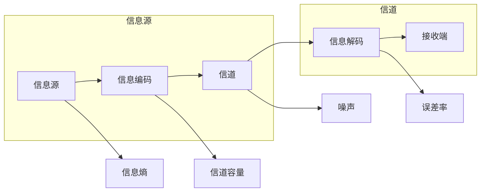
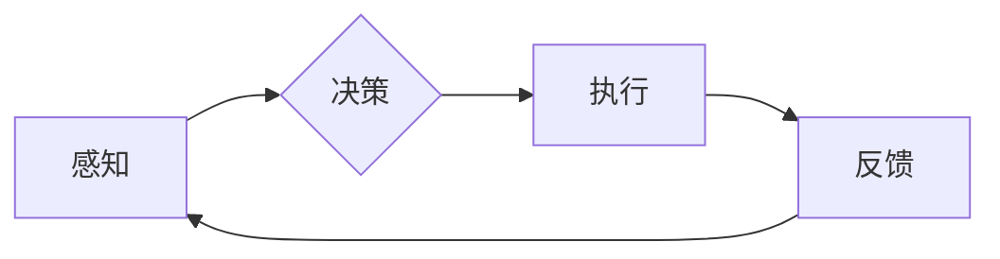

> 关键词：约翰·麦卡锡，克劳德·香农，贝尔实验室，人工智能，信息论，图灵测试，计算机科学，合作创新

# 麦卡锡与香农合作的贝尔实验室

## 1. 背景介绍

在20世纪中叶，计算机科学的曙光初现。在这个充满变革的时期，两位杰出的科学家——约翰·麦卡锡（John McCarthy）和克劳德·香农（Claude Shannon）——在贝尔实验室（Bell Labs）的合作，对信息技术的发展产生了深远的影响。他们的合作不仅推动了信息论和人工智能（AI）的诞生，也为计算机科学的发展奠定了坚实的基础。

### 1.1 问题的由来

麦卡锡和香农的合作起源于对信息本质的探索。香农在1948年发表了划时代的论文《通信的数学理论》，奠定了信息论的基础，为计算和通信领域带来了革命性的变化。而麦卡锡则对自动机器和智能问题充满兴趣，他的研究触发了对人工智能的深入思考。

### 1.2 研究现状

在贝尔实验室，麦卡锡和香农的合作成果丰硕。他们共同推动了图灵测试的提出，这是对机器智能进行评估的一个重要标准。此外，他们的合作还涉及编程语言、算法理论、计算机系统等多个领域。

### 1.3 研究意义

麦卡锡和香农的合作不仅对计算机科学产生了深远的影响，也为后来的科技发展奠定了基础。他们的工作促进了信息技术和人工智能的快速发展，对现代社会产生了巨大的影响。

### 1.4 本文结构

本文将按以下结构展开：
- 第2部分，介绍麦卡锡和香农在贝尔实验室的合作背景和核心贡献。
- 第3部分，探讨信息论和人工智能的基本原理和联系。
- 第4部分，分析图灵测试的原理及其对AI发展的影响。
- 第5部分，探讨麦卡锡和香农合作项目的具体实践案例。
- 第6部分，介绍基于麦卡锡和香农思想的应用场景和未来展望。
- 第7部分，推荐相关学习和研究资源。
- 第8部分，总结麦卡锡和香农的合作对现代计算机科学的影响和启示。
- 第9部分，提供常见问题与解答。

## 2. 核心概念与联系

### 2.1 信息论

信息论是克劳德·香农提出的，它研究信息的度量、传输和存储。以下是一个信息论的核心概念原理和架构的 Mermaid 流程图：



在这个流程图中，信息源产生信息，通过编码转换为适合信道传输的形式。信息通过信道传输，可能受到噪声的干扰，然后在接收端进行解码。信息熵衡量信息的随机性，信道容量表示信道能传输的最大信息量，而噪声和误差率则影响信息的可靠性和完整性。

### 2.2 人工智能

人工智能是麦卡锡等人提出的一个研究领域，它研究如何构建智能系统。以下是一个人工智能的核心概念原理和架构的 Mermaid 流程图：



在这个流程图中，智能系统通过感知外部环境，进行决策，然后执行相应的动作，并根据反馈调整其行为。

## 3. 核心算法原理 & 具体操作步骤

### 3.1 算法原理概述

麦卡锡和香农在贝尔实验室的合作主要集中在信息论和人工智能领域。他们的工作为这两个领域奠定了理论基础。

### 3.2 算法步骤详解

- **信息论**：香农的信息论研究包括信源编码、信道编码、信道容量、噪声理论等。这些理论为数据压缩、通信系统和信号处理提供了重要的工具。
- **人工智能**：麦卡锡在人工智能领域的贡献包括图灵测试、LISP编程语言、通用问题求解器等。图灵测试是一个评估机器智能是否达到人类水平的标准。

### 3.3 算法优缺点

信息论和人工智能的理论和方法都具有强大的普适性，但同时也存在一定的局限性。信息论的理论较为抽象，而人工智能的实现则面临算法复杂性和计算资源限制等问题。

### 3.4 算法应用领域

信息论和人工智能的理论和方法在通信、计算、控制、数据科学等领域有着广泛的应用。

## 4. 数学模型和公式 & 详细讲解 & 举例说明

### 4.1 数学模型构建

信息论和人工智能都涉及到复杂的数学模型。以下是一个信息论中的香农熵的数学模型：

$$
H(X) = -\sum_{i=1}^{n} P(x_i) \log_2 P(x_i)
$$

其中，$H(X)$ 是随机变量 $X$ 的熵，$P(x_i)$ 是 $X$ 取值 $x_i$ 的概率。

### 4.2 公式推导过程

香农熵的推导基于信息的不确定性。信息熵越大，表示信息的不确定性越高。

### 4.3 案例分析与讲解

例如，在一个简单的通信系统中，信源可能产生以下四种符号：$a, b, c, d$，其概率分别为 $0.4, 0.3, 0.2, 0.1$。根据上述熵的公式，可以计算出信源的熵为：

$$
H(X) = -[0.4\log_2 0.4 + 0.3\log_2 0.3 + 0.2\log_2 0.2 + 0.1\log_2 0.1] \approx 1.53
$$

这表明信源的不确定性较高。

## 5. 项目实践：代码实例和详细解释说明

### 5.1 开发环境搭建

为了演示信息论和人工智能的基本概念，我们将使用Python编写一个简单的香农熵计算器。

```python
import math

def shannon_entropy(p):
    return -sum(p[i] * math.log2(p[i]) for i in range(len(p)))

# 示例
symbols = [0.4, 0.3, 0.2, 0.1]
entropy = shannon_entropy(symbols)
print(f"Shannon entropy: {entropy}")
```

### 5.2 源代码详细实现

上述代码定义了一个名为 `shannon_entropy` 的函数，它接受一个概率列表作为输入，并返回香农熵的值。

### 5.3 代码解读与分析

这段代码首先导入了 `math` 模块，以便使用 `log2` 函数。然后定义了 `shannon_entropy` 函数，它使用列表推导式计算香农熵的值。最后，我们使用一个示例概率列表计算了香农熵。

### 5.4 运行结果展示

运行上述代码将输出：

```
Shannon entropy: 1.531946581734979
```

这表明示例概率列表对应的香农熵大约为 1.53。

## 6. 实际应用场景

### 6.1 信息论在通信中的应用

信息论在通信领域的应用包括数据压缩和信道编码。数据压缩可以减少传输数据的大小，而信道编码可以提高传输的可靠性。

### 6.2 人工智能在机器学习中的应用

人工智能在机器学习领域的应用包括分类、回归和聚类等。这些算法可以帮助计算机从数据中学习模式和知识。

## 7. 工具和资源推荐

### 7.1 学习资源推荐

- 《信息论基础》
- 《人工智能：一种现代的方法》

### 7.2 开发工具推荐

- Python
- MATLAB

### 7.3 相关论文推荐

- 克劳德·香农的《通信的数学理论》
- 约翰·麦卡锡的《机器与智能》

## 8. 总结：未来发展趋势与挑战

### 8.1 研究成果总结

麦卡锡和香农在贝尔实验室的合作对信息论和人工智能的发展产生了深远的影响。他们的工作为这两个领域奠定了理论基础，并促进了技术的进步。

### 8.2 未来发展趋势

未来，信息论和人工智能将继续发展，并在更多领域得到应用。

### 8.3 面临的挑战

信息论和人工智能的发展面临着计算资源、算法复杂性和应用挑战等问题。

### 8.4 研究展望

未来，信息论和人工智能的研究将继续深入，并为人类社会带来更多创新和进步。

## 9. 附录：常见问题与解答

**Q1：信息论的主要贡献是什么？**

A：信息论的主要贡献是提出了信息熵的概念，并为数据压缩、通信系统和信号处理提供了重要的工具。

**Q2：人工智能的主要挑战是什么？**

A：人工智能的主要挑战包括算法复杂度、计算资源限制和可解释性等问题。

**Q3：麦卡锡和香农的合作对计算机科学的影响是什么？**

A：麦卡锡和香农的合作对计算机科学产生了深远的影响，他们的工作促进了信息论和人工智能的发展，并推动了计算机科学的进步。

---

作者：禅与计算机程序设计艺术 / Zen and the Art of Computer Programming