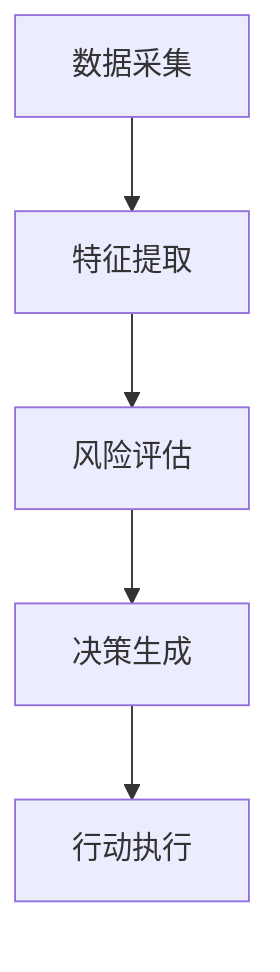

# AI人工智能代理工作流AI Agent WorkFlow：AI代理在防灾减灾系统中的作用

## 1. 背景介绍

### 1.1 问题的由来

在当今世界,自然灾害如洪水、地震、山体滑坡等事件频繁发生,给人类社会带来了巨大的生命和财产损失。有效的防灾减灾工作对于保护人民生命财产安全、维护社会稳定发展至关重要。传统的防灾减灾系统主要依赖人工监测和决策,存在反应滞后、决策失误等问题,亟需提高效率和精准度。

### 1.2 研究现状

近年来,人工智能(AI)技术在各行业得到了广泛应用,展现出了卓越的数据处理和决策能力。将AI技术应用于防灾减灾系统,可以显著提高灾害监测、预警和应急决策的时效性和准确性。目前,AI代理技术作为AI领域的一个重要分支,正在为防灾减灾系统注入新的活力。

### 1.3 研究意义

AI代理技术能够模拟人类专家的决策行为,并基于海量数据进行智能分析和决策。在防灾减灾系统中,AI代理可以实时监测各类灾害数据,快速识别潜在风险,并提出科学的应对措施。同时,AI代理还可以协调各方资源,优化救援方案,从而最大限度地减少灾害造成的损失。

本文将全面探讨AI代理在防灾减灾系统中的应用,阐述其核心概念、算法原理、数学模型,并通过实例分析其实际应用场景,最后对未来发展趋势和挑战进行展望。

### 1.4 本文结构

本文共分为9个部分:

1. 背景介绍
2. 核心概念与联系
3. 核心算法原理与具体操作步骤
4. 数学模型和公式详细讲解与举例说明
5. 项目实践:代码实例和详细解释说明
6. 实际应用场景
7. 工具和资源推荐
8. 总结:未来发展趋势与挑战
9. 附录:常见问题与解答

## 2. 核心概念与联系

AI代理(Agent)是一种自主的软件实体,能够感知环境、处理信息、做出决策并采取行动。在防灾减灾系统中,AI代理扮演着关键角色,负责收集和分析各类灾害数据,识别潜在风险,并提出应对措施。

AI代理工作流(Agent Workflow)描述了AI代理在防灾减灾系统中的工作过程,包括数据采集、特征提取、风险评估、决策生成和行动执行等环节。这一流程贯穿了AI代理的整个生命周期,确保了其高效、准确地完成防灾减灾任务。

上图展示了AI代理工作流的基本框架,各个环节之间存在紧密联系和相互依赖关系:

1. **数据采集**: AI代理从各类传感器、遥感影像、气象数据等渠道收集相关数据,为后续分析奠定基础。
2. **特征提取**: 从原始数据中提取出具有代表性的特征,如降雨量、地质构造等,为风险评估提供依据。
3. **风险评估**: 基于提取的特征,运用机器学习等技术对潜在灾害风险进行评估和预测。
4. **决策生成**: 根据风险评估结果,AI代理生成相应的决策方案,如发布预警、调配救援资源等。
5. **行动执行**: 将生成的决策方案付诸实施,并对执行效果进行反馈,为下一轮决策提供依据。

上述各个环节紧密配合,形成了一个闭环的AI代理工作流程,确保了防灾减灾系统的高效运转。

## 3. 核心算法原理与具体操作步骤

### 3.1 算法原理概述

AI代理在防灾减灾系统中的核心算法主要包括以下几个方面:

1. **数据预处理算法**: 对采集的原始数据进行清洗、标准化等预处理,为后续特征提取和模型训练奠定基础。
2. **特征工程算法**: 从预处理后的数据中提取出具有代表性的特征,如基于领域知识的手工特征提取,或基于深度学习的自动特征提取。
3. **风险评估算法**: 基于提取的特征,运用机器学习、深度学习等技术对潜在灾害风险进行评估和预测,包括分类、回归、聚类等多种算法。
4. **决策优化算法**: 根据风险评估结果,结合多种约束条件(如资源、时间等),生成最优的决策方案,常用的算法有规划算法、启发式搜索等。
5. **在线学习算法**: AI代理需要不断从实际执行中学习,优化自身的决策模型,提高预测和决策的准确性,常用的算法有强化学习、迁移学习等。

上述算法相互配合,构成了AI代理在防灾减灾系统中的核心算法框架。

### 3.2 算法步骤详解

AI代理在防灾减灾系统中的工作流程可以概括为以下几个步骤:

1. **数据采集**
   - 从各类传感器(如雨量计、地震仪等)、遥感影像、气象数据等渠道采集相关数据。
   - 对采集的原始数据进行清洗、标准化等预处理,消除噪声和异常值。

2. **特征提取**
   - 基于领域知识,对预处理后的数据进行手工特征工程,提取出具有代表性的特征。
   - 利用深度学习等技术,自动从数据中学习特征表示。

3. **风险评估**
   - 将提取的特征输入机器学习模型,对潜在灾害风险进行评估和预测。
   - 常用的机器学习算法包括:逻辑回归、决策树、随机森林、支持向量机等。
   - 深度学习算法如卷积神经网络、递归神经网络等,也可用于风险评估。

4. **决策生成**
   - 根据风险评估结果,结合多种约束条件(如资源、时间等),生成最优的决策方案。
   - 常用的决策优化算法包括:整数规划、启发式搜索、多目标优化等。

5. **行动执行**
   - 将生成的决策方案付诿实施,如发布预警、调配救援资源等。
   - 对执行效果进行反馈,为AI代理提供在线学习的数据。

6. **在线学习**
   - AI代理基于实际执行的反馈数据,利用强化学习、迁移学习等算法,不断优化自身的决策模型。
   - 提高风险评估和决策生成的准确性,形成一个闭环的学习过程。

上述步骤构成了AI代理在防灾减灾系统中的完整工作流程,确保了高效、准确的风险监测和应急决策。

### 3.3 算法优缺点

AI代理在防灾减灾系统中的核心算法具有以下优缺点:

**优点**:

1. **高效性**: 相比人工决策,AI算法能够快速处理海量数据,提高风险评估和决策生成的效率。
2. **准确性**: 机器学习等算法能够从历史数据中学习,提高风险预测的准确性。
3. **可解释性**: 一些算法(如决策树)具有较好的可解释性,有助于人类理解AI代理的决策过程。
4. **在线学习**: 通过强化学习等算法,AI代理能够不断优化自身模型,提高决策质量。

**缺点**:

1. **数据质量依赖**: 算法的性能在很大程度上依赖于训练数据的质量和量,数据不足或存在偏差会影响模型效果。
2. **黑箱问题**: 一些算法(如深度学习)存在黑箱问题,决策过程缺乏透明度,可解释性较差。
3. **算法偏差**: 由于训练数据或算法本身的偏差,AI代理的决策可能存在一定的偏差或歧视。
4. **安全性风险**: AI系统面临着被攻击或误用的风险,需要采取有效的安全防护措施。

总的来说,AI代理在防灾减灾系统中的核心算法具有高效、准确的优势,但也存在一定的缺陷和风险,需要在实际应用中加以权衡和优化。

### 3.4 算法应用领域

AI代理在防灾减灾系统中的核心算法具有广泛的应用前景,主要包括以下几个领域:

1. **气象灾害预警**
   - 利用机器学习算法分析历史气象数据,预测未来的极端天气事件,如暴雨、热浪等。
   - 基于预测结果,AI代理可以及时发布预警,提醒民众做好防范准备。

2. **地质灾害监测**
   - 通过分析地质数据、遥感影像等,AI算法能够实时监测地质灾害(如地震、山体滑坡等)的发生风险。
   - AI代理可以根据监测结果,制定应急疏散方案,减少人员伤亡。

3. **救援资源调配**
   - 在灾害发生后,AI代理可以运用决策优化算法,合理调配救援资源(如人力、物资等),提高救援效率。
   - 同时,AI代理还可以协调各方力量,优化救援路线和方案。

4. **灾后重建规划**
   - 利用机器学习算法分析灾后数据,评估灾情损失,为重建工作提供决策依据。
   - AI代理可以制定科学的重建规划,合理安排资金和工程进度。

5. **公众教育宣传**
   - AI代理可以根据不同群体的特征,生成个性化的防灾知识和宣传资料。
   - 提高公众的防灾意识和自救能力,为构建社会防灾减灾能力贡献力量。

总之,AI代理在防灾减灾系统中的核心算法具有广阔的应用前景,有望为减少灾害风险、提高应急响应能力做出重要贡献。

## 4. 数学模型和公式详细讲解与举例说明

### 4.1 数学模型构建

在防灾减灾系统中,AI代理需要基于数学模型对灾害风险进行量化评估。常用的数学模型包括:

1. **概率模型**
   - 用于描述灾害发生的概率分布,如暴雨、地震等事件的发生概率。
   - 常用的概率模型有指数分布、Gamma分布、Weibull分布等。

2. **时间序列模型**
   - 用于分析和预测随时间变化的灾害数据序列,如降雨量、温度等。
   - 常用的时间序列模型有自回归移动平均(ARMA)模型、指数平滑模型等。

3. **回归模型**
   - 用于建立灾害影响因素与后果之间的数学关系,如降雨量与洪水规模的关系。
   - 常用的回归模型有线性回归、逻辑回归、广义加性模型(GAM)等。

4. **空间模型**
   - 用于描述灾害在空间上的分布和传播规律,如山体滑坡、森林火灾的蔓延模式。
   - 常用的空间模型有克里金(Kriging)模型、高斯过程(GP)模型等。

5. **复合模型**
   - 将上述多种模型综合起来,构建更加复杂的灾害模型,以提高预测精度。
   - 常用的复合模型有贝叶斯网络模型、层次分析模型(AHP)等。

上述数学模型为AI代理提供了量化评估灾害风险的理论基础,是实现精准防灾减灾的关键所在。

### 4.2 公式推导过程

以概率模型为例,我们将推导灾害发生概率的计算公式。假设某一灾害事件 $X$ 服从参数为 $\lambda$ 的泊松分布,其概率质量函数为:

$$
P(X=k) = \frac{e^{-\lambda}\lambda^k}{k!}, \quad k=0,1,2,\ldots
$$

其中 $\lambda$ 表示单位时间(或空间)内灾害事件