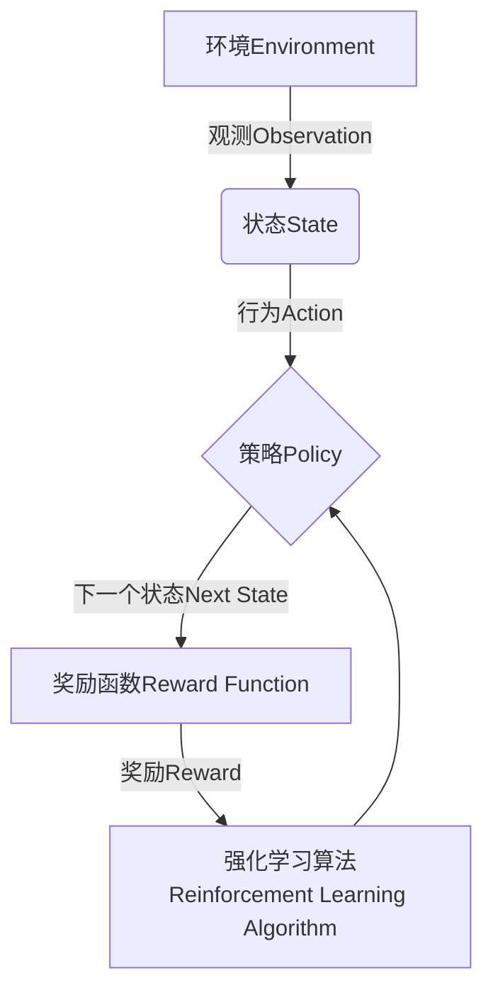
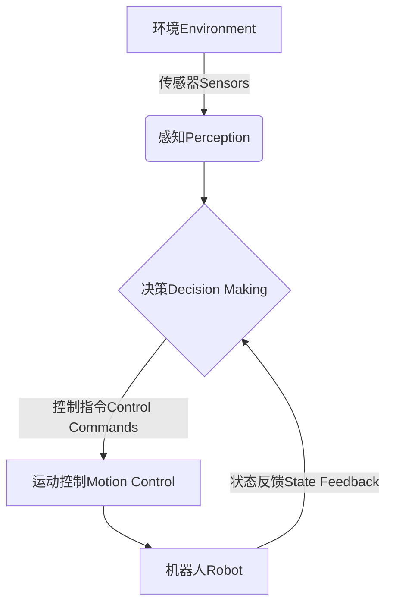

下面是以《一切皆是映射：强化学习在机器人控制中的应用：挑战与策略》为主题的技术博客文章正文内容：

# 一切皆是映射：强化学习在机器人控制中的应用：挑战与策略

## 1. 背景介绍

### 1.1 问题的由来

机器人技术的发展为人类社会带来了巨大的变革。从工业生产线到家庭服务,机器人正在逐步渗透到我们生活的方方面面。然而,要实现高度自主化和智能化的机器人控制,仍然面临着诸多挑战。传统的机器人控制系统主要依赖于人工编写的规则和算法,这种方式存在一些固有的局限性:

1. 规则库的构建需要大量的人工经验积累,且难以覆盖所有可能的情况。
2. 算法的设计往往是基于理想环境的假设,在复杂动态环境中可能失效。
3. 人工编写的规则和算法缺乏自适应和学习能力,难以应对不断变化的环境。

为了克服这些局限性,研究人员开始探索机器学习技术在机器人控制领域的应用,其中强化学习(Reinforcement Learning)因其独特的优势而备受关注。

### 1.2 研究现状

强化学习是一种基于奖励或惩罚的机器学习范式,其目标是通过与环境的交互,学习一种最优的行为策略,从而最大化预期的累积奖励。近年来,强化学习在机器人控制领域取得了令人瞩目的进展,例如:

- DeepMind的AlphaGo系统通过强化学习战胜了人类顶尖围棋手。
- OpenAI的机器人手臂通过强化学习学会了各种复杂的操作任务。
- UC Berkeley的四足机器人通过强化学习实现了高度稳健的步态控制。

这些成功案例展示了强化学习在机器人控制中的巨大潜力。然而,将强化学习应用于实际的机器人控制任务仍然面临着诸多挑战。

### 1.3 研究意义

强化学习在机器人控制中的应用具有重要的理论和实践意义:

1. **理论意义**:机器人控制问题为强化学习算法的发展提供了新的研究课题和驱动力,促进了算法的改进和创新。同时,机器人控制任务也为验证和评估强化学习算法的性能提供了新的测试平台。

2. **实践意义**:通过强化学习,我们可以开发出更加智能、自主和鲁棒的机器人控制系统,从而推动机器人技术在各个领域的广泛应用,提高生产效率,降低人力成本,并为人类社会带来巨大的经济和社会效益。

### 1.4 本文结构

本文将全面探讨强化学习在机器人控制中的应用。首先,我们将介绍强化学习和机器人控制的核心概念,并阐述它们之间的内在联系。接下来,我们将深入剖析强化学习在机器人控制中的核心算法原理和具体操作步骤,并讨论其优缺点和应用领域。然后,我们将详细阐述相关的数学模型和公式,并通过案例分析加深理解。此外,我们还将分享一个实际的项目实践,包括开发环境搭建、源代码实现、代码解读和运行结果展示。最后,我们将探讨强化学习在机器人控制领域的实际应用场景,介绍相关的工具和资源,并总结未来的发展趋势和面临的挑战。

## 2. 核心概念与联系

在深入探讨强化学习在机器人控制中的应用之前,我们需要先了解两个核心概念:强化学习和机器人控制。

**强化学习(Reinforcement Learning)**是一种基于奖励或惩罚的机器学习范式。它的目标是通过与环境的交互,学习一种最优的行为策略,从而最大化预期的累积奖励。强化学习的核心思想是"试错学习",即通过不断尝试不同的行为,根据获得的奖励或惩罚来调整策略,最终找到最优策略。

强化学习系统通常由以下几个关键组件组成:

1. **环境(Environment)**:强化学习智能体所处的外部世界,它可以是真实的物理环境,也可以是模拟的虚拟环境。
2. **状态(State)**:描述环境当前状态的一组观测值。
3. **行为(Action)**:智能体可以在当前状态下采取的一系列可能的行为。
4. **奖励函数(Reward Function)**:根据智能体的行为和环境状态变化,给出一个数值奖励或惩罚。
5. **策略(Policy)**:智能体在每个状态下选择行为的策略,它是强化学习算法需要学习的目标。

强化学习算法的目标是找到一种最优策略,使得在给定的环境中,智能体可以获得最大的预期累积奖励。

**机器人控制(Robot Control)**是指控制机器人执行各种任务的技术和方法。机器人控制系统需要根据环境的变化和任务需求,实时调整机器人的运动轨迹、关节角度、执行器力矩等,以实现期望的运动和行为。

机器人控制系统通常包括以下几个关键组件:

1. **感知(Perception)**:通过各种传感器(如视觉、激光、力觉等)获取环境信息和机器人自身状态。
2. **决策(Decision Making)**:根据感知到的信息,决定机器人应该采取何种行为。
3. **运动控制(Motion Control)**:将决策转化为具体的控制指令,驱动机器人的执行器(如电机、液压缸等)运动。
4. **反馈(Feedback)**:监测机器人的实际运动状态,并将信息反馈给决策模块,形成闭环控制。

强化学习和机器人控制之间存在着内在的联系:

1. **决策过程的相似性**:强化学习智能体需要根据当前状态选择最优行为,而机器人控制系统也需要根据感知到的信息做出决策。两者都涉及到一个序列决策过程。

2. **环境交互的必要性**:强化学习算法需要通过与环境的交互来学习最优策略,而机器人也需要与物理世界进行交互才能完成任务。

3. **奖励函数与任务目标**:强化学习中的奖励函数相当于机器人控制任务的目标函数,都是需要优化的目标。

4. **策略与控制算法**:强化学习算法学习的策略,相当于机器人控制系统中的控制算法。

由于这种内在联系,强化学习在机器人控制领域具有广阔的应用前景。通过将强化学习算法应用于机器人控制系统,我们可以让机器人具备自主学习和自适应的能力,从而更好地应对复杂动态环境,提高控制性能和任务完成率。

## 3. 核心算法原理与具体操作步骤

### 3.1 算法原理概述

在强化学习中,我们需要找到一种最优策略$\pi^*$,使得在给定的马尔可夫决策过程(Markov Decision Process, MDP)环境中,智能体可以获得最大的预期累积奖励。MDP可以用一个元组$(S, A, P, R, \gamma)$来表示,其中:

- $S$是状态空间,表示所有可能的环境状态。
- $A$是行为空间,表示在每个状态下智能体可以采取的行为。
- $P(s'|s,a)$是状态转移概率,表示在状态$s$下执行行为$a$后,转移到状态$s'$的概率。
- $R(s,a)$是奖励函数,表示在状态$s$下执行行为$a$后获得的即时奖励。
- $\gamma \in [0,1)$是折现因子,用于平衡即时奖励和长期累积奖励的权重。

我们的目标是找到一种策略$\pi^*$,使得在任意初始状态$s_0$下,预期的累积奖励$G_t$最大化:

$$
\pi^* = \arg\max_\pi \mathbb{E}_\pi \left[ G_t \right], \quad \text{where} \quad G_t = \sum_{k=0}^\infty \gamma^k R(s_t, a_t)
$$

强化学习算法通常采用价值函数(Value Function)或者直接策略搜索(Policy Search)的方式来学习最优策略。

**价值函数方法**:

1. 定义状态价值函数$V^\pi(s)$,表示在策略$\pi$下,从状态$s$开始,预期的累积奖励:

$$
V^\pi(s) = \mathbb{E}_\pi \left[ G_t | s_t = s \right]
$$

2. 定义行为价值函数$Q^\pi(s,a)$,表示在策略$\pi$下,从状态$s$执行行为$a$开始,预期的累积奖励:

$$
Q^\pi(s,a) = \mathbb{E}_\pi \left[ G_t | s_t = s, a_t = a \right]
$$

3. 通过迭代更新$V^\pi(s)$或$Q^\pi(s,a)$,直到收敛,得到最优价值函数$V^*(s)$或$Q^*(s,a)$。
4. 根据最优价值函数,推导出最优策略$\pi^*$。

**直接策略搜索方法**:

1. 参数化策略$\pi_\theta(a|s)$,其中$\theta$是策略的参数向量。
2. 定义目标函数$J(\theta)$,表示在参数化策略$\pi_\theta$下,预期的累积奖励。
3. 通过策略梯度算法等优化方法,直接优化目标函数$J(\theta)$,找到最优策略参数$\theta^*$。

这两种方法各有优缺点,价值函数方法更加稳定和高效,但需要构建精确的环境模型;而直接策略搜索方法更加通用,但收敛速度较慢,容易陷入局部最优。在实际应用中,我们往往会结合两种方法的优点,采用Actor-Critic算法等混合策略。

### 3.2 算法步骤详解

接下来,我们将以Q-Learning算法为例,详细介绍强化学习算法的具体操作步骤。Q-Learning是一种基于时序差分(Temporal Difference)的无模型(Model-free)强化学习算法,它直接学习行为价值函数$Q(s,a)$,而无需构建环境的显式模型。

Q-Learning算法的基本思想是:智能体在每个时间步与环境交互,观测当前状态$s_t$,选择一个行为$a_t$,执行该行为并观测到下一个状态$s_{t+1}$和即时奖励$r_{t+1}$。然后,根据贝尔曼方程(Bellman Equation)更新$Q(s_t,a_t)$的估计值,使其朝着真实的$Q^*(s_t,a_t)$收敛。

算法步骤如下:

1. 初始化Q表格,对于所有的$(s,a)$对,将$Q(s,a)$初始化为任意值(通常为0)。
2. 对于每个时间步$t$:
    a. 观测当前状态$s_t$。
    b. 根据$\epsilon$-贪婪策略选择行为$a_t$:
        - 以概率$\epsilon$随机选择一个行为(探索)。
        - 以概率$1-\epsilon$选择在当前状态下Q值最大的行为(利用)。
    c. 执行选择的行为$a_t$,观测到下一个状态$s_{t+1}$和即时奖励$r_{t+1}$。
    d. 更新$Q(s_t,a_t)$的估计值:

$$
Q(s_t,a_t) \leftarrow Q(s_t,a_t) + \alpha \left[ r_{t+1} + \gamma \max_a Q(s_{t+1},a) - Q(s_