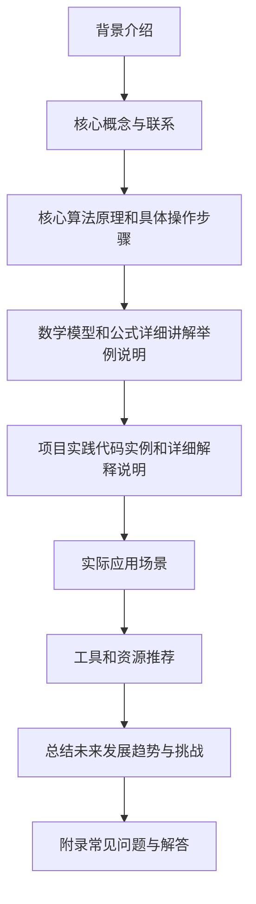
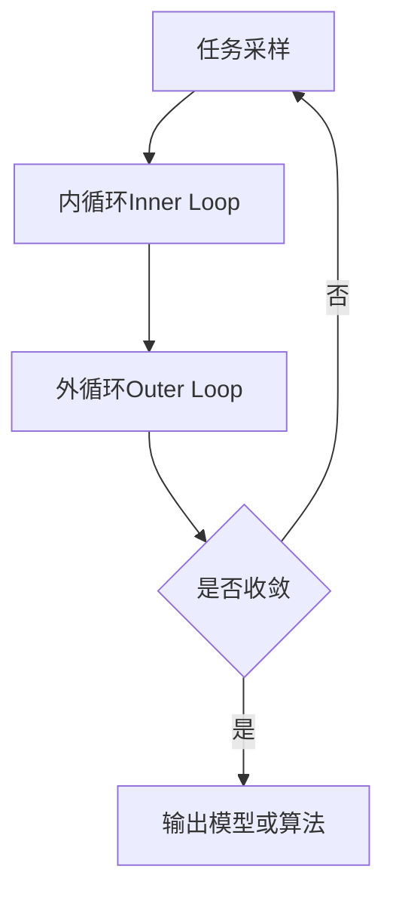

# 一切皆是映射：解读AI元学习（Meta-learning）概念

## 1. 背景介绍

### 1.1 问题的由来

在传统的机器学习中，我们通常需要为每个新任务收集大量的标记数据，并从头开始训练一个新的模型。然而，这种方式存在以下几个挑战：

1. **数据标注成本高昂**：为每个新任务收集和标注大量数据是一项昂贵且耗时的工作。
2. **缺乏泛化能力**：在新的任务和环境下，由于数据分布的差异，模型的泛化能力往往较差。
3. **计算资源浪费**：为每个新任务重新训练模型会导致大量计算资源的浪费。

为了解决这些挑战，元学习(Meta-learning)应运而生。

### 1.2 研究现状

元学习旨在从多个相关任务中学习元知识(meta-knowledge)，从而加快新任务的学习速度并提高泛化能力。近年来，元学习在计算机视觉、自然语言处理、强化学习等多个领域取得了令人瞩目的进展。

一些典型的元学习方法包括:

- **基于优化的元学习**：如 MAML、Reptile 等,旨在学习一个良好的初始化,使得在新任务上只需少量数据和少量梯度更新即可获得良好的性能。
- **基于度量学习的元学习**：如 Matching Networks、Relation Networks 等,通过学习一个好的相似度度量,实现快速学习新概念。
- **基于生成模型的元学习**：如 GAIL、BAIR 等,通过生成模型对任务进行建模,实现快速适应新环境。

### 1.3 研究意义

元学习为人工智能系统带来了以下重要意义:

1. **加快学习新任务的速度**:通过从先前任务中学习到的知识,系统可以更快地学习新任务,减少对大量标记数据的依赖。
2. **提高泛化能力**:元学习可以提高模型在新环境和新分布下的泛化能力,使得系统更加鲁棒。
3. **提高计算效率**:通过共享知识,元学习可以避免为每个新任务重新训练模型,从而节省计算资源。
4. **促进人工智能的发展**:元学习有望使人工智能系统具备类似人类的快速学习和迁移能力,推动人工智能向通用人工智能(AGI)的发展。

### 1.4 本文结构

本文将全面解读元学习的核心概念、算法原理、数学模型、实践案例和应用场景。文章主要结构如下:

## 2. 核心概念与联系

元学习(Meta-learning)是机器学习中一个重要的研究方向,旨在设计能够快速学习新任务的学习算法。它与其他一些相关概念有着密切联系:

1. **迁移学习(Transfer Learning)**:通过将从源域学习到的知识迁移到目标域,提高目标任务的学习效率。元学习可以看作是一种特殊的迁移学习,不同之处在于元学习强调从多个任务中学习如何快速学习新任务。

2. **少样本学习(Few-Shot Learning)**:能够在极少量标记样本下学习新概念或新任务。元学习为少样本学习提供了一种有效的解决方案。

3. **多任务学习(Multi-Task Learning)**:同时学习多个相关任务,提高每个单一任务的性能。元学习可以看作是一种特殊的多任务学习,不同之处在于元学习强调从多个任务中学习如何快速学习新任务。

4. **生成模型(Generative Models)**:通过生成模型对任务进行建模,实现快速适应新环境。一些基于生成模型的元学习方法利用生成模型来捕获任务之间的相关性。

5. **强化学习(Reinforcement Learning)**:通过与环境交互来学习最优策略。元学习与强化学习的结合可以加快强化学习在新环境下的学习速度。

6. **因果推理(Causal Inference)**:研究因果关系,推断干预的效果。元学习可以帮助因果推理更好地泛化到新的环境和分布。

元学习与这些相关概念相互借鉴、相互促进,共同推动着人工智能领域的发展。

## 3. 核心算法原理和具体操作步骤

### 3.1 算法原理概述

元学习算法的核心思想是:在一系列相关但不同的任务上进行训练,从而学习到一个能够快速适应新任务的初始化模型或学习算法。具体来说,元学习算法通常包含以下几个关键步骤:

1. **任务采样**:从任务分布中采样一批相关但不同的任务。
2. **内循环(Inner Loop)**:在每个任务上进行少量梯度更新或优化,模拟快速学习新任务的过程。
3. **外循环(Outer Loop)**:根据内循环的结果,更新模型参数或优化算法,使得模型或算法能够更好地适应新任务。
4. **重复上述过程**:重复任务采样、内循环和外循环,直到模型或算法收敛。

通过这种元优化(meta-optimization)的方式,元学习算法能够学习到一个良好的初始化模型或优化算法,使得在新任务上只需少量数据和少量梯度更新即可获得良好的性能。

### 3.2 算法步骤详解

以基于优化的元学习算法 MAML(Model-Agnostic Meta-Learning)为例,具体步骤如下:

1. **任务采样**:从任务分布 $p(\mathcal{T})$ 中采样一批任务 $\{\mathcal{T}_i\}_{i=1}^{N}$,每个任务 $\mathcal{T}_i$ 包含支持集(support set) $\mathcal{D}_i^{tr}$ 和查询集(query set) $\mathcal{D}_i^{val}$。

2. **内循环**:对于每个任务 $\mathcal{T}_i$,在支持集 $\mathcal{D}_i^{tr}$ 上进行少量梯度更新,得到任务特定的模型参数:

$$\theta_i' = \theta - \alpha \nabla_\theta \mathcal{L}_{\mathcal{T}_i}(f_\theta, \mathcal{D}_i^{tr})$$

其中 $f_\theta$ 是模型, $\mathcal{L}_{\mathcal{T}_i}$ 是任务 $\mathcal{T}_i$ 的损失函数, $\alpha$ 是内循环的学习率。

3. **外循环**:使用查询集 $\mathcal{D}_i^{val}$ 计算每个任务的验证损失,并对所有任务的验证损失求和,得到元损失(meta-loss):

$$\mathcal{L}_{\text{meta}}(\theta) = \sum_{i=1}^{N} \mathcal{L}_{\mathcal{T}_i}(f_{\theta_i'}, \mathcal{D}_i^{val})$$

使用元损失对模型参数 $\theta$ 进行梯度更新:

$$\theta \leftarrow \theta - \beta \nabla_\theta \mathcal{L}_{\text{meta}}(\theta)$$

其中 $\beta$ 是外循环的学习率。

4. **重复上述过程**:重复任务采样、内循环和外循环,直到模型收敛。

通过这种方式,MAML 算法能够学习到一个良好的初始化模型参数 $\theta$,使得在新任务上只需少量梯度更新即可获得良好的性能。

### 3.3 算法优缺点

**优点**:

- 能够快速适应新任务,减少对大量标记数据的依赖。
- 提高了模型在新环境和新分布下的泛化能力。
- 避免了为每个新任务重新训练模型,节省了计算资源。

**缺点**:

- 元训练过程计算开销较大,需要在多个任务上进行梯度更新。
- 对任务分布的选择较为敏感,任务分布与目标任务分布差异较大时,性能可能会下降。
- 存在任务间负迁移(negative transfer)的风险,即从某些任务中学习到的知识可能对其他任务产生负面影响。

### 3.4 算法应用领域

元学习算法已经在多个领域取得了应用,包括但不限于:

- **计算机视觉**:如少样本图像分类、目标检测、图像分割等。
- **自然语言处理**:如少样本文本分类、关系抽取、机器翻译等。
- **强化学习**:如快速适应新环境、多任务强化学习等。
- **机器人学习**:如快速学习新的机器人控制策略。
- **医疗健康**:如基于少量数据快速诊断新疾病。

## 4. 数学模型和公式详细讲解举例说明

### 4.1 数学模型构建

在元学习中,我们通常将任务建模为一个条件概率分布 $p(y|x, \mathcal{T})$,其中 $x$ 是输入, $y$ 是输出, $\mathcal{T}$ 是任务。我们的目标是学习一个能够快速适应新任务 $\mathcal{T}$ 的模型 $f_\theta$,使得在给定少量训练数据 $\mathcal{D}^{tr}$ 后,模型在测试数据 $\mathcal{D}^{val}$ 上的性能尽可能好:

$$\max_\theta \mathbb{E}_{\mathcal{T} \sim p(\mathcal{T})} \left[ \mathbb{E}_{(x, y) \sim \mathcal{D}^{val}} \left[ \log p(y|x, f_\theta(\mathcal{D}^{tr})) \right] \right]$$

其中 $p(\mathcal{T})$ 是任务分布, $f_\theta(\mathcal{D}^{tr})$ 表示在训练数据 $\mathcal{D}^{tr}$ 上对模型参数 $\theta$ 进行少量梯度更新后的模型。

由于直接优化上式是困难的,我们通常采用元学习算法进行近似优化。以 MAML 算法为例,它的目标函数可以表示为:

$$\min_\theta \mathbb{E}_{\mathcal{T} \sim p(\mathcal{T})} \left[ \mathcal{L}_{\mathcal{T}}(f_{\theta'}, \mathcal{D}^{val}) \right]$$
$$\text{s.t.} \quad \theta' = \theta - \alpha \nabla_\theta \mathcal{L}_{\mathcal{T}}(f_\theta, \mathcal{D}^{tr})$$

其中 $\mathcal{L}_{\mathcal{T}}$ 是任务 $\mathcal{T}$ 的损失函数, $\alpha$ 是内循环的学习率。MAML 算法通过在内循环中模拟快速学习新任务的过程,在外循环中优化模型参数 $\theta$,使得在新任务上只需少量梯度更新即可获得良好的性能。

### 4.2 公式推导过程

以 MAML 算法为例,我们来推导一下它的梯度更新公式。

首先,我们定义元损失(meta-loss)为:

$$\mathcal{L}_{\text{meta}}(\theta) = \sum_{i=1}^{N} \mathcal{L}_{\mathcal{T}_i}(f_{\theta_i'}, \mathcal{D}_i^{val})$$

其中 $\theta_i'$ 是通过在支持集 $\mathcal{D}_i^{tr}$ 上进行少量梯度更新得到的任务特定的模型参数:

$$\theta_i' = \theta - \alpha \nabla_\theta \mathcal{L}_{\mathcal{T}_i}(f_\theta, \mathcal{D}_i^{tr})$$

我们需要计算元损失 $\mathcal{L}_{\text{meta}}(\theta)$ 对模型参数 $\theta$ 的梯度,并对 $\theta$ 进行梯度更新。根据链式法则,我们有: